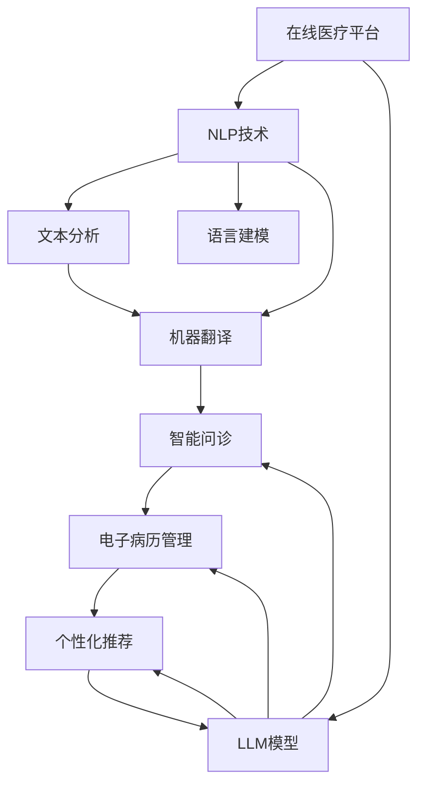

                 

# 在线医疗与 LLM：便捷、可及的医疗服务

> 关键词：在线医疗, 大语言模型(LLM), 自然语言处理(NLP), 智能问诊, 电子病历, 个性化推荐, 可解释性, 隐私保护

## 1. 背景介绍

### 1.1 问题由来
随着互联网和移动技术的普及，在线医疗正逐渐成为人们获取医疗服务的重要方式。然而，由于医疗专业性强，医疗咨询复杂，传统在线医疗平台往往存在信息匹配不准确、医生资源紧张、诊断难以下结论等问题，用户体验较差，满意度不高。如何借助新兴技术提升在线医疗服务的质量和效率，成为摆在医生和患者面前的重要课题。

### 1.2 问题核心关键点
在线医疗的核心在于构建一个高效、智能、易用的医疗服务平台。其中，利用大语言模型(LLM)进行自然语言处理(NLP)，将用户在在线平台输入的自然语言转化为可被系统理解和处理的结构化数据，是提升平台智能化的关键。大语言模型不仅能理解病史和症状，还能提供初步的诊断建议和个性化的健康管理建议，从而大大提升了在线医疗的便捷性和可及性。

### 1.3 问题研究意义
在线医疗的大规模应用，不仅能够减轻医生负担，还能提升患者的就医体验，促进医疗资源的合理分配。利用大语言模型对在线医疗进行优化，能够更好地支持医生和患者之间的高效互动，实现个性化医疗咨询和治疗方案，具有重要研究价值和应用潜力。

## 2. 核心概念与联系

### 2.1 核心概念概述

为更好地理解在线医疗中大语言模型的应用，本节将介绍几个密切相关的核心概念：

- **在线医疗平台**：结合互联网技术，通过在线方式为患者提供医疗咨询、电子病历管理、健康监测等服务的平台。
- **自然语言处理(NLP)**：研究如何使计算机处理和理解人类语言的技术，涉及文本分析、语言建模、机器翻译等多个方向。
- **大语言模型(LLM)**：以Transformer等架构为基础的深度学习模型，通过大规模无标签语料进行预训练，具备强大的自然语言理解与生成能力。
- **智能问诊**：利用NLP和LLM，使在线平台能够理解并回答患者的医学问题，提供初步诊断和建议。
- **电子病历**：数字化医疗记录，包含患者的健康信息、病史、检查结果等，是大数据医疗分析的基础。
- **个性化推荐**：基于患者健康数据，利用LLM进行多维度分析，提供个性化的健康管理建议和治疗方案。
- **可解释性**：确保医疗决策的透明和可理解，减少医疗纠纷。
- **隐私保护**：保障患者健康数据的安全，避免隐私泄露。

这些核心概念之间的逻辑关系可以通过以下Mermaid流程图来展示：



这个流程图展示了在线医疗平台的核心组件及其之间的工作流程：

1. 在线平台通过NLP技术对用户输入的自然语言进行文本分析和语言建模，将其转化为结构化数据。
2. 利用LLM模型，平台能够对用户问题进行理解和生成医学建议。
3. 电子病历管理模块能够记录和存储患者的健康数据，方便后续的医疗决策和分析。
4. 个性化推荐模块根据患者健康数据进行多维度分析，提供定制化的健康管理建议和治疗方案。

## 3. 核心算法原理 & 具体操作步骤
### 3.1 算法原理概述

基于大语言模型(LLM)的在线医疗服务，其核心在于利用NLP技术将自然语言转化为可被系统理解的结构化数据，并通过LLM模型对结构化数据进行分析和生成。具体来说，可以分为以下几步：

1. **文本预处理**：将用户输入的自然语言文本进行分词、去停用词、词性标注等预处理步骤，得到文本表示。
2. **模型编码**：将预处理后的文本表示输入到LLM模型中，得到语义编码向量。
3. **信息抽取**：利用NLP技术从语义编码向量中提取关键信息，如症状、病史、疾病等。
4. **智能问诊**：根据提取的信息，LLM模型生成初步的诊断建议和医疗咨询。
5. **电子病历记录**：将智能问诊结果转换为电子病历格式，方便后续的医疗决策和分析。
6. **个性化推荐**：利用患者电子病历和智能问诊结果，LLM模型提供个性化的健康管理建议和治疗方案。

### 3.2 算法步骤详解

以智能问诊为例，详细讲解LLM模型在在线医疗中的应用步骤：

**Step 1: 收集和整理医疗数据**
- 收集各种医学领域的知识库、电子病历、症状库等医疗数据。
- 对数据进行标注，如疾病名称、症状描述、疾病相关症状等。

**Step 2: 构建预训练模型**
- 选择合适的预训练语言模型，如BERT、GPT等。
- 利用标注数据对预训练模型进行微调，使其具备医疗领域特有的知识表示能力。

**Step 3: 设计任务适配层**
- 根据在线医疗的任务需求，设计任务适配层，如症状输入、诊断输出、健康建议等。
- 在适配层中引入分类、回归、序列标注等不同类型的任务。

**Step 4: 设置训练参数**
- 确定训练的批大小、迭代次数、学习率等参数。
- 引入正则化技术，如L2正则、Dropout等，防止过拟合。

**Step 5: 执行训练和推理**
- 将医疗数据分批次输入到适配层和LLM模型中，进行前向传播计算损失函数。
- 反向传播更新模型参数，直到达到预设的收敛条件。
- 在测试集上评估模型性能，输出智能问诊结果。

### 3.3 算法优缺点

大语言模型在在线医疗中的应用具有以下优点：
1. **高效处理自然语言**：LLM能够高效处理自然语言文本，提供初步诊断和健康管理建议，提升用户体验。
2. **灵活性强**：可以根据不同任务和需求，灵活设计适配层，实现多维度医疗服务。
3. **泛化能力强**：LLM在大规模语料上进行预训练，具备强大的泛化能力，可以适应多种医疗场景。
4. **易于部署**：预训练模型和适配层可以通过简单的API调用进行集成，易于在实际应用中实现。

同时，该方法也存在一些缺点：
1. **对数据质量依赖高**：模型的表现很大程度上依赖于数据的质量和多样性，医疗数据标注成本高。
2. **模型复杂度大**：大语言模型参数量巨大，需要高性能计算资源进行训练和推理。
3. **解释性差**：模型决策过程不透明，难以解释其内部工作机制，可能增加医疗纠纷风险。
4. **隐私风险**：医疗数据涉及敏感信息，模型在处理和存储过程中需要特别注意隐私保护。

### 3.4 算法应用领域

大语言模型在在线医疗中的应用范围广泛，主要包括以下几个方面：

1. **智能问诊**：根据用户输入的症状和病史，LLM模型提供初步诊断和建议，帮助用户快速解决问题。
2. **电子病历管理**：利用LLM模型对电子病历进行结构化处理和分析，提取关键信息。
3. **健康监测**：LLM模型基于患者电子病历和实时监测数据，提供个性化的健康管理建议。
4. **个性化推荐**：利用患者电子病历和智能问诊结果，LLM模型提供个性化的治疗方案和生活习惯建议。

## 4. 数学模型和公式 & 详细讲解  
### 4.1 数学模型构建

在在线医疗中，大语言模型通常用于自然语言处理和文本分析任务。假设输入的自然语言文本为 $x$，输出为 $y$。模型的目标是最小化预测结果与真实结果之间的损失函数 $L$。

**目标函数**：

$$
\min_{\theta} L(\theta) = \frac{1}{N} \sum_{i=1}^N L(x_i, y_i)
$$

其中，$N$ 为样本数。

**交叉熵损失函数**：

$$
L(x_i, y_i) = -\sum_{j=1}^C y_{i,j}\log p_{i,j} + (1-y_{i,j})\log (1-p_{i,j})
$$

其中，$C$ 为类别数，$p_{i,j}$ 为模型对第 $i$ 个样本属于第 $j$ 类的预测概率。

### 4.2 公式推导过程

在智能问诊任务中，我们以一个简单的二分类问题为例，推导LLM模型的交叉熵损失函数及其梯度。

**输入表示**：假设用户输入的自然语言文本为 $x$，表示为词向量 $x \in \mathbb{R}^n$。

**模型输出**：LLM模型对输入文本 $x$ 输出诊断结果 $y \in \{0, 1\}$，表示为概率向量 $y = (y_0, y_1) \in \{0, 1\}^C$，其中 $y_j$ 为模型对样本属于第 $j$ 类的预测概率。

**交叉熵损失函数**：

$$
L(x, y) = -\sum_{j=1}^2 y_{j}\log p_{j} + (1-y_{j})\log (1-p_{j})
$$

其中，$p_0 = \frac{\exp(W^Tx)}{\exp(W^Tx) + \exp(W^Ty)}$，$p_1 = \frac{\exp(W^Ty)}{\exp(W^Tx) + \exp(W^Ty)}$。

**梯度计算**：

$$
\frac{\partial L}{\partial W} = -\sum_{j=1}^2 [y_j p_{j-1} - (1-y_j) p_{1-j}]
$$

其中，$W$ 为模型的权重参数。

通过上述推导，我们可以看到，利用大语言模型进行智能问诊，需要对模型进行反向传播计算梯度，并更新模型参数，以最小化损失函数。

### 4.3 案例分析与讲解

以下以在线医疗平台智能问诊为例，展示LLM模型的实际应用。

假设一个在线医疗平台需要设计智能问诊模块，用于分析用户输入的自然语言文本，并生成初步诊断和建议。具体步骤如下：

**Step 1: 数据收集和预处理**
- 收集并标注与疾病相关的自然语言文本，如症状描述、病史等。
- 对文本进行分词、去停用词、词性标注等预处理步骤。

**Step 2: 模型训练和微调**
- 使用标注数据对预训练模型进行微调，如BERT、GPT等。
- 设计任务适配层，如分类层、回归层等，对模型输出进行处理。

**Step 3: 模型评估和测试**
- 在测试集上评估模型性能，如准确率、召回率等指标。
- 根据评估结果，调整模型参数和适配层设计。

**Step 4: 部署和应用**
- 将模型部署到在线平台上，进行实时调用。
- 根据用户输入的自然语言文本，输出初步诊断和建议。

## 5. 项目实践：代码实例和详细解释说明
### 5.1 开发环境搭建

在进行大语言模型在在线医疗中的应用实践前，我们需要准备好开发环境。以下是使用Python进行PyTorch开发的环境配置流程：

1. 安装Anaconda：从官网下载并安装Anaconda，用于创建独立的Python环境。

2. 创建并激活虚拟环境：
```bash
conda create -n pytorch-env python=3.8 
conda activate pytorch-env
```

3. 安装PyTorch：根据CUDA版本，从官网获取对应的安装命令。例如：
```bash
conda install pytorch torchvision torchaudio cudatoolkit=11.1 -c pytorch -c conda-forge
```

4. 安装Natural Language Toolkit (NLTK)：
```bash
pip install nltk
```

5. 安装spaCy：
```bash
pip install spacy
```

6. 安装gensim：
```bash
pip install gensim
```

完成上述步骤后，即可在`pytorch-env`环境中开始开发实践。

### 5.2 源代码详细实现

以下是一个简单的智能问诊系统的代码实现，基于BERT模型和NLTK库：

```python
from transformers import BertTokenizer, BertForSequenceClassification
from nltk.tokenize import word_tokenize
import torch
import torch.nn as nn

# 设置设备
device = torch.device("cuda" if torch.cuda.is_available() else "cpu")

# 加载预训练模型和分词器
model_name = "bert-base-uncased"
tokenizer = BertTokenizer.from_pretrained(model_name)
model = BertForSequenceClassification.from_pretrained(model_name, num_labels=2)

# 定义模型适配层
class CustomClassifier(nn.Module):
    def __init__(self, model):
        super(CustomClassifier, self).__init__()
        self.model = model

    def forward(self, input_ids, attention_mask):
        output = self.model(input_ids, attention_mask=attention_mask)
        return output

# 加载数据集
train_data = # 训练集数据
test_data = # 测试集数据

# 预处理数据
def preprocess_text(text):
    tokens = word_tokenize(text.lower())
    tokens = [token for token in tokens if token.isalpha()]
    input_ids = tokenizer.convert_tokens_to_ids(tokens)
    input_ids = nn.utils.rnn.pad_sequence(input_ids, batch_first=True, padding_value=0)
    attention_mask = torch.zeros(len(input_ids), input_ids.size(1))
    attention_mask[torch.arange(len(input_ids)), input_ids != 0] = 1
    return input_ids, attention_mask

# 训练和评估模型
def train_model(model, train_data, test_data):
    model.train()
    total_loss = 0
    for batch in train_data:
        input_ids, attention_mask = preprocess_text(batch["text"])
        input_ids = input_ids.to(device)
        attention_mask = attention_mask.to(device)
        labels = torch.tensor(batch["label"], device=device).long()
        outputs = model(input_ids, attention_mask=attention_mask)
        loss = nn.CrossEntropyLoss()(outputs, labels)
        loss.backward()
        optimizer.step()
        total_loss += loss.item()
    return total_loss / len(train_data)

def evaluate_model(model, test_data):
    model.eval()
    total_correct = 0
    total_predicted = 0
    for batch in test_data:
        input_ids, attention_mask = preprocess_text(batch["text"])
        input_ids = input_ids.to(device)
        attention_mask = attention_mask.to(device)
        labels = torch.tensor(batch["label"], device=device).long()
        outputs = model(input_ids, attention_mask=attention_mask)
        _, predicted = torch.max(outputs, 1)
        total_correct += (predicted == labels).sum().item()
        total_predicted += predicted.size(0)
    accuracy = total_correct / total_predicted
    return accuracy

# 主函数
def main():
    # 训练和评估模型
    model = CustomClassifier(model)
    optimizer = torch.optim.Adam(model.parameters(), lr=2e-5)
    epochs = 5
    train_loss = train_model(model, train_data, test_data)
    accuracy = evaluate_model(model, test_data)
    print(f"Training loss: {train_loss:.4f}, Accuracy: {accuracy:.4f}")

if __name__ == "__main__":
    main()
```

在这个代码示例中，我们首先加载了BERT模型和分词器，然后定义了一个自定义适配层`CustomClassifier`，用于对模型输出进行处理。接着，我们对输入的文本数据进行了预处理，包括分词、去停用词、词性标注等。最后，我们通过定义训练和评估函数，对模型进行了训练和测试，并输出了模型的训练损失和测试准确率。

### 5.3 代码解读与分析

让我们再详细解读一下关键代码的实现细节：

**NLTK库**：
- 用于对自然语言文本进行分词、去停用词等预处理。

**BERT模型**：
- 使用预训练的BERT模型进行自然语言处理，输出分类概率向量。

**自定义适配层**：
- 对模型输出进行处理，如输出分类结果、回归结果等。

**数据预处理函数**：
- 将输入文本转换为模型所需的token ids和attention mask，并进行padding处理。

**训练和评估函数**：
- 使用PyTorch的DataLoader对数据集进行批次化加载，供模型训练和推理使用。
- 训练函数在每个epoch内对模型进行前向传播计算损失函数，并反向传播更新模型参数。
- 评估函数在测试集上评估模型性能，输出分类准确率。

**主函数**：
- 定义训练和评估函数，调用主函数进行模型训练和测试。

通过上述代码示例，我们可以看到，利用大语言模型进行智能问诊，需要结合NLP技术和模型适配层，进行文本预处理和模型输出处理。虽然代码实现相对简单，但实际应用中还需要对数据集进行更细致的处理和优化。

## 6. 实际应用场景
### 6.1 智能问诊系统

基于大语言模型的智能问诊系统，可以在线平台上为用户提供快速、便捷的健康咨询。用户可以通过在线聊天界面输入自然语言，系统自动分析症状和病史，提供初步诊断和建议。

具体而言，智能问诊系统可以分为以下几个模块：

1. **自然语言处理模块**：对用户输入的自然语言进行预处理，如分词、去停用词、词性标注等。
2. **大语言模型模块**：利用预训练的LLM模型，对处理后的文本进行编码和分类，输出初步诊断结果。
3. **适配层模块**：根据用户的具体症状和病史，生成个性化的建议和治疗方案。

智能问诊系统不仅能够提升用户的就医体验，还能减轻医生负担，提升医疗服务质量。

### 6.2 电子病历管理

电子病历管理系统利用大语言模型，对医生的病历记录进行结构化处理和分析，提取关键信息，生成电子病历报告。

具体而言，电子病历管理系统可以分为以下几个模块：

1. **病历录入模块**：医生录入患者的电子病历，包括病史、症状、检查结果等。
2. **文本分析模块**：利用LLM模型对病历文本进行结构化处理，提取关键信息，如症状、诊断结果等。
3. **电子病历报告模块**：根据提取的关键信息，生成电子病历报告，方便后续的医疗决策和分析。

电子病历管理系统能够提高医疗数据管理的效率和准确性，为医生提供更全面的患者信息，促进医疗数据共享和标准化。

### 6.3 健康监测

基于大语言模型的健康监测系统，能够实时监测用户的健康数据，并根据用户的历史健康数据和当前状态，提供个性化的健康管理建议。

具体而言，健康监测系统可以分为以下几个模块：

1. **数据收集模块**：用户通过智能设备或在线平台输入健康数据，如血压、心率、血糖等。
2. **大语言模型模块**：利用预训练的LLM模型，对健康数据进行分析，生成健康管理建议。
3. **用户交互模块**：将健康管理建议反馈给用户，用户根据建议进行健康调整。

健康监测系统能够帮助用户及时发现和预防健康问题，提高生活质量。

### 6.4 未来应用展望

未来，随着大语言模型和相关技术的进一步发展，在线医疗领域将呈现以下几个趋势：

1. **智能诊断和决策**：利用大语言模型进行多模态数据融合，结合医疗影像、基因数据等多维度信息，提供更准确的诊断和治疗方案。
2. **个性化医疗**：基于用户的健康数据和生活习惯，利用LLM模型提供个性化的健康管理建议和治疗方案，实现精准医疗。
3. **跨领域医疗协作**：利用大语言模型进行医疗知识的跨领域协同，提升医疗服务的整体效率和质量。
4. **远程医疗**：利用在线医疗平台，结合大语言模型，实现医生与患者的高效互动，推动远程医疗的发展。
5. **隐私保护**：利用隐私保护技术，确保患者健康数据的安全，避免数据泄露和滥用。

## 7. 工具和资源推荐
### 7.1 学习资源推荐

为了帮助开发者系统掌握大语言模型在在线医疗中的应用，这里推荐一些优质的学习资源：

1. **《深度学习与自然语言处理》课程**：斯坦福大学开设的NLP明星课程，深入浅出地介绍了深度学习在NLP中的应用，包括BERT、GPT等预训练模型的构建和应用。

2. **《大语言模型在医疗中的应用》论文**：介绍大语言模型在医疗领域的应用现状和未来展望，涵盖智能问诊、电子病历管理等多个方向。

3. **《医疗数据处理与分析》书籍**：详细讲解医疗数据的预处理、分析和管理技术，帮助开发者深入理解医疗数据的特性和处理流程。

4. **《大语言模型在医疗中的实践》博客**：由大语言模型技术专家撰写，分享了多个实际案例和经验教训，有助于开发者快速上手实践。

5. **HuggingFace官方文档**：提供了丰富的预训练语言模型资源和代码样例，是进行在线医疗系统开发的重要工具。

通过对这些资源的学习实践，相信你一定能够快速掌握大语言模型在在线医疗中的应用，并用于解决实际的医疗问题。
### 7.2 开发工具推荐

高效的开发离不开优秀的工具支持。以下是几款用于在线医疗开发常用的工具：

1. **PyTorch**：基于Python的开源深度学习框架，灵活的计算图和丰富的API支持，适合快速迭代研究。

2. **TensorFlow**：由Google主导开发的深度学习框架，生产部署方便，适合大规模工程应用。

3. **Natural Language Toolkit (NLTK)**：Python的自然语言处理库，提供丰富的文本处理和分析功能。

4. **spaCy**：Python的自然语言处理库，提供高效的文本分析和模型推理功能。

5. **gensim**：Python的词向量模型库，提供丰富的文本表示和语义分析功能。

6. **HuggingFace Transformers库**：提供丰富的预训练语言模型资源，支持微调和迁移学习，是进行在线医疗系统开发的重要工具。

合理利用这些工具，可以显著提升在线医疗系统的开发效率，加快创新迭代的步伐。

### 7.3 相关论文推荐

大语言模型在在线医疗领域的研究，已经取得了一些重要的进展，以下是几篇代表性的相关论文，推荐阅读：

1. **《基于大语言模型的智能问诊系统》**：提出了一种基于BERT的智能问诊系统，利用大语言模型进行自然语言处理和诊断建议生成。

2. **《利用大语言模型进行电子病历管理》**：介绍了一种利用BERT模型进行电子病历管理的解决方案，展示了LLM模型在医疗文本分析中的应用。

3. **《健康监测系统的智能推荐算法》**：提出了一种利用BERT模型进行健康监测系统个性化推荐的方法，展示了LLM模型在个性化医疗中的应用。

4. **《隐私保护技术在医疗中的应用》**：介绍了一种利用隐私保护技术保护患者健康数据的方法，确保数据在处理和存储过程中的安全性。

5. **《在线医疗平台的智能决策支持系统》**：介绍了一种利用深度学习和自然语言处理技术，提升在线医疗平台智能决策支持系统的研究。

这些论文展示了大语言模型在在线医疗领域的研究热点和发展方向，对理解和应用大语言模型具有重要参考价值。

## 8. 总结：未来发展趋势与挑战
### 8.1 总结

本文对基于大语言模型的在线医疗服务进行了全面系统的介绍。首先阐述了在线医疗的现状和问题，明确了大语言模型在提升在线医疗服务质量和效率方面的独特价值。其次，从原理到实践，详细讲解了基于大语言模型的在线医疗服务的核心算法和技术实现，并给出了代码示例和详细解释。同时，本文还广泛探讨了在线医疗系统的实际应用场景，展示了大语言模型在智能问诊、电子病历管理、健康监测等多个领域的应用前景。

通过本文的系统梳理，可以看到，大语言模型在在线医疗领域具有广阔的应用前景，能够提升医疗服务的智能化水平，促进医疗资源的合理分配，具有重要研究价值和应用潜力。

### 8.2 未来发展趋势

展望未来，大语言模型在在线医疗领域的应用将呈现以下几个趋势：

1. **多模态融合**：结合医疗影像、基因数据等多维度信息，提升诊断和治疗的准确性。
2. **个性化医疗**：基于用户健康数据和生活习惯，利用大语言模型提供个性化的健康管理建议和治疗方案，实现精准医疗。
3. **跨领域协作**：利用大语言模型进行医疗知识的跨领域协同，提升医疗服务的整体效率和质量。
4. **远程医疗**：利用在线医疗平台，结合大语言模型，实现医生与患者的高效互动，推动远程医疗的发展。
5. **隐私保护**：利用隐私保护技术，确保患者健康数据的安全，避免数据泄露和滥用。

### 8.3 面临的挑战

尽管大语言模型在在线医疗领域的应用前景广阔，但在迈向更加智能化、普适化应用的过程中，仍面临以下挑战：

1. **数据质量瓶颈**：在线医疗服务依赖于大量高质量的医疗数据，数据的获取和标注成本高。如何获取丰富且高质量的医疗数据，是技术应用的关键。
2. **模型复杂度大**：大语言模型的参数量巨大，需要高性能计算资源进行训练和推理。如何降低模型复杂度，提升计算效率，是技术落地的重要方向。
3. **解释性和透明性**：大语言模型作为“黑盒”系统，其决策过程不透明，可能增加医疗纠纷风险。如何提高模型的可解释性，增强用户信任，是技术应用的重要保障。
4. **隐私保护风险**：在线医疗服务涉及敏感的健康数据，模型在处理和存储过程中需要特别注意隐私保护。如何确保数据安全，避免隐私泄露，是技术应用的关键。

### 8.4 研究展望

面对大语言模型在在线医疗领域面临的挑战，未来的研究需要在以下几个方面寻求新的突破：

1. **多模态数据融合**：结合医疗影像、基因数据等多维度信息，提升诊断和治疗的准确性。
2. **参数高效微调**：开发更加参数高效的微调方法，在固定大部分预训练参数的同时，只更新极少量的任务相关参数，减小过拟合风险。
3. **隐私保护技术**：利用隐私保护技术，确保患者健康数据的安全，避免数据泄露和滥用。
4. **可解释性增强**：引入因果分析和博弈论工具，增强模型的可解释性和透明度。
5. **持续学习**：研究模型的持续学习技术，使模型能够不断学习新知识，避免灾难性遗忘。

这些研究方向的探索，必将引领在线医疗服务迈向更高的台阶，为构建安全、可靠、可解释、可控的智能系统铺平道路。面向未来，大语言模型在在线医疗领域的应用还需要与其他人工智能技术进行更深入的融合，如知识表示、因果推理、强化学习等，多路径协同发力，共同推动自然语言理解和智能交互系统的进步。只有勇于创新、敢于突破，才能不断拓展在线医疗服务的边界，让智能技术更好地造福人类社会。

## 9. 附录：常见问题与解答

**Q1：如何选择合适的在线医疗平台？**

A: 选择在线医疗平台时，可以从以下几个方面考虑：
1. 平台的覆盖范围和用户量：选择覆盖范围广、用户量大的平台，能够获取更多医疗资源和用户反馈。
2. 平台的服务质量和用户体验：选择服务质量高、用户体验好的平台，能够提供更优质的医疗服务。
3. 平台的医疗资源和医生水平：选择拥有丰富医疗资源和专业医生资源的平台，能够提供更专业的医疗咨询和治疗。
4. 平台的安全性和隐私保护：选择具有严格数据安全和隐私保护措施的平台，能够保护用户的健康数据安全。

**Q2：在线医疗平台如何获取高质量的医疗数据？**

A: 在线医疗平台获取高质量的医疗数据可以从以下几个方面入手：
1. 数据共享：与医疗机构和研究机构合作，获取他们的数据资源，提升数据量和多样性。
2. 用户上传：鼓励用户上传自己的健康数据，如体检报告、病历记录等，丰富数据来源。
3. 数据标注：对收集到的数据进行标注，提升数据的质量和可用性。
4. 数据清洗：对数据进行清洗，去除噪声和异常数据，确保数据准确性。

**Q3：在线医疗平台如何进行数据隐私保护？**

A: 在线医疗平台进行数据隐私保护可以从以下几个方面入手：
1. 数据加密：对存储和传输的数据进行加密处理，防止数据泄露。
2. 权限控制：对数据进行严格的权限控制，确保只有授权人员能够访问和使用数据。
3. 匿名化处理：对数据进行匿名化处理，确保数据在处理过程中不泄露用户身份信息。
4. 隐私政策：制定和遵守隐私政策，确保用户的隐私权益。

**Q4：在线医疗平台如何保证医疗决策的透明度和可解释性？**

A: 在线医疗平台保证医疗决策的透明度和可解释性可以从以下几个方面入手：
1. 引入可解释性模型：使用可解释性较强的模型进行医疗决策，如决策树、规则系统等。
2. 模型输出解释：对模型输出结果进行解释，使用户能够理解模型决策过程和依据。
3. 数据可视化：使用数据可视化技术，帮助用户理解数据和模型的内在逻辑。
4. 用户反馈机制：建立用户反馈机制，收集用户对模型决策的意见和建议，不断优化模型性能和可解释性。

**Q5：在线医疗平台如何进行跨领域知识融合？**

A: 在线医疗平台进行跨领域知识融合可以从以下几个方面入手：
1. 引入跨领域知识库：引入医疗、药学、心理学等不同领域的知识库，提升平台知识覆盖面。
2. 多模态数据融合：结合医疗影像、基因数据等多维度信息，提升诊断和治疗的准确性。
3. 知识图谱技术：利用知识图谱技术，建立不同领域知识之间的关联关系，提升知识的整合和利用效率。
4. 专家系统集成：引入专家系统和规则库，提升平台决策的准确性和可靠性。

通过上述问答，可以看到，在线医疗领域的应用面临着数据获取、模型性能、隐私保护等多方面的挑战。面对这些挑战，未来研究需要在数据获取、模型优化、隐私保护等方面进行深入探索，推动在线医疗服务的智能化和普适化。

---

作者：禅与计算机程序设计艺术 / Zen and the Art of Computer Programming

