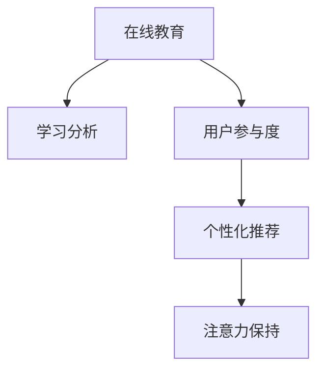

                 

# 在线教育平台的注意力保持策略

> 关键词：在线教育, 注意力保持, 学习分析, 用户参与度, 个性化推荐

## 1. 背景介绍

### 1.1 问题由来

在线教育近年来迅猛发展，随着互联网技术的普及和教育需求的多样化，越来越多的用户选择通过网络进行学习。然而，由于在线教育的虚拟性和互动性不足，学生在学习过程中往往容易分心，注意力难以持久集中，从而影响学习效果。据统计，超过80%的学生在线学习时，会因各种干扰而中断学习，有效学习时间不足20%。因此，如何提高在线教育的注意力保持度，成为亟待解决的问题。

### 1.2 问题核心关键点

在线教育平台的用户参与度是其成功的关键。用户参与度的高低直接决定了学习效果的好坏。提高用户参与度，特别是维持用户长时间保持注意力的策略，成为了在线教育平台关注的焦点。目前，提升注意力保持度的主流方法包括学习分析、个性化推荐、用户行为建模等，本文将重点探讨这些策略的实现方法和优化技巧。

## 2. 核心概念与联系

### 2.1 核心概念概述

为更好地理解在线教育平台的注意力保持策略，本节将介绍几个密切相关的核心概念：

- 在线教育（E-Learning）：通过电子方式提供教育内容的教学活动，包括视频讲解、在线讨论、互动问答等。
- 学习分析（Learning Analytics）：利用数据分析技术，对学习过程中的数据进行收集、分析，从而支持决策和优化。
- 用户参与度（User Engagement）：衡量用户在平台上活动的频率、时长、深度等指标，反映用户对平台内容的参与程度。
- 个性化推荐（Personalized Recommendation）：根据用户的历史行为和偏好，推荐最相关、最有吸引力的内容，提升用户体验和参与度。
- 注意力保持（Attention Retention）：用户在学习过程中保持长时间集中注意力的能力，直接影响学习效果和体验。

这些核心概念之间的逻辑关系可以通过以下Mermaid流程图来展示：



这个流程图展示了这个核心概念之间的关系：

1. 在线教育通过学习分析获取用户数据。
2. 用户参与度通过对用户行为的分析，帮助平台了解用户的活跃情况。
3. 个性化推荐根据用户行为数据，推荐个性化内容。
4. 注意力保持通过学习分析和技术手段，提升用户长时间保持注意力的能力。

这些概念共同构成了在线教育平台提升用户注意力保持度的理论框架，使其能够为用户提供更具吸引力的学习体验。

## 3. 核心算法原理 & 具体操作步骤
### 3.1 算法原理概述

在线教育平台的注意力保持策略主要基于学习分析和个性化推荐技术。其核心思想是：通过分析用户的学习行为数据，提取用户兴趣和偏好，然后根据这些信息推荐最适合的内容，吸引用户持续参与，从而提升注意力保持度。

形式化地，假设用户的学习数据集为 $D=\{(x_i,y_i)\}_{i=1}^N$，其中 $x_i$ 为学习行为数据，$y_i$ 为用户参与度。注意力保持策略的目标是找到最优的推荐函数 $f$，使得：

$$
\hat{y}=f(x_i) \text{ 最大化}
$$

其中 $\hat{y}$ 为模型预测的用户参与度。

通过梯度下降等优化算法，注意力保持策略不断更新模型参数，最小化预测参与度与实际参与度之间的差异。由于用户参与度与注意力保持能力密切相关，因此通过优化用户参与度，可以间接地提升注意力保持度。

### 3.2 算法步骤详解

在线教育平台的注意力保持策略一般包括以下几个关键步骤：

**Step 1: 数据收集与预处理**
- 收集用户的学习行为数据，如浏览时长、答题正确率、视频观看次数等。
- 对数据进行清洗和归一化处理，去除异常值，统一数据格式。

**Step 2: 特征提取与建模**
- 使用特征工程技术，将原始行为数据转化为可用于建模的特征向量。
- 选择合适的机器学习算法，如随机森林、梯度提升树、深度神经网络等，建立用户参与度预测模型。

**Step 3: 个性化推荐**
- 根据用户行为数据和参与度模型，推荐用户最可能感兴趣的学习内容。
- 采用推荐算法如协同过滤、内容推荐、混合推荐等，实现个性化推荐。

**Step 4: 注意力保持干预**
- 基于用户参与度和个性化推荐结果，设计干预策略，如推送通知、邮件提醒、优化界面布局等。
- 设置定时提醒、分时段推送等策略，鼓励用户持续参与。

**Step 5: 模型评估与优化**
- 使用交叉验证等方法评估模型性能，通过A/B测试等手段比较不同干预策略的效果。
- 根据评估结果调整模型参数，优化推荐算法，提升注意力保持度。

以上是注意力保持策略的一般流程。在实际应用中，还需要针对具体平台的用户特点，对策略的各个环节进行优化设计，如改进推荐算法、增加用户反馈机制等，以进一步提升策略效果。

### 3.3 算法优缺点

基于学习分析和个性化推荐的大语言模型微调方法具有以下优点：

1. 效率高：通过分析用户数据，能够快速发现用户兴趣点，推荐相应内容。
2. 个性化：根据用户历史行为和兴趣，推荐个性化的学习内容，提升用户体验。
3. 动态性：学习分析能够实时跟踪用户行为，及时调整推荐策略，适应动态变化的用户需求。
4. 可扩展：可以根据不同平台和用户群体的特点，灵活设计策略，适应多样化的应用场景。

同时，该方法也存在一定的局限性：

1. 依赖用户数据：策略效果很大程度上取决于用户行为数据的准确性和全面性，数据缺失或不完整会影响推荐效果。
2. 对抗性攻击风险：如果用户通过各种手段欺骗平台，伪装成高兴趣用户，可能会影响策略的准确性。
3. 隐私问题：收集和分析用户数据可能涉及用户隐私，需要采取严格的数据保护措施。
4. 冷启动问题：新用户或行为稀疏的用户难以得到有效的个性化推荐，需要引入推荐算法如冷启动模型。
5. 模型复杂度高：深度学习模型复杂度高，训练和推理速度较慢，需要优化模型结构，提升计算效率。

尽管存在这些局限性，但就目前而言，基于学习分析和个性化推荐的方法仍是在线教育平台提升注意力保持度的最主流范式。未来相关研究的重点在于如何进一步降低数据收集的难度，提高推荐算法的效率和鲁棒性，同时兼顾隐私保护和用户体验。

### 3.4 算法应用领域

基于用户行为分析和个性化推荐的大语言模型微调方法，在在线教育领域已经得到了广泛的应用，覆盖了几乎所有常见场景，例如：

- 学习内容推荐：根据用户的学习历史，推荐最相关、最有吸引力的课程和学习材料。
- 学习路径规划：通过分析用户的学习进度和表现，推荐最优的学习路径，避免用户学习瓶颈。
- 学习成果评价：利用学习分析技术，评估用户的学习成果和进步，提供个性化的反馈和激励。
- 学习行为监控：实时跟踪用户的学习行为，发现异常学习状态，及时干预。
- 课程优化改进：通过学习分析技术，了解用户对课程的反馈，优化课程内容和结构。

除了上述这些经典场景外，基于学习分析和个性化推荐的方法还被创新性地应用到更多场景中，如情感分析、行为预测、智能客服等，为在线教育技术带来了新的突破。随着技术的发展和应用的深化，相信在线教育平台的用户参与度和注意力保持度将得到更有效的提升。

## 4. 数学模型和公式 & 详细讲解  
### 4.1 数学模型构建

本节将使用数学语言对基于学习分析和个性化推荐的大语言模型微调过程进行更加严格的刻画。

记用户的学习行为数据为 $x$，用户参与度为 $y$，建立用户参与度预测模型 $f$，使得：

$$
y=f(x)
$$

模型 $f$ 的形式为：

$$
f(x)=\theta_0+\theta_1 x_1 + \theta_2 x_2 + \ldots + \theta_n x_n
$$

其中 $\theta_0, \theta_1, \ldots, \theta_n$ 为模型参数。

目标是最小化预测值与真实值之间的误差，即：

$$
\mathcal{L}(\theta) = \frac{1}{N} \sum_{i=1}^N (y_i - f(x_i))^2
$$

其中 $N$ 为样本数量，$\mathcal{L}$ 为损失函数。

通过梯度下降等优化算法，不断更新模型参数 $\theta$，最小化损失函数 $\mathcal{L}$，使得预测值与真实值尽可能接近。

### 4.2 公式推导过程

以下是用户参与度预测模型的公式推导：

设用户的学习行为数据为 $x=(x_1, x_2, \ldots, x_n)$，其中 $x_i$ 为行为特征。用户参与度 $y$ 为：

$$
y = \theta_0 + \theta_1 x_1 + \theta_2 x_2 + \ldots + \theta_n x_n
$$

其中 $\theta_0, \theta_1, \ldots, \theta_n$ 为模型参数。

为了最小化预测值与真实值之间的误差，定义损失函数：

$$
\mathcal{L}(\theta) = \frac{1}{N} \sum_{i=1}^N (y_i - \theta_0 - \theta_1 x_{i1} - \theta_2 x_{i2} - \ldots - \theta_n x_{in})^2
$$

对 $\theta$ 求偏导数，得到：

$$
\frac{\partial \mathcal{L}(\theta)}{\partial \theta} = \frac{2}{N} \sum_{i=1}^N - (y_i - \theta_0 - \theta_1 x_{i1} - \theta_2 x_{i2} - \ldots - \theta_n x_{in})
$$

使用梯度下降算法更新参数：

$$
\theta \leftarrow \theta - \eta \nabla_{\theta}\mathcal{L}(\theta)
$$

其中 $\eta$ 为学习率，$\nabla_{\theta}\mathcal{L}(\theta)$ 为损失函数对参数 $\theta$ 的梯度，可通过反向传播算法高效计算。

通过上述过程，用户参与度预测模型能够实时预测用户的参与度，从而设计出更有效的个性化推荐策略，提升用户注意力保持度。

## 5. 项目实践：代码实例和详细解释说明
### 5.1 开发环境搭建

在进行微调实践前，我们需要准备好开发环境。以下是使用Python进行Scikit-learn开发的环境配置流程：

1. 安装Anaconda：从官网下载并安装Anaconda，用于创建独立的Python环境。

2. 创建并激活虚拟环境：
```bash
conda create -n py3k python=3.7 
conda activate py3k
```

3. 安装Scikit-learn：
```bash
pip install scikit-learn pandas numpy
```

4. 安装其他工具包：
```bash
pip install matplotlib seaborn
```

完成上述步骤后，即可在`py3k`环境中开始微调实践。

### 5.2 源代码详细实现

下面我们以一个简单的用户参与度预测模型为例，给出使用Scikit-learn对学习行为数据进行预测的PyTorch代码实现。

```python
import pandas as pd
from sklearn.model_selection import train_test_split
from sklearn.linear_model import LinearRegression
from sklearn.metrics import mean_squared_error, r2_score

# 读取数据
data = pd.read_csv('learning_data.csv')

# 数据预处理
features = ['study_time', 'answer_correct', 'video_watched']
X = data[features]
y = data['engagement']

# 划分训练集和测试集
X_train, X_test, y_train, y_test = train_test_split(X, y, test_size=0.2, random_state=42)

# 建立模型
model = LinearRegression()

# 训练模型
model.fit(X_train, y_train)

# 预测测试集
y_pred = model.predict(X_test)

# 评估模型
mse = mean_squared_error(y_test, y_pred)
rmse = np.sqrt(mse)
r2 = r2_score(y_test, y_pred)

print(f'RMSE: {rmse:.2f}, R^2: {r2:.2f}')
```

以上代码实现了简单的线性回归模型，用于预测用户的参与度。在实际应用中，还可以使用更复杂的模型如决策树、随机森林、神经网络等，以及更高级的特征工程技术，进一步提升模型的预测精度。

### 5.3 代码解读与分析

让我们再详细解读一下关键代码的实现细节：

**数据预处理**：
- 读取用户学习行为数据，选择与用户参与度相关的特征。
- 对特征进行归一化处理，保证数据的一致性和可比性。

**模型建立与训练**：
- 使用线性回归模型，建立用户参与度预测模型。
- 使用训练集数据，训练模型参数，最小化预测值与真实值之间的误差。

**模型预测与评估**：
- 在测试集上使用训练好的模型进行预测，得到预测结果。
- 使用均方误差和决定系数评估模型的预测精度。

**代码输出**：
- 输出模型的均方根误差和决定系数，反映模型的预测性能。

可以看到，Scikit-learn提供了一整套完善的机器学习库，使得模型训练和评估过程变得简单易懂。在实际应用中，可以根据具体需求选择适合的模型和特征工程技术，进一步提升模型的预测精度和泛化能力。

## 6. 实际应用场景
### 6.1 学习内容推荐

在线教育平台的用户参与度很大程度上取决于其是否能够提供符合用户兴趣的内容。学习内容推荐系统能够根据用户的学习行为和历史偏好，实时推荐最相关、最有吸引力的课程和学习材料，从而提高用户的注意力保持度。

在技术实现上，可以收集用户的学习记录、视频观看次数、答题正确率等行为数据，将其作为特征输入到用户参与度预测模型中，得到预测的参与度。根据预测结果，可以设计推荐算法，如协同过滤、内容推荐、混合推荐等，实现个性化的学习内容推荐。

### 6.2 学习路径规划

用户在学习过程中可能会遇到知识瓶颈，导致学习进度停滞。学习路径规划系统能够根据用户的学习进度和表现，推荐最优的学习路径，避免用户在学习瓶颈中浪费过多时间，从而提升用户的注意力保持度。

在技术实现上，可以通过对用户的学习进度、课程难度、学习时间等数据进行分析，找到用户的学习瓶颈。根据瓶颈信息，设计推荐策略，如调整学习顺序、推荐辅助课程等，帮助用户突破学习瓶颈，保持持续的学习动力。

### 6.3 学习成果评价

学习成果评价系统能够根据用户的学习行为和成绩，评估用户的学习效果和进步。通过个性化的反馈和激励，提升用户的参与度和学习动力。

在技术实现上，可以收集用户的学习记录、作业完成情况、考试成绩等数据，建立用户学习成果评估模型。根据评估结果，设计个性化的反馈策略，如奖励机制、学习计划调整等，帮助用户更好地掌握知识，提升注意力保持度。

### 6.4 学习行为监控

实时跟踪用户的学习行为，发现异常学习状态，及时干预，是提升用户注意力保持度的重要手段。学习行为监控系统能够根据用户的学习记录和行为数据，发现异常学习状态，如学习时长过短、频繁退出、答题错误率高等，从而及时提醒用户，调整学习策略。

在技术实现上，可以使用用户参与度预测模型实时监控用户的学习行为，根据预设的阈值和规则，发现异常行为。根据异常行为，设计干预策略，如推送提醒、调整学习时间等，帮助用户保持学习动力。

### 6.5 课程优化改进

通过学习分析技术，了解用户对课程的反馈，优化课程内容和结构，是提升用户注意力保持度的重要手段。课程优化改进系统能够根据用户的学习行为和反馈，分析课程内容和结构的不足，提出改进建议。

在技术实现上，可以收集用户对课程的评价和反馈数据，建立课程优化改进模型。根据模型的分析结果，设计课程改进策略，如调整教学方法、更新课程内容等，提升课程的吸引力和实用性。

## 7. 工具和资源推荐
### 7.1 学习资源推荐

为了帮助开发者系统掌握在线教育平台的注意力保持策略的理论基础和实践技巧，这里推荐一些优质的学习资源：

1. 《在线教育平台用户行为分析与优化》：由知名教育技术专家撰写，深入浅出地介绍了在线教育平台的用户行为分析方法和优化策略，提供了丰富的案例和实用技巧。

2. 《个性化推荐系统实战》：该书由推荐系统领域的权威专家撰写，详细介绍了推荐系统原理、算法实现、实战案例，适合想深入学习推荐技术的开发者。

3. 《机器学习实战》：由Coursera和斯坦福大学联合推出的在线课程，涵盖了机器学习的基本概念、算法实现和实际应用，适合初学者入门。

4. Weights & Biases：模型训练的实验跟踪工具，可以记录和可视化模型训练过程中的各项指标，方便对比和调优。与主流深度学习框架无缝集成。

5. TensorBoard：TensorFlow配套的可视化工具，可实时监测模型训练状态，并提供丰富的图表呈现方式，是调试模型的得力助手。

通过对这些资源的学习实践，相信你一定能够快速掌握在线教育平台的注意力保持策略，并用于解决实际的NLP问题。
###  7.2 开发工具推荐

高效的开发离不开优秀的工具支持。以下是几款用于在线教育平台注意力保持策略开发的常用工具：

1. Python：基于Python的开源语言，拥有丰富的第三方库和框架，适合快速迭代研究。

2. Scikit-learn：简单易用的机器学习库，提供了丰富的模型和算法，适合快速搭建推荐和预测系统。

3. TensorFlow：由Google主导开发的深度学习框架，生产部署方便，适合大规模工程应用。

4. PyTorch：灵活的深度学习框架，适合研究型应用和创新性开发。

5. Weights & Biases：模型训练的实验跟踪工具，可以记录和可视化模型训练过程中的各项指标，方便对比和调优。

6. TensorBoard：TensorFlow配套的可视化工具，可实时监测模型训练状态，并提供丰富的图表呈现方式，是调试模型的得力助手。

合理利用这些工具，可以显著提升在线教育平台注意力保持策略的开发效率，加快创新迭代的步伐。

### 7.3 相关论文推荐

在线教育平台的用户注意力保持策略的研究源于学界的持续研究。以下是几篇奠基性的相关论文，推荐阅读：

1. Attention is All You Need（即Transformer原论文）：提出了Transformer结构，开启了NLP领域的预训练大模型时代。

2. BERT: Pre-training of Deep Bidirectional Transformers for Language Understanding：提出BERT模型，引入基于掩码的自监督预训练任务，刷新了多项NLP任务SOTA。

3. Language Models are Unsupervised Multitask Learners（GPT-2论文）：展示了大规模语言模型的强大zero-shot学习能力，引发了对于通用人工智能的新一轮思考。

4. Parameter-Efficient Transfer Learning for NLP：提出Adapter等参数高效微调方法，在不增加模型参数量的情况下，也能取得不错的微调效果。

5. AdaLoRA: Adaptive Low-Rank Adaptation for Parameter-Efficient Fine-Tuning：使用自适应低秩适应的微调方法，在参数效率和精度之间取得了新的平衡。

这些论文代表了大语言模型微调技术的发展脉络。通过学习这些前沿成果，可以帮助研究者把握学科前进方向，激发更多的创新灵感。

## 8. 总结：未来发展趋势与挑战

### 8.1 总结

本文对在线教育平台的注意力保持策略进行了全面系统的介绍。首先阐述了在线教育平台的用户参与度及其重要性，明确了注意力保持策略在提升用户体验和学习效果方面的关键作用。其次，从原理到实践，详细讲解了注意力保持策略的数学模型和关键步骤，给出了策略开发的全代码实例。同时，本文还广泛探讨了策略在多种场景中的应用，展示了注意力保持策略的巨大潜力。

通过本文的系统梳理，可以看到，基于学习分析和个性化推荐的方法已经成为在线教育平台提升用户注意力保持度的重要手段，极大地提升了用户体验和学习效果。未来，伴随技术的发展和应用的深化，在线教育平台的用户参与度和注意力保持度将得到更有效的提升。

### 8.2 未来发展趋势

展望未来，在线教育平台的注意力保持策略将呈现以下几个发展趋势：

1. 数据驱动优化：随着数据收集和处理技术的进步，通过大规模、高精度的用户数据，能够更加精准地分析和预测用户行为，设计出更加个性化的推荐和干预策略。

2. 跨领域应用：随着数据共享和协同技术的进步，不同领域、不同平台的数据可以更好地整合和共享，提升策略的通用性和普适性。

3. 多模态融合：结合图像、视频、语音等多模态数据，提升学习分析和个性化推荐的效果，为用户提供更加丰富、多样化的学习体验。

4. 实时预测与干预：通过实时监控用户行为和预测参与度，及时发现异常和学习瓶颈，设计更加灵活的干预策略，提升用户持续参与的能力。

5. 自动化与智能化：引入自动化算法和智能化技术，如强化学习、自适应学习等，提升策略的灵活性和自适应能力，更好地适应用户动态变化的需求。

6. 社会化学习：引入社会化网络分析技术，了解用户之间的社交关系和学习互动，设计更加高效的学习路径和推荐策略，提升用户的学习效率和体验。

以上趋势凸显了在线教育平台注意力保持策略的广阔前景。这些方向的探索发展，必将进一步提升在线教育平台的效率和用户体验，为教育事业的数字化转型提供新的动力。

### 8.3 面临的挑战

尽管在线教育平台的注意力保持策略已经取得了一定进展，但在迈向更加智能化、普适化应用的过程中，仍面临诸多挑战：

1. 数据隐私与安全：用户行为数据的收集和分析可能涉及用户隐私，需要采取严格的数据保护措施。如何平衡数据收集和使用之间的关系，保障用户隐私安全，将是一大挑战。

2. 数据质量与多样性：策略效果很大程度上取决于用户行为数据的全面性和准确性。如何保证数据质量，提升数据的多样性和代表性，将是策略优化的关键。

3. 策略鲁棒性与泛化能力：策略在不同场景、不同用户群体中的应用效果可能存在差异，需要设计鲁棒性强的模型和算法，确保策略的泛化能力。

4. 实时计算与响应速度：策略的实时计算和响应速度直接影响用户体验，如何优化算法和模型，提高计算效率和响应速度，将是策略优化的重点。

5. 策略的可解释性与透明度：策略的复杂性可能导致其黑箱化，如何提升策略的可解释性和透明度，保障用户对策略的理解和信任，将是策略推广的关键。

6. 策略的公平性与伦理：策略的设计和应用可能存在偏见和歧视，如何确保策略的公平性与伦理性，避免对特定用户群体的伤害，将是策略优化的重要考量。

正视这些挑战，积极应对并寻求突破，将是在线教育平台注意力保持策略走向成熟的必由之路。相信随着学界和产业界的共同努力，这些挑战终将一一被克服，在线教育平台的用户参与度和注意力保持度将得到更有效的提升。

### 8.4 研究展望

面向未来，在线教育平台的注意力保持策略需要在以下几个方面寻求新的突破：

1. 引入多源数据：结合用户行为数据、社交网络数据、环境数据等多种信息源，提升策略的全面性和准确性。

2. 开发可解释性强的模型：通过引入可解释性技术，如因果推断、符号化知识表示等，提升策略的透明性和可理解性，保障用户对策略的理解和信任。

3. 优化实时计算能力：引入实时计算技术，如流式计算、分布式计算等，提升策略的实时计算和响应速度，保障用户实时体验。

4. 引入多模态信息融合：结合图像、视频、语音等多模态数据，提升学习分析和个性化推荐的效果，为用户提供更加丰富、多样化的学习体验。

5. 优化用户反馈机制：设计更加灵活的用户反馈机制，及时收集和利用用户反馈，不断优化策略，提升用户体验。

6. 引入伦理与公平考量：在设计策略时，引入伦理与公平性考量，确保策略的公平性与伦理性，避免对特定用户群体的伤害。

这些研究方向的探索，必将引领在线教育平台注意力保持策略的进一步发展，为教育事业的数字化转型提供新的动力。

## 9. 附录：常见问题与解答

**Q1：注意力保持策略是否适用于所有在线教育平台？**

A: 注意力保持策略在大多数在线教育平台中都能取得不错的效果，特别是对于课程内容丰富、用户互动性强的平台。但对于一些以单向灌输为主的平台，如学术论文、电子书等，策略的效果可能有限。此时需要在特定领域语料上进一步预训练，再进行微调，才能获得理想效果。

**Q2：注意力保持策略如何衡量用户参与度？**

A: 用户参与度通常通过以下指标来衡量：
1. 学习时长：用户在该平台停留的时间长度。
2. 观看视频次数：用户观看的视频数量。
3. 答题正确率：用户回答问题或作业的正确率。
4. 学习进度：用户学习课程的进度。
5. 学习成果：用户完成课程、作业的完成情况。

**Q3：注意力保持策略是否需要实时计算？**

A: 是的。注意力保持策略需要实时监控用户行为，根据预测结果及时调整策略。这对于提升用户持续参与的能力至关重要。

**Q4：注意力保持策略如何设计干预策略？**

A: 干预策略通常包括以下几种方式：
1. 推送提醒：通过推送通知提醒用户学习任务。
2. 调整学习时间：根据预测结果调整用户的学习时间和课程安排。
3. 推荐辅助材料：根据预测结果推荐辅助材料，帮助用户突破学习瓶颈。
4. 优化界面布局：通过界面设计优化用户体验，提升用户参与度。

这些策略可以根据用户的特点和平台的特点进行灵活设计，以达到最佳的效果。

**Q5：注意力保持策略是否需要大规模数据？**

A: 是的。策略的效果很大程度上取决于用户行为数据的全面性和准确性。因此，收集和处理大规模、高精度的用户数据是策略优化的关键。

**Q6：注意力保持策略如何应对用户隐私问题？**

A: 应对用户隐私问题，需要采取以下措施：
1. 数据匿名化：对用户数据进行匿名化处理，保护用户隐私。
2. 数据加密：对用户数据进行加密存储和传输，防止数据泄露。
3. 用户知情同意：在使用用户数据前，获取用户的知情同意，确保用户的数据使用符合其意愿。
4. 合规审查：确保数据收集和使用符合法律法规，如GDPR、CCPA等。

这些措施可以有效保障用户隐私安全，提升策略的信任度。

总之，注意力保持策略已经成为在线教育平台提升用户体验和参与度的重要手段。通过合理设计策略，不断优化模型和算法，可以显著提升用户注意力保持度，提升学习效果。

---

作者：禅与计算机程序设计艺术 / Zen and the Art of Computer Programming

