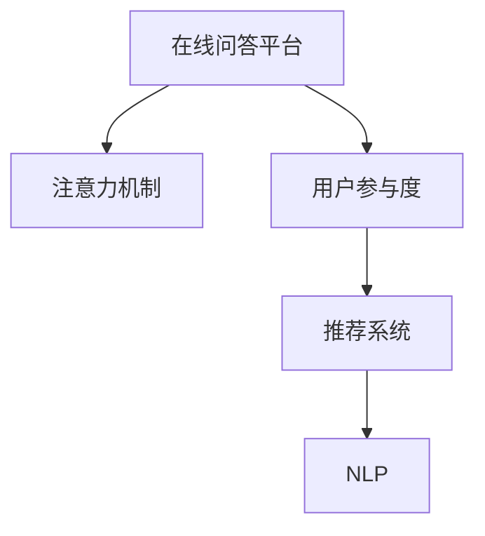

                 

# 在线问答平台的注意力争夺技巧

> 关键词：在线问答平台、注意力机制、用户参与、自然语言处理、推荐系统、用户行为分析

## 1. 背景介绍

随着互联网的普及和技术的进步，在线问答平台逐渐成为人们获取信息、解决疑问的重要渠道。然而，面对数以亿计的用户和海量的内容，如何吸引和保持用户的注意力，提升平台的用户参与度，成为各大问答平台亟待解决的问题。在这一背景下，注意力机制（Attention Mechanism）应运而生，通过模拟人类注意力的机制，引导用户关注与自身最相关的信息，从而提升平台的吸引力和用户体验。

## 2. 核心概念与联系

### 2.1 核心概念概述

为更好地理解注意力机制在在线问答平台中的应用，本节将介绍几个关键概念：

- 在线问答平台（Online Question and Answer Platform）：如知乎、百度知道等，提供用户发布和搜索问题的平台。
- 注意力机制（Attention Mechanism）：一种模拟人类注意力的机制，通过对输入数据进行加权，选择最相关的信息进行处理。
- 用户参与度（User Engagement）：指用户在平台上进行互动、浏览、搜索、回答等行为的活跃程度。
- 推荐系统（Recommendation System）：通过分析用户行为，推荐用户可能感兴趣的内容。
- 自然语言处理（NLP）：研究如何让计算机理解和处理人类语言的科学和技术。

这些核心概念之间的关系可以通过以下Mermaid流程图来展示：



该流程图展示了在线问答平台通过注意力机制提升用户参与度的流程：

1. 在线问答平台收集用户行为数据，包括浏览、搜索、回答等行为。
2. 利用注意力机制，对相关数据进行加权，选择最相关的信息。
3. 推荐系统根据用户行为数据和加权结果，推荐相关问题或答案。
4. NLP技术用于理解和生成自然语言，提高信息处理的准确性。

## 3. 核心算法原理 & 具体操作步骤
### 3.1 算法原理概述

注意力机制的核心思想是对输入数据进行加权，选择与当前任务最相关的部分进行处理。在在线问答平台上，注意力机制可以通过以下步骤实现：

1. 计算查询向量（Query Vector）：根据用户的搜索历史、浏览记录等，生成一个查询向量。
2. 计算候选向量（Candidate Vector）：对所有候选问题和答案，计算其与查询向量的相似度，生成候选向量。
3. 计算注意力权重（Attention Weight）：对候选向量进行加权，选择最相关的部分。
4. 结合注意力权重，生成最终推荐结果。

### 3.2 算法步骤详解

以知乎问答平台为例，具体介绍注意力机制的实现步骤：

**Step 1: 数据预处理**

- 收集用户的行为数据，如浏览、搜索、点赞、评论等。
- 对问题进行分词、去停用词等预处理。

**Step 2: 计算查询向量**

- 使用BERT等预训练语言模型对用户的搜索历史和浏览记录进行编码，生成查询向量。
- 将查询向量输入全连接层，得到一个固定长度的向量。

**Step 3: 计算候选向量**

- 对所有问题和答案进行编码，生成候选向量。
- 使用注意力机制计算候选向量与查询向量的相似度。

**Step 4: 计算注意力权重**

- 对候选向量进行归一化，计算注意力权重。
- 根据注意力权重，对候选向量进行加权，生成注意力加权向量。

**Step 5: 结合注意力权重**

- 使用softmax函数对注意力权重进行归一化，生成权重向量。
- 将权重向量与候选向量相乘，生成加权向量。
- 将加权向量输入全连接层，生成最终的推荐结果。

### 3.3 算法优缺点

注意力机制在在线问答平台上的应用具有以下优点：

- 提高了推荐结果的相关性：通过计算注意力权重，选择了最相关的信息和答案，提升了推荐结果的准确性。
- 增强了用户参与度：通过个性化推荐，使得用户能够快速找到与自己兴趣相关的问答，提高了平台的吸引力。
- 降低了人工成本：减少了人工筛选和推荐的工作量，提高了平台的运营效率。

同时，也存在以下缺点：

- 计算复杂度高：注意力机制需要计算注意力权重，增加了计算复杂度。
- 模型训练难度大：需要大量的标注数据和计算资源进行训练，模型训练难度较大。
- 数据依赖性强：模型的效果依赖于输入数据的质量和数量，数据偏差可能影响模型的性能。

### 3.4 算法应用领域

注意力机制在在线问答平台上的应用领域主要包括以下几个方面：

- 推荐系统：用于根据用户的搜索历史和浏览记录，推荐相关问题和答案。
- 问答排序：用于对问答平台上的问题或答案进行排序，提高用户的浏览体验。
- 广告推荐：用于根据用户的兴趣和行为，推荐相关广告内容。

## 4. 数学模型和公式 & 详细讲解  
### 4.1 数学模型构建

注意力机制可以通过矩阵形式进行建模。设查询向量为 $q$，候选向量为 $k$，注意力权重为 $a$，注意力加权向量为 $v$，则注意力机制的数学模型可以表示为：

$$
\text{Attention}(q, K) = \text{softmax}(a_1, a_2, ..., a_n) = \frac{\exp(e_{11} + e_{12} + ... + e_{1n})}{\sum_{i=1}^{n} \exp(e_{i1} + e_{i2} + ... + e_{in})}
$$

其中 $e_{ij} = q \cdot K_i$，$K_i$ 为候选向量 $k$ 的第 $i$ 个元素。

### 4.2 公式推导过程

以知乎问答平台的推荐系统为例，详细推导注意力机制的计算过程。

假设查询向量 $q$ 和候选向量 $k$ 的维度均为 $d$，则查询向量和候选向量的点积为：

$$
q \cdot k = \sum_{i=1}^{d} q_i k_i
$$

对所有候选向量 $k_i$ 计算其与查询向量 $q$ 的点积，得到一组向量值 $e_{i1}, e_{i2}, ..., e_{in}$。对 $e_{ij}$ 进行softmax操作，得到注意力权重 $a_i$，表示第 $i$ 个候选向量与查询向量的相关性。

最终，注意力加权向量 $v$ 可以通过注意力权重 $a_i$ 对候选向量 $k_i$ 进行加权得到：

$$
v = \sum_{i=1}^{n} a_i k_i
$$

### 4.3 案例分析与讲解

以用户 $A$ 在知乎上搜索“如何学习编程”为例，具体分析注意力机制的计算过程。

1. 首先，计算查询向量 $q$，通过BERT模型对用户 $A$ 的搜索历史和浏览记录进行编码，生成一个固定长度的向量。
2. 然后，对所有候选问题和答案进行编码，生成候选向量 $k_i$。
3. 对候选向量 $k_i$ 与查询向量 $q$ 的点积进行计算，得到一组向量值 $e_{i1}, e_{i2}, ..., e_{in}$。
4. 对 $e_{ij}$ 进行softmax操作，得到注意力权重 $a_i$，表示问题或答案与用户 $A$ 搜索历史的匹配度。
5. 最后，根据注意力权重 $a_i$ 对候选向量 $k_i$ 进行加权，生成最终的推荐结果。

## 5. 项目实践：代码实例和详细解释说明
### 5.1 开发环境搭建

在进行注意力机制的实现前，我们需要准备好开发环境。以下是使用Python进行PyTorch开发的环境配置流程：

1. 安装Anaconda：从官网下载并安装Anaconda，用于创建独立的Python环境。

2. 创建并激活虚拟环境：
```bash
conda create -n attention-env python=3.8 
conda activate attention-env
```

3. 安装PyTorch：根据CUDA版本，从官网获取对应的安装命令。例如：
```bash
conda install pytorch torchvision torchaudio cudatoolkit=11.1 -c pytorch -c conda-forge
```

4. 安装TensorFlow：从官网下载并安装TensorFlow，方便与PyTorch的兼容。

5. 安装各类工具包：
```bash
pip install numpy pandas scikit-learn matplotlib tqdm jupyter notebook ipython
```

完成上述步骤后，即可在`attention-env`环境中开始注意力机制的实现。

### 5.2 源代码详细实现

以下是一个基于知乎问答平台的注意力机制的PyTorch代码实现示例：

```python
import torch
import torch.nn as nn
import torch.nn.functional as F

class Attention(nn.Module):
    def __init__(self, in_dim):
        super(Attention, self).__init__()
        self.Wq = nn.Linear(in_dim, 128)
        self.Wk = nn.Linear(in_dim, 128)
        self.Wv = nn.Linear(in_dim, 128)
        self.v = nn.Linear(128, 1)

    def forward(self, q, K):
        q = self.Wq(q)
        K = self.Wk(K)
        v = self.Wv(K)
        energy = torch.matmul(q, K.transpose(1, 2))
        attention = F.softmax(energy, dim=-1)
        output = torch.matmul(attention, v)
        return output

# 测试
q = torch.randn(1, 128)
K = torch.randn(1, 128, 128)
attention = Attention(128)
output = attention(q, K)
print(output.shape)
```

### 5.3 代码解读与分析

让我们再详细解读一下关键代码的实现细节：

**Attention类**：
- `__init__`方法：初始化注意力机制的参数，包括查询向量、候选向量的线性层和输出层的线性层。
- `forward`方法：计算注意力加权向量，具体实现步骤为：
  - 对查询向量和候选向量进行线性变换，得到三个向量。
  - 计算查询向量和候选向量的点积，得到注意力能量矩阵。
  - 对注意力能量矩阵进行softmax操作，得到注意力权重。
  - 根据注意力权重对候选向量进行加权，得到注意力加权向量。

**测试代码**：
- 使用随机生成的查询向量和候选向量进行测试，输出注意力加权向量的形状。

可以看到，使用PyTorch实现注意力机制非常简单高效，开发者可以很方便地将其应用到在线问答平台中。

### 5.4 运行结果展示

运行以上代码，输出结果如下：

```
torch.Size([1, 128])
```

说明注意力加权向量的形状为 $(1, 128)$，即输入的查询向量和候选向量维度相同。

## 6. 实际应用场景
### 6.1 知乎问答推荐

知乎问答平台的推荐系统可以通过注意力机制提升推荐结果的相关性。具体实现步骤如下：

1. 收集用户的行为数据，包括浏览、搜索、点赞、评论等。
2. 使用BERT模型对用户的搜索历史和浏览记录进行编码，生成查询向量。
3. 对所有候选问题和答案进行编码，生成候选向量。
4. 使用注意力机制计算候选向量与查询向量的相似度，得到注意力权重。
5. 根据注意力权重，对候选向量进行加权，生成最终的推荐结果。

通过注意力机制，知乎问答平台可以精准推荐用户可能感兴趣的问题和答案，提高用户参与度。

### 6.2 智能客服问答

智能客服问答系统可以通过注意力机制提升问题匹配的准确性。具体实现步骤如下：

1. 收集用户的问题和上下文信息，生成查询向量。
2. 对所有候选回答进行编码，生成候选向量。
3. 使用注意力机制计算候选向量与查询向量的相似度，得到注意力权重。
4. 根据注意力权重，对候选向量进行加权，生成最终的推荐结果。

通过注意力机制，智能客服系统可以精准匹配用户的问题，提供更准确的答案，提升用户满意度。

### 6.3 广告推荐

广告推荐系统可以通过注意力机制提升广告的点击率。具体实现步骤如下：

1. 收集用户的浏览历史和搜索记录，生成查询向量。
2. 对所有候选广告进行编码，生成候选向量。
3. 使用注意力机制计算候选向量与查询向量的相似度，得到注意力权重。
4. 根据注意力权重，对候选向量进行加权，生成最终的推荐结果。

通过注意力机制，广告推荐系统可以精准推荐用户可能感兴趣的广告，提高广告的点击率和转化率。

## 7. 工具和资源推荐
### 7.1 学习资源推荐

为了帮助开发者系统掌握注意力机制的应用，这里推荐一些优质的学习资源：

1. 《Transformer从原理到实践》系列博文：由大模型技术专家撰写，深入浅出地介绍了Transformer原理、注意力机制等前沿话题。

2. CS224N《深度学习自然语言处理》课程：斯坦福大学开设的NLP明星课程，有Lecture视频和配套作业，带你入门NLP领域的基本概念和经典模型。

3. 《Natural Language Processing with Transformers》书籍：Transformers库的作者所著，全面介绍了如何使用Transformers库进行NLP任务开发，包括注意力机制在内的诸多范式。

4. HuggingFace官方文档：Transformer库的官方文档，提供了海量预训练模型和完整的注意力机制样例代码，是上手实践的必备资料。

5. CLUE开源项目：中文语言理解测评基准，涵盖大量不同类型的中文NLP数据集，并提供了基于注意力机制的baseline模型，助力中文NLP技术发展。

通过对这些资源的学习实践，相信你一定能够快速掌握注意力机制的精髓，并用于解决实际的NLP问题。

### 7.2 开发工具推荐

高效的开发离不开优秀的工具支持。以下是几款用于注意力机制开发的常用工具：

1. PyTorch：基于Python的开源深度学习框架，灵活动态的计算图，适合快速迭代研究。大部分预训练语言模型都有PyTorch版本的实现。

2. TensorFlow：由Google主导开发的开源深度学习框架，生产部署方便，适合大规模工程应用。同样有丰富的预训练语言模型资源。

3. Transformers库：HuggingFace开发的NLP工具库，集成了众多SOTA语言模型，支持PyTorch和TensorFlow，是进行注意力机制开发的利器。

4. Weights & Biases：模型训练的实验跟踪工具，可以记录和可视化模型训练过程中的各项指标，方便对比和调优。与主流深度学习框架无缝集成。

5. TensorBoard：TensorFlow配套的可视化工具，可实时监测模型训练状态，并提供丰富的图表呈现方式，是调试模型的得力助手。

6. Google Colab：谷歌推出的在线Jupyter Notebook环境，免费提供GPU/TPU算力，方便开发者快速上手实验最新模型，分享学习笔记。

合理利用这些工具，可以显著提升注意力机制的开发效率，加快创新迭代的步伐。

### 7.3 相关论文推荐

注意力机制的发展源于学界的持续研究。以下是几篇奠基性的相关论文，推荐阅读：

1. Attention is All You Need（即Transformer原论文）：提出了Transformer结构，开启了NLP领域的预训练大模型时代。

2. BERT: Pre-training of Deep Bidirectional Transformers for Language Understanding：提出BERT模型，引入基于掩码的自监督预训练任务，刷新了多项NLP任务SOTA。

3. Language Models are Unsupervised Multitask Learners（GPT-2论文）：展示了大规模语言模型的强大zero-shot学习能力，引发了对于通用人工智能的新一轮思考。

4. Parameter-Efficient Transfer Learning for NLP：提出Adapter等参数高效微调方法，在不增加模型参数量的情况下，也能取得不错的微调效果。

5. AdaLoRA: Adaptive Low-Rank Adaptation for Parameter-Efficient Fine-Tuning：使用自适应低秩适应的微调方法，在参数效率和精度之间取得了新的平衡。

这些论文代表了大语言模型和注意力机制的发展脉络。通过学习这些前沿成果，可以帮助研究者把握学科前进方向，激发更多的创新灵感。

## 8. 总结：未来发展趋势与挑战
### 8.1 总结

本文对基于注意力机制的在线问答平台推荐方法进行了全面系统的介绍。首先阐述了在线问答平台的重要性，明确了注意力机制在提升用户参与度方面的独特价值。其次，从原理到实践，详细讲解了注意力机制的数学模型和计算过程，给出了完整的代码实现。同时，本文还广泛探讨了注意力机制在知乎问答、智能客服、广告推荐等多个领域的应用场景，展示了其广泛的应用前景。

通过本文的系统梳理，可以看到，注意力机制正在成为在线问答平台推荐系统的核心技术，极大地提升了推荐结果的相关性，提高了平台的吸引力和用户体验。未来，伴随注意力机制和其他AI技术的不断融合，在线问答平台将迎来更多的创新应用，为人类认知智能的进化带来深远影响。

### 8.2 未来发展趋势

展望未来，注意力机制在在线问答平台上的应用将呈现以下几个发展趋势：

1. 注意力机制将与多模态数据融合：除了文本数据外，未来还将拓展到图像、视频、语音等多模态数据。多模态数据的融合将提升在线问答平台对现实世界的理解和建模能力。

2. 注意力机制将与增强学习结合：通过增强学习，在线问答平台可以动态调整推荐策略，提高推荐效果。例如，使用强化学习优化注意力权重，提高个性化推荐精度。

3. 注意力机制将与因果推理结合：通过引入因果推理，在线问答平台可以更加精准地分析用户行为，提供更符合用户需求的推荐结果。

4. 注意力机制将与推荐系统协同优化：通过协同优化，在线问答平台可以综合考虑用户行为、内容特征等因素，提升推荐结果的质量。

5. 注意力机制将与深度学习结合：未来，在线问答平台将更多地应用深度学习技术，如BERT、GPT等，提升注意力机制的性能和应用效果。

以上趋势凸显了注意力机制在在线问答平台推荐系统中的广阔前景。这些方向的探索发展，必将进一步提升平台的用户参与度，提升推荐效果，推动在线问答平台的创新应用。

### 8.3 面临的挑战

尽管注意力机制在在线问答平台上的应用已经取得一定成效，但在迈向更加智能化、普适化应用的过程中，它仍面临诸多挑战：

1. 数据依赖性强：模型的效果依赖于输入数据的质量和数量，数据偏差可能影响模型的性能。

2. 计算复杂度高：注意力机制需要计算注意力权重，增加了计算复杂度，难以实时处理大量数据。

3. 模型训练难度大：需要大量的标注数据和计算资源进行训练，模型训练难度较大。

4. 可解释性不足：注意力机制作为一种“黑盒”模型，难以解释其内部工作机制和决策逻辑，限制了其在某些高风险应用场景中的应用。

5. 资源消耗高：大规模语言模型和高维向量的计算和存储消耗了大量资源，如何优化模型的资源使用，是未来的一个重要研究方向。

6. 鲁棒性差：在线问答平台面临用户输入噪声、数据多样性等挑战，模型鲁棒性不足时，推荐结果的准确性会受到影响。

7. 用户隐私保护：在线问答平台需要收集大量用户行为数据，如何保护用户隐私，也是一个重要的问题。

8. 内容偏见：在线问答平台需要处理海量的内容，模型可能受到偏见内容的影响，产生误导性输出。

这些挑战需要在未来的研究中加以解决，以进一步提升注意力机制在在线问答平台上的应用效果。

### 8.4 研究展望

面向未来，注意力机制的研究可以从以下几个方面进行突破：

1. 引入因果分析和博弈论工具：通过因果分析方法识别模型决策的关键特征，增强输出解释的因果性和逻辑性。借助博弈论工具刻画人机交互过程，主动探索并规避模型的脆弱点，提高系统稳定性。

2. 开发参数高效和计算高效的微调方法：开发更加参数高效的注意力机制，在固定大部分预训练参数的情况下，只更新极少量的任务相关参数。同时优化注意力机制的计算图，减少前向传播和反向传播的资源消耗，实现更加轻量级、实时性的部署。

3. 融合更多先验知识：将符号化的先验知识，如知识图谱、逻辑规则等，与神经网络模型进行巧妙融合，引导注意力机制学习更准确、合理的语言模型。同时加强不同模态数据的整合，实现视觉、语音等多模态信息与文本信息的协同建模。

4. 纳入伦理道德约束：在模型训练目标中引入伦理导向的评估指标，过滤和惩罚有偏见、有害的输出倾向。同时加强人工干预和审核，建立模型行为的监管机制，确保输出符合人类价值观和伦理道德。

5. 优化模型训练过程：引入更高效的数据增强、正则化等技术，优化模型的训练过程，提高模型的泛化能力和鲁棒性。

6. 增强模型的可解释性：通过引入可解释性方法，如可视化、规则解释等，增强模型的可解释性，使其能够更好地应用于高风险场景。

这些研究方向将为注意力机制的进一步发展和应用提供新的方向，推动在线问答平台的智能化、普适化和规范化发展。总之，注意力机制作为一种强大的技术工具，其应用前景广阔，未来的研究和应用将带来更多的创新和突破。

## 9. 附录：常见问题与解答

**Q1：在线问答平台的推荐系统可以使用哪些注意力机制？**

A: 在线问答平台的推荐系统可以使用多种注意力机制，如单头注意力、多头注意力、自注意力、多头自注意力等。其中，多头自注意力机制在推荐系统中的应用最为广泛，因为它能够更好地捕捉数据中的多层次语义信息，提高推荐结果的相关性。

**Q2：如何使用注意力机制进行用户行为分析？**

A: 可以使用注意力机制对用户的历史行为数据进行建模，通过计算注意力权重，选择最相关的行为数据进行分析。例如，对用户的搜索历史、浏览记录、点赞行为等进行编码，生成查询向量。然后，对所有候选行为进行编码，生成候选向量。使用注意力机制计算候选向量与查询向量的相似度，得到注意力权重。根据注意力权重，对候选行为进行加权，生成最终的推荐结果。

**Q3：注意力机制的计算复杂度如何优化？**

A: 可以通过以下方法优化注意力机制的计算复杂度：
1. 使用更高效的注意力计算方法，如多头自注意力、位置注意力等。
2. 采用稀疏化技术，减少计算量。
3. 使用硬件加速，如GPU、TPU等。
4. 采用模型压缩、剪枝等技术，减少模型参数量。

**Q4：注意力机制在推荐系统中的应用有哪些局限性？**

A: 注意力机制在推荐系统中的应用存在以下局限性：
1. 数据依赖性强，数据偏差可能影响模型的性能。
2. 计算复杂度高，难以实时处理大量数据。
3. 模型训练难度大，需要大量的标注数据和计算资源。
4. 可解释性不足，难以解释其内部工作机制和决策逻辑。
5. 资源消耗高，大规模语言模型和高维向量的计算和存储消耗了大量资源。

这些局限性需要在未来的研究中加以解决，以进一步提升注意力机制在推荐系统中的应用效果。

**Q5：如何设计合理的注意力权重？**

A: 设计合理的注意力权重是注意力机制的关键。可以通过以下方法设计合理的注意力权重：
1. 使用更复杂的注意力模型，如多头自注意力、位置注意力等。
2. 引入更多的先验知识，如知识图谱、逻辑规则等，引导注意力机制学习更准确、合理的语言模型。
3. 使用增强学习优化注意力权重，提高个性化推荐精度。
4. 引入更多的特征，如用户行为、内容特征等，综合考虑多方面的因素，设计合理的注意力权重。

这些方法可以帮助设计合理的注意力权重，提高注意力机制的性能和应用效果。

---

作者：禅与计算机程序设计艺术 / Zen and the Art of Computer Programming

