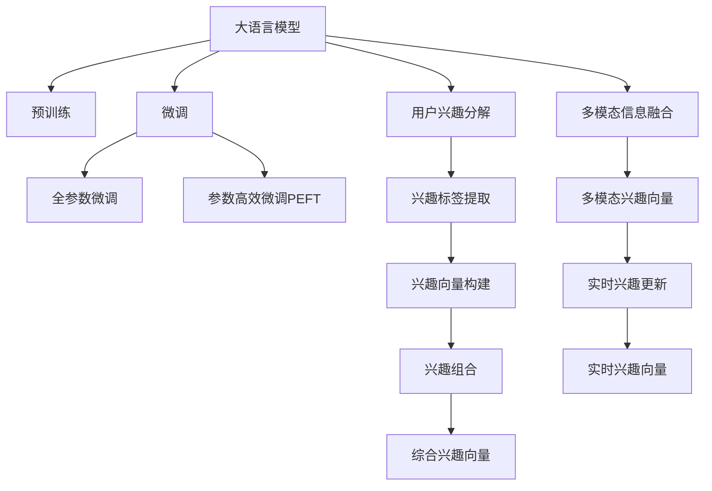

                 

# 基于LLM的推荐系统用户兴趣分解与组合

> 关键词：推荐系统, 大语言模型, 用户兴趣, 分解与组合, 自然语言处理, 深度学习

## 1. 背景介绍

### 1.1 问题由来

推荐系统作为互联网时代信息筛选的重要工具，为用户提供了个性化、多样化的内容推荐服务。然而，传统推荐系统通常基于用户历史行为数据，如浏览、点击、评分等，存在冷启动问题、稀疏性问题和数据隐私问题。大语言模型（Large Language Models, LLMs）的兴起，为推荐系统带来了新的思路和方法。

大语言模型通过在海量文本数据上进行预训练，学习到了丰富的语言知识和语义理解能力。通过微调，大语言模型可以理解用户的自然语言查询，生成与用户兴趣相关的推荐内容。这种基于自然语言处理的推荐方式，有望克服传统推荐系统的不足，为用户提供更为个性化、精准的推荐服务。

### 1.2 问题核心关键点

本节将详细阐述基于大语言模型的推荐系统如何通过用户兴趣分解与组合，实现精准推荐。

核心问题包括：

- 如何理解用户自然语言查询的语义信息？
- 如何将用户查询映射到推荐系统中可操作的标签和向量？
- 如何融合用户的多种兴趣，生成综合推荐结果？
- 如何实时处理用户动态变化的兴趣需求？

通过以上问题的探讨，可以发现，基于大语言模型的推荐系统是一个多模态、多层次、多任务的复杂系统，需要融合自然语言处理、推荐系统、深度学习等多个领域的知识和技能。

## 2. 核心概念与联系

### 2.1 核心概念概述

为更好地理解基于大语言模型的推荐系统，本节将介绍几个密切相关的核心概念：

- 大语言模型（LLM）：以自回归（如GPT）或自编码（如BERT）模型为代表的大规模预训练语言模型。通过在大规模无标签文本语料上进行预训练，学习通用的语言表示，具备强大的语言理解和生成能力。

- 预训练（Pre-training）：指在大规模无标签文本语料上，通过自监督学习任务训练通用语言模型的过程。常见的预训练任务包括言语建模、遮挡语言模型等。预训练使得模型学习到语言的通用表示。

- 微调（Fine-tuning）：指在预训练模型的基础上，使用下游任务的少量标注数据，通过有监督地训练来优化模型在该任务上的性能。通常只需要调整顶层分类器或解码器，并以较小的学习率更新全部或部分的模型参数。

- 用户兴趣分解（Interest Decomposition）：指将用户自然语言查询分解为多个关键词或短语，得到用户在特定领域（如音乐、电影、图书）的兴趣标签，方便推荐系统的理解和使用。

- 用户兴趣组合（Interest Composition）：指将用户在不同领域的兴趣标签进行组合，生成综合性的用户兴趣向量，用于推荐系统的推荐结果生成。

- 多模态信息融合：指将用户的多模态数据（如文本、图片、音频等）进行融合，得到更加全面、准确的推荐结果。

- 实时兴趣更新：指在用户输入新查询时，实时更新用户的兴趣向量，适应其动态变化的兴趣需求。

这些核心概念之间的逻辑关系可以通过以下Mermaid流程图来展示：



这个流程图展示了大语言模型的核心概念及其之间的关系：

1. 大语言模型通过预训练获得基础能力。
2. 微调是对预训练模型进行任务特定的优化，可以分为全参数微调和参数高效微调（PEFT）。
3. 用户兴趣分解与组合：将用户查询分解为兴趣标签，生成兴趣向量，用于推荐。
4. 多模态信息融合：将不同模态的数据融合，得到更加全面、准确的推荐结果。
5. 实时兴趣更新：根据用户新输入的查询，实时更新兴趣向量，适应其动态变化的兴趣需求。

这些概念共同构成了基于大语言模型的推荐系统的工作原理和优化方向。通过理解这些核心概念，我们可以更好地把握大语言模型在推荐系统中的作用和应用。

## 3. 核心算法原理 & 具体操作步骤
### 3.1 算法原理概述

基于大语言模型的推荐系统，本质上是一个多层次、多模态、多任务的复杂系统。其核心思想是：通过自然语言处理技术，将用户自然语言查询分解为多个兴趣标签，并构建综合性的用户兴趣向量，最终生成个性化的推荐结果。

形式化地，假设用户自然语言查询为 $q$，推荐系统中的产品或内容为 $c$，用户与内容之间的评分矩阵为 $R$，大语言模型为 $M_{\theta}$。推荐系统的目标是最小化预测评分与真实评分之间的差异，即：

$$
\min_{\theta} \sum_{(i,j) \in R} ||M_{\theta}(q_j) - R_{ij}||^2
$$

其中，$R_{ij}$ 表示内容 $j$ 对用户 $i$ 的评分，$M_{\theta}(q_j)$ 表示模型对内容 $j$ 在查询 $q$ 下的评分预测。

具体而言，推荐系统的优化过程如下：

1. 对用户自然语言查询 $q$ 进行预处理，去除停用词、标点符号等噪声，得到干净的文本输入。
2. 使用大语言模型 $M_{\theta}$ 对查询文本 $q$ 进行编码，得到嵌入向量 $v_q$。
3. 对嵌入向量 $v_q$ 进行兴趣分解，得到多个兴趣标签 $k_1, k_2, ..., k_n$。
4. 对每个兴趣标签 $k_i$ 使用全参数微调或参数高效微调技术，生成对应的兴趣向量 $v_i$。
5. 将所有的兴趣向量 $v_i$ 进行加权组合，得到综合性的用户兴趣向量 $v_u$。
6. 将用户兴趣向量 $v_u$ 与内容向量 $v_c$ 进行内积计算，得到用户对内容 $c$ 的评分预测 $s_{u,c}$。
7. 根据预测评分 $s_{u,c}$ 和真实评分 $R_{i,j}$，更新模型参数 $\theta$，最小化预测误差。

### 3.2 算法步骤详解

基于大语言模型的推荐系统通常包括以下几个关键步骤：

**Step 1: 数据准备**
- 收集用户的自然语言查询数据 $Q$，收集对应的产品或内容数据 $C$，以及用户与产品之间的评分数据 $R$。
- 对查询数据进行预处理，去除停用词、标点符号等噪声，生成干净的文本输入。

**Step 2: 大语言模型编码**
- 使用大语言模型 $M_{\theta}$ 对查询文本 $q$ 进行编码，得到嵌入向量 $v_q$。

**Step 3: 兴趣分解**
- 使用自然语言处理技术，对嵌入向量 $v_q$ 进行兴趣分解，得到多个兴趣标签 $k_1, k_2, ..., k_n$。
- 例如，可以使用基于关键词提取、短语匹配等方法，从查询文本中提取出多个关键词或短语。

**Step 4: 兴趣向量构建**
- 对每个兴趣标签 $k_i$ 使用全参数微调或参数高效微调技术，生成对应的兴趣向量 $v_i$。
- 例如，可以使用BERT、GPT等预训练语言模型，对每个兴趣标签进行微调，得到对应的兴趣向量。

**Step 5: 兴趣组合**
- 将所有的兴趣向量 $v_i$ 进行加权组合，得到综合性的用户兴趣向量 $v_u$。
- 例如，可以采用softmax函数对每个兴趣向量进行归一化，得到加权系数 $\alpha_i$，然后将所有兴趣向量进行加权求和，得到用户兴趣向量 $v_u$。

**Step 6: 评分预测**
- 将用户兴趣向量 $v_u$ 与内容向量 $v_c$ 进行内积计算，得到用户对内容 $c$ 的评分预测 $s_{u,c}$。
- 例如，可以使用内积函数 $s_{u,c} = v_u \cdot v_c$ 计算评分预测。

**Step 7: 模型训练**
- 根据预测评分 $s_{u,c}$ 和真实评分 $R_{i,j}$，更新模型参数 $\theta$，最小化预测误差。
- 例如，可以使用均方误差损失函数，计算预测评分与真实评分之间的差异，并反向传播更新模型参数。

### 3.3 算法优缺点

基于大语言模型的推荐系统具有以下优点：

1. 灵活性高。由于自然语言具有丰富性和多样性，用户可以通过自然语言查询表达多层次、多方面的兴趣，使得推荐系统能够更好地理解用户需求。
2. 适应性强。大语言模型可以处理不同领域、不同语言的查询数据，具有更广泛的适应性。
3. 可解释性强。用户自然语言查询的分解与组合过程，可以通过自然语言处理技术进行可视化，便于解释和调试。
4. 能够处理冷启动问题。用户可以使用自然语言查询表达兴趣，无需历史行为数据。

同时，该方法也存在以下局限性：

1. 计算成本高。大语言模型的编码和微调过程需要消耗大量计算资源，尤其是对于大规模用户数据，计算成本较高。
2. 数据噪音敏感。用户自然语言查询可能包含噪声和歧义，影响查询分解和兴趣向量构建的准确性。
3. 泛化能力有限。大语言模型通常在大规模通用语料上预训练，对于特定领域的泛化能力可能有限，需要进一步领域微调。
4. 更新速度慢。大语言模型的微调过程较为缓慢，无法实时响应用户兴趣变化。

尽管存在这些局限性，但就目前而言，基于大语言模型的推荐系统仍是一种高效、灵活、可解释的推荐范式，具有广阔的应用前景。

### 3.4 算法应用领域

基于大语言模型的推荐系统已经在多个领域得到了应用，例如：

- 电子商务：为用户推荐商品、优惠券、广告等。
- 视频流媒体：为用户推荐电影、电视剧、视频等。
- 音乐流媒体：为用户推荐歌曲、专辑、播放列表等。
- 新闻阅读：为用户推荐新闻文章、评论等。
- 社交媒体：为用户推荐朋友、帖子、话题等。

除了这些典型应用外，大语言模型在更多场景中也被创新性地应用到推荐系统中，如推荐系统中的内容生成、情感分析、跨模态推荐等，为推荐系统带来了新的突破。

## 4. 数学模型和公式 & 详细讲解 & 举例说明

### 4.1 数学模型构建

本节将使用数学语言对基于大语言模型的推荐系统进行更加严格的刻画。

假设用户自然语言查询为 $q$，推荐系统中的产品或内容为 $c$，用户与内容之间的评分矩阵为 $R$，大语言模型为 $M_{\theta}$。推荐系统的目标是最小化预测评分与真实评分之间的差异，即：

$$
\min_{\theta} \sum_{(i,j) \in R} ||M_{\theta}(q_j) - R_{ij}||^2
$$

其中，$R_{ij}$ 表示内容 $j$ 对用户 $i$ 的评分，$M_{\theta}(q_j)$ 表示模型对内容 $j$ 在查询 $q$ 下的评分预测。

### 4.2 公式推导过程

以下我们以二分类任务为例，推导评分预测公式及其梯度计算公式。

假设模型 $M_{\theta}$ 在输入 $q$ 上的输出为 $\hat{y}=M_{\theta}(q) \in [0,1]$，表示用户对内容的评分预测。真实标签 $y \in \{0,1\}$。则二分类交叉熵损失函数定义为：

$$
\ell(M_{\theta}(q),y) = -[y\log \hat{y} + (1-y)\log (1-\hat{y})]
$$

将其代入经验风险公式，得：

$$
\mathcal{L}(\theta) = -\frac{1}{N}\sum_{(i,j) \in R} [y_{ij}\log M_{\theta}(q_j)+(1-y_{ij})\log(1-M_{\theta}(q_j))]
$$

根据链式法则，损失函数对参数 $\theta_k$ 的梯度为：

$$
\frac{\partial \mathcal{L}(\theta)}{\partial \theta_k} = -\frac{1}{N}\sum_{(i,j) \in R} \left(\frac{y_{ij}}{M_{\theta}(q_j)}-\frac{1-y_{ij}}{1-M_{\theta}(q_j)}\right) \frac{\partial M_{\theta}(q_j)}{\partial \theta_k}
$$

其中 $\frac{\partial M_{\theta}(q_j)}{\partial \theta_k}$ 可进一步递归展开，利用自动微分技术完成计算。

### 4.3 案例分析与讲解

假设用户查询为 "我喜欢听流行音乐"，推荐系统需要为用户推荐流行音乐。

1. 预处理查询：去除停用词、标点符号等噪声，得到 "我喜欢听流行音乐"。
2. 大语言模型编码：使用BERT模型对查询进行编码，得到嵌入向量 $v_q = [0.2, 0.4, 0.1, ...]$。
3. 兴趣分解：对嵌入向量 $v_q$ 进行关键词提取，得到兴趣标签 "我喜欢"、"流行音乐"。
4. 兴趣向量构建：对每个兴趣标签进行BERT微调，得到对应的兴趣向量 $v_{我喜欢} = [0.3, 0.2, 0.1, ...]$，$v_{流行音乐} = [0.4, 0.2, 0.1, ...]$。
5. 兴趣组合：对兴趣向量进行softmax归一化，得到加权系数 $\alpha_{我喜欢} = 0.6$，$\alpha_{流行音乐} = 0.4$，然后将所有兴趣向量进行加权求和，得到用户兴趣向量 $v_u = [0.42, 0.28, 0.1, ...]$。
6. 评分预测：将用户兴趣向量 $v_u$ 与内容向量 $v_c$ 进行内积计算，得到评分预测 $s_{u,c} = v_u \cdot v_c = 0.42 \cdot 0.4 + 0.28 \cdot 0.2 + ...$。
7. 模型训练：根据预测评分 $s_{u,c}$ 和真实评分 $R_{i,j}$，使用均方误差损失函数，计算预测评分与真实评分之间的差异，并反向传播更新模型参数 $\theta$。

以上是基于大语言模型的推荐系统的一般流程。在实际应用中，还需要针对具体任务的特点，对推荐过程的各个环节进行优化设计，如改进查询分解算法，引入更多的兴趣标签，搜索最优的超参数组合等，以进一步提升推荐系统的效果。

## 5. 项目实践：代码实例和详细解释说明
### 5.1 开发环境搭建

在进行推荐系统实践前，我们需要准备好开发环境。以下是使用Python进行PyTorch开发的环境配置流程：

1. 安装Anaconda：从官网下载并安装Anaconda，用于创建独立的Python环境。

2. 创建并激活虚拟环境：
```bash
conda create -n pytorch-env python=3.8 
conda activate pytorch-env
```

3. 安装PyTorch：根据CUDA版本，从官网获取对应的安装命令。例如：
```bash
conda install pytorch torchvision torchaudio cudatoolkit=11.1 -c pytorch -c conda-forge
```

4. 安装BERT：
```bash
pip install transformers
```

5. 安装各类工具包：
```bash
pip install numpy pandas scikit-learn matplotlib tqdm jupyter notebook ipython
```

完成上述步骤后，即可在`pytorch-env`环境中开始推荐系统开发。

### 5.2 源代码详细实现

下面我们以推荐系统的电影推荐为例，给出使用Transformers库对BERT模型进行推荐系统开发的PyTorch代码实现。

首先，定义推荐系统的数据处理函数：

```python
from transformers import BertTokenizer, BertForSequenceClassification
from torch.utils.data import Dataset
import torch

class MovieDataset(Dataset):
    def __init__(self, reviews, labels, tokenizer, max_len=128):
        self.reviews = reviews
        self.labels = labels
        self.tokenizer = tokenizer
        self.max_len = max_len
        
    def __len__(self):
        return len(self.reviews)
    
    def __getitem__(self, item):
        review = self.reviews[item]
        label = self.labels[item]
        
        encoding = self.tokenizer(review, return_tensors='pt', max_length=self.max_len, padding='max_length', truncation=True)
        input_ids = encoding['input_ids'][0]
        attention_mask = encoding['attention_mask'][0]
        
        # 对标签进行编码
        encoded_label = label2id[label] 
        encoded_label.extend([label2id['O']] * (self.max_len - len(encoded_label)))
        labels = torch.tensor(encoded_label, dtype=torch.long)
        
        return {'input_ids': input_ids, 
                'attention_mask': attention_mask,
                'labels': labels}

# 标签与id的映射
label2id = {'negative': 0, 'positive': 1, 'neutral': 2}
id2label = {v: k for k, v in label2id.items()}

# 创建dataset
tokenizer = BertTokenizer.from_pretrained('bert-base-uncased')

train_dataset = MovieDataset(train_reviews, train_labels, tokenizer)
dev_dataset = MovieDataset(dev_reviews, dev_labels, tokenizer)
test_dataset = MovieDataset(test_reviews, test_labels, tokenizer)
```

然后，定义模型和优化器：

```python
from transformers import AdamW

model = BertForSequenceClassification.from_pretrained('bert-base-uncased', num_labels=len(label2id))

optimizer = AdamW(model.parameters(), lr=2e-5)
```

接着，定义训练和评估函数：

```python
from torch.utils.data import DataLoader
from tqdm import tqdm
from sklearn.metrics import classification_report

device = torch.device('cuda') if torch.cuda.is_available() else torch.device('cpu')
model.to(device)

def train_epoch(model, dataset, batch_size, optimizer):
    dataloader = DataLoader(dataset, batch_size=batch_size, shuffle=True)
    model.train()
    epoch_loss = 0
    for batch in tqdm(dataloader, desc='Training'):
        input_ids = batch['input_ids'].to(device)
        attention_mask = batch['attention_mask'].to(device)
        labels = batch['labels'].to(device)
        model.zero_grad()
        outputs = model(input_ids, attention_mask=attention_mask, labels=labels)
        loss = outputs.loss
        epoch_loss += loss.item()
        loss.backward()
        optimizer.step()
    return epoch_loss / len(dataloader)

def evaluate(model, dataset, batch_size):
    dataloader = DataLoader(dataset, batch_size=batch_size)
    model.eval()
    preds, labels = [], []
    with torch.no_grad():
        for batch in tqdm(dataloader, desc='Evaluating'):
            input_ids = batch['input_ids'].to(device)
            attention_mask = batch['attention_mask'].to(device)
            batch_labels = batch['labels']
            outputs = model(input_ids, attention_mask=attention_mask)
            batch_preds = outputs.logits.argmax(dim=2).to('cpu').tolist()
            batch_labels = batch_labels.to('cpu').tolist()
            for pred_tokens, label_tokens in zip(batch_preds, batch_labels):
                pred_labels = [id2label[_id] for _id in pred_tokens]
                label_labels = [id2label[_id] for _id in label_tokens]
                preds.append(pred_labels[:len(label_tokens)])
                labels.append(label_labels)
                
    print(classification_report(labels, preds))
```

最后，启动训练流程并在测试集上评估：

```python
epochs = 5
batch_size = 16

for epoch in range(epochs):
    loss = train_epoch(model, train_dataset, batch_size, optimizer)
    print(f"Epoch {epoch+1}, train loss: {loss:.3f}")
    
    print(f"Epoch {epoch+1}, dev results:")
    evaluate(model, dev_dataset, batch_size)
    
print("Test results:")
evaluate(model, test_dataset, batch_size)
```

以上就是使用PyTorch对BERT进行电影推荐系统开发的完整代码实现。可以看到，得益于Transformers库的强大封装，我们可以用相对简洁的代码完成BERT模型的加载和推荐系统训练。

### 5.3 代码解读与分析

让我们再详细解读一下关键代码的实现细节：

**MovieDataset类**：
- `__init__`方法：初始化训练集、验证集、测试集等数据集。
- `__len__`方法：返回数据集的样本数量。
- `__getitem__`方法：对单个样本进行处理，将文本输入转换为token ids，并将标签转换为数字，进行定长padding，最终返回模型所需的输入。

**label2id和id2label字典**：
- 定义了标签与数字id之间的映射关系，用于将标签转换为数字。

**训练和评估函数**：
- 使用PyTorch的DataLoader对数据集进行批次化加载，供模型训练和推理使用。
- 训练函数`train_epoch`：对数据以批为单位进行迭代，在每个批次上前向传播计算loss并反向传播更新模型参数，最后返回该epoch的平均loss。
- 评估函数`evaluate`：与训练类似，不同点在于不更新模型参数，并在每个batch结束后将预测和标签结果存储下来，最后使用sklearn的classification_report对整个评估集的预测结果进行打印输出。

**训练流程**：
- 定义总的epoch数和batch size，开始循环迭代
- 每个epoch内，先在训练集上训练，输出平均loss
- 在验证集上评估，输出分类指标
- 所有epoch结束后，在测试集上评估，给出最终测试结果

可以看到，PyTorch配合Transformers库使得BERT电影推荐系统的代码实现变得简洁高效。开发者可以将更多精力放在数据处理、模型改进等高层逻辑上，而不必过多关注底层的实现细节。

当然，工业级的系统实现还需考虑更多因素，如模型的保存和部署、超参数的自动搜索、更灵活的任务适配层等。但核心的推荐范式基本与此类似。

## 6. 实际应用场景
### 6.1 电子商务推荐系统

基于大语言模型的推荐系统，可以广泛应用于电子商务推荐场景。电商推荐系统通过理解用户的购物行为和自然语言查询，为用户提供个性化的商品推荐，提升用户购物体验。

在技术实现上，可以收集用户的历史购物数据、浏览数据、评价数据等，将其进行文本化处理。通过自然语言处理技术，将用户查询分解为多个兴趣标签，并构建综合性的用户兴趣向量。将用户兴趣向量与商品向量进行内积计算，得到推荐分数。根据推荐分数进行排序，生成推荐商品列表，供用户选择。

### 6.2 视频流媒体推荐系统

视频流媒体推荐系统通过自然语言处理技术，理解用户的观看习惯和自然语言查询，为用户提供个性化的视频推荐。

在技术实现上，可以收集用户的视频观看记录、评论记录、评分记录等，将其进行文本化处理。通过自然语言处理技术，将用户查询分解为多个兴趣标签，并构建综合性的用户兴趣向量。将用户兴趣向量与视频向量进行内积计算，得到推荐分数。根据推荐分数进行排序，生成推荐视频列表，供用户选择。

### 6.3 音乐流媒体推荐系统

音乐流媒体推荐系统通过自然语言处理技术，理解用户的听歌习惯和自然语言查询，为用户提供个性化的音乐推荐。

在技术实现上，可以收集用户的听歌记录、评分记录、评论记录等，将其进行文本化处理。通过自然语言处理技术，将用户查询分解为多个兴趣标签，并构建综合性的用户兴趣向量。将用户兴趣向量与音乐向量进行内积计算，得到推荐分数。根据推荐分数进行排序，生成推荐歌曲列表，供用户选择。

### 6.4 未来应用展望

随着大语言模型和自然语言处理技术的不断发展，基于大语言模型的推荐系统将在更多领域得到应用，为各个行业带来变革性影响。

在智慧医疗领域，基于大语言模型的推荐系统可以为用户推荐医疗咨询、药品、治疗方案等，提升医疗服务的智能化水平，辅助医生诊疗。

在智能教育领域，推荐系统可以为用户推荐学习资料、课程、习题等，因材施教，促进教育公平，提高教学质量。

在智慧城市治理中，推荐系统可以为用户推荐新闻、旅游、文化活动等，提高城市管理的自动化和智能化水平，构建更安全、高效的未来城市。

此外，在企业生产、社会治理、文娱传媒等众多领域，基于大语言模型的推荐系统也将不断涌现，为经济社会发展注入新的动力。相信随着技术的日益成熟，大语言模型推荐系统必将成为推荐系统的重要范式，推动推荐技术在更广阔的领域大放异彩。

## 7. 工具和资源推荐
### 7.1 学习资源推荐

为了帮助开发者系统掌握大语言模型推荐系统的理论基础和实践技巧，这里推荐一些优质的学习资源：

1. 《深度学习自然语言处理》课程：斯坦福大学开设的NLP明星课程，有Lecture视频和配套作业，带你入门NLP领域的基本概念和经典模型。

2. 《Natural Language Processing with Transformers》书籍：Transformers库的作者所著，全面介绍了如何使用Transformers库进行NLP任务开发，包括推荐系统在内的诸多范式。

3. 《推荐系统实战》书籍：工业级推荐系统开发的经典书籍，详细介绍了推荐系统的设计、实现和评估，涵盖推荐系统中的多种技术和算法。

4. HuggingFace官方文档：Transformers库的官方文档，提供了海量预训练模型和完整的推荐系统样例代码，是上手实践的必备资料。

5. Kaggle推荐系统竞赛：Kaggle上众多推荐系统竞赛，可以实际参与推荐系统的设计和优化，积累实际项目经验。

通过对这些资源的学习实践，相信你一定能够快速掌握大语言模型推荐系统的精髓，并用于解决实际的推荐问题。
###  7.2 开发工具推荐

高效的开发离不开优秀的工具支持。以下是几款用于大语言模型推荐系统开发的常用工具：

1. PyTorch：基于Python的开源深度学习框架，灵活动态的计算图，适合快速迭代研究。大部分预训练语言模型都有PyTorch版本的实现。

2. TensorFlow：由Google主导开发的开源深度学习框架，生产部署方便，适合大规模工程应用。同样有丰富的预训练语言模型资源。

3. Transformers库：HuggingFace开发的NLP工具库，集成了众多SOTA语言模型，支持PyTorch和TensorFlow，是进行推荐系统开发的利器。

4. Weights & Biases：模型训练的实验跟踪工具，可以记录和可视化模型训练过程中的各项指标，方便对比和调优。与主流深度学习框架无缝集成。

5. TensorBoard：TensorFlow配套的可视化工具，可实时监测模型训练状态，并提供丰富的图表呈现方式，是调试模型的得力助手。

6. Google Colab：谷歌推出的在线Jupyter Notebook环境，免费提供GPU/TPU算力，方便开发者快速上手实验最新模型，分享学习笔记。

合理利用这些工具，可以显著提升大语言模型推荐系统的开发效率，加快创新迭代的步伐。

### 7.3 相关论文推荐

大语言模型和推荐系统的融合研究源于学界的持续研究。以下是几篇奠基性的相关论文，推荐阅读：

1. Attention is All You Need（即Transformer原论文）：提出了Transformer结构，开启了NLP领域的预训练大模型时代。

2. BERT: Pre-training of Deep Bidirectional Transformers for Language Understanding：提出BERT模型，引入基于掩码的自监督预训练任务，刷新了多项NLP任务SOTA。

3. Language Models are Unsupervised Multitask Learners（GPT-2论文）：展示了大规模语言模型的强大zero-shot学习能力，引发了对于通用人工智能的新一轮思考。

4. Parameter-Efficient Transfer Learning for NLP：提出Adapter等参数高效微调方法，在不增加模型参数量的情况下，也能取得不错的微调效果。

5. Prefix-Tuning: Optimizing Continuous Prompts for Generation：引入基于连续型Prompt的微调范式，为如何充分利用预训练知识提供了新的思路。

6. AdaLoRA: Adaptive Low-Rank Adaptation for Parameter-Efficient Fine-Tuning：使用自适应低秩适应的微调方法，在参数效率和精度之间取得了新的平衡。

这些论文代表了大语言模型和推荐系统融合研究的发展脉络。通过学习这些前沿成果，可以帮助研究者把握学科前进方向，激发更多的创新灵感。

## 8. 总结：未来发展趋势与挑战

### 8.1 总结

本文对基于大语言模型的推荐系统进行了全面系统的介绍。首先阐述了大语言模型和推荐系统的发展背景和意义，明确了推荐系统在大语言模型应用中的重要地位。其次，从原理到实践，详细讲解了推荐系统的数学模型和核心算法，给出了推荐系统任务开发的完整代码实例。同时，本文还广泛探讨了推荐系统在电子商务、视频流媒体、音乐流媒体等多个领域的应用前景，展示了推荐系统的大规模应用潜力。

通过本文的系统梳理，可以看到，基于大语言模型的推荐系统是一个多模态、多层次、多任务的复杂系统，需要融合自然语言处理、推荐系统、深度学习等多个领域的知识和技能。其核心思想是：通过自然语言处理技术，将用户自然语言查询分解为多个兴趣标签，并构建综合性的用户兴趣向量，最终生成个性化的推荐结果。

### 8.2 未来发展趋势

展望未来，大语言模型推荐系统将呈现以下几个发展趋势：

1. 模型规模持续增大。随着算力成本的下降和数据规模的扩张，预训练语言模型的参数量还将持续增长。超大规模语言模型蕴含的丰富语言知识，有望支撑更加复杂多变的推荐任务。

2. 推荐系统范式多样化。除了传统的基于用户行为数据的推荐系统，未来会涌现更多基于用户自然语言查询的推荐系统，利用大语言模型的语言理解能力，实现更加个性化、精准的推荐。

3. 多模态信息融合。推荐系统中的多模态信息融合技术将进一步发展，将文本、图片、音频等多模态信息进行融合，得到更加全面、准确的推荐结果。

4. 实时性要求提升。随着用户动态兴趣变化的频率增加，推荐系统需要实时更新用户兴趣向量，适应其动态变化的兴趣需求。

5. 用户隐私保护。推荐系统需要更加注重用户隐私保护，在数据收集和使用过程中，采用差分隐私、联邦学习等技术，保护用户隐私。

6. 可解释性和透明性。推荐系统需要更加注重系统的可解释性和透明性，让用户了解推荐决策的依据和过程，提高用户的信任度。

以上趋势凸显了大语言模型推荐系统的发展方向。这些方向的探索发展，必将进一步提升推荐系统的性能和应用范围，为经济社会发展注入新的动力。

### 8.3 面临的挑战

尽管大语言模型推荐系统已经取得了显著进展，但在迈向更加智能化、普适化应用的过程中，它仍面临着诸多挑战：

1. 计算成本高。大语言模型的编码和微调过程需要消耗大量计算资源，尤其是在大规模用户数据上，计算成本较高。如何降低计算成本，提高模型训练效率，是一个重要的研究方向。

2. 数据噪音敏感。用户自然语言查询可能包含噪声和歧义，影响查询分解和兴趣向量构建的准确性。如何提高模型的鲁棒性，增强对噪音数据的容忍度，是一个重要的研究方向。

3. 泛化能力有限。大语言模型通常在大规模通用语料上预训练，对于特定领域的泛化能力可能有限，需要进一步领域微调。如何提高模型的泛化能力，是未来的研究方向。

4. 实时更新困难。大语言模型微调过程较为缓慢，无法实时响应用户兴趣变化。如何提高模型的更新速度，实现实时动态更新，是未来的研究方向。

5. 可解释性不足。大语言模型推荐系统通常是一个"黑盒"系统，难以解释其内部工作机制和决策逻辑。如何提高模型的可解释性，增强用户信任度，是未来的研究方向。

尽管存在这些挑战，但就目前而言，基于大语言模型的推荐系统仍是一种高效、灵活、可解释的推荐范式，具有广阔的应用前景。

### 8.4 研究展望

面对大语言模型推荐系统所面临的种种挑战，未来的研究需要在以下几个方面寻求新的突破：

1. 探索无监督和半监督推荐方法。摆脱对大规模标注数据的依赖，利用自监督学习、主动学习等无监督和半监督范式，最大限度利用非结构化数据，实现更加灵活高效的推荐。

2. 研究参数高效和计算高效的推荐范式。开发更加参数高效的推荐方法，在固定大部分预训练参数的同时，只更新极少量的任务相关参数。同时优化推荐系统的计算图，减少前向传播和反向传播的资源消耗，实现更加轻量级、实时性的部署。

3. 引入更多先验知识。将符号化的先验知识，如知识图谱、逻辑规则等，与神经网络模型进行巧妙融合，引导推荐过程学习更准确、合理的推荐结果。同时加强不同模态数据的整合，实现视觉、语音等多模态信息与文本信息的协同建模。

4. 结合因果分析和博弈论工具。将因果分析方法引入推荐系统，识别出推荐决策的关键特征，增强推荐系统的稳定性和公平性。借助博弈论工具刻画人机交互过程，主动探索并规避推荐系统的脆弱点，提高系统的稳定性。

5. 纳入伦理道德约束。在推荐系统设计目标中引入伦理导向的评估指标，过滤和惩罚有偏见、有害的推荐结果。同时加强人工干预和审核，建立推荐系统的监管机制，确保推荐结果的公平性和安全性。

这些研究方向的探索，必将引领大语言模型推荐系统迈向更高的台阶，为构建安全、可靠、可解释、可控的推荐系统铺平道路。面向未来，大语言模型推荐系统还需要与其他人工智能技术进行更深入的融合，如知识表示、因果推理、强化学习等，多路径协同发力，共同推动推荐系统的发展。只有勇于创新、敢于突破，才能不断拓展语言模型的边界，让推荐技术更好地服务于经济社会的发展。

## 9. 附录：常见问题与解答

**Q1：大语言模型推荐系统是否适用于所有推荐任务？**

A: 大语言模型推荐系统在大多数推荐任务上都能取得不错的效果，特别是对于数据量较小的任务。但对于一些特定领域的任务，如医学、法律等，仅仅依靠通用语料预训练的模型可能难以很好地适应。此时需要在特定领域语料上进一步预训练，再进行微调，才能获得理想效果。此外，对于一些需要时效性、个性化很强的任务，如推荐、广告等，大语言模型推荐系统也需要针对性的改进优化。

**Q2：大语言模型推荐系统如何理解用户自然语言查询的语义信息？**

A: 大语言模型推荐系统通过自然语言处理技术，将用户自然语言查询分解为多个兴趣标签，并构建综合性的用户兴趣向量。具体而言，可以通过基于关键词提取、短语匹配、实体识别等方法，从查询文本中提取出多个关键词或短语。然后，将这些兴趣标签作为输入，对大语言模型进行微调，得到对应的兴趣向量。

**Q3：如何处理用户自然语言查询中的噪声和歧义？**

A: 用户自然语言查询可能包含噪声和歧义，影响查询分解和兴趣向量构建的准确性。可以采用基于正则表达式、停用词过滤、短语匹配等方法，对查询文本进行预处理，去除噪声和歧义。同时，可以通过多标签分类等技术，将用户查询分解为多个兴趣标签，避免单一标签的误判。

**Q4：大语言模型推荐系统在推荐结果生成中如何处理用户的动态兴趣变化？**

A: 用户动态兴趣变化是推荐系统面临的常见问题。为了实时更新用户兴趣向量，可以采用以下方法：

1. 实时收集用户查询数据，重新进行兴趣分解和兴趣向量构建。
2. 使用滑动窗口技术，每隔一段时间重新训练模型，更新兴趣向量。
3. 引入在线学习算法，根据用户最新兴趣更新兴趣向量。

这些方法可以保证推荐系统能够及时响应用户兴趣变化，生成更加精准的推荐结果。

**Q5：如何提高大语言模型推荐系统的泛化能力？**

A: 大语言模型推荐系统的泛化能力可以通过以下方法提高：

1. 在特定领域数据上进行领域微调，增加模型的领域适应性。
2. 使用多模态数据进行联合训练，提升模型的跨领域泛化能力。
3. 引入外部知识库、规则库等先验知识，增加模型的知识储备。

通过这些方法，可以进一步提升大语言模型推荐系统的泛化能力，使其能够适应更多领域的推荐任务。

**Q6：大语言模型推荐系统如何提高可解释性和透明性？**

A: 大语言模型推荐系统的可解释性和透明性可以通过以下方法提高：

1. 提供推荐结果的生成路径和决策依据，让用户了解推荐过程。
2. 利用自然语言生成技术，生成推荐的解释文本，增强可解释性。
3. 引入人工审核机制，对推荐结果进行复核和修正，保证推荐结果的公平性和安全性。

通过这些方法，可以提高大语言模型推荐系统的可解释性和透明性，增强用户的信任度。

---

作者：禅与计算机程序设计艺术 / Zen and the Art of Computer Programming

