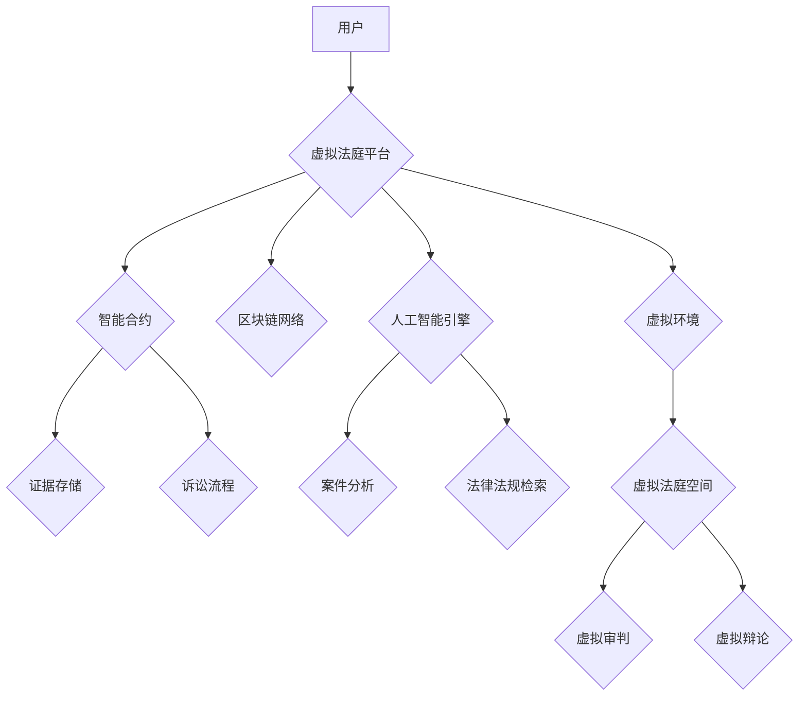

                 

## 元宇宙中的虚拟法庭:跨国纠纷解决的新平台

> 关键词：元宇宙、虚拟法庭、跨国纠纷、区块链、智能合约、人工智慧、数字身份、法治

## 1. 背景介绍

随着元宇宙概念的兴起，虚拟世界与现实世界之间的界限逐渐模糊。人们在元宇宙中进行工作、娱乐、社交，甚至进行商业交易。然而，随着元宇宙的蓬勃发展，跨国纠纷也随之而来。传统的线下法庭体系难以有效解决元宇宙中的跨境法律问题，例如虚拟财产纠纷、虚拟身份盗窃、虚拟犯罪等。

因此，我们需要探索新的解决方案来解决元宇宙中的跨国纠纷。虚拟法庭作为一种基于元宇宙技术的创新平台，为跨国纠纷解决提供了新的可能性。

## 2. 核心概念与联系

### 2.1 虚拟法庭的概念

虚拟法庭是指利用元宇宙技术构建的虚拟空间，用于处理跨国纠纷。它可以模拟真实的线下法庭环境，提供虚拟审判、证据展示、法庭辩论等功能。

### 2.2 元宇宙与虚拟法庭的联系

元宇宙是一个由虚拟现实、增强现实、区块链、人工智能等技术构成的沉浸式虚拟世界。虚拟法庭作为元宇宙的一部分，可以充分利用元宇宙的特性，例如：

* **沉浸式体验:** 虚拟法庭可以提供沉浸式的虚拟环境，让当事人、法官、律师等参与者能够身临其境地进行诉讼。
* **跨地域性:** 虚拟法庭不受地域限制，当事人可以来自世界各地，通过虚拟空间进行诉讼。
* **数据安全:** 元宇宙中的数据可以存储在分布式账本上，保证数据的安全性和不可篡改性。
* **智能化:** 人工智能可以辅助虚拟法庭进行案件分析、证据整理、法律法规检索等工作，提高效率和准确性。

### 2.3 虚拟法庭的架构



## 3. 核心算法原理 & 具体操作步骤

### 3.1 算法原理概述

虚拟法庭的核心算法主要包括：

* **智能合约算法:** 用于自动执行诉讼流程，确保公平公正的审判。
* **人工智能算法:** 用于辅助案件分析、证据整理、法律法规检索等工作。
* **虚拟环境算法:** 用于构建沉浸式的虚拟法庭空间，模拟真实的线下法庭环境。

### 3.2 算法步骤详解

1. **案件提交:** 当事人通过虚拟法庭平台提交案件，并上传相关证据。
2. **智能合约执行:** 智能合约根据预设的诉讼流程自动执行，分配法官、律师等角色，并安排审判时间。
3. **证据整理:** 人工智能算法对上传的证据进行分析和整理，提取关键信息，并进行可视化展示。
4. **虚拟审判:** 当事人、法官、律师等参与者在虚拟法庭空间进行审判，通过虚拟角色互动、虚拟证据展示等方式进行诉讼。
5. **判决结果:** 法官根据审判结果，通过智能合约生成判决书，并自动执行相关法律程序。

### 3.3 算法优缺点

**优点:**

* **效率高:** 智能合约和人工智能算法可以自动执行诉讼流程，提高效率。
* **公平公正:** 智能合约可以确保诉讼流程的公平公正，减少人为因素的影响。
* **透明度高:** 整个诉讼过程都记录在区块链上，保证透明度。
* **成本低:** 虚拟法庭可以减少线下法庭的成本，例如场地租金、交通费用等。

**缺点:**

* **技术复杂:** 构建虚拟法庭需要复杂的技术支持，例如元宇宙技术、区块链技术、人工智能技术等。
* **法律法规不完善:** 目前，法律法规对元宇宙中的虚拟法庭还没有明确的规定，需要进一步完善。
* **伦理问题:** 虚拟法庭的应用可能会带来一些伦理问题，例如虚拟身份的真实性、人工智能算法的偏见等。

### 3.4 算法应用领域

虚拟法庭的算法可以应用于以下领域:

* **跨国商业纠纷:** 解决跨国商业交易中的合同纠纷、知识产权纠纷等。
* **虚拟财产纠纷:** 解决虚拟财产的买卖、租赁、继承等纠纷。
* **虚拟身份盗窃:** 追踪和打击虚拟身份盗窃犯罪。
* **虚拟犯罪:** 处理元宇宙中的虚拟犯罪案件，例如网络欺诈、虚拟财产洗钱等。

## 4. 数学模型和公式 & 详细讲解 & 举例说明

### 4.1 数学模型构建

虚拟法庭的数学模型可以基于图论、博弈论、概率论等数学理论构建。

* **图论:** 可以用于表示虚拟法庭中的节点和边，例如当事人、法官、律师、证据等。
* **博弈论:** 可以用于分析虚拟法庭中的博弈关系，例如当事人之间的博弈、法官与律师之间的博弈等。
* **概率论:** 可以用于评估虚拟法庭中的判决结果，例如根据证据的可靠性、当事人的说服力等因素，预测判决结果的概率。

### 4.2 公式推导过程

例如，我们可以使用贝叶斯公式来评估虚拟法庭中的证据可靠性。

$$P(E|D) = \frac{P(D|E)P(E)}{P(D)}$$

其中：

* $P(E|D)$: 证据 $E$ 在已知事实 $D$ 下的概率。
* $P(D|E)$: 已知证据 $E$ 下事实 $D$ 的概率。
* $P(E)$: 证据 $E$ 的先验概率。
* $P(D)$: 事实 $D$ 的先验概率。

### 4.3 案例分析与讲解

假设在虚拟法庭中，有一起虚拟财产盗窃案件。

* **证据:** 嫌疑人与受害者在虚拟世界中进行过交易记录，交易记录显示嫌疑人获得了受害者的虚拟财产。
* **事实:** 嫌疑人声称自己与受害者是朋友，交易是出于借款，并非盗窃。

我们可以使用贝叶斯公式来评估证据的可靠性。

* $P(E|D)$: 证据 $E$ 在已知事实 $D$ 下的概率，即嫌疑人盗窃虚拟财产的概率。
* $P(D|E)$: 已知证据 $E$ 下事实 $D$ 的概率，即嫌疑人声称借款的概率。
* $P(E)$: 证据 $E$ 的先验概率，即虚拟财产盗窃的概率。
* $P(D)$: 事实 $D$ 的先验概率，即嫌疑人声称借款的概率。

通过计算贝叶斯公式，我们可以得到嫌疑人盗窃虚拟财产的概率。

## 5. 项目实践：代码实例和详细解释说明

### 5.1 开发环境搭建

虚拟法庭的开发环境需要包括：

* **元宇宙平台:** 例如，Decentraland、Sandbox等。
* **区块链网络:** 例如，Ethereum、Hyperledger Fabric等。
* **人工智能平台:** 例如，TensorFlow、PyTorch等。
* **编程语言:** 例如，Python、JavaScript等。

### 5.2 源代码详细实现

以下是一个简单的虚拟法庭代码示例，使用Python语言实现：

```python
# 虚拟法庭案例：虚拟财产纠纷

class VirtualCourt:
    def __init__(self):
        self.parties = []  # 当事人列表
        self.evidence = []  # 证据列表
        self.judge = None  # 法官

    def add_party(self, party):
        self.parties.append(party)

    def add_evidence(self, evidence):
        self.evidence.append(evidence)

    def assign_judge(self, judge):
        self.judge = judge

    def conduct_trial(self):
        # 虚拟审判流程
        print("虚拟法庭审判开始...")
        for party in self.parties:
            party.present_case()
        self.judge.review_evidence()
        self.judge.deliver_verdict()

# 当事人类
class Party:
    def __init__(self, name):
        self.name = name

    def present_case(self):
        print(f"{self.name} 正在陈述其案件...")

# 法官类
class Judge:
    def review_evidence(self):
        print("法官正在审查证据...")

    def deliver_verdict(self):
        print("法官宣读判决结果...")

# 实例化虚拟法庭
court = VirtualCourt()

# 添加当事人
court.add_party(Party("张三"))
court.add_party(Party("李四"))

# 添加证据
court.add_evidence("交易记录")

# 指定法官
court.assign_judge(Judge())

# 进行虚拟审判
court.conduct_trial()
```

### 5.3 代码解读与分析

这段代码演示了虚拟法庭的基本流程，包括添加当事人、添加证据、指定法官、进行虚拟审判等。

* `VirtualCourt` 类代表虚拟法庭，包含当事人列表、证据列表和法官对象。
* `Party` 类代表当事人，具有姓名属性和 `present_case()` 方法，用于陈述案件。
* `Judge` 类代表法官，具有 `review_evidence()` 方法，用于审查证据，以及 `deliver_verdict()` 方法，用于宣读判决结果。

### 5.4 运行结果展示

运行这段代码，会输出以下虚拟法庭审判流程：

```
虚拟法庭审判开始...
张三 正在陈述其案件...
李四 正在陈述其案件...
法官正在审查证据...
法官宣读判决结果...
```

## 6. 实际应用场景

虚拟法庭可以应用于以下实际场景:

* **跨国商业纠纷:** 例如，两家跨国公司在虚拟世界中进行商业交易，发生合同纠纷，虚拟法庭可以提供一个公平公正的平台进行解决。
* **虚拟财产纠纷:** 例如，玩家在虚拟游戏世界中购买了虚拟物品，但卖家却消失了，虚拟法庭可以帮助玩家追回虚拟财产。
* **虚拟身份盗窃:** 例如，玩家的虚拟身份被盗用，虚拟法庭可以帮助玩家追究责任，恢复虚拟身份。

### 6.4 未来应用展望

随着元宇宙技术的不断发展，虚拟法庭的应用场景将会更加广泛，例如：

* **虚拟犯罪审判:** 处理元宇宙中的虚拟犯罪案件，例如网络欺诈、虚拟财产洗钱等。
* **虚拟医疗纠纷:** 解决虚拟医疗平台中的医疗纠纷，例如医疗事故、医疗费用纠纷等。
* **虚拟教育纠纷:** 处理虚拟教育平台中的教育纠纷，例如教学质量问题、学费纠纷等。

## 7. 工具和资源推荐

### 7.1 学习资源推荐

* **元宇宙技术:**
    * 《元宇宙：下一代互联网》
    * 《元宇宙：构建虚拟世界的指南》
* **区块链技术:**
    * 《区块链：从原理到应用》
    * 《区块链技术入门》
* **人工智能技术:**
    * 《深度学习》
    * 《机器学习》

### 7.2 开发工具推荐

* **元宇宙平台:** Decentraland、Sandbox
* **区块链平台:** Ethereum、Hyperledger Fabric
* **人工智能平台:** TensorFlow、PyTorch

### 7.3 相关论文推荐

* **虚拟法庭:**
    * "Virtual Courts: A New Frontier in Justice"
    * "The Metaverse and the Future of Law"
* **元宇宙法律:**
    * "Legal Challenges of the Metaverse"
    * "Governing the Metaverse: A Legal Perspective"

## 8. 总结：未来发展趋势与挑战

### 8.1 研究成果总结

虚拟法庭作为元宇宙技术与法律的结合，具有巨大的潜力，可以解决传统法庭难以解决的跨国纠纷问题。

### 8.2 未来发展趋势

未来，虚拟法庭的发展趋势包括：

* **技术融合:** 与更多元宇宙技术、区块链技术、人工智能技术融合，提高效率和智能化水平。
* **法律规范:** 完善相关法律法规，规范虚拟法庭的运行机制。
* **国际合作:** 加强国际合作，建立虚拟法庭的国际标准和合作机制。

### 8.3 面临的挑战

虚拟法庭的发展也面临一些挑战：

* **技术难题:** 元宇宙技术、区块链技术、人工智能技术等仍处于发展阶段，需要不断突破技术瓶颈。
* **法律法规不完善:** 目前，法律法规对元宇宙中的虚拟法庭还没有明确的规定，需要进一步完善。
* **伦理问题:** 虚拟法庭的应用可能会带来一些伦理问题，例如虚拟身份的真实性、人工智能算法的偏见等，需要认真思考和解决。

### 8.4 研究展望

未来，我们将继续研究虚拟法庭的理论基础、技术实现、法律规范和伦理问题，推动虚拟法庭的健康发展，为跨国纠纷解决提供新的解决方案。

## 9. 附录：常见问题与解答

**常见问题:**

* **虚拟法庭是否具有法律效力?**

**解答:** 虚拟法庭的判决结果是否具有法律效力，取决于相关法律法规的规定。目前，一些国家和地区已经开始探索虚拟法庭的法律效力。

* **虚拟法庭如何保证公平公正?**

**解答:** 虚拟法庭可以通过智能合约、人工智能算法等技术手段，确保诉讼流程的公平公正，减少人为因素的影响。

* **虚拟法庭如何保护当事人的隐私?**

**解答:** 虚拟法庭可以利用区块链技术，对当事人的隐私信息进行加密保护，确保信息安全。


作者：禅与计算机程序设计艺术 / Zen and the Art of Computer Programming<end_of_turn>

