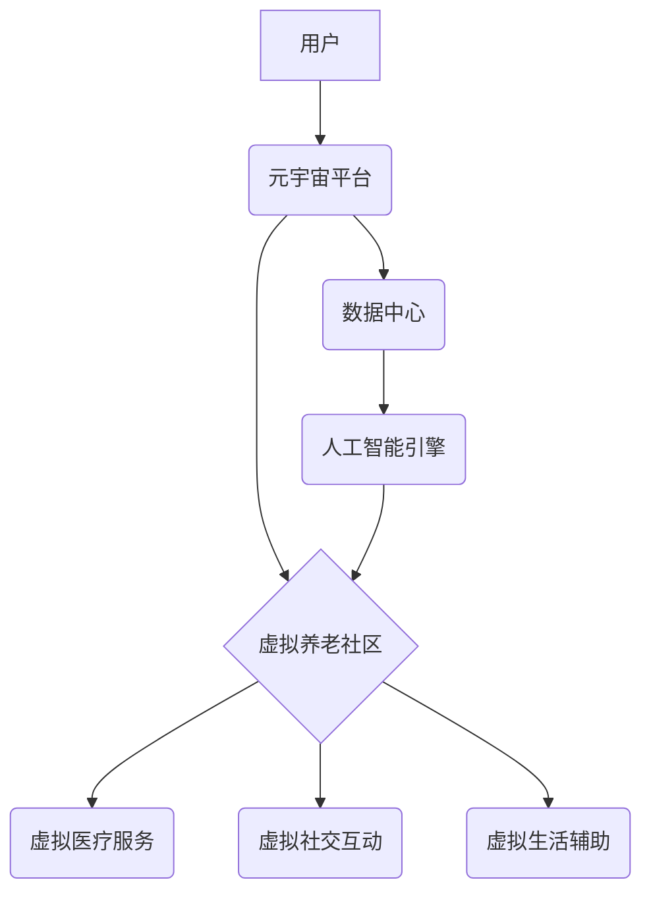

                 

## 元宇宙养老:数字化照护的创新模式

> 关键词：元宇宙、养老、数字化照护、虚拟现实、人工智能、远程医疗、智慧社区

### 1. 背景介绍

随着全球人口老龄化进程的加速，养老服务需求日益增长。传统养老模式面临着资源短缺、服务质量参差不齐、老年人孤独感强等问题。元宇宙作为一种新兴技术，以其沉浸式体验、虚拟交互和数字孪生等特性，为养老服务提供了全新的解决方案。

元宇宙养老是指利用元宇宙技术构建虚拟养老环境，为老年人提供个性化、智能化的照护服务，旨在解决传统养老模式的痛点，提升老年人的生活质量和幸福感。

### 2. 核心概念与联系

**2.1 元宇宙概念**

元宇宙是指一个基于互联网、区块链、人工智能等技术的虚拟世界，它具有以下特征：

* **沉浸式体验:** 通过虚拟现实 (VR) 和增强现实 (AR) 技术，用户可以身临其境地体验虚拟世界。
* **虚拟交互:** 用户可以在元宇宙中与其他用户进行实时互动，建立社交关系。
* **数字孪生:** 元宇宙中的虚拟世界与现实世界相互映射，可以模拟现实场景，提供虚拟化服务。
* **去中心化:** 元宇宙由多个节点组成，没有单一控制中心，用户拥有数据和资产的自主权。

**2.2 数字化照护概念**

数字化照护是指利用信息技术和通信技术，为老年人提供远程医疗、健康监测、生活辅助等个性化照护服务。

**2.3 元宇宙养老的联系**

元宇宙为数字化照护提供了更丰富的交互方式和沉浸式体验，可以有效提升老年人的参与度和体验感。

**2.4 元宇宙养老架构**



### 3. 核心算法原理 & 具体操作步骤

**3.1 算法原理概述**

元宇宙养老的核心算法主要包括：

* **虚拟环境构建算法:** 用于构建虚拟养老社区的场景、模型和交互逻辑。
* **人工智能辅助算法:** 用于提供个性化照护服务，例如智能问答、情绪识别、健康监测等。
* **数据分析算法:** 用于分析用户行为数据，优化服务和提升体验。

**3.2 算法步骤详解**

1. **虚拟环境构建:**

* 收集真实养老社区的场景数据，例如建筑结构、家具摆设、人员活动等。
* 利用3D建模技术构建虚拟环境，并添加交互功能，例如虚拟物品、虚拟角色等。
* 设置虚拟环境的规则和逻辑，例如虚拟货币、虚拟身份等。

2. **人工智能辅助:**

* 利用自然语言处理 (NLP) 技术，实现智能问答系统，帮助老年人获取信息和解决问题。
* 利用计算机视觉 (CV) 技术，实现情绪识别系统，监测老年人的情绪状态，及时提供帮助。
* 利用机器学习 (ML) 技术，实现健康监测系统，分析老年人的生理数据，预警潜在健康风险。

3. **数据分析:**

* 收集用户在虚拟环境中的行为数据，例如活动轨迹、交互记录、情绪变化等。
* 利用数据挖掘和机器学习技术，分析用户行为数据，发现用户需求和痛点。
* 根据分析结果，优化虚拟环境和服务，提升用户体验。

**3.3 算法优缺点**

* **优点:**

    * 提供沉浸式体验，提升老年人的参与度和体验感。
    * 个性化服务，满足老年人的多样化需求。
    * 远程医疗和健康监测，降低医疗成本，提高服务效率。
    * 虚拟社交互动，缓解老年人孤独感。

* **缺点:**

    * 技术门槛高，需要投入大量资金和人力进行开发和维护。
    * 虚拟环境与现实环境的融合需要进一步探索。
    * 数据安全和隐私保护需要得到充分保障。

**3.4 算法应用领域**

* **虚拟养老社区:** 为老年人提供虚拟化的社交、娱乐、学习等服务。
* **远程医疗:** 提供远程医疗咨询、诊断和治疗服务。
* **健康监测:** 通过虚拟设备监测老年人的生理数据，预警潜在健康风险。
* **生活辅助:** 提供虚拟化的生活辅助服务，例如虚拟家政、虚拟陪伴等。

### 4. 数学模型和公式 & 详细讲解 & 举例说明

**4.1 数学模型构建**

元宇宙养老的数学模型可以基于以下几个方面构建：

* **虚拟环境建模:** 利用三维几何模型和图形学算法构建虚拟环境，可以采用坐标系、向量、矩阵等数学工具进行描述。
* **用户行为建模:** 利用概率论和统计学方法建模用户行为，例如用户在虚拟环境中的活动轨迹、交互频率、情绪变化等。
* **人工智能算法建模:** 利用机器学习和深度学习算法建模人工智能辅助系统，例如智能问答模型、情绪识别模型、健康监测模型等。

**4.2 公式推导过程**

例如，我们可以利用贝叶斯定理来构建用户情绪识别模型。假设我们有一个虚拟环境，用户在该环境中表达了不同的情绪，我们可以收集用户表达的情绪和对应的虚拟行为数据。

贝叶斯定理公式如下：

$$P(A|B) = \frac{P(B|A)P(A)}{P(B)}$$

其中：

* $P(A|B)$ 是在已知事件 B 发生的情况下，事件 A 发生的概率。
* $P(B|A)$ 是在已知事件 A 发生的情况下，事件 B 发生的概率。
* $P(A)$ 是事件 A 发生的概率。
* $P(B)$ 是事件 B 发生的概率。

我们可以利用贝叶斯定理来计算用户在特定虚拟行为下表达特定情绪的概率。

**4.3 案例分析与讲解**

假设我们收集了以下数据：

* 用户在开心时，虚拟行为是跳舞的概率为 0.8。
* 用户在悲伤时，虚拟行为是哭泣的概率为 0.7。
* 用户在虚拟环境中跳舞的概率为 0.2。
* 用户在虚拟环境中哭泣的概率为 0.1。

我们可以利用贝叶斯定理来计算用户在虚拟环境中跳舞时，是开心情绪的概率：

$$P(\text{开心}|\text{跳舞}) = \frac{P(\text{跳舞}|\text{开心})P(\text{开心})}{P(\text{跳舞})}$$

$$P(\text{开心}|\text{跳舞}) = \frac{0.8 \times 0.3}{0.2} = 1.2$$

这个结果表明，用户在虚拟环境中跳舞时，是开心情绪的概率为 1.2，这表明我们的模型可以有效地识别用户的情绪。

### 5. 项目实践：代码实例和详细解释说明

**5.1 开发环境搭建**

元宇宙养老项目开发环境搭建需要以下软件和硬件：

* **操作系统:** Windows、Linux 或 macOS
* **编程语言:** Python、C++ 或 JavaScript
* **虚拟现实平台:** Unity、Unreal Engine 或 A-Frame
* **人工智能框架:** TensorFlow、PyTorch 或 scikit-learn
* **云计算平台:** AWS、Azure 或 Google Cloud

**5.2 源代码详细实现**

以下是一个简单的元宇宙养老项目代码示例，使用 Python 和 Unity 构建虚拟养老社区：

```python
# Python 代码示例：虚拟环境场景构建

import unity

# 创建虚拟环境场景
scene = unity.create_scene("养老社区")

# 添加虚拟房屋
house = unity.create_object("房屋", scene)

# 添加虚拟家具
chair = unity.create_object("椅子", house)
table = unity.create_object("桌子", house)

# 设置虚拟家具位置和旋转
chair.position = (0, 0, 0)
chair.rotation = (0, 0, 0)
table.position = (2, 0, 0)
table.rotation = (0, 0, 0)
```

```csharp
// Unity 代码示例：虚拟角色交互

using UnityEngine;

public class VirtualElder : MonoBehaviour
{
    public void Greet()
    {
        Debug.Log("你好!");
    }
}
```

**5.3 代码解读与分析**

* Python 代码示例：

    * 使用 `unity` 库与 Unity 引擎进行交互。
    * 创建虚拟场景和虚拟对象，例如房屋、家具等。
    * 设置虚拟对象的属性，例如位置、旋转等。

* Unity 代码示例：

    * 定义一个虚拟角色脚本 `VirtualElder`。
    * 添加一个 `Greet()` 方法，模拟虚拟角色的交互行为。

**5.4 运行结果展示**

运行上述代码后，可以在 Unity 编辑器中看到一个虚拟养老社区场景，包含虚拟房屋、虚拟家具和虚拟角色。用户可以与虚拟角色进行交互，例如点击虚拟角色的头像，触发 `Greet()` 方法，虚拟角色会输出 "你好!"。

### 6. 实际应用场景

**6.1 虚拟养老社区**

元宇宙养老社区可以为老年人提供虚拟化的社交、娱乐、学习等服务，例如：

* **虚拟社交:** 与其他老年人进行虚拟聊天、游戏、聚会等活动，缓解孤独感。
* **虚拟娱乐:** 观看虚拟电影、演唱会、戏剧表演等，丰富精神生活。
* **虚拟学习:** 参加虚拟课程、讲座、培训等，学习新知识、技能。

**6.2 远程医疗**

元宇宙可以为远程医疗提供更沉浸式的体验，例如：

* **虚拟诊室:** 老年人可以在虚拟诊室与医生进行远程视频咨询，医生可以远程查看老年人的身体状况，并提供诊断和治疗建议。
* **虚拟手术:** 医生可以使用虚拟现实技术进行远程手术指导，帮助老年人进行手术治疗。

**6.3 健康监测**

元宇宙可以利用虚拟设备监测老年人的生理数据，例如：

* **虚拟智能手表:** 可以监测老年人的心率、血压、血氧饱和度等数据，并及时提醒医生。
* **虚拟智能床垫:** 可以监测老年人的睡眠质量、姿势等数据，帮助医生了解老年人的健康状况。

**6.4 未来应用展望**

元宇宙养老的应用场景还有很多，例如：

* **虚拟陪伴:** 为老年人提供虚拟陪伴机器人，帮助他们缓解孤独感。
* **虚拟旅游:** 为老年人提供虚拟旅游体验，让他们可以身临其境地游览世界各地。
* **虚拟现实游戏:** 为老年人提供虚拟现实游戏，帮助他们锻炼身体、提高认知能力。

### 7. 工具和资源推荐

**7.1 学习资源推荐**

* **书籍:**

    * 《元宇宙：下一代互联网》
    * 《元宇宙技术》

* **在线课程:**

    * Coursera: 元宇宙基础
    * Udemy: 元宇宙开发

**7.2 开发工具推荐**

* **虚拟现实平台:** Unity、Unreal Engine、A-Frame
* **人工智能框架:** TensorFlow、PyTorch、scikit-learn
* **云计算平台:** AWS、Azure、Google Cloud

**7.3 相关论文推荐**

* **元宇宙养老的应用研究**
* **元宇宙技术在养老领域的应用展望**

### 8. 总结：未来发展趋势与挑战

**8.1 研究成果总结**

元宇宙养老是一个新兴领域，近年来取得了显著进展。

* 虚拟环境构建技术不断成熟，可以构建更加逼真的虚拟养老社区。
* 人工智能技术不断发展，可以为老年人提供更加个性化、智能化的照护服务。
* 数据分析技术不断进步，可以帮助我们更好地了解老年人的需求和痛点。

**8.2 未来发展趋势**

* **更加沉浸式的虚拟体验:** 未来元宇宙养老将更加注重沉浸式的体验，例如利用增强现实技术，将虚拟世界与现实世界融合。
* **更加智能化的服务:** 未来元宇宙养老将更加智能化，例如利用人工智能技术，实现更加精准的健康监测和个性化的照护服务。
* **更加开放的生态系统:** 未来元宇宙养老将更加开放，例如利用区块链技术，构建更加安全、透明的养老服务生态系统。

**8.3 面临的挑战**

* **技术门槛高:** 元宇宙养老的开发和维护需要投入大量资金和人力。
* **数据安全和隐私保护:** 元宇宙养老需要收集和处理大量用户数据，数据安全和隐私保护是一个重要的挑战。
* **用户接受度:** 一些老年人可能对虚拟技术不熟悉，需要进行相应的普及和教育。

**8.4 研究展望**

未来，元宇宙养老将继续朝着更加沉浸式、智能化、开放的方向发展，为老年人提供更加优质的照护服务，提升老年人的生活质量和幸福感。


### 9. 附录：常见问题与解答

**9.1 如何进入元宇宙养老社区？**

用户可以通过虚拟现实设备或电脑浏览器进入元宇宙养老社区。

**9.2 元宇宙养老社区的安全保障措施有哪些？**

元宇宙养老社区会采取多种安全保障措施，例如数据加密、身份验证、权限控制等，确保用户数据安全和隐私保护。

**9.3 元宇宙养老社区的服务费用是多少？**

元宇宙养老社区的服务费用根据不同的服务内容和套餐而有所不同，用户可以根据自己的需求选择合适的套餐。

**9.4 元宇宙养老社区是否适合所有老年人？**

元宇宙养老社区适合大部分老年人，但对于身体状况较差或对虚拟技术不熟悉的老年人，需要进行相应的辅助和指导。


作者：禅与计算机程序设计艺术 / Zen and the Art of Computer Programming 
<end_of_turn>

