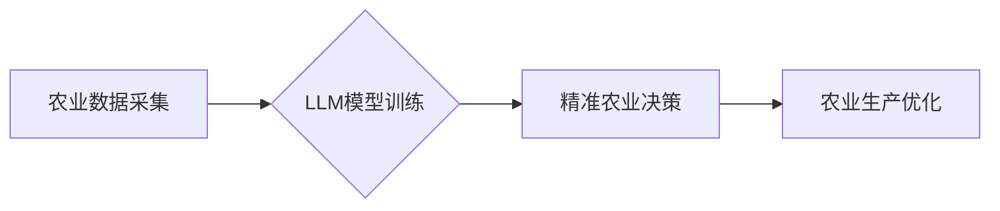

                 

## 农业智能化：LLM在精准农业中的应用前景

> 关键词：大型语言模型 (LLM)、精准农业、农业智能化、数据分析、机器学习、自然语言处理 (NLP)、农业可持续发展

## 1. 背景介绍

农业，作为人类文明的基石，一直面临着产量提升、资源利用效率和环境可持续性的挑战。随着人口增长和气候变化的加剧，这些挑战变得更加迫切。精准农业应运而生，旨在通过数据驱动和智能技术，实现农业生产的精细化管理，提高资源利用效率、降低环境影响，最终实现粮食安全和可持续发展。

大型语言模型 (LLM) 作为人工智能领域近年来取得的重大突破，其强大的文本理解和生成能力为精准农业的数字化转型提供了新的机遇。LLM 可以处理海量农业数据，识别模式、提取关键信息，并生成可操作的建议，从而帮助农民提高决策效率、优化生产流程，实现精准化管理。

## 2. 核心概念与联系

**2.1 精准农业**

精准农业是指利用现代信息技术和传感器网络，对农业生产进行精细化管理，根据不同作物、不同土壤、不同气候条件，制定个性化的施肥、灌溉、病虫害防治方案，实现资源的优化配置和生产效率的提升。

**2.2 大型语言模型 (LLM)**

大型语言模型 (LLM) 是基于深度学习算法训练的强大人工智能模型，能够理解和生成人类语言。通过学习海量文本数据，LLM 掌握了丰富的语言知识和语法规则，可以进行文本分类、摘要、翻译、问答等多种任务。

**2.3 核心概念联系**

LLM 可以帮助精准农业实现以下目标：

* **数据分析与洞察:** LLM 可以分析农业传感器数据、气候数据、土壤数据等，识别作物生长规律、病虫害风险、土壤肥力等关键信息，为精准决策提供数据支持。
* **智能化决策支持:** LLM 可以根据分析结果，生成个性化的施肥、灌溉、病虫害防治方案，帮助农民做出更科学、更精准的决策。
* **自动化任务执行:** LLM 可以控制农业机械设备，实现自动化播种、喷洒、收获等任务，提高生产效率，降低人工成本。
* **知识共享与传播:** LLM 可以帮助构建农业知识库，将专家经验和技术知识转化为可理解的文本信息，方便农民学习和应用。

**2.4 核心架构**



## 3. 核心算法原理 & 具体操作步骤

**3.1 算法原理概述**

LLM 的核心算法原理是基于 Transformer 架构的深度学习模型。Transformer 模型通过自注意力机制，能够捕捉文本序列中的长距离依赖关系，实现更准确的文本理解和生成。

**3.2 算法步骤详解**

1. **数据预处理:** 收集农业相关数据，进行清洗、格式化、标记等预处理操作。
2. **模型训练:** 使用预处理后的数据训练 Transformer 模型，通过反向传播算法，不断调整模型参数，使其能够准确地理解和生成农业相关文本。
3. **模型评估:** 使用测试数据评估模型的性能，例如准确率、召回率、F1-score 等指标。
4. **模型部署:** 将训练好的模型部署到生产环境中，用于实际的农业应用场景。

**3.3 算法优缺点**

**优点:**

* 强大的文本理解和生成能力
* 可以处理海量文本数据
* 可以识别复杂的模式和关系

**缺点:**

* 训练成本高
* 需要大量的训练数据
* 对硬件资源要求高

**3.4 算法应用领域**

* **作物识别:** 利用图像识别技术和 LLMs，识别不同作物种类，并进行生长阶段判断。
* **病虫害诊断:** 分析作物病虫害症状描述，结合 LLMs 的知识库，进行病虫害诊断。
* **精准施肥:** 根据土壤分析数据和作物生长需求，利用 LLMs 生成个性化的施肥方案。
* **灌溉管理:** 分析天气预报和土壤湿度数据，利用 LLMs 生成精准的灌溉方案。

## 4. 数学模型和公式 & 详细讲解 & 举例说明

**4.1 数学模型构建**

LLM 的训练过程本质上是一个优化问题，目标是找到模型参数，使得模型在训练数据上的预测结果与真实标签尽可能接近。常用的损失函数包括交叉熵损失函数和均方误差损失函数。

**4.2 公式推导过程**

假设模型的输出为 $y$, 真实标签为 $t$, 则交叉熵损失函数可以表示为:

$$
L = -\sum_{i=1}^{N} t_i \log(y_i)
$$

其中，$N$ 为样本数量。

**4.3 案例分析与讲解**

例如，在作物识别任务中，模型的输出为不同作物类别的概率分布，真实标签为对应的类别。通过最小化交叉熵损失函数，模型可以学习到不同作物特征的表示，并提高识别准确率。

## 5. 项目实践：代码实例和详细解释说明

**5.1 开发环境搭建**

* Python 3.7+
* TensorFlow 或 PyTorch 深度学习框架
* CUDA 和 cuDNN (可选，用于 GPU 加速)

**5.2 源代码详细实现**

```python
# 使用 TensorFlow 框架实现一个简单的 LLM 模型
import tensorflow as tf

# 定义模型结构
model = tf.keras.Sequential([
    tf.keras.layers.Embedding(input_dim=vocab_size, output_dim=embedding_dim),
    tf.keras.layers.LSTM(units=hidden_size),
    tf.keras.layers.Dense(units=num_classes, activation='softmax')
])

# 编译模型
model.compile(optimizer='adam', loss='sparse_categorical_crossentropy', metrics=['accuracy'])

# 训练模型
model.fit(train_data, train_labels, epochs=num_epochs)

# 评估模型
loss, accuracy = model.evaluate(test_data, test_labels)
print('Loss:', loss)
print('Accuracy:', accuracy)
```

**5.3 代码解读与分析**

* `Embedding` 层将单词映射到低维向量空间，捕捉单词之间的语义关系。
* `LSTM` 层是一个循环神经网络，能够捕捉文本序列中的长距离依赖关系。
* `Dense` 层是一个全连接层，用于将 LSTM 层的输出映射到不同类别的概率分布。
* `adam` 是一个常用的优化算法，用于更新模型参数。
* `sparse_categorical_crossentropy` 是一个常用的损失函数，用于分类任务。

**5.4 运行结果展示**

训练完成后，可以将模型应用于实际的农业场景，例如作物识别、病虫害诊断等。

## 6. 实际应用场景

**6.1 作物识别**

LLM 可以分析作物图像，识别不同作物种类，并判断其生长阶段。这可以帮助农民及时采取措施，提高作物产量。

**6.2 病虫害诊断**

LLM 可以分析作物病虫害症状描述，结合其知识库，进行病虫害诊断。这可以帮助农民及时采取防治措施，减少病虫害造成的损失。

**6.3 精准施肥**

LLM 可以分析土壤分析数据和作物生长需求，生成个性化的施肥方案。这可以帮助农民优化施肥量和施肥时间，提高肥料利用率，减少环境污染。

**6.4 灌溉管理**

LLM 可以分析天气预报和土壤湿度数据，生成精准的灌溉方案。这可以帮助农民节约用水资源，提高灌溉效率。

**6.5 未来应用展望**

LLM 在农业领域的应用前景广阔，未来可能应用于以下领域：

* **农业机器人:** LLM 可以帮助农业机器人理解环境信息，自主完成采摘、播种、喷洒等任务。
* **农业预测:** LLM 可以分析历史数据和天气预报，预测作物产量、病虫害风险等，帮助农民制定生产计划。
* **农业决策支持:** LLM 可以为农民提供个性化的决策建议，帮助他们提高生产效率和效益。

## 7. 工具和资源推荐

**7.1 学习资源推荐**

* **书籍:**
    * 《深度学习》 by Ian Goodfellow, Yoshua Bengio, and Aaron Courville
    * 《自然语言处理》 by Dan Jurafsky and James H. Martin
* **在线课程:**
    * Coursera: Deep Learning Specialization
    * Udacity: Natural Language Processing Nanodegree

**7.2 开发工具推荐**

* **TensorFlow:** https://www.tensorflow.org/
* **PyTorch:** https://pytorch.org/
* **Hugging Face Transformers:** https://huggingface.co/transformers/

**7.3 相关论文推荐**

* **BERT: Pre-training of Deep Bidirectional Transformers for Language Understanding**
* **GPT-3: Language Models are Few-Shot Learners**
* **XLNet: Generalized Autoregressive Pretraining for Language Understanding**

## 8. 总结：未来发展趋势与挑战

**8.1 研究成果总结**

LLM 在农业领域的应用取得了显著进展，例如作物识别、病虫害诊断、精准施肥等方面都取得了不错的效果。

**8.2 未来发展趋势**

* **模型规模和性能提升:** 未来 LLMs 的规模和性能将会进一步提升，能够处理更复杂的任务，提供更精准的决策建议。
* **多模态融合:** LLMs 将与其他模态数据，例如图像、音频、视频等融合，实现更全面的农业信息感知和分析。
* **边缘计算部署:** LLMs 将部署到边缘设备，实现更实时、更低延迟的农业应用。

**8.3 面临的挑战**

* **数据获取和标注:** 农业数据往往分散、异构，需要进行大量的标注工作，这对于 LLMs 的训练是一个挑战。
* **模型解释性和可信度:** LLMs 的决策过程往往是黑盒式的，缺乏可解释性，这对于农业应用的推广和接受度是一个挑战。
* **隐私和安全:** 农业数据往往包含敏感信息，需要保证数据的隐私和安全。

**8.4 研究展望**

未来研究将重点关注以下方面:

* 开发更有效的农业数据标注方法。
* 研究 LLMs 的可解释性和可信度提升方法。
* 探索 LLMs 在农业领域的更多应用场景。


## 9. 附录：常见问题与解答

**9.1 如何获取农业数据？**

农业数据可以从以下渠道获取:

* **政府机构:** 许多政府机构发布农业统计数据和监测数据。
* **科研机构:** 农业科研机构通常会收集和分析农业数据。
* **企业:** 一些农业企业会收集和分析其自身的生产数据。
* **传感器网络:** 农业传感器网络可以实时采集作物生长、土壤湿度、气象等数据。

**9.2 如何训练 LLMs？**

训练 LLMs 需要大量的计算资源和专业知识。可以使用开源框架，例如 TensorFlow 或 PyTorch，以及预训练模型，例如 BERT 或 GPT-3，简化训练过程。

**9.3 LLMs 在农业应用中的安全性如何保证？**

在部署 LLMs 到生产环境时，需要采取措施保证数据的隐私和安全，例如数据加密、访问控制等。


作者：禅与计算机程序设计艺术 / Zen and the Art of Computer Programming 
<end_of_turn>

