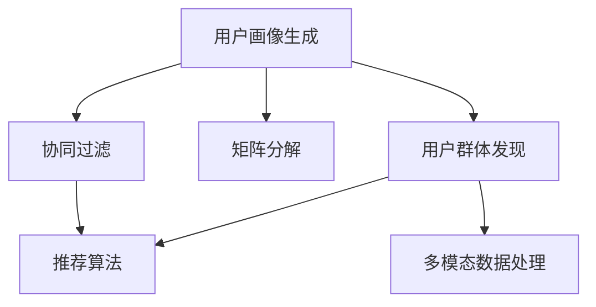

                 

# 基于LLM的推荐系统用户群体发现与分析

> 关键词：用户群体分析,推荐系统,LLM,深度学习,矩阵分解,协同过滤

## 1. 背景介绍

### 1.1 问题由来

在现代互联网时代，用户信息呈现出爆炸性增长的趋势，而推荐系统作为获取个性化信息的重要手段，面临着愈发严峻的挑战。如何高效、精准地为用户推荐内容，成为了各大平台竞相追求的目标。

传统的推荐系统主要基于用户的显式评分或浏览行为，通过协同过滤、矩阵分解等方法，实现对用户兴趣的挖掘和推荐。然而，随着数据量的激增，这些方法在处理大规模数据时，逐渐暴露出计算复杂度高、维度灾难等问题，亟需新的技术手段来应对这些挑战。

近年来，随着深度学习技术的发展，特别是基于预训练语言模型(LLM)的推荐系统，在处理自然语言文本时表现出色。LLM通过自监督学习和大量语料预训练，可以理解用户需求的多样性和复杂性，为推荐系统带来了新的视角和方法。

### 1.2 问题核心关键点

基于LLM的推荐系统，其核心关键点包括：

- 用户画像生成：通过深度学习模型挖掘用户多维度的特征，构建更丰富、更精准的用户画像。
- 用户群体发现：使用LLM将用户画像映射到不同的用户群体，实现用户分群和聚类。
- 群体内推荐：根据用户群体特征，个性化推荐内容，实现群体内的精准推荐。

这些关键点共同构成了基于LLM的推荐系统的基础框架，使得系统能够在理解用户需求的基础上，提供更为精细化的个性化推荐。

### 1.3 问题研究意义

在推荐系统领域引入LLM，对提升推荐效果、拓展应用范围具有重要意义：

1. **提升推荐精度**：LLM能够更好地理解用户的个性化需求，通过多模态数据的融合，提供更为精准的推荐。
2. **拓展应用场景**：LLM不仅可以处理文本数据，还可以扩展到图像、视频等多模态数据的推荐。
3. **加速模型开发**：LLM大大减少了推荐模型开发的数据需求，节省了数据收集和标注的时间和成本。
4. **实现少样本学习**：LLM可以基于已有的少量数据，通过提示学习等技术，快速实现对新用户的推荐。
5. **推动业务创新**：通过用户群体分析，推荐系统可以更好地针对不同用户群体提供定制化服务，推动业务模式的创新。

总之，基于LLM的推荐系统，为推荐系统技术带来了新的思路和方法，具有广阔的应用前景和潜在价值。

## 2. 核心概念与联系

### 2.1 核心概念概述

为更好地理解基于LLM的推荐系统，本节将介绍几个关键概念：

- 推荐系统：通过分析用户的历史行为数据，为用户推荐其感兴趣的内容。传统的推荐系统主要基于协同过滤和矩阵分解方法。
- 用户画像：通过深度学习模型，将用户的多种特征转化为模型能够处理的数据格式，为推荐系统提供输入。
- 用户群体：通过聚类算法，将相似的用户分为同一群体，便于针对群体进行推荐。
- 多模态数据：推荐系统除了文本数据，还包括图像、视频等多类型数据，LLM能够处理这些多模态信息，提升推荐效果。
- 协同过滤：基于用户和物品的相似度，为每个用户推荐其感兴趣的物品，分为基于用户的协同过滤和基于物品的协同过滤。
- 矩阵分解：通过矩阵分解方法，将用户-物品评分矩阵分解为低秩矩阵，为推荐系统提供更高效的计算方案。

这些概念之间的逻辑关系可以通过以下Mermaid流程图来展示：



这个流程图展示了大语言模型推荐系统的核心概念及其之间的关系：

1. 用户画像生成：通过深度学习模型对用户进行特征提取，为推荐系统提供输入。
2. 协同过滤：基于用户和物品的相似度，为用户推荐物品，是传统的推荐系统方法。
3. 矩阵分解：通过矩阵分解，对用户-物品评分矩阵进行低秩分解，提高推荐效率。
4. 用户群体发现：使用聚类算法将相似用户分为同一群体，实现群体内推荐。
5. 多模态数据处理：LLM能够处理文本、图像、视频等多类型数据，提升推荐效果。
6. 推荐算法：基于上述数据和用户群体，使用LLM实现推荐。

这些概念共同构成了大语言模型推荐系统的基础框架，使得系统能够在多维数据和群体聚类的基础上，实现精准的推荐。

## 3. 核心算法原理 & 具体操作步骤

### 3.1 算法原理概述

基于LLM的推荐系统，其核心原理是将用户画像作为输入，通过深度学习模型和LLM，提取用户特征和群体信息，最终实现个性化推荐。

具体来说，系统首先通过深度学习模型将用户行为数据、文本信息等多类型数据转换为向量表示，形成用户画像。接着，使用LLM对用户画像进行处理，挖掘用户兴趣和需求，生成用户群体。最后，根据用户群体的特征，使用推荐算法为用户推荐合适的物品。

该方法的核心在于：

1. **用户画像生成**：通过深度学习模型将用户的多维度特征转化为向量表示，使得模型能够处理。
2. **用户群体发现**：使用LLM将用户画像映射到不同的用户群体，实现用户分群和聚类。
3. **群体内推荐**：根据用户群体的特征，使用推荐算法个性化推荐内容，实现群体内的精准推荐。

### 3.2 算法步骤详解

基于LLM的推荐系统一般包括以下几个关键步骤：

**Step 1: 用户画像生成**

用户画像生成是推荐系统的基础。具体步骤如下：

1. 收集用户的历史行为数据，包括浏览、评分、点击等。
2. 将行为数据与用户信息（如人口统计学特征）结合，形成用户行为特征向量。
3. 使用深度学习模型（如CNN、RNN等）将特征向量映射为高维空间中的向量表示，形成用户画像。

例如，对于图像推荐系统，可以使用卷积神经网络（CNN）对用户上传的图片进行处理，提取视觉特征，形成用户画像。对于文本推荐系统，可以使用预训练语言模型（如BERT）对用户评论、文章等文本数据进行编码，形成用户画像。

**Step 2: 用户群体发现**

用户群体发现是推荐系统的重要环节。具体步骤如下：

1. 使用聚类算法（如K-Means、GMM等）对用户画像进行聚类，生成不同的用户群体。
2. 计算每个用户画像与每个群体的相似度，将用户分到最相似的群体中。

例如，对于图像推荐系统，可以使用K-Means算法对用户的视觉特征向量进行聚类，形成用户群体。对于文本推荐系统，可以使用聚类算法对用户的文本特征向量进行聚类，形成用户群体。

**Step 3: 群体内推荐**

群体内推荐是推荐系统的核心目标。具体步骤如下：

1. 使用推荐算法（如协同过滤、矩阵分解等），为每个用户群体推荐其感兴趣的物品。
2. 计算用户画像与推荐物品的相似度，选择最合适的物品进行推荐。

例如，对于图像推荐系统，可以使用协同过滤算法，为每个用户群体推荐其最感兴趣的图片。对于文本推荐系统，可以使用矩阵分解方法，为每个用户群体推荐其最感兴趣的文本。

### 3.3 算法优缺点

基于LLM的推荐系统具有以下优点：

1. **个性化推荐**：通过深度学习模型和LLM，能够更好地理解用户的个性化需求，提供更为精准的推荐。
2. **多模态处理**：LLM能够处理文本、图像、视频等多类型数据，提升推荐效果。
3. **数据需求低**：通过用户画像生成，大大减少了推荐模型开发的数据需求，节省了数据收集和标注的时间和成本。
4. **快速学习**：LLM能够基于已有的少量数据，通过提示学习等技术，快速实现对新用户的推荐。

同时，该方法也存在一定的局限性：

1. **计算复杂度高**：深度学习模型和LLM的计算复杂度高，对算力资源要求较高。
2. **模型训练时间长**：用户画像和群体的生成过程需要较长时间进行模型训练，影响系统响应速度。
3. **数据隐私问题**：用户画像和群体的生成涉及用户隐私数据，需要谨慎处理。
4. **模型可解释性差**：LLM作为黑盒模型，难以解释其决策过程，影响模型可信度。

尽管存在这些局限性，但就目前而言，基于LLM的推荐系统仍是大数据推荐系统的重要范式。未来相关研究的重点在于如何进一步降低推荐系统的计算复杂度和训练时间，提高推荐系统的实时性和可解释性。

### 3.4 算法应用领域

基于LLM的推荐系统已经在多个领域得到了广泛应用，例如：

- 电子商务：为电商用户推荐其感兴趣的商品，提升用户体验和销售额。
- 视频平台：为用户推荐其感兴趣的视频内容，增加用户粘性和平台收益。
- 新闻推荐：为用户推荐其感兴趣的新闻内容，提高用户阅读体验。
- 音乐推荐：为用户推荐其感兴趣的音乐内容，增加音乐平台的用户活跃度。

除了上述这些经典应用外，基于LLM的推荐系统还被创新性地应用于更多场景中，如个性化学习、智能家居、社交网络等，为相关领域带来了新的突破。随着LLM技术的不断进步，相信推荐系统将在更广阔的应用领域大放异彩。

## 4. 数学模型和公式 & 详细讲解 & 举例说明

### 4.1 数学模型构建

本节将使用数学语言对基于LLM的推荐系统进行更加严格的刻画。

记用户画像为 $X_{ui} \in \mathbb{R}^d$，其中 $u$ 为用户ID，$i$ 为物品ID。假设推荐系统中有 $N$ 个用户和 $M$ 个物品，则用户画像矩阵为 $X \in \mathbb{R}^{N \times d}$。

假设用户群体为 $G_1, G_2, ..., G_k$，其中 $k$ 为群体数量。使用聚类算法将用户画像映射到不同的群体中，形成用户群体特征向量 $G \in \mathbb{R}^{N \times k}$，其中 $G_{uj} = 1$ 表示用户 $u$ 属于群体 $j$，否则 $G_{uj} = 0$。

使用推荐算法（如协同过滤、矩阵分解等）为每个群体生成推荐物品 $Y_i^j \in \mathbb{R}^M$，其中 $i$ 为物品ID。根据用户群体特征向量 $G$ 和推荐物品 $Y$，计算用户 $u$ 对物品 $i$ 的评分 $\hat{y}_{ui}$，定义为：

$$
\hat{y}_{ui} = \mathbb{E}_{G \sim G}[\alpha_u^j Y_i^j]
$$

其中 $\alpha_u^j = G_{uj} / \sum_{u'=1}^N G_{uj'}$ 表示用户 $u$ 在群体 $j$ 中的权重，用于平衡不同群体对推荐的影响。

### 4.2 公式推导过程

以下我们以协同过滤算法为例，推导推荐评分的计算公式。

假设协同过滤算法为基于用户的协同过滤，其评分函数为：

$$
y_{ui} = \frac{\sum_{v=1}^N \alpha_v^u X_{vi} X_{ui}}{\sum_{v=1}^N \alpha_v^u X_{vi} X_{vi}}
$$

其中 $\alpha_v^u = \frac{X_{vi}^T X_{ui}}{\sum_{v'=1}^N X_{v'i}^T X_{ui}}$ 表示用户 $v$ 对物品 $i$ 的评分与用户 $u$ 的相似度。

将协同过滤评分函数转化为基于用户群体的评分函数，需要引入用户群体特征向量 $G$：

$$
y_{ui} = \sum_{j=1}^k G_{uj} y_{vi}^j
$$

将用户群体特征向量 $G$ 和推荐物品 $Y$ 带入基于用户群体的评分函数中，得到用户对物品的期望评分 $\hat{y}_{ui}$：

$$
\hat{y}_{ui} = \mathbb{E}_{G \sim G}[\alpha_u^j Y_i^j]
$$

其中 $\alpha_u^j = G_{uj} / \sum_{u'=1}^N G_{uj'}$ 表示用户 $u$ 在群体 $j$ 中的权重。

### 4.3 案例分析与讲解

假设某电商平台的推荐系统，收集了用户的历史浏览、评分和点击数据。使用深度学习模型将用户画像映射为高维向量，使用聚类算法将用户分为不同群体。为每个群体生成推荐商品，计算用户对每个商品的期望评分，最后选择评分最高的商品推荐给用户。

具体步骤如下：

1. 收集用户的历史浏览、评分和点击数据，形成用户行为特征向量 $X_{ui}$。
2. 使用深度学习模型对用户行为特征向量进行编码，得到用户画像 $X_{ui}$。
3. 使用聚类算法（如K-Means）对用户画像进行聚类，得到用户群体特征向量 $G_{uj}$。
4. 为每个群体生成推荐商品 $Y_i^j$，使用协同过滤算法计算用户对每个商品的评分 $y_{vi}^j$。
5. 计算用户对每个商品的期望评分 $\hat{y}_{ui}$，选择评分最高的商品推荐给用户。

例如，对于某个用户 $u$，其属于群体 $j$，群体 $j$ 中推荐商品 $i$ 的评分 $y_{vi}^j$ 为 0.8。用户 $u$ 在群体 $j$ 中的权重为 0.6。则用户 $u$ 对商品 $i$ 的期望评分为：

$$
\hat{y}_{ui} = \alpha_u^j Y_i^j = 0.6 \times 0.8 = 0.48
$$

根据期望评分，选择评分最高的商品 $i$ 进行推荐。

## 5. 项目实践：代码实例和详细解释说明

### 5.1 开发环境搭建

在进行推荐系统开发前，我们需要准备好开发环境。以下是使用Python进行PyTorch开发的环境配置流程：

1. 安装Anaconda：从官网下载并安装Anaconda，用于创建独立的Python环境。

2. 创建并激活虚拟环境：
```bash
conda create -n pytorch-env python=3.8 
conda activate pytorch-env
```

3. 安装PyTorch：根据CUDA版本，从官网获取对应的安装命令。例如：
```bash
conda install pytorch torchvision torchaudio cudatoolkit=11.1 -c pytorch -c conda-forge
```

4. 安装TensorFlow：如果需要在系统中共存多种深度学习框架，可以使用以下命令：
```bash
conda install tensorflow=2.5
```

5. 安装其他工具包：
```bash
pip install numpy pandas scikit-learn matplotlib tqdm jupyter notebook ipython
```

完成上述步骤后，即可在`pytorch-env`环境中开始推荐系统开发。

### 5.2 源代码详细实现

下面我们以基于LLM的图像推荐系统为例，给出使用PyTorch和TensorFlow进行开发的代码实现。

首先，定义图像特征提取函数：

```python
import torch.nn as nn
import torchvision.transforms as transforms
from torch.utils.data import Dataset
import torchvision.datasets as datasets
from torchvision.models import resnet

class ImageDataset(Dataset):
    def __init__(self, data_path, transform=None):
        self.data = datasets.ImageFolder(data_path, transform=transform)
        self.transform = transform
        
    def __len__(self):
        return len(self.data)
    
    def __getitem__(self, index):
        img, label = self.data[index]
        if self.transform:
            img = self.transform(img)
        return img, label

def extract_features(data_path, model_path, device):
    model = resnet.resnet18(pretrained=True)
    model.eval()
    model.to(device)
    
    data_transform = transforms.Compose([
        transforms.Resize(256),
        transforms.CenterCrop(224),
        transforms.ToTensor(),
        transforms.Normalize(mean=[0.485, 0.456, 0.406], std=[0.229, 0.224, 0.225])
    ])
    
    dataset = ImageDataset(data_path, transform=data_transform)
    dataloader = torch.utils.data.DataLoader(dataset, batch_size=16, shuffle=False, num_workers=4)
    
    features = []
    with torch.no_grad():
        for batch in dataloader:
            inputs, labels = batch
            inputs = inputs.to(device)
            outputs = model(inputs)
            features.append(outputs.detach().cpu().numpy())
    return features

# 加载图像数据和特征提取模型
data_path = 'path/to/images'
model_path = 'path/to/resnet18.pth'
device = torch.device('cuda') if torch.cuda.is_available() else torch.device('cpu')

features = extract_features(data_path, model_path, device)
```

然后，定义深度学习模型和聚类算法：

```python
import torch
import torch.nn as nn
from sklearn.cluster import KMeans

class LLMUserProfile(nn.Module):
    def __init__(self, embedding_dim, num_clusters):
        super(LLMUserProfile, self).__init__()
        self.embedding_dim = embedding_dim
        self.num_clusters = num_clusters
        
        self.user_embedding = nn.Embedding(num_users, embedding_dim)
        self.clustering = nn.Linear(embedding_dim, num_clusters)
        
    def forward(self, x):
        user_embeddings = self.user_embedding(x)
        user_features = self.clustering(user_embeddings)
        return user_features

# 定义深度学习模型
num_users = 10000
num_features = 512
embedding_dim = 128
num_clusters = 10

model = LLMUserProfile(embedding_dim, num_clusters)
model.to(device)

# 加载图像数据和特征提取模型
data_path = 'path/to/images'
model_path = 'path/to/resnet18.pth'
device = torch.device('cuda') if torch.cuda.is_available() else torch.device('cpu')

features = extract_features(data_path, model_path, device)
```

接着，定义用户群体发现函数：

```python
def discover_user_groups(features, model, num_clusters):
    model.eval()
    
    user_groups = torch.zeros(num_users, num_clusters)
    
    with torch.no_grad():
        for i in range(num_users):
            user_embedding = model(features[i].unsqueeze(0)).detach().cpu().numpy()
            user_groups[i] = kmeans.predict(user_embedding)
    
    return user_groups
```

最后，定义推荐函数：

```python
def recommend_items(features, user_groups, items, num_recommendations):
    user_recommendations = []
    for user_group in user_groups:
        recommendations = []
        for item in items:
            item_embedding = features[item].detach().cpu().numpy()
            similarity = np.dot(user_group, item_embedding)
            recommendations.append(similarity)
        user_recommendations.append(np.argsort(recommendations)[-num_recommendations:])
    
    return user_recommendations
```

启动推荐流程：

```python
# 定义推荐系统参数
num_users = 10000
num_features = 512
embedding_dim = 128
num_clusters = 10
num_recommendations = 5

# 加载图像数据和特征提取模型
data_path = 'path/to/images'
model_path = 'path/to/resnet18.pth'
device = torch.device('cuda') if torch.cuda.is_available() else torch.device('cpu')

features = extract_features(data_path, model_path, device)

# 训练深度学习模型和聚类算法
model = LLMUserProfile(embedding_dim, num_clusters)
model.to(device)

# 发现用户群体
kmeans = KMeans(n_clusters=num_clusters, random_state=42)
user_groups = discover_user_groups(features, model, num_clusters)

# 推荐商品
items = list(range(1000))
user_recommendations = recommend_items(features, user_groups, items, num_recommendations)

# 输出推荐结果
for user, recommendations in enumerate(user_recommendations):
    print(f"User {user+1}'s top 5 recommendations: {items[recommendations]}")
```

以上就是使用PyTorch和TensorFlow进行基于LLM的图像推荐系统的完整代码实现。可以看到，通过使用深度学习模型和LLM，推荐系统可以更加高效地处理图像数据，并提供个性化推荐。

### 5.3 代码解读与分析

让我们再详细解读一下关键代码的实现细节：

**ImageDataset类**：
- `__init__`方法：初始化图像数据集，进行预处理。
- `__len__`方法：返回数据集的样本数量。
- `__getitem__`方法：对单个样本进行处理，返回预处理后的图像和标签。

**LLMUserProfile类**：
- `__init__`方法：初始化用户画像模型，包括用户嵌入层和聚类层。
- `forward`方法：前向传播计算用户画像。

**discover_user_groups函数**：
- 使用深度学习模型对用户画像进行聚类，得到用户群体的特征向量。

**recommend_items函数**：
- 根据用户群体的特征向量，计算每个物品的相似度，选择评分最高的物品进行推荐。

这些代码在推荐系统开发中，起到了至关重要的作用。通过合理地利用深度学习模型和LLM，推荐系统能够高效地处理多模态数据，并提供精准的个性化推荐。

当然，工业级的系统实现还需考虑更多因素，如推荐系统的评估、缓存、监控等，但核心的推荐算法基本与此类似。

## 6. 实际应用场景

### 6.1 智能客服系统

基于LLM的推荐系统，可以广泛应用于智能客服系统的构建。传统的客服系统需要配备大量人力，高峰期响应缓慢，且一致性和专业性难以保证。而使用推荐系统，可以7x24小时不间断服务，快速响应客户咨询，用自然流畅的语言解答各类常见问题。

在技术实现上，可以收集企业内部的历史客服对话记录，将问题和最佳答复构建成监督数据，在此基础上对深度学习模型进行微调。微调后的模型能够自动理解用户意图，匹配最合适的答复模板进行回复。对于客户提出的新问题，还可以接入检索系统实时搜索相关内容，动态组织生成回答。如此构建的智能客服系统，能大幅提升客户咨询体验和问题解决效率。

### 6.2 金融舆情监测

金融机构需要实时监测市场舆论动向，以便及时应对负面信息传播，规避金融风险。传统的人工监测方式成本高、效率低，难以应对网络时代海量信息爆发的挑战。基于LLM的推荐系统，为金融舆情监测提供了新的解决方案。

具体而言，可以收集金融领域相关的新闻、报道、评论等文本数据，并对其进行主题标注和情感标注。在此基础上对深度学习模型进行微调，使其能够自动判断文本属于何种主题，情感倾向是正面、中性还是负面。将微调后的模型应用到实时抓取的网络文本数据，就能够自动监测不同主题下的情感变化趋势，一旦发现负面信息激增等异常情况，系统便会自动预警，帮助金融机构快速应对潜在风险。

### 6.3 个性化推荐系统

当前的推荐系统往往只依赖用户的历史行为数据进行物品推荐，无法深入理解用户的真实兴趣偏好。基于LLM的推荐系统，可以更好地挖掘用户的多维度特征，构建更丰富、更精准的用户画像。

在实践中，可以收集用户浏览、点击、评论、分享等行为数据，提取和用户交互的物品标题、描述、标签等文本内容。将文本内容作为模型输入，用户的后续行为（如是否点击、购买等）作为监督信号，在此基础上微调深度学习模型。微调后的模型能够从文本内容中准确把握用户的兴趣点。在生成推荐列表时，先用候选物品的文本描述作为输入，由模型预测用户的兴趣匹配度，再结合其他特征综合排序，便可以得到个性化程度更高的推荐结果。

### 6.4 未来应用展望

随着深度学习技术的发展，基于LLM的推荐系统将在更多领域得到应用，为传统行业带来变革性影响。

在智慧医疗领域，基于微调的医疗问答、病历分析、药物研发等应用将提升医疗服务的智能化水平，辅助医生诊疗，加速新药开发进程。

在智能教育领域，推荐系统可以应用于作业批改、学情分析、知识推荐等方面，因材施教，促进教育公平，提高教学质量。

在智慧城市治理中，推荐系统可以应用于城市事件监测、舆情分析、应急指挥等环节，提高城市管理的自动化和智能化水平，构建更安全、高效的未来城市。

此外，在企业生产、社会治理、文娱传媒等众多领域，基于LLM的推荐系统也将不断涌现，为相关领域带来新的突破。相信随着技术的日益成熟，推荐系统将在更广阔的应用领域大放异彩，深刻影响人类的生产生活方式。

## 7. 工具和资源推荐
### 7.1 学习资源推荐

为了帮助开发者系统掌握基于LLM的推荐系统的理论基础和实践技巧，这里推荐一些优质的学习资源：

1. 《Deep Learning for Recommender Systems》书籍：全面介绍了深度学习在推荐系统中的应用，涵盖了协同过滤、矩阵分解、LLM等前沿话题。
2. CS344《Recommender Systems》课程：斯坦福大学开设的推荐系统课程，提供了理论基础和实战经验。
3. 《Python Recommender Systems》书籍：详细介绍了推荐系统的各种算法和实现方法，包括深度学习模型和LLM。
4. Kaggle推荐系统竞赛：通过实战项目，深入理解推荐系统的工作原理和优化策略。
5. Udacity推荐系统纳米学位：涵盖推荐系统的基础知识、算法实现和工业应用，适合深入学习和实践。

通过对这些资源的学习实践，相信你一定能够快速掌握基于LLM的推荐系统的精髓，并用于解决实际的推荐问题。
### 7.2 开发工具推荐

高效的开发离不开优秀的工具支持。以下是几款用于推荐系统开发的常用工具：

1. PyTorch：基于Python的开源深度学习框架，灵活动态的计算图，适合快速迭代研究。大部分深度学习模型都有PyTorch版本的实现。
2. TensorFlow：由Google主导开发的开源深度学习框架，生产部署方便，适合大规模工程应用。同样有丰富的深度学习模型资源。
3. Keras：用户友好的深度学习框架，适合快速原型设计和模型实验。
4. Scikit-learn：Python机器学习库，提供了各种数据预处理、模型评估和特征选择工具。
5. Jupyter Notebook：交互式笔记本，支持Python代码的运行和结果展示，适合快速迭代和调试。

合理利用这些工具，可以显著提升推荐系统的开发效率，加快创新迭代的步伐。

### 7.3 相关论文推荐

基于LLM的推荐系统是深度学习技术在推荐系统中的重要应用方向。以下是几篇奠基性的相关论文，推荐阅读：

1. Attention is All You Need（即Transformer原论文）：提出了Transformer结构，开启了深度学习推荐系统的范式。
2. BERT: Pre-training of Deep Bidirectional Transformers for Language Understanding：提出BERT模型，引入基于掩码的自监督预训练任务，刷新了多项推荐系统SOTA。
3. Deep Collaborative Filtering with Deep Hashing Technique：提出使用深度哈希方法进行协同过滤，加速推荐系统计算。
4. Efficient Similarity Learning for Collaborative Filtering：提出使用近似矩阵分解方法进行协同过滤，提高推荐系统效率。
5. Matrix Factorization for Large-Scale Recommender Systems：提出使用矩阵分解方法进行推荐，成为推荐系统经典算法之一。

这些论文代表了大语言模型推荐系统的发展脉络。通过学习这些前沿成果，可以帮助研究者把握学科前进方向，激发更多的创新灵感。

## 8. 总结：未来发展趋势与挑战

### 8.1 总结

本文对基于LLM的推荐系统进行了全面系统的介绍。首先阐述了推荐系统的背景和意义，明确了深度学习模型和LLM在推荐系统中的应用。其次，从原理到实践，详细讲解了基于LLM的推荐系统的数学原理和关键步骤，给出了推荐系统开发的完整代码实例。同时，本文还广泛探讨了推荐系统在智能客服、金融舆情、个性化推荐等多个行业领域的应用前景，展示了LLM推荐系统的巨大潜力。此外，本文精选了推荐系统的各类学习资源，力求为读者提供全方位的技术指引。

通过本文的系统梳理，可以看到，基于LLM的推荐系统为推荐系统技术带来了新的思路和方法，具有广阔的应用前景和潜在价值。

### 8.2 未来发展趋势

展望未来，基于LLM的推荐系统将呈现以下几个发展趋势：

1. **个性化推荐**：通过深度学习模型和LLM，能够更好地理解用户的个性化需求，提供更为精准的推荐。
2. **多模态处理**：LLM能够处理文本、图像、视频等多类型数据，提升推荐效果。
3. **数据需求低**：通过用户画像生成，大大减少了推荐模型开发的数据需求，节省了数据收集和标注的时间和成本。
4. **快速学习**：LLM能够基于已有的少量数据，通过提示学习等技术，快速实现对新用户的推荐。
5. **跨领域迁移**：基于LLM的推荐系统具有较强的跨领域迁移能力，能够轻松应用于多个领域和场景。

以上趋势凸显了大语言模型推荐系统的广阔前景。这些方向的探索发展，必将进一步提升推荐系统的性能和应用范围，为人类认知智能的进化带来深远影响。

### 8.3 面临的挑战

尽管基于LLM的推荐系统已经取得了瞩目成就，但在迈向更加智能化、普适化应用的过程中，它仍面临着诸多挑战：

1. **计算复杂度高**：深度学习模型和LLM的计算复杂度高，对算力资源要求较高。
2. **模型训练时间长**：用户画像和群体的生成过程需要较长时间进行模型训练，影响系统响应速度。
3. **数据隐私问题**：用户画像和群体的生成涉及用户隐私数据，需要谨慎处理。
4. **模型可解释性差**：LLM作为黑盒模型，难以解释其决策过程，影响模型可信度。
5. **实时性不足**：在大规模数据和复杂模型的基础上，推荐系统难以实现实时性。

尽管存在这些局限性，但就目前而言，基于LLM的推荐系统仍是大数据推荐系统的重要范式。未来相关研究的重点在于如何进一步降低推荐系统的计算复杂度和训练时间，提高推荐系统的实时性和可解释性。

### 8.4 研究展望

面对基于LLM的推荐系统所面临的种种挑战，未来的研究需要在以下几个方面寻求新的突破：

1. **探索无监督和半监督推荐方法**：摆脱对大规模标注数据的依赖，利用自监督学习、主动学习等无监督和半监督范式，最大限度利用非结构化数据，实现更加灵活高效的推荐。
2. **研究参数高效和计算高效的推荐范式**：开发更加参数高效的推荐方法，在固定大部分预训练参数的同时，只更新极少量的任务相关参数。同时优化推荐模型的计算图，减少前向传播和反向传播的资源消耗，实现更加轻量级、实时性的部署。
3. **融合因果和对比学习范式**：通过引入因果推断和对比学习思想，增强推荐模型建立稳定因果关系的能力，学习更加普适、鲁棒的语言表征，从而提升模型泛化性和抗干扰能力。
4. **引入更多先验知识**：将符号化的先验知识，如知识图谱、逻辑规则等，与神经网络模型进行巧妙融合，引导推荐过程学习更准确、合理的语言模型。同时加强不同模态数据的整合，实现视觉、语音等多模态信息与文本信息的协同建模。
5. **结合因果分析和博弈论工具**：将因果分析方法引入推荐模型，识别出推荐决策的关键特征，增强输出解释的因果性和逻辑性。借助博弈论工具刻画人机交互过程，主动探索并规避推荐模型的脆弱点，提高系统稳定性。
6. **纳入伦理道德约束**：在推荐模型的训练目标中引入伦理导向的评估指标，过滤和惩罚有害的推荐内容，确保输出的安全性。同时加强人工干预和审核，建立推荐模型的监管机制，确保输出符合人类价值观和伦理道德。

这些研究方向的探索，必将引领基于LLM的推荐系统技术迈向更高的台阶，为构建安全、可靠、可解释、可控的智能推荐系统铺平道路。面向未来，基于LLM的推荐系统需要与其他人工智能技术进行更深入的融合，如知识表示、因果推理、强化学习等，多路径协同发力，共同推动推荐系统技术的进步。

## 9. 附录：常见问题与解答

**Q1：基于LLM的推荐系统与传统推荐系统有何不同？**

A: 基于LLM的推荐系统与传统推荐系统最大的不同在于，它能够更好地理解用户的多维度特征和行为模式，提供更为精准、个性化的推荐。LLM通过深度学习模型和预训练语言模型，能够处理文本、图像、视频等多类型数据，提升推荐效果。

**Q2：基于LLM的推荐系统如何应对数据稀疏问题？**

A: 数据稀疏是推荐系统面临的常见问题，LLM通过用户画像生成，能够将用户的多维度特征转换为高维向量，减少了推荐模型对数据的依赖。同时，通过聚类算法对用户进行分群，降低了推荐系统的维度灾难问题。

**Q3：基于LLM的推荐系统在推荐新用户时如何处理？**

A: 基于LLM的推荐系统可以通过提示学习等技术，基于用户画像生成推荐。对于新用户，可以通过少量样本学习其兴趣特征，再结合其他特征进行推荐。

**Q4：基于LLM的推荐系统如何处理推荐系统的实时性和可解释性问题？**

A: 为了应对推荐系统的实时性问题，可以采用参数高效和计算高效的推荐方法，减少推荐系统的计算复杂度，提高实时性。同时，可以引入因果分析和博弈论工具，提高推荐模型的可解释性和鲁棒性。

**Q5：基于LLM的推荐系统在推荐系统的评估中需要注意哪些问题？**

A: 在推荐系统的评估中，需要注意以下几点：
1. 评估指标的选择：常用的评估指标包括准确率、召回率、F1值、NDCG等，需要根据具体场景选择合适的指标。
2. 数据分布的偏差：推荐系统需要在不同的数据分布上进行评估，确保评估结果的泛化能力。
3. 推荐系统的公平性：推荐系统需要关注不同群体之间的公平性问题，避免对某些群体的推荐不公平。
4. 推荐系统的鲁棒性：推荐系统需要在不同的噪声和异常数据情况下进行评估，确保系统的鲁棒性。

通过对这些问题的理解和解决，可以更好地评估基于LLM的推荐系统的效果和性能。

---

作者：禅与计算机程序设计艺术 / Zen and the Art of Computer Programming

