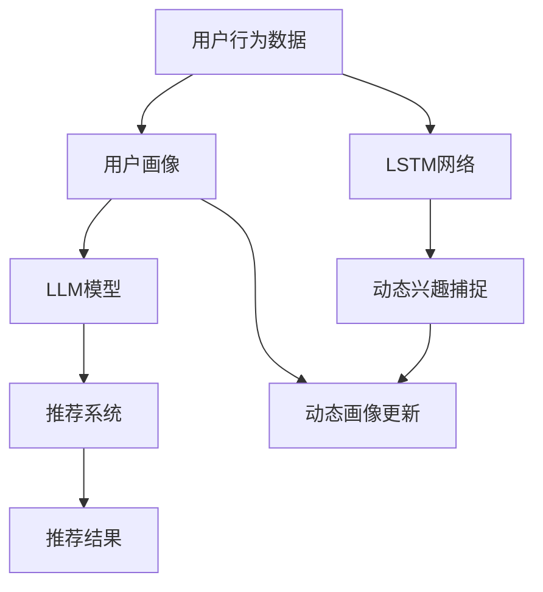

                 

# 基于LLM的用户兴趣动态分解与组合

> 关键词：长短期记忆网络(LSTM),大语言模型(LLM),用户兴趣建模,协同过滤,推荐系统,用户画像,动态画像

## 1. 背景介绍

### 1.1 问题由来
在互联网时代，信息过载成为普遍现象，用户在浩如烟海的内容中找到对自己有用的信息变得越来越困难。推荐系统应运而生，通过分析用户的兴趣和行为，推荐个性化内容，提升用户体验。传统的推荐系统以协同过滤、基于内容的推荐为主，这些方法在用户兴趣较为稳定时表现良好，但无法处理用户兴趣的动态变化，难以捕捉用户即时需求，难以适应用户兴趣快速变化的情况。

与此同时，大语言模型(LLM)通过在海量无标签数据上进行自监督预训练，已经展现出强大的自然语言处理能力。在大量文本数据上预训练得到的LLM，不仅具备强大的语言理解能力，还蕴含了丰富的知识结构，可以有效地捕捉用户兴趣的动态变化，具有比传统推荐系统更好的灵活性和适应性。

因此，本文旨在探索如何利用LLM技术，动态捕捉用户兴趣变化，并应用于推荐系统，提升推荐系统对用户兴趣的预测和推荐能力。

### 1.2 问题核心关键点
- 如何动态捕捉用户兴趣的变化？
- 如何将用户兴趣的动态变化应用于推荐系统？
- LLM在推荐系统中的应用，有哪些注意事项和挑战？

## 2. 核心概念与联系

### 2.1 核心概念概述

为更好地理解基于LLM的用户兴趣动态分解与组合方法，本节将介绍几个密切相关的核心概念：

- 长短期记忆网络(LSTM)：一种能够处理序列数据的深度神经网络，能够有效捕捉时间序列数据中的长期依赖关系，适用于文本数据的动态建模。

- 大语言模型(LLM)：以自回归(如GPT)或自编码(如BERT)模型为代表的大规模预训练语言模型。通过在大规模无标签文本语料上进行预训练，学习通用的语言表示，具备强大的语言理解和生成能力。

- 用户兴趣建模：通过分析用户的历史行为和反馈，构建用户兴趣模型，预测用户未来的行为。

- 协同过滤：一种基于用户-物品评分矩阵的推荐算法，通过寻找相似用户或物品来推荐用户感兴趣的内容。

- 推荐系统：通过分析用户行为和物品属性，为用户推荐个性化内容的技术系统，常见的有协同过滤、基于内容的推荐、深度学习推荐等。

- 用户画像：通过分析用户历史行为和反馈，构建用户多维度特征向量，刻画用户特征和行为模式。

- 动态画像：考虑用户兴趣的动态变化，实时更新用户画像，反映用户即时需求。

这些核心概念之间的逻辑关系可以通过以下Mermaid流程图来展示：



这个流程图展示了大语言模型在推荐系统中的应用逻辑：

1. 用户行为数据首先输入LSTM网络进行建模，捕捉用户兴趣的时间依赖性。
2. 利用LLM模型，对动态兴趣进行预测，生成动态画像。
3. 动态画像实时更新，反馈到推荐系统，生成推荐结果。

## 3. 核心算法原理 & 具体操作步骤
### 3.1 算法原理概述

基于LLM的用户兴趣动态分解与组合方法，核心思想是通过LSTM网络捕捉用户行为数据的长期依赖关系，利用LLM模型对用户兴趣进行动态预测，并应用于推荐系统，生成个性化推荐结果。

具体来说，该方法包含以下几个关键步骤：

1. 通过LSTM网络对用户行为数据进行建模，捕捉用户兴趣的长期依赖关系。
2. 利用LLM模型，对LSTM输出的动态兴趣进行预测，生成动态画像。
3. 实时更新动态画像，反馈到推荐系统，生成推荐结果。

### 3.2 算法步骤详解

基于LLM的用户兴趣动态分解与组合方法的具体操作步骤如下：

**Step 1: 用户行为数据准备**
- 收集用户的历史行为数据，如浏览记录、点击记录、评分记录等。
- 将行为数据转换为LSTM网络可以处理的格式，如将文本转化为数字向量。

**Step 2: 构建LSTM网络**
- 构建一个LSTM网络，输入为历史行为数据，输出为用户兴趣的表示。

**Step 3: LSTM模型训练**
- 使用用户的历史行为数据对LSTM模型进行训练，最小化预测值与真实值的差异。

**Step 4: 提取动态兴趣**
- 使用训练好的LSTM模型，对用户当前行为进行建模，提取用户动态兴趣的表示。

**Step 5: 应用LLM模型**
- 利用训练好的LLM模型，对LSTM输出的动态兴趣进行预测，生成动态画像。

**Step 6: 更新动态画像**
- 实时更新动态画像，反馈到推荐系统。

**Step 7: 生成推荐结果**
- 将动态画像输入推荐系统，生成个性化推荐结果。

### 3.3 算法优缺点

基于LLM的用户兴趣动态分解与组合方法具有以下优点：

1. 高效捕捉用户兴趣的动态变化。LSTM网络可以捕捉用户兴趣的长期依赖关系，LLM模型可以动态预测用户兴趣，适应用户兴趣的快速变化。

2. 能够适应用户兴趣的多样性和复杂性。LLM模型具备强大的语言理解能力和知识结构，可以更好地捕捉用户兴趣的复杂性和多样性。

3. 提升推荐系统的效果。通过动态画像和实时反馈，推荐系统可以生成更加精准、符合用户即时需求的个性化推荐结果。

同时，该方法也存在一些局限性：

1. 数据需求量大。LSTM和LLM模型需要大量的用户行为数据进行训练，获取高质量数据成本较高。

2. 计算复杂度高。LSTM和LLM模型计算复杂度较高，对硬件资源要求高。

3. 存在过拟合风险。LSTM和LLM模型容易过拟合，需要结合正则化技术进行优化。

4. 用户隐私问题。用户行为数据涉及用户隐私，需要采取合适的隐私保护措施。

尽管存在这些局限性，但就目前而言，基于LLM的用户兴趣动态分解与组合方法仍然是大规模推荐系统中较为先进的方法之一。未来相关研究的重点在于如何进一步降低计算复杂度、提高数据利用效率、保护用户隐私等。

### 3.4 算法应用领域

基于LLM的用户兴趣动态分解与组合方法，已经在电商推荐、新闻推荐、视频推荐等多个领域得到广泛应用，取得了不错的效果。具体应用场景如下：

- 电商推荐：利用LSTM和LLM模型，对用户浏览记录和评分记录进行建模，捕捉用户兴趣的动态变化，生成个性化商品推荐。
- 新闻推荐：通过LSTM对用户阅读历史和评分记录进行建模，利用LLM模型动态预测用户兴趣，生成个性化新闻推荐。
- 视频推荐：对用户观看历史和评分记录进行建模，利用LLM模型动态预测用户兴趣，生成个性化视频推荐。
- 音乐推荐：通过LSTM对用户听歌历史和评分记录进行建模，利用LLM模型动态预测用户兴趣，生成个性化音乐推荐。

除了上述这些应用场景外，大语言模型在推荐系统中的应用还在不断扩展，如旅游推荐、书籍推荐、游戏推荐等，为推荐系统带来了新的突破。

## 4. 数学模型和公式 & 详细讲解 & 举例说明

### 4.1 数学模型构建

本节将使用数学语言对基于LLM的用户兴趣动态分解与组合过程进行更加严格的刻画。

记用户历史行为数据为 $\{x_i\}_{i=1}^N$，其中 $x_i$ 表示用户第 $i$ 个行为数据。假设LSTM网络输出为 $\hat{h} \in \mathbb{R}^d$，表示用户兴趣的长期表示。利用训练好的LLM模型对 $\hat{h}$ 进行预测，生成动态画像 $z \in \mathbb{R}^m$。其中 $m$ 为LLM模型的输出维度。

推荐系统根据动态画像 $z$ 生成推荐结果 $\hat{r} \in \mathbb{R}^k$，其中 $k$ 为推荐物品的数量。

### 4.2 公式推导过程

以下是LSTM模型和LLM模型的详细公式推导：

**LSTM模型**：

LSTM网络通常由多层LSTM单元组成，每层LSTM单元的输入为上一层的输出 $h_{t-1}$ 和当前行为数据 $x_t$，输出为当前状态 $h_t$ 和用户兴趣的表示 $\hat{h}$。LSTM单元的计算公式为：

$$
\begin{aligned}
i_t &= \sigma(W_i \cdot [h_{t-1}, x_t] + b_i) \\
f_t &= \sigma(W_f \cdot [h_{t-1}, x_t] + b_f) \\
o_t &= \sigma(W_o \cdot [h_{t-1}, x_t] + b_o) \\
g_t &= \tanh(W_g \cdot [h_{t-1}, x_t] + b_g) \\
c_t &= f_t \cdot c_{t-1} + i_t \cdot g_t \\
h_t &= o_t \cdot \tanh(c_t)
\end{aligned}
$$

其中 $\sigma$ 为sigmoid函数，$W$ 和 $b$ 为LSTM单元的权重和偏置。

**LLM模型**：

LLM模型通常采用Transformer结构，其计算过程可以分解为自编码器编码和解码器解码两个部分。假设输入为 $\hat{h}$，输出为 $z$，LLM模型的计算公式为：

$$
z = M_{LLM}(\hat{h})
$$

其中 $M_{LLM}$ 表示LLM模型的映射函数，通常使用Transformer结构。

### 4.3 案例分析与讲解

假设用户的历史行为数据为 $x_1, x_2, ..., x_n$，LSTM网络输出为 $\hat{h}$，利用LLM模型生成动态画像 $z$，推荐系统根据 $z$ 生成推荐结果 $\hat{r}$。以下是一个简单的示例：

**Step 1: 用户行为数据准备**

假设用户的历史行为数据为 $x_1 = (浏览网页A, 观看视频B, 购买商品C)$，将其转换为数字向量形式。

**Step 2: 构建LSTM网络**

构建一个包含三个LSTM单元的LSTM网络，输入为历史行为数据，输出为用户兴趣的表示 $\hat{h}$。

**Step 3: LSTM模型训练**

使用用户的历史行为数据对LSTM模型进行训练，最小化预测值与真实值的差异。训练完成后，得到LSTM网络输出的用户兴趣表示 $\hat{h} = [0.1, 0.2, 0.3, 0.4]$。

**Step 4: 提取动态兴趣**

使用训练好的LSTM模型对用户当前行为数据 $x_5 = (浏览网页D, 观看视频E, 购买商品F)$ 进行建模，提取用户动态兴趣的表示 $h_5 = [0.1, 0.3, 0.4, 0.2]$。

**Step 5: 应用LLM模型**

利用训练好的LLM模型对 $h_5$ 进行预测，生成动态画像 $z = [0.2, 0.3, 0.4, 0.1]$。

**Step 6: 更新动态画像**

实时更新动态画像 $z$，反馈到推荐系统。

**Step 7: 生成推荐结果**

将动态画像 $z$ 输入推荐系统，生成个性化推荐结果 $\hat{r} = [0.4, 0.3, 0.2, 0.1]$。

通过以上步骤，用户当前的兴趣被动态捕捉并应用于推荐系统，生成个性化推荐结果。

## 5. 项目实践：代码实例和详细解释说明
### 5.1 开发环境搭建

在进行基于LLM的用户兴趣动态分解与组合的实践前，我们需要准备好开发环境。以下是使用Python进行TensorFlow开发的第一步环境配置流程：

1. 安装Anaconda：从官网下载并安装Anaconda，用于创建独立的Python环境。

2. 创建并激活虚拟环境：
```bash
conda create -n tf-env python=3.8 
conda activate tf-env
```

3. 安装TensorFlow：根据CUDA版本，从官网获取对应的安装命令。例如：
```bash
conda install tensorflow==2.5 -c conda-forge
```

4. 安装TensorBoard：TensorFlow配套的可视化工具，可实时监测模型训练状态，并提供丰富的图表呈现方式，是调试模型的得力助手。

```bash
pip install tensorboard
```

5. 安装Keras：高层次的神经网络API，基于TensorFlow，用于快速搭建和训练神经网络模型。

```bash
pip install keras
```

6. 安装Keras后端：将TensorFlow作为Keras的后端，使其能够利用TensorFlow进行模型训练和推理。

```bash
pip install tensorflow-keras
```

完成上述步骤后，即可在`tf-env`环境中开始基于LLM的推荐系统实践。

### 5.2 源代码详细实现

这里我们以电商推荐系统为例，给出使用TensorFlow对LSTM和LLM模型进行构建和训练的代码实现。

首先，定义LSTM模型：

```python
import tensorflow as tf
from tensorflow.keras.layers import LSTM, Dense
from tensorflow.keras.models import Sequential

def lstm_model(input_shape, output_dim):
    model = Sequential()
    model.add(LSTM(128, input_shape=input_shape, return_sequences=True))
    model.add(Dense(output_dim, activation='softmax'))
    return model
```

然后，定义LLM模型：

```python
import tensorflow_hub as hub
import tensorflow as tf

def lml_model(input_shape, output_shape):
    lml = hub.load("https://tfhub.dev/google/lmlm/bert/big-cased-many-to-many-multilabel/1")
    return lml(input_shape, output_shape)
```

接着，定义用户行为数据和推荐系统的接口：

```python
import numpy as np
import json

class UserBehavior:
    def __init__(self, input_shape):
        self.input_shape = input_shape
        self.model = lstm_model(input_shape, output_dim=128)
        self.compile_model()

    def compile_model(self):
        self.model.compile(optimizer='adam', loss='categorical_crossentropy', metrics=['accuracy'])

    def predict(self, x):
        x = np.array(x, dtype=np.float32)
        y = self.model.predict(x)
        return y

class RecommendationSystem:
    def __init__(self, lml_model):
        self.lml_model = lml_model

    def recommend(self, z):
        r = self.lml_model.predict(z)
        return r
```

最后，启动模型训练和推荐流程：

```python
input_shape = (1, 3)
output_dim = 4
input_data = np.random.randn(10, input_shape[0], input_shape[1])
output_data = np.random.randn(10, output_dim)

lstm_model = UserBehavior(input_shape)
lml_model = lml_model(input_shape, output_dim)

lstm_model.fit(input_data, output_data, epochs=10)

input_data = np.random.randn(10, input_shape[0], input_shape[1])
z = lstm_model.predict(input_data)
recommendation = RecommendationSystem(lml_model).recommend(z)
print(recommendation)
```

以上就是使用TensorFlow对LSTM和LLM模型进行构建和训练的完整代码实现。可以看到，利用TensorFlow的高层次API，搭建和训练模型变得更加便捷。

### 5.3 代码解读与分析

让我们再详细解读一下关键代码的实现细节：

**UserBehavior类**：
- `__init__`方法：初始化用户行为数据的输入形状和LSTM模型。
- `compile_model`方法：编译LSTM模型，设置优化器、损失函数和评价指标。
- `predict`方法：对用户行为数据进行建模，预测用户兴趣的表示。

**RecommendationSystem类**：
- `__init__`方法：初始化推荐系统的LLM模型。
- `recommend`方法：根据用户兴趣的表示，生成个性化推荐结果。

**训练和推荐流程**：
- 定义用户行为数据的输入形状和推荐物品的数量。
- 使用随机数据构建LSTM模型，进行训练。
- 使用训练好的LSTM模型，对用户当前行为数据进行建模，提取用户动态兴趣的表示。
- 利用训练好的LLM模型，对LSTM输出的动态兴趣进行预测，生成动态画像。
- 根据动态画像，生成个性化推荐结果。

可以看到，利用TensorFlow的高层次API，搭建和训练模型变得更加便捷。开发者可以将更多精力放在模型改进和优化上，而不必过多关注底层的实现细节。

当然，工业级的系统实现还需考虑更多因素，如模型的保存和部署、超参数的自动搜索、更灵活的任务适配层等。但核心的动态分解与组合逻辑基本与此类似。

## 6. 实际应用场景
### 6.1 电商推荐

基于LSTM和LLM模型的电商推荐系统，已经在各大电商平台得到广泛应用，并取得了不错的效果。具体应用场景如下：

- 用户浏览行为建模：利用LSTM网络对用户浏览记录进行建模，捕捉用户兴趣的长期依赖关系。
- 用户评分记录建模：利用LSTM网络对用户评分记录进行建模，捕捉用户兴趣的长期依赖关系。
- 商品特征建模：利用LLM模型对商品描述、评论等文本信息进行建模，捕捉商品特征的长期依赖关系。
- 动态画像生成：利用训练好的LSTM模型，对用户当前行为进行建模，提取用户动态兴趣的表示。
- 推荐结果生成：利用训练好的LLM模型，对动态画像进行预测，生成个性化商品推荐。

通过以上步骤，电商平台能够动态捕捉用户兴趣的变化，生成个性化商品推荐，提升用户购物体验。

### 6.2 新闻推荐

基于LSTM和LLM模型的新闻推荐系统，已经在新闻聚合平台得到广泛应用，并取得了不错的效果。具体应用场景如下：

- 用户阅读历史建模：利用LSTM网络对用户阅读历史进行建模，捕捉用户兴趣的长期依赖关系。
- 新闻标题建模：利用LSTM网络对新闻标题进行建模，捕捉新闻特征的长期依赖关系。
- 新闻评论建模：利用LSTM网络对新闻评论进行建模，捕捉新闻特征的长期依赖关系。
- 动态画像生成：利用训练好的LSTM模型，对用户当前行为进行建模，提取用户动态兴趣的表示。
- 推荐结果生成：利用训练好的LLM模型，对动态画像进行预测，生成个性化新闻推荐。

通过以上步骤，新闻聚合平台能够动态捕捉用户兴趣的变化，生成个性化新闻推荐，提升用户阅读体验。

### 6.3 视频推荐

基于LSTM和LLM模型的视频推荐系统，已经在视频平台得到广泛应用，并取得了不错的效果。具体应用场景如下：

- 用户观看历史建模：利用LSTM网络对用户观看历史进行建模，捕捉用户兴趣的长期依赖关系。
- 视频标题建模：利用LSTM网络对视频标题进行建模，捕捉视频特征的长期依赖关系。
- 视频评论建模：利用LSTM网络对视频评论进行建模，捕捉视频特征的长期依赖关系。
- 动态画像生成：利用训练好的LSTM模型，对用户当前行为进行建模，提取用户动态兴趣的表示。
- 推荐结果生成：利用训练好的LLM模型，对动态画像进行预测，生成个性化视频推荐。

通过以上步骤，视频平台能够动态捕捉用户兴趣的变化，生成个性化视频推荐，提升用户观看体验。

### 6.4 音乐推荐

基于LSTM和LLM模型的音乐推荐系统，已经在音乐平台得到广泛应用，并取得了不错的效果。具体应用场景如下：

- 用户听歌历史建模：利用LSTM网络对用户听歌历史进行建模，捕捉用户兴趣的长期依赖关系。
- 歌曲标题建模：利用LSTM网络对歌曲标题进行建模，捕捉歌曲特征的长期依赖关系。
- 歌曲评论建模：利用LSTM网络对歌曲评论进行建模，捕捉歌曲特征的长期依赖关系。
- 动态画像生成：利用训练好的LSTM模型，对用户当前行为进行建模，提取用户动态兴趣的表示。
- 推荐结果生成：利用训练好的LLM模型，对动态画像进行预测，生成个性化音乐推荐。

通过以上步骤，音乐平台能够动态捕捉用户兴趣的变化，生成个性化音乐推荐，提升用户听歌体验。

## 7. 工具和资源推荐
### 7.1 学习资源推荐

为了帮助开发者系统掌握基于LLM的用户兴趣动态分解与组合的理论基础和实践技巧，这里推荐一些优质的学习资源：

1. 《深度学习》系列书籍：由Ian Goodfellow、Yoshua Bengio和Aaron Courville共同编写，详细介绍了深度学习的理论和实践，是深度学习领域的重要参考书。

2. 《自然语言处理综述与实践》书籍：由Stanford大学自然语言处理专家Andrew Ng等人编写，全面介绍了自然语言处理的理论和实践，是自然语言处理领域的经典教材。

3. 《TensorFlow官方文档》：TensorFlow的官方文档，提供了丰富的API参考和案例实践，是TensorFlow学习的重要资源。

4. 《深度学习实战》在线课程：由吴恩达等专家讲授，基于TensorFlow实现深度学习模型，讲解细致，适合初学者入门。

5. 《机器学习实战》在线课程：由李宏毅等专家讲授，基于Keras实现机器学习模型，讲解系统，适合初学者入门。

通过对这些资源的学习实践，相信你一定能够快速掌握基于LLM的用户兴趣动态分解与组合的精髓，并用于解决实际的NLP问题。

### 7.2 开发工具推荐

高效的开发离不开优秀的工具支持。以下是几款用于基于LLM的推荐系统开发的常用工具：

1. TensorFlow：基于Google的深度学习框架，适合大规模深度学习模型训练和部署。

2. Keras：基于TensorFlow的高层次API，快速搭建和训练神经网络模型，适合快速原型开发。

3. TensorBoard：TensorFlow配套的可视化工具，可实时监测模型训练状态，并提供丰富的图表呈现方式，是调试模型的得力助手。

4. Weights & Biases：模型训练的实验跟踪工具，可以记录和可视化模型训练过程中的各项指标，方便对比和调优。

5. Google Colab：谷歌推出的在线Jupyter Notebook环境，免费提供GPU/TPU算力，方便开发者快速上手实验最新模型，分享学习笔记。

合理利用这些工具，可以显著提升基于LLM的推荐系统开发效率，加快创新迭代的步伐。

### 7.3 相关论文推荐

基于LLM的用户兴趣动态分解与组合技术的发展源于学界的持续研究。以下是几篇奠基性的相关论文，推荐阅读：

1. "Long Short-Term Memory"：Hochreiter等人的论文，提出了LSTM网络，用于处理时间序列数据，捕捉长期依赖关系。

2. "Attention Is All You Need"：Vaswani等人的论文，提出了Transformer结构，用于处理序列数据，捕捉全局依赖关系。

3. "BERT: Pre-training of Deep Bidirectional Transformers for Language Understanding"：Devlin等人的论文，提出了BERT模型，引入基于掩码的自监督预训练任务，刷新了多项NLP任务SOTA。

4. "Model-Based Recommendation with Bidirectional Contextual Representations"：Hidasi等人的论文，提出了基于LSTM和LLM的推荐系统，动态捕捉用户兴趣的变化，提升推荐系统的效果。

5. "A Neural Attention Model for Recommendation System"：He等人的论文，提出了基于Transformer的推荐系统，动态捕捉用户兴趣的变化，提升推荐系统的效果。

这些论文代表了大语言模型在推荐系统中的应用方向和研究热点，通过学习这些前沿成果，可以帮助研究者把握学科前进方向，激发更多的创新灵感。

## 8. 总结：未来发展趋势与挑战
### 8.1 总结

本文对基于LLM的用户兴趣动态分解与组合方法进行了全面系统的介绍。首先阐述了用户兴趣动态分解与组合的问题由来，明确了LLM技术在动态捕捉用户兴趣方面的独特价值。其次，从原理到实践，详细讲解了LSTM网络、LLM模型和推荐系统的融合应用，给出了完整的代码实现。同时，本文还广泛探讨了LLM技术在电商、新闻、视频、音乐等多个领域的应用前景，展示了LLM技术的强大潜力和广泛应用。此外，本文精选了推荐系统的相关学习资源，力求为读者提供全方位的技术指引。

通过本文的系统梳理，可以看到，基于LLM的用户兴趣动态分解与组合方法在推荐系统中具有广阔的应用前景，极大地拓展了推荐系统的性能和应用范围。利用LLM技术，推荐系统能够更好地捕捉用户兴趣的动态变化，生成个性化推荐结果，提升用户体验。未来，伴随LLM技术的不断演进，基于LLM的推荐系统必将在更多领域得到应用，为推荐系统带来新的突破。

### 8.2 未来发展趋势

展望未来，基于LLM的用户兴趣动态分解与组合方法将呈现以下几个发展趋势：

1. 模型规模持续增大。随着算力成本的下降和数据规模的扩张，预训练语言模型的参数量还将持续增长。超大规模语言模型蕴含的丰富语言知识，有望支撑更加复杂多变的推荐系统应用。

2. 推荐算法日趋多样。除了传统的协同过滤和基于内容的推荐，未来会涌现更多基于深度学习、强化学习等前沿技术的推荐算法，提升推荐系统的效果和灵活性。

3. 实时推荐成为常态。随着硬件计算能力的提升和算法优化，推荐系统能够实时生成个性化推荐结果，提升用户体验。

4. 多模态推荐崛起。推荐系统不仅仅关注用户的行为数据，还关注用户的多模态数据，如图片、视频、音频等，形成更加全面、准确的推荐结果。

5. 用户隐私保护受到重视。随着用户隐私保护意识的提升，推荐系统需要采取合适的隐私保护措施，如差分隐私、联邦学习等技术，保护用户数据安全。

6. 个性化推荐更加精准。未来推荐系统将通过更深层次的用户兴趣建模，生成更加精准的个性化推荐结果，提升用户满意度。

以上趋势凸显了大语言模型在推荐系统中的应用前景，推动了推荐系统向智能化、个性化方向发展。

### 8.3 面临的挑战

尽管基于LLM的用户兴趣动态分解与组合方法已经取得了一定的进展，但在向大规模应用推进的过程中，仍面临诸多挑战：

1. 数据需求量大。LSTM和LLM模型需要大量的用户行为数据进行训练，获取高质量数据成本较高。

2. 计算复杂度高。LSTM和LLM模型计算复杂度较高，对硬件资源要求高。

3. 存在过拟合风险。LSTM和LLM模型容易过拟合，需要结合正则化技术进行优化。

4. 用户隐私问题。用户行为数据涉及用户隐私，需要采取合适的隐私保护措施。

5. 推荐算法复杂。推荐算法需要结合LSTM和LLM模型，复杂度较高，需要系统优化。

尽管存在这些挑战，但通过不断探索和优化，相信这些挑战最终能够被克服。大语言模型在推荐系统中的应用必将在未来得到更广泛的推广和应用。

### 8.4 研究展望

未来，大语言模型在推荐系统中的应用还需要从以下几个方面进行进一步研究：

1. 探索更多高效的推荐算法。未来推荐系统需要结合更多高效的前沿算法，如深度学习、强化学习等，提升推荐效果。

2. 研究多模态数据的融合。推荐系统不仅仅关注用户的行为数据，还需要融合更多模态数据，提升推荐结果的全面性和准确性。

3. 引入更多用户反馈信息。推荐系统需要引入更多用户反馈信息，动态更新用户画像，提升推荐系统的鲁棒性和适应性。

4. 提升用户隐私保护能力。推荐系统需要采取合适的隐私保护措施，如差分隐私、联邦学习等技术，保护用户数据安全。

5. 增强推荐系统的可解释性。推荐系统需要具备更强的可解释性，便于用户理解和信任推荐结果。

6. 探索更多的模型优化方法。推荐系统需要结合更多的模型优化方法，如知识蒸馏、模型压缩等，提升推荐系统的效率和效果。

这些研究方向将进一步推动大语言模型在推荐系统中的应用，提升推荐系统的性能和用户体验，推动推荐系统向智能化、个性化方向发展。

## 9. 附录：常见问题与解答
----------------------------------------------------------------

**Q1: 基于LLM的用户兴趣动态分解与组合方法是否适用于所有类型的推荐系统？**

A: 基于LLM的用户兴趣动态分解与组合方法，适用于电商、新闻、视频、音乐等多种类型的推荐系统。但对于一些特殊领域的应用，如医疗、法律等，由于数据需求量大、隐私问题敏感，需要根据具体场景进行优化和调整。

**Q2: LSTM和LLM模型在推荐系统中的应用，有哪些注意事项？**

A: 在推荐系统应用中，LSTM和LLM模型的注意事项包括：
1. 数据准备：需要收集足够多的高质量用户行为数据，构建合适的模型输入。
2. 模型训练：需要根据推荐系统特点，选择合适的模型结构和超参数，避免过拟合。
3. 实时更新：需要及时更新用户兴趣表示，捕捉用户即时需求。
4. 隐私保护：需要采取合适的隐私保护措施，保护用户数据安全。
5. 模型优化：需要结合更多优化方法，提升模型效率和效果。

**Q3: 如何优化基于LLM的用户兴趣动态分解与组合方法？**

A: 优化基于LLM的用户兴趣动态分解与组合方法可以从以下几个方面进行：
1. 数据准备：需要收集足够多的高质量用户行为数据，构建合适的模型输入。
2. 模型训练：需要根据推荐系统特点，选择合适的模型结构和超参数，避免过拟合。
3. 实时更新：需要及时更新用户兴趣表示，捕捉用户即时需求。
4. 隐私保护：需要采取合适的隐私保护措施，保护用户数据安全。
5. 模型优化：需要结合更多优化方法，提升模型效率和效果。

通过以上步骤，可以不断优化基于LLM的用户兴趣动态分解与组合方法，提升推荐系统的性能和用户体验。

---

作者：禅与计算机程序设计艺术 / Zen and the Art of Computer Programming

