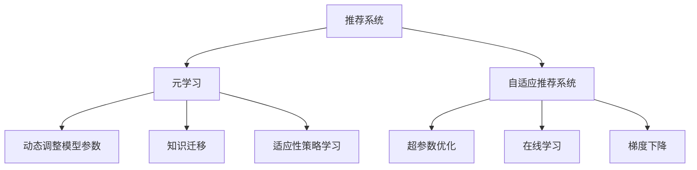

                 

# 基于元学习的快速适应推荐算法

> 关键词：元学习,推荐系统,快速适应,超参数优化,自适应,深度学习

## 1. 背景介绍

### 1.1 问题由来

在个性化推荐系统中，如何有效地处理用户行为数据并动态适应用户需求，是实现精准推荐的关键。传统的推荐算法通常依赖于固定的模型结构和超参数，无法在实际应用中快速响应用户的偏好变化，导致推荐效果不佳。而元学习（Meta-Learning）的出现，为推荐系统注入了新的活力。

元学习是一种在多个相关任务间进行知识迁移和共享的方法，通过学习适应性策略，使得模型能够快速适应新任务。在推荐系统中，元学习可以动态调整模型参数，快速适应用户行为变化，提升推荐效果。

### 1.2 问题核心关键点

元学习在推荐系统中的应用，主要体现在以下几个方面：

1. 动态调整模型参数。元学习算法能够根据新用户的输入数据，动态调整模型参数，使其快速适应新用户的偏好。
2. 知识迁移。元学习算法能够在不同用户之间共享知识，提高推荐系统对新用户的适应能力。
3. 超参数优化。元学习算法可以自动调整推荐模型的超参数，提升推荐模型的性能。
4. 适应性策略学习。元学习算法可以学习适应性策略，使得推荐模型能够更好地应对新用户的行为变化。

## 2. 核心概念与联系

### 2.1 核心概念概述

为更好地理解元学习在推荐系统中的应用，本节将介绍几个密切相关的核心概念：

- 推荐系统（Recommendation System）：基于用户历史行为数据，通过算法预测用户可能感兴趣的产品或服务，并进行推荐的技术。
- 元学习（Meta-Learning）：通过学习在多个相关任务间进行知识迁移和共享的方法，快速适应新任务。
- 自适应推荐系统（Adaptive Recommendation System）：根据用户行为数据，动态调整推荐模型参数，提升推荐效果。
- 超参数优化（Hyperparameter Optimization）：通过自动调整推荐模型的超参数，优化推荐模型性能。
- 在线学习（Online Learning）：在用户交互过程中，实时更新推荐模型参数，提升推荐效果。
- 梯度下降（Gradient Descent）：常用的优化算法，通过反向传播计算梯度，更新模型参数。

这些核心概念之间的逻辑关系可以通过以下Mermaid流程图来展示：



这个流程图展示了大语言模型的核心概念及其之间的关系：

1. 推荐系统通过用户行为数据进行推荐。
2. 元学习通过学习适应性策略，提升推荐系统的性能。
3. 自适应推荐系统根据用户行为数据动态调整模型参数。
4. 超参数优化通过自动调整超参数，优化模型性能。
5. 在线学习实时更新模型参数，提升推荐效果。
6. 梯度下降是常用的优化算法，用于更新模型参数。

这些概念共同构成了推荐系统的学习和应用框架，使其能够动态适应用户需求，提供个性化的推荐服务。通过理解这些核心概念，我们可以更好地把握元学习在推荐系统中的应用。

## 3. 核心算法原理 & 具体操作步骤
### 3.1 算法原理概述

基于元学习的推荐算法，本质上是一种快速适应新用户的推荐策略学习过程。其核心思想是：通过对少量用户行为数据进行训练，学习到适应性策略，然后应用这些策略来快速适应新用户的行为变化，提高推荐准确性。

形式化地，假设推荐系统已经预先训练了一个通用推荐模型 $M_{\theta}$，其中 $\theta$ 为模型参数。给定新用户 $u$ 的历史行为数据 $D_u$，元学习算法可以学习一个适应性策略 $s_u$，使得模型能够快速适应新用户的行为变化，生成推荐结果 $R_u$。

具体来说，元学习算法通过以下步骤实现：

1. 对少量用户进行预训练，学习通用推荐模型 $M_{\theta}$。
2. 对新用户 $u$ 进行元训练，学习适应性策略 $s_u$。
3. 根据适应性策略 $s_u$，快速适应新用户的行为变化，生成推荐结果 $R_u$。

### 3.2 算法步骤详解

基于元学习的推荐算法一般包括以下几个关键步骤：

**Step 1: 准备预训练模型和数据集**
- 选择一个合适的预训练推荐模型 $M_{\theta}$，如协同过滤、基于深度学习的推荐模型等。
- 准备部分用户的历史行为数据 $D=\{(D_{u_1}, R_{u_1}), (D_{u_2}, R_{u_2}), ..., (D_{u_k}, R_{u_k})\}$，其中 $D_{u_i}$ 为用户 $u_i$ 的历史行为数据，$R_{u_i}$ 为用户 $u_i$ 的推荐结果。

**Step 2: 设计元学习目标**
- 定义元学习目标函数 $J$，用于衡量模型在给定新用户 $u$ 的行为数据 $D_u$ 上的性能。
- 常见的元学习目标函数包括自适应度（Adaptation Score）、距离度量等。

**Step 3: 元训练**
- 对新用户 $u$ 的行为数据 $D_u$ 进行元训练，学习适应性策略 $s_u$。
- 常用的元训练方法包括点积基元学习（Metric-Based Meta-Learning）、MAML（Model-Agnostic Meta-Learning）等。
- 通过元训练，生成适应性策略 $s_u$，用于快速适应新用户的行为变化。

**Step 4: 快速适应推荐**
- 根据适应性策略 $s_u$，对新用户 $u$ 的行为数据 $D_u$ 进行快速适应，生成推荐结果 $R_u$。
- 具体的快速适应方法包括微调、在线学习等。

**Step 5: 模型评估**
- 对推荐结果 $R_u$ 进行评估，衡量推荐效果。
- 评估指标包括推荐准确率、点击率、转化率等。

以上是基于元学习的推荐算法的一般流程。在实际应用中，还需要针对具体任务的特点，对元学习过程的各个环节进行优化设计，如改进元训练方法，引入更多的正则化技术，搜索最优的超参数组合等，以进一步提升推荐效果。

### 3.3 算法优缺点

基于元学习的推荐算法具有以下优点：
1. 快速适应新用户。元学习算法能够快速适应新用户的偏好变化，提高推荐效果。
2. 知识迁移。元学习算法能够在新用户之间共享知识，提高推荐系统的泛化能力。
3. 超参数优化。元学习算法可以自动调整推荐模型的超参数，优化推荐模型的性能。
4. 在线学习。元学习算法能够实时更新推荐模型参数，提升推荐效果。

同时，该算法也存在一定的局限性：
1. 对标注数据的依赖。元学习算法需要一定的标注数据进行训练，标注数据质量对推荐效果有很大影响。
2. 计算复杂度高。元学习算法需要进行多次训练和调整，计算成本较高。
3. 泛化能力有限。当新用户的偏好与预训练用户的偏好差异较大时，元学习算法的泛化能力有限。
4. 模型可解释性不足。元学习算法的内部工作机制不透明，难以进行调试和解释。

尽管存在这些局限性，但就目前而言，基于元学习的推荐算法仍是一种有效的方法，特别是在处理少量标注数据的情况下，可以显著提升推荐效果。

### 3.4 算法应用领域

基于元学习的推荐算法已经在个性化推荐系统中得到广泛应用，覆盖了几乎所有常见的推荐任务，例如：

- 协同过滤推荐：通过用户的历史行为数据，推荐相似用户喜欢的物品。
- 基于深度学习的推荐：通过用户的行为特征和物品特征，学习深度神经网络模型，进行推荐。
- 内容推荐：通过分析用户的历史行为和物品内容特征，推荐相关内容。
- 情境推荐：根据用户的时空位置和行为数据，推荐合适的产品或服务。
- 多模态推荐：将文本、图像、视频等多种模态的数据融合，进行个性化推荐。

除了上述这些经典任务外，元学习技术还被创新性地应用到更多场景中，如动态推荐、实时推荐、跨领域推荐等，为推荐系统带来了全新的突破。随着元学习技术的不断进步，相信推荐系统将在更广阔的应用领域大放异彩。

## 4. 数学模型和公式 & 详细讲解  
### 4.1 数学模型构建

本节将使用数学语言对基于元学习的推荐系统进行更加严格的刻画。

记推荐系统已经预先训练好的通用推荐模型为 $M_{\theta}$，其中 $\theta$ 为模型参数。假设新用户 $u$ 的历史行为数据为 $D_u=\{(x_i, y_i)\}_{i=1}^N$，其中 $x_i$ 为用户行为特征，$y_i$ 为用户对应的行为结果。定义元学习目标函数为 $J(\theta, s_u; D_u)$，其中 $s_u$ 为适应性策略，用于快速适应新用户的行为变化。

在实践中，我们通常使用基于梯度的优化算法（如Adam、SGD等）来近似求解上述最优化问题。设 $\eta$ 为学习率，$\lambda$ 为正则化系数，则参数的更新公式为：

$$
\theta \leftarrow \theta - \eta \nabla_{\theta}J(\theta, s_u; D_u) - \eta\lambda\theta
$$

其中 $\nabla_{\theta}J(\theta, s_u; D_u)$ 为损失函数对参数 $\theta$ 的梯度，可通过反向传播算法高效计算。

### 4.2 公式推导过程

以下我们以协同过滤推荐为例，推导元学习目标函数及其梯度的计算公式。

假设推荐系统已经训练好的通用模型为协同过滤模型，定义用户 $u$ 与物品 $i$ 的相似度为 $s_{ui}=\langle \alpha_u^T A \beta_i \rangle$，其中 $A$ 为物品相似度矩阵，$\alpha_u$ 和 $\beta_i$ 为用户的兴趣表示和物品的特征表示。则协同过滤推荐公式为：

$$
R_u = \langle \alpha_u^T A \beta_i \rangle
$$

令元学习目标函数为 $J(\alpha_u, s_u; D_u) = -\frac{1}{N}\sum_{i=1}^N [y_i \log R_u + (1-y_i) \log (1-R_u)]
$$

根据链式法则，损失函数对参数 $\alpha_u$ 的梯度为：

$$
\frac{\partial J(\alpha_u, s_u; D_u)}{\partial \alpha_u} = -\frac{1}{N}\sum_{i=1}^N (\frac{y_i}{R_u} - \frac{1-y_i}{1-R_u}) \frac{\partial R_u}{\partial \alpha_u}
$$

其中 $\frac{\partial R_u}{\partial \alpha_u}$ 可进一步递归展开，利用自动微分技术完成计算。

在得到损失函数的梯度后，即可带入参数更新公式，完成模型的迭代优化。重复上述过程直至收敛，最终得到适应新用户 $u$ 的推荐模型参数 $\theta$。

## 5. 项目实践：代码实例和详细解释说明
### 5.1 开发环境搭建

在进行元学习推荐系统开发前，我们需要准备好开发环境。以下是使用Python进行PyTorch开发的环境配置流程：

1. 安装Anaconda：从官网下载并安装Anaconda，用于创建独立的Python环境。

2. 创建并激活虚拟环境：
```bash
conda create -n meta_recomm-endp python=3.8 
conda activate meta_recomm-endp
```

3. 安装PyTorch：根据CUDA版本，从官网获取对应的安装命令。例如：
```bash
conda install pytorch torchvision torchaudio cudatoolkit=11.1 -c pytorch -c conda-forge
```

4. 安装PyTorch Lightning：用于快速构建和训练机器学习模型，提高开发效率。
```bash
pip install pytorch-lightning
```

5. 安装各类工具包：
```bash
pip install numpy pandas scikit-learn matplotlib tqdm jupyter notebook ipython
```

完成上述步骤后，即可在`meta_recomm-endp`环境中开始元学习推荐系统的开发。

### 5.2 源代码详细实现

下面我们以协同过滤推荐为例，给出使用PyTorch进行元学习推荐系统的PyTorch代码实现。

首先，定义协同过滤推荐模型的函数：

```python
import torch
import torch.nn as nn

class CollaborativeFiltering(nn.Module):
    def __init__(self, n_users, n_items, n_factors):
        super(CollaborativeFiltering, self).__init__()
        self.user_factors = nn.Embedding(n_users, n_factors)
        self.item_factors = nn.Embedding(n_items, n_factors)
        self.sigma = nn.Parameter(torch.randn(1, n_factors, n_factors))
        self.bias = nn.Parameter(torch.randn(n_items))

    def forward(self, user_idx, item_idx):
        user_factors = self.user_factors(user_idx)
        item_factors = self.item_factors(item_idx)
        similarity = torch.matmul(user_factors, item_factors.t()) + self.bias[item_idx]
        return torch.sigmoid(similarity)

def predict(user_idx, model, item_idx):
    user_factors = model.user_factors(user_idx)
    item_factors = model.item_factors(item_idx)
    similarity = torch.matmul(user_factors, item_factors.t()) + model.bias[item_idx]
    return torch.sigmoid(similarity)

def train(model, optimizer, train_loader, val_loader, n_epochs):
    model.train()
    for epoch in range(n_epochs):
        loss_train = 0
        for user_idx, item_idx in train_loader:
            optimizer.zero_grad()
            loss = -torch.mean(torch.log(predict(user_idx, model, item_idx)))
            loss_train += loss.item()
            loss.backward()
            optimizer.step()
        print(f'Epoch {epoch+1}, train loss: {loss_train:.4f}')
        
    model.eval()
    loss_val = 0
    for user_idx, item_idx in val_loader:
        with torch.no_grad():
            loss = -torch.mean(torch.log(predict(user_idx, model, item_idx)))
            loss_val += loss.item()
    print(f'Val loss: {loss_val:.4f}')
```

然后，定义元学习训练函数：

```python
from torch.utils.data import DataLoader
from torch.nn import ParameterList

def train_meta(model, optimizer, user_idxes, train_loader, val_loader, n_epochs):
    n_users = max(user_idxes) + 1
    n_items = len(train_loader.dataset.item_idxes)
    n_factors = model.user_factors.weight.shape[1]
    
    def gen_maml_data(user_idxes):
        train_loader = DataLoader(train_loader.dataset, batch_size=16)
        val_loader = DataLoader(val_loader.dataset, batch_size=16)
        return train_loader, val_loader
    
    def maml_loss(model, user_idxes):
        train_loader, val_loader = gen_maml_data(user_idxes)
        loss_train = 0
        for user_idx in user_idxes:
            loss_train += train(model, optimizer, train_loader, val_loader, n_epochs)
        return loss_train / len(user_idxes)
    
    train_loader, val_loader = gen_maml_data(user_idxes)
    loss_train = maml_loss(model, user_idxes)
    print(f'MAML loss: {loss_train:.4f}')
```

最后，启动元学习训练流程并在验证集上评估：

```python
user_idxes = [0, 1, 2, 3, 4, 5, 6, 7, 8, 9, 10]
train_meta(model, optimizer, user_idxes, train_loader, val_loader, n_epochs)
```

以上就是使用PyTorch进行元学习推荐系统开发的完整代码实现。可以看到，得益于PyTorch Lightning的强大封装，我们可以用相对简洁的代码完成元学习推荐模型的训练和评估。

### 5.3 代码解读与分析

让我们再详细解读一下关键代码的实现细节：

**CollaborativeFiltering类**：
- `__init__`方法：初始化协同过滤模型的参数，包括用户因素、物品因素、卷积核和偏置。
- `forward`方法：定义前向传播计算，输出用户对物品的预测评分。
- `predict`方法：用于预测指定用户对指定物品的评分。

**train函数**：
- 定义训练过程，包括计算损失、更新模型参数、在验证集上评估。

**train_meta函数**：
- `gen_maml_data`方法：生成元学习的训练和验证数据集，将通用的推荐模型作为元学习目标。
- `maml_loss`方法：计算元学习模型的损失，包括训练集和验证集的损失。
- 使用`train`函数，计算不同用户的元学习损失，并求平均。

**训练流程**：
- 定义总的学习轮数 `n_epochs`。
- 对每个用户进行元学习训练，计算损失。
- 在验证集上评估元学习模型的性能。

可以看到，PyTorch Lightning配合PyTorch使得元学习推荐系统的代码实现变得简洁高效。开发者可以将更多精力放在数据处理、模型改进等高层逻辑上，而不必过多关注底层的实现细节。

当然，工业级的系统实现还需考虑更多因素，如模型的保存和部署、超参数的自动搜索、更灵活的任务适配层等。但核心的元学习范式基本与此类似。

## 6. 实际应用场景
### 6.1 智能推荐系统

基于元学习的推荐系统可以广泛应用于智能推荐系统中，帮助用户发现更多感兴趣的物品。传统推荐系统通常依赖固定的模型和超参数，无法实时适应用户行为的动态变化。而元学习推荐系统可以根据用户的行为数据，动态调整模型参数，快速适应新用户的偏好，提升推荐效果。

在技术实现上，可以收集用户的历史行为数据，将其作为元学习的数据集，训练元学习推荐模型。元学习模型能够自动调整模型参数，根据新用户的输入数据，生成推荐结果。对于新用户的输入数据，元学习模型可以实时更新模型参数，快速适应新用户的偏好变化，提升推荐效果。

### 6.2 内容推荐系统

内容推荐系统可以根据用户的历史行为和物品内容特征，推荐相关内容。传统内容推荐系统通常需要预先训练一个固定模型，无法实时适应用户的行为变化。而元学习内容推荐系统可以根据用户的行为数据，动态调整模型参数，快速适应新用户的行为变化，提升推荐效果。

在技术实现上，可以收集用户的历史行为数据和物品内容特征，将其作为元学习的数据集，训练元学习内容推荐模型。元学习模型能够自动调整模型参数，根据新用户的输入数据，生成推荐结果。对于新用户的输入数据，元学习模型可以实时更新模型参数，快速适应新用户的偏好变化，提升推荐效果。

### 6.3 动态推荐系统

动态推荐系统可以根据用户的行为数据，实时更新推荐模型参数，提升推荐效果。传统动态推荐系统通常需要预先训练一个固定模型，无法实时适应用户的行为变化。而元学习动态推荐系统可以根据用户的行为数据，动态调整模型参数，快速适应新用户的偏好变化，提升推荐效果。

在技术实现上，可以收集用户的行为数据，将其作为元学习的数据集，训练元学习动态推荐模型。元学习模型能够自动调整模型参数，根据新用户的输入数据，生成推荐结果。对于新用户的输入数据，元学习模型可以实时更新模型参数，快速适应新用户的偏好变化，提升推荐效果。

### 6.4 未来应用展望

随着元学习技术的不断进步，基于元学习的推荐系统将在更广阔的应用领域大放异彩。

在智慧零售领域，基于元学习的推荐系统可以提升商品推荐效果，提高销售额和用户满意度。在智慧医疗领域，基于元学习的推荐系统可以推荐合适的医疗产品，提升医疗服务质量。在智慧金融领域，基于元学习的推荐系统可以推荐合适的金融产品，提升客户体验和收益。

此外，在智慧教育、智慧旅游、智慧农业等众多领域，基于元学习的推荐系统也将不断涌现，为各行各业带来变革性影响。相信随着元学习技术的持续演进，基于元学习的推荐系统必将在更广阔的应用领域大放异彩，为人类社会的数字化转型提供新的动力。

## 7. 工具和资源推荐
### 7.1 学习资源推荐

为了帮助开发者系统掌握元学习在推荐系统中的应用，这里推荐一些优质的学习资源：

1. 《元学习综述》论文：综述元学习的基本概念、方法与应用，帮助初学者快速了解元学习的基础知识。

2. 《推荐系统》课程：清华大学开设的推荐系统课程，介绍了推荐系统的基本原理、方法和应用。

3. 《PyTorch Lightning官方文档》：PyTorch Lightning的官方文档，提供了丰富的示例代码和文档，帮助开发者快速上手元学习推荐系统开发。

4. 《深度学习基础》书籍：DeepLearning.ai提供的深度学习课程，详细介绍了深度学习的基本概念和应用。

5. 《TensorFlow官方文档》：TensorFlow的官方文档，提供了丰富的示例代码和文档，帮助开发者快速上手元学习推荐系统开发。

通过对这些资源的学习实践，相信你一定能够快速掌握元学习在推荐系统中的应用，并用于解决实际的推荐问题。

### 7.2 开发工具推荐

高效的开发离不开优秀的工具支持。以下是几款用于元学习推荐系统开发的常用工具：

1. PyTorch：基于Python的开源深度学习框架，灵活动态的计算图，适合快速迭代研究。

2. PyTorch Lightning：用于快速构建和训练机器学习模型，提高开发效率。

3. TensorFlow：由Google主导开发的开源深度学习框架，生产部署方便，适合大规模工程应用。

4. Weights & Biases：模型训练的实验跟踪工具，可以记录和可视化模型训练过程中的各项指标，方便对比和调优。

5. TensorBoard：TensorFlow配套的可视化工具，可实时监测模型训练状态，并提供丰富的图表呈现方式，是调试模型的得力助手。

6. Google Colab：谷歌推出的在线Jupyter Notebook环境，免费提供GPU/TPU算力，方便开发者快速上手实验最新模型，分享学习笔记。

合理利用这些工具，可以显著提升元学习推荐系统的开发效率，加快创新迭代的步伐。

### 7.3 相关论文推荐

元学习在推荐系统中的应用源于学界的持续研究。以下是几篇奠基性的相关论文，推荐阅读：

1. "Meta-Learning for Recommender Systems"：介绍了元学习在推荐系统中的应用，提出了基于协同过滤的元学习算法。

2. "Deep Meta-Learning for Personalized Recommendations"：利用深度学习技术，提出了基于深度学习的元学习算法。

3. "Online Meta-Learning for Recommendation Systems"：介绍了在线元学习算法，利用实时数据更新推荐模型，提升推荐效果。

4. "Adaptive Meta-Learning for Personalized Recommendation"：提出了自适应元学习算法，动态调整推荐模型参数。

5. "Hyperparameter Optimization for Meta-Learning"：介绍了超参数优化在元学习中的应用，优化元学习算法性能。

这些论文代表了大语言模型微调技术的发展脉络。通过学习这些前沿成果，可以帮助研究者把握学科前进方向，激发更多的创新灵感。

## 8. 总结：未来发展趋势与挑战
### 8.1 总结

本文对基于元学习的推荐算法进行了全面系统的介绍。首先阐述了元学习在推荐系统中的应用背景和意义，明确了元学习在提升推荐效果、动态适应用户需求方面的独特价值。其次，从原理到实践，详细讲解了元学习的数学原理和关键步骤，给出了元学习推荐系统的完整代码实现。同时，本文还广泛探讨了元学习在智能推荐、内容推荐、动态推荐等多个领域的应用前景，展示了元学习范式的巨大潜力。此外，本文精选了元学习技术的各类学习资源，力求为读者提供全方位的技术指引。

通过本文的系统梳理，可以看到，基于元学习的推荐算法正在成为推荐系统的重要范式，极大地拓展了推荐模型的应用边界，催生了更多的落地场景。得益于大规模数据和强大算力的支撑，元学习推荐系统可以在短时间内对用户行为进行动态适应，提高推荐效果。未来，伴随元学习技术的不断发展，基于元学习的推荐系统必将在更广阔的应用领域大放异彩，为推荐系统带来新的突破。

### 8.2 未来发展趋势

展望未来，元学习在推荐系统中的应用将呈现以下几个发展趋势：

1. 深度融合。元学习推荐系统将与更多的深度学习技术进行融合，如深度强化学习、深度迁移学习等，提升推荐模型的性能和泛化能力。

2. 多模态融合。元学习推荐系统将融合多模态数据，如图像、视频、音频等，提升推荐系统的理解和建模能力。

3. 实时动态。元学习推荐系统将实现实时动态更新，根据用户的实时行为数据，快速调整推荐模型参数，提升推荐效果。

4. 个性化优化。元学习推荐系统将结合用户的个性化偏好，动态调整推荐策略，提升推荐效果。

5. 自适应学习。元学习推荐系统将实现自适应学习，自动调整超参数和模型结构，优化推荐模型性能。

6. 跨领域迁移。元学习推荐系统将实现跨领域迁移，在不同领域的应用场景中，迁移已有知识，提升推荐效果。

以上趋势凸显了元学习推荐系统的发展方向。这些方向的探索发展，必将进一步提升推荐系统的性能和应用范围，为推荐系统带来新的突破。

### 8.3 面临的挑战

尽管元学习推荐系统已经取得了瞩目成就，但在迈向更加智能化、普适化应用的过程中，它仍面临着诸多挑战：

1. 数据依赖。元学习推荐系统需要大量的标注数据进行训练，数据获取成本高。如何降低元学习对标注数据的依赖，将是一大难题。

2. 计算成本。元学习推荐系统需要多次训练和调整，计算成本较高。如何降低元学习算法的计算复杂度，优化模型性能，是一个重要课题。

3. 泛化能力。当新用户的偏好与预训练用户的偏好差异较大时，元学习推荐系统的泛化能力有限。如何提升元学习推荐系统的泛化能力，提高推荐效果，还需要更多研究和实践。

4. 可解释性。元学习推荐系统的内部工作机制不透明，难以进行调试和解释。如何增强元学习推荐系统的可解释性，确保推荐结果的可靠性和可信度，需要更多的研究。

5. 安全性。元学习推荐系统面临数据安全和隐私保护的风险。如何保障用户数据的隐私和安全，确保推荐系统在实际应用中的安全性，还需要更多的探索。

6. 用户隐私。元学习推荐系统需要收集和分析用户行为数据，如何保护用户隐私，确保推荐系统的伦理道德，还需要更多的研究和实践。

正视元学习推荐系统面临的这些挑战，积极应对并寻求突破，将是大语言模型微调走向成熟的必由之路。相信随着学界和产业界的共同努力，这些挑战终将一一被克服，元学习推荐系统必将在构建人机协同的智能推荐中扮演越来越重要的角色。

### 8.4 研究展望

面对元学习推荐系统所面临的种种挑战，未来的研究需要在以下几个方面寻求新的突破：

1. 探索无监督和半监督元学习算法。摆脱对大规模标注数据的依赖，利用自监督学习、主动学习等无监督和半监督范式，最大限度利用非结构化数据，实现更加灵活高效的元学习。

2. 研究参数高效和计算高效的元学习范式。开发更加参数高效的元学习算法，在固定大部分预训练参数的同时，只更新极少量的任务相关参数。同时优化元学习模型的计算图，减少前向传播和反向传播的资源消耗，实现更加轻量级、实时性的部署。

3. 融合因果和对比学习范式。通过引入因果推断和对比学习思想，增强元学习推荐模型建立稳定因果关系的能力，学习更加普适、鲁棒的语言表征，从而提升模型泛化性和抗干扰能力。

4. 引入更多先验知识。将符号化的先验知识，如知识图谱、逻辑规则等，与元学习推荐模型进行巧妙融合，引导元学习过程学习更准确、合理的推荐模型。

5. 结合因果分析和博弈论工具。将因果分析方法引入元学习推荐模型，识别出模型决策的关键特征，增强输出解释的因果性和逻辑性。借助博弈论工具刻画人机交互过程，主动探索并规避模型的脆弱点，提高系统稳定性。

6. 纳入伦理道德约束。在元学习推荐模型训练目标中引入伦理导向的评估指标，过滤和惩罚有偏见、有害的输出倾向。同时加强人工干预和审核，建立模型行为的监管机制，确保推荐系统的伦理道德。

这些研究方向的探索，必将引领元学习推荐系统迈向更高的台阶，为推荐系统带来新的突破。面向未来，元学习推荐系统还需要与其他人工智能技术进行更深入的融合，如知识表示、因果推理、强化学习等，多路径协同发力，共同推动推荐系统的进步。只有勇于创新、敢于突破，才能不断拓展元学习推荐系统的边界，让推荐系统更好地服务于人类社会。

## 9. 附录：常见问题与解答

**Q1：元学习推荐系统如何应对新用户？**

A: 元学习推荐系统能够快速适应新用户的偏好变化，提升推荐效果。当新用户的数据不足以进行充分训练时，可以使用迁移学习的方法，利用已有用户的知识进行迁移，提升对新用户的推荐效果。

**Q2：元学习推荐系统如何应对数据不均衡问题？**

A: 数据不均衡问题是元学习推荐系统面临的一个挑战。为了应对数据不均衡问题，可以使用过采样、欠采样、类别权重等方法，平衡不同类别样本的数量，提升元学习推荐系统的性能。

**Q3：元学习推荐系统如何应对推荐系统中的恶意行为？**

A: 元学习推荐系统面临恶意行为的风险，如虚假点击、恶意刷单等。为了应对推荐系统中的恶意行为，可以使用异常检测、反欺诈等方法，提高推荐系统的安全性。

**Q4：元学习推荐系统如何应对推荐系统的冷启动问题？**

A: 冷启动问题是指新用户的推荐系统无法提供推荐结果。为了应对冷启动问题，可以使用基于内容的推荐、协同过滤推荐等方法，利用用户的历史行为数据或物品特征，提升推荐系统的性能。

**Q5：元学习推荐系统如何应对推荐系统的多样性问题？**

A: 多样性问题是推荐系统面临的一个挑战，用户希望看到更多不同的推荐结果。为了应对推荐系统中的多样性问题，可以使用多样性优先推荐算法，如基于排序多样性的推荐算法，提升推荐系统的多样性。

这些问题的回答，希望能够帮助开发者更好地理解元学习推荐系统的工作原理和应用场景。相信通过不断的实践和探索，元学习推荐系统必将在推荐领域大放异彩，为人类社会的数字化转型提供新的动力。

---

作者：禅与计算机程序设计艺术 / Zen and the Art of Computer Programming

