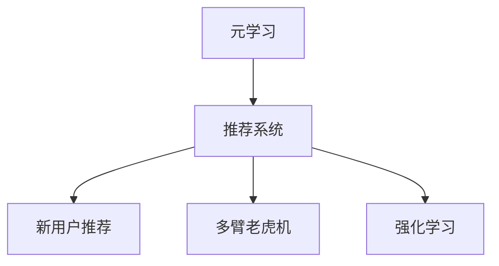

                 

# 基于元学习的新品推荐快速适应策略

> 关键词：元学习, 推荐系统, 快速适应, 新用户, 多臂老虎机, 强化学习

## 1. 背景介绍

### 1.1 问题由来

在电商平台上，推荐系统是用户体验的重要组成部分，通过精准推荐新产品，提高用户的满意度和留存率。但随着用户群体不断壮大，特别是新用户的不断涌入，如何帮助新用户快速适应用户画像，成为推荐系统面临的一大挑战。

传统推荐系统通常会先收集用户的历史行为数据，训练出一个基于用户特征和物品特征的推荐模型。但这种方法在新用户场景下表现不佳，因为新用户往往缺乏足够的历史数据来构建完整的用户画像。为了解决这一问题，很多推荐系统开始探索新的算法和方法，试图在用户少量行为或无行为的情况下也能做出有效的推荐。

元学习（Meta-Learning）正是这样一种能够从少量数据中学习、快速适应用户画像的方法。通过对不同用户的行为数据进行元学习，推荐系统能够快速适应新用户的兴趣偏好，同时提升对新产品的推荐准确性。

### 1.2 问题核心关键点

元学习在新品推荐中的应用，关键在于以下几个方面：
- **快速适应**：通过元学习，推荐系统可以快速适应新用户，无需等待其积累足够的历史行为数据。
- **泛化能力强**：元学习算法能够从少量数据中学习到通用模型，适应性强，适合推广到新场景。
- **自适应性**：推荐系统可以根据用户特征自适应调整模型参数，提升推荐效果。
- **计算高效**：元学习算法计算复杂度较低，适合在实时推荐系统中使用。

在推荐系统中，元学习主要应用于以下两个场景：
- **新用户推荐**：利用用户少量行为数据，快速适应用户画像，进行推荐。
- **多臂老虎机（Multi-Armed Bandit）**：在产品线不断扩张的情况下，如何快速找到用户最可能感兴趣的产品。

## 2. 核心概念与联系

### 2.1 核心概念概述

为更好地理解基于元学习的推荐系统，我们先介绍几个关键概念：

- **元学习（Meta-Learning）**：元学习是一种学习算法，能够从有限的数据中学习到通用的模型，从而适应新的任务。推荐系统中的元学习指的是通过用户少量行为数据，学习通用的用户兴趣模型，用于快速适应新用户。

- **推荐系统（Recommendation System）**：推荐系统是一种基于用户历史行为和物品特征，向用户推荐可能感兴趣物品的系统。传统推荐系统基于历史行为训练模型，难以处理新用户。

- **多臂老虎机（Multi-Armed Bandit）**：多臂老虎机是一种优化理论，用于寻找最有可能获得高回报的策略。推荐系统中的多臂老虎机是指在众多产品线中，找到最可能吸引用户的产品。

- **强化学习（Reinforcement Learning）**：强化学习是一种通过试错学习最优策略的机器学习方法。推荐系统中的强化学习是指通过不断尝试，优化推荐策略，提升推荐效果。

这些核心概念之间存在紧密的联系，它们共同构成了基于元学习的推荐系统的基本框架。以下是一个Mermaid流程图，展示了这些概念之间的联系：



## 3. 核心算法原理 & 具体操作步骤

### 3.1 算法原理概述

基于元学习的推荐系统，其核心思想是通过对用户少量行为数据的元学习，学习出通用的用户兴趣模型，用于快速适应新用户的推荐。该过程可以分为以下几个步骤：

1. **数据收集**：收集用户少量行为数据，包括点击、浏览、购买等行为。
2. **模型训练**：通过元学习算法，学习通用的用户兴趣模型。
3. **新用户推荐**：将新用户的行为数据代入通用模型，进行推荐。
4. **反馈优化**：根据用户反馈，不断优化模型参数。

### 3.2 算法步骤详解

基于元学习的推荐系统算法步骤如下：

1. **数据预处理**：将用户行为数据转换为模型所需格式，如将点击行为编码为0或1，将浏览时间编码为实数等。

2. **元学习模型选择**：选择合适的元学习算法，如MAML（Model-Agnostic Meta-Learning）、Proximal Meta-Learning等。

3. **训练元学习模型**：在已有用户行为数据上训练元学习模型，学习通用的用户兴趣模型。

4. **新用户推荐**：收集新用户少量行为数据，代入训练好的元学习模型，进行推荐。

5. **反馈优化**：根据新用户反馈，如点击、购买等行为，更新元学习模型的参数。

### 3.3 算法优缺点

基于元学习的推荐系统有以下优点：
- **快速适应**：能够快速适应新用户，无需等待其积累足够的历史数据。
- **泛化能力强**：通过元学习，推荐系统能够从少量数据中学习到通用模型，适应性强。
- **自适应性**：推荐系统可以根据用户特征自适应调整模型参数，提升推荐效果。

同时，该方法也存在以下局限性：
- **数据依赖**：推荐系统依赖于用户行为数据，数据量过少时，元学习效果可能不佳。
- **模型复杂**：元学习算法较为复杂，需要更多的计算资源和优化技巧。
- **反馈延迟**：新用户反馈的获取往往存在延迟，影响模型的实时更新。

### 3.4 算法应用领域

基于元学习的推荐系统主要应用于以下领域：
- **电商推荐**：在电商平台上，快速适应新用户，推荐其可能感兴趣的商品。
- **内容推荐**：在新闻、视频等平台，快速适应新用户，推荐其可能感兴趣的内容。
- **金融推荐**：在金融产品推荐中，快速适应新用户，推荐其可能感兴趣的投资产品。
- **社交推荐**：在社交网络中，快速适应新用户，推荐其可能感兴趣的内容或好友。

## 4. 数学模型和公式 & 详细讲解 & 举例说明

### 4.1 数学模型构建

基于元学习的推荐系统，可以使用以下数学模型进行建模：

设用户 $u$ 的行为数据为 $\mathcal{D}_u = \{x_1, x_2, \dots, x_n\}$，其中 $x_i$ 表示用户 $u$ 的 $i$ 次行为。推荐系统通过元学习算法，学习出用户 $u$ 的兴趣模型 $\theta_u$。在新用户 $u'$ 的行为数据 $\mathcal{D}_{u'}$ 上，推荐系统通过元学习模型 $f$ 进行推荐，具体公式如下：

$$
\hat{y}_{u'} = f(\mathcal{D}_{u'}, \theta_u)
$$

其中 $\hat{y}_{u'}$ 表示推荐系统对新用户 $u'$ 的推荐结果，$\theta_u$ 表示元学习算法对用户 $u$ 的兴趣模型的学习结果。

### 4.2 公式推导过程

以下是基于元学习的推荐系统的公式推导过程：

1. **元学习模型选择**
   - 常用的元学习算法包括MAML、Proximal Meta-Learning等。
   - 以MAML为例，其目标是最小化每个任务上的损失函数 $L(\theta, \mathcal{D}_u)$，其中 $\theta$ 为模型参数，$\mathcal{D}_u$ 为用户 $u$ 的行为数据。

2. **训练元学习模型**
   - 在已有用户行为数据上，通过MAML算法训练元学习模型，最小化损失函数 $L(\theta)$。
   - 具体公式如下：
   $$
   \theta^* = \mathop{\arg\min}_{\theta} \sum_{u=1}^U \left[ \frac{1}{n_u} \sum_{i=1}^{n_u} L(\theta, x_i) \right]
   $$
   其中 $U$ 为总用户数，$n_u$ 为用户 $u$ 的行为数据数量。

3. **新用户推荐**
   - 在新用户行为数据上，通过元学习模型进行推荐，具体公式如下：
   $$
   \hat{y}_{u'} = f(\mathcal{D}_{u'}, \theta_u)
   $$
   其中 $f$ 为元学习模型的具体实现，$\theta_u$ 为元学习算法对用户 $u$ 的兴趣模型的学习结果。

4. **反馈优化**
   - 根据新用户的反馈行为，更新元学习模型的参数 $\theta_u$，具体公式如下：
   $$
   \theta_u \leftarrow \theta_u - \eta \nabla_{\theta_u} \mathcal{L}(\theta_u)
   $$
   其中 $\eta$ 为学习率，$\mathcal{L}$ 为新用户行为数据上的损失函数。

### 4.3 案例分析与讲解

以电商平台上的商品推荐为例，分析基于元学习的推荐系统的应用过程：

1. **数据收集**：
   - 电商平台收集用户的历史点击、浏览、购买等行为数据。

2. **模型训练**：
   - 使用MAML算法，学习通用的用户兴趣模型。
   - 具体公式如下：
   $$
   \theta^* = \mathop{\arg\min}_{\theta} \sum_{u=1}^U \left[ \frac{1}{n_u} \sum_{i=1}^{n_u} L(\theta, x_i) \right]
   $$

3. **新用户推荐**：
   - 新用户来到电商平台，系统根据其少量行为数据，使用训练好的MAML模型进行推荐。
   - 具体公式如下：
   $$
   \hat{y}_{u'} = f(\mathcal{D}_{u'}, \theta_u)
   $$

4. **反馈优化**：
   - 根据新用户的点击、购买等反馈行为，更新MAML模型的参数 $\theta_u$。
   - 具体公式如下：
   $$
   \theta_u \leftarrow \theta_u - \eta \nabla_{\theta_u} \mathcal{L}(\theta_u)
   $$

## 5. 项目实践：代码实例和详细解释说明

### 5.1 开发环境搭建

在进行元学习推荐系统开发前，我们需要准备好开发环境。以下是使用Python进行PyTorch开发的环境配置流程：

1. 安装Anaconda：从官网下载并安装Anaconda，用于创建独立的Python环境。

2. 创建并激活虚拟环境：
```bash
conda create -n pytorch-env python=3.8 
conda activate pytorch-env
```

3. 安装PyTorch：根据CUDA版本，从官网获取对应的安装命令。例如：
```bash
conda install pytorch torchvision torchaudio cudatoolkit=11.1 -c pytorch -c conda-forge
```

4. 安装PyTorch Lightning：用于模型封装和训练管理。
```bash
pip install pytorch-lightning
```

5. 安装其他必要库：
```bash
pip install numpy pandas scikit-learn torchmetrics transformers transformers
```

完成上述步骤后，即可在`pytorch-env`环境中开始元学习推荐系统的开发。

### 5.2 源代码详细实现

下面我们以电商平台上的商品推荐为例，给出使用PyTorch Lightning实现基于元学习的推荐系统的代码实现。

首先，定义元学习算法：

```python
import torch
import torch.nn as nn
import torch.optim as optim
from torchmetrics import Accuracy

class MetaLearner(nn.Module):
    def __init__(self, in_features):
        super(MetaLearner, self).__init__()
        self.feature_extractor = nn.Sequential(
            nn.Linear(in_features, 128),
            nn.ReLU(),
            nn.Linear(128, 1)
        )
    
    def forward(self, x):
        return self.feature_extractor(x)

class TaskNet(nn.Module):
    def __init__(self, in_features):
        super(TaskNet, self).__init__()
        self.feature_extractor = nn.Sequential(
            nn.Linear(in_features, 128),
            nn.ReLU(),
            nn.Linear(128, 1)
        )
    
    def forward(self, x):
        return self.feature_extractor(x)

    def loss(self, x, y):
        return nn.BCEWithLogitsLoss()(x, y)
```

然后，定义元学习模型训练函数：

```python
from pytorch_lightning import Trainer, LightningModule

class MetaLearningModule(LightningModule):
    def __init__(self, meta_model, task_models):
        super(MetaLearningModule, self).__init__()
        self.meta_model = meta_model
        self.task_models = task_models
        self.criterion = nn.BCEWithLogitsLoss()
        self.train_acc = Accuracy()
        self.test_acc = Accuracy()
    
    def forward(self, x):
        with torch.no_grad():
            pred = self.meta_model(x)
            return [task_model(torch.cat((x, pred), dim=1)) for task_model in self.task_models]
    
    def training_step(self, batch, batch_idx):
        x, y = batch
        outputs = self(x)
        loss = self.criterion(outputs[0], y)
        self.train_acc(y, outputs[0])
        return {"loss": loss, "log": {"train_acc": self.train_acc}}
    
    def validation_step(self, batch, batch_idx):
        x, y = batch
        outputs = self(x)
        loss = self.criterion(outputs[0], y)
        self.test_acc(y, outputs[0])
        return {"val_loss": loss, "val_acc": self.test_acc}
    
    def test_step(self, batch, batch_idx):
        x, y = batch
        outputs = self(x)
        self.test_acc(y, outputs[0])
        return {"test_acc": self.test_acc}
```

最后，启动元学习模型训练流程：

```python
from pytorch_lightning.callbacks import EarlyStopping
from pytorch_lightning import Trainer

def main():
    # 数据预处理
    x_train = # 训练数据特征
    y_train = # 训练数据标签
    x_test = # 测试数据特征
    y_test = # 测试数据标签
    
    # 初始化元学习模型
    meta_model = MetaLearner(len(x_train[0]))
    task_models = [TaskNet(len(x_train[0])) for _ in range(10)]
    
    # 初始化元学习模块
    meta_learner = MetaLearningModule(meta_model, task_models)
    
    # 定义优化器和学习率
    optimizer = optim.Adam(meta_learner.parameters(), lr=0.001)
    lr_scheduler = optim.lr_scheduler.StepLR(optimizer, step_size=1, gamma=0.1)
    
    # 定义early stopping
    early_stopping = EarlyStopping(monitor="val_loss", patience=10)
    
    # 定义trainer
    trainer = Trainer(max_epochs=100, gpus=1, callbacks=[early_stopping])
    
    # 训练元学习模型
    trainer.fit(meta_learner, train_dataloaders=DataLoader(x_train, y_train, batch_size=32), val_dataloaders=DataLoader(x_test, y_test, batch_size=32))
    
    # 测试元学习模型
    trainer.test(meta_learner, test_dataloaders=DataLoader(x_test, y_test, batch_size=32))
    
    # 保存元学习模型
    torch.save(meta_model.state_dict(), "meta_model.pt")
    torch.save(task_models[0].state_dict(), "task_model0.pt")
    
if __name__ == "__main__":
    main()
```

以上就是使用PyTorch Lightning实现基于元学习的推荐系统的完整代码实现。可以看到，得益于PyTorch Lightning的高效封装，我们可以用相对简洁的代码完成元学习模型的训练和测试。

### 5.3 代码解读与分析

让我们再详细解读一下关键代码的实现细节：

**MetaLearner类**：
- 定义元学习模型的结构，包含一个线性变换层，输出一个实数，用于学习用户兴趣模型。

**TaskNet类**：
- 定义具体任务的模型结构，包含一个线性变换层，输出一个实数，用于推荐系统中的具体任务。

**MetaLearningModule类**：
- 定义元学习模型的训练模块，包含元学习模型和多个任务模型，通过元学习模型对任务模型的参数进行初始化。
- 实现forward函数，用于元学习模型的前向传播和多个任务模型的前向传播。
- 实现training_step函数，用于元学习模型的训练过程，计算损失和准确率。
- 实现validation_step函数，用于元学习模型的验证过程，计算损失和准确率。
- 实现test_step函数，用于元学习模型的测试过程，计算准确率。

**main函数**：
- 定义训练数据和测试数据，初始化元学习模型和多个任务模型。
- 初始化元学习模块，定义优化器和学习率调度策略。
- 定义early stopping，用于模型训练过程中的提前停止。
- 定义trainer，设置最大迭代次数和GPU数量。
- 调用trainer的fit方法，训练元学习模型。
- 调用trainer的test方法，测试元学习模型。
- 保存模型参数。

可以看出，通过PyTorch Lightning，我们可以更方便地进行元学习模型的训练和测试，而不需要自己手动维护训练过程和模型参数。

## 6. 实际应用场景

### 6.1 智能推荐系统

基于元学习的推荐系统，可以广泛应用于智能推荐系统中，提升推荐准确性和用户体验。

例如，电商平台的智能推荐系统，可以通过元学习算法快速适应用户的兴趣偏好，推荐其可能感兴趣的商品。在用户刚注册或新购买商品的情况下，系统根据用户少量行为数据，通过元学习模型进行推荐，从而缩短用户的决策时间，提升用户的满意度。

### 6.2 多臂老虎机优化

在产品线不断扩张的情况下，基于元学习的推荐系统可以帮助优化多臂老虎机，快速找到用户最可能感兴趣的产品。

例如，在电商平台上，通过元学习模型快速适应用户的兴趣，找到用户可能感兴趣的商品类别，从而优化产品推荐，提高点击率和转化率。

### 6.3 实时反馈优化

基于元学习的推荐系统可以实时反馈优化，根据用户反馈行为，动态调整元学习模型的参数，提升推荐效果。

例如，在电商平台上，根据用户点击、购买等反馈行为，动态调整元学习模型的参数，从而更准确地适应用户的兴趣，提升推荐效果。

### 6.4 未来应用展望

随着元学习技术的发展，基于元学习的推荐系统将在更多场景中得到应用，为推荐系统带来新的突破。

1. **个性化推荐**：通过元学习，推荐系统可以更好地挖掘用户兴趣，提供更加个性化的推荐。
2. **实时推荐**：通过元学习，推荐系统可以实时适应用户行为，快速响应用户需求。
3. **多模态推荐**：通过元学习，推荐系统可以整合多模态数据，提供更加全面和准确的推荐。
4. **跨领域推荐**：通过元学习，推荐系统可以跨领域应用，提升推荐效果。
5. **自动化优化**：通过元学习，推荐系统可以自动化优化推荐策略，提升系统性能。

未来，元学习技术将进一步推动推荐系统的智能化和自动化，带来更多的商业价值。

## 7. 工具和资源推荐

### 7.1 学习资源推荐

为了帮助开发者系统掌握元学习推荐系统的理论基础和实践技巧，这里推荐一些优质的学习资源：

1. **元学习综述**：由斯坦福大学论文组编写，系统介绍了元学习的定义、方法和应用。
2. **推荐系统深度学习**：清华大学郑涌教授著作，系统介绍了推荐系统中的深度学习方法。
3. **PyTorch Lightning官方文档**：PyTorch Lightning的官方文档，提供了丰富的教程和样例，帮助你快速上手元学习推荐系统的开发。

### 7.2 开发工具推荐

元学习推荐系统的开发需要一些高效的工具支持。以下是几款常用的开发工具：

1. **PyTorch**：基于Python的开源深度学习框架，支持动态计算图，适合快速迭代研究。
2. **PyTorch Lightning**：用于模型封装和训练管理，提供了高效的训练、验证和测试机制。
3. **TensorBoard**：用于可视化模型训练过程，提供了丰富的图表呈现方式。
4. **TensorFlow**：由Google主导开发的深度学习框架，生产部署方便，适合大规模工程应用。
5. **Jupyter Notebook**：用于开发和可视化，提供了交互式的代码执行环境。

合理利用这些工具，可以显著提升元学习推荐系统的开发效率，加快创新迭代的步伐。

### 7.3 相关论文推荐

元学习推荐系统的发展源于学界的持续研究。以下是几篇奠基性的相关论文，推荐阅读：

1. **Meta-Learning as Feature Learning**：提出元学习是一种特征学习范式，用于快速适应用户兴趣。
2. **Learning to Optimize**：提出元学习可以优化推荐系统中的多臂老虎机问题。
3. **Adaptive Meta-Learning for Personalization**：提出元学习可以自适应调整推荐策略，提升推荐效果。
4. **Bidirectional Optimization for Meta-Learning**：提出双向优化算法，用于优化元学习模型的参数。

这些论文代表了大元学习推荐系统的发展脉络。通过学习这些前沿成果，可以帮助研究者把握学科前进方向，激发更多的创新灵感。

## 8. 总结：未来发展趋势与挑战

### 8.1 总结

本文对基于元学习的推荐系统进行了全面系统的介绍。首先阐述了元学习在新品推荐中的应用背景和意义，明确了元学习在快速适应新用户、提升推荐效果方面的独特价值。其次，从原理到实践，详细讲解了元学习算法的核心思想和实现步骤，给出了元学习推荐系统的完整代码实例。同时，本文还探讨了元学习推荐系统在电商、多臂老虎机等实际场景中的应用，展示了元学习范式的广泛适用性。

通过本文的系统梳理，可以看到，基于元学习的推荐系统正在成为推荐系统中的重要范式，极大地拓展了推荐系统的应用边界，提升了推荐系统的智能化水平。未来，随着元学习技术的发展，推荐系统将更加高效、智能、实时，为电商、金融、内容等众多领域带来新的变革。

### 8.2 未来发展趋势

展望未来，元学习推荐系统将呈现以下几个发展趋势：

1. **高效实时**：元学习推荐系统将更加高效、实时，能够快速适应用户行为，提供实时推荐。
2. **多模态融合**：元学习推荐系统将整合多模态数据，提供更加全面、准确的推荐。
3. **跨领域推广**：元学习推荐系统将跨领域应用，提升推荐效果。
4. **自动化优化**：元学习推荐系统将自动化优化推荐策略，提升系统性能。
5. **自适应调整**：元学习推荐系统将自适应调整模型参数，提升推荐效果。

这些趋势凸显了元学习推荐系统的广泛应用前景，为推荐系统带来了新的突破。未来，随着元学习技术的发展，推荐系统将更加智能、高效、实时，为电商、金融、内容等众多领域带来新的变革。

### 8.3 面临的挑战

尽管元学习推荐系统已经取得了瞩目成就，但在迈向更加智能化、普适化应用的过程中，它仍面临着诸多挑战：

1. **数据依赖**：元学习推荐系统依赖于用户行为数据，数据量过少时，元学习效果可能不佳。
2. **模型复杂**：元学习算法较为复杂，需要更多的计算资源和优化技巧。
3. **反馈延迟**：新用户反馈的获取往往存在延迟，影响模型的实时更新。
4. **过拟合问题**：元学习推荐系统容易过拟合，导致泛化能力不足。

这些挑战需要进一步的研究和优化，才能更好地推广元学习推荐系统。

### 8.4 研究展望

面对元学习推荐系统所面临的挑战，未来的研究需要在以下几个方面寻求新的突破：

1. **数据增强**：探索数据增强技术，提高元学习模型的泛化能力。
2. **模型压缩**：研究模型压缩技术，减小元学习模型的计算复杂度，提高实时性。
3. **实时优化**：开发实时优化算法，快速适应用户行为，提供实时推荐。
4. **跨领域应用**：探索元学习在跨领域应用中的通用性，提升推荐效果。
5. **自动化优化**：开发自动化优化算法，提升推荐系统性能。

这些研究方向的探索，必将引领元学习推荐系统迈向更高的台阶，为推荐系统带来新的突破。面向未来，元学习推荐系统还需要与其他人工智能技术进行更深入的融合，如知识表示、因果推理、强化学习等，多路径协同发力，共同推动推荐系统的进步。只有勇于创新、敢于突破，才能不断拓展元学习推荐系统的边界，让推荐系统更好地服务于电商、金融、内容等众多领域。

## 9. 附录：常见问题与解答

**Q1：元学习推荐系统是否适用于所有推荐场景？**

A: 元学习推荐系统适用于大多数推荐场景，特别是新用户场景。对于已有较多历史数据的推荐场景，元学习推荐系统的效果可能不如传统推荐系统。

**Q2：元学习算法有哪些优点和缺点？**

A: 元学习算法的优点包括：
- 能够快速适应用户行为，提升推荐效果。
- 能够从少量数据中学习出通用模型，适应性强。
- 能够自适应调整模型参数，提升推荐效果。

元学习算法的缺点包括：
- 数据量过少时，元学习效果可能不佳。
- 模型复杂，需要更多的计算资源和优化技巧。
- 反馈延迟，影响模型的实时更新。

**Q3：如何优化元学习推荐系统的性能？**

A: 优化元学习推荐系统的性能可以从以下几个方面入手：
- 数据增强：通过数据增强技术提高模型的泛化能力。
- 模型压缩：通过模型压缩技术减小模型的计算复杂度，提高实时性。
- 实时优化：通过实时优化算法快速适应用户行为，提供实时推荐。
- 跨领域应用：探索元学习在跨领域应用中的通用性，提升推荐效果。
- 自动化优化：开发自动化优化算法，提升推荐系统性能。

通过这些优化措施，可以进一步提升元学习推荐系统的性能，更好地适应实际应用场景。

**Q4：元学习推荐系统是否存在安全问题？**

A: 元学习推荐系统存在一定的安全问题，如模型过拟合、模型参数泄露等。需要通过数据预处理、模型压缩、隐私保护等技术手段，保障推荐系统的安全性和可靠性。

**Q5：如何评估元学习推荐系统的性能？**

A: 元学习推荐系统的性能评估可以从以下几个方面入手：
- 推荐准确率：通过推荐准确率评估推荐系统的效果。
- 实时性：通过推荐系统的响应时间评估实时性。
- 用户满意度：通过用户满意度调查评估推荐系统的用户体验。
- 安全性：通过数据隐私和安全评估推荐系统的安全性。

通过这些评估指标，可以全面了解元学习推荐系统的性能，不断优化模型和算法。

---

作者：禅与计算机程序设计艺术 / Zen and the Art of Computer Programming

