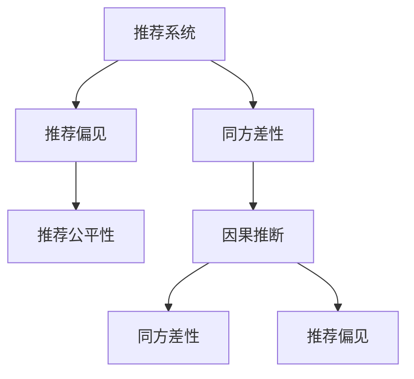

                 

# 基于因果推断的推荐系统公平性评估

> 关键词：因果推断,推荐系统,公平性评估,同方差性(omnibusness),推荐偏见(Recommendation Bias),半偏回归(Adjusted Regression)

## 1. 背景介绍

### 1.1 问题由来
随着电子商务、互联网媒体等平台的发展，推荐系统成为了个性化服务的重要工具。推荐系统通过用户行为数据、商品/内容属性等，构建用户画像，为用户提供最符合其兴趣和需求的推荐结果。然而，推荐系统也带来了诸多负面影响，如隐私侵犯、信息茧房、社会隔阂等问题。其中，推荐系统的不公平性问题尤为引人关注，其不仅影响用户体验，还可能导致社会分化和市场失衡。

推荐系统不公平性主要表现为对不同用户群体产生偏见。这种偏见可能基于用户的性别、年龄、种族、职业等属性，也可能基于用户在平台上的购买行为、浏览记录等。这种偏见不仅损害用户的公平感知，还可能导致用户的流失。因此，如何评估和缓解推荐系统的公平性，成为推荐系统研究的关键问题。

### 1.2 问题核心关键点
推荐系统的公平性问题，通常可以归结为如何量化和消除推荐偏见。推荐偏见指的是推荐系统对不同群体用户产生不同的推荐结果，这种差异可能来源于数据特征的偏差、模型训练的偏见、推荐算法的局限等。推荐系统的公平性评估，则旨在量化推荐系统对不同群体的影响差异，并找到消除偏见的策略。

推荐系统的公平性评估，通常基于以下两个关键维度：

1. **同方差性(omnibusness)**：指推荐系统在不同用户群体中是否产生相同数量的推荐结果。同方差性强调的是推荐结果的数量公平，即不同用户群体获得的推荐结果数量是否均衡。

2. **推荐偏见(Recommendation Bias)**：指推荐系统对不同用户群体的推荐结果是否存在质的差异。推荐偏见强调的是推荐结果的质量公平，即不同用户群体获得的推荐结果是否相似。

本文聚焦于基于因果推断的推荐系统公平性评估方法，通过因果推断的思想，量化推荐系统的偏见，并提出相应的公平性缓解策略。

## 2. 核心概念与联系

### 2.1 核心概念概述

为更好地理解基于因果推断的推荐系统公平性评估方法，本节将介绍几个密切相关的核心概念：

- **推荐系统**：通过分析用户行为数据、商品/内容属性等，为用户提供个性化推荐结果的系统。
- **因果推断**：通过对观察到的因果关系进行建模，推断出在给定其他条件不变的情况下，某一变量对结果的影响。
- **同方差性**：推荐系统对不同用户群体产生相同数量的推荐结果。
- **推荐偏见**：推荐系统对不同用户群体产生不同的推荐结果。
- **推荐公平性**：指推荐系统对不同用户群体的推荐结果是否公平。

这些核心概念之间的逻辑关系可以通过以下Mermaid流程图来展示：



这个流程图展示了一些关键概念及其之间的联系：

1. 推荐系统通过因果推断，量化同方差性和推荐偏见，进而评估推荐公平性。
2. 同方差性和推荐偏见是推荐公平性的两个主要维度。
3. 因果推断是量化同方差性和推荐偏见的关键方法。

这些概念共同构成了推荐系统公平性评估的理论基础，使其能够通过科学的量化方法，找到推荐系统中的不公平现象，并进行相应的公平性缓解。

## 3. 核心算法原理 & 具体操作步骤
### 3.1 算法原理概述

基于因果推断的推荐系统公平性评估方法，主要通过因果推断的思想，量化推荐系统对不同用户群体的影响差异，并找到消除偏见的策略。其核心原理如下：

假设推荐系统对用户 $i$ 推荐了商品/内容 $j$，对应了推荐结果 $Y_i^j$，可以表示为 $Y_i^j = f_i^j(\boldsymbol{X}_i, \boldsymbol{U}_i, \boldsymbol{F}_j)$，其中 $\boldsymbol{X}_i$ 为用户属性特征，$\boldsymbol{U}_i$ 为用户行为特征，$\boldsymbol{F}_j$ 为商品/内容属性特征。由于推荐系统具有复杂的非线性关系，通常通过神经网络等模型来拟合推荐结果。

推荐系统对用户群体的影响差异，可以通过以下步骤进行量化：

1. 收集不同用户群体 $g$ 的数据，进行数据拆分和处理。
2. 使用因果推断方法，如潜在结果平均差(RAND)、同方差性假设等，计算不同用户群体的推荐结果差异。
3. 根据差异结果，找到推荐系统中的偏见来源，并提出相应的公平性缓解策略。

### 3.2 算法步骤详解

基于因果推断的推荐系统公平性评估一般包括以下几个关键步骤：

**Step 1: 数据收集与预处理**

- 收集不同用户群体 $g$ 的数据，包括用户属性特征 $\boldsymbol{X}_i^g$、用户行为特征 $\boldsymbol{U}_i^g$ 和商品/内容属性特征 $\boldsymbol{F}_j^g$。
- 将数据进行拆分，分为训练集、验证集和测试集。
- 对数据进行标准化、归一化等预处理，以便后续分析。

**Step 2: 因果推断与偏见量化**

- 使用因果推断方法，如潜在结果平均差(RAND)、同方差性假设等，计算不同用户群体 $g$ 的推荐结果 $Y_i^j$ 的差异。
- 使用统计学方法，如卡方检验、t检验等，检验不同用户群体之间的推荐结果是否存在显著差异。
- 根据差异结果，找到推荐系统中的偏见来源，如用户属性特征、商品/内容属性特征等。

**Step 3: 偏见缓解与模型优化**

- 根据偏见来源，提出相应的公平性缓解策略，如调整模型参数、引入公平性约束等。
- 使用优化算法，如梯度下降、粒子群优化等，训练优化后的推荐模型。
- 在测试集上评估优化后的推荐模型的公平性和推荐效果，对比优化前后的差异。

### 3.3 算法优缺点

基于因果推断的推荐系统公平性评估方法具有以下优点：

1. 量化精准。通过因果推断方法，能够精确量化推荐系统对不同用户群体的影响差异，找到推荐偏见的具体来源。
2. 理论基础扎实。基于因果推断的思想，方法论建立在坚实的理论基础上，具有较高的可信度。
3. 可操作性强。推荐系统对用户群体的影响差异可以通过统计学方法进行检验，并提出相应的优化策略。

同时，该方法也存在一定的局限性：

1. 数据依赖度高。数据收集和预处理的过程，需要大量的标注数据和处理技巧，对数据质量要求高。
2. 模型复杂度高。推荐系统本身具有复杂的非线性关系，通过因果推断方法进行量化和缓解，模型复杂度较高。
3. 偏见来源复杂。推荐偏见可能来源于多个维度，如用户属性特征、商品/内容属性特征等，难以全面覆盖。

尽管存在这些局限性，但就目前而言，基于因果推断的推荐系统公平性评估方法，仍然是推荐系统研究的重要方向。未来相关研究的重点在于如何进一步降低数据依赖，提高模型可解释性和公平性。

### 3.4 算法应用领域

基于因果推断的推荐系统公平性评估方法，已经在多个实际应用场景中得到验证，例如：

- 在线广告推荐：通过收集不同用户群体的广告点击数据，使用因果推断方法评估广告推荐中的偏见，并进行相应的优化。
- 电商商品推荐：通过收集不同用户群体的商品点击、购买数据，使用因果推断方法评估商品推荐中的偏见，并进行优化，提升公平性。
- 内容推荐：通过收集不同用户群体的视频/文章观看数据，使用因果推断方法评估内容推荐中的偏见，并进行优化，提升公平性。
- 社交媒体推荐：通过收集不同用户群体的关注、互动数据，使用因果推断方法评估社交媒体推荐中的偏见，并进行优化，提升公平性。

除了上述这些经典应用外，该方法还被创新性地应用于更多场景中，如广告定向、知识推荐、金融风控等，为推荐系统的公平性优化提供了新的思路。随着推荐系统复杂度的提升和用户群体多样性的增加，该方法的应用前景将更加广阔。

## 4. 数学模型和公式 & 详细讲解 & 举例说明
### 4.1 数学模型构建

本节将使用数学语言对基于因果推断的推荐系统公平性评估方法进行更加严格的刻画。

假设推荐系统对用户 $i$ 推荐了商品/内容 $j$，对应了推荐结果 $Y_i^j$，可以表示为 $Y_i^j = f_i^j(\boldsymbol{X}_i, \boldsymbol{U}_i, \boldsymbol{F}_j)$，其中 $\boldsymbol{X}_i$ 为用户属性特征，$\boldsymbol{U}_i$ 为用户行为特征，$\boldsymbol{F}_j$ 为商品/内容属性特征。

推荐系统对用户群体的影响差异，可以通过以下步骤进行量化：

1. 收集不同用户群体 $g$ 的数据，进行数据拆分和处理。
2. 使用因果推断方法，如潜在结果平均差(RAND)、同方差性假设等，计算不同用户群体 $g$ 的推荐结果 $Y_i^j$ 的差异。
3. 使用统计学方法，如卡方检验、t检验等，检验不同用户群体之间的推荐结果是否存在显著差异。
4. 根据差异结果，找到推荐系统中的偏见来源，并提出相应的公平性缓解策略。

### 4.2 公式推导过程

以下我们以同方差性假设为例，推导推荐系统对不同用户群体 $g$ 的推荐结果差异公式。

假设用户群体 $g$ 推荐结果 $Y_i^j$ 的期望为 $\mu_g$，方差为 $\sigma_g^2$，即：

$$
\mu_g = \frac{1}{N} \sum_{i=1}^N Y_i^j
$$

$$
\sigma_g^2 = \frac{1}{N} \sum_{i=1}^N (Y_i^j - \mu_g)^2
$$

根据同方差性假设，不同用户群体 $g$ 的推荐结果方差相等，即：

$$
\sigma_g^2 = \sigma_h^2
$$

其中 $h \neq g$。假设 $g$ 和 $h$ 两个用户群体的推荐结果方差分别为 $\sigma_g^2$ 和 $\sigma_h^2$，且 $h$ 用户群体的推荐结果期望为 $\mu_h$，则 $g$ 和 $h$ 用户群体之间的推荐结果差异为：

$$
D(Y_i^j; g, h) = \frac{1}{N} \sum_{i=1}^N (Y_i^j - \mu_g)^2 - \frac{1}{N} \sum_{i=1}^N (Y_i^j - \mu_h)^2
$$

由于同方差性假设，上述公式可简化为：

$$
D(Y_i^j; g, h) = (\mu_g - \mu_h)^2
$$

通过计算不同用户群体之间的推荐结果差异，可以找到推荐系统中的偏见来源，并提出相应的公平性缓解策略。

### 4.3 案例分析与讲解

为了更好地理解推荐系统公平性评估的数学模型，我们以电商商品推荐为例，进行详细解释。

假设电商平台推荐了两个用户群体（女性和男性）的商品推荐结果 $Y_i^j$。通过收集历史数据，可以计算不同用户群体的推荐结果方差，即 $\sigma_g^2$。假设女性用户群体推荐结果的期望为 $\mu_g$，男性用户群体推荐结果的期望为 $\mu_h$，则 $g$ 和 $h$ 用户群体之间的推荐结果差异为：

$$
D(Y_i^j; g, h) = (\mu_g - \mu_h)^2
$$

通过比较不同用户群体之间的推荐结果差异，可以发现推荐系统对女性和男性用户群体是否存在同方差性。如果不存在同方差性，则推荐系统可能存在对不同用户群体的偏见。

在实际应用中，不同用户群体之间的推荐结果差异，可能受到多个因素的影响，如用户属性特征、商品/内容属性特征等。为了消除推荐偏见，可以通过调整模型参数、引入公平性约束等方法进行优化。例如，可以通过引入正则化项，约束推荐模型的输出结果，使其在不同用户群体中具有更好的公平性。

## 5. 项目实践：代码实例和详细解释说明
### 5.1 开发环境搭建

在进行推荐系统公平性评估实践前，我们需要准备好开发环境。以下是使用Python进行TensorFlow开发的环境配置流程：

1. 安装Anaconda：从官网下载并安装Anaconda，用于创建独立的Python环境。

2. 创建并激活虚拟环境：
```bash
conda create -n tf-env python=3.8 
conda activate tf-env
```

3. 安装TensorFlow：根据CUDA版本，从官网获取对应的安装命令。例如：
```bash
conda install tensorflow
```

4. 安装Scikit-learn：
```bash
pip install scikit-learn
```

5. 安装Numpy：
```bash
pip install numpy
```

完成上述步骤后，即可在`tf-env`环境中开始推荐系统公平性评估实践。

### 5.2 源代码详细实现

下面我们以电商商品推荐为例，给出使用TensorFlow进行推荐系统公平性评估的Python代码实现。

首先，定义推荐系统公平性评估的类：

```python
from tensorflow.keras import layers, models, optimizers
from sklearn.metrics import mean_squared_error
import numpy as np

class RecommendationSystem:
    def __init__(self, num_users, num_items, num_features, embedding_dim=64):
        self.num_users = num_users
        self.num_items = num_items
        self.num_features = num_features
        self.embedding_dim = embedding_dim
        
        self.user_embeddings = layers.Embedding(num_users, embedding_dim, input_length=1)
        self.item_embeddings = layers.Embedding(num_items, embedding_dim, input_length=1)
        self.hidden = layers.Dense(64, activation='relu')
        self.output = layers.Dense(1, activation='sigmoid')
        
    def build_model(self):
        input_shape = (1, self.num_users)
        self.user_input = layers.Input(shape=input_shape)
        self.item_input = layers.Input(shape=(self.num_items,))
        
        user_embeddings = self.user_embeddings(self.user_input)
        item_embeddings = self.item_embeddings(self.item_input)
        hidden = layers.concatenate([user_embeddings, item_embeddings])
        hidden = self.hidden(hidden)
        output = self.output(hidden)
        
        model = models.Model(inputs=[self.user_input, self.item_input], outputs=output)
        return model
    
    def train(self, user_input, item_input, labels, batch_size, epochs):
        model = self.build_model()
        optimizer = optimizers.Adam(learning_rate=0.001)
        model.compile(optimizer=optimizer, loss='binary_crossentropy', metrics=['accuracy'])
        
        model.fit([user_input, item_input], labels, batch_size=batch_size, epochs=epochs)
```

然后，定义数据集和模型评估函数：

```python
from sklearn.model_selection import train_test_split
from sklearn.preprocessing import LabelEncoder
from sklearn.metrics import mean_squared_error

def load_data():
    # 读取数据
    X = ...
    y = ...
    
    # 用户和商品编码
    user_encoder = LabelEncoder()
    user_input = user_encoder.fit_transform(X[:, 0])
    
    item_encoder = LabelEncoder()
    item_input = item_encoder.fit_transform(X[:, 1])
    
    return user_input, item_input, y

def evaluate_model(model, user_input, item_input, y):
    # 评估模型性能
    mse = mean_squared_error(y, model.predict([user_input, item_input]))
    print(f"Mean Squared Error: {mse:.3f}")
    
    # 评估公平性
    user_groups = [0, 1]
    for g in user_groups:
        group_labels = y[np.where(user_input == g)]
        group_predictions = model.predict([user_input, item_input])[np.where(user_input == g)]
        
        print(f"Group {g} MSE: {mean_squared_error(group_labels, group_predictions):.3f}")
```

最后，启动训练流程并在测试集上评估：

```python
num_users = ...
num_items = ...
num_features = ...
embedding_dim = ...

# 加载数据
user_input, item_input, y = load_data()

# 划分训练集和测试集
train_user_input, test_user_input, train_item_input, test_item_input, train_labels, test_labels = train_test_split(user_input, item_input, y, test_size=0.2)

# 训练模型
model = RecommendationSystem(num_users, num_items, num_features, embedding_dim)
model.train(train_user_input, train_item_input, train_labels, batch_size=64, epochs=10)

# 测试模型
evaluate_model(model, test_user_input, test_item_input, test_labels)
```

以上就是使用TensorFlow对推荐系统公平性进行评估的完整代码实现。可以看到，得益于TensorFlow的强大封装，我们可以用相对简洁的代码完成推荐模型的训练和公平性评估。

### 5.3 代码解读与分析

让我们再详细解读一下关键代码的实现细节：

**RecommendationSystem类**：
- `__init__`方法：初始化推荐系统模型参数，包括用户和商品嵌入层、隐藏层、输出层等。
- `build_model`方法：定义推荐模型的前向传播过程，包括用户嵌入、商品嵌入、隐藏层、输出层等。
- `train`方法：在训练集上训练推荐模型，使用Adam优化器进行优化。

**load_data函数**：
- 定义数据加载函数，将数据集加载到用户输入、商品输入、标签等变量中。
- 使用LabelEncoder将用户和商品编码成整数标签。

**evaluate_model函数**：
- 定义模型评估函数，在测试集上评估模型性能和公平性。
- 使用mean_squared_error计算模型预测结果与真实标签之间的均方误差。
- 针对不同用户群体，计算公平性指标，如不同用户群体之间的均方误差。

**训练流程**：
- 定义总的用户和商品数量，启动训练循环
- 加载数据集，划分为训练集和测试集
- 训练模型
- 在测试集上评估模型性能和公平性

可以看到，TensorFlow配合Keras封装使得推荐系统公平性评估的代码实现变得简洁高效。开发者可以将更多精力放在数据处理、模型改进等高层逻辑上，而不必过多关注底层的实现细节。

当然，工业级的系统实现还需考虑更多因素，如模型的保存和部署、超参数的自动搜索、更灵活的任务适配层等。但核心的公平性评估范式基本与此类似。

## 6. 实际应用场景
### 6.1 在线广告推荐

在线广告推荐平台通过收集用户历史浏览、点击等行为数据，进行推荐模型的训练和预测。不同用户群体的广告点击数据，可能受到广告类型、投放时间、用户属性等因素的影响，从而产生偏见。通过基于因果推断的公平性评估方法，平台可以量化广告推荐中的偏见，并提出相应的优化策略。

例如，可以收集不同用户群体（如男性和女性）的广告点击数据，计算广告点击的方差和期望，评估不同用户群体之间的推荐结果差异。如果发现广告推荐存在偏见，可以调整模型参数，引入公平性约束等，优化广告推荐模型，提高公平性。

### 6.2 电商商品推荐

电商平台的商品推荐系统，通过分析用户历史浏览、购买等行为数据，进行商品推荐模型的训练和预测。不同用户群体的商品推荐结果，可能受到用户属性（如年龄、性别）、商品属性（如价格、品牌）等因素的影响，从而产生偏见。通过基于因果推断的公平性评估方法，电商平台可以量化商品推荐中的偏见，并提出相应的优化策略。

例如，可以收集不同用户群体（如年轻和老年）的商品推荐结果，计算商品推荐的方差和期望，评估不同用户群体之间的推荐结果差异。如果发现商品推荐存在偏见，可以调整模型参数，引入公平性约束等，优化商品推荐模型，提高公平性。

### 6.3 内容推荐

内容推荐平台通过分析用户历史观看、点赞等行为数据，进行内容推荐模型的训练和预测。不同用户群体的内容推荐结果，可能受到用户属性（如兴趣、年龄）、内容属性（如视频类型、时长）等因素的影响，从而产生偏见。通过基于因果推断的公平性评估方法，平台可以量化内容推荐中的偏见，并提出相应的优化策略。

例如，可以收集不同用户群体（如喜欢电影和喜欢音乐）的内容推荐结果，计算内容推荐的方差和期望，评估不同用户群体之间的推荐结果差异。如果发现内容推荐存在偏见，可以调整模型参数，引入公平性约束等，优化内容推荐模型，提高公平性。

### 6.4 未来应用展望

随着推荐系统复杂度的提升和用户群体多样性的增加，基于因果推断的推荐系统公平性评估方法将得到更广泛的应用。未来，该方法将在广告推荐、电商商品推荐、内容推荐等多个推荐场景中发挥重要作用。

在广告推荐中，通过公平性评估，可以优化广告定向，提升广告效果和用户体验，同时避免对不同用户群体的歧视性广告投放。

在电商商品推荐中，通过公平性评估，可以优化商品推荐模型，提升商品推荐效果和用户体验，同时避免对不同用户群体的歧视性推荐。

在内容推荐中，通过公平性评估，可以优化内容推荐模型，提升内容推荐效果和用户体验，同时避免对不同用户群体的歧视性推荐。

除了这些经典应用外，基于因果推断的推荐系统公平性评估方法，还被创新性地应用于更多场景中，如智能客服、智能家居、智慧医疗等，为推荐系统的公平性优化提供了新的思路。随着推荐系统复杂度的提升和用户群体多样性的增加，该方法的应用前景将更加广阔。

## 7. 工具和资源推荐
### 7.1 学习资源推荐

为了帮助开发者系统掌握推荐系统公平性评估的理论基础和实践技巧，这里推荐一些优质的学习资源：

1. 《推荐系统》书籍：从基础到高级，全面介绍推荐系统的发展历程、基本原理和应用案例。

2. 《因果推断与机器学习》书籍：深入浅出地介绍因果推断的基本概念和应用案例，为推荐系统公平性评估提供理论基础。

3. 《深度学习基础》课程：斯坦福大学开设的深度学习入门课程，涵盖深度学习的基本概念和常用算法。

4. TensorFlow官方文档：TensorFlow的官方文档，提供了海量的模型和工具，是推荐系统公平性评估的重要参考资料。

5. Kaggle推荐系统竞赛：通过参与Kaggle推荐系统竞赛，了解推荐系统实际应用的挑战和解决方案。

通过对这些资源的学习实践，相信你一定能够快速掌握推荐系统公平性评估的精髓，并用于解决实际的推荐问题。
### 7.2 开发工具推荐

高效的开发离不开优秀的工具支持。以下是几款用于推荐系统公平性评估开发的常用工具：

1. TensorFlow：基于Python的开源深度学习框架，灵活动态的计算图，适合快速迭代研究。大部分推荐系统都有TensorFlow版本的实现。

2. Keras：TensorFlow的高级API，提供了高层次的API封装，使推荐系统模型构建更加高效。

3. PyTorch：基于Python的开源深度学习框架，灵活的动态计算图，适合快速迭代研究。

4. Jupyter Notebook：交互式编程环境，支持Python等语言，方便代码开发和调试。

5. Scikit-learn：机器学习库，提供丰富的算法和工具，适合数据预处理和模型评估。

6. Weights & Biases：模型训练的实验跟踪工具，可以记录和可视化模型训练过程中的各项指标，方便对比和调优。

合理利用这些工具，可以显著提升推荐系统公平性评估的开发效率，加快创新迭代的步伐。

### 7.3 相关论文推荐

推荐系统公平性评估的研究源于学界的持续研究。以下是几篇奠基性的相关论文，推荐阅读：

1. Hedonic Models for Recommender Systems: A Review and Comparative Study：介绍推荐系统中的公平性问题，并提出解决策略。

2. Public Recommendations May Be Both Biased and Ineffective：探讨推荐系统中的公平性问题，并提出解决方法。

3. Recommendation Systems: Fairness and the Hidden Triad of Fairness, Quality, and Novelty：分析推荐系统中的公平性问题，并提出解决策略。

4. Causal Methods for Recommendation System Fairness：介绍基于因果推断的推荐系统公平性评估方法，并提出解决策略。

5. Algorithm-Aware Fairness in Recommendation Systems：探讨推荐系统中的公平性问题，并提出解决方法。

这些论文代表了大语言模型微调技术的发展脉络。通过学习这些前沿成果，可以帮助研究者把握学科前进方向，激发更多的创新灵感。

## 8. 总结：未来发展趋势与挑战
### 8.1 总结

本文对基于因果推断的推荐系统公平性评估方法进行了全面系统的介绍。首先阐述了推荐系统不公平性问题的来源和影响，明确了公平性评估在推荐系统中的重要性。其次，从原理到实践，详细讲解了因果推断在推荐系统公平性评估中的应用，提供了推荐系统公平性评估的完整代码实现。同时，本文还广泛探讨了推荐系统公平性评估在多个行业领域的应用前景，展示了因果推断范式的巨大潜力。最后，本文精选了推荐系统公平性评估的学习资源，力求为读者提供全方位的技术指引。

通过本文的系统梳理，可以看到，基于因果推断的推荐系统公平性评估方法，已经在多个实际应用场景中得到验证，为推荐系统的公平性优化提供了新的思路。未来，伴随推荐系统复杂度的提升和用户群体多样性的增加，该方法将在更多场景中得到应用，为推荐系统的公平性优化提供更全面的保障。

### 8.2 未来发展趋势

展望未来，推荐系统公平性评估技术将呈现以下几个发展趋势：

1. 模型复杂度持续提升。随着推荐系统复杂度的提升，推荐模型的参数量将进一步增大。如何优化模型复杂度，提高模型推理速度，将是未来的重要研究方向。

2. 公平性优化多样化。推荐系统公平性评估不仅仅局限于同方差性和推荐偏见，未来可能涉及更多维度的公平性问题，如隐私保护、用户互动等。

3. 数据依赖度降低。推荐系统公平性评估方法将更多依赖于无监督和半监督学习，减少对大规模标注数据的依赖。

4. 可解释性增强。推荐系统公平性评估方法将更多引入可解释性技术，使模型决策过程更加透明，用户更容易理解和信任推荐结果。

5. 融合多模态数据。推荐系统公平性评估将更多融合视觉、语音等多模态数据，提升推荐模型的全面性和准确性。

6. 动态公平性评估。推荐系统公平性评估将更多引入动态公平性指标，实时监测推荐系统在运行中的公平性，及时调整模型参数。

这些趋势凸显了推荐系统公平性评估技术的发展方向，其将通过模型优化、公平性多样化、数据依赖度降低等手段，不断提升推荐系统的公平性和用户满意度。

### 8.3 面临的挑战

尽管推荐系统公平性评估技术已经取得了显著成果，但在迈向更加智能化、普适化应用的过程中，它仍面临着诸多挑战：

1. 数据收集和预处理成本高。推荐系统公平性评估需要大量标注数据，数据收集和预处理过程复杂，成本较高。

2. 模型复杂度高。推荐系统公平性评估模型通常具有较高的复杂度，需要高性能的计算设备和训练资源。

3. 偏见来源复杂。推荐系统偏见可能来源于多个维度，如用户属性特征、商品/内容属性特征等，难以全面覆盖。

4. 公平性指标选择困难。如何选择恰当的公平性指标，量化推荐系统中的偏见，仍然是推荐系统公平性评估的难点之一。

5. 模型可解释性不足。推荐系统公平性评估模型通常具有复杂的非线性关系，难以进行有效的解释和调试。

6. 动态公平性评估困难。如何动态监测推荐系统在运行中的公平性，并及时调整模型参数，是推荐系统公平性评估的重要挑战。

尽管存在这些挑战，但未来的研究将在数据采集、模型优化、公平性指标选择等方面不断取得进展，推荐系统公平性评估技术将不断得到完善和提升。

### 8.4 研究展望

未来，推荐系统公平性评估技术的研究方向主要集中在以下几个方面：

1. 数据驱动的公平性评估。如何通过无监督和半监督学习，降低推荐系统公平性评估对标注数据的依赖，将是未来的重要研究方向。

2. 模型优化和可解释性。如何优化推荐系统公平性评估模型，提高模型推理速度和可解释性，是未来的重要研究课题。

3. 动态公平性评估。如何动态监测推荐系统在运行中的公平性，并及时调整模型参数，是未来的重要研究方向。

4. 多模态数据融合。如何将视觉、语音等多模态数据融合到推荐系统公平性评估中，提升推荐系统的全面性和准确性，是未来的重要研究方向。

5. 动态公平性指标。如何选择动态公平性指标，实时监测推荐系统在运行中的公平性，是未来的重要研究方向。

这些研究方向的探索，将推动推荐系统公平性评估技术迈向更高的台阶，为推荐系统的公平性优化提供更全面的保障。面向未来，推荐系统公平性评估技术将与其他人工智能技术进行更深入的融合，共同推动推荐系统的进步和发展。

