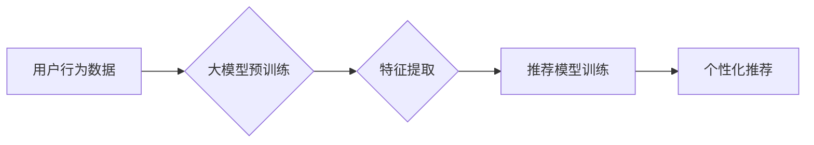

                 

## 基于大模型的推荐系统特征工程优化

> 关键词：大模型、推荐系统、特征工程、模型优化、自然语言处理

## 1. 背景介绍

推荐系统作为互联网时代的重要组成部分，在电商、社交媒体、视频平台等领域发挥着越来越重要的作用。其核心目标是根据用户的历史行为、偏好等信息，预测用户对特定商品、内容或服务感兴趣，并提供个性化的推荐。传统的推荐系统主要依赖于手工设计的特征，例如用户年龄、性别、购买历史等。然而，随着数据量的爆炸式增长和用户行为的复杂化，手工设计的特征越来越难以捕捉用户潜在的兴趣和需求。

近年来，大模型的兴起为推荐系统特征工程带来了新的机遇。大模型，例如 GPT-3、BERT 等，拥有强大的文本理解和生成能力，能够从海量文本数据中学习到丰富的语义信息和用户偏好。将大模型应用于特征工程，可以自动学习更精准、更丰富的用户特征，从而提升推荐系统的准确性和个性化程度。

## 2. 核心概念与联系

### 2.1 推荐系统特征工程

特征工程是机器学习模型训练的关键步骤之一，其目标是将原始数据转换为模型能够理解和学习的特征。在推荐系统中，特征工程通常包括以下几个方面：

* **用户特征:** 包括用户 demographics 信息、兴趣爱好、行为偏好等。
* **商品特征:** 包括商品类别、价格、描述、属性等。
* **交互特征:** 包括用户对商品的浏览、点击、购买等行为。
* **上下文特征:** 包括时间、地点、设备等。

### 2.2 大模型

大模型是指参数量巨大、训练数据量庞大的深度学习模型。它们通常基于 Transformer 架构，能够学习到复杂的语言表示和语义关系。

### 2.3 大模型与推荐系统特征工程的结合

将大模型应用于推荐系统特征工程，可以实现以下优势：

* **自动学习特征:** 大模型能够自动从海量文本数据中学习到丰富的语义信息和用户偏好，无需人工设计特征。
* **提升特征表达能力:** 大模型学习到的特征表示更加丰富和抽象，能够更好地捕捉用户潜在的兴趣和需求。
* **个性化推荐:** 大模型可以根据用户的个性化特征生成个性化的推荐结果。

**Mermaid 流程图**



## 3. 核心算法原理 & 具体操作步骤

### 3.1 算法原理概述

基于大模型的推荐系统特征工程主要利用大模型的文本理解和生成能力，从用户行为数据中提取丰富的特征。常用的方法包括：

* **文本嵌入:** 将用户行为数据中的文本信息（例如商品描述、用户评论等）转换为稠密的向量表示，捕捉文本的语义信息。
* **序列建模:** 利用大模型的序列建模能力，预测用户未来的行为，例如下一个点击的商品或下一个购买的商品。
* **知识图谱嵌入:** 将用户行为数据与知识图谱进行融合，学习用户与商品之间的关系，提升推荐的准确性和个性化程度。

### 3.2 算法步骤详解

1. **数据预处理:** 对用户行为数据进行清洗、格式化和编码，例如去除停用词、转换文本到数字表示等。
2. **大模型预训练:** 使用预训练的大模型，例如 BERT、GPT-3 等，对用户行为数据进行预训练，学习到丰富的语义信息和用户偏好。
3. **特征提取:** 利用预训练好的大模型，对用户行为数据进行特征提取，例如使用文本嵌入技术生成用户和商品的向量表示，或者使用序列建模技术预测用户的未来行为。
4. **特征融合:** 将提取到的不同类型的特征进行融合，例如将用户特征、商品特征和交互特征进行拼接或融合，形成更完整的用户画像。
5. **推荐模型训练:** 使用融合后的特征训练推荐模型，例如基于协同过滤的模型、基于内容过滤的模型或基于深度学习的模型。
6. **个性化推荐:** 利用训练好的推荐模型，根据用户的特征和历史行为，预测用户对特定商品或内容的兴趣，并提供个性化的推荐结果。

### 3.3 算法优缺点

**优点:**

* 自动学习特征，无需人工设计，提高效率。
* 学习到的特征更加丰富和抽象，提升推荐的准确性和个性化程度。
* 可以处理海量文本数据，挖掘用户潜在的兴趣和需求。

**缺点:**

* 大模型训练成本高，需要大量的计算资源和训练数据。
* 模型解释性较差，难以理解模型是如何做出推荐的。
* 对数据质量要求高，如果数据质量差，模型效果会受到影响。

### 3.4 算法应用领域

基于大模型的推荐系统特征工程在以下领域具有广泛的应用前景：

* **电商推荐:** 为用户推荐个性化的商品，提高转化率。
* **内容推荐:** 为用户推荐个性化的新闻、视频、音乐等内容，提升用户粘性。
* **社交推荐:** 为用户推荐新的朋友、兴趣小组等，提升用户社交体验。
* **医疗推荐:** 为患者推荐个性化的医疗方案，提升医疗服务质量。

## 4. 数学模型和公式 & 详细讲解 & 举例说明

### 4.1 数学模型构建

基于大模型的推荐系统特征工程通常使用深度学习模型，例如 Transformer 模型，进行特征提取和融合。

**Transformer 模型**

Transformer 模型是一种基于注意力机制的深度学习模型，能够学习到长距离依赖关系。其主要结构包括：

* **编码器:** 将输入序列（例如用户行为数据）转换为特征向量。
* **解码器:** 根据编码器的输出，生成输出序列（例如推荐结果）。

**注意力机制**

注意力机制允许模型关注输入序列中与当前任务相关的部分，并赋予它们更高的权重。

### 4.2 公式推导过程

Transformer 模型的注意力机制使用以下公式计算每个词的注意力权重：

$$
\text{Attention}(Q, K, V) = \text{softmax}\left(\frac{Q K^T}{\sqrt{d_k}}\right) V
$$

其中：

* $Q$：查询矩阵
* $K$：键矩阵
* $V$：值矩阵
* $d_k$：键向量的维度
* $\text{softmax}$：softmax 函数

### 4.3 案例分析与讲解

假设我们想要推荐用户喜欢的电影。我们可以使用 Transformer 模型，将用户的观看历史、评分和评论等信息作为输入，学习到用户的电影偏好。

模型的编码器会将用户的观看历史转换为特征向量，解码器会根据编码器的输出，生成推荐电影的列表。

注意力机制可以帮助模型关注用户观看过的电影类型、导演、演员等信息，并根据这些信息生成更精准的推荐结果。

## 5. 项目实践：代码实例和详细解释说明

### 5.1 开发环境搭建

* Python 3.7+
* PyTorch 1.7+
* Transformers 4.0+

### 5.2 源代码详细实现

```python
from transformers import AutoTokenizer, AutoModel

# 加载预训练模型和词典
model_name = "bert-base-uncased"
tokenizer = AutoTokenizer.from_pretrained(model_name)
model = AutoModel.from_pretrained(model_name)

# 用户行为数据
user_data = [
    "我喜欢看科幻电影",
    "我最近看了《星际穿越》",
    "我非常喜欢汤姆·克鲁斯主演的电影"
]

# 对用户行为数据进行编码
encoded_data = tokenizer(user_data, return_tensors="pt")

# 使用预训练模型提取特征
outputs = model(**encoded_data)
user_embeddings = outputs.last_hidden_state[:, 0, :]

# ...后续代码用于特征融合、推荐模型训练等
```

### 5.3 代码解读与分析

* 使用 `transformers` 库加载预训练模型和词典。
* 对用户行为数据进行编码，转换为模型能够理解的格式。
* 使用预训练模型提取用户特征，例如使用模型的输出向量作为用户嵌入。
* 后续代码可以根据提取到的特征进行特征融合、推荐模型训练等操作。

### 5.4 运行结果展示

运行代码后，可以得到用户嵌入向量，这些向量可以用于训练推荐模型，并生成个性化的推荐结果。

## 6. 实际应用场景

### 6.1 电商推荐

基于大模型的推荐系统可以为电商平台用户推荐个性化的商品，例如根据用户的浏览历史、购买记录和兴趣爱好，推荐他们可能感兴趣的商品。

### 6.2 内容推荐

基于大模型的推荐系统可以为新闻、视频、音乐等内容平台用户推荐个性化的内容，例如根据用户的阅读习惯、观看历史和兴趣爱好，推荐他们可能感兴趣的文章、视频或音乐。

### 6.3 社交推荐

基于大模型的推荐系统可以为社交平台用户推荐新的朋友、兴趣小组等，例如根据用户的社交关系、兴趣爱好和行为偏好，推荐他们可能感兴趣的人或群组。

### 6.4 未来应用展望

随着大模型技术的不断发展，基于大模型的推荐系统将有更广泛的应用场景，例如：

* **个性化教育推荐:** 为学生推荐个性化的学习资源和课程。
* **医疗健康推荐:** 为患者推荐个性化的医疗方案和健康建议。
* **金融理财推荐:** 为用户推荐个性化的理财产品和投资策略。

## 7. 工具和资源推荐

### 7.1 学习资源推荐

* **论文:**

    * Devlin, J., Chang, M. W., Lee, K., & Toutanova, K. (2018). Bert: Pre-training of deep bidirectional transformers for language understanding. arXiv preprint arXiv:1810.04805.
    * Vaswani, A., Shazeer, N., Parmar, N., Uszkoreit, J., Jones, L., Gomez, A. N., ... & Polosukhin, I. (2017). Attention is all you need. In Advances in neural information processing systems (pp. 5998-6008).

* **博客:**

    * The Illustrated Transformer: https://jalammar.github.io/illustrated-transformer/
    * Hugging Face Blog: https://huggingface.co/blog

### 7.2 开发工具推荐

* **Transformers:** https://huggingface.co/docs/transformers/index
* **PyTorch:** https://pytorch.org/

### 7.3 相关论文推荐

* **BERT for Recommender Systems:** https://arxiv.org/abs/1908.08937
* **XLNet for Recommender Systems:** https://arxiv.org/abs/1906.08237

## 8. 总结：未来发展趋势与挑战

### 8.1 研究成果总结

基于大模型的推荐系统特征工程取得了显著的成果，能够自动学习更精准、更丰富的用户特征，提升推荐系统的准确性和个性化程度。

### 8.2 未来发展趋势

* **模型规模和能力的提升:** 未来大模型的规模和能力将继续提升，能够学习到更复杂的语义信息和用户偏好。
* **多模态特征融合:** 将文本、图像、音频等多模态特征融合到推荐系统中，提升推荐的准确性和个性化程度。
* **联邦学习:** 利用联邦学习技术，在保护用户隐私的前提下，训练更强大的推荐模型。

### 8.3 面临的挑战

* **数据质量:** 大模型对数据质量要求高，如果数据质量差，模型效果会受到影响。
* **模型解释性:** 大模型的决策过程较为复杂，难以理解模型是如何做出推荐的。
* **计算资源:** 训练大模型需要大量的计算资源，成本较高。

### 8.4 研究展望

未来研究将重点关注以下几个方面：

* **提高数据质量:** 开发新的数据清洗和预处理方法，提升数据质量。
* **提升模型解释性:** 研究新的模型解释方法，提高模型的透明度和可解释性。
* **降低训练成本:** 研究新的训练方法和硬件架构，降低大模型的训练成本。


## 9. 附录：常见问题与解答

### 9.1 Q: 如何选择合适的预训练模型？

A: 选择预训练模型需要根据具体应用场景和数据特点进行选择。例如，对于文本推荐任务，可以使用 BERT、RoBERTa 等预训练语言模型；对于图像推荐任务，可以使用 Vision Transformer 等预训练图像模型。

### 9.2 Q: 如何处理稀疏数据？

A: 稀疏数据是指数据中包含大量缺失值或零值的数据。处理稀疏数据的方法包括：

* **特征填充:** 使用平均值、中位数等方法填充缺失值。
* **特征降维:** 使用 PCA、LDA 等方法降维，减少数据的维度。
* **使用稀疏模型:** 使用稀疏模型，例如 LASSO 回归、Ridge 回归等，能够更好地处理稀疏数据。

### 9.3 Q: 如何评估推荐系统的性能？

A: 推荐系统的性能可以使用以下指标进行评估：

* **准确率:** 推荐结果中正确预测的比例。
* **召回率:** 推荐结果中包含所有真实目标的比例。
* **NDCG:** Normalized Discounted Cumulative Gain，衡量推荐结果的排序质量。
* **CTR:** Click-Through Rate，衡量用户点击推荐结果的比例。

作者：禅与计算机程序设计艺术 / Zen and the Art of Computer Programming 


<end_of_turn>

