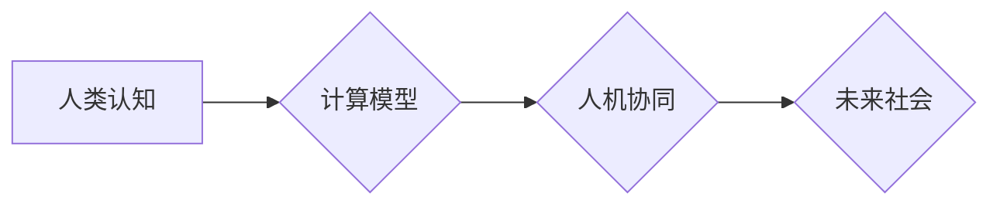

                 

## 塑造未来社会：人类计算的深远意义

> 关键词：人类计算、人工智能、计算模型、认知科学、未来社会、计算哲学、可解释性

### 1. 背景介绍

人类文明的进步离不开对计算的不断探索和发展。从简单的算盘到复杂的超级计算机，计算一直是推动社会进步的引擎。然而，随着人工智能技术的飞速发展，我们正站在一个新的历史节点上，人类计算的概念正在逐渐成为主流。

人类计算是指将人类的认知能力与计算能力相结合，以实现超越传统计算能力的新型计算模式。它不仅仅是利用人工智能技术模拟人类思维，更重要的是，它试图理解人类认知的本质，并将其融入到计算模型中。

### 2. 核心概念与联系

人类计算的核心概念是将人类的智慧和计算能力相融合，构建一个新的计算生态系统。

**2.1 人类认知的本质**

人类认知是一个复杂而多层次的过程，涉及感知、记忆、推理、决策等多种认知功能。这些功能相互关联，共同构成了人类的智慧。

**2.2 计算模型的演进**

传统的计算模型以逻辑运算和算法为基础，侧重于处理结构化数据。而人类计算则需要考虑人类认知的复杂性和非结构化数据处理能力。

**2.3 人机协同的未来**

人类计算强调人机协同，将人类的创造力和计算的效率相结合，共同解决复杂问题。

**Mermaid 流程图**



### 3. 核心算法原理 & 具体操作步骤

**3.1 算法原理概述**

人类计算的核心算法原理是模拟人类认知过程，并将其融入到计算模型中。常见的算法包括：

* **神经网络算法:** 模仿大脑神经元结构和连接方式，学习数据并进行预测。
* **强化学习算法:** 通过试错学习，在环境中获得最大奖励。
* **进化算法:** 借鉴生物进化机制，通过选择、交叉和变异，优化算法参数。

**3.2 算法步骤详解**

以神经网络算法为例，其具体操作步骤如下：

1. **数据预处理:** 将原始数据转换为神经网络可处理的形式。
2. **网络结构设计:** 根据任务需求设计神经网络的层数、节点数和连接方式。
3. **参数初始化:** 为神经网络中的每个连接赋予初始权重。
4. **前向传播:** 将输入数据通过神经网络层层传递，最终得到输出结果。
5. **反向传播:** 计算输出结果与真实值的误差，并根据误差调整网络参数。
6. **迭代训练:** 重复前向传播和反向传播过程，直到网络性能达到预期水平。

**3.3 算法优缺点**

**优点:**

* 能够处理复杂、非结构化数据。
* 学习能力强，能够不断优化性能。
* 具有泛化能力，能够应用于多种任务。

**缺点:**

* 训练过程复杂，需要大量数据和计算资源。
* 模型解释性差，难以理解其决策过程。
* 容易受到数据偏差的影响。

**3.4 算法应用领域**

* **图像识别:** 人脸识别、物体检测、图像分类。
* **自然语言处理:** 机器翻译、文本摘要、情感分析。
* **语音识别:** 语音转文本、语音助手。
* **医疗诊断:** 病情预测、疾病诊断、药物研发。

### 4. 数学模型和公式 & 详细讲解 & 举例说明

**4.1 数学模型构建**

人类计算的数学模型通常基于概率论、统计学和信息论等学科。

* **概率论:** 用于描述随机事件的发生概率，例如神经网络中的激活函数。
* **统计学:** 用于分析数据并建立统计模型，例如机器学习中的模型训练和评估。
* **信息论:** 用于量化信息的多少和复杂度，例如神经网络中的信息编码和解码。

**4.2 公式推导过程**

例如，神经网络中的激活函数通常采用 sigmoid 函数，其公式如下：

$$
f(x) = \frac{1}{1 + e^{-x}}
$$

该函数将输入值映射到 0 到 1 之间，用于模拟神经元的激活状态。

**4.3 案例分析与讲解**

在图像识别任务中，神经网络会使用卷积层提取图像特征。卷积层的数学模型基于卷积运算，其公式如下：

$$
y(i,j) = \sum_{m=0}^{M-1} \sum_{n=0}^{N-1} x(i+m,j+n) * w(m,n)
$$

其中，$x(i,j)$ 表示图像像素值，$w(m,n)$ 表示卷积核权重，$y(i,j)$ 表示卷积结果。

### 5. 项目实践：代码实例和详细解释说明

**5.1 开发环境搭建**

* **操作系统:** Linux 或 macOS
* **编程语言:** Python
* **深度学习框架:** TensorFlow 或 PyTorch

**5.2 源代码详细实现**

以下是一个简单的图像分类示例代码，使用 TensorFlow 框架实现：

```python
import tensorflow as tf

# 定义模型结构
model = tf.keras.models.Sequential([
    tf.keras.layers.Conv2D(32, (3, 3), activation='relu', input_shape=(28, 28, 1)),
    tf.keras.layers.MaxPooling2D((2, 2)),
    tf.keras.layers.Flatten(),
    tf.keras.layers.Dense(10, activation='softmax')
])

# 编译模型
model.compile(optimizer='adam',
              loss='sparse_categorical_crossentropy',
              metrics=['accuracy'])

# 训练模型
model.fit(x_train, y_train, epochs=5)

# 评估模型
loss, accuracy = model.evaluate(x_test, y_test)
print('Test loss:', loss)
print('Test accuracy:', accuracy)
```

**5.3 代码解读与分析**

* **模型结构:** 该模型包含卷积层、池化层、扁平化层和全连接层。卷积层用于提取图像特征，池化层用于降低特征维度，扁平化层将多维特征转换为一维向量，全连接层用于分类。
* **编译模型:** 使用 Adam 优化器、交叉熵损失函数和准确率指标编译模型。
* **训练模型:** 使用训练数据训练模型 5 个 epochs。
* **评估模型:** 使用测试数据评估模型的性能。

**5.4 运行结果展示**

训练完成后，模型会输出测试集上的损失值和准确率。

### 6. 实际应用场景

**6.1 医疗诊断**

* **疾病预测:** 利用患者的医疗历史、基因信息和生活习惯等数据，预测患病风险。
* **疾病诊断:** 分析患者的影像数据、血液检查结果等，辅助医生诊断疾病。
* **药物研发:** 利用人工智能算法加速药物研发过程，筛选潜在的药物候选者。

**6.2 教育领域**

* **个性化学习:** 根据学生的学习进度和能力，定制个性化的学习方案。
* **智能辅导:** 提供智能化的学习辅导，帮助学生解决学习难题。
* **自动批改:** 自动批改学生的作业，提高教师的工作效率。

**6.3 金融领域**

* **欺诈检测:** 利用机器学习算法识别金融交易中的欺诈行为。
* **风险管理:** 分析客户的信用风险、投资风险等，帮助金融机构进行风险管理。
* **投资决策:** 利用人工智能算法分析市场数据，辅助投资决策。

**6.4 未来应用展望**

随着人工智能技术的不断发展，人类计算将在更多领域得到应用，例如：

* **自动驾驶:** 利用人工智能算法控制车辆，实现自动驾驶。
* **机器人技术:** 开发更加智能的机器人，能够完成更复杂的任务。
* **个性化服务:** 提供更加个性化的服务，例如个性化推荐、个性化医疗等。

### 7. 工具和资源推荐

**7.1 学习资源推荐**

* **书籍:**
    * 《深度学习》
    * 《人工智能：一种现代方法》
    * 《机器学习》
* **在线课程:**
    * Coursera: 深度学习
    * edX: 人工智能
    * Udacity: 机器学习工程师

**7.2 开发工具推荐**

* **编程语言:** Python
* **深度学习框架:** TensorFlow, PyTorch
* **数据处理工具:** Pandas, NumPy

**7.3 相关论文推荐**

* **AlphaGo论文:** https://arxiv.org/abs/1607.02886
* **BERT论文:** https://arxiv.org/abs/1810.04805
* **GPT-3论文:** https://arxiv.org/abs/2005.14165

### 8. 总结：未来发展趋势与挑战

**8.1 研究成果总结**

人类计算的研究取得了显著进展，在图像识别、自然语言处理、语音识别等领域取得了突破性成果。

**8.2 未来发展趋势**

* **模型解释性:** 提高人工智能模型的解释性，使其决策过程更加透明可信。
* **数据安全:** 加强数据安全保护，防止数据泄露和滥用。
* **伦理问题:** 关注人工智能伦理问题，确保人工智能技术被安全、负责任地应用。

**8.3 面临的挑战**

* **计算资源:** 人类计算需要大量的计算资源，如何降低计算成本是一个挑战。
* **数据质量:** 人类计算依赖于高质量的数据，如何获取和处理高质量数据是一个难题。
* **算法复杂性:** 人类计算算法的复杂性不断增加，如何设计更有效的算法是一个挑战。

**8.4 研究展望**

未来，人类计算将继续朝着更加智能、更加安全、更加可解释的方向发展。

### 9. 附录：常见问题与解答

**9.1 人类计算与人工智能的区别是什么？**

人工智能是指模拟人类智能的计算机系统，而人类计算则更侧重于理解和模拟人类认知过程，并将人类的智慧融入到计算模型中。

**9.2 人类计算的应用场景有哪些？**

人类计算的应用场景非常广泛，包括医疗诊断、教育领域、金融领域、自动驾驶、机器人技术等。

**9.3 人类计算面临哪些挑战？**

人类计算面临的挑战包括计算资源、数据质量、算法复杂性、伦理问题等。


作者：禅与计算机程序设计艺术 / Zen and the Art of Computer Programming 
<end_of_turn>

