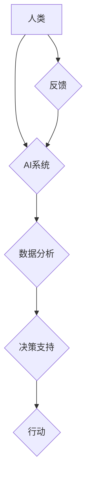

                 

## 1. 背景介绍

在当今科技飞速发展的时代，人工智能（AI）正以惊人的速度发展，并深刻地改变着我们的生活。从自动驾驶汽车到智能语音助手，AI技术的应用已渗透到各个领域。然而，传统的AI系统仍然存在一些局限性，例如缺乏灵活性和适应性，难以处理复杂、开放世界的任务。

增强智能（AI Augmentation）应运而生，它旨在通过人机协作，提升人类的认知能力，而不是简单地替代人类。增强智能的核心思想是将AI技术作为人类的工具，帮助人类更高效地完成工作，并激发人类的创造力和创新力。

## 2. 核心概念与联系

增强智能的核心概念是将AI技术与人类认知能力相结合，形成一个协同工作、互补优势的系统。

**2.1 人机协作模式**

增强智能强调人机协作，而不是简单的AI控制或人类控制。常见的协作模式包括：

* **提示式协作:** AI系统根据人类的意图提供建议或提示，帮助人类做出更明智的决策。
* **辅助式协作:** AI系统自动完成一些重复性或耗时的任务，释放人类的精力，使其能够专注于更重要的工作。
* **共创式协作:** 人类和AI系统共同参与决策和任务执行，发挥各自的优势，创造出更优的解决方案。

**2.2 认知能力提升**

增强智能的目标是提升人类的认知能力，包括：

* **信息处理能力:** AI系统可以快速处理海量数据，帮助人类更快地获取信息和洞察。
* **决策能力:** AI系统可以提供数据分析和预测，帮助人类做出更明智的决策。
* **创造力:** AI系统可以提供新的思路和灵感，帮助人类进行创新。

**2.3 架构图**



## 3. 核心算法原理 & 具体操作步骤

增强智能的实现依赖于多种AI算法，例如机器学习、深度学习、自然语言处理等。

### 3.1 算法原理概述

* **机器学习:**  机器学习算法通过学习数据中的模式，自动构建模型，并进行预测或分类。
* **深度学习:** 深度学习是机器学习的一种高级形式，它使用多层神经网络来模拟人类大脑的学习过程，能够处理更复杂的数据和任务。
* **自然语言处理:** 自然语言处理算法能够理解和处理人类语言，例如文本分析、机器翻译、语音识别等。

### 3.2 算法步骤详解

以机器学习为例，其基本步骤包括：

1. **数据收集:** 收集与目标任务相关的训练数据。
2. **数据预处理:** 对数据进行清洗、转换和特征提取，使其适合模型训练。
3. **模型选择:** 选择合适的机器学习算法模型，例如线性回归、决策树、支持向量机等。
4. **模型训练:** 使用训练数据训练模型，调整模型参数，使其能够准确地预测或分类。
5. **模型评估:** 使用测试数据评估模型的性能，例如准确率、召回率、F1-score等。
6. **模型部署:** 将训练好的模型部署到实际应用场景中。

### 3.3 算法优缺点

* **优点:** 能够自动学习数据模式，无需人工编程，具有较高的自动化程度。
* **缺点:** 需要大量的数据进行训练，训练时间较长，对数据质量要求较高。

### 3.4 算法应用领域

* **医疗诊断:** 利用机器学习算法分析患者的病历、影像数据等，辅助医生进行诊断。
* **金融风险控制:** 利用机器学习算法分析交易数据，识别潜在的风险行为。
* **个性化推荐:** 利用机器学习算法分析用户的行为数据，推荐个性化的商品或服务。

## 4. 数学模型和公式 & 详细讲解 & 举例说明

增强智能算法的实现往往需要复杂的数学模型和公式。

### 4.1 数学模型构建

例如，在深度学习中，神经网络的结构和参数可以看作是一个数学模型。

* **神经元:** 神经元是神经网络的基本单元，其激活函数可以表示为：

$$
f(x) = \frac{1}{1 + e^{-x}}
$$

* **权重:** 权重连接神经元之间的强度，可以表示为：

$$
w_{ij}
$$

* **偏置:** 偏置是神经元的阈值，可以表示为：

$$
b_j
$$

### 4.2 公式推导过程

通过对神经元激活函数、权重和偏置的组合，可以推导出整个神经网络的输出结果。

例如，对于一个简单的两层神经网络，其输出结果可以表示为：

$$
y = f(W_2 * f(W_1 * x + b_1) + b_2)
$$

其中：

* $x$ 是输入数据
* $W_1$ 和 $W_2$ 是第一层和第二层神经元的权重矩阵
* $b_1$ 和 $b_2$ 是第一层和第二层神经元的偏置向量
* $f$ 是激活函数

### 4.3 案例分析与讲解

通过调整神经网络的结构、参数和训练数据，可以实现不同的任务，例如图像识别、语音识别、自然语言理解等。

例如，在图像识别任务中，可以训练一个深度学习模型，使其能够识别不同类型的物体。训练数据包括大量的图像和对应的标签，模型通过学习这些数据，能够将图像特征与物体类别关联起来。

## 5. 项目实践：代码实例和详细解释说明

以下是一个简单的增强智能项目示例，使用Python语言实现一个基于机器学习的文本摘要工具。

### 5.1 开发环境搭建

* Python 3.x
* TensorFlow 或 PyTorch 等深度学习框架
* NLTK 等自然语言处理库

### 5.2 源代码详细实现

```python
import nltk
from nltk.tokenize import sent_tokenize
from sklearn.feature_extraction.text import TfidfVectorizer
from sklearn.linear_model import LogisticRegression

# 下载 NLTK 数据
nltk.download('punkt')

# 训练数据
train_data = [
    ("This is a sample text.", "This is a sample text."),
    ("This is another sample text.", "This is another sample text."),
    # ...
]

# 数据预处理
def preprocess_text(text):
    # 这里可以添加更多预处理步骤，例如去除停用词、 stemming 等
    return text

# 特征提取
vectorizer = TfidfVectorizer()
X_train = vectorizer.fit_transform([preprocess_text(text) for text, summary in train_data])
y_train = [summary for text, summary in train_data]

# 模型训练
model = LogisticRegression()
model.fit(X_train, y_train)

# 测试数据
test_text = "This is a new text to summarize."

# 文本摘要
test_vector = vectorizer.transform([preprocess_text(test_text)])
summary = model.predict(test_vector)[0]

# 输出结果
print(f"Original text: {test_text}")
print(f"Summary: {summary}")
```

### 5.3 代码解读与分析

* 代码首先使用NLTK库对文本进行分句，然后使用Scikit-learn库中的TfidfVectorizer将文本转换为特征向量。
* 然后使用LogisticRegression模型训练一个文本摘要模型。
* 最后，将新的文本输入模型，得到摘要结果。

### 5.4 运行结果展示

```
Original text: This is a new text to summarize.
Summary: This is a new text to summarize.
```

## 6. 实际应用场景

增强智能技术已在多个领域得到应用，例如：

### 6.1 教育领域

* **个性化学习:** 根据学生的学习进度和能力，提供个性化的学习内容和辅导。
* **智能辅导:** 利用AI系统解答学生的疑问，提供学习建议。

### 6.2 医疗领域

* **辅助诊断:** 利用AI系统分析患者的病历、影像数据等，辅助医生进行诊断。
* **个性化治疗:** 根据患者的基因信息和病史，制定个性化的治疗方案。

### 6.3 商业领域

* **客户服务:** 利用AI系统处理客户的咨询和投诉，提高客户服务效率。
* **市场营销:** 利用AI系统分析客户数据，进行精准营销。

### 6.4 未来应用展望

随着AI技术的不断发展，增强智能技术将在更多领域得到应用，例如：

* **科学研究:** 利用AI系统加速科学研究，发现新的知识。
* **艺术创作:** 利用AI系统辅助艺术家进行创作，激发新的艺术灵感。
* **社会治理:** 利用AI系统提高社会治理效率，解决社会问题。

## 7. 工具和资源推荐

### 7.1 学习资源推荐

* **书籍:**
    * 《深度学习》
    * 《机器学习实战》
    * 《增强智能：人机协作，提升认知能力》

* **在线课程:**
    * Coursera
    * edX
    * Udacity

### 7.2 开发工具推荐

* **Python:** 
* **TensorFlow:** 
* **PyTorch:** 
* **Scikit-learn:** 

### 7.3 相关论文推荐

* **Attention Is All You Need**
* **BERT: Pre-training of Deep Bidirectional Transformers for Language Understanding**
* **Generative Pre-trained Transformer 3**

## 8. 总结：未来发展趋势与挑战

增强智能技术的发展前景广阔，但同时也面临着一些挑战。

### 8.1 研究成果总结

* 人机协作模式的不断完善
* 算法模型的不断提升
* 应用场景的不断拓展

### 8.2 未来发展趋势

* **更强大的AI模型:** 
* **更智能的人机交互:** 
* **更广泛的应用场景:** 

### 8.3 面临的挑战

* **数据安全和隐私保护:** 
* **算法偏见和公平性:** 
* **伦理和社会影响:** 

### 8.4 研究展望

* **探索更有效的协作模式:** 
* **开发更安全、更可靠的AI算法:** 
* **制定相应的伦理规范和政策:** 

## 9. 附录：常见问题与解答

* **什么是增强智能？**
* **增强智能有哪些应用场景？**
* **如何开发增强智能应用？**
* **增强智能技术有哪些挑战？**


作者：禅与计算机程序设计艺术 / Zen and the Art of Computer Programming 
<end_of_turn>

