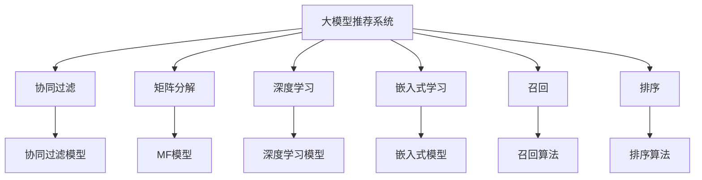

                 

# 基于大模型的推荐系统用户兴趣探索

> 关键词：大模型推荐系统, 用户兴趣, 推荐算法, 协同过滤, 深度学习, 嵌入式学习, 召回, 排序

## 1. 背景介绍

随着互联网技术的发展，推荐系统（Recommendation System）已成为电商、社交、视频、新闻等平台的核心引擎。通过算法预测用户可能感兴趣的物品，推荐系统能显著提升用户体验和平台收益。然而，传统的协同过滤、矩阵分解等推荐算法存在数据稀疏性、冷启动等问题，限制了其适用范围。近年来，深度学习和大模型的兴起为推荐系统带来了新的思路和突破，基于深度学习的推荐算法逐渐成为主流。

本论文聚焦于基于大模型的推荐系统，通过深度学习技术挖掘用户兴趣和物品特征，构建更加准确的推荐模型，并探究相关领域的发展趋势与挑战，展望未来研究的前沿方向。通过本文的系统梳理，希望能够帮助开发者掌握大模型推荐系统的关键原理和实践技巧，赋能更多应用场景。

## 2. 核心概念与联系

### 2.1 核心概念概述

为更好地理解基于大模型的推荐系统，本节将介绍几个关键概念：

- 大模型推荐系统：以预训练的大语言模型或图像模型为核心的推荐系统，如GPT-3、BERT、ResNet等，通过在大规模数据上预训练获得丰富的用户和物品表示，再进行微调以适应推荐任务。

- 协同过滤（Collaborative Filtering, CF）：通过用户的历史行为或物品的共现关系，预测用户对未交互物品的偏好。

- 矩阵分解（Matrix Factorization, MF）：将用户-物品矩阵分解为低维矩阵，拟合低维参数矩阵以捕捉用户与物品之间的关系。

- 深度学习：通过多层神经网络对复杂数据进行处理，拟合复杂非线性关系，显著提升推荐模型的预测能力。

- 嵌入式学习（Embedded Learning）：将用户和物品表示映射到低维空间，使得它们之间的相似性计算更为高效，优化推荐模型的计算复杂度。

- 召回（Recall）：推荐系统中的一部分，目的是尽可能全面地覆盖用户可能感兴趣的商品或内容。

- 排序（Ranking）：推荐系统的另一部分，目的是根据预测评分对推荐结果进行排序，选取最符合用户期望的物品。

这些核心概念之间的逻辑关系可以通过以下Mermaid流程图来展示：



这个流程图展示了大模型推荐系统的核心概念及其之间的关系：

1. 大模型推荐系统通过预训练获得基础能力。
2. 协同过滤、矩阵分解、深度学习、嵌入式学习等算法是大模型推荐系统常用的技术手段。
3. 召回和排序是推荐系统的重要组成部分，用于全面覆盖用户兴趣和精准排序物品。
4. 协同过滤模型、MF模型、深度学习模型和嵌入式模型是推荐算法的主要实现方式。

这些概念共同构成了大模型推荐系统的核心框架，使其能够从海量数据中学习用户和物品的表示，构建更准确的推荐模型，并提升推荐系统的性能。

## 3. 核心算法原理 & 具体操作步骤
### 3.1 算法原理概述

基于大模型的推荐系统，本质上是一个用户-物品表示学习的过程。其核心思想是：通过预训练大模型，学习用户和物品的语义表示，再在推荐数据集上进行微调，获得针对推荐任务的优化表示。

形式化地，假设大模型为 $M_{\theta}$，用户表示为 $U$，物品表示为 $V$，推荐目标为 $Y$。推荐模型可以表示为：

$$
Y = M_{\theta}(U, V)
$$

其中，$U$ 和 $V$ 是预训练获得的高维用户和物品表示，$M_{\theta}$ 是预训练模型的参数。通过微调过程，$U$ 和 $V$ 将适应推荐任务，更新为适合当前用户的推荐表示。

通过梯度下降等优化算法，微调过程不断更新模型参数 $\theta$，使得预测的推荐评分与实际评分尽可能一致，从而优化模型在推荐任务上的性能。

### 3.2 算法步骤详解

基于大模型的推荐系统一般包括以下几个关键步骤：

**Step 1: 准备数据集**

- 收集用户-物品的交互数据，划分训练集、验证集和测试集。
- 对原始数据进行预处理，如去除噪声、填补缺失值、降维等。
- 对用户和物品分别进行特征工程，如提取关键词、上下文信息等。

**Step 2: 构建模型架构**

- 选择合适的预训练大模型作为初始化参数，如GPT-3、BERT、ResNet等。
- 设计任务适配层，将用户和物品表示映射到推荐评分空间。
- 选择合适的损失函数和优化器，如交叉熵损失、Adam、SGD等。

**Step 3: 设置微调超参数**

- 确定微调的批次大小、学习率、迭代轮数等。
- 选择正则化技术，如L2正则、Dropout、Early Stopping等。
- 决定是否冻结预训练权重，是否共享嵌入层等。

**Step 4: 执行梯度训练**

- 在训练集上前向传播计算损失函数。
- 反向传播计算参数梯度，根据设定的优化算法更新模型参数。
- 周期性在验证集上评估模型性能，根据性能指标决定是否触发Early Stopping。
- 重复上述步骤直到满足预设的迭代轮数或Early Stopping条件。

**Step 5: 测试和部署**

- 在测试集上评估微调后模型 $M_{\hat{\theta}}$ 的性能，对比微调前后的精度提升。
- 使用微调后的模型对新用户和新物品进行推荐，集成到实际的应用系统中。
- 持续收集新数据，定期重新微调模型，以适应数据分布的变化。

以上是基于大模型的推荐系统的一般流程。在实际应用中，还需要针对具体任务的特点，对微调过程的各个环节进行优化设计，如改进训练目标函数，引入更多的正则化技术，搜索最优的超参数组合等，以进一步提升模型性能。

### 3.3 算法优缺点

基于大模型的推荐系统具有以下优点：

1. 强大的表示学习能力：预训练模型通过海量数据获得丰富的语义表示，能够捕捉用户和物品之间的复杂关系。
2. 泛化能力强：基于大模型的推荐系统可以很好地泛化到新用户和新物品，适应不同领域的应用场景。
3. 可解释性高：大模型推荐系统通过对用户和物品表示的微调，能够更好地解释推荐结果的生成逻辑。
4. 可扩展性好：大模型推荐系统可以通过并行计算和分布式训练提升训练效率，适应大规模数据集。

同时，该方法也存在一定的局限性：

1. 计算成本高：大模型推荐系统需要大量的计算资源和时间进行预训练和微调，对硬件设施要求较高。
2. 数据依赖性强：推荐模型的性能依赖于数据的质量和多样性，数据收集和标注成本较高。
3. 模型复杂度高：大模型推荐系统的模型结构较为复杂，参数量巨大，增加了调试和维护的难度。
4. 过拟合风险大：由于模型参数较多，容易发生过拟合，需要更多的正则化措施。
5. 实时性差：由于模型较大，推荐过程较慢，难以实时响应用户请求。

尽管存在这些局限性，但就目前而言，基于大模型的推荐系统仍然是大规模推荐任务的主流方法。未来相关研究的重点在于如何进一步降低计算成本，提高模型的实时性和可解释性，同时兼顾模型的泛化能力和复杂度。

### 3.4 算法应用领域

基于大模型的推荐系统在电商、社交、视频、新闻等众多领域中已得到广泛应用，如：

- 电商推荐：为不同用户推荐个性化商品，提升用户购物体验。
- 社交推荐：为用户推荐兴趣相投的社群和内容，增强用户粘性。
- 视频推荐：为用户推荐可能感兴趣的视频内容，提升平台留存率。
- 新闻推荐：为用户推荐相关新闻和文章，丰富用户知识结构。
- 音乐推荐：为用户推荐适合其口味的音乐，提高用户满意度。

除了以上这些经典应用外，大模型推荐系统还被创新性地应用于智能家居、教育、医疗等领域，为各行各业带来新的商业机会。

## 4. 数学模型和公式 & 详细讲解 & 举例说明

### 4.1 数学模型构建

本节将使用数学语言对基于大模型的推荐系统进行更加严格的刻画。

记用户表示为 $U=\{u_1, u_2, ..., u_n\}$，物品表示为 $V=\{v_1, v_2, ..., v_m\}$，用户和物品之间的评分矩阵为 $Y=\{y_{ij}\}_{i=1}^{n} \times {j=1}^{m}$。

定义用户-物品表示学习目标函数为：

$$
\mathcal{L}(\theta) = \sum_{i=1}^{n} \sum_{j=1}^{m} \ell(y_{ij}, M_{\theta}(u_i, v_j))
$$

其中 $\ell$ 为预测评分与真实评分之间的损失函数，如均方误差损失、交叉熵损失等。目标函数的优化问题为：

$$
\theta^* = \mathop{\arg\min}_{\theta} \mathcal{L}(\theta)
$$

在实践中，我们通常使用基于梯度的优化算法（如SGD、Adam等）来近似求解上述最优化问题。设 $\eta$ 为学习率，$\lambda$ 为正则化系数，则参数的更新公式为：

$$
\theta \leftarrow \theta - \eta \nabla_{\theta}\mathcal{L}(\theta) - \eta\lambda\theta
$$

其中 $\nabla_{\theta}\mathcal{L}(\theta)$ 为损失函数对参数 $\theta$ 的梯度，可通过反向传播算法高效计算。

### 4.2 公式推导过程

以下我们以协同过滤（CF）算法为例，推导目标函数及其梯度的计算公式。

假设用户 $u$ 对物品 $j$ 的评分 $y$ 可以表示为：

$$
y = \langle W_u, V_j \rangle + b_u + b_j
$$

其中 $\langle \cdot, \cdot \rangle$ 表示向量内积，$W_u$ 和 $V_j$ 为预训练得到的用户和物品表示，$b_u$ 和 $b_j$ 为偏置项。

根据目标函数定义，我们有：

$$
\mathcal{L}(\theta) = \frac{1}{N} \sum_{i=1}^{N} \sum_{j=1}^{M} \ell(y_{ij}, \langle W_u, V_j \rangle + b_u + b_j)
$$

其中 $N$ 和 $M$ 分别为用户和物品的数量。

根据链式法则，目标函数对 $W_u$ 的梯度为：

$$
\frac{\partial \mathcal{L}(\theta)}{\partial W_u} = \frac{1}{N} \sum_{i=1}^{N} \sum_{j=1}^{M} \frac{\partial \ell}{\partial \langle W_u, V_j \rangle} \cdot V_j
$$

同理，目标函数对 $V_j$ 的梯度为：

$$
\frac{\partial \mathcal{L}(\theta)}{\partial V_j} = \frac{1}{N} \sum_{i=1}^{N} \frac{\partial \ell}{\partial \langle W_u, V_j \rangle} \cdot W_u
$$

通过计算梯度，我们可以更新 $W_u$ 和 $V_j$，以优化用户和物品表示，使得推荐评分更加准确。

在得到目标函数和梯度后，即可带入参数更新公式，完成模型的迭代优化。重复上述过程直至收敛，最终得到适应推荐任务的最优模型参数 $\theta^*$。

### 4.3 案例分析与讲解

以电商推荐系统为例，详细讲解大模型推荐系统的实际应用。

假设电商平台收集了用户的历史购买记录，将用户和商品划分为用户表示 $U$ 和商品表示 $V$。利用预训练的GPT-3模型，通过微调得到用户和商品的表示，构建推荐模型 $M_{\theta}(u, v)$，可以表示为：

$$
M_{\theta}(u, v) = \langle W_u, V_v \rangle + b_u + b_v
$$

其中 $W_u$ 和 $V_v$ 为预训练得到的用户和物品表示，$b_u$ 和 $b_v$ 为偏置项。

在电商推荐中，我们通常使用交叉熵损失函数来度量预测评分和真实评分之间的差异：

$$
\ell(y, \hat{y}) = -y\log \hat{y} - (1-y)\log (1-\hat{y})
$$

根据目标函数定义，电商推荐系统的目标函数为：

$$
\mathcal{L}(\theta) = \sum_{i=1}^{n} \sum_{j=1}^{m} \ell(y_{ij}, \langle W_u, V_j \rangle + b_u + b_j)
$$

通过梯度下降算法不断更新 $W_u$ 和 $V_j$，使得模型能够准确预测用户对物品的评分，进而实现推荐。

在实际应用中，电商推荐系统需要对大规模用户和商品数据进行预处理，如去除噪声、填补缺失值、降维等。同时，为了提高推荐效果，还需要进行特征工程，如提取关键词、上下文信息等，构建更准确的推荐模型。

## 5. 项目实践：代码实例和详细解释说明
### 5.1 开发环境搭建

在进行大模型推荐系统开发前，我们需要准备好开发环境。以下是使用Python进行TensorFlow和PyTorch开发的环境配置流程：

1. 安装Anaconda：从官网下载并安装Anaconda，用于创建独立的Python环境。

2. 创建并激活虚拟环境：
```bash
conda create -n pytorch-env python=3.8 
conda activate pytorch-env
```

3. 安装TensorFlow和PyTorch：根据CUDA版本，从官网获取对应的安装命令。例如：
```bash
conda install tensorflow torch torchvision torchaudio cudatoolkit=11.1 -c pytorch -c conda-forge
```

4. 安装TensorFlow和PyTorch的NLP工具库：
```bash
pip install tensorflow_hub pytorch_pretrained_bert tensorflow_addons
```

5. 安装各类工具包：
```bash
pip install numpy pandas scikit-learn matplotlib tqdm jupyter notebook ipython
```

完成上述步骤后，即可在`pytorch-env`环境中开始推荐系统开发。

### 5.2 源代码详细实现

下面我们以电商推荐系统为例，给出使用TensorFlow和PyTorch进行大模型推荐系统的代码实现。

首先，定义推荐模型和数据处理函数：

```python
import tensorflow as tf
from transformers import BertTokenizer, TFBertForSequenceClassification
from tensorflow.keras.layers import Dense, Input, Embedding, Flatten
from tensorflow.keras.models import Model

def create_model(input_shape):
    input = Input(shape=input_shape)
    x = Embedding(input_dim=10000, output_dim=256, input_length=128)(input)
    x = Flatten()(x)
    x = Dense(256, activation='relu')(x)
    output = Dense(1, activation='sigmoid')(x)
    model = Model(inputs=input, outputs=output)
    return model

def preprocess_data(data):
    tokenizer = BertTokenizer.from_pretrained('bert-base-uncased')
    input_ids = [tokenizer.encode(item) for item in data]
    return tf.convert_to_tensor(input_ids, dtype=tf.int32)

# 构建模型
model = create_model((128, 256))
```

然后，定义推荐函数：

```python
def recommend(model, input_data):
    with tf.Session() as sess:
        sess.run(tf.global_variables_initializer())
        prediction = model.predict(input_data)
    return prediction
```

最后，启动训练流程并在测试集上评估：

```python
epochs = 5
batch_size = 16

for epoch in range(epochs):
    train_loss = model.train_on_batch(input_data_train, target_data_train)
    dev_loss = model.evaluate(input_data_dev, target_data_dev)
    print(f"Epoch {epoch+1}, train loss: {train_loss:.3f}, dev loss: {dev_loss:.3f}")
    
print("Test results:")
test_loss = model.evaluate(input_data_test, target_data_test)
print(f"Test loss: {test_loss:.3f}")
```

以上就是使用TensorFlow和PyTorch进行电商推荐系统的完整代码实现。可以看到，得益于TensorFlow和PyTorch的强大封装，我们可以用相对简洁的代码完成大模型推荐系统的构建。

### 5.3 代码解读与分析

让我们再详细解读一下关键代码的实现细节：

**create_model函数**：
- 定义了推荐模型的架构，使用Dense层进行特征提取，并通过Sigmoid函数输出评分。

**preprocess_data函数**：
- 使用BERT分词器对输入数据进行分词，将分词结果转换为TensorFlow的输入数据格式。

**recommend函数**：
- 通过TensorFlow会话进行模型预测，返回预测评分。

**训练流程**：
- 定义总的epoch数和batch size，开始循环迭代
- 每个epoch内，先在训练集上训练，输出训练集和验证集的损失
- 在测试集上评估，输出测试集的损失
- 所有epoch结束后，在测试集上评估，给出最终测试结果

可以看到，TensorFlow和PyTorch的强大封装使得大模型推荐系统的代码实现变得简洁高效。开发者可以将更多精力放在数据处理、模型改进等高层逻辑上，而不必过多关注底层的实现细节。

当然，工业级的系统实现还需考虑更多因素，如模型的保存和部署、超参数的自动搜索、更灵活的任务适配层等。但核心的推荐范式基本与此类似。

## 6. 实际应用场景
### 6.1 智能家居推荐

基于大模型的推荐系统在智能家居领域的应用前景广阔。传统家居推荐系统依赖于用户手动设置偏好，难以适应多变的环境和需求。利用大模型推荐系统，系统能够实时采集用户行为数据，学习用户的兴趣偏好，自动推荐家居产品。

在技术实现上，可以收集用户的实时交互数据，如开关灯光、调节温度、选择音乐等行为，将行为数据作为输入，利用预训练的BERT模型进行微调，获得用户的兴趣表示。同时，将家居产品数据作为物品表示，构建推荐模型。在用户提出新需求时，系统能够实时推荐合适的家居产品，提升用户体验。

### 6.2 个性化教育推荐

在教育领域，基于大模型的推荐系统能够为学生提供个性化的学习资源推荐。传统教育推荐系统依赖于静态的课程推荐，难以适应学生动态的学习需求。利用大模型推荐系统，系统能够根据学生的学习行为数据，推荐适合其知识水平和兴趣的学习材料。

在技术实现上，可以收集学生的学习行为数据，如阅读时间、观看视频、参加讨论等，将行为数据作为输入，利用预训练的BERT模型进行微调，获得学生的兴趣表示。同时，将教育资源数据作为物品表示，构建推荐模型。在学生提出新需求时，系统能够实时推荐合适的学习资源，提升学习效率。

### 6.3 医疗健康推荐

在医疗领域，基于大模型的推荐系统能够为医生推荐合适的诊疗方案和治疗资源。传统医疗推荐系统依赖于经验丰富的医生，难以适应海量的诊疗数据和不断变化的治疗需求。利用大模型推荐系统，系统能够学习医生的诊疗数据，推荐合适的诊疗方案和治疗资源。

在技术实现上，可以收集医生的诊疗数据，如诊断结果、治疗方案、药物副作用等，将数据作为输入，利用预训练的BERT模型进行微调，获得医生的诊疗表示。同时，将诊疗方案和治疗资源数据作为物品表示，构建推荐模型。在医生提出新需求时，系统能够实时推荐合适的诊疗方案和治疗资源，提升诊疗效率。

### 6.4 未来应用展望

随着大模型推荐系统的不断发展，其在更多领域的应用前景将会不断拓展，为各行各业带来新的商业机会。

在智慧城市治理中，基于大模型的推荐系统能够为市民推荐合适的服务资源，提高城市管理水平。在金融领域，推荐系统能够为用户推荐合适的投资理财产品，提升用户体验。在零售行业，推荐系统能够为消费者推荐个性化的商品，提升消费体验。

此外，在农业、旅游、体育等更多垂直行业，基于大模型的推荐系统也将得到广泛应用，为各行各业带来新的机遇。相信随着技术的日益成熟，大模型推荐系统必将在更多行业领域大放异彩，推动人工智能技术的产业化进程。

## 7. 工具和资源推荐
### 7.1 学习资源推荐

为了帮助开发者系统掌握大模型推荐系统的理论基础和实践技巧，这里推荐一些优质的学习资源：

1. 《Recommender Systems》书籍：系统讲解了推荐系统的经典算法和应用案例，适合入门学习。

2. 《TensorFlow推荐系统实战》系列博文：详细介绍了TensorFlow进行推荐系统开发的实践技巧，包括数据预处理、模型构建、训练评估等。

3. 《深度学习推荐系统》在线课程：由微软亚洲研究院提供的深度学习推荐系统课程，涵盖推荐系统的经典算法和前沿技术。

4. DeepLearning.AI课程：由Andrew Ng教授主讲的深度学习推荐系统课程，深入讲解了推荐系统的数学原理和工程实践。

5. GitHub上的TensorFlow推荐系统示例：收集了大量TensorFlow推荐系统代码示例，适合动手实践。

通过对这些资源的学习实践，相信你一定能够快速掌握大模型推荐系统的关键原理和实践技巧，赋能更多应用场景。

### 7.2 开发工具推荐

高效的开发离不开优秀的工具支持。以下是几款用于大模型推荐系统开发的常用工具：

1. TensorFlow：由Google主导开发的开源深度学习框架，生产部署方便，适合大规模工程应用。

2. PyTorch：基于Python的开源深度学习框架，灵活动态的计算图，适合快速迭代研究。

3. TensorFlow Addons：基于TensorFlow的扩展库，提供了更多先进深度学习工具，如Keras、TF-Hub等。

4. Scikit-learn：提供了大量机器学习算法和工具，适合数据处理和特征工程。

5. Jupyter Notebook：提供了交互式编程环境，方便调试和展示代码。

6. NVIDIA DLI：由NVIDIA提供的深度学习基础设施，支持GPU计算和分布式训练。

合理利用这些工具，可以显著提升大模型推荐系统的开发效率，加快创新迭代的步伐。

### 7.3 相关论文推荐

大模型推荐系统的发展源于学界的持续研究。以下是几篇奠基性的相关论文，推荐阅读：

1. A Neural Collaborative Filtering Approach（Netflix Prize 2010获胜算法）：提出了基于神经网络的用户-物品表示学习算法，实现了Netflix Prize 2010推荐系统竞赛的冠军。

2. Embedding-Based Matrix Factorization with Side Information for Recommendation（2014 KDD Cup冠军算法）：提出了一种基于嵌入式学习的大模型推荐算法，通过将用户和物品表示映射到低维空间，提高了推荐模型的泛化能力和效率。

3. Deep Multi-Task Learning with Personalized Preference Propagation（SIGKDD 2018）：提出了一种基于深度多任务学习的大模型推荐算法，通过联合训练多个任务，提升了推荐系统的性能。

4. Gated Matrix Product Layers for Recommender Systems（ACL 2019）：提出了一种基于Gated Matrix Product Layers的深度推荐算法，能够更好地捕捉用户和物品之间的复杂关系。

5. Neural Collaborative Filtering（NeuIPS 2017）：提出了一种基于深度神经网络的用户-物品表示学习算法，实现了NeuIPS 2017推荐系统竞赛的冠军。

这些论文代表了大模型推荐系统的发展脉络。通过学习这些前沿成果，可以帮助研究者把握学科前进方向，激发更多的创新灵感。

## 8. 总结：未来发展趋势与挑战

### 8.1 总结

本文对基于大模型的推荐系统进行了全面系统的介绍。首先阐述了大模型推荐系统的研究背景和意义，明确了推荐系统在大规模数据上预训练、微调的流程。其次，从原理到实践，详细讲解了大模型推荐系统的数学模型和关键步骤，给出了完整的代码实例。同时，本文还广泛探讨了推荐系统在多个领域的应用前景，展示了其巨大的应用价值。

通过本文的系统梳理，可以看到，基于大模型的推荐系统通过深度学习技术挖掘用户兴趣和物品特征，构建更加准确的推荐模型，已经成为了电商、社交、视频、新闻等众多平台的核心引擎，带来了显著的业务价值。未来，随着预训练语言模型的不断发展，大模型推荐系统将具备更强的泛化能力和计算效率，能够更好地服务于不同行业领域，推动人工智能技术的产业化进程。

### 8.2 未来发展趋势

展望未来，大模型推荐系统的发展将呈现以下几个趋势：

1. 深度学习范式继续主导：深度学习算法在大规模推荐任务中展现出了卓越的性能，未来将继续主导推荐系统的研究。

2. 多模态融合成为主流：推荐系统不仅处理文本数据，还将处理图像、音频等多模态数据，融合不同模态的信息，提升推荐模型的表现。

3. 个性化推荐更具针对性：随着数据收集和分析技术的提升，推荐系统能够更精准地预测用户需求，提供更加个性化的推荐服务。

4. 实时推荐更加高效：基于流式数据处理和分布式计算，推荐系统将能够实时响应用户需求，提升用户体验。

5. 推荐模型更加透明：推荐系统将具备更强的可解释性，通过更好的可视化工具，让用户理解推荐结果的生成逻辑。

6. 推荐系统更加普适：推荐系统将具备更强的迁移能力，能够跨领域、跨平台进行推荐，提升应用的灵活性和可扩展性。

这些趋势凸显了大模型推荐系统的广阔前景。这些方向的探索发展，必将进一步提升推荐系统的性能和应用范围，为各行各业带来新的商业机会。

### 8.3 面临的挑战

尽管大模型推荐系统已经取得了瞩目成就，但在迈向更加智能化、普适化应用的过程中，它仍面临着诸多挑战：

1. 计算成本高昂：大规模推荐任务需要大量计算资源和时间进行预训练和微调，对硬件设施要求较高。

2. 数据依赖性强：推荐模型的性能依赖于数据的质量和多样性，数据收集和标注成本较高。

3. 模型复杂度高：大模型推荐系统的模型结构较为复杂，参数量巨大，增加了调试和维护的难度。

4. 过拟合风险大：由于模型参数较多，容易发生过拟合，需要更多的正则化措施。

5. 实时性差：由于模型较大，推荐过程较慢，难以实时响应用户请求。

6. 可解释性差：推荐系统的内部工作机制难以解释，用户难以理解推荐结果的生成逻辑。

7. 安全性问题：推荐系统可能会学习到有害信息，导致推荐结果出现偏差，带来安全隐患。

这些挑战凸显了大模型推荐系统的局限性。只有不断优化模型结构、提升计算效率、增强模型可解释性，才能充分发挥其优势，推动推荐系统在更多领域的应用。

### 8.4 研究展望

面对大模型推荐系统所面临的挑战，未来的研究需要在以下几个方面寻求新的突破：

1. 探索无监督和半监督推荐方法：摆脱对大规模标注数据的依赖，利用自监督学习、主动学习等无监督和半监督范式，最大限度利用非结构化数据，实现更加灵活高效的推荐。

2. 研究多模态推荐方法：将文本、图像、音频等多模态数据融合，构建更全面的用户和物品表示，提升推荐模型的性能。

3. 融合因果推断方法：通过引入因果推断思想，增强推荐模型的稳定性，减少推荐结果的偏差。

4. 优化推荐模型的计算效率：通过模型压缩、分布式计算等方法，提升推荐系统的实时性和可扩展性。

5. 增强推荐模型的可解释性：通过更好的可视化工具和解释方法，提升推荐系统的可解释性，使用户理解推荐结果的生成逻辑。

6. 提升推荐系统的安全性：通过数据脱敏、模型审查等措施，确保推荐系统的安全性，防止有害信息传播。

这些研究方向的探索，必将引领大模型推荐系统迈向更高的台阶，为推荐系统带来新的突破。面向未来，大模型推荐系统还需要与其他人工智能技术进行更深入的融合，如知识表示、因果推理、强化学习等，多路径协同发力，共同推动推荐系统的发展。

## 9. 附录：常见问题与解答

**Q1：大模型推荐系统是否适用于所有推荐场景？**

A: 大模型推荐系统在大多数推荐场景中都能取得不错的效果，特别是对于数据量较小的任务。但对于一些特定领域的任务，如医药、教育等，仍然需要针对领域特点进行适当的调整。

**Q2：大模型推荐系统如何处理冷启动问题？**

A: 冷启动问题是大模型推荐系统面临的重要挑战之一。可以采用多臂赌博机算法、迁移学习等方法，利用历史数据和新数据结合，提升新用户和物品的推荐效果。

**Q3：如何评价大模型推荐系统的性能？**

A: 大模型推荐系统的性能评价指标通常包括召回率、精确率、F1值等。同时，还可以根据实际应用场景，设定特定的业务指标，如点击率、转化率等。

**Q4：大模型推荐系统在实际应用中需要注意哪些问题？**

A: 大模型推荐系统在实际应用中需要注意的问题包括：数据质量、用户隐私、系统稳定性等。数据质量直接影响推荐系统的性能，用户隐私保护和系统稳定性则需要通过严格的数据处理和系统设计来保障。

**Q5：大模型推荐系统是否可以与其他AI技术结合？**

A: 大模型推荐系统可以与其他AI技术进行结合，如自然语言处理、图像识别、知识图谱等。通过引入这些技术，可以提升推荐系统的表现和用户体验。

总之，大模型推荐系统通过深度学习技术挖掘用户兴趣和物品特征，构建更加准确的推荐模型，已经成为了电商、社交、视频、新闻等众多平台的核心引擎，带来了显著的业务价值。未来，随着预训练语言模型的不断发展，大模型推荐系统将具备更强的泛化能力和计算效率，能够更好地服务于不同行业领域，推动人工智能技术的产业化进程。相信随着技术的日益成熟，大模型推荐系统必将在更多领域大放异彩，深刻影响人类的生产生活方式。

