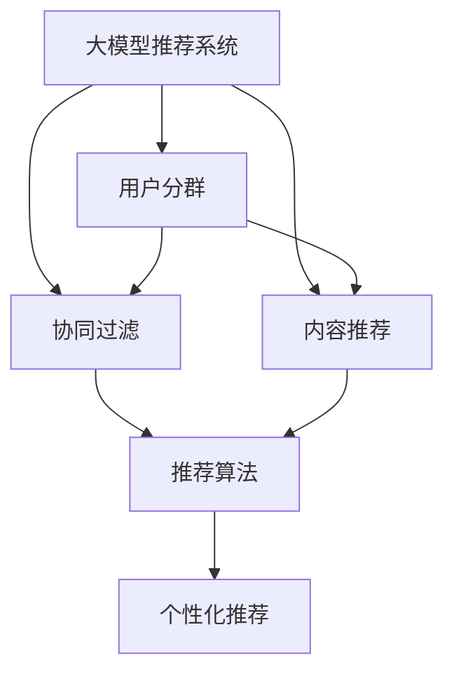

                 

# 基于大模型的推荐系统用户分群优化

> 关键词：
1. 大模型推荐系统
2. 用户分群
3. 协同过滤
4. 内容推荐
5. 深度学习
6. 自然语言处理
7. 个性化推荐

## 1. 背景介绍

### 1.1 问题由来

在当今数字时代，推荐系统已经成为互联网应用不可或缺的一部分。无论是电商、社交媒体、新闻平台，还是视频流媒体，都依赖推荐系统为用户推荐感兴趣的内容。然而，传统的推荐算法，如协同过滤、基于内容的推荐等，存在着数据稀疏性、冷启动问题，难以满足用户个性化需求和快速变化的市场趋势。

近年来，深度学习技术和大规模预训练语言模型的发展，为推荐系统带来了新的突破。通过在大规模语料上预训练得到的语言模型，可以捕捉到用户兴趣和行为的全局模式，从而提升推荐系统的效果。然而，直接使用大规模预训练模型进行推荐，面临着数据和计算资源的极大挑战，难以适应实时推荐的需求。

### 1.2 问题核心关键点

为解决这一问题，研究人员提出了一种基于大模型的推荐系统用户分群优化方法。该方法通过将用户分为不同的子群，分别训练优化后的预训练模型，以实现个性化推荐，同时降低对资源的消耗。本文聚焦于这种基于大模型的推荐系统用户分群优化方法，探讨其原理、实现方式及应用前景。

## 2. 核心概念与联系

### 2.1 核心概念概述

为更好地理解基于大模型的推荐系统用户分群优化方法，本节将介绍几个密切相关的核心概念：

- 大模型推荐系统(Recommendation System Based on Large Model)：以预训练语言模型为基础，通过用户行为数据和内容特征训练优化后的模型，实现个性化推荐。
- 用户分群(User Clustering)：根据用户兴趣和行为特征，将用户划分为若干子群，每个子群中的用户具有相似的兴趣和行为模式。
- 协同过滤(Collaborative Filtering)：通过分析用户历史行为，预测用户对未尝试物品的评分，推荐相似用户喜欢的物品。
- 内容推荐(Content-Based Recommendation)：根据用户兴趣和物品属性，推荐用户可能感兴趣的内容。
- 深度学习(Deep Learning)：使用神经网络模型对数据进行建模，捕捉数据中的复杂模式和规律。
- 自然语言处理(Natural Language Processing, NLP)：使用自然语言处理技术，分析文本数据，提取用户兴趣和行为特征。

这些核心概念之间的逻辑关系可以通过以下Mermaid流程图来展示：



这个流程图展示了大模型推荐系统的主要组件及其之间的关系：

1. 大模型推荐系统通过用户行为数据和内容特征训练优化后的预训练模型。
2. 用户分群根据用户兴趣和行为特征，将用户划分为若干子群。
3. 协同过滤和内容推荐分别根据用户历史行为和物品属性，推荐相似物品。
4. 推荐算法根据协同过滤和内容推荐的结果，进行个性化推荐。

这些组件共同构成了大模型推荐系统的工作流程，使得系统能够高效地为用户提供个性化推荐服务。

## 3. 核心算法原理 & 具体操作步骤
### 3.1 算法原理概述

基于大模型的推荐系统用户分群优化方法，本质上是一种基于监督学习的数据建模和优化方法。其核心思想是：根据用户行为和兴趣特征，将用户划分为若干子群，对每个子群分别训练优化后的预训练模型，以实现个性化推荐，同时降低计算资源的消耗。

具体而言，假设推荐系统有 $N$ 个用户，$m$ 个物品，用户行为数据矩阵为 $R \in \mathbb{R}^{N \times m}$，其中 $R_{i,j}$ 表示用户 $i$ 对物品 $j$ 的评分（$R_{i,j} = 0$ 表示用户未尝试该物品）。

大模型的用户分群优化方法包括以下几个关键步骤：

1. 用户分群：通过聚类算法将用户分为若干子群 $G_1, G_2, ..., G_k$，其中 $k$ 为子群数目。
2. 子群优化：对每个子群 $G_i$，分别训练优化后的预训练模型 $M_i$，其中 $M_i$ 表示用户 $i$ 在子群 $G_i$ 中对应的模型。
3. 个性化推荐：对新用户 $u$，根据其所属子群 $G_j$，使用模型 $M_j$ 进行个性化推荐。

通过这种基于用户分群的方法，可以有效地解决传统推荐算法面临的数据稀疏性、冷启动等问题，同时降低大规模预训练模型的计算成本。

### 3.2 算法步骤详解

基于大模型的推荐系统用户分群优化方法一般包括以下几个关键步骤：

**Step 1: 数据预处理和用户分群**

1. 收集推荐系统用户的历史行为数据，包括点击、购买、评分等。
2. 对用户行为数据进行标准化处理，如归一化、向量表示等。
3. 使用聚类算法（如K-means、层次聚类、DBSCAN等）对用户进行分群。常用的聚类算法包括：
   - K-means聚类：通过计算用户行为数据与聚类中心的距离，将用户分配到最近的聚类中心。
   - 层次聚类：通过构建用户行为数据的层次结构，逐步合并相似的用户，形成聚类。
   - DBSCAN聚类：通过密度可达性划分用户，将密度较高的用户分为同一聚类。
4. 将用户分为 $k$ 个子群 $G_1, G_2, ..., G_k$，每个子群中的用户具有相似的兴趣和行为模式。

**Step 2: 子群优化**

1. 对每个子群 $G_i$，分别训练优化后的预训练模型 $M_i$，其中 $M_i$ 表示用户 $i$ 在子群 $G_i$ 中对应的模型。
2. 使用子群优化的方法，如微调、Fine-tuning、正则化等，对模型 $M_i$ 进行优化。常用的子群优化方法包括：
   - 微调：在子群数据上对模型进行有监督的微调，以提升模型在子群中的表现。
   - Fine-tuning：在子群数据上对模型的特定层进行微调，保留大部分预训练权重，减少计算成本。
   - 正则化：使用L2正则、Dropout、Early Stopping等，防止模型过度适应子群数据。
3. 保存优化后的模型 $M_i$，用于后续的个性化推荐。

**Step 3: 个性化推荐**

1. 对新用户 $u$，根据其所属子群 $G_j$，使用模型 $M_j$ 进行个性化推荐。
2. 使用协同过滤或内容推荐算法，生成推荐物品列表。
3. 根据推荐物品列表和模型 $M_j$ 的输出，进行个性化推荐。

### 3.3 算法优缺点

基于大模型的推荐系统用户分群优化方法具有以下优点：

1. 高效性：通过用户分群，将大规模预训练模型的计算成本分散到每个子群上，显著降低计算资源消耗。
2. 个性化：每个子群中的用户具有相似的兴趣和行为模式，通过优化后的预训练模型，可以更精准地为用户推荐感兴趣的内容。
3. 鲁棒性：子群划分能够过滤掉异常数据，提高推荐系统的鲁棒性和准确性。

同时，该方法也存在一定的局限性：

1. 数据分布假设：用户分群方法依赖于用户的兴趣和行为分布，如果用户行为分布变化较大，聚类结果可能会受到影响。
2. 子群数目选择：子群数目的选择对推荐系统的效果有重要影响，过多的子群会增加计算成本，过少的子群可能导致推荐泛化性不足。
3. 冷启动问题：新用户或新物品可能无法被准确划分到某个子群，导致推荐效果不佳。

尽管存在这些局限性，但就目前而言，基于大模型的推荐系统用户分群优化方法仍是一种高效、可行的推荐系统优化方案。未来相关研究的重点在于如何进一步提高聚类效果、优化子群划分和提升推荐系统的泛化能力。

### 3.4 算法应用领域

基于大模型的推荐系统用户分群优化方法，在推荐系统领域已经得到了广泛的应用，覆盖了电商、社交媒体、新闻平台等多个场景，具体应用如下：

- 电商推荐系统：通过用户分群，对不同兴趣的用户群体推荐个性化的商品和促销活动。
- 社交媒体推荐系统：根据用户的兴趣和行为特征，推荐相关的内容和用户。
- 新闻平台推荐系统：对不同兴趣的用户群体推荐个性化的新闻文章和视频。
- 视频流媒体推荐系统：根据用户的兴趣和行为特征，推荐相关的影视作品和视频内容。

除了上述这些经典应用外，大模型的用户分群优化方法也被创新性地应用到更多场景中，如音乐推荐、游戏推荐、广告推荐等，为推荐系统带来了全新的突破。随着预训练语言模型和用户分群优化方法的不断进步，相信推荐系统必将在更广阔的应用领域大放异彩。

## 4. 数学模型和公式 & 详细讲解  
### 4.1 数学模型构建

本节将使用数学语言对基于大模型的推荐系统用户分群优化方法进行更加严格的刻画。

假设推荐系统有 $N$ 个用户，$m$ 个物品，用户行为数据矩阵为 $R \in \mathbb{R}^{N \times m}$，其中 $R_{i,j}$ 表示用户 $i$ 对物品 $j$ 的评分（$R_{i,j} = 0$ 表示用户未尝试该物品）。

定义用户分群为 $G = \{G_1, G_2, ..., G_k\}$，每个子群 $G_i$ 中的用户具有相似的兴趣和行为模式。设每个子群 $G_i$ 的大小为 $n_i$。

定义每个子群 $G_i$ 的优化后的预训练模型为 $M_i$，其输入为 $x_i$，输出为 $\hat{y_i}$，其中 $\hat{y_i}$ 表示模型对物品 $j$ 的预测评分。

则每个子群 $G_i$ 的损失函数为：

$$
\mathcal{L}_i(M_i) = \frac{1}{n_i} \sum_{j=1}^{m} \sum_{i=1}^{n_i} \ell(M_i(x_i),R_{i,j})
$$

其中 $\ell$ 为损失函数，如均方误差、交叉熵等。

优化目标是最小化每个子群的损失函数，即：

$$
\mathop{\arg\min}_{M_i} \sum_{i=1}^{k} \mathcal{L}_i(M_i)
$$

在实践中，我们通常使用基于梯度的优化算法（如SGD、Adam等）来近似求解上述最优化问题。设 $\eta$ 为学习率，则参数的更新公式为：

$$
M_i \leftarrow M_i - \eta \nabla_{M_i}\mathcal{L}_i(M_i)
$$

其中 $\nabla_{M_i}\mathcal{L}_i(M_i)$ 为损失函数对模型 $M_i$ 的梯度，可通过反向传播算法高效计算。

### 4.2 公式推导过程

以下我们以均方误差损失函数为例，推导子群优化模型的更新公式。

假设模型 $M_i$ 在输入 $x_i$ 上的输出为 $\hat{y_i}$，表示模型对物品 $j$ 的预测评分。真实标签 $y_i \in \mathbb{R}$，表示用户 $i$ 对物品 $j$ 的实际评分。

则均方误差损失函数定义为：

$$
\ell(M_i(x_i),y_i) = \frac{1}{2}(\hat{y_i} - y_i)^2
$$

将其代入损失函数公式，得：

$$
\mathcal{L}_i(M_i) = \frac{1}{n_i} \sum_{j=1}^{m} \sum_{i=1}^{n_i} \frac{1}{2}(\hat{y_i} - y_i)^2
$$

根据链式法则，损失函数对模型 $M_i$ 的梯度为：

$$
\frac{\partial \mathcal{L}_i(M_i)}{\partial M_i} = \frac{1}{n_i} \sum_{j=1}^{m} \sum_{i=1}^{n_i} (\hat{y_i} - y_i) \frac{\partial \hat{y_i}}{\partial M_i}
$$

其中 $\frac{\partial \hat{y_i}}{\partial M_i}$ 表示模型对输入 $x_i$ 的梯度，可以通过自动微分技术完成计算。

在得到损失函数的梯度后，即可带入参数更新公式，完成模型的迭代优化。重复上述过程直至收敛，最终得到适应子群数据的优化后的模型 $M_i$。

## 5. 项目实践：代码实例和详细解释说明
### 5.1 开发环境搭建

在进行微调实践前，我们需要准备好开发环境。以下是使用Python进行PyTorch开发的环境配置流程：

1. 安装Anaconda：从官网下载并安装Anaconda，用于创建独立的Python环境。

2. 创建并激活虚拟环境：
```bash
conda create -n pytorch-env python=3.8 
conda activate pytorch-env
```

3. 安装PyTorch：根据CUDA版本，从官网获取对应的安装命令。例如：
```bash
conda install pytorch torchvision torchaudio cudatoolkit=11.1 -c pytorch -c conda-forge
```

4. 安装Transformers库：
```bash
pip install transformers
```

5. 安装各类工具包：
```bash
pip install numpy pandas scikit-learn matplotlib tqdm jupyter notebook ipython
```

完成上述步骤后，即可在`pytorch-env`环境中开始微调实践。

### 5.2 源代码详细实现

下面我们以用户分群优化为例，给出使用Transformers库对BERT模型进行微调的PyTorch代码实现。

首先，定义用户分群的数据处理函数：

```python
from transformers import BertTokenizer
from torch.utils.data import Dataset
import torch

class UserGroupDataset(Dataset):
    def __init__(self, texts, groups, tokenizer, max_len=128):
        self.texts = texts
        self.groups = groups
        self.tokenizer = tokenizer
        self.max_len = max_len
        
    def __len__(self):
        return len(self.texts)
    
    def __getitem__(self, item):
        text = self.texts[item]
        group = self.groups[item]
        
        encoding = self.tokenizer(text, return_tensors='pt', max_length=self.max_len, padding='max_length', truncation=True)
        input_ids = encoding['input_ids'][0]
        attention_mask = encoding['attention_mask'][0]
        
        # 对group-wise的标签进行编码
        encoded_tags = [group2id[group] for group in group] 
        encoded_tags.extend([group2id['O']] * (self.max_len - len(encoded_tags)))
        labels = torch.tensor(encoded_tags, dtype=torch.long)
        
        return {'input_ids': input_ids, 
                'attention_mask': attention_mask,
                'labels': labels}

# 标签与id的映射
group2id = {'O': 0, 'G1': 1, 'G2': 2, 'G3': 3, 'G4': 4}
id2group = {v: k for k, v in group2id.items()}

# 创建dataset
tokenizer = BertTokenizer.from_pretrained('bert-base-cased')

train_dataset = UserGroupDataset(train_texts, train_groups, tokenizer)
dev_dataset = UserGroupDataset(dev_texts, dev_groups, tokenizer)
test_dataset = UserGroupDataset(test_texts, test_groups, tokenizer)
```

然后，定义模型和优化器：

```python
from transformers import BertForTokenClassification, AdamW

model = BertForTokenClassification.from_pretrained('bert-base-cased', num_labels=len(group2id))

optimizer = AdamW(model.parameters(), lr=2e-5)
```

接着，定义训练和评估函数：

```python
from torch.utils.data import DataLoader
from tqdm import tqdm
from sklearn.metrics import classification_report

device = torch.device('cuda') if torch.cuda.is_available() else torch.device('cpu')
model.to(device)

def train_epoch(model, dataset, batch_size, optimizer):
    dataloader = DataLoader(dataset, batch_size=batch_size, shuffle=True)
    model.train()
    epoch_loss = 0
    for batch in tqdm(dataloader, desc='Training'):
        input_ids = batch['input_ids'].to(device)
        attention_mask = batch['attention_mask'].to(device)
        labels = batch['labels'].to(device)
        model.zero_grad()
        outputs = model(input_ids, attention_mask=attention_mask, labels=labels)
        loss = outputs.loss
        epoch_loss += loss.item()
        loss.backward()
        optimizer.step()
    return epoch_loss / len(dataloader)

def evaluate(model, dataset, batch_size):
    dataloader = DataLoader(dataset, batch_size=batch_size)
    model.eval()
    preds, labels = [], []
    with torch.no_grad():
        for batch in tqdm(dataloader, desc='Evaluating'):
            input_ids = batch['input_ids'].to(device)
            attention_mask = batch['attention_mask'].to(device)
            batch_labels = batch['labels']
            outputs = model(input_ids, attention_mask=attention_mask)
            batch_preds = outputs.logits.argmax(dim=2).to('cpu').tolist()
            batch_labels = batch_labels.to('cpu').tolist()
            for pred_tokens, label_tokens in zip(batch_preds, batch_labels):
                pred_tags = [id2group[_id] for _id in pred_tokens]
                label_tags = [id2group[_id] for _id in label_tokens]
                preds.append(pred_tags[:len(label_tokens)])
                labels.append(label_tags)
                
    print(classification_report(labels, preds))
```

最后，启动训练流程并在测试集上评估：

```python
epochs = 5
batch_size = 16

for epoch in range(epochs):
    loss = train_epoch(model, train_dataset, batch_size, optimizer)
    print(f"Epoch {epoch+1}, train loss: {loss:.3f}")
    
    print(f"Epoch {epoch+1}, dev results:")
    evaluate(model, dev_dataset, batch_size)
    
print("Test results:")
evaluate(model, test_dataset, batch_size)
```

以上就是使用PyTorch对BERT进行用户分群优化的完整代码实现。可以看到，得益于Transformers库的强大封装，我们可以用相对简洁的代码完成BERT模型的加载和微调。

### 5.3 代码解读与分析

让我们再详细解读一下关键代码的实现细节：

**UserGroupDataset类**：
- `__init__`方法：初始化文本、分组、分词器等关键组件。
- `__len__`方法：返回数据集的样本数量。
- `__getitem__`方法：对单个样本进行处理，将文本输入编码为token ids，将分组编码为数字，并对其进行定长padding，最终返回模型所需的输入。

**group2id和id2group字典**：
- 定义了分组与数字id之间的映射关系，用于将token-wise的预测结果解码回真实分组。

**训练和评估函数**：
- 使用PyTorch的DataLoader对数据集进行批次化加载，供模型训练和推理使用。
- 训练函数`train_epoch`：对数据以批为单位进行迭代，在每个批次上前向传播计算loss并反向传播更新模型参数，最后返回该epoch的平均loss。
- 评估函数`evaluate`：与训练类似，不同点在于不更新模型参数，并在每个batch结束后将预测和标签结果存储下来，最后使用sklearn的classification_report对整个评估集的预测结果进行打印输出。

**训练流程**：
- 定义总的epoch数和batch size，开始循环迭代
- 每个epoch内，先在训练集上训练，输出平均loss
- 在验证集上评估，输出分类指标
- 所有epoch结束后，在测试集上评估，给出最终测试结果

可以看到，PyTorch配合Transformers库使得BERT微调的代码实现变得简洁高效。开发者可以将更多精力放在数据处理、模型改进等高层逻辑上，而不必过多关注底层的实现细节。

当然，工业级的系统实现还需考虑更多因素，如模型的保存和部署、超参数的自动搜索、更灵活的任务适配层等。但核心的微调范式基本与此类似。

## 6. 实际应用场景
### 6.1 电商推荐系统

基于用户分群优化的方法，可以应用于电商推荐系统的构建。传统的电商推荐系统往往依赖协同过滤和基于内容的推荐方法，面临着数据稀疏性、冷启动问题。而使用用户分群优化的方法，可以更好地解决这些问题，提升推荐系统的效果。

在技术实现上，可以收集电商用户的浏览、点击、购买等行为数据，提取和用户交互的物品标题、描述、标签等文本内容。将文本内容作为模型输入，用户的后续行为（如是否点击、购买等）作为监督信号，在此基础上微调预训练语言模型。微调后的模型能够从文本内容中准确把握用户的兴趣点。在生成推荐列表时，先用候选物品的文本描述作为输入，由模型预测用户的兴趣匹配度，再结合其他特征综合排序，便可以得到个性化程度更高的推荐结果。

### 6.2 社交媒体推荐系统

社交媒体推荐系统需要根据用户的兴趣和行为特征，推荐相关的内容和用户。使用用户分群优化的方法，可以更精准地为用户推荐感兴趣的内容和用户，提升推荐系统的效果。

在技术实现上，可以收集社交媒体用户的关注、点赞、评论等行为数据，提取和用户交互的内容和用户。将内容作为模型输入，用户的后续行为（如是否关注、点赞等）作为监督信号，在此基础上微调预训练语言模型。微调后的模型能够从内容中准确把握用户的兴趣点。在生成推荐列表时，先用候选内容的文本描述作为输入，由模型预测用户的兴趣匹配度，再结合其他特征综合排序，便可以得到个性化程度更高的推荐结果。

### 6.3 新闻平台推荐系统

新闻平台推荐系统需要根据用户的兴趣和行为特征，推荐个性化的新闻文章和视频。使用用户分群优化的方法，可以更精准地为用户推荐感兴趣的新闻文章和视频，提升推荐系统的效果。

在技术实现上，可以收集新闻平台用户的点击、收藏、分享等行为数据，提取和用户交互的新闻文章和视频。将文章和视频的标题、摘要、标签等文本内容作为模型输入，用户的后续行为（如是否点击、收藏等）作为监督信号，在此基础上微调预训练语言模型。微调后的模型能够从文本内容中准确把握用户的兴趣点。在生成推荐列表时，先用候选文章的标题、摘要作为输入，由模型预测用户的兴趣匹配度，再结合其他特征综合排序，便可以得到个性化程度更高的推荐结果。

### 6.4 未来应用展望

随着大语言模型和用户分群优化方法的不断发展，基于大模型的推荐系统将在更多领域得到应用，为推荐系统带来新的突破。

在智慧医疗领域，基于大模型的推荐系统可以为医生推荐个性化的治疗方案、药物信息等，提升医疗服务的智能化水平，辅助医生诊疗，加速新药开发进程。

在智能教育领域，基于大模型的推荐系统可以为学生推荐个性化的学习资料、作业、练习等，因材施教，促进教育公平，提高教学质量。

在智慧城市治理中，基于大模型的推荐系统可以为市民推荐个性化的信息、服务、活动等，提高城市管理的自动化和智能化水平，构建更安全、高效的未来城市。

此外，在企业生产、社会治理、文娱传媒等众多领域，基于大模型的推荐系统也将不断涌现，为传统行业带来变革性影响。相信随着技术的日益成熟，基于大模型的推荐系统必将在更广阔的应用领域大放异彩。

## 7. 工具和资源推荐
### 7.1 学习资源推荐

为了帮助开发者系统掌握基于大模型的推荐系统用户分群优化理论基础和实践技巧，这里推荐一些优质的学习资源：

1. 《Recommender Systems: From Theory to Practice》系列博文：由推荐系统专家撰写，深入浅出地介绍了推荐系统的理论基础和实践技巧。

2. CS229《Machine Learning》课程：斯坦福大学开设的经典机器学习课程，涵盖推荐系统的基础理论和方法，适合入门推荐系统领域的基本概念和经典算法。

3. 《推荐系统实战》书籍：推荐系统领域知名专家所著，全面介绍了推荐系统的实现方法和应用场景，涵盖深度学习、协同过滤、内容推荐等诸多技术。

4. KDD《推荐系统挑战》比赛：KDD的推荐系统挑战赛，汇集了全球顶尖的推荐系统开发者和研究者，每年都会发布新的挑战任务和数据集，是学习推荐系统实践的好机会。

5. Recommender Systems Lab：微软亚洲研究院推荐的资源库，包含推荐系统的经典论文、代码实现、学习资源等，是推荐系统研究者的重要参考资料。

通过对这些资源的学习实践，相信你一定能够快速掌握基于大模型的推荐系统用户分群优化的精髓，并用于解决实际的推荐系统问题。
###  7.2 开发工具推荐

高效的开发离不开优秀的工具支持。以下是几款用于大模型推荐系统用户分群优化开发的常用工具：

1. PyTorch：基于Python的开源深度学习框架，灵活动态的计算图，适合快速迭代研究。大部分预训练语言模型都有PyTorch版本的实现。

2. TensorFlow：由Google主导开发的开源深度学习框架，生产部署方便，适合大规模工程应用。同样有丰富的预训练语言模型资源。

3. Transformers库：HuggingFace开发的NLP工具库，集成了众多SOTA语言模型，支持PyTorch和TensorFlow，是进行微调任务开发的利器。

4. Weights & Biases：模型训练的实验跟踪工具，可以记录和可视化模型训练过程中的各项指标，方便对比和调优。与主流深度学习框架无缝集成。

5. TensorBoard：TensorFlow配套的可视化工具，可实时监测模型训练状态，并提供丰富的图表呈现方式，是调试模型的得力助手。

6. Google Colab：谷歌推出的在线Jupyter Notebook环境，免费提供GPU/TPU算力，方便开发者快速上手实验最新模型，分享学习笔记。

合理利用这些工具，可以显著提升大语言模型微调的开发效率，加快创新迭代的步伐。

### 7.3 相关论文推荐

基于大模型的推荐系统用户分群优化技术的发展源于学界的持续研究。以下是几篇奠基性的相关论文，推荐阅读：

1. A Systematic Review of Recommendation Systems for Collaborative Filtering（IEEE TKDE）：全面回顾了推荐系统的发展历程和最新研究进展，介绍了各种推荐算法的优缺点和适用场景。

2. Deep Collaborative Filtering for Implicit Feedback Prediction（SIGKDD）：提出了一种基于深度学习的协同过滤算法，通过多层神经网络捕捉用户行为的全局模式，显著提升了推荐效果。

3. Content-based Recommender Systems for E-learning in the Community（JISCT）：提出了一种基于内容推荐的在线学习推荐系统，通过分析用户行为和物品属性，推荐个性化学习资料和课程。

4. A Survey of Recommender Systems：全面介绍了推荐系统的各种算法和技术，包括协同过滤、内容推荐、混合推荐等，适合系统学习和参考。

5. Mining User Preferences in Streaming Recommendation Systems（IJCAI）：提出了一种基于流数据的用户偏好挖掘算法，通过分析用户的实时行为数据，实时调整推荐策略，提升了推荐系统的实时性。

这些论文代表了大模型推荐系统用户分群优化技术的发展脉络。通过学习这些前沿成果，可以帮助研究者把握学科前进方向，激发更多的创新灵感。

## 8. 总结：未来发展趋势与挑战

### 8.1 总结

本文对基于大模型的推荐系统用户分群优化方法进行了全面系统的介绍。首先阐述了大模型推荐系统和用户分群优化方法的研究背景和意义，明确了微调在拓展预训练模型应用、提升推荐系统效果方面的独特价值。其次，从原理到实践，详细讲解了用户分群优化的数学原理和关键步骤，给出了微调任务开发的完整代码实例。同时，本文还广泛探讨了用户分群优化方法在电商、社交媒体、新闻平台等多个推荐系统中的应用前景，展示了用户分群优化方法的巨大潜力。

通过本文的系统梳理，可以看到，基于大模型的推荐系统用户分群优化方法正在成为推荐系统的重要范式，极大地拓展了预训练语言模型的应用边界，催生了更多的落地场景。得益于大规模语料的预训练，用户分群优化方法能够更好地捕捉用户兴趣和行为的全局模式，提升推荐系统的效果。未来，伴随大语言模型和用户分群优化方法的不断进步，基于大模型的推荐系统必将在更广阔的应用领域大放异彩。

### 8.2 未来发展趋势

展望未来，基于大模型的推荐系统用户分群优化技术将呈现以下几个发展趋势：

1. 模型规模持续增大。随着算力成本的下降和数据规模的扩张，预训练语言模型的参数量还将持续增长。超大规模语言模型蕴含的丰富语言知识，有望支撑更加复杂多变的推荐系统用户分群。

2. 用户分群方法日趋多样。除了传统的K-means聚类，未来会涌现更多高效的聚类方法，如层次聚类、DBSCAN聚类等，进一步提升聚类效果和推荐系统的泛化能力。

3. 多模态推荐系统崛起。当前的推荐系统往往只聚焦于文本数据，未来会进一步拓展到图像、视频、语音等多模态数据推荐。多模态信息的融合，将显著提升推荐系统的智能水平。

4. 联合训练与优化。未来的推荐系统将不再孤立地使用预训练模型进行微调，而是联合训练和优化多源数据，提升推荐系统的表现。

5. 推荐系统的实时化。随着数据实时采集和处理的进展，未来的推荐系统将实现更加实时化和个性化，能够动态响应用户的即时需求。

6. 推荐系统的可解释性增强。未来的推荐系统将更加注重可解释性和可审计性，以增强用户信任和模型鲁棒性。

以上趋势凸显了大模型推荐系统用户分群优化技术的广阔前景。这些方向的探索发展，必将进一步提升推荐系统的效果和应用范围，为传统行业带来变革性影响。

### 8.3 面临的挑战

尽管基于大模型的推荐系统用户分群优化技术已经取得了显著成效，但在迈向更加智能化、普适化应用的过程中，它仍面临着诸多挑战：

1. 数据质量瓶颈。用户分群优化依赖高质量的标注数据和行为数据，数据质量的下降将直接影响聚类和微调的效果。如何提升数据质量，是亟待解决的问题。

2. 聚类效果局限。传统的聚类算法依赖于数据的局部特征，难以处理大规模、高维度的用户行为数据。如何设计高效、可扩展的聚类算法，是未来研究的重要方向。

3. 模型泛化能力不足。用户分群优化方法依赖于特定领域的数据和用户行为模式，泛化到其他领域时效果可能不佳。如何增强模型的泛化能力，是亟需解决的问题。

4. 推荐系统冷启动问题。用户分群优化方法依赖历史数据进行聚类和微调，无法处理新用户或新物品的推荐。如何设计冷启动算法，是亟待解决的问题。

尽管存在这些挑战，但就目前而言，基于大模型的推荐系统用户分群优化方法仍是一种高效、可行的推荐系统优化方案。未来相关研究的重点在于如何进一步提高聚类效果、优化用户分群和提升推荐系统的泛化能力。

### 8.4 研究展望

面对推荐系统面临的种种挑战，未来的研究需要在以下几个方面寻求新的突破：

1. 探索无监督和半监督聚类方法。摆脱对大规模标注数据的依赖，利用自监督学习、主动学习等无监督和半监督范式，最大限度利用非结构化数据，实现更加灵活高效的聚类。

2. 研究高效的子群优化方法。开发更加高效的用户分群优化算法，减少计算成本，同时提高聚类效果和推荐系统的效果。

3. 引入更多先验知识。将符号化的先验知识，如知识图谱、逻辑规则等，与神经网络模型进行巧妙融合，引导微调过程学习更准确、合理的语言模型。

4. 结合因果分析和博弈论工具。将因果分析方法引入推荐系统，识别出推荐决策的关键特征，增强推荐系统的可解释性和鲁棒性。

5. 纳入伦理道德约束。在推荐系统的训练目标中引入伦理导向的评估指标，过滤和惩罚有偏见、有害的推荐内容，确保推荐系统的公正性和道德性。

这些研究方向的探索，必将引领大语言模型推荐系统用户分群优化技术迈向更高的台阶，为构建安全、可靠、可解释、可控的推荐系统提供技术保障。面向未来，基于大模型的推荐系统用户分群优化技术还需要与其他人工智能技术进行更深入的融合，如知识表示、因果推理、强化学习等，多路径协同发力，共同推动推荐系统的进步。只有勇于创新、敢于突破，才能不断拓展推荐系统的边界，让智能推荐系统更好地服务于人类社会。

## 9. 附录：常见问题与解答

**Q1：基于大模型的推荐系统是否适用于所有推荐场景？**

A: 基于大模型的推荐系统在大多数推荐场景上都能取得不错的效果，特别是对于数据量较大的场景。但对于一些特定领域或场景，如个性化邮件推荐、个性化音乐推荐等，仍然需要考虑数据和模型的适配问题。

**Q2：用户分群优化方法如何处理冷启动问题？**

A: 用户分群优化方法主要依赖用户的历史行为数据进行聚类和微调，对于新用户或新物品，可以先使用协同过滤或基于内容的推荐方法进行初步推荐，再结合用户行为数据进行细化优化，逐步引入到大模型中，从而解决冷启动问题。

**Q3：如何评估用户分群优化方法的聚类效果？**

A: 用户分群优化方法的聚类效果可以通过以下几个指标进行评估：
1. 聚类内部的平均相似度：评估聚类内部用户的相似度，通过计算平均相似度衡量聚类效果。
2. 聚类间的平均差异度：评估不同聚类之间的差异度，通过计算平均差异度衡量聚类效果。
3. 聚类效果与推荐系统效果的关联性：评估聚类效果对推荐系统效果的影响，通过计算推荐准确率和NDCG等指标衡量聚类效果。

这些指标可以从不同角度评估用户分群优化方法的聚类效果，帮助开发者选择适合的聚类算法。

**Q4：用户分群优化方法在实际应用中需要注意哪些问题？**

A: 用户分群优化方法在实际应用中需要注意以下问题：
1. 数据质量：用户行为数据的准确性和完整性直接影响聚类效果，需要保证数据质量。
2. 模型泛化能力：用户分群优化方法依赖特定领域的数据和用户行为模式，泛化到其他领域时效果可能不佳，需要设计通用的聚类算法。
3. 推荐系统冷启动问题：新用户或新物品可能无法被准确划分到某个聚类，导致推荐效果不佳，需要设计冷启动算法。
4. 模型复杂度：用户分群优化方法需要优化多个子群，计算复杂度较高，需要考虑模型的可扩展性。

这些问题需要在设计和实现推荐系统用户分群优化方法时予以充分考虑，以确保系统的高效性和可靠性。

**Q5：如何平衡用户分群优化方法和传统推荐方法的效果？**

A: 用户分群优化方法与传统推荐方法各有优劣，可以结合使用，平衡效果。具体而言：
1. 对于大规模、高维度数据，可以使用用户分群优化方法，提升推荐系统的效果。
2. 对于数据稀疏、冷启动问题较多的场景，可以使用传统推荐方法，如协同过滤、基于内容的推荐等，缓解用户分群优化方法的不足。
3. 对于实时推荐场景，可以先使用传统推荐方法进行初步推荐，再使用用户分群优化方法进行细化优化，逐步引入到大模型中。

通过合理组合用户分群优化方法和传统推荐方法，可以最大化推荐系统的效果和实时性。

---

作者：禅与计算机程序设计艺术 / Zen and the Art of Computer Programming

