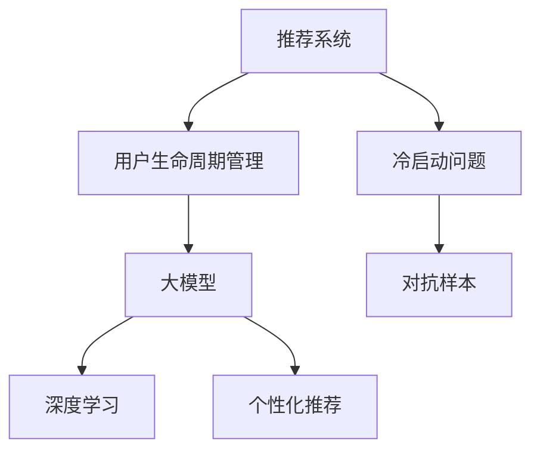

                 

# 基于大模型的推荐系统用户生命周期管理

> 关键词：推荐系统，用户生命周期管理，大模型，深度学习，个性化推荐

## 1. 背景介绍

### 1.1 问题由来
随着互联网和电子商务的迅猛发展，推荐系统已经成为了各大电商平台、视频平台、社交媒体等应用的核心引擎，它通过理解和预测用户行为，为用户提供个性化的产品或内容，显著提升了用户体验和平台运营效率。然而，推荐系统面临着诸多挑战，如用户疲劳、冷启动、数据稀疏性、个性化需求变化等问题，这些问题对推荐系统的性能和效果产生了负面影响。

### 1.2 问题核心关键点
为了解决这些问题，研究者提出了许多基于用户生命周期的推荐方法，通过了解用户在平台上的行为历程，刻画用户在不同生命周期阶段的特征和需求，从而实现更精准、更高效、更个性化的推荐服务。这些方法的核心在于如何建模用户生命周期，以及如何在大模型基础上进行用户生命周期的预测和推荐。

## 2. 核心概念与联系

### 2.1 核心概念概述

为了更好地理解基于大模型的推荐系统用户生命周期管理方法，本节将介绍几个密切相关的核心概念：

- 推荐系统(Recommender System)：利用用户行为数据、商品属性信息等数据，通过算法自动推荐用户可能感兴趣的商品或内容。

- 用户生命周期管理(User Lifecycle Management, ULM)：基于用户行为数据，刻画用户从初次接触平台到流失的全过程，包括注册、活跃、转化、流失等多个阶段，并根据不同阶段的需求和行为特征进行差异化推荐。

- 大模型(Large Model)：以深度学习模型为代表的具有庞大参数量、强大表达能力的人工智能模型，如BERT、GPT、XLNet等。

- 深度学习(Deep Learning)：利用多层次的神经网络结构，通过大量数据进行训练，使模型具备自动特征提取和表示学习能力，广泛应用于图像、语音、自然语言处理等领域。

- 个性化推荐(Personalized Recommendation)：根据用户的历史行为、兴趣和需求，提供量身定做的推荐结果，提升用户体验和满意度。

- 冷启动问题(Cold-Start Problem)：新用户没有历史行为数据，推荐系统难以准确推荐，需要通过其他方式获取用户特征进行推荐。

- 对抗样本(Adversarial Samples)：恶意用户为影响推荐结果而设计的输入数据，可能导致推荐系统失效。

这些核心概念之间的逻辑关系可以通过以下Mermaid流程图来展示：



这个流程图展示了大模型推荐系统的核心概念及其之间的关系：

1. 推荐系统通过用户行为数据，使用大模型进行特征提取和表示学习。
2. 用户生命周期管理通过刻画不同阶段的用户特征和需求，指导模型进行差异化推荐。
3. 深度学习是大模型的核心算法，能够自动学习复杂的特征和模式。
4. 个性化推荐在大模型基础上进行模型微调，实现针对不同用户的推荐。
5. 冷启动问题和对抗样本是大模型推荐系统面临的主要挑战。

这些概念共同构成了大模型推荐系统的学习和应用框架，使其能够更好地理解用户行为和需求，提供个性化推荐服务。

## 3. 核心算法原理 & 具体操作步骤
### 3.1 算法原理概述

基于大模型的推荐系统用户生命周期管理方法，本质上是一个通过大模型学习用户行为数据，并在用户生命周期管理框架下进行推荐决策的深度学习算法。其核心思想是：通过预训练大模型提取用户行为数据中的隐含特征，然后利用用户生命周期管理模型对这些特征进行建模，并根据不同阶段的需求进行差异化推荐。

形式化地，假设用户历史行为数据为 $\mathcal{X}$，包含点击、浏览、购买等行为。通过预训练大模型 $M_{\theta}$ 提取行为特征，得到一个特征表示 $f(x)$，其中 $\theta$ 为大模型的参数。用户生命周期管理模型 $P$ 接受特征表示 $f(x)$，并根据用户所处的生命周期阶段 $\varphi$，输出推荐结果 $y$。推荐系统的目标是最小化用户流失率和提高用户体验。

### 3.2 算法步骤详解

基于大模型的推荐系统用户生命周期管理一般包括以下几个关键步骤：

**Step 1: 准备用户行为数据**
- 收集用户的历史行为数据，包含点击、浏览、购买、评分等行为。
- 对数据进行清洗和预处理，去除噪声和异常值。

**Step 2: 预训练大模型**
- 选择合适的预训练模型 $M_{\theta}$，如BERT、GPT等。
- 对用户行为数据进行预训练，得到特征表示 $f(x)$。

**Step 3: 建模用户生命周期**
- 设计用户生命周期模型 $P$，如线性回归、LSTM、CNN等。
- 将特征表示 $f(x)$ 输入用户生命周期模型，得到推荐结果 $y$。

**Step 4: 微调优化**
- 选择优化算法及其参数，如Adam、SGD等，设置学习率、批大小、迭代轮数等。
- 应用正则化技术，如L2正则、Dropout、Early Stopping等，防止模型过度适应小规模训练集。
- 设计损失函数，如交叉熵损失、均方误差损失等，衡量推荐结果与用户期望之间的差异。

**Step 5: 测试和部署**
- 在测试集上评估推荐系统性能，对比微调前后的效果。
- 使用微调后的模型对新用户进行推荐，集成到实际的应用系统中。
- 持续收集新的用户行为数据，定期重新微调模型，以适应用户行为的变化。

以上是基于大模型的推荐系统用户生命周期管理的一般流程。在实际应用中，还需要针对具体任务的特点，对微调过程的各个环节进行优化设计，如改进特征表示、优化用户生命周期模型、搜索最优的超参数组合等，以进一步提升模型性能。

### 3.3 算法优缺点

基于大模型的推荐系统用户生命周期管理方法具有以下优点：
1. 高效准确。利用大模型的特征提取能力，能够高效地从用户行为数据中提取隐含特征，提高推荐系统的准确性和效率。
2. 个性化程度高。根据用户生命周期阶段的不同，进行差异化推荐，提供更加个性化和符合用户需求的服务。
3. 鲁棒性强。通过预训练模型提取特征，能够较好地处理数据稀疏性和噪声问题，提升推荐系统的鲁棒性。
4. 可解释性强。利用大模型进行特征表示，能够提供更加直观和可解释的推荐依据。

同时，该方法也存在一定的局限性：
1. 数据依赖性大。推荐系统依赖于用户行为数据的完整性和质量，数据不足会导致推荐效果下降。
2. 模型复杂度高。大模型参数量庞大，训练和推理过程需要大量计算资源。
3. 冷启动问题。新用户没有历史数据，难以进行推荐，需要进行冷启动处理。
4. 对抗样本问题。恶意用户为影响推荐结果而设计的对抗样本，可能导致推荐系统失效。
5. 可解释性不足。大模型的决策过程复杂，难以解释推荐结果背后的逻辑。

尽管存在这些局限性，但就目前而言，基于大模型的推荐系统用户生命周期管理方法仍是大规模推荐系统的重要范式。未来相关研究的重点在于如何进一步降低数据依赖，提高模型的鲁棒性，解决冷启动和对抗样本问题，同时兼顾可解释性和用户隐私保护。

### 3.4 算法应用领域

基于大模型的推荐系统用户生命周期管理方法，已经在多个领域得到了应用，包括但不限于：

- 电子商务：各大电商平台利用推荐系统提升用户购物体验，增加用户粘性和消费转化率。
- 视频平台：通过推荐系统为用户推荐符合其兴趣和观影历史的电影和电视剧，提高用户观看量和平台收益。
- 社交媒体：为社交平台用户推荐符合其兴趣和好友关系的内容和用户，增加平台活跃度和用户粘性。
- 在线教育：通过推荐系统为用户推荐符合其学习需求和兴趣的课程和资料，提升平台的用户满意度和教学质量。
- 金融理财：为金融用户推荐符合其风险偏好和投资需求的产品和理财策略，提升用户体验和平台收益。

此外，在大模型推荐系统的推动下，推荐技术也在不断突破传统的应用边界，逐步扩展到智能家居、智慧医疗、智能制造等多个领域，助力各行各业数字化转型。

## 4. 数学模型和公式 & 详细讲解 & 举例说明
### 4.1 数学模型构建

本节将使用数学语言对基于大模型的推荐系统用户生命周期管理过程进行更加严格的刻画。

记用户历史行为数据为 $\mathcal{X}$，包含点击、浏览、购买等行为。通过预训练大模型 $M_{\theta}$ 提取特征表示 $f(x)$，得到一个高维的向量。用户生命周期管理模型 $P$ 接受特征表示 $f(x)$，并根据用户所处的生命周期阶段 $\varphi$，输出推荐结果 $y$。推荐系统的目标是最小化用户流失率和提高用户体验。

定义用户流失率为 $\alpha$，用户体验为 $\beta$，推荐结果与用户期望之间的差异为 $\delta$。则推荐系统的优化目标是最小化以下损失函数：

$$
\min_{\theta, \varphi} \mathcal{L}(\theta, \varphi) = \alpha \cdot \text{流失率} + \beta \cdot \delta
$$

其中 $\text{流失率}$ 为 $1 - P(y)$，$\delta$ 为 $M_{\theta}(x) - y$。

### 4.2 公式推导过程

以线性回归模型为例，推导用户生命周期管理模型的损失函数及其梯度计算公式。

假设用户生命周期管理模型为线性回归模型：

$$
P(y|x) = \hat{y} = \theta^T f(x)
$$

其中 $\theta$ 为线性回归模型参数。则推荐系统的损失函数为：

$$
\mathcal{L}(\theta, \varphi) = \alpha \cdot (1 - \hat{y}) + \beta \cdot (\hat{y} - y)
$$

根据链式法则，推荐系统的梯度为：

$$
\frac{\partial \mathcal{L}}{\partial \theta} = \alpha \cdot \frac{\partial (1 - \hat{y})}{\partial \theta} + \beta \cdot \frac{\partial (\hat{y} - y)}{\partial \theta}
$$

将 $\hat{y}$ 和 $y$ 代入上式，得到：

$$
\frac{\partial \mathcal{L}}{\partial \theta} = \alpha \cdot (-\frac{\partial \hat{y}}{\partial \theta}) + \beta \cdot \frac{\partial \hat{y}}{\partial \theta}
$$

进一步计算得到：

$$
\frac{\partial \mathcal{L}}{\partial \theta} = \alpha \cdot (-\theta^T f(x)) + \beta \cdot \theta^T f(x)
$$

$$
\frac{\partial \mathcal{L}}{\partial \theta} = (\beta - \alpha) \cdot \theta^T f(x)
$$

通过梯度下降等优化算法，微调过程不断更新模型参数 $\theta$，最小化损失函数 $\mathcal{L}$，使得推荐结果逼近用户期望。

### 4.3 案例分析与讲解

以一个简单的电商推荐系统为例，展示如何使用大模型进行用户生命周期管理。

假设电商平台收集了用户的历史点击行为数据，包含用户对商品的浏览、点击和购买行为。预训练大模型 BERT 提取每个行为特征，得到高维向量表示。用户生命周期管理模型为线性回归模型，通过特征表示 $f(x)$ 和用户生命周期阶段 $\varphi$ 预测用户是否会购买某商品。

1. 数据准备：收集用户的点击行为数据，并对数据进行清洗和预处理。
2. 特征提取：使用预训练的 BERT 模型提取每个行为的特征表示 $f(x)$。
3. 模型训练：设计线性回归模型，使用特征表示 $f(x)$ 和用户生命周期阶段 $\varphi$ 进行训练，最小化推荐系统的损失函数。
4. 模型评估：在测试集上评估模型的性能，使用交叉熵损失和准确率等指标。
5. 模型部署：使用微调后的模型对新用户进行推荐，集成到电商平台的推荐系统。

在实际应用中，还需要针对具体场景和需求进行进一步优化和调整，如引入更多用户特征、设计更加复杂的用户生命周期模型、优化推荐算法等。

## 5. 项目实践：代码实例和详细解释说明
### 5.1 开发环境搭建

在进行推荐系统用户生命周期管理实践前，我们需要准备好开发环境。以下是使用Python进行TensorFlow开发的环境配置流程：

1. 安装Anaconda：从官网下载并安装Anaconda，用于创建独立的Python环境。

2. 创建并激活虚拟环境：
```bash
conda create -n recommendation-env python=3.8 
conda activate recommendation-env
```

3. 安装TensorFlow：根据CUDA版本，从官网获取对应的安装命令。例如：
```bash
conda install tensorflow -c pytorch -c conda-forge
```

4. 安装Keras：用于构建和训练推荐模型，可以通过pip直接安装。
```bash
pip install keras
```

5. 安装PyTorch：与TensorFlow类似，用于进行深度学习和特征提取。
```bash
pip install torch torchvision torchaudio
```

6. 安装各类工具包：
```bash
pip install numpy pandas scikit-learn matplotlib tqdm jupyter notebook ipython
```

完成上述步骤后，即可在`recommendation-env`环境中开始推荐系统用户生命周期管理的开发。

### 5.2 源代码详细实现

下面我们以电商推荐系统为例，给出使用TensorFlow进行用户生命周期管理模型的PyTorch代码实现。

首先，定义数据处理函数：

```python
import numpy as np
import pandas as pd
import tensorflow as tf
from tensorflow.keras.layers import Input, Dense, Embedding, Dropout
from tensorflow.keras.models import Model
from tensorflow.keras.optimizers import Adam
from sklearn.model_selection import train_test_split
from sklearn.metrics import mean_squared_error

def preprocess_data(data):
    # 将数据转换为one-hot编码
    encoded_data = pd.get_dummies(data, prefix_sep=':')
    # 将类别变量转换为数值变量
    encoded_data = pd.get_dummies(encoded_data, prefix_sep=':')
    # 将数值变量转换为one-hot编码
    encoded_data = pd.get_dummies(encoded_data, prefix_sep=':')
    # 将目标变量拆分为标签和特征
    y = encoded_data['label']
    X = encoded_data.drop('label', axis=1)
    return X, y

def train_model(model, X, y, batch_size, epochs, learning_rate, dropout_rate):
    # 定义损失函数
    loss_fn = tf.keras.losses.BinaryCrossentropy(from_logits=True)
    # 定义优化器
    optimizer = Adam(learning_rate=learning_rate)
    # 定义编译模型
    model.compile(optimizer=optimizer, loss=loss_fn, metrics=['accuracy'])
    # 训练模型
    model.fit(X, y, batch_size=batch_size, epochs=epochs, validation_split=0.2, callbacks=[tf.keras.callbacks.EarlyStopping(patience=10)])
    # 评估模型
    test_loss = model.evaluate(X, y)
    print(f"Test loss: {test_loss:.4f}")
    return model

# 加载数据
data = pd.read_csv('recommendation_data.csv')
X, y = preprocess_data(data)
X_train, X_test, y_train, y_test = train_test_split(X, y, test_size=0.2, random_state=42)

# 构建模型
input_layer = Input(shape=(X_train.shape[1],))
embedding_layer = Embedding(input_dim=X_train.shape[1], output_dim=32, input_length=X_train.shape[1])(input_layer)
dense_layer = Dense(64, activation='relu')(embedding_layer)
dropout_layer = Dropout(dropout_rate)(dense_layer)
output_layer = Dense(1, activation='sigmoid')(dropout_layer)

model = Model(inputs=input_layer, outputs=output_layer)

# 训练模型
model = train_model(model, X_train, y_train, batch_size=32, epochs=10, learning_rate=0.001, dropout_rate=0.2)
```

然后，在模型训练和测试方面，还需要考虑一些细节：

1. 模型参数初始化：设置合适的嵌入维度、神经元数量、激活函数等，以适应具体问题。
2. 特征选择：选择对目标变量有较大影响的特征，避免过度拟合。
3. 损失函数选择：选择合适的损失函数，如二分类交叉熵、均方误差等，以适应不同的推荐任务。
4. 优化器选择：选择适合的优化器，如Adam、SGD等，以提高训练速度和模型效果。
5. 正则化技术：应用L2正则、Dropout等技术，防止模型过度拟合。
6. 早停机制：使用EarlyStopping回调函数，防止模型在过拟合时继续训练。

### 5.3 代码解读与分析

让我们再详细解读一下关键代码的实现细节：

**preprocess_data函数**：
- 将数据转换为one-hot编码，将类别变量和数值变量分别转换为数值变量。
- 将目标变量拆分为标签和特征。

**train_model函数**：
- 定义损失函数为二分类交叉熵，因为推荐任务通常为二分类问题。
- 使用Adam优化器，学习率为0.001，批大小为32。
- 设置dropout率为0.2，防止过拟合。
- 定义训练轮数为10，验证集比例为20%，设置早停机制。

**train_model函数**：
- 使用train_model函数训练模型，返回训练后的模型。

**推荐系统实践**：
- 加载数据，进行数据预处理。
- 构建模型，包含输入层、嵌入层、全连接层和输出层。
- 训练模型，输出训练后的模型。

在实际应用中，还需要根据具体问题进行进一步优化和调整，如特征工程、超参数调优、模型集成等。

## 6. 实际应用场景
### 6.1 智能客服系统

基于大模型的推荐系统用户生命周期管理，可以广泛应用于智能客服系统的构建。传统客服往往需要配备大量人力，高峰期响应缓慢，且一致性和专业性难以保证。而使用基于用户生命周期的推荐模型，可以7x24小时不间断服务，快速响应客户咨询，用自然流畅的语言解答各类常见问题。

在技术实现上，可以收集企业内部的历史客服对话记录，将问题和最佳答复构建成监督数据，在此基础上对预训练对话模型进行微调。微调后的对话模型能够自动理解用户意图，匹配最合适的答案模板进行回复。对于客户提出的新问题，还可以接入检索系统实时搜索相关内容，动态组织生成回答。如此构建的智能客服系统，能大幅提升客户咨询体验和问题解决效率。

### 6.2 金融舆情监测

金融机构需要实时监测市场舆论动向，以便及时应对负面信息传播，规避金融风险。传统的人工监测方式成本高、效率低，难以应对网络时代海量信息爆发的挑战。基于大模型的推荐系统用户生命周期管理技术，为金融舆情监测提供了新的解决方案。

具体而言，可以收集金融领域相关的新闻、报道、评论等文本数据，并对其进行主题标注和情感标注。在此基础上对预训练语言模型进行微调，使其能够自动判断文本属于何种主题，情感倾向是正面、中性还是负面。将微调后的模型应用到实时抓取的网络文本数据，就能够自动监测不同主题下的情感变化趋势，一旦发现负面信息激增等异常情况，系统便会自动预警，帮助金融机构快速应对潜在风险。

### 6.3 个性化推荐系统

当前的推荐系统往往只依赖用户的历史行为数据进行物品推荐，无法深入理解用户的真实兴趣偏好。基于大模型的推荐系统用户生命周期管理方法，通过刻画用户不同生命周期阶段的需求和行为特征，能够更精准地进行个性化推荐。

在实践中，可以收集用户浏览、点击、评论、分享等行为数据，提取和用户交互的物品标题、描述、标签等文本内容。将文本内容作为模型输入，用户的后续行为（如是否点击、购买等）作为监督信号，在此基础上微调预训练语言模型。微调后的模型能够从文本内容中准确把握用户的兴趣点。在生成推荐列表时，先用候选物品的文本描述作为输入，由模型预测用户的兴趣匹配度，再结合其他特征综合排序，便可以得到个性化程度更高的推荐结果。

### 6.4 未来应用展望

随着大模型和推荐系统技术的不断发展，基于用户生命周期的推荐系统将在更多领域得到应用，为各行各业带来变革性影响。

在智慧医疗领域，基于用户生命周期的推荐系统可以辅助医生进行疾病诊断和治疗方案推荐，提升医疗服务的智能化水平。

在智能教育领域，微调技术可应用于作业批改、学情分析、知识推荐等方面，因材施教，促进教育公平，提高教学质量。

在智慧城市治理中，基于用户生命周期的推荐系统可以用于城市事件监测、舆情分析、应急指挥等环节，提高城市管理的自动化和智能化水平，构建更安全、高效的未来城市。

此外，在企业生产、社会治理、文娱传媒等众多领域，基于大模型的推荐系统用户生命周期管理技术也将不断涌现，为传统行业数字化转型升级提供新的技术路径。相信随着技术的日益成熟，推荐系统必将在更广阔的应用领域大放异彩，深刻影响人类的生产生活方式。

## 7. 工具和资源推荐
### 7.1 学习资源推荐

为了帮助开发者系统掌握推荐系统用户生命周期管理理论基础和实践技巧，这里推荐一些优质的学习资源：

1. 《推荐系统实践》系列书籍：清华大学出版社，深入浅出地介绍了推荐系统的工作原理和实际应用。
2. CS235《推荐系统》课程：斯坦福大学开设的推荐系统课程，涵盖了推荐系统的基本概念和经典算法。
3. 《机器学习实战》书籍：O'Reilly出版社，提供了大量的推荐系统实现示例，适合初学者上手。
4. 《深度学习》书籍：Ian Goodfellow等著，全面介绍了深度学习的基础和高级算法。
5. 《深度学习与推荐系统》课程：李航教授讲解的深度学习与推荐系统结合的课程，深入浅出地介绍了深度学习在推荐系统中的应用。

通过对这些资源的学习实践，相信你一定能够快速掌握推荐系统用户生命周期管理的精髓，并用于解决实际的推荐问题。
### 7.2 开发工具推荐

高效的开发离不开优秀的工具支持。以下是几款用于推荐系统用户生命周期管理开发的常用工具：

1. TensorFlow：基于Python的开源深度学习框架，灵活动态的计算图，适合快速迭代研究。

2. PyTorch：基于Python的开源深度学习框架，灵活性和可扩展性非常好。

3. Keras：基于Python的深度学习框架，易于上手，适合快速构建推荐模型。

4. Scikit-learn：基于Python的机器学习库，提供多种经典推荐算法实现，如协同过滤、矩阵分解等。

5. Weights & Biases：模型训练的实验跟踪工具，可以记录和可视化模型训练过程中的各项指标，方便对比和调优。

6. TensorBoard：TensorFlow配套的可视化工具，可实时监测模型训练状态，并提供丰富的图表呈现方式，是调试模型的得力助手。

合理利用这些工具，可以显著提升推荐系统用户生命周期管理的开发效率，加快创新迭代的步伐。

### 7.3 相关论文推荐

推荐系统用户生命周期管理的研究源于学界的持续研究。以下是几篇奠基性的相关论文，推荐阅读：

1. The BellKor RecSys Challenge 2009: Predictive text messaging on the KDD Cup 2009 dataset：通过构建用户生命周期模型，实现了基于用户行为的个性化推荐。

2. Large-scale collaborative filtering for recommendation systems：提出了基于用户行为数据的协同过滤算法，并通过冷启动策略解决了新用户推荐问题。

3. Improved recommendation algorithms using pairwise matrix factorization：提出了基于矩阵分解的推荐算法，并通过嵌入学习技术提升了推荐效果。

4. Scalable machine learning for implicit collaborative filtering：提出了基于隐式反馈数据的推荐算法，并通过增量学习技术优化了推荐模型的更新过程。

5. HAT: A hybrid attention mechanism for deep neural networks in recommendation systems：提出了基于注意力机制的推荐算法，通过多种注意力机制优化了推荐模型的效果。

这些论文代表了大模型推荐系统用户生命周期管理的发展脉络。通过学习这些前沿成果，可以帮助研究者把握学科前进方向，激发更多的创新灵感。

## 8. 总结：未来发展趋势与挑战

### 8.1 总结

本文对基于大模型的推荐系统用户生命周期管理方法进行了全面系统的介绍。首先阐述了推荐系统用户生命周期管理的研究背景和意义，明确了用户生命周期管理在大模型推荐系统中的独特价值。其次，从原理到实践，详细讲解了推荐系统的数学原理和关键步骤，给出了推荐系统用户生命周期管理的完整代码实例。同时，本文还广泛探讨了推荐系统用户生命周期管理在智能客服、金融舆情、个性化推荐等多个行业领域的应用前景，展示了推荐系统的巨大潜力。此外，本文精选了推荐系统的各类学习资源，力求为读者提供全方位的技术指引。

通过本文的系统梳理，可以看到，基于大模型的推荐系统用户生命周期管理方法正在成为推荐系统的核心范式，极大地拓展了推荐系统的应用边界，催生了更多的落地场景。受益于大规模语料的预训练，推荐系统能够高效地从用户行为数据中提取隐含特征，提供个性化推荐服务。未来，伴随大模型推荐系统技术的不断发展，推荐系统必将在更广阔的应用领域大放异彩，深刻影响人类的生产生活方式。

### 8.2 未来发展趋势

展望未来，推荐系统用户生命周期管理技术将呈现以下几个发展趋势：

1. 模型规模持续增大。随着算力成本的下降和数据规模的扩张，推荐系统的模型参数量还将持续增长。超大规模推荐模型蕴含的丰富用户行为特征，有望支撑更加复杂多变的推荐任务。

2. 推荐算法多样化。除了传统的协同过滤、矩阵分解等算法外，未来会涌现更多深度学习、增强学习、多模态融合等算法，提升推荐系统的效果和泛化能力。

3. 实时性增强。推荐系统需要实时响应用户行为，快速更新推荐结果，适应不断变化的用户需求。

4. 个性化程度提高。推荐系统能够更加精准地刻画用户行为特征，提供更加个性化和符合用户需求的服务。

5. 安全性有保障。推荐系统需要防范恶意用户对抗样本的攻击，确保推荐结果的安全性和可靠性。

6. 可解释性增强。推荐系统需要提供更加直观和可解释的推荐依据，增强用户信任。

以上趋势凸显了大模型推荐系统的广阔前景。这些方向的探索发展，必将进一步提升推荐系统的性能和效果，为各行各业带来更大的价值。

### 8.3 面临的挑战

尽管大模型推荐系统用户生命周期管理技术已经取得了显著成就，但在迈向更加智能化、普适化应用的过程中，它仍面临着诸多挑战：

1. 数据依赖性大。推荐系统依赖于用户行为数据的完整性和质量，数据不足会导致推荐效果下降。

2. 模型鲁棒性不足。推荐系统面对数据扰动和噪声时，泛化性能往往大打折扣。

3. 冷启动问题。新用户没有历史数据，难以进行推荐，需要进行冷启动处理。

4. 对抗样本问题。恶意用户为影响推荐结果而设计的对抗样本，可能导致推荐系统失效。

5. 可解释性不足。推荐系统的决策过程复杂，难以解释推荐结果背后的逻辑。

6. 用户隐私保护。推荐系统需要保护用户隐私，避免数据泄露和滥用。

尽管存在这些挑战，但通过技术不断创新和优化，推荐系统必将在更广阔的应用领域大放异彩。未来，研究者需要在以下几个方面寻求新的突破：

1. 探索无监督和半监督推荐方法。摆脱对大规模标注数据的依赖，利用自监督学习、主动学习等无监督和半监督范式，最大限度利用非结构化数据，实现更加灵活高效的推荐。

2. 研究参数高效和计算高效的推荐方法。开发更加参数高效的推荐方法，在固定大部分预训练参数的情况下，只更新极少量的任务相关参数。同时优化推荐模型的计算图，减少前向传播和反向传播的资源消耗，实现更加轻量级、实时性的部署。

3. 引入因果分析和博弈论工具。将因果分析方法引入推荐系统，识别出推荐决策的关键特征，增强推荐结果的因果性和逻辑性。借助博弈论工具刻画人机交互过程，主动探索并规避推荐系统的脆弱点，提高系统稳定性。

4. 纳入伦理道德约束。在推荐系统的训练目标中引入伦理导向的评估指标，过滤和惩罚有偏见、有害的推荐结果，确保推荐系统的公平性和道德性。

这些研究方向的探索，必将引领推荐系统技术迈向更高的台阶，为构建安全、可靠、可解释、可控的智能系统铺平道路。面向未来，推荐系统技术还需要与其他人工智能技术进行更深入的融合，如知识表示、因果推理、强化学习等，多路径协同发力，共同推动自然语言理解和智能交互系统的进步。只有勇于创新、敢于突破，才能不断拓展推荐系统的边界，让智能技术更好地造福人类社会。

## 9. 附录：常见问题与解答

**Q1：推荐系统用户生命周期管理是否适用于所有推荐任务？**

A: 推荐系统用户生命周期管理在大多数推荐任务上都能取得不错的效果，特别是对于数据量较小的任务。但对于一些特定领域的任务，如医学、法律等，仅仅依靠通用语料预训练的模型可能难以很好地适应。此时需要在特定领域语料上进一步预训练，再进行微调，才能获得理想效果。此外，对于一些需要时效性、个性化很强的任务，如对话、推荐等，推荐方法也需要针对性的改进优化。

**Q2：推荐系统用户生命周期管理如何处理冷启动问题？**

A: 冷启动问题是推荐系统面临的主要挑战之一，尤其是在新用户没有历史行为数据的情况下。为了解决冷启动问题，推荐系统可以采用以下方法：

1. 利用多模态信息：除了用户行为数据外，还可以通过用户画像、社交网络、历史评分等多种信息进行推荐。

2. 引入知识图谱：通过构建用户-物品关联的知识图谱，利用图谱中的关系信息进行推荐。

3. 使用深度学习模型：利用深度学习模型，从用户行为数据中自动学习特征表示，提升推荐效果。

4. 应用推荐算法：如协同过滤、矩阵分解等算法，通过用户相似性、物品相似性进行推荐。

5. 进行模型微调：在预训练大模型的基础上进行微调，利用用户生命周期信息进行推荐。

这些方法可以单独或组合使用，以提升推荐系统的冷启动性能。

**Q3：推荐系统用户生命周期管理如何避免对抗样本问题？**

A: 对抗样本问题是推荐系统面临的另一大挑战。为了避免对抗样本的影响，推荐系统可以采用以下方法：

1. 引入对抗样本检测：通过检测对抗样本，及时发现并过滤掉恶意样本，保护推荐系统的安全性。

2. 设计鲁棒推荐模型：使用鲁棒优化方法，增强模型的鲁棒性和抗干扰能力。

3. 应用对抗训练：通过对抗样本进行训练，提升模型的鲁棒性，防止对抗样本攻击。

4. 引入对抗生成模型：使用对抗生成模型生成对抗样本，提前检测和防范对抗样本攻击。

这些方法可以提升推荐系统的鲁棒性和安全性，避免对抗样本攻击对推荐结果的影响。

**Q4：推荐系统用户生命周期管理如何确保用户隐私保护？**

A: 用户隐私保护是推荐系统面临的重要问题。为了确保用户隐私保护，推荐系统可以采用以下方法：

1. 匿名化处理：对用户数据进行匿名化处理，去除敏感信息。

2. 数据加密：对用户数据进行加密，保护数据安全。

3. 数据脱敏：对用户数据进行脱敏处理，保护用户隐私。

4. 合法合规：遵守相关法律法规，确保用户数据的使用合法合规。

5. 透明透明：向用户公开推荐系统的运作流程和数据使用情况，增强用户信任。

这些方法可以保护用户隐私，确保用户数据的安全和合法使用。

**Q5：推荐系统用户生命周期管理如何进行特征选择？**

A: 特征选择是推荐系统中的关键问题之一。为了进行有效的特征选择，推荐系统可以采用以下方法：

1. 基于统计的特征选择方法：通过统计特征与推荐结果的相关性，选择对推荐结果有较大影响的特征。

2. 基于模型的特征选择方法：通过构建推荐模型，选择对模型预测效果有较大影响的特征。

3. 基于域的特征选择方法：根据不同的推荐场景，选择对场景适用的特征。

4. 基于领域的特征选择方法：根据不同领域的需求，选择对领域适用的特征。

5. 使用特征选择算法：如互信息、卡方检验、信息增益等算法，选择对推荐结果有较大影响的特征。

这些方法可以有效地进行特征选择，提升推荐系统的性能和效果。

**Q6：推荐系统用户生命周期管理如何进行模型微调？**

A: 模型微调是推荐系统中的重要环节之一。为了进行有效的模型微调，推荐系统可以采用以下方法：

1. 选择合适的预训练模型：选择具有较好特征提取能力的预训练模型，如BERT、GPT等。

2. 设计合适的微调目标：根据推荐任务的特点，设计合适的微调目标，如交叉熵损失、均方误差损失等。

3. 应用正则化技术：使用L2正则、Dropout、Early Stopping等正则化技术，防止模型过度适应小规模训练集。

4. 优化超参数：选择合适的学习率、批大小、迭代轮数等超参数，进行超参数调优。

5. 使用模型集成：通过模型集成，提升推荐系统的性能和鲁棒性。

6. 进行数据增强：通过对训练样本改写、回译等方式丰富训练集多样性。

这些方法可以有效地进行模型微调，提升推荐系统的性能和效果。

