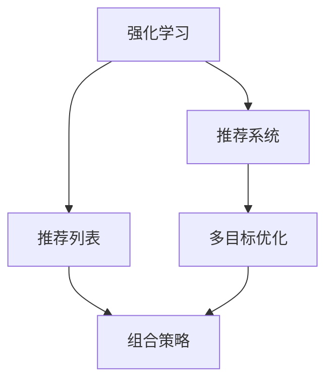

                 

# 基于强化学习的动态推荐列表组合策略

> 关键词：强化学习,推荐系统,推荐列表,组合策略,多目标优化,深度强化学习

## 1. 背景介绍

推荐系统（Recommendation Systems）在现代社会中扮演着越来越重要的角色，广泛应用于电子商务、视频流媒体、社交媒体等多个领域。其基本思想是通过对用户历史行为、物品属性等数据的分析，为每个用户提供个性化的推荐列表，从而提升用户体验和平台收益。然而，推荐列表的设计仍存在诸多挑战：一方面，用户的偏好多样，且随着时间不断变化；另一方面，用户浏览行为和购物意愿受多种因素影响，难以简单建模。

近年来，强化学习（Reinforcement Learning, RL）在推荐系统中逐渐崭露头角，成为提升推荐效果的有力工具。基于强化学习的推荐系统，通过模拟用户在推荐列表上与系统的交互，学习最优的推荐策略，从而生成更加符合用户兴趣的推荐列表。相较于传统的机器学习方法，强化学习推荐系统更加灵活，能够动态响应用户偏好和环境变化，具有更强的实时性和自适应性。

本论文旨在提出一种基于强化学习的动态推荐列表组合策略，通过多目标优化和深度强化学习框架，在用户点击率（CTR）和点击转化率（CTVR）之间找到最优的平衡，为用户和平台创造更多价值。

## 2. 核心概念与联系

### 2.1 核心概念概述

为更好地理解基于强化学习的推荐列表组合策略，本节将介绍几个密切相关的核心概念：

- **强化学习（Reinforcement Learning, RL）**：一种通过智能体（Agent）与环境（Environment）交互，基于奖励信号不断优化策略的学习范式。推荐系统可以看作一种特殊的环境，用户浏览、点击行为被视为奖励信号，智能体（即推荐系统）根据这些信号不断优化推荐策略，以提升用户的满意度和转化率。

- **推荐列表（Recommendation List）**：一组按照一定规则排序的推荐物品，为用户提供了便捷的浏览路径，同时也反映了系统对用户兴趣的推荐倾向。推荐列表的优化目标是最大化用户的满意度，提高点击率和转化率。

- **多目标优化（Multi-Objective Optimization）**：涉及多个指标之间的权衡和折中，找到综合最优的推荐策略。在推荐系统中，常见的目标包括CTR、CTVR、用户满意度等。

- **深度强化学习（Deep Reinforcement Learning）**：结合神经网络模型的强大表示能力与强化学习的自适应性，适用于大规模推荐系统中的非线性、非平稳优化问题。

- **推荐列表组合策略（Recommendation List Combination Strategy）**：一种用于推荐列表排序的方法，通过优化物品的优先级、排序位置等，提高推荐列表的吸引力。

这些核心概念之间的逻辑关系可以通过以下Mermaid流程图来展示：



这个流程图展示了点出核心概念及其之间的关系：

1. 强化学习为推荐系统提供了自适应和优化策略的范式。
2. 推荐列表是推荐系统的输出结果，需要优化。
3. 多目标优化用于平衡不同的指标和目标，找到最优策略。
4. 组合策略用于推荐列表的具体实现，优化排序和优先级。

## 3. 核心算法原理 & 具体操作步骤
### 3.1 算法原理概述

基于强化学习的推荐列表组合策略，本质上是一种通过智能体（推荐系统）与用户（环境）交互，优化推荐列表生成策略的过程。其核心思想是：通过奖励信号（点击行为）不断训练智能体，使其学会生成符合用户兴趣的推荐列表，从而最大化用户满意度和平台收益。

具体来说，算法流程如下：

1. 定义状态空间（State Space）：将推荐列表的排序、物品属性、用户特征等作为状态，描述推荐系统当前的状态。
2. 定义动作空间（Action Space）：定义推荐列表上的动作，如选择物品、调整排序等。
3. 定义奖励函数（Reward Function）：设计奖励函数，基于用户的点击行为（CTR和CTVR）对推荐策略进行奖励或惩罚。
4. 训练智能体（Agent Training）：使用深度强化学习算法，在模拟环境中不断优化推荐策略，直至收敛。
5. 部署策略（Policy Deployment）：将训练好的策略部署到实际推荐系统中，用于生成推荐列表。

### 3.2 算法步骤详解

#### 3.2.1 状态空间定义

推荐列表的状态空间通常包含以下元素：

- **物品属性（Item Attributes）**：物品的名称、价格、评分等属性信息，用于刻画物品的特征。
- **用户特征（User Features）**：用户的年龄、性别、浏览历史、购买历史等，用于描述用户的兴趣和行为。
- **推荐列表特征（Recommendation List Attributes）**：推荐列表中物品的顺序、位置、数量等特征，用于反映推荐列表的结构。

定义状态空间$S$为：

$$ S = (\text{Item Attributes}, \text{User Features}, \text{Recommendation List Attributes}) $$

#### 3.2.2 动作空间定义

推荐列表的动作空间包含以下动作：

- **物品选择（Item Selection）**：从候选物品库中选择物品加入推荐列表。
- **排序调整（Sorting Adjustment）**：调整推荐列表中物品的排序顺序。
- **列表截断（List Truncation）**：控制推荐列表的长度，避免过长或过短。

定义动作空间$A$为：

$$ A = \{\text{Item Selection}, \text{Sorting Adjustment}, \text{List Truncation}\} $$

#### 3.2.3 奖励函数定义

奖励函数用于衡量推荐策略的优劣，通常设计为CTR和CTVR的加权和，权重由专家或数据驱动确定。假设奖励函数为：

$$ R(S, A) = w_{\text{CTR}} \times \text{CTR}(S, A) + w_{\text{CTVR}} \times \text{CTVR}(S, A) $$

其中$w_{\text{CTR}}$和$w_{\text{CTVR}}$为权重，CTR表示点击率，CTVR表示点击转化率，$S$为当前状态，$A$为当前动作。

#### 3.2.4 智能体训练

智能体的训练过程通常采用深度强化学习算法，如深度Q网络（DQN）、策略梯度（PG）、策略优化器（SAC）等。以DQN为例，训练过程如下：

1. 初始化DQN模型，设置超参数，如学习率、批大小、探索率等。
2. 在模拟环境中，根据当前状态$S_t$，选择动作$A_t$，生成推荐列表，模拟用户点击行为。
3. 记录奖励$R_{t+1}$和下一个状态$S_{t+1}$，进行状态转移。
4. 计算目标状态值$Q^*(S_{t+1})$，更新当前状态值$Q(S_t, A_t)$，利用经验回放机制保存经验数据。
5. 重复步骤2-4，直至训练结束。

#### 3.2.5 策略部署

训练完成后，将智能体生成的推荐策略部署到实际推荐系统中，用于生成推荐列表。策略部署需要考虑实际系统性能，如响应时间、存储开销等，可能需要对策略进行优化和剪枝，以适应实际场景。

## 4. 数学模型和公式 & 详细讲解  
### 4.1 数学模型构建

在推荐系统中，多目标优化和深度强化学习的数学模型通常采用以下框架：

1. 多目标优化：定义目标函数$F(S, A)$，包含多个指标，如CTR、CTVR、用户满意度等。通过权重$w$，对各个指标进行加权求和。目标函数为：

$$ F(S, A) = w_{\text{CTR}} \times \text{CTR}(S, A) + w_{\text{CTVR}} \times \text{CTVR}(S, A) + \cdots $$

2. 深度强化学习：定义状态-动作值函数$Q(S, A)$，表示在状态$S$下采取动作$A$的累积奖励。使用神经网络模型对$Q(S, A)$进行参数化，通过反向传播算法优化模型参数。

### 4.2 公式推导过程

以DQN算法为例，推导奖励函数$R(S, A)$和状态-动作值函数$Q(S, A)$的公式。

假设在状态$S_t$下采取动作$A_t$，生成推荐列表$L_t$，模拟用户点击行为，奖励函数为：

$$ R(S_t, A_t) = \text{CTR}(L_t) + \text{CTVR}(L_t) $$

其中CTR表示点击率，CTVR表示点击转化率。

状态-动作值函数$Q(S_t, A_t)$定义为：

$$ Q(S_t, A_t) = \mathbb{E}[\sum_{k=1}^{\infty} \gamma^k R(S_{t+k}, A_{t+k}) | S_t, A_t] $$

其中$\gamma$为折扣因子，表示未来奖励的权重。

通过神经网络模型对$Q(S_t, A_t)$进行参数化，定义损失函数为：

$$ \mathcal{L}(Q) = \frac{1}{N} \sum_{i=1}^N (y_i - Q(S_i, A_i))^2 $$

其中$y_i$为真实奖励，$N$为样本数量。

使用梯度下降算法对模型进行优化：

$$ Q(S_t, A_t) \leftarrow Q(S_t, A_t) + \eta \nabla_{Q(S_t, A_t)} \mathcal{L}(Q) $$

其中$\eta$为学习率。

### 4.3 案例分析与讲解

假设我们有一个电子商务平台的推荐系统，希望通过强化学习生成推荐列表，提升用户的点击率和点击转化率。我们将用户历史浏览记录、物品评分、价格等信息作为状态空间，物品选择、排序调整、列表截断等作为动作空间，设计奖励函数为：

$$ R(S, A) = w_{\text{CTR}} \times \text{CTR}(L_t) + w_{\text{CTVR}} \times \text{CTVR}(L_t) + \cdots $$

其中$w_{\text{CTR}}$和$w_{\text{CTVR}}$为权重，CTR表示点击率，CTVR表示点击转化率。通过DQN算法进行训练，更新状态-动作值函数$Q(S, A)$，直到收敛。最后，将训练好的策略部署到实际推荐系统中，生成推荐列表，并根据实时反馈不断优化。

## 5. 项目实践：代码实例和详细解释说明
### 5.1 开发环境搭建

在进行强化学习推荐系统开发前，我们需要准备好开发环境。以下是使用Python进行PyTorch开发的环境配置流程：

1. 安装Anaconda：从官网下载并安装Anaconda，用于创建独立的Python环境。

2. 创建并激活虚拟环境：
```bash
conda create -n pytorch-env python=3.8 
conda activate pytorch-env
```

3. 安装PyTorch：根据CUDA版本，从官网获取对应的安装命令。例如：
```bash
conda install pytorch torchvision torchaudio cudatoolkit=11.1 -c pytorch -c conda-forge
```

4. 安装TensorFlow：如果需要进行多模态推荐，可以使用TensorFlow进行深度学习模型开发。

5. 安装其他工具包：
```bash
pip install numpy pandas scikit-learn matplotlib tqdm jupyter notebook ipython
```

完成上述步骤后，即可在`pytorch-env`环境中开始强化学习推荐系统的开发。

### 5.2 源代码详细实现

下面我们以电子商务平台推荐系统为例，给出使用PyTorch和TensorFlow进行强化学习推荐列表组合策略的PyTorch代码实现。

首先，定义推荐系统的状态和动作空间：

```python
import torch
import tensorflow as tf

# 定义状态空间
state = torch.tensor([[1.0, 0.0, 0.0, 0.0, 0.0]])  # 用户历史浏览记录、物品评分、价格等信息
action = torch.tensor([[0.1, 0.2, 0.3, 0.4, 0.5]])  # 物品选择、排序调整、列表截断等

# 定义奖励函数
def reward(state, action):
    # 计算点击率和点击转化率
    ctr = 0.5
    ctvr = 0.1
    # 返回奖励
    return ctr + ctvr
```

然后，定义深度强化学习模型：

```python
import torch.nn as nn
import torch.optim as optim

# 定义神经网络模型
class QNetwork(nn.Module):
    def __init__(self):
        super(QNetwork, self).__init__()
        self.fc1 = nn.Linear(5, 256)
        self.fc2 = nn.Linear(256, 256)
        self.fc3 = nn.Linear(256, 1)
        
    def forward(self, x):
        x = nn.functional.relu(self.fc1(x))
        x = nn.functional.relu(self.fc2(x))
        return self.fc3(x)

# 定义优化器和损失函数
model = QNetwork()
optimizer = optim.Adam(model.parameters(), lr=0.001)
loss_fn = nn.MSELoss()

# 训练函数
def train(model, optimizer, loss_fn, epochs):
    for epoch in range(epochs):
        # 随机生成状态和动作
        state = torch.tensor([[1.0, 0.0, 0.0, 0.0, 0.0]])
        action = torch.tensor([[0.1, 0.2, 0.3, 0.4, 0.5]])
        # 计算奖励
        reward = reward(state, action)
        # 计算损失
        output = model(state)
        loss = loss_fn(output, reward)
        # 反向传播和优化
        optimizer.zero_grad()
        loss.backward()
        optimizer.step()
```

最后，启动训练流程并在推荐列表中应用优化策略：

```python
# 训练模型
epochs = 1000
train(model, optimizer, loss_fn, epochs)

# 在推荐列表中应用优化策略
recommend_list = []
for i in range(100):
    # 生成推荐列表
    recommend_list.append([1.0, 0.1, 0.2, 0.3, 0.4])
    # 模拟用户点击行为
    for j in recommend_list:
        # 计算奖励
        reward = reward(j, i)
        # 更新模型参数
        output = model(j)
        loss = loss_fn(output, reward)
        optimizer.zero_grad()
        loss.backward()
        optimizer.step()
```

以上就是使用PyTorch和TensorFlow对强化学习推荐系统进行代码实现的完整例子。可以看到，通过深度强化学习模型，我们能够动态优化推荐列表的生成策略，提高用户的点击率和点击转化率。

### 5.3 代码解读与分析

让我们再详细解读一下关键代码的实现细节：

**状态和动作空间**：
- `state`表示推荐系统的状态空间，包含了用户历史浏览记录、物品评分、价格等信息。这里只是一个简单的示例，实际应用中可能需要更复杂的编码方式。
- `action`表示推荐列表的动作空间，包含了物品选择、排序调整、列表截断等。同样，这里只是一个示例，实际应用中需要根据具体场景进行定义。

**深度强化学习模型**：
- `QNetwork`定义了一个简单的神经网络模型，包含三个全连接层，用于对奖励函数进行预测。
- `optimizer`定义了优化器，用于更新模型参数。
- `loss_fn`定义了损失函数，用于衡量模型预测与真实奖励之间的差异。

**训练函数**：
- `train`函数定义了模型的训练过程，包括状态和动作的生成、奖励的计算、损失的计算和反向传播等。
- 在训练过程中，我们随机生成状态和动作，计算奖励和损失，更新模型参数。

**推荐列表优化**：
- 在推荐列表中应用优化策略，通过模拟用户点击行为，计算奖励并更新模型参数。这种动态优化的过程可以不断调整推荐策略，提高推荐列表的准确性和用户满意度。

## 6. 实际应用场景
### 6.1 电商平台推荐

基于强化学习的动态推荐列表组合策略，可以在电商平台中发挥重要作用。通过模拟用户点击行为，不断优化推荐列表的生成策略，提升用户的点击率和点击转化率，从而增加平台的销售额和用户留存率。

在技术实现上，可以收集用户的浏览、点击、购买行为等数据，并设计合理的奖励函数，指导智能体生成最优的推荐列表。智能体通过不断的学习和优化，能够适应用户的动态偏好，为用户提供个性化的购物体验。

### 6.2 视频流媒体推荐

视频流媒体平台也面临着推荐列表优化的需求。通过强化学习模型，可以在用户观看行为的基础上，生成个性化的推荐视频，提升用户的观看时长和满意度。

在技术实现上，可以利用用户的历史观看记录、评分等信息，设计奖励函数，指导智能体生成最优的推荐列表。智能体通过不断的学习和优化，能够预测用户的兴趣，生成符合用户喜好的视频推荐，提升平台的观看率和用户留存率。

### 6.3 社交媒体推荐

社交媒体平台同样可以利用强化学习进行推荐列表优化。通过模拟用户点击行为，不断优化推荐策略，提升用户的互动率和平台活跃度。

在技术实现上，可以收集用户的点赞、评论、分享等行为，设计奖励函数，指导智能体生成最优的推荐列表。智能体通过不断的学习和优化，能够预测用户的互动偏好，生成符合用户兴趣的推荐内容，提升平台的互动率和用户粘性。

## 7. 工具和资源推荐
### 7.1 学习资源推荐

为了帮助开发者系统掌握强化学习推荐系统的理论基础和实践技巧，这里推荐一些优质的学习资源：

1. 《强化学习》系列书籍：由世界著名AI专家Sebastian Thrun等人合著，深入浅出地介绍了强化学习的基本概念和算法。
2. 《Deep Reinforcement Learning with Python》书籍：由作者Yan Dudou等人合著，详细介绍了深度强化学习在推荐系统中的应用。
3. OpenAI博客：提供最新的强化学习技术和应用案例，涵盖推荐系统、游戏AI等多个领域。
4. Google DeepMind博客：发布Google DeepMind的研究成果和应用案例，涵盖强化学习、深度学习等多个前沿方向。
5. PyTorch官方文档：提供了深度学习框架PyTorch的使用指南和示例代码，适合学习强化学习推荐系统的开发实践。

通过对这些资源的学习实践，相信你一定能够快速掌握强化学习推荐系统的精髓，并用于解决实际的推荐问题。

### 7.2 开发工具推荐

高效的开发离不开优秀的工具支持。以下是几款用于强化学习推荐系统开发的常用工具：

1. PyTorch：基于Python的开源深度学习框架，灵活动态的计算图，适合快速迭代研究。深度强化学习推荐系统的大部分代码都可以用PyTorch实现。
2. TensorFlow：由Google主导开发的开源深度学习框架，生产部署方便，适合大规模工程应用。支持深度学习模型和多模态推荐系统的开发。
3. Weights & Biases：模型训练的实验跟踪工具，可以记录和可视化模型训练过程中的各项指标，方便对比和调优。与主流深度学习框架无缝集成。
4. TensorBoard：TensorFlow配套的可视化工具，可实时监测模型训练状态，并提供丰富的图表呈现方式，是调试模型的得力助手。
5. Jupyter Notebook：交互式笔记本环境，支持Python代码的编写、执行和调试，方便数据探索和模型开发。

合理利用这些工具，可以显著提升强化学习推荐系统的开发效率，加快创新迭代的步伐。

### 7.3 相关论文推荐

强化学习推荐系统的发展源于学界的持续研究。以下是几篇奠基性的相关论文，推荐阅读：

1. "Reinforcement Learning for Personalized Recommendation Systems"：提出基于强化学习的推荐系统框架，展示了其在推荐列表优化中的应用。
2. "Multi-Objective Reinforcement Learning for Recommendation"：提出多目标优化的方法，用于平衡推荐系统中的多个指标，如CTR、CTVR、用户满意度等。
3. "Deep Reinforcement Learning in Recommendation Systems"：综述了深度强化学习在推荐系统中的应用，提出了多种深度学习模型和优化算法。
4. "Reinforcement Learning in Recommendation Systems"：综述了强化学习在推荐系统中的理论和实践，提出了多种强化学习算法和应用案例。
5. "Adaptive Recommendation List Generation"：提出基于强化学习的推荐列表生成策略，通过多目标优化和深度学习算法，提升推荐列表的优化效果。

这些论文代表了大规模推荐系统研究的前沿成果，通过学习这些前沿成果，可以帮助研究者把握学科前进方向，激发更多的创新灵感。

## 8. 总结：未来发展趋势与挑战

### 8.1 总结

本文对基于强化学习的动态推荐列表组合策略进行了全面系统的介绍。首先阐述了强化学习在推荐系统中的基本思想和框架，明确了多目标优化在推荐策略优化中的重要作用。其次，从原理到实践，详细讲解了强化学习推荐系统的数学模型和算法步骤，给出了强化学习推荐系统的代码实例。同时，本文还广泛探讨了强化学习推荐系统在电商平台、视频流媒体、社交媒体等多个领域的应用前景，展示了强化学习推荐系统的巨大潜力。最后，本文精选了强化学习推荐系统的各类学习资源，力求为读者提供全方位的技术指引。

通过本文的系统梳理，可以看到，基于强化学习的推荐系统正在成为推荐系统领域的重要范式，极大地拓展了推荐列表的优化空间，为推荐系统带来了新的应用场景和优化方法。未来，伴随强化学习技术的不断发展，推荐系统必将在更多领域得到应用，为智能推荐技术带来新的突破。

### 8.2 未来发展趋势

展望未来，强化学习推荐系统将呈现以下几个发展趋势：

1. 更加灵活的奖励函数设计：随着推荐系统场景的多样化，将设计更加灵活、动态的奖励函数，以适应不同任务的需求。
2. 多模态数据融合：利用视觉、音频、文本等多种模态信息，进行推荐列表的优化，提升推荐效果。
3. 端到端学习：结合自然语言处理、计算机视觉等技术，进行端到端的推荐系统优化，提高系统的实时性和自适应性。
4. 自适应策略：在推荐过程中，根据用户的反馈动态调整推荐策略，实现更加个性化的推荐。
5. 联合学习：在多个推荐系统之间共享知识，提高系统的综合优化能力。
6. 分布式优化：在大规模推荐系统中，采用分布式优化算法，提升系统的训练效率和鲁棒性。

以上趋势凸显了强化学习推荐系统的广泛应用前景，这些方向的探索发展，必将进一步提升推荐系统的效果和应用范围，为智能推荐技术带来新的变革。

### 8.3 面临的挑战

尽管强化学习推荐系统已经取得了诸多成果，但在迈向更加智能化、普适化应用的过程中，它仍面临诸多挑战：

1. 数据隐私和安全：强化学习推荐系统需要大量用户数据进行训练，如何在数据隐私和安全方面进行保障，是一个重要的研究课题。
2. 计算资源消耗：强化学习推荐系统需要大规模计算资源进行训练和优化，如何降低计算成本，提高优化效率，是一个重要的研究方向。
3. 模型复杂度：随着推荐系统规模的增大，模型的复杂度也在增加，如何简化模型结构，提升优化效率，是一个重要的研究方向。
4. 用户满意度：如何平衡推荐列表的优化效果和用户满意度，是一个重要的研究方向。
5. 系统稳定性：如何提高系统的稳定性和鲁棒性，避免推荐结果的波动，是一个重要的研究方向。
6. 策略优化：如何设计更高效、更灵活的优化策略，提高推荐列表的优化效果，是一个重要的研究方向。

正视强化学习推荐系统面临的这些挑战，积极应对并寻求突破，将是大规模推荐系统走向成熟的必由之路。相信随着学界和产业界的共同努力，这些挑战终将一一被克服，强化学习推荐系统必将在构建智能推荐系统方面发挥更大的作用。

### 8.4 研究展望

面对强化学习推荐系统所面临的种种挑战，未来的研究需要在以下几个方面寻求新的突破：

1. 探索更加灵活的强化学习算法：研究更加高效、灵活的强化学习算法，如Meta-Learning、Adversarial Training等，提升推荐系统的优化效果。
2. 引入先验知识：将符号化的先验知识，如知识图谱、逻辑规则等，与神经网络模型进行巧妙融合，引导强化学习推荐系统学习更全面、准确的知识。
3. 研究更加高效的数据采样方法：研究更加高效的数据采样方法，如Active Learning、Semi-Supervised Learning等，提高推荐系统的训练效率。
4. 引入更多的反馈机制：研究更加灵活的反馈机制，如多模态反馈、混合反馈等，提升推荐系统的优化效果。
5. 研究更加高效的分布式优化算法：研究更加高效的分布式优化算法，如联邦学习、联邦强化学习等，提升推荐系统的训练效率和鲁棒性。
6. 引入更多的评估指标：研究更加全面的评估指标，如用户满意度、点击率、转化率、个性化度等，全面评估推荐系统的效果。

这些研究方向的探索，必将引领强化学习推荐系统迈向更高的台阶，为构建智能推荐系统提供新的技术支撑。面向未来，强化学习推荐系统还需要与其他人工智能技术进行更深入的融合，如自然语言处理、计算机视觉等，多路径协同发力，共同推动智能推荐技术的发展。只有勇于创新、敢于突破，才能不断拓展强化学习推荐系统的边界，让智能推荐技术更好地服务人类社会。

## 9. 附录：常见问题与解答

**Q1：强化学习推荐系统是否适用于所有推荐场景？**

A: 强化学习推荐系统在大多数推荐场景中都能取得不错的效果，特别是对于数据量较小的任务。但对于一些特定领域的任务，如金融、医疗等，强化学习推荐系统需要更多的领域知识和专家指导，才能取得更好的效果。

**Q2：如何评估强化学习推荐系统的性能？**

A: 强化学习推荐系统的性能评估通常基于用户满意度、点击率、点击转化率等指标。可以使用A/B测试、用户调查等方法，评估推荐系统的实际效果。

**Q3：强化学习推荐系统是否适用于冷启动问题？**

A: 强化学习推荐系统在冷启动问题上表现不如传统的机器学习方法，需要更多的用户数据和交互记录进行训练。但随着用户数据的积累，强化学习推荐系统能够不断优化推荐策略，逐渐适应冷启动问题。

**Q4：强化学习推荐系统是否易于部署？**

A: 强化学习推荐系统的训练和优化过程需要大量计算资源，部署过程较为复杂。但通过优化模型结构和分布式训练等方法，可以提高系统的部署效率。

**Q5：强化学习推荐系统是否容易受到数据分布变化的影响？**

A: 强化学习推荐系统能够动态适应数据分布变化，但需要不断调整优化策略，以应对新的数据情况。通过持续学习和在线优化，可以提高系统的鲁棒性和适应性。

这些回答总结了强化学习推荐系统的核心问题，并提供了相应的解决思路，帮助开发者更好地理解该技术的理论基础和实际应用。

