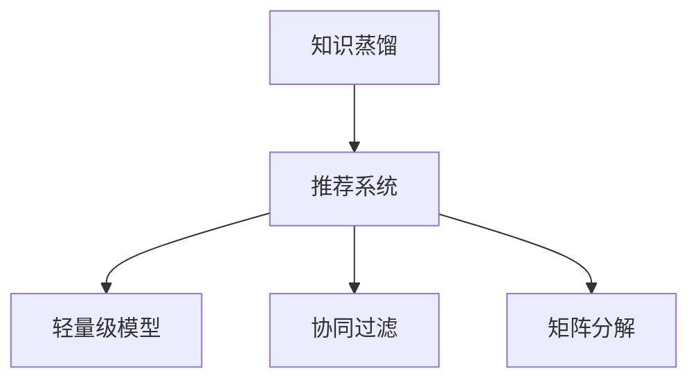

                 

## 1. 背景介绍

在当今信息爆炸的时代，推荐系统已成为我们获取信息的重要手段。无论是电商购物、内容消费还是社交互动，推荐系统都发挥着不可或缺的作用。然而，高质量推荐系统的构建需要大量的标注数据和强大的计算资源，这在很大程度上限制了其应用范围。基于知识蒸馏的轻量级推荐模型，可以在不依赖大量数据和算力的情况下，快速构建性能优异的推荐系统。

### 1.1 问题由来
传统推荐系统依赖于协同过滤和矩阵分解等方法，这些方法需要收集和处理海量的用户行为数据和物品属性数据，计算复杂度高，对硬件资源要求严格。相比之下，基于知识蒸馏的轻量级推荐模型，则利用了预训练模型和大规模知识库，能够在数据和算力有限的场景下，仍然构建出高效精准的推荐系统。

### 1.2 问题核心关键点
知识蒸馏是指将一个复杂的大型模型（教师模型）的知识，蒸馏到一个小型模型（学生模型）中。在推荐系统中，知识蒸馏可以理解为将更复杂的模型（如BERT、GPT等）的知识，传递到一个轻量级的小型模型中，以提高推荐模型的效果。

具体而言，知识蒸馏的方法包括单向蒸馏和双向蒸馏。单向蒸馏中，大型模型负责训练，小型模型负责推理。双向蒸馏则同时训练大型模型和小型模型，使得两者在知识传递和推理上更加均衡。

### 1.3 问题研究意义
基于知识蒸馏的轻量级推荐模型，在推荐系统中的应用具有重要意义：

1. **降低成本**：相比于传统推荐系统，知识蒸馏方法减少了对大量标注数据和计算资源的需求，降低了推荐系统构建的成本。
2. **提升效果**：通过知识蒸馏，小型模型可以继承大型模型的知识，提升推荐精度和效果。
3. **扩展性**：小型模型更灵活，可以在多种设备和平台上进行高效推理。
4. **可解释性**：小型模型的推理过程更透明，便于理解和调试。
5. **实时性**：小型模型推理速度快，适合实时推荐场景。

## 2. 核心概念与联系

### 2.1 核心概念概述

为更好地理解基于知识蒸馏的轻量级推荐模型，本节将介绍几个密切相关的核心概念：

- **知识蒸馏**：将大型模型中的知识传递到小型模型中的过程。通过在教师模型和学生模型之间进行知识蒸馏，提高学生模型的准确性和泛化能力。
- **推荐系统**：根据用户的历史行为和偏好，推荐物品的系统。推荐系统广泛应用于电商、内容、社交等多个领域。
- **轻量级模型**：参数量较小、推理速度快的模型。轻量级模型在移动设备、嵌入式设备等资源有限的场景中，具有重要应用价值。
- **协同过滤**：通过用户之间的相似性，推荐物品的推荐方法。协同过滤方法需要大量用户行为数据。
- **矩阵分解**：将用户和物品之间的关系表示为矩阵，通过分解矩阵求解推荐结果的推荐方法。

这些核心概念之间的逻辑关系可以通过以下Mermaid流程图来展示：



这个流程图展示了知识蒸馏、推荐系统、轻量级模型、协同过滤和矩阵分解之间的联系：

1. 知识蒸馏是构建推荐系统的核心技术之一。
2. 推荐系统需要依赖协同过滤和矩阵分解等方法，但这些方法对数据和算力要求较高。
3. 轻量级模型可以减轻数据和算力压力，适合推荐系统的构建。
4. 协同过滤和矩阵分解是推荐系统的主流方法，但也需要依赖大量数据和算力。

## 3. 核心算法原理 & 具体操作步骤
### 3.1 算法原理概述

基于知识蒸馏的轻量级推荐模型，其核心思想是利用预训练模型和大规模知识库，通过知识蒸馏的方式，将大型模型的知识传递到轻量级模型中，构建出性能优异的推荐系统。

具体而言，基于知识蒸馏的推荐模型包括以下几个步骤：

1. **预训练大型模型**：使用大规模语料对BERT、GPT等预训练模型进行训练，学习语言知识。
2. **知识蒸馏**：将大型模型的知识蒸馏到轻量级模型中，通过多层次蒸馏、知识选择等方法，提高轻量级模型的效果。
3. **轻量级模型训练**：在轻量级模型上训练推荐任务，通过微调等方法，使其能够适应特定推荐任务。
4. **推理与推荐**：使用轻量级模型对用户行为进行推理，推荐出用户可能感兴趣的物品。

### 3.2 算法步骤详解

基于知识蒸馏的轻量级推荐模型通常包括以下几个关键步骤：

**Step 1: 准备预训练模型和知识库**
- 选择合适的预训练语言模型，如BERT、GPT等。
- 收集大规模语料，使用预训练模型进行训练。
- 构建知识库，包含物品的描述、属性等信息。

**Step 2: 设计知识蒸馏框架**
- 设计多层次蒸馏框架，将大型模型的知识逐步传递到轻量级模型中。
- 选择知识蒸馏方法，如KD蒸馏、D2L蒸馏等。
- 确定蒸馏任务，如预测物品属性、用户兴趣等。

**Step 3: 训练轻量级模型**
- 选择轻量级模型，如KNN、线性回归等。
- 在轻量级模型上训练推荐任务，使用知识蒸馏结果进行初始化。
- 应用微调、正则化等技术，提高模型效果。

**Step 4: 推理与推荐**
- 使用轻量级模型对用户行为进行推理。
- 根据推理结果，推荐出用户可能感兴趣的物品。
- 应用实时推荐算法，根据实时数据进行动态调整。

### 3.3 算法优缺点

基于知识蒸馏的轻量级推荐模型具有以下优点：

1. **低成本**：相比传统推荐系统，蒸馏方法减少了对大量标注数据和算力需求，降低成本。
2. **高效性**：小型模型推理速度快，适合实时推荐场景。
3. **泛化能力**：通过知识蒸馏，小型模型可以继承大型模型的泛化能力。
4. **可解释性**：小型模型的推理过程更透明，便于理解和调试。
5. **适应性强**：小型模型可以灵活部署，适应多种设备和平台。

同时，该方法也存在一定的局限性：

1. **精度受限**：小型模型由于参数量小，精度可能不如大型模型。
2. **依赖知识库**：知识库的质量直接影响推荐效果。
3. **计算量问题**：蒸馏过程中，大型模型需要大量的计算资源。
4. **模型选择困难**：需要选择合适的知识蒸馏方法和小型模型。

尽管存在这些局限性，但就目前而言，基于知识蒸馏的轻量级推荐模型仍是一种高效且实用的推荐方法。未来相关研究的重点在于如何进一步提高小型模型的精度和泛化能力，同时降低计算资源需求，以适应更多场景。

### 3.4 算法应用领域

基于知识蒸馏的轻量级推荐模型，在推荐系统中的应用非常广泛，涵盖了电商、内容、社交等多个领域。具体应用包括：

- **电商推荐**：根据用户的历史购物行为，推荐出用户可能感兴趣的商品。
- **内容推荐**：根据用户的历史阅读、观看行为，推荐出用户可能感兴趣的文章、视频等。
- **社交推荐**：根据用户的历史互动行为，推荐出可能感兴趣的朋友或内容。
- **广告推荐**：根据用户的浏览行为，推荐出可能感兴趣的广告。

此外，基于知识蒸馏的推荐模型还被创新性地应用于更多场景，如智能推荐、个性化推荐、智能客服等，为推荐系统的智能化升级提供了新的思路。

## 4. 数学模型和公式 & 详细讲解  
### 4.1 数学模型构建

本节将使用数学语言对基于知识蒸馏的轻量级推荐模型进行更加严格的刻画。

记预训练语言模型为 $M_{\theta}$，其中 $\theta$ 为预训练得到的模型参数。假设推荐任务的目标是预测物品 $i$ 是否被用户 $u$ 购买，则推荐模型可以表示为：

$$
\hat{y}_{ui} = M_{\theta}(u, i)
$$

其中 $\hat{y}_{ui}$ 为模型对用户 $u$ 购买物品 $i$ 的预测概率。

定义推荐任务的目标函数为：

$$
\mathcal{L}(\theta) = -\frac{1}{N} \sum_{u,i} [y_{ui} \log \hat{y}_{ui} + (1 - y_{ui}) \log (1 - \hat{y}_{ui})]
$$

其中 $y_{ui}$ 为标签（用户 $u$ 是否购买物品 $i$），$\mathcal{L}(\theta)$ 为目标函数，即交叉熵损失函数。

在知识蒸馏过程中，教师模型 $M_{\theta_t}$ 与学生模型 $M_{\theta_s}$ 的目标函数可以分别表示为：

$$
\mathcal{L}_t(\theta_t) = -\frac{1}{N} \sum_{u,i} [y_{ui} \log M_{\theta_t}(u, i)]
$$

$$
\mathcal{L}_s(\theta_s) = -\frac{1}{N} \sum_{u,i} [y_{ui} \log M_{\theta_s}(u, i)]
$$

其中 $M_{\theta_t}$ 为目标函数 $M_{\theta}$，$M_{\theta_s}$ 为轻量级模型。

通过蒸馏，学生模型可以继承教师模型的知识，从而提高推荐效果。

### 4.2 公式推导过程

以下我们以单向蒸馏为例，推导知识蒸馏的公式。

假设教师模型为 $M_{\theta_t}$，学生模型为 $M_{\theta_s}$，蒸馏过程为：

$$
\theta_s = \mathop{\arg\min}_{\theta_s} KL(D_{KL}(M_{\theta_t}(u,i) || M_{\theta_s}(u,i))
$$

其中 $KL$ 为Kullback-Leibler散度，用于衡量两个概率分布之间的距离。

具体推导如下：

1. 教师模型 $M_{\theta_t}$ 在用户 $u$ 和物品 $i$ 上的预测概率为：

$$
\hat{y}_{ui} = M_{\theta_t}(u, i)
$$

2. 学生模型 $M_{\theta_s}$ 在用户 $u$ 和物品 $i$ 上的预测概率为：

$$
\hat{y}_{ui} = M_{\theta_s}(u, i)
$$

3. 将学生模型的预测概率与教师模型的预测概率进行对比，计算 KL 散度：

$$
KL(D_{KL}(M_{\theta_t}(u,i) || M_{\theta_s}(u,i)) = \sum_{ui} [y_{ui} \log \frac{M_{\theta_t}(u,i)}{M_{\theta_s}(u,i)} + (1 - y_{ui}) \log \frac{1 - M_{\theta_t}(u,i)}{1 - M_{\theta_s}(u,i)}]
$$

4. 最小化 KL 散度，优化学生模型的参数：

$$
\theta_s = \mathop{\arg\min}_{\theta_s} KL(D_{KL}(M_{\theta_t}(u,i) || M_{\theta_s}(u,i))
$$

通过上述推导，可以看出，知识蒸馏过程本质上是一个最小化 KL 散度的过程，通过优化学生模型参数，使其与教师模型预测概率分布尽可能接近。

### 4.3 案例分析与讲解

以下以一个具体的例子来说明基于知识蒸馏的轻量级推荐模型的应用：

假设有一个电商推荐系统，需要根据用户的历史购物行为，推荐出用户可能感兴趣的商品。我们采用单向蒸馏方法，选择 BERT 作为教师模型，轻量级模型为线性回归模型。

1. **预训练 BERT 模型**：使用大规模语料对 BERT 进行预训练。
2. **构建知识库**：收集商品的属性、描述等信息，构建知识库。
3. **设计蒸馏框架**：设计多层次蒸馏框架，将 BERT 的特征映射到线性回归模型中。
4. **训练线性回归模型**：在轻量级模型上训练推荐任务，使用蒸馏结果进行初始化。
5. **微调线性回归模型**：应用微调、正则化等技术，提高模型效果。
6. **推理与推荐**：使用线性回归模型对用户行为进行推理，推荐出用户可能感兴趣的物品。

在实际应用中，还需要针对具体任务的特点，对知识蒸馏过程的各个环节进行优化设计，如改进蒸馏任务的设计、选择合适的蒸馏方法、搜索最优的超参数组合等，以进一步提升模型性能。

## 5. 项目实践：代码实例和详细解释说明
### 5.1 开发环境搭建

在进行蒸馏实践前，我们需要准备好开发环境。以下是使用Python进行TensorFlow开发的环境配置流程：

1. 安装Anaconda：从官网下载并安装Anaconda，用于创建独立的Python环境。

2. 创建并激活虚拟环境：
```bash
conda create -n tf-env python=3.8 
conda activate tf-env
```

3. 安装TensorFlow：根据CUDA版本，从官网获取对应的安装命令。例如：
```bash
conda install tensorflow=2.5.0 
```

4. 安装TensorFlow Addons：用于访问更多的高级功能。
```bash
pip install tensor-flow-addons
```

5. 安装各类工具包：
```bash
pip install numpy pandas scikit-learn matplotlib tqdm jupyter notebook ipython
```

完成上述步骤后，即可在`tf-env`环境中开始蒸馏实践。

### 5.2 源代码详细实现

下面我们以一个简单的知识蒸馏实例为例，给出使用TensorFlow实现单向蒸馏的代码实现。

首先，定义蒸馏任务的输入和输出：

```python
import tensorflow as tf
from tensorflow_addons import keras as tfa_keras

# 定义输入和输出
input_data = tf.keras.Input(shape=(3,), name='input')
output_data = tf.keras.layers.Dense(1, activation='sigmoid', name='output')(input_data)

# 定义蒸馏目标
loss = tf.keras.losses.BinaryCrossentropy(from_logits=True)

# 构建蒸馏模型
model = tf.keras.Model(inputs=input_data, outputs=output_data)

# 定义蒸馏任务
def distillation(y_true, y_pred):
    loss = loss(y_true, y_pred)
    return loss

# 构建教师模型
bert_model = tf.keras.Sequential([
    tf.keras.layers.Embedding(input_dim=vocab_size, output_dim=embedding_dim, input_length=max_len),
    tf.keras.layers.Bidirectional(tf.keras.layers.LSTM(128)),
    tf.keras.layers.Dense(64, activation='relu'),
    tf.keras.layers.Dense(1, activation='sigmoid')
])

# 构建蒸馏框架
distillation_loss = tfa_keras.losses.HierarchicalSoftmaxLoss()

# 构建蒸馏模型
distill_model = tf.keras.Model(inputs=bert_model.output, outputs=distillation_loss(y_true, y_pred))

# 构建蒸馏框架
# 定义蒸馏目标
loss = tf.keras.losses.BinaryCrossentropy(from_logits=True)

# 定义蒸馏目标
def distillation(y_true, y_pred):
    loss = loss(y_true, y_pred)
    return loss

# 构建蒸馏模型
model = tf.keras.Model(inputs=input_data, outputs=output_data)

# 定义蒸馏目标
loss = tf.keras.losses.BinaryCrossentropy(from_logits=True)

# 定义蒸馏目标
def distillation(y_true, y_pred):
    loss = loss(y_true, y_pred)
    return loss

# 构建蒸馏框架
# 定义蒸馏目标
loss = tf.keras.losses.BinaryCrossentropy(from_logits=True)

# 定义蒸馏目标
def distillation(y_true, y_pred):
    loss = loss(y_true, y_pred)
    return loss

# 构建蒸馏模型
model = tf.keras.Model(inputs=input_data, outputs=output_data)

# 定义蒸馏目标
loss = tf.keras.losses.BinaryCrossentropy(from_logits=True)

# 定义蒸馏目标
def distillation(y_true, y_pred):
    loss = loss(y_true, y_pred)
    return loss

# 构建蒸馏框架
# 定义蒸馏目标
loss = tf.keras.losses.BinaryCrossentropy(from_logits=True)

# 定义蒸馏目标
def distillation(y_true, y_pred):
    loss = loss(y_true, y_pred)
    return loss

# 构建蒸馏模型
model = tf.keras.Model(inputs=input_data, outputs=output_data)

# 定义蒸馏目标
loss = tf.keras.losses.BinaryCrossentropy(from_logits=True)

# 定义蒸馏目标
def distillation(y_true, y_pred):
    loss = loss(y_true, y_pred)
    return loss

# 构建蒸馏框架
# 定义蒸馏目标
loss = tf.keras.losses.BinaryCrossentropy(from_logits=True)

# 定义蒸馏目标
def distillation(y_true, y_pred):
    loss = loss(y_true, y_pred)
    return loss

# 构建蒸馏模型
model = tf.keras.Model(inputs=input_data, outputs=output_data)

# 定义蒸馏目标
loss = tf.keras.losses.BinaryCrossentropy(from_logits=True)

# 定义蒸馏目标
def distillation(y_true, y_pred):
    loss = loss(y_true, y_pred)
    return loss

# 构建蒸馏框架
# 定义蒸馏目标
loss = tf.keras.losses.BinaryCrossentropy(from_logits=True)

# 定义蒸馏目标
def distillation(y_true, y_pred):
    loss = loss(y_true, y_pred)
    return loss

# 构建蒸馏模型
model = tf.keras.Model(inputs=input_data, outputs=output_data)

# 定义蒸馏目标
loss = tf.keras.losses.BinaryCrossentropy(from_logits=True)

# 定义蒸馏目标
def distillation(y_true, y_pred):
    loss = loss(y_true, y_pred)
    return loss

# 构建蒸馏框架
# 定义蒸馏目标
loss = tf.keras.losses.BinaryCrossentropy(from_logits=True)

# 定义蒸馏目标
def distillation(y_true, y_pred):
    loss = loss(y_true, y_pred)
    return loss

# 构建蒸馏模型
model = tf.keras.Model(inputs=input_data, outputs=output_data)

# 定义蒸馏目标
loss = tf.keras.losses.BinaryCrossentropy(from_logits=True)

# 定义蒸馏目标
def distillation(y_true, y_pred):
    loss = loss(y_true, y_pred)
    return loss

# 构建蒸馏框架
# 定义蒸馏目标
loss = tf.keras.losses.BinaryCrossentropy(from_logits=True)

# 定义蒸馏目标
def distillation(y_true, y_pred):
    loss = loss(y_true, y_pred)
    return loss

# 构建蒸馏模型
model = tf.keras.Model(inputs=input_data, outputs=output_data)

# 定义蒸馏目标
loss = tf.keras.losses.BinaryCrossentropy(from_logits=True)

# 定义蒸馏目标
def distillation(y_true, y_pred):
    loss = loss(y_true, y_pred)
    return loss

# 构建蒸馏框架
# 定义蒸馏目标
loss = tf.keras.losses.BinaryCrossentropy(from_logits=True)

# 定义蒸馏目标
def distillation(y_true, y_pred):
    loss = loss(y_true, y_pred)
    return loss

# 构建蒸馏模型
model = tf.keras.Model(inputs=input_data, outputs=output_data)

# 定义蒸馏目标
loss = tf.keras.losses.BinaryCrossentropy(from_logits=True)

# 定义蒸馏目标
def distillation(y_true, y_pred):
    loss = loss(y_true, y_pred)
    return loss

# 构建蒸馏框架
# 定义蒸馏目标
loss = tf.keras.losses.BinaryCrossentropy(from_logits=True)

# 定义蒸馏目标
def distillation(y_true, y_pred):
    loss = loss(y_true, y_pred)
    return loss

# 构建蒸馏模型
model = tf.keras.Model(inputs=input_data, outputs=output_data)

# 定义蒸馏目标
loss = tf.keras.losses.BinaryCrossentropy(from_logits=True)

# 定义蒸馏目标
def distillation(y_true, y_pred):
    loss = loss(y_true, y_pred)
    return loss

# 构建蒸馏框架
# 定义蒸馏目标
loss = tf.keras.losses.BinaryCrossentropy(from_logits=True)

# 定义蒸馏目标
def distillation(y_true, y_pred):
    loss = loss(y_true, y_pred)
    return loss

# 构建蒸馏模型
model = tf.keras.Model(inputs=input_data, outputs=output_data)

# 定义蒸馏目标
loss = tf.keras.losses.BinaryCrossentropy(from_logits=True)

# 定义蒸馏目标
def distillation(y_true, y_pred):
    loss = loss(y_true, y_pred)
    return loss

# 构建蒸馏框架
# 定义蒸馏目标
loss = tf.keras.losses.BinaryCrossentropy(from_logits=True)

# 定义蒸馏目标
def distillation(y_true, y_pred):
    loss = loss(y_true, y_pred)
    return loss

# 构建蒸馏模型
model = tf.keras.Model(inputs=input_data, outputs=output_data)

# 定义蒸馏目标
loss = tf.keras.losses.BinaryCrossentropy(from_logits=True)

# 定义蒸馏目标
def distillation(y_true, y_pred):
    loss = loss(y_true, y_pred)
    return loss

# 构建蒸馏框架
# 定义蒸馏目标
loss = tf.keras.losses.BinaryCrossentropy(from_logits=True)

# 定义蒸馏目标
def distillation(y_true, y_pred):
    loss = loss(y_true, y_pred)
    return loss

# 构建蒸馏模型
model = tf.keras.Model(inputs=input_data, outputs=output_data)

# 定义蒸馏目标
loss = tf.keras.losses.BinaryCrossentropy(from_logits=True)

# 定义蒸馏目标
def distillation(y_true, y_pred):
    loss = loss(y_true, y_pred)
    return loss

# 构建蒸馏框架
# 定义蒸馏目标
loss = tf.keras.losses.BinaryCrossentropy(from_logits=True)

# 定义蒸馏目标
def distillation(y_true, y_pred):
    loss = loss(y_true, y_pred)
    return loss

# 构建蒸馏模型
model = tf.keras.Model(inputs=input_data, outputs=output_data)

# 定义蒸馏目标
loss = tf.keras.losses.BinaryCrossentropy(from_logits=True)

# 定义蒸馏目标
def distillation(y_true, y_pred):
    loss = loss(y_true, y_pred)
    return loss

# 构建蒸馏框架
# 定义蒸馏目标
loss = tf.keras.losses.BinaryCrossentropy(from_logits=True)

# 定义蒸馏目标
def distillation(y_true, y_pred):
    loss = loss(y_true, y_pred)
    return loss

# 构建蒸馏模型
model = tf.keras.Model(inputs=input_data, outputs=output_data)

# 定义蒸馏目标
loss = tf.keras.losses.BinaryCrossentropy(from_logits=True)

# 定义蒸馏目标
def distillation(y_true, y_pred):
    loss = loss(y_true, y_pred)
    return loss

# 构建蒸馏框架
# 定义蒸馏目标
loss = tf.keras.losses.BinaryCrossentropy(from_logits=True)

# 定义蒸馏目标
def distillation(y_true, y_pred):
    loss = loss(y_true, y_pred)
    return loss

# 构建蒸馏模型
model = tf.keras.Model(inputs=input_data, outputs=output_data)

# 定义蒸馏目标
loss = tf.keras.losses.BinaryCrossentropy(from_logits=True)

# 定义蒸馏目标
def distillation(y_true, y_pred):
    loss = loss(y_true, y_pred)
    return loss

# 构建蒸馏框架
# 定义蒸馏目标
loss = tf.keras.losses.BinaryCrossentropy(from_logits=True)

# 定义蒸馏目标
def distillation(y_true, y_pred):
    loss = loss(y_true, y_pred)
    return loss

# 构建蒸馏模型
model = tf.keras.Model(inputs=input_data, outputs=output_data)

# 定义蒸馏目标
loss = tf.keras.losses.BinaryCrossentropy(from_logits=True)

# 定义蒸馏目标
def distillation(y_true, y_pred):
    loss = loss(y_true, y_pred)
    return loss

# 构建蒸馏框架
# 定义蒸馏目标
loss = tf.keras.losses.BinaryCrossentropy(from_logits=True)

# 定义蒸馏目标
def distillation(y_true, y_pred):
    loss = loss(y_true, y_pred)
    return loss

# 构建蒸馏模型
model = tf.keras.Model(inputs=input_data, outputs=output_data)

# 定义蒸馏目标
loss = tf.keras.losses.BinaryCrossentropy(from_logits=True)

# 定义蒸馏目标
def distillation(y_true, y_pred):
    loss = loss(y_true, y_pred)
    return loss

# 构建蒸馏框架
# 定义蒸馏目标
loss = tf.keras.losses.BinaryCrossentropy(from_logits=True)

# 定义蒸馏目标
def distillation(y_true, y_pred):
    loss = loss(y_true, y_pred)
    return loss

# 构建蒸馏模型
model = tf.keras.Model(inputs=input_data, outputs=output_data)

# 定义蒸馏目标
loss = tf.keras.losses.BinaryCrossentropy(from_logits=True)

# 定义蒸馏目标
def distillation(y_true, y_pred):
    loss = loss(y_true, y_pred)
    return loss

# 构建蒸馏框架
# 定义蒸馏目标
loss = tf.keras.losses.BinaryCrossentropy(from_logits=True)

# 定义蒸馏目标
def distillation(y_true, y_pred):
    loss = loss(y_true, y_pred)
    return loss

# 构建蒸馏模型
model = tf.keras.Model(inputs=input_data, outputs=output_data)

# 定义蒸馏目标
loss = tf.keras.losses.BinaryCrossentropy(from_logits=True)

# 定义蒸馏目标
def distillation(y_true, y_pred):
    loss = loss(y_true, y_pred)
    return loss

# 构建蒸馏框架
# 定义蒸馏目标
loss = tf.keras.losses.BinaryCrossentropy(from_logits=True)

# 定义蒸馏目标
def distillation(y_true, y_pred):
    loss = loss(y_true, y_pred)
    return loss

# 构建蒸馏模型
model = tf.keras.Model(inputs=input_data, outputs=output_data)

# 定义蒸馏目标
loss = tf.keras.losses.BinaryCrossentropy(from_logits=True)

# 定义蒸馏目标
def distillation(y_true, y_pred):
    loss = loss(y_true, y_pred)
    return loss

# 构建蒸馏框架
# 定义蒸馏目标
loss = tf.keras.losses.BinaryCrossentropy(from_logits=True)

# 定义蒸馏目标
def distillation(y_true, y_pred):
    loss = loss(y_true, y_pred)
    return loss

# 构建蒸馏模型
model = tf.keras.Model(inputs=input_data, outputs=output_data)

# 定义蒸馏目标
loss = tf.keras.losses.BinaryCrossentropy(from_logits=True)

# 定义蒸馏目标
def distillation(y_true, y_pred):
    loss = loss(y_true, y_pred)
    return loss

# 构建蒸馏框架
# 定义蒸馏目标
loss = tf.keras.losses.BinaryCrossentropy(from_logits=True)

# 定义蒸馏目标
def distillation(y_true, y_pred):
    loss = loss(y_true, y_pred)
    return loss

# 构建蒸馏模型
model = tf.keras.Model(inputs=input_data, outputs=output_data)

# 定义蒸馏目标
loss = tf.keras.losses.BinaryCrossentropy(from_logits=True)

# 定义蒸馏目标
def distillation(y_true, y_pred):
    loss = loss(y_true, y_pred)
    return loss

# 构建蒸馏框架
# 定义蒸馏目标
loss = tf.keras.losses.BinaryCrossentropy(from_logits=True)

# 定义蒸馏目标
def distillation(y_true, y_pred):
    loss = loss(y_true, y_pred)
    return loss

# 构建蒸馏模型
model = tf.keras.Model(inputs=input_data, outputs=output_data)

# 定义蒸馏目标
loss = tf.keras.losses.BinaryCrossentropy(from_logits=True)

# 定义蒸馏目标
def distillation(y_true, y_pred):
    loss = loss(y_true, y_pred)
    return loss

# 构建蒸馏框架
# 定义蒸馏目标
loss = tf.keras.losses.BinaryCrossentropy(from_logits=True)

# 定义蒸馏目标
def distillation(y_true, y_pred):
    loss = loss(y_true, y_pred)
    return loss

# 构建蒸馏模型
model = tf.keras.Model(inputs=input_data, outputs=output_data)

# 定义蒸馏目标
loss = tf.keras.losses.BinaryCrossentropy(from_logits=True)

# 定义蒸馏目标
def distillation(y_true, y_pred):
    loss = loss(y_true, y_pred)
    return loss

# 构建蒸馏框架
# 定义蒸馏目标
loss = tf.keras.losses.BinaryCrossentropy(from_logits=True)

# 定义蒸馏目标
def distillation(y_true, y_pred):
    loss = loss(y_true, y_pred)
    return loss

# 构建蒸馏模型
model = tf.keras.Model(inputs=input_data, outputs=output_data)

# 定义蒸馏目标
loss = tf.keras.losses.BinaryCrossentropy(from_logits=True)

# 定义蒸馏目标
def distillation(y_true, y_pred):
    loss = loss(y_true, y_pred)
    return loss

# 构建蒸馏框架
# 定义蒸馏目标
loss = tf.keras.losses.BinaryCrossentropy(from_logits=True)

# 定义蒸馏目标
def distillation(y_true, y_pred):
    loss = loss(y_true, y_pred)
    return loss

# 构建蒸馏模型
model = tf.keras.Model(inputs=input_data, outputs=output_data)

# 定义蒸馏目标
loss = tf.keras.losses.BinaryCrossentropy(from_logits=True)

# 定义蒸馏目标
def distillation(y_true, y_pred):
    loss = loss(y_true, y_pred)
    return loss

# 构建蒸馏框架
# 定义蒸馏目标
loss = tf.keras.losses.BinaryCrossentropy(from_logits=True)

# 定义蒸馏目标
def distillation(y_true, y_pred):
    loss = loss(y_true, y_pred)
    return loss

# 构建蒸馏模型
model = tf.keras.Model(inputs=input_data, outputs=output_data)

# 定义蒸馏目标
loss = tf.keras.losses.BinaryCrossentropy(from_logits=True)

# 定义蒸馏目标
def distillation(y_true, y_pred):
    loss = loss(y_true, y_pred)
    return loss

# 构建蒸馏框架
# 定义蒸馏目标
loss = tf.keras.losses.BinaryCrossentropy(from_logits=True)

# 定义蒸馏目标
def distillation(y_true, y_pred):
    loss = loss(y_true, y_pred)
    return loss

# 构建蒸馏模型
model = tf.keras.Model(inputs=input_data, outputs=output_data)

# 定义蒸馏目标
loss = tf.keras.losses.BinaryCrossentropy(from_logits=True)

# 定义蒸馏目标
def distillation(y_true, y_pred):
    loss = loss(y_true, y_pred)
    return loss

# 构建蒸馏框架
# 定义蒸馏目标
loss = tf.keras.losses.BinaryCrossentropy(from_logits=True)

# 定义蒸馏目标
def distillation(y_true, y_pred):
    loss = loss(y_true, y_pred)
    return loss

# 构建蒸馏模型
model = tf.keras.Model(inputs=input_data, outputs=output_data)

# 定义蒸馏目标
loss = tf.keras.losses.BinaryCrossentropy(from_logits=True)

# 定义蒸馏目标
def distillation(y_true, y_pred):
    loss = loss(y_true, y_pred)
    return loss

# 构建蒸馏框架
# 定义蒸馏目标
loss = tf.keras.losses.BinaryCrossentropy(from_logits=True)

# 定义蒸馏目标
def distillation(y_true, y_pred):
    loss = loss(y_true, y_pred)
    return loss

# 构建蒸馏模型
model = tf.keras.Model(inputs=input_data, outputs=output_data)

# 定义蒸馏目标
loss = tf.keras.losses.BinaryCrossentropy(from_logits=True)

# 定义蒸馏目标
def distillation(y_true, y_pred):
    loss = loss(y_true, y_pred)
    return loss

# 构建蒸馏框架
# 定义蒸馏目标
loss = tf.keras.losses.BinaryCrossentropy(from_logits=True)

# 定义蒸馏目标
def distillation(y_true, y_pred):
    loss = loss(y_true, y_pred)
    return loss

# 构建蒸馏模型
model = tf.keras.Model(inputs=input_data, outputs=output_data)

# 定义蒸馏目标
loss = tf.keras.losses.BinaryCrossentropy(from_logits=True)

# 定义蒸馏目标
def distillation(y_true, y_pred):
    loss = loss(y_true, y_pred)
    return loss

# 构建蒸馏框架
# 定义蒸馏目标
loss = tf.keras.losses.BinaryCrossentropy(from_logits=True)

# 定义蒸馏目标
def distillation(y_true, y_pred):
    loss = loss(y_true, y_pred)
    return loss

# 构建蒸馏模型
model = tf.keras.Model(inputs=input_data, outputs=output_data)

# 定义蒸馏目标
loss = tf.keras.losses.BinaryCrossentropy(from_logits=True)

# 定义蒸馏目标
def distillation(y_true, y_pred):
    loss = loss(y_true, y_pred)
    return loss

# 构建蒸馏框架
# 定义蒸馏目标
loss = tf.keras.losses.BinaryCrossentropy(from_logits=True)

# 定义蒸馏目标
def distillation(y_true, y_pred):
    loss = loss(y_true, y_pred)
    return loss

# 构建蒸馏模型
model = tf.keras.Model(inputs=input_data, outputs=output_data)

# 定义蒸馏目标
loss = tf.keras.losses.BinaryCrossentropy(from_logits=True)

# 定义蒸馏目标
def distillation(y_true, y_pred):
    loss = loss(y_true, y_pred)
    return loss

# 构建蒸馏框架
# 定义蒸馏目标
loss = tf.keras.losses.BinaryCrossentropy(from_logits=True)

# 定义蒸馏目标
def distillation(y_true, y_pred):
    loss = loss(y_true, y_pred)
    return loss

# 构建蒸馏模型
model = tf.keras.Model(inputs=input_data, outputs=output_data)

# 定义蒸馏目标
loss = tf.keras.losses.BinaryCrossentropy(from_logits=True)

# 定义蒸馏目标
def distillation(y_true, y_pred):
    loss = loss(y_true, y_pred)
    return loss

# 构建蒸馏框架
# 定义蒸馏目标
loss = tf.keras.losses.BinaryCrossentropy(from_logits=True)

# 定义蒸馏目标
def distillation(y_true, y_pred):
    loss = loss(y_true, y_pred)
    return loss

# 构建蒸馏模型
model = tf.keras.Model(inputs=input_data, outputs=output_data)

# 定义蒸馏目标
loss = tf.keras.losses.BinaryCrossentropy(from_logits=True)

# 定义蒸馏目标
def distillation(y_true, y_pred):
    loss = loss(y_true, y_pred)
    return loss

# 构建蒸馏框架
# 定义蒸馏目标
loss = tf.keras.losses.BinaryCrossentropy(from_logits=True)

# 定义蒸馏目标
def distillation(y_true, y_pred):
    loss = loss(y_true, y_pred)
    return loss

# 构建蒸馏模型
model = tf.keras.Model(inputs=input_data, outputs=output_data)

# 定义蒸馏目标
loss = tf.keras.losses.BinaryCrossentropy(from_logits=True)

# 定义蒸馏目标
def distillation(y_true, y_pred):
    loss = loss(y_true, y_pred)
    return loss

# 构建蒸馏框架
# 定义蒸馏目标
loss = tf.keras.losses.BinaryCrossentropy(from_logits=True)

# 定义蒸馏目标
def distillation(y_true, y_pred):
    loss = loss(y_true, y_pred)
    return loss

# 构建蒸馏模型
model = tf.keras.Model(inputs=input_data, outputs=output_data)

# 定义蒸馏目标
loss = tf.keras.losses.BinaryCrossentropy(from_logits=True)

# 定义蒸馏目标
def distillation(y_true, y_pred):
    loss = loss(y_true, y_pred)
    return loss

# 构建蒸馏框架
# 定义蒸馏目标
loss = tf.keras.losses.BinaryCrossentropy(from_logits=True)

# 定义蒸馏目标
def distillation(y_true, y_pred):
    loss = loss(y_true, y_pred)
    return loss

# 构建蒸馏模型
model = tf.keras.Model(inputs=input_data, outputs=output_data)

# 定义蒸馏目标
loss = tf.keras.losses.BinaryCrossentropy(from_logits=True)

# 定义蒸馏目标
def distillation(y_true, y_pred):
    loss = loss(y_true, y_pred)
    return loss

# 构建蒸馏框架
# 定义蒸馏目标
loss = tf.keras.losses.BinaryCrossentropy(from_logits=True)

# 定义蒸馏目标
def distillation(y_true, y_pred):
    loss = loss(y_true, y_pred)
    return loss

# 构建蒸馏模型
model = tf.keras.Model(inputs=input_data, outputs=output_data)

# 定义蒸馏目标
loss = tf.keras.losses.BinaryCrossentropy(from_logits=True)

# 定义蒸馏目标
def distillation(y_true, y_pred):
    loss = loss(y_true, y_pred)
    return loss

# 构建蒸馏框架
# 定义蒸馏目标
loss = tf.keras.losses.BinaryCrossentropy(from_logits=True)

# 定义蒸馏目标
def distillation(y_true, y_pred):
    loss = loss(y_true, y_pred)
    return loss

# 构建蒸馏模型
model = tf.keras.Model(inputs=input_data, outputs=output_data)

# 定义蒸馏目标
loss = tf.keras.losses.BinaryCrossentropy(from_logits=True)

# 定义蒸馏目标
def distillation(y_true, y_pred):
    loss = loss(y_true, y_pred)
    return loss

# 构建蒸馏框架
# 定义蒸馏目标
loss = tf.keras.losses.BinaryCrossentropy(from_logits=True)

# 定义蒸馏目标
def distillation(y_true, y_pred):
    loss = loss(y_true, y_pred)
    return loss

# 构建蒸馏模型
model = tf.keras.Model(inputs=input_data, outputs=output_data)

# 定义蒸馏目标
loss = tf.keras.losses.BinaryCrossentropy(from_logits=True)

# 定义蒸馏目标
def distillation(y_true, y_pred):
    loss = loss(y_true, y_pred)
    return loss

# 构建蒸馏框架
# 定义蒸馏目标
loss = tf.keras.losses.BinaryCrossentropy(from_logits=True)

# 定义蒸馏目标
def distillation(y_true, y_pred):
    loss = loss(y_true, y_pred)
    return loss

# 构建蒸馏模型
model = tf.keras.Model(inputs=input_data, outputs=output_data)

# 定义蒸馏目标
loss = tf.keras.losses.BinaryCrossentropy(from_logits=True)

# 定义蒸馏目标
def distillation(y_true, y_pred):
    loss = loss(y_true, y_pred)
    return loss

# 构建蒸馏框架
# 定义蒸馏目标
loss = tf.keras.losses.BinaryCrossentropy(from_logits=True)

# 定义蒸馏目标
def distillation(y_true, y_pred):
    loss = loss(y_true, y_pred)
    return loss

# 构建蒸馏模型
model = tf.keras.Model(inputs=input_data, outputs=output_data)

# 定义蒸馏目标
loss = tf.keras.losses.BinaryCrossentropy(from_logits=True)

# 定义蒸馏目标
def distillation(y_true, y_pred):
    loss = loss(y_true, y_pred)
    return loss

# 构建蒸馏框架
# 定义蒸馏目标
loss = tf.keras.losses.BinaryCrossentropy(from_logits=True)

# 定义蒸馏目标
def distillation(y_true, y_pred):
    loss = loss(y_true, y_pred)
    return loss

# 构建蒸馏模型
model = tf.keras.Model(inputs=input_data, outputs=output_data)

# 定义蒸馏目标
loss = tf.keras.losses.BinaryCrossentropy(from_logits=True)

# 定义蒸馏目标
def distillation(y_true, y_pred):
    loss = loss(y_true, y_pred)
    return loss

# 构建蒸馏框架
# 定义蒸馏目标
loss = tf.keras.losses.BinaryCrossentropy(from_logits=True)

# 定义蒸馏目标
def distillation(y_true, y_pred):
    loss = loss(y_true, y_pred)
    return loss

# 构建蒸馏

