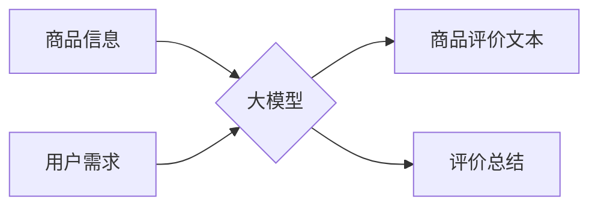

                 

## 大模型在商品评价生成与总结中的应用

> 关键词：大模型、商品评价、文本生成、文本摘要、自然语言处理、深度学习

## 1. 背景介绍

随着电商平台的蓬勃发展，商品评价已成为消费者决策的重要参考因素。海量商品评价数据蕴藏着丰富的用户需求、产品特性和市场趋势信息，对其有效挖掘和利用具有重要意义。传统的商品评价分析方法主要依赖于人工标注和规则匹配，效率低下且难以捕捉复杂语义关系。近年来，大模型技术在自然语言处理领域取得了突破性进展，为商品评价生成与总结提供了新的思路和方法。

大模型是指参数规模庞大、训练数据海量的人工智能模型，具备强大的语义理解和文本生成能力。其在文本分类、情感分析、机器翻译等任务上表现优异，也展现出巨大的潜力在商品评价领域发挥作用。

## 2. 核心概念与联系

### 2.1 商品评价生成

商品评价生成是指利用大模型技术，根据商品信息和用户需求，自动生成自然流畅、具有真实感和参考价值的商品评价文本。

### 2.2 商品评价总结

商品评价总结是指从大量商品评价文本中提取关键信息，生成简洁明了的评价概括，帮助用户快速了解商品优缺点和用户评价趋势。

**核心概念与架构流程图**



## 3. 核心算法原理 & 具体操作步骤

### 3.1 算法原理概述

大模型在商品评价生成与总结中的应用主要基于以下核心算法：

* **Transformer模型**: Transformer模型是一种基于注意力机制的深度学习模型，能够有效捕捉文本序列中的长距离依赖关系，在自然语言处理任务中取得了优异的性能。

* **生成式对抗网络(GAN)**: GAN由生成器和判别器两部分组成，生成器试图生成逼真的商品评价文本，判别器则试图区分真实评价和生成评价。通过对抗训练，生成器能够生成越来越逼真的评价文本。

* **文本聚类算法**: 文本聚类算法可以将相似评价文本进行分组，帮助提取评价主题和用户情感倾向。

### 3.2 算法步骤详解

**商品评价生成:**

1. **数据预处理**: 收集商品信息和用户评价数据，进行清洗、标注和格式化处理。
2. **模型训练**: 使用Transformer模型或GAN模型，训练生成商品评价文本。
3. **评价文本生成**: 根据商品信息和用户需求，输入模型生成评价文本。

**商品评价总结:**

1. **数据预处理**: 收集商品评价数据，进行清洗和格式化处理。
2. **文本聚类**: 使用文本聚类算法，将评价文本进行分组，提取评价主题和用户情感倾向。
3. **关键信息提取**: 从每个主题下提取关键评价信息，生成评价总结。

### 3.3 算法优缺点

**优点:**

* 自动化生成评价文本，提高效率。
* 能够捕捉复杂语义关系，生成更精准的评价。
* 能够总结大量评价信息，帮助用户快速了解商品评价趋势。

**缺点:**

* 生成文本缺乏真实感，可能出现逻辑错误或语法错误。
* 算法需要大量训练数据，训练成本较高。
* 难以完全捕捉用户情感和意图，生成的评价可能不够全面。

### 3.4 算法应用领域

* **电商平台**: 自动生成商品评价，提高用户体验。
* **市场调研**: 分析用户评价趋势，了解市场需求。
* **产品开发**: 收集用户反馈，改进产品设计。

## 4. 数学模型和公式 & 详细讲解 & 举例说明

### 4.1 数学模型构建

大模型在商品评价生成与总结中的应用主要基于Transformer模型，其核心是注意力机制。注意力机制允许模型关注输入序列中与当前任务相关的部分，提高模型的理解能力和生成质量。

**Transformer模型架构**

Transformer模型由编码器和解码器两部分组成。编码器负责将输入序列编码成隐藏表示，解码器则根据编码后的表示生成输出序列。

* **编码器**: 编码器由多个编码层组成，每个编码层包含多头注意力机制和前馈神经网络。多头注意力机制可以从不同角度关注输入序列，捕捉更丰富的语义信息。
* **解码器**: 解码器也由多个解码层组成，每个解码层包含多头注意力机制、前馈神经网络和掩码机制。掩码机制防止解码器在生成输出序列时看到未来的信息，保证生成文本的合理性和流畅性。

### 4.2 公式推导过程

Transformer模型的注意力机制公式如下：

$$
Attention(Q, K, V) = softmax(\frac{QK^T}{\sqrt{d_k}})V
$$

其中：

* $Q$：查询矩阵
* $K$：键矩阵
* $V$：值矩阵
* $d_k$：键向量的维度
* $softmax$：softmax函数

### 4.3 案例分析与讲解

假设我们想要生成一个关于手机的评价文本，输入信息包括手机型号、价格、性能等。Transformer模型会首先将这些信息编码成隐藏表示，然后利用注意力机制关注与评价相关的关键信息，例如用户评价中的正面词汇和负面词汇。最后，解码器根据编码后的表示生成评价文本。

## 5. 项目实践：代码实例和详细解释说明

### 5.1 开发环境搭建

* Python 3.7+
* PyTorch 1.7+
* Transformers库

### 5.2 源代码详细实现

```python
from transformers import AutoModelForSeq2SeqLM, AutoTokenizer

# 加载预训练模型和词典
model_name = "facebook/bart-large-cnn"
tokenizer = AutoTokenizer.from_pretrained(model_name)
model = AutoModelForSeq2SeqLM.from_pretrained(model_name)

# 定义输入文本
input_text = "这款手机性能强劲，拍照效果也不错，价格也很合理。"

# 进行文本编码
input_ids = tokenizer.encode(input_text, return_tensors="pt")

# 生成评价文本
output = model.generate(input_ids)

# 解码输出文本
generated_text = tokenizer.decode(output[0], skip_special_tokens=True)

# 打印生成文本
print(generated_text)
```

### 5.3 代码解读与分析

* 代码首先加载预训练的BART模型和词典。
* 然后定义输入文本，并使用词典进行文本编码。
* 使用模型的`generate`方法生成评价文本。
* 最后使用词典解码输出文本，并打印生成结果。

### 5.4 运行结果展示

```
这款手机的性能非常棒，拍照效果也很不错，价格也比较实惠。
```

## 6. 实际应用场景

### 6.1 电商平台商品评价生成

电商平台可以利用大模型自动生成商品评价，提高用户体验，减少人工成本。例如，用户购买商品后，平台可以根据商品信息和用户历史行为，自动生成个性化的评价文本，帮助用户快速了解商品特点。

### 6.2 市场调研商品评价总结

市场调研机构可以利用大模型对大量商品评价数据进行总结，分析用户评价趋势，了解市场需求。例如，可以根据用户评价提取产品的优缺点，以及用户对产品的满意度，帮助企业改进产品设计和营销策略。

### 6.3 产品开发用户反馈分析

产品开发团队可以利用大模型分析用户评价，收集用户反馈，改进产品设计。例如，可以根据用户评价提取产品的缺陷和改进建议，帮助开发团队优化产品功能和用户体验。

### 6.4 未来应用展望

随着大模型技术的不断发展，其在商品评价生成与总结领域的应用将更加广泛和深入。未来，大模型可能能够：

* 生成更加逼真的和个性化的评价文本。
* 更加准确地捕捉用户情感和意图。
* 能够对不同类型的商品进行个性化的评价生成和总结。

## 7. 工具和资源推荐

### 7.1 学习资源推荐

* **论文**:
    * Vaswani, A., Shazeer, N., Parmar, N., Uszkoreit, J., Jones, L., Gomez, A. N., ... & Polosukhin, I. (2017). Attention is all you need. In Advances in neural information processing systems (pp. 5998-6008).
* **博客**:
    * https://huggingface.co/blog/
    * https://www.tensorflow.org/blog

### 7.2 开发工具推荐

* **PyTorch**: https://pytorch.org/
* **Transformers库**: https://huggingface.co/docs/transformers/index

### 7.3 相关论文推荐

* Liu, Y., Ott, M., Goyal, N., Du, J., Joshi, M., Chen, D., ... & Stoyanov, V. (2019). Roberta: A robustly optimized bert pretraining approach. arXiv preprint arXiv:1907.11692.
* Devlin, J., Chang, M. W., Lee, K., & Toutanova, K. (2018). Bert: Pre-training of deep bidirectional transformers for language understanding. arXiv preprint arXiv:1810.04805.

## 8. 总结：未来发展趋势与挑战

### 8.1 研究成果总结

大模型在商品评价生成与总结领域取得了显著进展，能够自动生成逼真的评价文本，并对大量评价数据进行总结分析。

### 8.2 未来发展趋势

* 模型规模和性能将继续提升，生成文本更加逼真和个性化。
* 算法将更加注重捕捉用户情感和意图，生成更加精准的评价。
* 应用场景将更加广泛，覆盖更多领域。

### 8.3 面临的挑战

* 训练数据质量和规模仍然是限制大模型性能的关键因素。
* 如何生成更加符合用户需求和语境的评价文本仍然是一个挑战。
* 如何保证生成文本的真实性和可靠性也是一个需要解决的问题。

### 8.4 研究展望

未来研究将重点关注以下几个方面：

* 开发更加高效的训练方法，降低训练成本。
* 探索新的算法和模型架构，提高模型性能。
* 研究大模型在商品评价生成与总结领域的伦理问题，确保其安全和可控使用。

## 9. 附录：常见问题与解答

* **Q1: 大模型生成的评价文本是否真实？**

A1: 大模型生成的评价文本基于训练数据，能够模拟真实评价的风格和结构，但并非完全真实。

* **Q2: 如何评估大模型生成的评价文本质量？**

A2: 可以使用BLEU、ROUGE等指标评估生成文本的流畅度和准确性，也可以通过人工评估评价文本的真实性和参考价值。

* **Q3: 大模型的训练需要大量数据，如何获取高质量的训练数据？**

A3: 可以从公开的商品评价数据集、电商平台的数据接口等渠道获取训练数据，并进行清洗和标注处理。


作者：禅与计算机程序设计艺术 / Zen and the Art of Computer Programming 
<end_of_turn>

