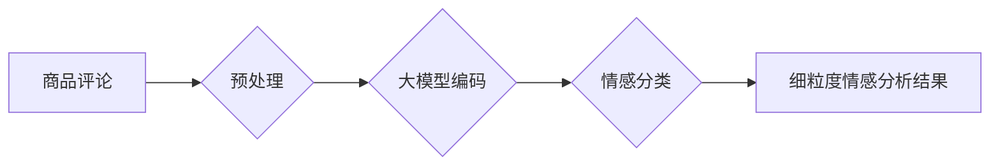

                 

## 大模型在商品评论情感细粒度分析中的应用

> 关键词：大模型、情感分析、细粒度分类、商品评论、自然语言处理、BERT、Transformer

## 1. 背景介绍

随着电商平台的蓬勃发展，商品评论已成为消费者决策的重要参考因素。商家可以通过分析商品评论的情感倾向，了解用户对产品的满意度，及时改进产品和服务。传统的文本情感分析方法通常将评论的情绪归类为正、负或中性，缺乏对细微情感的捕捉。而大模型的出现为商品评论情感细粒度分析提供了新的可能性。

大模型，指的是参数规模庞大、训练数据海量的人工智能模型。其强大的语义理解能力和泛化能力使其能够更准确地识别和分类商品评论中的细微情感，例如“满意”、“失望”、“惊喜”、“愤怒”等。

## 2. 核心概念与联系

### 2.1 情感分析

情感分析是指通过计算机程序自动识别、理解和分析文本中表达的情感倾向的技术。它主要应用于以下领域：

* **市场营销:** 分析客户对产品和服务的评价，了解市场趋势和消费者需求。
* **社会科学研究:** 研究人们对社会事件、政治人物和文化现象的情感态度。
* **用户体验设计:** 分析用户对产品和服务的反馈，改进用户体验。

### 2.2 细粒度情感分析

细粒度情感分析是指将情感分类细化到更具体的类别，例如“惊喜”、“失望”、“愤怒”等，而不是简单的正、负、中性分类。它能够更准确地捕捉用户的情感表达，为商家提供更深入的洞察。

### 2.3 大模型

大模型是指参数规模庞大、训练数据海量的人工智能模型。其强大的语义理解能力和泛化能力使其能够在各种自然语言处理任务中取得优异的性能，包括情感分析。

**核心概念与架构流程图**



## 3. 核心算法原理 & 具体操作步骤

### 3.1 算法原理概述

大模型在商品评论情感细粒度分析中的应用主要基于Transformer模型。Transformer模型是一种基于注意力机制的深度学习模型，能够有效地捕捉文本中的长距离依赖关系，从而实现更准确的情感识别。

### 3.2 算法步骤详解

1. **数据预处理:** 对商品评论进行清洗、去停用词、分词等预处理操作，以便于模型训练。
2. **模型编码:** 使用预训练的Transformer模型对预处理后的评论进行编码，将文本转换为向量表示。
3. **情感分类:** 使用分类器对编码后的评论向量进行分类，将评论的情绪归类为不同的细粒度情感类别。

### 3.3 算法优缺点

**优点:**

* **高准确率:** 大模型能够捕捉文本中的细微情感，实现更准确的分类。
* **泛化能力强:** 预训练的模型能够在不同领域和数据集上取得良好的性能。
* **可扩展性强:** 大模型可以根据需要进行微调，适应不同的应用场景。

**缺点:**

* **训练成本高:** 大模型的训练需要大量的计算资源和时间。
* **模型复杂度高:** 大模型的结构复杂，需要专业的技术人员进行维护和调优。
* **数据依赖性强:** 大模型的性能取决于训练数据的质量和数量。

### 3.4 算法应用领域

大模型在商品评论情感细粒度分析中的应用场景广泛，例如：

* **电商平台:** 分析用户对商品的评价，了解产品优缺点，改进产品和服务。
* **市场调研:** 分析消费者对品牌和产品的态度，了解市场趋势和消费者需求。
* **社交媒体监测:** 分析用户对事件和话题的评价，了解舆情走向和公众情绪。

## 4. 数学模型和公式 & 详细讲解 & 举例说明

### 4.1 数学模型构建

大模型在情感分析中的应用通常基于深度学习模型，例如Transformer模型。Transformer模型的数学模型主要包括以下几个部分:

* **嵌入层:** 将文本单词转换为向量表示。
* **多头注意力层:** 捕捉文本中的长距离依赖关系。
* **前馈神经网络层:** 对注意力输出进行非线性变换。
* **分类层:** 将模型输出转换为情感类别概率。

### 4.2 公式推导过程

Transformer模型的注意力机制的核心公式为：

$$
Attention(Q, K, V) = softmax(\frac{QK^T}{\sqrt{d_k}})V
$$

其中：

* $Q$：查询矩阵
* $K$：键矩阵
* $V$：值矩阵
* $d_k$：键向量的维度
* $softmax$：softmax函数

该公式计算了查询向量与键向量的相似度，并根据相似度对值向量进行加权求和，从而得到注意力输出。

### 4.3 案例分析与讲解

假设我们有一个商品评论：“这款手机拍照效果很棒，但是续航时间比较短。”

使用Transformer模型对该评论进行编码，可以得到一个情感向量。该向量可以表示评论的整体情感倾向，以及对不同方面（例如拍照效果、续航时间）的情感细粒度。

通过分类层，我们可以将该情感向量转换为情感类别概率，例如：

* 满意：0.7
* 失望：0.3

由此可见，该评论的整体情感倾向为满意，但对续航时间的评价存在一定的失望情绪。

## 5. 项目实践：代码实例和详细解释说明

### 5.1 开发环境搭建

* Python 3.7+
* TensorFlow/PyTorch
* NLTK/SpaCy

### 5.2 源代码详细实现

```python
# 导入必要的库
import tensorflow as tf
from transformers import BertTokenizer, BertModel

# 加载预训练模型和词典
tokenizer = BertTokenizer.from_pretrained('bert-base-uncased')
model = BertModel.from_pretrained('bert-base-uncased')

# 定义情感分类模型
class SentimentClassifier(tf.keras.Model):
    def __init__(self, num_classes):
        super(SentimentClassifier, self).__init__()
        self.bert = model
        self.classifier = tf.keras.layers.Dense(num_classes, activation='softmax')

    def call(self, inputs):
        outputs = self.bert(inputs)
        pooled_output = outputs[1][:, 0, :]
        logits = self.classifier(pooled_output)
        return logits

# 定义训练函数
def train_model(model, dataset, epochs):
    optimizer = tf.keras.optimizers.Adam(learning_rate=1e-5)
    loss_fn = tf.keras.losses.CategoricalCrossentropy()

    for epoch in range(epochs):
        for batch in dataset:
            with tf.GradientTape() as tape:
                predictions = model(batch['input_ids'])
                loss = loss_fn(batch['labels'], predictions)
            gradients = tape.gradient(loss, model.trainable_variables)
            optimizer.apply_gradients(zip(gradients, model.trainable_variables))

        print(f'Epoch {epoch+1}/{epochs}, Loss: {loss.numpy()}')

# ... (数据加载、模型训练、评估等代码)
```

### 5.3 代码解读与分析

* 该代码首先加载预训练的BERT模型和词典。
* 然后定义了一个情感分类模型，该模型将BERT模型的输出作为输入，并使用全连接层进行分类。
* 训练函数使用Adam优化器和CategoricalCrossentropy损失函数对模型进行训练。

### 5.4 运行结果展示

* 训练完成后，可以使用测试集评估模型的性能，例如计算准确率、召回率和F1-score等指标。
* 可以将模型部署到生产环境中，用于实时分析商品评论的情感倾向。

## 6. 实际应用场景

### 6.1 电商平台

电商平台可以利用大模型对商品评论进行细粒度情感分析，了解用户对不同产品功能和服务的评价，从而改进产品设计和服务质量。例如，可以分析用户对手机拍照效果、续航时间、屏幕尺寸等方面的评价，并根据这些反馈进行产品优化。

### 6.2 市场调研

市场调研机构可以利用大模型分析用户对品牌和产品的评价，了解市场趋势和消费者需求。例如，可以分析用户对某个品牌的口碑、产品受欢迎程度以及竞争对手的评价，从而为企业提供决策支持。

### 6.3 社交媒体监测

社交媒体平台可以利用大模型分析用户对事件和话题的评价，了解舆情走向和公众情绪。例如，可以分析用户对某个新闻事件的看法、对政治人物的评价以及对社会问题的态度，从而帮助企业和政府了解公众的意见和诉求。

### 6.4 未来应用展望

随着大模型技术的不断发展，其在商品评论情感细粒度分析中的应用场景将更加广泛。例如：

* **个性化推荐:** 根据用户对商品的细粒度情感评价，提供更精准的商品推荐。
* **智能客服:** 利用大模型训练智能客服机器人，能够更准确地理解用户的问题和需求，并提供更有效的解决方案。
* **情感营销:** 根据用户对商品的情感倾向，进行精准的情感营销，提高营销效果。

## 7. 工具和资源推荐

### 7.1 学习资源推荐

* **书籍:**
    * 《深度学习》 by Ian Goodfellow, Yoshua Bengio, Aaron Courville
    * 《自然语言处理》 by Dan Jurafsky, James H. Martin
* **在线课程:**
    * Coursera: Natural Language Processing Specialization
    * Stanford CS224N: Natural Language Processing with Deep Learning

### 7.2 开发工具推荐

* **TensorFlow:** 开源深度学习框架，提供丰富的工具和资源。
* **PyTorch:** 开源深度学习框架，以其灵活性和易用性而闻名。
* **Hugging Face Transformers:** 提供预训练的Transformer模型和工具，方便进行情感分析等任务。

### 7.3 相关论文推荐

* Devlin, J., Chang, M. W., Lee, K., & Toutanova, K. (2018). Bert: Pre-training of deep bidirectional transformers for language understanding. arXiv preprint arXiv:1810.04805.
* Liu, B., Ott, M., Goyal, N., Du, J., Joshi, M., Chen, D., ... & Stoyanov, V. (2019). Roberta: A robustly optimized bert pretraining approach. arXiv preprint arXiv:1907.11692.

## 8. 总结：未来发展趋势与挑战

### 8.1 研究成果总结

大模型在商品评论情感细粒度分析领域取得了显著的成果，能够实现更准确、更细粒度的情感识别，为商家和市场调研机构提供更深入的洞察。

### 8.2 未来发展趋势

* **模型规模和性能的提升:** 未来大模型的规模和性能将继续提升，能够捕捉更复杂的语义关系，实现更精准的情感分析。
* **多模态情感分析:** 将文本、图像、音频等多模态数据融合在一起，实现更全面的情感分析。
* **个性化情感分析:** 根据用户的个人特征和偏好，进行个性化的情感分析，提供更精准的商品推荐和服务。

### 8.3 面临的挑战

* **数据标注成本高:** 大模型的训练需要大量的标注数据，数据标注成本较高。
* **模型解释性差:** 大模型的决策过程较为复杂，难以解释其背后的逻辑，这可能会影响用户的信任度。
* **公平性问题:** 大模型可能存在偏见，导致情感分析结果不公平。

### 8.4 研究展望

未来研究将重点关注以下几个方面:

* **降低数据标注成本:** 研究新的数据标注方法，降低数据标注成本。
* **提高模型解释性:** 研究可解释性AI技术，提高大模型的解释性。
* **解决公平性问题:** 研究公平性算法，确保大模型的输出结果公平公正。


## 9. 附录：常见问题与解答

**Q1: 大模型的训练需要多少计算资源？**

A1: 大模型的训练需要大量的计算资源，例如GPU集群。具体所需的资源取决于模型的规模和训练数据的大小。

**Q2: 如何评估大模型的性能？**

A2: 大模型的性能可以通过多种指标进行评估，例如准确率、召回率、F1-score等。

**Q3: 如何部署大模型到生产环境中？**

A3: 可以使用云平台提供的服务，例如AWS SageMaker、Google Cloud AI Platform等，将大模型部署到生产环境中。

**作者：禅与计算机程序设计艺术 / Zen and the Art of Computer Programming**<end_of_turn>

