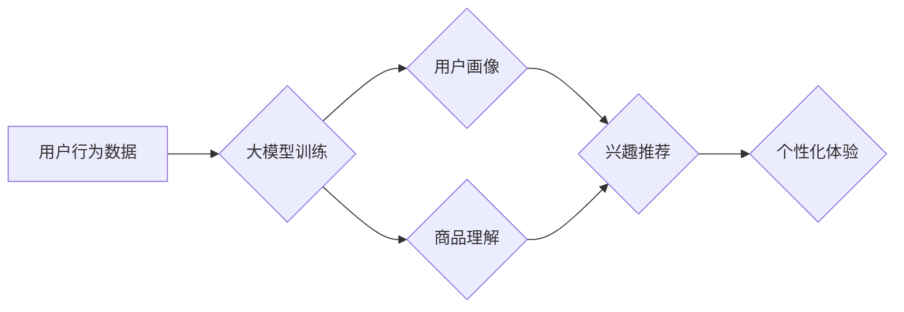

                 

## 大模型在电商平台用户兴趣探索与利用平衡中的应用

> 关键词：大模型、电商平台、用户兴趣探索、推荐系统、个性化体验、数据隐私、伦理问题

## 1. 背景介绍

随着电商平台的蓬勃发展，用户兴趣的探索与利用已成为平台核心竞争力之一。传统推荐系统主要依赖用户历史行为和商品特征进行匹配，但随着用户行为的复杂性和商品信息的爆炸式增长，传统方法逐渐面临挑战。大模型的出现为电商平台用户兴趣探索与利用带来了新的机遇。

大模型，指的是参数规模庞大、训练数据海量的人工智能模型，具备强大的泛化能力和学习能力。其在自然语言处理、图像识别、语音合成等领域取得了突破性进展，也为电商平台用户兴趣探索与利用提供了新的思路和技术手段。

## 2. 核心概念与联系

### 2.1 用户兴趣探索

用户兴趣探索是指通过分析用户行为、偏好、兴趣等信息，挖掘用户潜在需求，并推荐符合用户兴趣的商品或服务。

### 2.2 大模型应用

大模型在电商平台用户兴趣探索中的应用主要体现在以下几个方面：

* **用户画像构建:** 利用大模型对用户行为数据进行分析，构建更加精准的用户画像，包括用户兴趣、偏好、消费习惯等。
* **商品理解:** 利用大模型对商品信息进行分析，理解商品的属性、特征、用户评价等，构建商品的语义表示。
* **兴趣推荐:** 利用大模型对用户画像和商品理解进行结合，推荐符合用户兴趣的商品。
* **个性化内容生成:** 利用大模型生成个性化的商品描述、推荐文案、促销活动等内容，提升用户体验。

### 2.3 核心架构

大模型在电商平台用户兴趣探索与利用中的应用，通常采用以下架构：



## 3. 核心算法原理 & 具体操作步骤

### 3.1 算法原理概述

大模型在电商平台用户兴趣探索与利用中的应用，主要依赖于以下核心算法：

* **Transformer:** Transformer是一种基于注意力机制的神经网络架构，能够有效捕捉文本序列中的长距离依赖关系，在自然语言处理任务中取得了优异的性能。
* **BERT:** BERT (Bidirectional Encoder Representations from Transformers)是一种基于Transformer的预训练语言模型，能够理解文本的语义和上下文关系，在文本分类、问答、文本相似度等任务中表现出色。
* **Recurrent Neural Networks (RNN):** RNN是一种能够处理序列数据的循环神经网络，能够学习时间序列中的模式和趋势，在用户行为预测、商品推荐等任务中应用广泛。

### 3.2 算法步骤详解

1. **数据收集与预处理:** 收集用户行为数据、商品信息等数据，并进行清洗、格式化、编码等预处理操作。
2. **模型训练:** 利用收集到的数据训练大模型，例如BERT、Transformer等，训练目标可以是用户画像构建、商品理解、兴趣推荐等。
3. **模型评估:** 利用测试数据评估模型的性能，例如准确率、召回率、F1-score等指标。
4. **模型部署:** 将训练好的模型部署到电商平台，用于用户兴趣探索与利用。
5. **模型监控与优化:** 持续监控模型的性能，并根据实际情况进行模型优化和更新。

### 3.3 算法优缺点

**优点:**

* **强大的学习能力:** 大模型能够学习用户行为和商品信息的复杂关系，提供更加精准的推荐和个性化体验。
* **泛化能力强:** 大模型在训练数据上取得良好性能后，能够应用于不同的场景和用户群体。
* **持续学习:** 大模型可以通过不断更新数据进行训练，提升推荐效果和用户体验。

**缺点:**

* **训练成本高:** 大模型的训练需要大量的计算资源和时间，成本较高。
* **数据依赖性强:** 大模型的性能取决于训练数据的质量和数量，数据不足或质量低劣会导致模型性能下降。
* **解释性差:** 大模型的决策过程较为复杂，难以解释模型的推荐结果，缺乏透明度。

### 3.4 算法应用领域

大模型在电商平台用户兴趣探索与利用中的应用领域广泛，包括：

* **商品推荐:** 根据用户的兴趣和行为，推荐符合用户需求的商品。
* **个性化营销:** 根据用户的画像，定制个性化的营销活动和促销方案。
* **内容推荐:** 根据用户的兴趣，推荐相关的文章、视频、直播等内容。
* **用户画像构建:** 构建更加精准的用户画像，了解用户的兴趣、偏好、消费习惯等。

## 4. 数学模型和公式 & 详细讲解 & 举例说明

### 4.1 数学模型构建

大模型在电商平台用户兴趣探索与利用中的应用，通常采用以下数学模型：

* **用户兴趣模型:** 用于表示用户的兴趣偏好，例如基于用户的历史行为数据构建的隐语义模型。
* **商品特征模型:** 用于表示商品的属性和特征，例如基于商品描述、用户评价等构建的词嵌入模型。
* **推荐模型:** 用于预测用户对商品的兴趣，例如基于用户兴趣模型和商品特征模型的协同过滤模型。

### 4.2 公式推导过程

例如，基于用户的历史行为数据构建隐语义模型，可以使用矩阵分解的方法进行推导。

假设用户集合为U，商品集合为I，用户-商品交互矩阵为R，其中R(u,i)表示用户u对商品i的评分。

目标是学习用户向量u和商品向量i，使得预测评分与实际评分尽可能接近。

可以使用以下公式进行优化：

$$
\min_{u,i} \sum_{u,i} (R(u,i) - u^T i)^2
$$

其中，u^T i表示用户向量u和商品向量i的点积。

### 4.3 案例分析与讲解

例如，假设用户A对商品1评分为5，对商品2评分为3，对商品3评分为4。

可以使用矩阵分解的方法学习用户A的兴趣向量和商品的特征向量，并预测用户A对其他商品的兴趣评分。

## 5. 项目实践：代码实例和详细解释说明

### 5.1 开发环境搭建

* Python 3.x
* TensorFlow 或 PyTorch
* Jupyter Notebook

### 5.2 源代码详细实现

```python
# 导入必要的库
import tensorflow as tf

# 定义用户兴趣模型
class UserInterestModel(tf.keras.Model):
    def __init__(self, embedding_dim):
        super(UserInterestModel, self).__init__()
        self.embedding_dim = embedding_dim

    def call(self, user_id):
        # 根据用户ID获取用户向量
        user_embedding = tf.Variable(tf.random.normal([num_users, self.embedding_dim]))
        user_vector = user_embedding[user_id]
        return user_vector

# 定义商品特征模型
class ItemFeatureModel(tf.keras.Model):
    def __init__(self, embedding_dim):
        super(ItemFeatureModel, self).__init__()
        self.embedding_dim = embedding_dim

    def call(self, item_id):
        # 根据商品ID获取商品向量
        item_embedding = tf.Variable(tf.random.normal([num_items, self.embedding_dim]))
        item_vector = item_embedding[item_id]
        return item_vector

# 定义推荐模型
class RecommendationModel(tf.keras.Model):
    def __init__(self, embedding_dim):
        super(RecommendationModel, self).__init__()
        self.embedding_dim = embedding_dim

    def call(self, user_id, item_id):
        # 获取用户向量和商品向量
        user_vector = self.user_interest_model(user_id)
        item_vector = self.item_feature_model(item_id)
        # 计算用户对商品的兴趣评分
        score = tf.reduce_sum(user_vector * item_vector)
        return score

# 实例化模型
user_interest_model = UserInterestModel(embedding_dim=64)
item_feature_model = ItemFeatureModel(embedding_dim=64)
recommendation_model = RecommendationModel(embedding_dim=64)

# 训练模型
# ...

```

### 5.3 代码解读与分析

* 代码首先定义了用户兴趣模型、商品特征模型和推荐模型。
* 用户兴趣模型和商品特征模型分别负责学习用户的兴趣向量和商品的特征向量。
* 推荐模型根据用户向量和商品向量计算用户对商品的兴趣评分。
* 训练模型的过程需要使用用户-商品交互数据，并使用优化算法进行训练。

### 5.4 运行结果展示

训练完成后，可以使用模型预测用户对商品的兴趣评分，并根据评分进行商品推荐。

## 6. 实际应用场景

### 6.1 商品推荐系统

大模型可以用于构建更加精准的商品推荐系统，例如根据用户的浏览历史、购买记录、收藏列表等信息，推荐符合用户兴趣的商品。

### 6.2 个性化营销

大模型可以用于构建个性化的营销方案，例如根据用户的兴趣偏好，定制个性化的广告、促销活动等。

### 6.3 内容推荐

大模型可以用于推荐相关的文章、视频、直播等内容，例如根据用户的阅读历史、观看记录等信息，推荐符合用户兴趣的内容。

### 6.4 用户画像构建

大模型可以用于构建更加精准的用户画像，例如根据用户的行为数据、社交数据等信息，了解用户的兴趣、偏好、消费习惯等。

### 6.5 未来应用展望

大模型在电商平台用户兴趣探索与利用中的应用前景广阔，未来可能应用于以下领域：

* **更精准的个性化推荐:** 利用大模型学习用户的更深层次的兴趣和需求，提供更加精准的个性化推荐。
* **多模态用户兴趣探索:** 将文本、图像、视频等多模态数据融合，更全面地理解用户的兴趣。
* **动态兴趣建模:** 随着用户的兴趣变化，动态更新用户的兴趣模型，提供更加实时和精准的推荐。
* **跨平台用户兴趣连接:** 将不同平台的用户数据进行整合，构建更全面的用户兴趣画像。

## 7. 工具和资源推荐

### 7.1 学习资源推荐

* **书籍:**
    * 《深度学习》
    * 《自然语言处理》
    * 《机器学习》
* **在线课程:**
    * Coursera
    * edX
    * Udacity

### 7.2 开发工具推荐

* **TensorFlow:** 开源深度学习框架
* **PyTorch:** 开源深度学习框架
* **Jupyter Notebook:** 交互式编程环境

### 7.3 相关论文推荐

* BERT: Pre-training of Deep Bidirectional Transformers for Language Understanding
* Transformer: Attention Is All You Need
* Factorization Machines for CTR Prediction

## 8. 总结：未来发展趋势与挑战

### 8.1 研究成果总结

大模型在电商平台用户兴趣探索与利用中的应用取得了显著成果，例如：

* **推荐效果提升:** 大模型能够学习用户行为和商品信息的复杂关系，提升推荐效果。
* **个性化体验增强:** 大模型能够根据用户的兴趣偏好，提供更加个性化的商品推荐和营销方案。
* **用户画像构建更精准:** 大模型能够构建更加精准的用户画像，帮助电商平台更好地了解用户需求。

### 8.2 未来发展趋势

大模型在电商平台用户兴趣探索与利用中的应用未来将朝着以下方向发展：

* **模型规模更大:** 随着计算资源的提升，大模型的规模将进一步扩大，学习能力将进一步增强。
* **多模态融合:** 将文本、图像、视频等多模态数据融合，更全面地理解用户的兴趣。
* **动态兴趣建模:** 随着用户的兴趣变化，动态更新用户的兴趣模型，提供更加实时和精准的推荐。
* **隐私保护:** 如何在保证用户隐私的前提下进行大模型训练和应用，将成为一个重要的研究方向。

### 8.3 面临的挑战

大模型在电商平台用户兴趣探索与利用中的应用也面临一些挑战：

* **训练成本高:** 大模型的训练需要大量的计算资源和时间，成本较高。
* **数据依赖性强:** 大模型的性能取决于训练数据的质量和数量，数据不足或质量低劣会导致模型性能下降。
* **解释性差:** 大模型的决策过程较为复杂，难以解释模型的推荐结果，缺乏透明度。
* **伦理问题:** 大模型的应用可能带来一些伦理问题，例如数据隐私、算法偏见等，需要引起重视。

### 8.4 研究展望

未来，大模型在电商平台用户兴趣探索与利用中的应用将继续深入发展，需要进一步研究以下问题：

* 如何降低大模型的训练成本，使其更易于部署和应用。
* 如何提高大模型对小样本数据的学习能力，解决数据不足的问题。
* 如何提高大模型的解释性，使其决策过程更加透明。
* 如何解决大模型应用带来的伦理问题，确保其安全和可持续发展。


## 9. 附录：常见问题与解答

### 9.1 如何选择合适的模型？

选择合适的模型取决于具体的应用场景和数据特点。例如，对于用户行为预测，RNN模型可能更合适；对于商品推荐，协同过滤模型或深度学习模型可能更有效。

### 9.2 如何评估模型性能？

常用的模型性能评估指标包括准确率、召回率、F1-score、AUC等。

### 9.3 如何解决数据稀疏性问题？

数据稀疏性是推荐系统中常见的问题，可以使用以下方法进行解决：

* **特征工程:** 提取更多特征，例如用户画像、商品属性等，丰富数据信息。
* **模型融合:** 将多个模型进行融合，提高模型的鲁棒性。
* **冷启动策略:** 为新用户和新商品设计特殊的推荐策略。


作者：禅与计算机程序设计艺术 / Zen and the Art of Computer Programming<end_of_turn>

