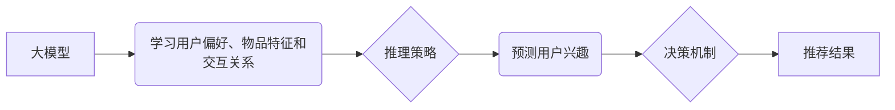

                 

## 大模型推荐中的推理策略与决策机制创新

> 关键词：大模型、推荐系统、推理策略、决策机制、个性化推荐、效率优化、公平性

## 1. 背景介绍

推荐系统作为连接用户需求与信息资源的重要桥梁，在电商、社交媒体、内容平台等领域发挥着至关重要的作用。随着大模型技术的蓬勃发展，大模型在推荐系统中的应用日益广泛，为提升推荐精准度、个性化程度和用户体验提供了新的机遇。然而，大模型在推理过程中的计算成本高、效率低、决策机制缺乏透明度等问题也成为亟待解决的挑战。

传统推荐系统主要依赖于基于规则、协同过滤和内容过滤等方法，其推荐结果往往缺乏个性化和针对性。而大模型，凭借其强大的学习能力和泛化能力，能够从海量数据中学习用户偏好、物品特征和交互关系，从而生成更精准、更个性化的推荐结果。例如，基于Transformer架构的大模型能够捕捉用户行为序列中的长距离依赖关系，更有效地理解用户意图，从而提供更精准的推荐。

然而，大模型在推荐系统中的应用也面临着一些挑战：

* **高计算成本:** 大模型的推理过程通常需要消耗大量的计算资源，这导致推荐系统部署成本高、实时性差。
* **效率低下:** 大模型的推理速度相对较慢，难以满足用户对实时推荐的需求。
* **决策机制缺乏透明度:** 大模型的决策过程通常是复杂的，难以解释其推荐结果背后的逻辑，这导致用户难以理解推荐理由，降低了推荐的可信度。

## 2. 核心概念与联系

### 2.1  大模型

大模型是指参数量达到数亿甚至数十亿的深度学习模型，其强大的学习能力和泛化能力使其能够在自然语言处理、计算机视觉、推荐系统等多个领域取得突破性进展。

### 2.2  推荐系统

推荐系统旨在根据用户的历史行为、偏好和上下文信息，预测用户对特定物品的兴趣，并推荐用户可能感兴趣的物品。

### 2.3  推理策略

推理策略是指大模型在进行推荐时，如何利用其学习到的知识和模型参数，进行预测和决策的策略。不同的推理策略会影响推荐结果的准确性、效率和个性化程度。

### 2.4  决策机制

决策机制是指大模型在进行推荐时，如何权衡不同因素，最终做出推荐决策的机制。

**核心概念与联系流程图**



## 3. 核心算法原理 & 具体操作步骤

### 3.1  算法原理概述

大模型推荐系统通常采用基于Transformer架构的模型，例如BERT、GPT等。这些模型能够捕捉用户行为序列中的长距离依赖关系，更有效地理解用户意图，从而提供更精准的推荐。

### 3.2  算法步骤详解

1. **数据预处理:** 收集用户行为数据、物品信息数据等，并进行清洗、转换、编码等预处理操作。
2. **模型训练:** 使用预处理后的数据训练Transformer模型，学习用户偏好、物品特征和交互关系。
3. **推理策略选择:** 根据实际应用场景选择合适的推理策略，例如基于概率的策略、基于规则的策略等。
4. **决策机制设计:** 设计决策机制，用于权衡不同因素，最终做出推荐决策。
5. **推荐结果生成:** 根据推理策略和决策机制，生成推荐结果并展示给用户。

### 3.3  算法优缺点

**优点:**

* **高精准度:** 大模型能够从海量数据中学习更复杂的模式，从而提高推荐精准度。
* **高个性化:** 大模型能够根据用户的历史行为和偏好，提供更个性化的推荐。
* **可扩展性强:** 大模型可以轻松扩展到新的领域和应用场景。

**缺点:**

* **高计算成本:** 大模型的推理过程需要消耗大量的计算资源。
* **效率低下:** 大模型的推理速度相对较慢。
* **决策机制缺乏透明度:** 大模型的决策过程复杂，难以解释其推荐结果背后的逻辑。

### 3.4  算法应用领域

大模型推荐算法广泛应用于以下领域:

* **电商推荐:** 推荐商品、优惠券、促销活动等。
* **内容推荐:** 推荐新闻、视频、音乐、书籍等。
* **社交媒体推荐:** 推荐好友、群组、话题等。
* **个性化教育:** 推荐学习资源、课程、辅导等。

## 4. 数学模型和公式 & 详细讲解 & 举例说明

### 4.1  数学模型构建

大模型推荐系统通常采用基于Transformer架构的模型，其核心是注意力机制。注意力机制允许模型关注输入序列中与当前任务最相关的部分，从而提高推荐的准确性和效率。

**注意力机制公式:**

$$
Attention(Q, K, V) = \frac{exp(Q \cdot K^T / \sqrt{d_k})}{exp(Q \cdot K^T / \sqrt{d_k})} \cdot V
$$

其中:

* $Q$：查询向量
* $K$：键向量
* $V$：值向量
* $d_k$：键向量的维度

### 4.2  公式推导过程

注意力机制的公式通过计算查询向量与键向量的点积，并将其归一化，从而得到每个键向量的权重。然后，将这些权重与值向量相乘，得到最终的输出。

### 4.3  案例分析与讲解

假设我们有一个用户行为序列，例如：[浏览商品A，添加购物车，浏览商品B，购买商品B]。

* $Q$：表示当前用户对商品B的兴趣。
* $K$：表示每个商品的特征向量。
* $V$：表示每个商品的评分向量。

通过注意力机制，模型可以学习到用户对商品B的兴趣与商品A、商品B的特征和评分之间的关系，从而更准确地预测用户对商品B的购买意愿。

## 5. 项目实践：代码实例和详细解释说明

### 5.1  开发环境搭建

* Python 3.7+
* TensorFlow 2.0+
* PyTorch 1.0+
* CUDA 10.0+

### 5.2  源代码详细实现

```python
# 使用BERT模型进行商品推荐
from transformers import BertModel, BertTokenizer

# 加载预训练模型和词典
model_name = "bert-base-uncased"
tokenizer = BertTokenizer.from_pretrained(model_name)
model = BertModel.from_pretrained(model_name)

# 用户行为序列
user_behavior = ["浏览商品A", "添加购物车", "浏览商品B", "购买商品B"]

# 将用户行为序列转换为BERT模型输入格式
input_ids = tokenizer(user_behavior, return_tensors="pt").input_ids

# 使用BERT模型进行推理
outputs = model(input_ids)

# 从模型输出中提取特征向量
hidden_states = outputs.last_hidden_state

# 使用其他机器学习算法对特征向量进行分类
# ...

# 生成推荐结果
```

### 5.3  代码解读与分析

* 代码首先加载预训练的BERT模型和词典。
* 然后将用户行为序列转换为BERT模型输入格式。
* 使用BERT模型进行推理，并从模型输出中提取特征向量。
* 最后，使用其他机器学习算法对特征向量进行分类，生成推荐结果。

### 5.4  运行结果展示

运行代码后，模型将生成一个包含推荐商品的列表。

## 6. 实际应用场景

### 6.1  电商推荐

大模型推荐系统可以用于推荐商品、优惠券、促销活动等，提高用户购物体验和转化率。

### 6.2  内容推荐

大模型推荐系统可以用于推荐新闻、视频、音乐、书籍等，帮助用户发现感兴趣的内容。

### 6.3  个性化教育

大模型推荐系统可以用于推荐学习资源、课程、辅导等，提供个性化的学习体验。

### 6.4  未来应用展望

未来，大模型推荐系统将更加智能化、个性化和高效化。例如，模型将能够更好地理解用户的隐性需求，并提供更精准的推荐；模型将能够根据用户的实时反馈，动态调整推荐策略；模型将能够与其他系统协同工作，提供更全面的服务。

## 7. 工具和资源推荐

### 7.1  学习资源推荐

* **书籍:**
    * 《深度学习》
    * 《自然语言处理》
    * 《推荐系统》
* **在线课程:**
    * Coursera
    * edX
    * Udacity

### 7.2  开发工具推荐

* **TensorFlow:** 开源机器学习框架
* **PyTorch:** 开源机器学习框架
* **HuggingFace:** 提供预训练模型和工具

### 7.3  相关论文推荐

* **BERT: Pre-training of Deep Bidirectional Transformers for Language Understanding**
* **Attention Is All You Need**
* **Recurrent Neural Network Based Language Model**

## 8. 总结：未来发展趋势与挑战

### 8.1  研究成果总结

大模型推荐系统在提高推荐精准度、个性化程度和用户体验方面取得了显著进展。

### 8.2  未来发展趋势

未来，大模型推荐系统将更加智能化、个性化和高效化。

### 8.3  面临的挑战

* **高计算成本:** 大模型的推理过程需要消耗大量的计算资源，这限制了其在实际应用中的部署。
* **效率低下:** 大模型的推理速度相对较慢，难以满足用户对实时推荐的需求。
* **决策机制缺乏透明度:** 大模型的决策过程复杂，难以解释其推荐结果背后的逻辑，这降低了推荐的可信度。

### 8.4  研究展望

未来研究将重点关注以下几个方面:

* **高效推理算法:** 开发更有效的推理算法，降低大模型的计算成本和推理时间。
* **可解释性研究:** 研究大模型的决策机制，提高推荐结果的可解释性。
* **公平性与隐私保护:** 确保大模型推荐系统公平公正，并保护用户隐私。

## 9. 附录：常见问题与解答

### 9.1  Q: 大模型推荐系统与传统推荐系统相比有什么优势？

**A:** 大模型推荐系统相比传统推荐系统，具有以下优势:

* **高精准度:** 大模型能够从海量数据中学习更复杂的模式，从而提高推荐精准度。
* **高个性化:** 大模型能够根据用户的历史行为和偏好，提供更个性化的推荐。
* **可扩展性强:** 大模型可以轻松扩展到新的领域和应用场景。

### 9.2  Q: 如何评估大模型推荐系统的性能？

**A:** 大模型推荐系统的性能可以评估以下指标:

* **准确率:** 推荐结果与用户实际行为的匹配程度。
* **召回率:** 推荐结果包含所有用户实际感兴趣的物品的比例。
* **点击率:** 用户点击推荐结果的比例。
* **转化率:** 用户通过推荐结果完成购买或其他目标行为的比例。

### 9.3  Q: 大模型推荐系统有哪些应用场景？

**A:** 大模型推荐系统广泛应用于以下领域:

* **电商推荐:** 推荐商品、优惠券、促销活动等。
* **内容推荐:** 推荐新闻、视频、音乐、书籍等。
* **个性化教育:** 推荐学习资源、课程、辅导等。

作者：禅与计算机程序设计艺术 / Zen and the Art of Computer Programming


<end_of_turn>

