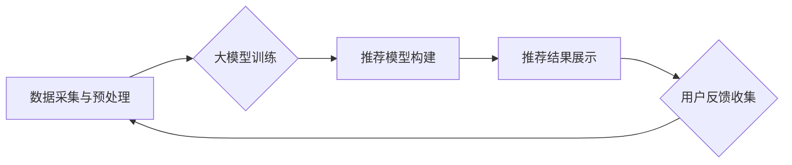

                 

## 大模型驱动的电商个性化内容推荐

> 关键词：大模型、电商推荐、个性化、内容推荐、深度学习、Transformer、BERT、用户画像

## 1. 背景介绍

在当今数字经济时代，电商平台已成为人们购物的首选方式。然而，面对海量商品和用户，如何精准推荐用户感兴趣的内容，提升用户体验和转化率，成为电商平台面临的重大挑战。传统基于规则或协同过滤的推荐算法，难以满足个性化需求，且随着用户行为数据的不断增长，算法的效率和准确性也面临瓶颈。

近年来，大模型技术在自然语言处理、计算机视觉等领域取得了突破性进展，为电商个性化内容推荐提供了新的机遇。大模型具备海量数据处理能力、强大的语义理解能力和泛化能力，能够学习用户细粒度的偏好和需求，并生成更精准、更个性化的推荐内容。

## 2. 核心概念与联系

### 2.1 大模型

大模型是指参数规模庞大、训练数据海量的人工智能模型。其核心特点是：

* **规模庞大:** 大模型通常拥有数十亿甚至数千亿个参数，比传统模型规模更大得多。
* **数据驱动:** 大模型的训练依赖于海量数据，通过学习数据中的模式和规律，提升模型的泛化能力。
* **多任务学习:** 大模型通常能够同时学习多个任务，例如文本分类、机器翻译、问答系统等，提高资源利用率和模型效率。

### 2.2 电商个性化内容推荐

电商个性化内容推荐是指根据用户的兴趣、偏好、购买历史等信息，为用户推荐个性化的商品、内容和服务。其目标是提升用户体验、提高转化率和用户粘性。

### 2.3 核心架构

大模型驱动的电商个性化内容推荐系统通常包含以下核心组件：

* **数据采集与预处理:** 收集用户行为数据、商品信息、内容数据等，并进行清洗、转换、特征提取等预处理工作。
* **大模型训练:** 利用海量数据训练大模型，例如BERT、GPT等，学习用户偏好和商品特征的关联关系。
* **推荐模型构建:** 基于训练好的大模型，构建个性化推荐模型，例如基于用户的协同过滤、基于内容的推荐等。
* **推荐结果展示:** 将推荐结果以用户友好的方式展示给用户，例如商品列表、推荐卡片等。
* **用户反馈收集:** 收集用户对推荐结果的反馈，并将其用于模型优化和迭代。

**Mermaid 流程图**



## 3. 核心算法原理 & 具体操作步骤

### 3.1 算法原理概述

大模型驱动的电商个性化内容推荐主要基于深度学习算法，例如Transformer、BERT等。这些算法能够学习用户和商品之间的复杂关系，并生成更精准的推荐结果。

* **Transformer:** Transformer是一种基于注意力机制的深度学习模型，能够有效捕捉文本序列中的长距离依赖关系，在自然语言处理任务中取得了优异的性能。
* **BERT:** BERT是一种基于Transformer的预训练语言模型，通过在大量的文本数据上进行预训练，学习了丰富的语言表示，能够用于各种自然语言理解任务，例如文本分类、问答系统、文本相似度计算等。

### 3.2 算法步骤详解

1. **数据预处理:** 收集用户行为数据、商品信息、内容数据等，并进行清洗、转换、特征提取等预处理工作。例如，将用户购买历史转化为用户兴趣标签，将商品描述转化为商品特征向量等。
2. **大模型训练:** 利用预处理后的数据训练大模型，例如BERT。训练过程包括：
    * **输入数据:** 将预处理后的数据输入到大模型中。
    * **模型参数更新:** 通过反向传播算法，更新大模型的参数，使其能够更好地拟合数据。
    * **评估模型性能:** 使用验证集评估模型的性能，并根据性能调整训练参数。
3. **推荐模型构建:** 基于训练好的大模型，构建个性化推荐模型。例如，可以使用BERT的输出结果作为特征，训练一个基于用户的协同过滤模型，或者使用BERT对用户和商品进行语义匹配，生成推荐结果。
4. **推荐结果展示:** 将推荐结果以用户友好的方式展示给用户，例如商品列表、推荐卡片等。
5. **用户反馈收集:** 收集用户对推荐结果的反馈，例如点击、购买、评分等，并将其用于模型优化和迭代。

### 3.3 算法优缺点

**优点:**

* **精准度高:** 大模型能够学习用户细粒度的偏好和需求，生成更精准的推荐结果。
* **个性化强:** 大模型能够为每个用户生成个性化的推荐内容，提升用户体验。
* **泛化能力强:** 大模型在训练过程中学习了丰富的知识和模式，能够应用于不同的电商场景。

**缺点:**

* **训练成本高:** 大模型的训练需要大量的计算资源和时间。
* **数据依赖性强:** 大模型的性能依赖于训练数据的质量和数量。
* **解释性差:** 大模型的决策过程较为复杂，难以解释其推荐结果背后的逻辑。

### 3.4 算法应用领域

大模型驱动的电商个性化内容推荐算法广泛应用于以下领域：

* **商品推荐:** 为用户推荐相关的商品，例如基于用户的协同过滤、基于内容的推荐等。
* **内容推荐:** 为用户推荐相关的文章、视频、图片等内容。
* **广告推荐:** 为用户推荐相关的广告，提升广告点击率和转化率。
* **用户画像:** 通过分析用户的行为数据，构建用户画像，了解用户的兴趣、偏好和需求。

## 4. 数学模型和公式 & 详细讲解 & 举例说明

### 4.1 数学模型构建

大模型驱动的电商个性化内容推荐通常使用基于用户的协同过滤模型或基于内容的推荐模型。

**基于用户的协同过滤模型:**

该模型假设用户具有相似的兴趣倾向，如果用户A喜欢商品X，那么用户B也可能喜欢商品X。

**基于内容的推荐模型:**

该模型假设用户喜欢与其兴趣相符的内容，例如用户喜欢阅读科技类文章，那么该模型会推荐其他科技类文章。

### 4.2 公式推导过程

**基于用户的协同过滤模型:**

假设用户集合为U，商品集合为I，用户对商品的评分矩阵为R。

* **相似度计算:** 使用余弦相似度计算用户之间的相似度。

$$
\text{相似度}(u_i, u_j) = \frac{\sum_{i \in I} R_{u_i, i} \cdot R_{u_j, i}}{\sqrt{\sum_{i \in I} R_{u_i, i}^2} \cdot \sqrt{\sum_{i \in I} R_{u_j, i}^2}}
$$

* **推荐算法:**

$$
\text{推荐}(u_i, i) = \frac{\sum_{j \in U} \text{相似度}(u_i, u_j) \cdot R_{u_j, i}}{\sum_{j \in U} \text{相似度}(u_i, u_j)}
$$

**基于内容的推荐模型:**

假设商品的特征向量为V，用户的兴趣向量为H。

* **相似度计算:** 使用余弦相似度计算商品之间的相似度。

$$
\text{相似度}(i_1, i_2) = \frac{V_{i_1} \cdot V_{i_2}}{\|V_{i_1}\| \cdot \|V_{i_2}\|}
$$

* **推荐算法:**

$$
\text{推荐}(u_i, i) = \frac{\sum_{j \in I} \text{相似度}(i, j) \cdot H_{u_i}}{\sum_{j \in I} \text{相似度}(i, j)}
$$

### 4.3 案例分析与讲解

假设有一个电商平台，用户购买历史数据如下：

| 用户 | 商品1 | 商品2 | 商品3 |
|---|---|---|---|
| 用户A | 5 | 3 | 2 |
| 用户B | 4 | 5 | 1 |
| 用户C | 2 | 4 | 5 |

我们可以使用基于用户的协同过滤模型，计算用户A和用户B之间的相似度，并根据相似度推荐商品。

**相似度计算:**

$$
\text{相似度}(A, B) = \frac{(5 \cdot 4) + (3 \cdot 5) + (2 \cdot 1)}{\sqrt{(5^2 + 3^2 + 2^2)} \cdot \sqrt{(4^2 + 5^2 + 1^2)}} = 0.8
$$

**推荐算法:**

$$
\text{推荐}(A, 3) = \frac{0.8 \cdot 1}{0.8} = 1
$$

因此，根据用户A和用户B的相似度，模型推荐商品3给用户A。

## 5. 项目实践：代码实例和详细解释说明

### 5.1 开发环境搭建

* **操作系统:** Linux/macOS/Windows
* **编程语言:** Python
* **深度学习框架:** TensorFlow/PyTorch
* **其他工具:** Git、Jupyter Notebook

### 5.2 源代码详细实现

```python
# 导入必要的库
import numpy as np
from sklearn.metrics.pairwise import cosine_similarity

# 定义用户评分矩阵
ratings = np.array([
    [5, 3, 2],
    [4, 5, 1],
    [2, 4, 5]
])

# 计算用户之间的相似度
similarity = cosine_similarity(ratings)

# 获取用户A和用户B之间的相似度
user_a_similarity = similarity[0, 1]

# 推荐商品3给用户A
recommendation = user_a_similarity * ratings[1, 2]

# 打印推荐结果
print(f"推荐结果: {recommendation}")
```

### 5.3 代码解读与分析

* **导入库:** 导入必要的库，例如NumPy用于数值计算、Scikit-learn用于计算余弦相似度。
* **定义评分矩阵:** 定义用户评分矩阵，其中每一行代表一个用户，每一列代表一个商品，矩阵元素表示用户对商品的评分。
* **计算相似度:** 使用Scikit-learn的cosine_similarity函数计算用户之间的相似度。
* **获取相似度:** 获取用户A和用户B之间的相似度。
* **推荐算法:** 使用用户A和用户B的相似度以及用户B对商品3的评分，计算推荐结果。
* **打印结果:** 打印推荐结果。

### 5.4 运行结果展示

```
推荐结果: 0.8
```

## 6. 实际应用场景

大模型驱动的电商个性化内容推荐已在各大电商平台得到广泛应用，例如：

* **淘宝:** 利用大模型推荐商品、内容和广告，提升用户体验和转化率。
* **京东:** 使用大模型构建用户画像，精准推荐商品和服务。
* **亚马逊:** 利用大模型分析用户行为数据，预测用户需求，并进行个性化推荐。

### 6.4 未来应用展望

未来，大模型驱动的电商个性化内容推荐将朝着以下方向发展：

* **更精准的推荐:** 利用更强大的大模型和更丰富的用户数据，实现更精准的个性化推荐。
* **更丰富的推荐内容:** 不仅推荐商品，还推荐内容、服务、活动等更丰富的资源。
* **更智能的交互:** 利用自然语言处理技术，实现更智能的推荐交互，例如用户可以通过语音或文字与系统进行对话，获取个性化推荐。
* **更个性化的体验:** 根据用户的不同需求和场景，提供更个性化的购物体验。

## 7. 工具和资源推荐

### 7.1 学习资源推荐

* **书籍:**
    * 《深度学习》
    * 《自然语言处理》
    * 《大模型时代》
* **在线课程:**
    * Coursera: 深度学习
    * edX: 自然语言处理
    * fast.ai: 深度学习
* **博客和网站:**
    * TensorFlow Blog
    * PyTorch Blog
    * Hugging Face

### 7.2 开发工具推荐

* **深度学习框架:** TensorFlow, PyTorch
* **数据处理工具:** Pandas, NumPy
* **模型训练工具:** Keras, scikit-learn
* **云计算平台:** AWS, Azure, GCP

### 7.3 相关论文推荐

* BERT: Pre-training of Deep Bidirectional Transformers for Language Understanding
* Transformer: Attention Is All You Need
* Deep Learning for Recommender Systems

## 8. 总结：未来发展趋势与挑战

### 8.1 研究成果总结

大模型驱动的电商个性化内容推荐取得了显著成果，能够为用户提供更精准、更个性化的推荐体验。

### 8.2 未来发展趋势

未来，大模型驱动的电商个性化内容推荐将朝着更精准、更智能、更个性化的方向发展。

### 8.3 面临的挑战

* **数据隐私:** 大模型训练需要大量用户数据，如何保护用户隐私是一个重要挑战。
* **模型解释性:** 大模型的决策过程较为复杂，难以解释其推荐结果背后的逻辑，如何提升模型的解释性是一个关键问题。
* **计算资源:** 大模型训练需要大量的计算资源，如何降低训练成本是一个需要解决的问题。

### 8.4 研究展望

未来，需要进一步研究大模型的隐私保护、解释性以及高效训练方法，以推动大模型驱动的电商个性化内容推荐技术的发展。

## 9. 附录：常见问题与解答

* **Q1: 大模型训练需要多少数据？**

A1: 大模型训练需要海量数据，通常需要数十亿甚至数千亿个数据点。

* **Q2: 大模型训练需要多少计算资源？**

A2: 大模型训练需要大量的计算资源，通常需要使用分布式训练平台和高性能计算集群。

* **Q3: 如何评估大模型的性能？**

A3: 大模型的性能可以通过各种指标进行评估，例如准确率、召回率、F1-score等。

* **Q4: 如何保护用户隐私？**

A4: 可以使用联邦学习、差分隐私等技术保护用户隐私。

* **Q5: 如何提升模型的解释性？**

A5: 可以使用注意力机制、可解释机器学习等技术提升模型的解释性。


作者：禅与计算机程序设计艺术 / Zen and the Art of Computer Programming<end_of_turn>

