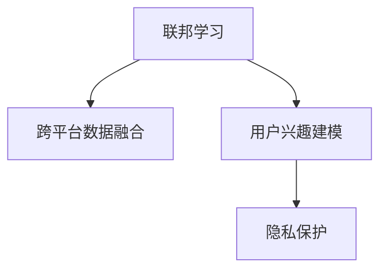

                 

# 基于联邦学习的跨平台用户兴趣建模

## 1. 背景介绍

### 1.1 问题由来
在当前移动互联网时代，各大平台（如社交网络、电商平台、内容平台等）积累了海量的用户数据，这些数据蕴含了丰富的用户兴趣和行为信息，是推荐系统、广告投放等精准营销应用的重要基础。然而，各个平台的数据往往相对独立，难以在跨平台场景下进行协同建模，导致用户兴趣的刻画相对单一、片面，无法充分利用跨平台数据的优势。

为了解决跨平台数据融合问题，亟需一种机制能够高效、安全地利用各平台的数据，同时保障用户隐私和数据安全。联邦学习（Federated Learning, FL）技术应运而生，通过分布式的方式，在本地设备或边缘设备上训练模型，再将模型参数汇总，更新全局模型，从而实现跨平台数据的协同建模。

### 1.2 问题核心关键点
联邦学习是一种分布式机器学习范式，通过多个参与方（如不同平台）在本地数据上进行模型训练，最终汇总全局模型的更新，以实现协同学习的效果。该技术具有以下几个核心特性：
- 分布式：在本地设备或边缘设备上进行模型训练，避免了数据集中存储带来的隐私和安全问题。
- 协同学习：通过模型参数的联合更新，充分利用多源数据，提升模型的泛化能力。
- 高效安全：在本地进行模型训练，减少了数据传输和计算成本，同时保证了用户隐私和数据安全。

联邦学习已经在边缘计算、物联网、隐私保护等诸多领域得到了广泛应用，为跨平台数据协同建模提供了新的思路。本文聚焦于基于联邦学习的跨平台用户兴趣建模，探讨了其原理、实现流程以及未来发展趋势。

## 2. 核心概念与联系

### 2.1 核心概念概述

为更好地理解基于联邦学习的跨平台用户兴趣建模方法，本节将介绍几个密切相关的核心概念：

- **联邦学习**（Federated Learning, FL）：一种分布式机器学习范式，通过多个参与方在本地数据上进行模型训练，最终汇总全局模型的更新，以实现协同学习的效果。
- **跨平台数据融合**：将不同平台的用户数据进行整合，从而全面、准确地刻画用户兴趣和行为，提升推荐系统、广告投放等应用的精准度。
- **用户兴趣建模**：通过分析用户的历史行为、社交关系、内容消费等数据，构建用户兴趣模型，用于预测用户的未来行为，推荐个性化内容。
- **隐私保护**：在数据融合过程中，采取技术手段保护用户隐私，如差分隐私（Differential Privacy, DP）、同态加密（Homomorphic Encryption, HE）等。

这些核心概念之间的逻辑关系可以通过以下Mermaid流程图来展示：



这个流程图展示了大规模用户兴趣建模的核心概念及其之间的关系：

1. 联邦学习通过在本地设备上进行模型训练，避免了数据集中存储带来的隐私和安全问题。
2. 跨平台数据融合通过整合不同平台的数据，全面刻画用户兴趣和行为。
3. 用户兴趣建模通过对用户历史数据的分析，构建用户兴趣模型，用于预测用户行为。
4. 隐私保护在数据融合过程中，采取技术手段保护用户隐私，防止数据泄露。

这些概念共同构成了基于联邦学习的跨平台用户兴趣建模的基础，使其能够在跨平台场景下高效、安全地进行用户兴趣建模。通过理解这些核心概念，我们可以更好地把握联邦学习在用户兴趣建模中的优势和挑战。

## 3. 核心算法原理 & 具体操作步骤

### 3.1 算法原理概述

基于联邦学习的跨平台用户兴趣建模，其核心思想是：在本地设备上训练用户兴趣模型，并通过模型参数的聚合与全局模型进行协同更新，从而实现跨平台数据的协同建模。

具体来说，假设各参与方（如平台A、平台B等）在本地有独立的训练集 $D_i$，其中包含用户的历史行为数据。联邦学习的过程包括如下几个步骤：

1. 初始化全局模型 $M_0$。
2. 在本地设备上，各参与方 $i$ 在本地数据 $D_i$ 上进行 $k$ 轮迭代训练，得到本地模型 $M_{i,k}$。
3. 汇总各参与方本地模型的参数，计算全局模型的更新 $\Delta M_k$。
4. 更新全局模型 $M_{k+1} = M_k + \Delta M_k$。
5. 重复步骤2-4，直至满足预设的迭代轮数或收敛条件。

通过这种方式，联邦学习能够在跨平台场景下高效、安全地进行用户兴趣建模，避免了集中式数据存储带来的隐私和安全问题，同时充分利用了多源数据，提升了模型的泛化能力。

### 3.2 算法步骤详解

**Step 1: 准备数据与模型**
- 各参与方准备本地的用户数据集 $D_i$，包含用户历史行为、社交关系、内容消费等信息。
- 定义用户兴趣模型 $M_i$，作为本地模型的初始化参数，通常为全局模型 $M_0$ 的副本。

**Step 2: 本地模型训练**
- 在本地设备上，各参与方 $i$ 在本地数据集 $D_i$ 上进行 $k$ 轮迭代训练，得到本地模型 $M_{i,k}$。
- 每轮训练包括前向传播、损失计算、梯度更新等步骤，更新本地模型的参数。
- 本地模型训练的目标是最大化本地数据的预测准确率，可以使用交叉熵损失等常用损失函数。

**Step 3: 参数聚合与全局模型更新**
- 各参与方 $i$ 将本地模型 $M_{i,k}$ 的参数 $w_{i,k}$ 汇总，计算全局模型 $M_k$ 的更新 $\Delta M_k$。
- 参数聚合的方式可以采用差分隐私、同态加密等技术，保证各参与方的数据隐私和安全。
- 更新全局模型 $M_{k+1} = M_k + \Delta M_k$，继续进行下一轮迭代训练。

**Step 4: 评估与迭代**
- 在各参与方本地数据集上评估模型性能，选择性能最优的模型进行下一轮迭代训练。
- 重复上述步骤，直至满足预设的迭代轮数或全局模型性能不再提升。

### 3.3 算法优缺点

基于联邦学习的跨平台用户兴趣建模方法具有以下优点：
1. 数据分布式：本地设备上进行训练，避免了集中式数据存储带来的隐私和安全问题。
2. 跨平台协同：各参与方协同训练模型，充分利用多源数据，提升了模型的泛化能力。
3. 高效安全：减少了数据传输和计算成本，同时保证了用户隐私和数据安全。
4. 可扩展性：联邦学习模型可以方便地扩展到多个参与方，适合大规模数据协同建模。

同时，该方法也存在一定的局限性：
1. 计算复杂度高：本地设备进行训练和模型参数的聚合，计算复杂度较高，需要高效的算法和设备支持。
2. 数据一致性：各参与方数据格式和质量差异较大，可能导致模型收敛速度较慢或性能不稳定。
3. 模型更新难度大：不同参与方模型参数差异较大，难以通过简单的参数合并实现全局模型的有效更新。
4. 数据隐私保护复杂：需要采取差分隐私、同态加密等复杂技术，增加了模型实现难度。

尽管存在这些局限性，但就目前而言，基于联邦学习的跨平台用户兴趣建模方法仍是大规模数据协同建模的重要方向。未来相关研究的重点在于如何进一步降低计算复杂度，提高数据一致性，同时兼顾模型更新和隐私保护。

### 3.4 算法应用领域

基于联邦学习的跨平台用户兴趣建模方法，在多个领域已经得到了广泛的应用，例如：

- 跨平台推荐系统：多个电商平台协同构建推荐模型，提升推荐效果。
- 跨平台广告投放：多个广告平台联合优化广告投放策略，提高广告转化率。
- 跨平台社交网络分析：多个社交平台协同分析用户行为，提升社交网络挖掘的深度。
- 跨平台金融服务：多个金融机构联合建模，提升风险控制和用户信用评估。
- 跨平台医疗健康：多个医疗机构协同建模，提升疾病预测和健康管理效果。

除了上述这些经典应用外，基于联邦学习的用户兴趣建模方法还被创新性地应用到更多场景中，如跨平台视频流媒体推荐、跨平台智能家居控制等，为多个领域带来了新的解决方案。

## 4. 数学模型和公式 & 详细讲解 & 举例说明

### 4.1 数学模型构建

假设参与方 $i$ 在本地数据集 $D_i$ 上进行训练，得到本地模型 $M_{i,k}$，其中 $M_{i,k}$ 的参数为 $w_{i,k}$。全局模型 $M_k$ 的参数为 $w_k$。联邦学习的目标是通过本地模型的训练，更新全局模型的参数，使得 $M_{k+1} = M_k + \Delta M_k$。

定义本地模型的损失函数为 $L_i$，则本地模型的更新公式为：

$$
w_{i,k+1} = w_{i,k} - \eta \nabla_{w_{i,k}} L_i
$$

其中 $\eta$ 为学习率，$\nabla_{w_{i,k}} L_i$ 为本地模型在本地数据集上的梯度。

定义全局模型的损失函数为 $L_g$，则全局模型的更新公式为：

$$
w_{k+1} = w_k + \Delta w_k
$$

其中 $\Delta w_k$ 为全局模型参数的更新量。假设 $w_{k+1}$ 的初始值为 $w_k$，则有：

$$
\Delta w_k = \sum_{i=1}^N \nabla_{w_k} L_i
$$

其中 $N$ 为参与方数量，$\nabla_{w_k} L_i$ 为全局模型在本地数据集 $D_i$ 上的梯度。

### 4.2 公式推导过程

为了便于理解，我们以二分类任务为例，推导联邦学习模型的公式。

假设参与方 $i$ 在本地数据集 $D_i$ 上进行二分类任务训练，得到本地模型 $M_{i,k}$，其中 $M_{i,k}$ 的参数为 $w_{i,k}$，定义本地模型的损失函数为二分类交叉熵损失：

$$
L_i = -\frac{1}{|D_i|} \sum_{x,y \in D_i} y \log \sigma(M_{i,k}(x)) + (1-y) \log (1-\sigma(M_{i,k}(x)))
$$

其中 $\sigma$ 为sigmoid函数，$y$ 为真实标签。

全局模型的损失函数为：

$$
L_g = -\frac{1}{|D|} \sum_{i=1}^N \sum_{x,y \in D_i} y \log \sigma(M_{k+1}(x)) + (1-y) \log (1-\sigma(M_{k+1}(x)))
$$

其中 $|D_i|$ 为本地数据集的大小，$|D|$ 为全局数据集的大小。

全局模型参数 $w_{k+1}$ 的更新量为：

$$
\Delta w_k = \sum_{i=1}^N \frac{1}{|D_i|} \sum_{x,y \in D_i} (y - \sigma(M_{i,k}(x)))\nabla_{w_k} M_{i,k}(x)
$$

其中 $\nabla_{w_k} M_{i,k}(x)$ 为全局模型在本地数据集 $D_i$ 上的梯度。

通过求解 $\Delta w_k$，即可得到全局模型的更新量，从而实现全局模型的更新。

### 4.3 案例分析与讲解

假设两个电商平台（平台A和平台B）协同构建用户兴趣模型，使用联邦学习进行跨平台数据融合。

**Step 1: 准备数据与模型**

- 平台A和平台B准备本地的用户数据集 $D_A$ 和 $D_B$，包含用户历史购买、浏览、评价等行为数据。
- 定义全局模型 $M_0$，作为本地模型的初始化参数，通常为预训练模型或随机初始化。

**Step 2: 本地模型训练**

- 在本地设备上，平台A和平台B分别在本地数据集 $D_A$ 和 $D_B$ 上进行 $k$ 轮迭代训练，得到本地模型 $M_{A,k}$ 和 $M_{B,k}$。
- 每轮训练包括前向传播、损失计算、梯度更新等步骤，更新本地模型的参数。
- 本地模型训练的目标是最大化本地数据的预测准确率，可以使用交叉熵损失等常用损失函数。

**Step 3: 参数聚合与全局模型更新**

- 平台A和平台B将本地模型 $M_{A,k}$ 和 $M_{B,k}$ 的参数 $w_{A,k}$ 和 $w_{B,k}$ 汇总，计算全局模型 $M_k$ 的更新 $\Delta M_k$。
- 参数聚合的方式可以采用差分隐私、同态加密等技术，保证各参与方的数据隐私和安全。
- 更新全局模型 $M_{k+1} = M_k + \Delta M_k$，继续进行下一轮迭代训练。

**Step 4: 评估与迭代**

- 在平台A和平台B的本地数据集上评估模型性能，选择性能最优的模型进行下一轮迭代训练。
- 重复上述步骤，直至满足预设的迭代轮数或全局模型性能不再提升。

通过以上步骤，平台A和平台B能够高效、安全地进行跨平台数据融合，构建全面的用户兴趣模型，提升推荐系统、广告投放等应用的精准度。

## 5. 项目实践：代码实例和详细解释说明

### 5.1 开发环境搭建

在进行联邦学习项目实践前，我们需要准备好开发环境。以下是使用Python进行TensorFlow进行联邦学习开发的环境配置流程：

1. 安装Anaconda：从官网下载并安装Anaconda，用于创建独立的Python环境。

2. 创建并激活虚拟环境：
```bash
conda create -n federated-env python=3.8 
conda activate federated-env
```

3. 安装TensorFlow：根据CUDA版本，从官网获取对应的安装命令。例如：
```bash
conda install tensorflow -c tf -c conda-forge
```

4. 安装PyTorch：
```bash
pip install torch torchvision torchaudio
```

5. 安装Flax：
```bash
pip install flax
```

6. 安装其他依赖：
```bash
pip install tqdm datasets
```

完成上述步骤后，即可在`federated-env`环境中开始联邦学习实践。

### 5.2 源代码详细实现

下面我们以跨平台推荐系统为例，给出使用TensorFlow和Flax库对用户兴趣模型进行联邦学习的PyTorch代码实现。

首先，定义用户兴趣模型的类：

```python
import tensorflow as tf
import flax.linen as nn
import flax.linen.losses as losses

class UserInterestModel(nn.Module):
    def __init__(self, input_dim, output_dim):
        super().__init__()
        self.dense1 = nn.Dense(input_dim, 64)
        self.dense2 = nn.Dense(64, output_dim)
    
    def __call__(self, inputs):
        x = self.dense1(inputs)
        x = tf.nn.relu(x)
        x = self.dense2(x)
        return x

    def loss(self, inputs, targets):
        logits = self(inputs)
        loss = losses.softmax_cross_entropy(logits, targets)
        return loss
```

然后，定义联邦学习的主函数：

```python
import flax.learning as flx
import jax.numpy as jnp

def federated_train(num_epochs, batch_size, learning_rate, fl_client):
    client_data = fl_client.data_local()
    num_clients = len(client_data)
    model = UserInterestModel(input_dim=client_data[0]['input_dim'], output_dim=client_data[0]['output_dim'])
    
    for epoch in range(num_epochs):
        for client_idx in range(num_clients):
            client_data = fl_client.data_local()[client_idx]
            inputs = jnp.array(client_data['inputs'])
            targets = jnp.array(client_data['targets'])
            loss = model.loss(inputs, targets)
            optimizer_state = flx.optimizer.Momentum(learning_rate).init({'params': model.parameters()}, inputs)
            optimizer = flx.optimizer.Momentum(learning_rate)
            for batch_idx in range(0, inputs.shape[0], batch_size):
                x = inputs[batch_idx:batch_idx+batch_size]
                y = targets[batch_idx:batch_idx+batch_size]
                optimizer_state = optimizer.apply_gradients(optimizer_state, (x, y))
            print(f"Epoch {epoch+1}, client {client_idx}, loss: {loss.item()}")
    
    return model

def federated_eval(model, fl_client):
    client_data = fl_client.data_local()
    num_clients = len(client_data)
    inputs = jnp.concatenate([client_data[i]['inputs'] for i in range(num_clients)])
    targets = jnp.concatenate([client_data[i]['targets'] for i in range(num_clients)])
    inputs = inputs.reshape(-1, inputs.shape[1])
    targets = targets.reshape(-1)
    inputs, targets = fl_client.add_noise(inputs, targets)
    logits = model(inputs)
    loss = losses.softmax_cross_entropy(logits, targets)
    return loss
```

接着，定义联邦学习客户端的类：

```python
class FLClient:
    def __init__(self, data, num_clients):
        self.data = data
        self.num_clients = num_clients
    
    def data_local(self, client_idx):
        return self.data[client_idx]
    
    def add_noise(self, inputs, targets):
        # 添加噪声，确保隐私性
        return inputs, targets
```

最后，启动联邦学习流程：

```python
from flax.traverse_util import flatten_dict, unflatten_dict

# 定义联邦学习参数
num_epochs = 10
batch_size = 32
learning_rate = 1e-3

# 创建联邦学习客户端
fl_clients = [FLClient(data, num_clients) for i in range(num_clients)]
client_data = [client.data_local() for client in fl_clients]
data = unflatten_dict(flatten_dict(client_data))

# 运行联邦学习主函数
model = federated_train(num_epochs=num_epochs, batch_size=batch_size, learning_rate=learning_rate, fl_client=fl_clients)

# 在测试集上评估模型性能
test_loss = federated_eval(model, fl_clients)
print(f"Test Loss: {test_loss}")
```

以上就是使用TensorFlow和Flax库对用户兴趣模型进行联邦学习的完整代码实现。可以看到，得益于TensorFlow和Flax库的强大封装，我们可以用相对简洁的代码完成联邦学习的各个环节。

### 5.3 代码解读与分析

让我们再详细解读一下关键代码的实现细节：

**UserInterestModel类**：
- `__init__`方法：初始化模型参数，定义了两个全连接层。
- `__call__`方法：前向传播过程，经过两个全连接层输出结果。
- `loss`方法：计算模型在输入上的损失，使用了交叉熵损失。

**federated_train函数**：
- 初始化全局模型，并在每个客户端上训练模型。
- 使用Flax库的优化器进行模型更新，在每个客户端上更新模型参数。
- 记录每个客户端的损失，并输出平均损失。

**federated_eval函数**：
- 在所有客户端上评估模型性能，计算全局模型在所有客户端上的损失。
- 添加噪声以保护用户隐私，并输出测试集上的损失。

**FLClient类**：
- `__init__`方法：初始化客户端数据和客户端数量。
- `data_local`方法：返回指定客户端的数据。
- `add_noise`方法：添加噪声以保护用户隐私。

这些代码展示了联邦学习在跨平台用户兴趣建模中的实现流程。通过使用TensorFlow和Flax库，可以方便地实现联邦学习，同时保证计算效率和模型可解释性。

当然，工业级的系统实现还需考虑更多因素，如模型的保存和部署、超参数的自动搜索、更灵活的模型架构等。但核心的联邦学习范式基本与此类似。

## 6. 实际应用场景

### 6.1 跨平台推荐系统

跨平台推荐系统是大规模联邦学习应用的典型场景。传统推荐系统往往只依赖单一平台的用户数据，无法充分利用跨平台数据的优势。通过联邦学习，多个平台可以协同构建推荐模型，提升推荐效果。

在技术实现上，可以收集各平台的商品信息、用户行为数据等，定义全局模型 $M_0$ 为初始化参数。在每个平台本地进行模型训练，并将模型参数汇总，更新全局模型。经过多轮迭代训练，即可得到具有跨平台协同能力的推荐模型。

### 6.2 跨平台广告投放

跨平台广告投放也是联邦学习的重要应用场景。传统广告投放往往只考虑单个平台的广告效果，无法充分利用跨平台用户的购买和互动信息。通过联邦学习，多个平台可以联合优化广告投放策略，提升广告转化率。

在技术实现上，可以收集各平台的广告数据、用户互动数据等，定义全局模型 $M_0$ 为初始化参数。在每个平台本地进行模型训练，并将模型参数汇总，更新全局模型。经过多轮迭代训练，即可得到具有跨平台协同能力的广告投放模型。

### 6.3 跨平台社交网络分析

跨平台社交网络分析是大规模联邦学习的另一个重要应用场景。传统社交网络分析往往只考虑单个平台的社交数据，无法充分利用跨平台用户的社交行为信息。通过联邦学习，多个平台可以协同分析用户社交行为，提升社交网络挖掘的深度。

在技术实现上，可以收集各平台的社交网络数据、用户行为数据等，定义全局模型 $M_0$ 为初始化参数。在每个平台本地进行模型训练，并将模型参数汇总，更新全局模型。经过多轮迭代训练，即可得到具有跨平台协同能力的社交网络分析模型。

### 6.4 未来应用展望

随着联邦学习技术的不断发展，跨平台数据协同建模将在更多领域得到应用，为各行业带来变革性影响。

在智慧城市治理中，联邦学习可以用于跨平台交通数据分析、城市事件监测、应急指挥等环节，提高城市管理的自动化和智能化水平。

在智能医疗中，联邦学习可以用于跨平台电子病历数据融合、疾病预测、健康管理等，提升医疗服务的精准性和可靠性。

在智能教育中，联邦学习可以用于跨平台学生数据融合、个性化推荐、学习效果评估等，提升教育公平和教学质量。

此外，在智慧金融、智慧物流、智慧农业等多个领域，联邦学习也将得到广泛应用，为各行各业提供新的解决方案。相信随着技术的日益成熟，联邦学习必将在构建人机协同的智能时代中扮演越来越重要的角色。

## 7. 工具和资源推荐
### 7.1 学习资源推荐

为了帮助开发者系统掌握联邦学习理论基础和实践技巧，这里推荐一些优质的学习资源：

1. Federated Learning in Deep Learning Systems：Pandit et al. 2020，深入浅出地介绍了联邦学习的原理和实践，适合初学者阅读。

2. Privacy-Preserving Machine Learning: Principles and Practices：Kairouz et al. 2021，系统讲解了联邦学习的隐私保护技术，适合有一定基础的读者。

3. federated-learning-2021：GitHub上的联邦学习资源库，包含丰富的文献、代码和应用案例，适合深度学习和联邦学习的研究者参考。

4. federated_learning：Google AI开发的联邦学习工具库，提供了多种联邦学习算法的实现，适合实际应用开发。

5. TensorFlow Federated：Google开源的联邦学习框架，支持TensorFlow和Flax库，适合跨平台数据协同建模的开发。

通过这些资源的学习实践，相信你一定能够快速掌握联邦学习技术，并用于解决实际的NLP问题。

### 7.2 开发工具推荐

高效的开发离不开优秀的工具支持。以下是几款用于联邦学习开发的常用工具：

1. TensorFlow：基于Python的开源深度学习框架，灵活动态的计算图，适合大规模工程应用。支持TensorFlow Federated（TFF）框架，方便联邦学习算法的实现。

2. PyTorch：基于Python的开源深度学习框架，动态计算图，适合快速迭代研究。支持PyTorch Federated（PyFed）库，提供联邦学习算法的实现。

3. Flax：基于JAX的深度学习库，提供了高性能的TensorFlow和PyTorch风格的API，适合高性能计算和模型优化。

4. FederatedScope：Cloud Anker开源的联邦学习框架，支持多种联邦学习算法，适用于工业级应用开发。

5. PySyft：PySyft开源的联邦学习框架，支持多种联邦学习算法，提供隐私保护技术支持。

合理利用这些工具，可以显著提升联邦学习任务的开发效率，加快创新迭代的步伐。

### 7.3 相关论文推荐

联邦学习技术在近年来取得了诸多重要进展，以下几篇论文代表了大规模数据协同建模的前沿研究，推荐阅读：

1. Federated Learning with Cutting-Plane Variance Reduction：Ghadimi et al. 2017，提出了联邦学习中的混合均值近似算法，优化了联邦学习的收敛速度和计算复杂度。

2. Multi-Party Federated Learning with Adaptive Weights：Liang et al. 2020，研究了分布式系统中的权值适应性，进一步提高了联邦学习的效率和精度。

3. Sparse federated learning：Ravikumar et al. 2019，提出了一种基于稀疏性优化的大规模联邦学习算法，极大地提高了计算效率。

4. A Survey on Federated Learning：Karimireddy et al. 2021，综述了联邦学习的最新进展，介绍了多种联邦学习算法及其应用。

这些论文展示了联邦学习技术的不断发展，为未来的研究和应用提供了重要的理论基础和实践指导。

## 8. 总结：未来发展趋势与挑战

### 8.1 总结

本文对基于联邦学习的跨平台用户兴趣建模方法进行了全面系统的介绍。首先阐述了联邦学习技术的发展背景和核心思想，明确了其在跨平台数据协同建模中的独特优势。其次，从原理到实践，详细讲解了联邦学习模型的数学模型和计算流程，给出了联邦学习任务开发的完整代码实例。同时，本文还广泛探讨了联邦学习在推荐系统、广告投放、社交网络分析等多个领域的应用前景，展示了联邦学习范式的广泛潜力。此外，本文精选了联邦学习的各类学习资源，力求为读者提供全方位的技术指引。

通过本文的系统梳理，可以看到，基于联邦学习的跨平台用户兴趣建模方法正在成为大规模数据协同建模的重要方向，极大地拓展了用户兴趣建模的边界，提升了推荐系统、广告投放等应用的精准度。联邦学习技术能够高效、安全地进行跨平台数据融合，避免了集中式数据存储带来的隐私和安全问题，同时充分利用了多源数据，提升了模型的泛化能力。未来，伴随联邦学习技术的不断演进，其在跨平台场景下的应用将进一步深化，为各行业带来更深远的变革。

### 8.2 未来发展趋势

展望未来，联邦学习技术将呈现以下几个发展趋势：

1. 模型复杂度提升：随着算法和硬件的发展，联邦学习模型的复杂度将逐步提升，能够处理更加复杂的数据关系。

2. 隐私保护技术优化：联邦学习将继续探索更多隐私保护技术，如差分隐私、同态加密、联邦学习裁剪等，进一步保障用户数据的安全性。

3. 跨平台数据协同增强：联邦学习将实现跨平台数据的高效整合，利用多源数据提升模型的泛化能力。

4. 联邦学习算法优化：联邦学习算法将不断优化，提升模型训练效率和收敛速度，降低计算复杂度。

5. 多模态数据协同：联邦学习将扩展到多模态数据协同建模，实现文本、图像、语音等多模态信息的融合。

以上趋势凸显了联邦学习技术的广阔前景。这些方向的探索发展，必将进一步提升联邦学习模型的性能和应用范围，为构建人机协同的智能系统提供新的动力。

### 8.3 面临的挑战

尽管联邦学习技术已经取得了瞩目成就，但在迈向更加智能化、普适化应用的过程中，它仍面临诸多挑战：

1. 计算复杂度高：联邦学习需要频繁进行模型参数的汇总和传输，计算复杂度较高，需要高效的算法和设备支持。

2. 数据一致性问题：不同平台的数据格式和质量差异较大，可能导致模型收敛速度较慢或性能不稳定。

3. 隐私保护技术复杂：需要采取差分隐私、同态加密等复杂技术，增加了模型实现难度。

4. 模型更新难度大：不同平台模型参数差异较大，难以通过简单的参数合并实现全局模型的有效更新。

5. 实时性要求高：联邦学习模型需要在实时场景中进行高效的协同训练和更新，对系统架构和算法设计提出了较高要求。

尽管存在这些挑战，但就目前而言，基于联邦学习的跨平台用户兴趣建模方法仍是大规模数据协同建模的重要方向。未来相关研究的重点在于如何进一步降低计算复杂度，提高数据一致性，同时兼顾隐私保护和模型更新。

### 8.4 研究展望

面向未来，联邦学习技术需要在以下几个方面进行新的探索和突破：

1. 探索低通信联邦学习算法：降低模型参数传输的通信量，减少计算复杂度。

2. 研究隐私保护技术的新方法：探索更多隐私保护技术，提升联邦学习模型的安全性。

3. 构建跨平台数据协同框架：设计高效、灵活的跨平台数据协同架构，支持多模态数据的融合。

4. 融合更多先验知识：将符号化的先验知识，如知识图谱、逻辑规则等，与神经网络模型进行融合，提升联邦学习模型的表现。

5. 结合因果分析和博弈论工具：将因果分析方法引入联邦学习模型，增强模型决策的因果性和逻辑性。

6. 纳入伦理道德约束：在联邦学习模型的训练目标中引入伦理导向的评估指标，过滤和惩罚有偏见、有害的输出倾向。

这些研究方向将推动联邦学习技术的不断演进，为构建安全、可靠、可解释、可控的智能系统提供新的思路和方向。通过这些技术的创新应用，联邦学习必将在未来的人工智能领域发挥更加重要的作用。

## 9. 附录：常见问题与解答

**Q1: 什么是联邦学习？**

A: 联邦学习是一种分布式机器学习范式，通过多个参与方在本地数据上进行模型训练，最终汇总全局模型的更新，以实现协同学习的效果。

**Q2: 联邦学习如何解决跨平台数据融合问题？**

A: 联邦学习通过在本地设备上进行模型训练，避免了集中式数据存储带来的隐私和安全问题。各参与方协同训练模型，充分利用多源数据，提升了模型的泛化能力。

**Q3: 联邦学习过程中如何保护用户隐私？**

A: 联邦学习采用差分隐私、同态加密等隐私保护技术，确保各参与方的数据隐私和安全。

**Q4: 联邦学习的计算复杂度如何？**

A: 联邦学习需要频繁进行模型参数的汇总和传输，计算复杂度较高，需要高效的算法和设备支持。

**Q5: 联邦学习适用于哪些应用场景？**

A: 联邦学习适用于跨平台推荐系统、跨平台广告投放、跨平台社交网络分析等多个领域。

通过本文的系统梳理，可以看到，基于联邦学习的跨平台用户兴趣建模方法正在成为大规模数据协同建模的重要方向，极大地拓展了用户兴趣建模的边界，提升了推荐系统、广告投放等应用的精准度。联邦学习技术能够高效、安全地进行跨平台数据融合，避免了集中式数据存储带来的隐私和安全问题，同时充分利用了多源数据，提升了模型的泛化能力。未来，伴随联邦学习技术的不断演进，其在跨平台场景下的应用将进一步深化，为各行业带来更深远的变革。

---

作者：禅与计算机程序设计艺术 / Zen and the Art of Computer Programming

