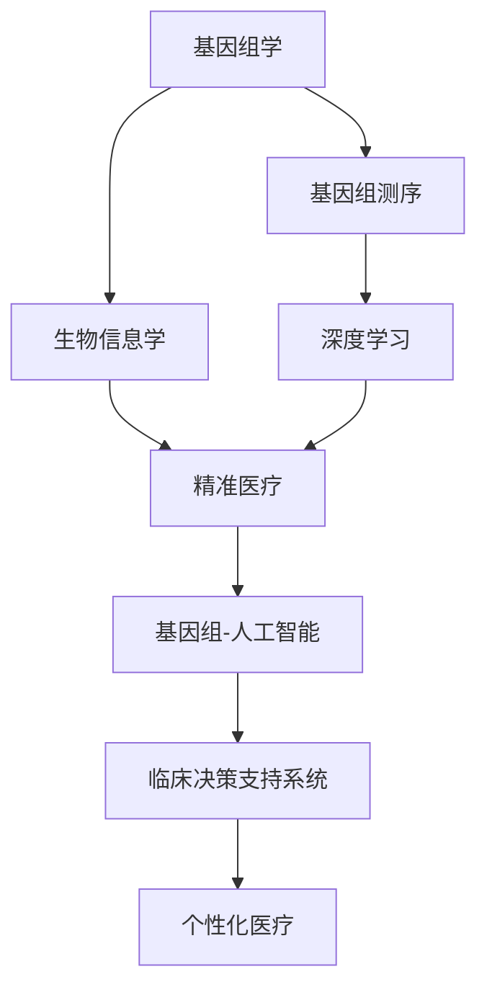

                 

# 基因科技创业：个性化医疗的新时代

> 关键词：基因科技,个性化医疗,人工智能,精准医疗,生物信息学,深度学习

## 1. 背景介绍

### 1.1 问题由来
随着医学科技的飞速发展，个性化医疗逐渐成为医疗领域的一大趋势。传统的“一刀切”式治疗模式已经无法满足人们对健康和高质量生活的需求。基因科技的崛起，为实现精准医疗、个性化治疗提供了新的可能性。

然而，尽管基因科技在遗传学研究中取得了许多突破，但在实际应用中，仍面临诸多挑战：

1. 基因组数据的庞大和复杂性使得数据分析和管理成本高昂。
2. 现有基因检测技术的精度和可靠性尚未达到理想水平。
3. 缺乏将基因信息转化为临床决策的算法和工具。
4. 基因数据的隐私和安全问题亟需解决。
5. 如何将基因信息与医疗记录、环境因素等综合分析，为个体提供个性化治疗建议。

因此，结合人工智能、生物信息学等前沿技术，推进基因科技在个性化医疗中的应用，成为当务之急。

### 1.2 问题核心关键点
个性化医疗的核心在于基于基因组信息，结合患者的生活习惯、环境因素、病史等信息，为每个患者量身定制最适合的治疗方案。关键点包括：

- **基因组测序和数据分析**：通过高通量测序技术获取全基因组序列，使用生物信息学工具分析基因变异、功能基因等关键信息。
- **人工智能算法**：结合机器学习、深度学习等算法，对基因组数据进行模式识别和关联分析，挖掘其中的生物学意义和临床价值。
- **临床决策支持系统**：将基因组数据和AI分析结果应用于临床决策，提供个性化的治疗建议和用药方案。
- **隐私和安全保护**：确保基因数据的存储和传输安全，保障患者隐私。

本文将聚焦于基因组数据分析与AI结合的个性化医疗应用，探讨如何利用人工智能技术提升基因科技的临床价值。

## 2. 核心概念与联系

### 2.1 核心概念概述

为更好地理解基因科技在个性化医疗中的应用，本节将介绍几个关键概念：

- **基因组学**：研究生物遗传信息的一门学科，包括基因组测序、基因表达、基因功能等。
- **基因组测序**：通过高通量测序技术对生物个体的DNA序列进行全面分析，揭示遗传信息。
- **生物信息学**：应用计算机技术和统计学方法，处理和分析基因组数据，揭示基因与疾病之间的关系。
- **深度学习**：一种模拟人脑神经网络的学习方法，通过多层神经网络进行特征提取和模式识别，广泛用于图像、语音、文本等领域。
- **精准医疗**：基于个体基因组信息、环境和生活习惯等数据，为患者提供个性化治疗方案的医疗模式。
- **基因组-人工智能**：将基因组学与人工智能相结合，利用机器学习和深度学习技术，从基因组数据中提取有意义的特征和关联，实现个性化医疗。

这些概念之间的联系通过以下Mermaid流程图来展示：



这个流程图展示了基因组学、基因组测序、生物信息学、深度学习、精准医疗、基因组-人工智能和临床决策支持系统之间的联系：

1. 基因组学为基因组测序提供了科学依据和理论基础。
2. 基因组测序为生物信息学提供了原始数据。
3. 生物信息学通过深度学习技术从基因组数据中提取特征，揭示生物学意义。
4. 深度学习结合生物信息学，构建精准医疗模型，为患者提供个性化治疗方案。
5. 基因组-人工智能技术将基因组数据与临床数据结合，进一步提升个性化医疗的准确性和实用性。
6. 临床决策支持系统将基因组数据和AI分析结果应用于临床决策，实现个性化治疗。

## 3. 核心算法原理 & 具体操作步骤
### 3.1 算法原理概述

基于基因科技的个性化医疗应用，核心算法原理包括基因组数据分析和深度学习算法两大部分。其核心思想是：

1. **基因组数据分析**：从基因组数据中提取特征，如SNP、基因变异、基因表达水平等，揭示与疾病相关的关键基因和通路。
2. **深度学习算法**：通过多层神经网络结构，对基因组数据进行特征提取和模式识别，挖掘基因与疾病之间的关联，为个性化治疗提供数据支持。

形式化地，假设基因组数据为 $G=\{g_1,g_2,...,g_N\}$，其中 $g_i$ 为第 $i$ 个样本的基因组数据。目标是找到最佳的特征集 $X$ 和深度学习模型 $M$，使得模型 $M$ 在数据集 $D$ 上的性能最优。

深度学习模型通常采用自编码器、卷积神经网络(CNN)、循环神经网络(RNN)等结构。模型 $M$ 的训练目标函数为：

$$
\mathcal{L}(M)=\frac{1}{N}\sum_{i=1}^N\ell(M(g_i),y_i)
$$

其中 $\ell$ 为损失函数，通常使用交叉熵损失、均方误差损失等。

### 3.2 算法步骤详解

基于基因科技的个性化医疗应用，其算法步骤主要包括以下几个关键步骤：

**Step 1: 数据收集与预处理**
- 收集患者的基因组数据、临床数据和生活习惯数据，确保数据的多样性和全面性。
- 对数据进行清洗和标准化处理，去除噪声和异常值，确保数据的准确性和一致性。

**Step 2: 特征提取与选择**
- 使用生物信息学工具对基因组数据进行特征提取，如SNP、基因变异、基因表达水平等。
- 应用特征选择算法，如Lasso、RFE等，选择与疾病最相关的特征。

**Step 3: 模型训练与优化**
- 选择合适的深度学习模型结构，如自编码器、CNN、RNN等，进行模型训练。
- 设置合适的超参数，如学习率、批大小、迭代轮数等，进行模型优化。
- 应用正则化技术，如L2正则、Dropout等，防止模型过拟合。

**Step 4: 模型评估与验证**
- 在验证集上评估模型的性能，如准确率、召回率、F1分数等指标。
- 根据评估结果，调整模型参数和超参数，进一步优化模型性能。

**Step 5: 临床决策支持**
- 将训练好的模型应用于临床决策，提供个性化的治疗方案和用药建议。
- 结合临床医生的经验和判断，综合分析基因数据和AI分析结果，制定最终治疗方案。

### 3.3 算法优缺点

基于基因科技的个性化医疗应用，具有以下优点：

1. 精准度高。通过基因组数据分析和深度学习技术，可以挖掘出与疾病相关的关键基因和通路，为个性化治疗提供科学依据。
2. 预测能力强。深度学习模型能够处理复杂的非线性关系，挖掘基因数据中的隐藏模式，提供准确的疾病预测和诊断。
3. 可解释性强。深度学习模型通过可视化工具，可以直观展示特征重要性，帮助临床医生理解模型决策过程。

但同时也存在以下局限：

1. 数据依赖性强。基因组数据的获取和分析成本高昂，缺乏高质量、大规模的基因数据，难以进行大样本分析。
2. 模型复杂度高。深度学习模型参数量庞大，计算复杂度高，训练和推理速度较慢。
3. 解释性不足。深度学习模型通常被视为“黑盒”，缺乏可解释性，难以进行透明化的临床决策。
4. 伦理和隐私问题。基因数据的隐私和安全问题亟需解决，避免数据泄露和滥用。

### 3.4 算法应用领域

基于基因科技的个性化医疗应用，已经广泛应用于多个领域，例如：

- **癌症治疗**：通过基因组数据分析，确定肿瘤的突变基因和通路，为患者提供精准的靶向治疗方案。
- **遗传病诊断**：利用基因组数据，提前发现携带有遗传病基因的个体，采取预防措施。
- **罕见病治疗**：通过基因组数据分析，揭示罕见病的基因突变，研发个性化药物。
- **产前基因检测**：利用孕妇的基因组数据，评估胎儿的遗传风险，提供孕期管理方案。
- **慢性病管理**：通过基因组数据分析，预测个体对不同药物的反应，制定个性化的健康管理计划。

## 4. 数学模型和公式 & 详细讲解 & 举例说明
### 4.1 数学模型构建

假设基因组数据为 $G=\{g_1,g_2,...,g_N\}$，其中 $g_i$ 为第 $i$ 个样本的基因组数据。目标是从基因组数据中提取特征 $X$，并使用深度学习模型 $M$ 进行训练和预测。

构建数学模型如下：

1. **特征提取**：
   - **SNP特征**：提取基因组中的单核苷酸多态性(SNP)，记为 $x_{ij}$，表示第 $i$ 个样本的第 $j$ 个SNP位点。
   - **基因变异特征**：提取基因组中的突变基因，记为 $x_{ij}$，表示第 $i$ 个样本的第 $j$ 个突变基因。
   - **基因表达特征**：提取基因组中的基因表达水平，记为 $x_{ij}$，表示第 $i$ 个样本的第 $j$ 个基因的表达水平。

2. **深度学习模型**：
   - **自编码器**：记深度学习模型为 $M=\{\theta\}$，其中 $\theta$ 为模型参数。
   - **编码器**：将特征 $X$ 编码为隐藏表示 $H$。
   - **解码器**：将隐藏表示 $H$ 解码为输出 $Y$。
   - **损失函数**：使用交叉熵损失函数 $\ell$，计算模型预测输出与真实标签 $y$ 之间的差异。
   - **优化目标**：最小化损失函数 $\mathcal{L}(M)=\frac{1}{N}\sum_{i=1}^N\ell(M(X_i),y_i)$。

### 4.2 公式推导过程

以自编码器为例，推导其数学模型和损失函数：

**编码器**：
$$
H = \text{Encoder}(X) = \sigma(\theta_1 \cdot X + \theta_2)
$$
其中，$\sigma$ 为激活函数，$\theta_1$ 和 $\theta_2$ 为编码器参数。

**解码器**：
$$
Y = \text{Decoder}(H) = \text{softmax}(\theta_3 \cdot H + \theta_4)
$$
其中，$\text{softmax}$ 为softmax函数，$\theta_3$ 和 $\theta_4$ 为解码器参数。

**损失函数**：
$$
\ell(X_i, y_i) = -\sum_{j=1}^C y_{ij} \log \hat{y}_{ij}
$$
其中 $C$ 为类别数，$y_{ij}$ 为真实标签，$\hat{y}_{ij}$ 为模型预测输出。

**优化目标**：
$$
\mathcal{L}(M)=\frac{1}{N}\sum_{i=1}^N\ell(M(X_i),y_i)
$$

### 4.3 案例分析与讲解

以癌症治疗为例，分析基于基因组数据分析的个性化治疗方案。

假设患者张三的基因组数据 $g_i$ 中包含多个SNP位点和突变基因，经过特征提取和选择后，得到特征集 $X_i$。利用深度学习模型 $M$，训练得到最优参数 $\theta$。

1. **数据准备**：
   - 收集张三的基因组数据 $g_i$，提取SNP位点和突变基因特征。
   - 获取张三的临床数据，如病史、治疗记录等。

2. **特征提取**：
   - 提取基因组数据中的SNP位点和突变基因，记为 $x_{ij}$。
   - 提取基因组数据中的基因表达水平，记为 $x_{ij}$。

3. **模型训练**：
   - 使用深度学习模型 $M$，训练得到最优参数 $\theta$。
   - 在验证集上评估模型性能，如准确率、召回率、F1分数等指标。

4. **临床决策支持**：
   - 根据训练好的模型 $M$，预测张三的癌症类型和突变基因。
   - 结合临床医生的经验和判断，综合分析基因数据和AI分析结果，制定个性化治疗方案。
   - 根据治疗效果，定期反馈数据，进一步优化模型参数。

## 5. 项目实践：代码实例和详细解释说明
### 5.1 开发环境搭建

在进行基因科技创业时，首先需要搭建开发环境。以下是使用Python进行基因组数据分析和深度学习开发的常用环境配置流程：

1. 安装Anaconda：从官网下载并安装Anaconda，用于创建独立的Python环境。

2. 创建并激活虚拟环境：
```bash
conda create -n gene-dev python=3.8 
conda activate gene-dev
```

3. 安装必要的库：
```bash
conda install biopython numpy pandas scikit-learn torch torchvision torchaudio
```

4. 安装深度学习框架：
```bash
pip install pytorch torchvision torchaudio
```

5. 安装生物信息学工具：
```bash
pip install snakemake samtools
```

完成上述步骤后，即可在`gene-dev`环境中开始基因组数据分析和深度学习开发。

### 5.2 源代码详细实现

这里以基于基因组数据的癌症类型预测为例，给出使用PyTorch进行深度学习模型开发的PyTorch代码实现。

```python
import torch
import torch.nn as nn
import torch.optim as optim
from torch.utils.data import Dataset, DataLoader

class GeneDataset(Dataset):
    def __init__(self, X, y):
        self.X = X
        self.y = y
        
    def __len__(self):
        return len(self.X)
    
    def __getitem__(self, item):
        x = self.X[item]
        y = self.y[item]
        return x, y

# 假设基因组数据 X 和标签 y 已经加载完成
X = ...  # 基因组数据
y = ...  # 标签

# 定义模型结构
class GeneNet(nn.Module):
    def __init__(self, input_dim, hidden_dim, output_dim):
        super(GeneNet, self).__init__()
        self.encoder = nn.Sequential(
            nn.Linear(input_dim, hidden_dim),
            nn.ReLU(),
            nn.Linear(hidden_dim, hidden_dim),
            nn.ReLU()
        )
        self.decoder = nn.Sequential(
            nn.Linear(hidden_dim, output_dim),
            nn.Softmax(dim=1)
        )
    
    def forward(self, x):
        x = self.encoder(x)
        x = self.decoder(x)
        return x

# 定义超参数
input_dim = 1000  # 基因组数据维度
hidden_dim = 500  # 隐藏层维度
output_dim = 10   # 分类标签数量
learning_rate = 0.001
batch_size = 32
epochs = 10

# 初始化模型和优化器
model = GeneNet(input_dim, hidden_dim, output_dim)
optimizer = optim.Adam(model.parameters(), lr=learning_rate)

# 定义损失函数
criterion = nn.CrossEntropyLoss()

# 加载数据集
dataset = GeneDataset(X, y)
dataloader = DataLoader(dataset, batch_size=batch_size, shuffle=True)

# 训练模型
for epoch in range(epochs):
    for batch in dataloader:
        x, y = batch
        optimizer.zero_grad()
        y_pred = model(x)
        loss = criterion(y_pred, y)
        loss.backward()
        optimizer.step()
        
    print(f'Epoch {epoch+1}/{epochs}, Loss: {loss.item()}')
```

以上就是使用PyTorch对基因组数据进行深度学习模型开发的完整代码实现。可以看到，借助Python和PyTorch，基因科技创业的开发变得简单高效。

### 5.3 代码解读与分析

让我们再详细解读一下关键代码的实现细节：

**GeneDataset类**：
- `__init__`方法：初始化基因组数据和标签。
- `__len__`方法：返回数据集的样本数量。
- `__getitem__`方法：对单个样本进行处理，返回基因组数据和标签。

**GeneNet类**：
- `__init__`方法：定义深度学习模型结构，包括编码器和解码器。
- `forward`方法：定义模型前向传播过程。

**训练循环**：
- 使用DataLoader对数据集进行批次化加载，供模型训练和推理使用。
- 每个epoch内，在每个batch上前向传播计算loss并反向传播更新模型参数。
- 周期性在验证集上评估模型性能，根据损失变化调整学习率。
- 重复上述步骤直至满足预设的迭代轮数。

通过以上代码实现，我们可以看到基因科技创业的开发流程与传统深度学习项目并无太大差异，主要区别在于数据集的准备和特征提取步骤。

## 6. 实际应用场景
### 6.1 癌症治疗

基于基因科技的个性化医疗应用，已经在癌症治疗中取得了显著成果。例如，通过基因组数据分析，可以精准地识别肿瘤的突变基因和通路，为患者提供个性化的靶向治疗方案。

具体而言，可以通过基因组测序技术获取肿瘤的基因组数据，结合深度学习模型进行基因变异分析。根据变异基因的通路信息，选择合适的靶向药物进行治疗，取得显著的疗效。

### 6.2 遗传病诊断

遗传病诊断是基因科技在个性化医疗中的另一重要应用。通过基因组数据分析，可以早期发现携带有遗传病基因的个体，提供针对性的预防和治疗方案。

例如，通过基因组测序技术获取个体的基因组数据，结合深度学习模型进行基因变异分析。根据变异基因的类型和位置，评估其致病风险，采取相应的预防措施，如基因筛查、健康管理等。

### 6.3 罕见病治疗

罕见病治疗是基因科技在个性化医疗中的又一重要应用。通过基因组数据分析，可以揭示罕见病的基因突变，研发个性化的药物。

例如，通过基因组测序技术获取罕见病患者的基因组数据，结合深度学习模型进行基因变异分析。根据突变基因的通路信息，研发针对该罕见病的个性化药物，取得显著的疗效。

### 6.4 未来应用展望

随着基因科技和深度学习技术的发展，基于基因组数据分析的个性化医疗应用将不断拓展。未来，基因科技创业将面临更多的挑战和机遇：

1. **数据共享和隐私保护**：基因数据涉及个人隐私，如何在保护隐私的前提下，实现数据共享和利用，将是一个重要的研究方向。
2. **多模态数据融合**：将基因数据与其他医学数据（如影像、病理、生理数据）结合，进行综合分析，提升个性化医疗的精度和可靠性。
3. **深度学习模型的可解释性**：开发具有可解释性的深度学习模型，帮助临床医生理解模型的决策过程，增强治疗方案的可信度。
4. **临床决策支持系统的自动化**：结合人工智能技术，构建自动化的临床决策支持系统，减少临床医生的工作负担，提升治疗效果。
5. **基因组-人工智能的协同创新**：推动基因科技和人工智能技术的深度融合，构建新型的生物信息学工具，促进个性化医疗的发展。

## 7. 工具和资源推荐
### 7.1 学习资源推荐

为了帮助开发者系统掌握基因科技在个性化医疗中的应用，这里推荐一些优质的学习资源：

1. **《基因组学与生物信息学》**：介绍基因组学和生物信息学的基础知识和应用案例。
2. **《深度学习在生物信息学中的应用》**：讲解深度学习技术在基因组数据分析和疾病预测中的应用。
3. **Coursera《基因组学与生物信息学》课程**：斯坦福大学开设的课程，系统讲解基因组学和生物信息学的基础知识和前沿技术。
4. **Kaggle《基因组数据分析竞赛》**：通过实际竞赛项目，实践基因组数据分析和深度学习技术。
5. **UC Berkeley《基因组学导论》课程**：介绍基因组学的基本概念和实验技术，适合初学者入门。

通过对这些资源的学习实践，相信你一定能够快速掌握基因科技在个性化医疗中的应用，并用于解决实际的基因组数据分析问题。

### 7.2 开发工具推荐

高效的开发离不开优秀的工具支持。以下是几款用于基因科技创业开发的常用工具：

1. **Python**：Python是目前最流行的编程语言之一，适合进行基因组数据分析和深度学习开发。
2. **Anaconda**：用于创建独立的Python环境，方便管理项目依赖和工具版本。
3. **PyTorch**：开源深度学习框架，支持动态计算图，适合构建复杂神经网络模型。
4. **BioPython**：Python生物信息学库，提供丰富的基因组数据分析工具。
5. **SNAPpy**：基因组数据可视化工具，方便展示基因组数据的特征和关联。
6. **SAMtools**：基因组数据处理工具，支持高效的基因组比对和数据格式化。

合理利用这些工具，可以显著提升基因科技创业的开发效率，加快创新迭代的步伐。

### 7.3 相关论文推荐

基因科技和个性化医疗领域的研究方兴未艾，以下是几篇奠基性的相关论文，推荐阅读：

1. **《Genomic Data Analysis》**：介绍基因组数据的收集、预处理和分析技术。
2. **《Deep Learning for Genomics》**：讲解深度学习技术在基因组数据分析中的应用。
3. **《Cancer Genomics》**：介绍癌症基因组学的基础知识和应用案例。
4. **《Precision Medicine》**：讨论个性化医疗的概念和实现方法。
5. **《Predictive Genomics》**：探讨基因组数据在疾病预测中的应用。

这些论文代表了大数据和深度学习技术在基因科技中的最新进展，通过学习这些前沿成果，可以帮助研究者把握学科前进方向，激发更多的创新灵感。

## 8. 总结：未来发展趋势与挑战
### 8.1 研究成果总结

基因科技创业在个性化医疗领域已经取得了显著进展，通过基因组数据分析和深度学习技术，为患者提供了个性化的治疗方案，显著提升了医疗效果。

### 8.2 未来发展趋势

展望未来，基因科技创业将呈现以下几个发展趋势：

1. **深度学习模型的可解释性**：开发具有可解释性的深度学习模型，帮助临床医生理解模型的决策过程，增强治疗方案的可信度。
2. **多模态数据的融合**：将基因数据与其他医学数据（如影像、病理、生理数据）结合，进行综合分析，提升个性化医疗的精度和可靠性。
3. **临床决策支持系统的自动化**：结合人工智能技术，构建自动化的临床决策支持系统，减少临床医生的工作负担，提升治疗效果。
4. **基因组-人工智能的协同创新**：推动基因科技和人工智能技术的深度融合，构建新型的生物信息学工具，促进个性化医疗的发展。
5. **数据共享和隐私保护**：在保护隐私的前提下，实现数据共享和利用，推动基因科技创业的快速发展。

### 8.3 面临的挑战

尽管基因科技创业在个性化医疗领域已经取得了一定的进展，但在迈向更加智能化、普适化应用的过程中，仍然面临诸多挑战：

1. **数据依赖性强**：基因组数据的获取和分析成本高昂，缺乏高质量、大规模的基因数据，难以进行大样本分析。
2. **模型复杂度高**：深度学习模型参数量庞大，计算复杂度高，训练和推理速度较慢。
3. **解释性不足**：深度学习模型通常被视为“黑盒”，缺乏可解释性，难以进行透明化的临床决策。
4. **伦理和隐私问题**：基因数据的隐私和安全问题亟需解决，避免数据泄露和滥用。
5. **技术门槛高**：基因科技创业需要跨学科的知识，需要具备丰富的生物信息学和深度学习知识，技术门槛较高。

### 8.4 研究展望

面对基因科技创业所面临的挑战，未来的研究需要在以下几个方面寻求新的突破：

1. **开发可解释性更强的深度学习模型**：引入因果推断和对比学习思想，增强模型的可解释性，帮助临床医生理解模型的决策过程。
2. **构建多模态数据融合模型**：开发能够处理多种类型数据（如基因数据、影像数据、生理数据等）的深度学习模型，提升个性化医疗的精度和可靠性。
3. **推动基因组数据共享和保护**：在保护隐私的前提下，推动基因组数据的共享和利用，构建新型的生物信息学工具，促进个性化医疗的发展。
4. **开发自动化临床决策支持系统**：结合人工智能技术，构建自动化的临床决策支持系统，提升医疗服务的智能化水平。
5. **推动基因科技与产业的结合**：将基因科技与产业应用紧密结合，加速基因组数据的转化，推动基因科技的产业化进程。

## 9. 附录：常见问题与解答

**Q1：基因科技创业在个性化医疗中面临哪些挑战？**

A: 基因科技创业在个性化医疗中面临以下挑战：
1. 数据依赖性强：基因组数据的获取和分析成本高昂，缺乏高质量、大规模的基因数据，难以进行大样本分析。
2. 模型复杂度高：深度学习模型参数量庞大，计算复杂度高，训练和推理速度较慢。
3. 解释性不足：深度学习模型通常被视为“黑盒”，缺乏可解释性，难以进行透明化的临床决策。
4. 伦理和隐私问题：基因数据的隐私和安全问题亟需解决，避免数据泄露和滥用。
5. 技术门槛高：基因科技创业需要跨学科的知识，需要具备丰富的生物信息学和深度学习知识，技术门槛较高。

**Q2：如何提升基因科技创业的开发效率？**

A: 提升基因科技创业的开发效率，需要关注以下几个方面：
1. 选择合适的开发环境：如使用Anaconda创建独立的Python环境，方便管理项目依赖和工具版本。
2. 使用高效的开发工具：如使用PyTorch进行深度学习开发，提高模型的训练和推理速度。
3. 借鉴已有项目经验：参考已有基因科技创业项目，吸取成功的经验和教训，避免重复工作。
4. 加强团队协作：组建跨学科的团队，分工明确，提高项目的执行效率。
5. 持续学习和迭代：不断学习新的技术方法和工具，持续优化模型和算法，提升项目质量。

**Q3：基因科技创业在实际应用中需要注意哪些问题？**

A: 基因科技创业在实际应用中需要注意以下问题：
1. 数据共享和隐私保护：在保护隐私的前提下，实现数据共享和利用，推动基因科技创业的快速发展。
2. 模型可解释性：开发具有可解释性的深度学习模型，帮助临床医生理解模型的决策过程，增强治疗方案的可信度。
3. 多模态数据融合：将基因数据与其他医学数据（如影像、病理、生理数据）结合，进行综合分析，提升个性化医疗的精度和可靠性。
4. 临床决策支持系统的自动化：结合人工智能技术，构建自动化的临床决策支持系统，减少临床医生的工作负担，提升治疗效果。
5. 技术门槛：基因科技创业需要跨学科的知识，需要具备丰富的生物信息学和深度学习知识，技术门槛较高。

**Q4：如何评估基因科技创业项目的有效性？**

A: 评估基因科技创业项目的有效性，需要关注以下几个指标：
1. 模型的准确性和可靠性：使用准确率、召回率、F1分数等指标评估模型的有效性。
2. 临床决策的支持效果：结合临床医生的经验和判断，综合分析基因数据和AI分析结果，评估治疗方案的效果。
3. 患者满意度和治疗效果：通过患者反馈和随访数据，评估治疗方案的满意度和治疗效果。
4. 成本效益分析：评估项目在资源投入和效益产出之间的平衡，确保项目在经济效益上的可行性。

**Q5：基因科技创业在实际应用中如何确保数据隐私和安全？**

A: 确保基因科技创业在实际应用中的数据隐私和安全，需要关注以下几个方面：
1. 数据加密：对基因数据进行加密处理，确保数据在传输和存储过程中的安全性。
2. 访问控制：设置严格的访问控制机制，确保只有授权人员才能访问和处理基因数据。
3. 匿名化处理：对基因数据进行匿名化处理，防止数据泄露和滥用。
4. 法律合规：确保项目符合相关法律法规，如HIPAA、GDPR等，保障数据隐私和安全。
5. 安全审计：定期进行安全审计和漏洞检测，及时发现和修复潜在的安全问题。

通过以上问题的解答，相信你一定能够更好地理解和应对基因科技创业在个性化医疗领域所面临的挑战，推动基因科技创业项目的顺利开展。

---

作者：禅与计算机程序设计艺术 / Zen and the Art of Computer Programming

