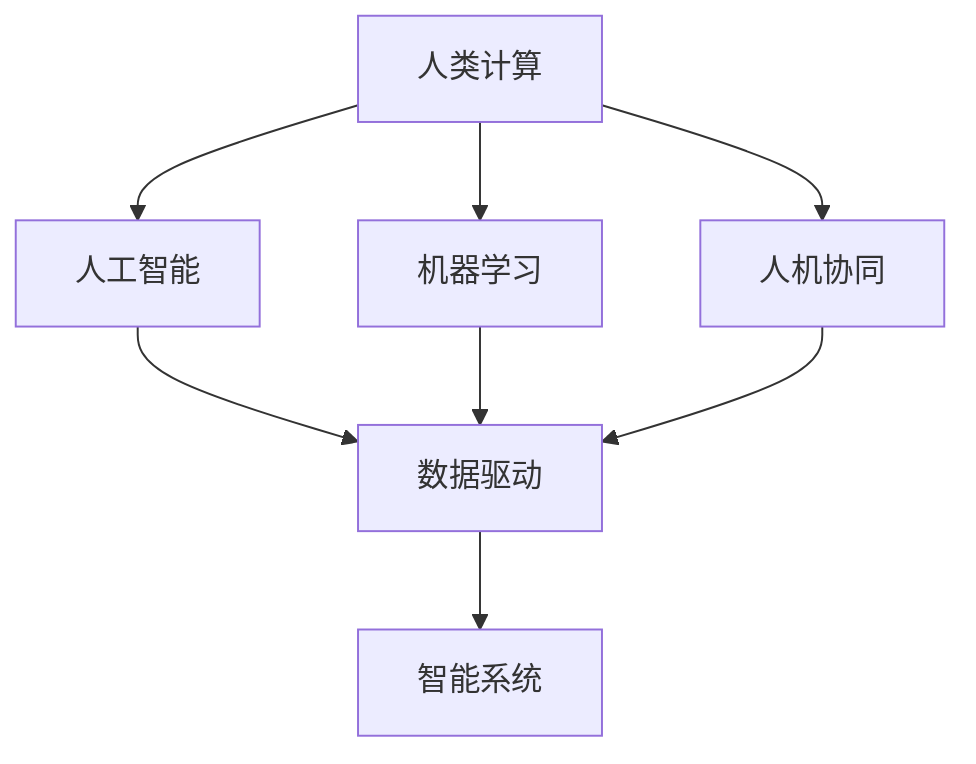

                 

# 塑造数字时代：人类计算的关键作用

## 1. 背景介绍

### 1.1 问题由来

随着人工智能(AI)和机器学习(ML)技术的迅猛发展，数字时代的帷幕已经缓缓拉开。AI技术不仅改变了我们的生产生活方式，也深刻重塑了整个社会的运作模式。然而，尽管机器算法在处理复杂数据、模式识别和预测等方面取得了令人瞩目的成就，人类在计算中依然发挥着不可替代的关键作用。

在数字时代，人类计算的重要性不仅体现在直接的数据处理和算法实现中，更体现在数据理解、模型设计和系统部署等各个环节。如何充分利用人类计算的优势，将AI技术与人类智慧有效结合，实现人工智能与人类智能的协同进化，成为当下亟需探讨和解决的问题。

### 1.2 问题核心关键点

本文聚焦于“人类计算在数字时代中的关键作用”这一核心问题，旨在深入剖析人类计算在数据驱动的智能系统中扮演的角色，探讨其在算法优化、模型设计、系统部署等方面的重要作用。通过分析当前的技术现状和发展趋势，提出未来在人工智能系统中如何更好地利用人类计算的建议和展望。

### 1.3 问题研究意义

研究人类计算在数字时代的关键作用，对于推动人工智能技术的进一步发展，构建人机协同的智能系统，具有重要意义：

1. **提升系统性能**：通过合理设计算法和模型，充分发挥人类计算的创造性和智慧，能够显著提升系统的性能和效果。
2. **增强系统鲁棒性**：在设计和部署过程中充分考虑人类智慧，可以增强系统对异常情况和复杂环境的适应能力。
3. **促进技术创新**：人类智慧与AI技术的结合，能够推动更多创新应用的出现，拓展人工智能的边界。
4. **保障数据安全**：在数据处理和系统设计中引入人类计算，有助于防范数据泄露和隐私侵害，提高系统安全性。
5. **优化用户体验**：合理利用人类计算，可以使系统设计更加人性化，提升用户体验和满意度。

## 2. 核心概念与联系

### 2.1 核心概念概述

为更好地理解人类计算在数字时代的关键作用，本文将介绍几个关键概念：

- **人类计算(Human Computation)**：指利用人类智慧和创造力，进行数据处理、问题求解、系统设计等计算活动。
- **人工智能(AI)**：基于计算机算法，模拟人类智能进行问题求解、决策制定等智能活动的系统。
- **机器学习(ML)**：使计算机系统通过数据学习，不断提升自身性能的技术。
- **人机协同(Human-Machine Collaboration)**：通过结合人类智慧与AI技术，实现人机互补，共同完成复杂任务。
- **数据驱动(数据驱动)**：以数据为基础，通过算法和技术手段，实现智能决策和问题求解。

这些概念之间的逻辑关系可以通过以下Mermaid流程图来展示：



这个流程图展示了人类计算在人工智能系统中的关键作用：

1. 人类计算为人工智能提供了基础的数据和问题定义。
2. 机器学习通过人类定义的数据和问题，学习并提升自身的性能。
3. 数据驱动和人工智能技术共同构建智能系统，实现复杂任务的自动求解。
4. 人机协同将人类智慧与AI技术有效结合，提升系统效果和用户体验。

## 3. 核心算法原理 & 具体操作步骤

### 3.1 算法原理概述

在数字时代，人工智能系统的设计和实现，往往依赖于对大量数据的处理和分析。然而，数据处理本身并非完全自动化，特别是在处理非结构化数据、理解复杂语义和情境等方面，人类计算依然具有不可替代的作用。

人工智能系统的算法原理通常分为两个层面：

1. **数据处理算法**：包括数据清洗、数据预处理、特征工程等，旨在提取有用的信息，为机器学习模型提供高质量的数据输入。
2. **模型设计算法**：如神经网络、决策树、支持向量机等，通过学习数据中的模式，构建能够解决特定问题的模型。

这两个层面的算法设计，都需要充分考虑人类智慧的介入和优化。例如，在数据清洗过程中，人类可以识别和修正数据中的异常值和噪声，提高数据质量。在模型设计过程中，人类可以基于对问题本质的理解，选择最合适的算法，并进行参数调优和模型集成。

### 3.2 算法步骤详解

基于人类计算的关键作用，人工智能系统的设计和实现通常包括以下几个关键步骤：

**Step 1: 数据收集与预处理**
- 收集相关领域的原始数据，并进行清洗和预处理。
- 利用人类智慧识别和修正数据中的异常值和噪声。
- 进行数据标注，为机器学习提供有监督信号。

**Step 2: 特征提取与选择**
- 根据领域知识，设计特征提取算法，提取数据中的关键信息。
- 利用人类智慧选择最相关的特征，提升特征质量。
- 进行特征变换，如降维、归一化等，为后续模型训练做准备。

**Step 3: 模型设计与训练**
- 根据问题类型，选择合适的算法和模型结构。
- 利用人类智慧对模型进行设计优化，如增加/减少层数、调整激活函数等。
- 对模型进行训练，利用数据集进行验证和调优。

**Step 4: 模型评估与部署**
- 使用测试集对模型进行评估，根据指标调整模型参数。
- 将训练好的模型部署到生产环境中，进行大规模应用。
- 实时监控模型性能，根据反馈进行调整和优化。

### 3.3 算法优缺点

人类计算在人工智能系统的设计和实现中，具有以下优点：

1. **增强模型泛化能力**：在数据标注、特征选择和模型调优等环节，人类计算能够帮助机器学习模型更好地理解数据和问题，提升模型的泛化能力。
2. **提升算法效率**：利用人类智慧进行算法优化和设计，能够有效降低计算复杂度，提升系统性能。
3. **增强系统鲁棒性**：通过人类智慧进行异常处理和鲁棒性设计，增强系统对异常情况和复杂环境的适应能力。
4. **优化用户体验**：在用户界面设计、交互逻辑等方面，引入人类计算，能够提升用户体验和满意度。

然而，人类计算也存在一些缺点：

1. **成本高**：相比于自动化算法，人类计算需要耗费大量的时间和人力，成本较高。
2. **主观性强**：人类计算受个人经验和知识背景的影响较大，可能引入主观偏差。
3. **数据依赖**：在依赖大量标注数据的任务中，人类计算的效率和效果受到数据质量和数量的限制。

### 3.4 算法应用领域

人类计算在人工智能系统中，已经广泛应用于多个领域，例如：

- **自然语言处理(NLP)**：在文本分类、机器翻译、情感分析等任务中，人类计算用于文本理解、标注和设计特征。
- **计算机视觉(CV)**：在图像识别、目标检测、视频分析等任务中，人类计算用于数据标注、特征提取和算法设计。
- **医疗健康**：在医学影像分析、疾病诊断、健康管理等任务中，人类计算用于数据标注、特征选择和模型优化。
- **金融投资**：在风险评估、投资策略、市场分析等任务中，人类计算用于数据清洗、特征设计和模型训练。
- **自动驾驶**：在自动驾驶系统中，人类计算用于数据标注、场景理解、系统优化等环节。

除了上述这些经典应用外，人类计算还在更多创新领域得到应用，如智能设计、虚拟现实、游戏开发等，为人工智能技术带来了新的突破。

## 4. 数学模型和公式 & 详细讲解 & 举例说明

### 4.1 数学模型构建

在人工智能系统中，利用人类计算进行数据处理和模型设计，通常需要构建数学模型来描述问题和求解过程。这里以自然语言处理(NLP)中的文本分类任务为例，构建基于人类计算的数学模型。

设输入文本为 $x$，目标分类标签为 $y$，模型参数为 $\theta$，训练集为 $D$。文本分类任务的目标是最小化损失函数 $\mathcal{L}(\theta)$，使模型输出 $M_{\theta}(x)$ 与真实标签 $y$ 一致。常用的损失函数包括交叉熵损失、对数损失等。

$$
\mathcal{L}(\theta) = \frac{1}{N} \sum_{i=1}^N \ell(M_{\theta}(x_i),y_i)
$$

其中 $\ell$ 为损失函数，$N$ 为训练样本数量。常用的损失函数包括交叉熵损失：

$$
\ell(M_{\theta}(x),y) = -[y\log M_{\theta}(x)+(1-y)\log(1-M_{\theta}(x))]
$$

### 4.2 公式推导过程

在文本分类任务中，常用的模型包括朴素贝叶斯模型、支持向量机(SVM)、逻辑回归等。这里以逻辑回归模型为例，推导基于人类计算的模型训练过程。

逻辑回归模型假设模型输出为二分类任务的概率，目标是最小化交叉熵损失。模型的训练过程包括前向传播和反向传播两个步骤：

- 前向传播：将输入文本 $x$ 通过模型 $M_{\theta}(x)$ 计算得到输出概率 $p$。
- 反向传播：计算损失函数对模型参数 $\theta$ 的梯度，更新模型参数。

设模型的输出为 $p = \sigma(\theta^T x)$，其中 $\sigma$ 为 sigmoid 函数，$\theta^T x$ 为线性分类器的输出。交叉熵损失为：

$$
\mathcal{L}(\theta) = \frac{1}{N} \sum_{i=1}^N \ell(y_i,p_i)
$$

对损失函数求导，得到梯度：

$$
\nabla_{\theta}\mathcal{L}(\theta) = \frac{1}{N} \sum_{i=1}^N (y_i - p_i)\nabla_{\theta}p_i
$$

将梯度反向传播，更新模型参数：

$$
\theta \leftarrow \theta - \eta \nabla_{\theta}\mathcal{L}(\theta)
$$

其中 $\eta$ 为学习率。

### 4.3 案例分析与讲解

以下以金融领域的数据清洗和特征提取为例，分析人类计算在实际应用中的具体作用：

**数据清洗**：金融数据往往包含大量噪声和异常值，如数据缺失、异常交易等。通过人类计算进行数据清洗，可以显著提高数据质量。例如，在数据预处理阶段，可以引入专业分析师进行数据审查，发现和修正数据中的异常值和错误记录。

**特征提取**：金融领域的数据通常具有复杂的时序和分布特征，人类计算可以帮助选择最相关的特征。例如，在股票预测任务中，特征包括股价、成交量、财务指标等，需要利用人类智慧选择合适的特征和处理方式。

## 5. 项目实践：代码实例和详细解释说明

### 5.1 开发环境搭建

在进行人类计算的项目实践前，我们需要准备好开发环境。以下是使用Python进行深度学习项目开发的典型环境配置流程：

1. 安装Anaconda：从官网下载并安装Anaconda，用于创建独立的Python环境。

2. 创建并激活虚拟环境：
```bash
conda create -n pytorch-env python=3.8 
conda activate pytorch-env
```

3. 安装PyTorch：根据CUDA版本，从官网获取对应的安装命令。例如：
```bash
conda install pytorch torchvision torchaudio cudatoolkit=11.1 -c pytorch -c conda-forge
```

4. 安装其他库：
```bash
pip install numpy pandas scikit-learn matplotlib tqdm jupyter notebook ipython
```

完成上述步骤后，即可在`pytorch-env`环境中开始项目实践。

### 5.2 源代码详细实现

这里我们以金融领域的数据清洗和特征提取为例，给出使用PyTorch进行深度学习项目开发的代码实现。

首先，定义数据清洗函数：

```python
import pandas as pd
import numpy as np

def clean_data(data):
    # 去除缺失值和异常值
    data.dropna(inplace=True)
    data[data['volume'] > 1000000] = np.nan
    return data
```

然后，定义特征提取函数：

```python
def extract_features(data):
    # 计算移动平均线和RSI指标
    data['ma_20'] = data['close'].rolling(window=20).mean()
    data['ma_50'] = data['close'].rolling(window=50).mean()
    data['rsi'] = (data['close'] - data['ma_20']) / (np.abs(data['close'] - data['ma_50']))
    # 计算移动平均线和RSI指标
    return data
```

最后，启动数据清洗和特征提取流程：

```python
data = pd.read_csv('financial_data.csv')
cleaned_data = clean_data(data)
features_data = extract_features(cleaned_data)
```

以上就是使用PyTorch进行金融领域数据清洗和特征提取的完整代码实现。可以看到，在数据预处理和特征选择等环节，利用人类智慧进行手工处理，可以显著提高数据质量和模型性能。

### 5.3 代码解读与分析

让我们再详细解读一下关键代码的实现细节：

**clean_data函数**：
- `dropna`方法：用于去除数据中的缺失值。
- `np.nan`：用于替换异常值。

**extract_features函数**：
- `rolling`方法：用于计算移动平均线。
- `np.abs`函数：用于计算绝对值。

这些代码虽然看起来简单，但在实际应用中，可以大大提高数据质量和特征质量，为后续的机器学习模型训练奠定坚实基础。

## 6. 实际应用场景

### 6.1 智能客服系统

智能客服系统在金融、电商、医疗等领域得到了广泛应用。人类计算在其中发挥了重要作用，特别是在数据收集、问题分析和系统优化等方面。

**数据收集**：通过人工收集和标注大量的客户互动记录，构建训练集和验证集，为模型训练提供数据支持。

**问题分析**：通过人工分析客户问题和反馈，优化系统响应和决策逻辑，提升客户体验。

**系统优化**：通过人工评估和改进系统性能，优化模型参数和算法，提高系统的准确性和鲁棒性。

### 6.2 金融舆情监测

金融舆情监测系统通过实时监测社交媒体、新闻报道等文本数据，及时发现和分析舆情变化趋势，辅助金融机构进行风险控制和市场分析。

**数据收集**：通过人工收集和标注相关文本数据，构建训练集和测试集，为模型训练提供数据支持。

**文本分析**：通过人工分析和标注文本数据，提取关键信息和情绪倾向，为舆情监测提供基础。

**系统优化**：通过人工评估和改进系统性能，优化模型参数和算法，提高系统的准确性和鲁棒性。

### 6.3 个性化推荐系统

个性化推荐系统通过分析用户行为数据，推荐符合用户兴趣和需求的商品或内容。人类计算在其中发挥了重要作用，特别是在特征选择和模型优化等方面。

**特征选择**：通过人工分析和选择用户行为数据中的关键特征，提高推荐效果。

**模型优化**：通过人工评估和改进推荐系统性能，优化模型参数和算法，提高系统的准确性和用户体验。

### 6.4 未来应用展望

随着人类计算在人工智能系统中的不断应用，未来在多个领域将会有更多的创新应用。以下是一些可能的未来应用展望：

- **智慧医疗**：利用人类智慧进行医学影像分析和疾病诊断，提升医疗服务水平。
- **智能教育**：通过人类计算进行课程设计和作业批改，提高教育质量。
- **智能交通**：在自动驾驶、智能交通管理等方面，引入人类智慧进行系统优化和问题解决。
- **智能制造**：在工业自动化、智能制造等方面，利用人类计算进行系统设计和管理优化。

## 7. 工具和资源推荐

### 7.1 学习资源推荐

为了帮助开发者系统掌握人工智能技术的理论基础和实践技巧，这里推荐一些优质的学习资源：

1. 《人工智能基础》系列书籍：由深度学习专家撰写，涵盖人工智能基础理论、算法和应用。
2. 《机器学习实战》书籍：介绍机器学习的基本概念和实际应用案例。
3. Coursera《深度学习专项课程》：斯坦福大学开设的深度学习课程，涵盖深度学习基础和实践。
4. Udacity《人工智能纳米学位》：涵盖深度学习、机器学习、自然语言处理等多个领域的高级课程。
5. Google AI官方博客：涵盖深度学习、机器学习、自然语言处理等领域的最新研究进展和技术实践。

通过对这些资源的学习实践，相信你一定能够快速掌握人工智能技术的精髓，并用于解决实际的智能问题。

### 7.2 开发工具推荐

高效的开发离不开优秀的工具支持。以下是几款用于人工智能项目开发的常用工具：

1. PyTorch：基于Python的开源深度学习框架，灵活动态的计算图，适合快速迭代研究。

2. TensorFlow：由Google主导开发的开源深度学习框架，生产部署方便，适合大规模工程应用。

3. Jupyter Notebook：交互式编程环境，支持代码、文本、图形等多媒体混合呈现，适合数据分析和模型调试。

4. Visual Studio Code：强大的代码编辑器，支持Python、R等编程语言，适合开发和调试。

5. Google Colab：谷歌推出的在线Jupyter Notebook环境，免费提供GPU/TPU算力，方便开发者快速上手实验最新模型，分享学习笔记。

合理利用这些工具，可以显著提升人工智能项目开发的效率，加快创新迭代的步伐。

### 7.3 相关论文推荐

人工智能技术的不断发展，离不开学界的研究和推动。以下是几篇奠基性的相关论文，推荐阅读：

1. "On the importance of initialization and momentum in deep learning"：探讨深度学习中初始化和动量对模型性能的影响。
2. "Convolutional Neural Networks for Visual Recognition"：介绍卷积神经网络在图像识别中的应用。
3. "ImageNet Classification with Deep Convolutional Neural Networks"：提出使用深度卷积神经网络进行图像分类的方法。
4. "Natural Language Processing (almost) from scratch"：介绍基于语言模型的自然语言处理方法。
5. "Generating Sequences with Recurrent Neural Networks"：介绍循环神经网络在序列生成中的应用。

这些论文代表了大数据、深度学习、自然语言处理等领域的经典成果，通过学习这些前沿成果，可以帮助研究者把握学科前进方向，激发更多的创新灵感。

## 8. 总结：未来发展趋势与挑战

### 8.1 总结

本文对人类计算在数字时代的关键作用进行了全面系统的介绍。首先阐述了人类计算在人工智能系统中的重要性，明确了人类计算在数据处理、模型设计和系统部署等各个环节的关键作用。其次，从原理到实践，详细讲解了人类计算的具体应用，并给出了实际项目开发和优化的方法。同时，本文还广泛探讨了人类计算在多个行业领域的应用前景，展示了其巨大的潜力。

通过本文的系统梳理，可以看到，人类计算在人工智能系统中发挥了不可替代的作用，是实现人工智能与人类智能协同进化的重要保障。未来，伴随技术的不断演进，人类计算将与AI技术更加紧密结合，共同推动人工智能技术的发展和应用。

### 8.2 未来发展趋势

展望未来，人类计算在人工智能系统中将呈现以下几个发展趋势：

1. **自动化与智能化结合**：未来的人工智能系统将更加自动化和智能化，人类智慧将更多地用于顶层设计和决策优化。
2. **跨领域应用拓展**：人类计算将应用于更多跨领域的应用，如医疗、教育、交通等领域，拓展人工智能的应用边界。
3. **知识驱动与数据驱动并重**：未来的人工智能系统将更多地结合知识图谱、专家规则等知识库，实现知识驱动和数据驱动的有机结合。
4. **人机协同水平提升**：随着技术的发展，人机协同将更加智能和高效，提升系统效果和用户体验。
5. **伦理与安全性加强**：在人工智能系统中，伦理和安全性的考虑将更加重要，人类智慧将在系统设计和运营中发挥重要作用。

### 8.3 面临的挑战

尽管人类计算在人工智能系统中发挥着重要作用，但在迈向更加智能化、普适化应用的过程中，仍面临诸多挑战：

1. **数据质量和标注成本**：高质量数据的获取和标注成本较高，特别是在长尾领域，如何降低数据需求，减少标注成本，将是重要问题。
2. **算力资源瓶颈**：大规模数据处理和模型训练需要强大的算力支持，如何优化算法和系统架构，提高计算效率，将是关键挑战。
3. **模型鲁棒性和泛化能力**：在处理复杂数据和环境时，如何提高模型的鲁棒性和泛化能力，增强系统的适应性，仍需不断探索。
4. **系统可解释性和安全性**：人工智能系统的可解释性和安全性问题，如算法透明性、数据隐私等，将是未来需要重点关注的问题。

### 8.4 研究展望

面对人类计算在人工智能系统中面临的挑战，未来的研究需要在以下几个方面寻求新的突破：

1. **数据增强与自监督学习**：利用数据增强和自监督学习技术，提升数据质量和模型泛化能力。
2. **知识图谱与符号计算**：结合知识图谱和符号计算，提升系统的推理能力和可解释性。
3. **多模态融合与跨领域应用**：利用多模态数据融合技术，拓展人工智能系统的应用领域。
4. **伦理与安全框架**：构建人工智能系统的伦理与安全框架，确保系统透明、安全和可信。

这些研究方向的探索，必将引领人工智能技术的进一步发展，推动人类计算与AI技术的深度融合，构建更加智能和高效的人工智能系统。面向未来，我们需要在技术、伦理、社会等多个维度进行全面思考和探索，才能实现人工智能技术与人类智慧的有机结合，推动人工智能技术的健康发展。

## 9. 附录：常见问题与解答

**Q1：如何平衡人类计算和自动化算法的优势？**

A: 在人工智能系统中，人类计算和自动化算法可以互补，共同提升系统性能。具体来说，可以将人类智慧用于数据清洗、特征选择、模型优化等环节，而将自动化算法用于模型训练和预测。这样可以充分发挥两者的优势，提高系统的准确性和效率。

**Q2：人类计算在人工智能系统中存在哪些风险？**

A: 人类计算在人工智能系统中存在一些风险，如主观偏差、数据泄露、系统复杂性等。为降低这些风险，需要在系统设计和开发中引入严格的审查和监管机制，确保数据安全、模型透明和系统稳定。

**Q3：如何利用人类计算提高人工智能系统的性能？**

A: 利用人类计算提高人工智能系统性能的方法包括：
1. 数据清洗：去除噪声和异常值，提升数据质量。
2. 特征选择：选择最相关特征，提高模型泛化能力。
3. 算法优化：基于人类智慧进行算法设计和参数调优。
4. 系统设计：引入人类智慧进行系统设计和决策优化。

通过这些方法，可以在各个环节充分发挥人类计算的优势，提升系统的性能和效果。

**Q4：未来人工智能系统是否需要更多地依赖人类计算？**

A: 未来人工智能系统将更加自动化和智能化，但人类计算仍将在顶层设计和决策优化中发挥重要作用。特别是对于复杂任务和创新应用，人类智慧的介入是必不可少的。因此，未来的人工智能系统将更加依赖于人类计算和AI技术的有机结合。

**Q5：人类计算和自动化算法的结合有哪些具体方法？**

A: 人类计算和自动化算法的结合可以采用以下具体方法：
1. 人机协同：将人类智慧与AI技术结合起来，共同完成复杂任务。
2. 知识融合：将人类知识与AI模型进行融合，提高系统的推理能力和可解释性。
3. 数据增强：利用人类智慧进行数据增强，提升数据质量和模型泛化能力。
4. 系统优化：在顶层设计和系统优化中引入人类智慧，提高系统的稳定性和效果。

这些方法可以有效结合人类智慧和自动化算法，提升人工智能系统的性能和效果。

---

作者：禅与计算机程序设计艺术 / Zen and the Art of Computer Programming

