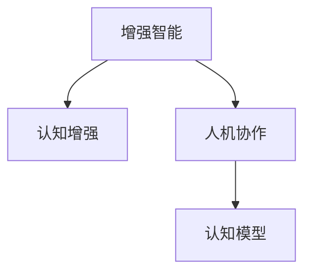

                 

# 增强智能：人机协作，提升认知能力

> 关键词：增强智能,人机协作,认知能力提升,算法模型,深度学习,认知心理学,认知增强

## 1. 背景介绍

### 1.1 问题由来

近年来，人工智能技术的发展迅速，AI系统已经深入到各个领域，从自然语言处理到图像识别，从语音识别到机器人控制，AI技术的应用越来越广泛。然而，尽管AI技术取得了显著的进展，但仍然存在一些瓶颈，特别是在认知能力方面，AI系统仍然无法与人类相提并论。

人脑是世界上最复杂、最强大的计算系统之一，具有高度的适应性和学习能力。相比之下，虽然AI系统在某些特定领域表现出色，但在一般认知能力方面，如推理、记忆、创造性思维等方面，仍然存在较大的差距。如何结合AI技术和认知科学，构建更加智能的增强智能系统，提升人类的认知能力，成为当前人工智能领域的重要课题。

### 1.2 问题核心关键点

增强智能（Augmented Intelligence, AI）指的是通过结合AI技术和人类智能，构建更加智能的决策支持系统。其核心在于：

- 借助AI技术的强大计算能力和高效数据处理能力，辅助人类处理复杂的信息和任务。
- 利用认知科学的理论和方法，理解人类认知机制，提升系统的智能化和人性化。
- 构建人机协作的智能系统，通过互补机制，增强系统的认知能力。

增强智能的关键点包括：

1. 数据驱动：AI系统需要大量的数据来训练和优化，而人类可以通过经验、直觉等数据增强AI系统的性能。
2. 人机交互：AI系统需要具备良好的交互能力，理解人类的意图和需求，从而更好地协作。
3. 任务共生：AI系统应当承担人类无法或不愿承担的繁琐、复杂任务，同时辅助人类进行创新和决策。

## 2. 核心概念与联系

### 2.1 核心概念概述

为了更好地理解增强智能的概念，本节将介绍几个密切相关的核心概念：

- **增强智能（Augmented Intelligence, AI）**：通过结合AI技术和人类智能，构建更加智能的决策支持系统。
- **认知增强（Cognitive Enhancement）**：利用AI技术和认知科学的方法，提升人类的认知能力，如推理、记忆、创造性思维等。
- **人机协作（Human-AI Collaboration）**：通过AI系统辅助人类处理复杂任务，同时利用人类的经验和直觉来优化AI系统的性能。
- **认知模型（Cognitive Model）**：用于描述人类认知机制的数学模型，如神经网络、深度学习等。

这些概念之间的逻辑关系可以通过以下Mermaid流程图来展示：



这个流程图展示了这个概念框架的核心关系：

1. 增强智能通过认知增强和人机协作技术，实现AI系统与人类智能的深度融合。
2. 认知增强利用认知模型来描述和模拟人类认知过程，提升AI系统的智能化水平。
3. 人机协作确保AI系统能够理解并响应人类的需求，从而构建更加智能的决策支持系统。

## 3. 核心算法原理 & 具体操作步骤

### 3.1 算法原理概述

增强智能的实现主要依赖于认知模型和人机交互算法。其核心思想是：

1. **认知模型**：构建或选取描述人类认知机制的数学模型，如神经网络、深度学习等。这些模型可以从大量的数据中学习到认知规律，模拟人类的推理、记忆和决策过程。
2. **人机交互**：设计或实现人机交互算法，使AI系统能够理解并响应人类的意图和需求。常见的交互方式包括自然语言处理、图像识别、语音识别等。
3. **任务共生**：结合AI系统和人类智能，构建人机协作的智能系统。AI系统承担繁琐和复杂任务，人类则负责监督和指导系统的运行。

### 3.2 算法步骤详解

增强智能的实现过程包括以下几个关键步骤：

**Step 1: 数据收集与预处理**

1. **数据收集**：收集与任务相关的数据，包括结构化数据和非结构化数据，如文本、图像、语音等。数据量越大，模型的性能越好。
2. **数据预处理**：清洗和处理数据，包括数据清洗、特征提取、数据增强等。

**Step 2: 认知模型训练**

1. **模型选择**：选择或构建适合任务的认知模型，如神经网络、深度学习等。
2. **模型训练**：使用收集到的数据对模型进行训练，优化模型的参数和结构。
3. **模型评估**：使用测试数据集评估模型的性能，调整模型参数以提高模型准确性。

**Step 3: 人机交互设计**

1. **交互界面设计**：设计简洁、易用的交互界面，方便用户与AI系统进行交互。
2. **用户意图理解**：利用自然语言处理、图像识别等技术，理解用户的意图和需求。
3. **系统响应设计**：根据用户的意图，设计合理的系统响应方式，如语音反馈、文本提示等。

**Step 4: 系统集成与优化**

1. **系统集成**：将训练好的认知模型和人机交互算法集成到系统中，实现系统的高效运行。
2. **系统优化**：根据实际应用场景，对系统进行优化，如调整交互方式、改进模型性能等。

**Step 5: 持续改进**

1. **数据反馈**：根据系统的运行情况，收集用户反馈和系统性能数据。
2. **模型更新**：利用新数据对模型进行更新和优化，提高系统的准确性和性能。
3. **交互改进**：根据用户反馈，改进人机交互界面和交互方式，提升用户体验。

### 3.3 算法优缺点

增强智能的主要优点包括：

1. **高效性**：利用AI技术的强大计算能力，处理复杂数据，提高效率。
2. **智能化**：结合认知模型和人机交互技术，提升系统的智能化和人性化水平。
3. **任务共生**：通过人机协作，将人类和AI系统的优势相结合，提高任务处理的准确性和效率。

然而，增强智能也存在一些缺点：

1. **数据依赖**：需要大量高质量的数据来训练和优化模型，数据获取成本较高。
2. **算法复杂**：认知模型和人机交互算法较为复杂，实现难度较大。
3. **交互障碍**：AI系统与人类的交互方式仍需不断改进，提升用户体验。
4. **伦理问题**：增强智能涉及隐私保护、数据安全等问题，需要考虑伦理和法律约束。

### 3.4 算法应用领域

增强智能技术已经在多个领域得到了应用，包括但不限于：

1. **医疗健康**：利用AI系统进行疾病诊断、治疗方案推荐等，辅助医生进行决策。
2. **金融投资**：利用AI系统进行市场分析、风险评估等，辅助投资决策。
3. **教育培训**：利用AI系统进行个性化教学、智能评估等，提升教育效果。
4. **智能制造**：利用AI系统进行质量控制、设备维护等，提高生产效率。
5. **智能交通**：利用AI系统进行交通流量分析、路径规划等，提高交通效率。

未来，随着技术的不断进步，增强智能将在更多领域得到应用，为社会带来更加智能化、高效化的解决方案。

## 4. 数学模型和公式 & 详细讲解 & 举例说明

### 4.1 数学模型构建

增强智能的实现涉及多个数学模型，包括认知模型和人机交互模型。以下以深度学习模型为例，简要介绍其构建过程。

**深度学习模型**：

1. **输入层**：接收原始数据，如文本、图像、语音等。
2. **隐藏层**：通过神经网络模型，提取数据的特征。
3. **输出层**：根据任务类型，输出预测结果或决策方案。

深度学习模型的训练过程通常包括以下步骤：

1. **数据集划分**：将数据集划分为训练集、验证集和测试集。
2. **模型选择**：选择适合任务的深度学习模型，如卷积神经网络（CNN）、循环神经网络（RNN）等。
3. **模型训练**：使用训练集数据对模型进行训练，优化模型的参数和结构。
4. **模型评估**：使用验证集数据评估模型的性能，调整模型参数以提高模型准确性。
5. **模型测试**：使用测试集数据测试模型的性能，评估模型在实际应用中的表现。

### 4.2 公式推导过程

以下是深度学习模型训练的公式推导过程：

1. **前向传播**：

   $$
   y = f_W(x)
   $$

   其中，$x$ 为输入数据，$y$ 为模型输出，$W$ 为模型参数。

2. **损失函数**：

   $$
   L = \frac{1}{N} \sum_{i=1}^N \ell(y_i, \hat{y}_i)
   $$

   其中，$\ell$ 为损失函数，$y_i$ 为真实标签，$\hat{y}_i$ 为模型预测结果。

3. **反向传播**：

   $$
   \frac{\partial L}{\partial W} = \frac{1}{N} \sum_{i=1}^N \frac{\partial \ell(y_i, \hat{y}_i)}{\partial W}
   $$

   利用链式法则计算梯度，更新模型参数 $W$。

### 4.3 案例分析与讲解

以医疗健康领域为例，分析如何利用增强智能技术辅助医生进行疾病诊断和治疗方案推荐。

1. **数据收集**：收集大量的医学数据，包括患者病历、影像数据、实验室检测数据等。
2. **数据预处理**：清洗和处理数据，包括数据清洗、特征提取、数据增强等。
3. **认知模型训练**：构建深度学习模型，如卷积神经网络（CNN），用于医学影像识别和分类。
4. **人机交互设计**：设计简洁易用的交互界面，方便医生输入患者信息，获取诊断结果和治疗方案。
5. **系统集成与优化**：将训练好的认知模型和交互界面集成到系统中，优化模型的性能和交互方式。
6. **持续改进**：根据医生的反馈和系统运行情况，不断优化模型和交互界面，提升系统的准确性和用户体验。

通过增强智能技术，医生可以更快速、准确地诊断疾病，制定个性化的治疗方案，提高医疗服务水平。

## 5. 项目实践：代码实例和详细解释说明

### 5.1 开发环境搭建

在进行增强智能项目实践前，我们需要准备好开发环境。以下是使用Python进行TensorFlow开发的环境配置流程：

1. 安装Anaconda：从官网下载并安装Anaconda，用于创建独立的Python环境。

2. 创建并激活虚拟环境：
```bash
conda create -n ai-env python=3.7 
conda activate ai-env
```

3. 安装TensorFlow：根据CUDA版本，从官网获取对应的安装命令。例如：
```bash
conda install tensorflow tensorflow-gpu -c conda-forge
```

4. 安装TensorBoard：
```bash
pip install tensorboard
```

5. 安装各类工具包：
```bash
pip install numpy pandas scikit-learn matplotlib tqdm jupyter notebook ipython
```

完成上述步骤后，即可在`ai-env`环境中开始增强智能项目实践。

### 5.2 源代码详细实现

这里我们以医疗影像识别为例，给出使用TensorFlow对深度学习模型进行增强智能的代码实现。

首先，定义数据集和模型：

```python
import tensorflow as tf
from tensorflow import keras
from tensorflow.keras import layers

# 定义数据集
train_dataset = keras.preprocessing.image_dataset_from_directory(
    'train_data',
    image_size=(256, 256),
    batch_size=32,
    label_mode='binary')
test_dataset = keras.preprocessing.image_dataset_from_directory(
    'test_data',
    image_size=(256, 256),
    batch_size=32,
    label_mode='binary')

# 定义模型
model = keras.Sequential([
    layers.Conv2D(32, 3, activation='relu', input_shape=(256, 256, 3)),
    layers.MaxPooling2D(),
    layers.Conv2D(64, 3, activation='relu'),
    layers.MaxPooling2D(),
    layers.Flatten(),
    layers.Dense(64, activation='relu'),
    layers.Dense(1)
])
```

然后，训练模型并进行人机交互设计：

```python
# 模型编译
model.compile(optimizer='adam', loss='binary_crossentropy', metrics=['accuracy'])

# 模型训练
model.fit(train_dataset, validation_data=test_dataset, epochs=10)

# 定义交互界面
def interface():
    while True:
        img = input("请输入图像路径：")
        img = tf.keras.preprocessing.image.load_img(img, target_size=(256, 256))
        img = tf.keras.preprocessing.image.img_to_array(img)
        img = tf.expand_dims(img, axis=0)
        pred = model.predict(img)
        print(f"该图像属于恶性肿瘤的概率为：{pred[0][0]}")
```

最后，启动交互界面：

```python
if __name__ == '__main__':
    interface()
```

以上就是使用TensorFlow对医疗影像识别任务进行增强智能的完整代码实现。可以看到，TensorFlow提供了强大的模型构建和训练功能，使得增强智能系统的开发变得相对简洁和高效。

### 5.3 代码解读与分析

让我们再详细解读一下关键代码的实现细节：

**定义数据集**：
- `keras.preprocessing.image_dataset_from_directory`函数：将目录中的图像文件加载为TensorFlow数据集。
- `image_size`参数：指定输入图像的大小。
- `batch_size`参数：指定每个批次的大小。
- `label_mode`参数：指定标签的类型，如二元分类。

**定义模型**：
- `Sequential`模型：使用`Sequential`模型，依次添加卷积层、池化层、全连接层等，构建深度学习模型。
- `Conv2D`层：定义卷积层，提取图像特征。
- `MaxPooling2D`层：定义池化层，减小特征图尺寸。
- `Flatten`层：将特征图展开成一维向量。
- `Dense`层：定义全连接层，进行分类。

**模型编译和训练**：
- `model.compile`函数：编译模型，指定优化器、损失函数和评价指标。
- `model.fit`函数：使用训练数据集对模型进行训练，指定验证集和训练轮数。

**人机交互界面**：
- `interface`函数：定义交互界面，循环读取用户输入的图像路径，加载并预处理图像，预测图像类别，并输出预测结果。
- `input`函数：读取用户输入的图像路径。
- `load_img`函数：加载图像文件。
- `img_to_array`函数：将图像转换为数组。
- `expand_dims`函数：在数组的前维度添加一个维度。
- `predict`函数：对图像进行预测，输出预测结果。

通过定义数据集、模型、交互界面，构建了一个简单的医疗影像识别系统，能够对用户输入的图像进行预测，输出恶性肿瘤的概率。

## 6. 实际应用场景

### 6.1 智能医疗

增强智能技术在医疗领域具有广泛的应用前景。通过结合AI技术和认知科学，医生可以更快速、准确地诊断疾病，制定个性化的治疗方案，提高医疗服务水平。

具体而言，可以构建增强智能系统，辅助医生进行以下任务：

1. **疾病诊断**：利用图像识别、自然语言处理等技术，辅助医生诊断疾病。例如，利用深度学习模型对医学影像进行分类，辅助医生识别肿瘤、骨折等疾病。
2. **治疗方案推荐**：利用机器学习和自然语言处理技术，分析患者的病历和实验室检测数据，推荐个性化的治疗方案。例如，利用文本分类模型分析病历文本，提取患者的病情和病史信息，推荐合适的治疗方案。
3. **医学研究**：利用AI技术处理大规模医学数据，进行疾病预测和风险评估。例如，利用深度学习模型分析基因组数据，预测疾病的发生概率和风险因素。

### 6.2 金融投资

增强智能技术在金融领域也有着广泛的应用前景。通过结合AI技术和认知科学，投资者可以更快速、准确地分析市场趋势，制定投资策略，提高投资收益。

具体而言，可以构建增强智能系统，辅助投资者进行以下任务：

1. **市场分析**：利用自然语言处理和图像识别技术，分析新闻、社交媒体、股票数据等，获取市场信息。例如，利用文本分类模型分析新闻报道，提取市场情绪和热点事件，辅助投资者做出投资决策。
2. **风险评估**：利用机器学习和数据挖掘技术，分析历史数据，评估投资风险。例如，利用时间序列分析模型预测股票价格走势，评估投资风险。
3. **交易策略优化**：利用深度学习模型分析交易数据，优化交易策略。例如，利用强化学习模型，训练投资交易策略，提高投资回报率。

### 6.3 智能教育

增强智能技术在教育领域也有着广泛的应用前景。通过结合AI技术和认知科学，教育工作者可以更快速、准确地评估学生，制定个性化的教学方案，提高教学效果。

具体而言，可以构建增强智能系统，辅助教育工作者进行以下任务：

1. **学生评估**：利用自然语言处理和图像识别技术，分析学生的作业和考试成绩，评估学生的学习情况。例如，利用文本分类模型分析学生的作业，提取学生的学习难点和薄弱环节。
2. **个性化教学**：利用机器学习和数据挖掘技术，分析学生的学习数据，制定个性化的教学方案。例如，利用推荐系统为学生推荐合适的学习资源和学习策略。
3. **智能答疑**：利用自然语言处理技术，构建智能答疑系统，帮助学生解答疑问。例如，利用深度学习模型分析学生的疑问，提供相应的解答和解释。

## 7. 工具和资源推荐

### 7.1 学习资源推荐

为了帮助开发者系统掌握增强智能的理论基础和实践技巧，这里推荐一些优质的学习资源：

1. **《深度学习》系列课程**：由斯坦福大学吴恩达教授主讲，系统讲解深度学习的基本概念和前沿技术，适合入门学习。
2. **《TensorFlow实战Google深度学习》书籍**：详细介绍了TensorFlow的原理和实践，包括增强智能系统的开发。
3. **《认知科学》课程**：由MIT教授Susan J. LaFleur主讲，系统讲解认知科学的理论和方法，为增强智能系统的设计提供理论支持。
4. **《人机协作智能系统》讲座**：由IBM研究院资深专家主讲，介绍人机协作智能系统的实现方法和应用案例。
5. **OpenAI AlphaStar论文**：详细介绍了AlphaStar系统的开发过程和设计思想，展示了AI系统在高水平人机游戏中取得的成功。

通过对这些资源的学习实践，相信你一定能够快速掌握增强智能的精髓，并用于解决实际的NLP问题。

### 7.2 开发工具推荐

高效的开发离不开优秀的工具支持。以下是几款用于增强智能开发常用的工具：

1. **TensorFlow**：由Google主导开发的深度学习框架，生产部署方便，适合大规模工程应用。
2. **PyTorch**：基于Python的开源深度学习框架，灵活动态的计算图，适合快速迭代研究。
3. **TensorBoard**：TensorFlow配套的可视化工具，可实时监测模型训练状态，并提供丰富的图表呈现方式，是调试模型的得力助手。
4. **Keras**：高级神经网络API，基于TensorFlow和Theano，方便快速构建深度学习模型。
5. **Jupyter Notebook**：交互式编程环境，支持代码编写、数据处理和模型训练，适合科研和工程开发。

合理利用这些工具，可以显著提升增强智能系统的开发效率，加快创新迭代的步伐。

### 7.3 相关论文推荐

增强智能技术的发展源于学界的持续研究。以下是几篇奠基性的相关论文，推荐阅读：

1. **《强化学习与人类决策过程的类比》**：研究强化学习与人类决策过程的相似性，为增强智能系统的设计提供理论支持。
2. **《深度学习在医疗健康中的应用》**：系统综述了深度学习在医疗健康领域的应用，展示了AI技术在医疗诊断和治疗方案推荐中的潜力。
3. **《人机协作智能系统设计》**：介绍了人机协作智能系统的设计方法和应用案例，展示了AI技术在教育、金融等领域的应用前景。
4. **《认知增强技术在教育中的应用》**：研究认知增强技术在教育中的应用，展示了AI技术在个性化教学和智能答疑中的效果。
5. **《深度学习在金融投资中的应用》**：系统综述了深度学习在金融投资领域的应用，展示了AI技术在市场分析和风险评估中的潜力。

这些论文代表了大增强智能技术的发展脉络。通过学习这些前沿成果，可以帮助研究者把握学科前进方向，激发更多的创新灵感。

## 8. 总结：未来发展趋势与挑战

### 8.1 总结

本文对增强智能的概念和实现方法进行了全面系统的介绍。首先阐述了增强智能的理论基础和应用意义，明确了其在人机协作、认知能力提升方面的独特价值。其次，从原理到实践，详细讲解了认知模型和人机交互算法的实现过程，给出了增强智能系统开发的完整代码实例。同时，本文还广泛探讨了增强智能在医疗健康、金融投资、教育培训等多个行业领域的应用前景，展示了其广阔的应用潜力。此外，本文精选了增强智能技术的各类学习资源，力求为读者提供全方位的技术指引。

通过本文的系统梳理，可以看到，增强智能技术正在成为AI领域的重要方向，极大地拓展了AI系统的应用范围，提升了人类的认知能力。未来，伴随AI技术和认知科学的不断发展，增强智能必将在更多领域得到应用，为人类认知智能的进化带来深远影响。

### 8.2 未来发展趋势

展望未来，增强智能技术将呈现以下几个发展趋势：

1. **智能化水平提升**：随着认知模型的不断发展，增强智能系统的智能化水平将进一步提升，能够更好地理解人类的意图和需求。
2. **人机协作增强**：通过更加智能和灵活的人机交互技术，增强智能系统将与人类实现更加高效、无缝的协作。
3. **跨领域应用拓展**：增强智能技术将在更多领域得到应用，如教育、金融、医疗等，为社会带来更加智能化、高效化的解决方案。
4. **伦理和社会影响**：增强智能技术的发展将带来伦理和社会问题，需要制定相应的规范和标准，确保系统的安全性和可控性。
5. **多模态数据融合**：增强智能系统将更好地融合多模态数据，提高系统的智能水平和适应性。

以上趋势凸显了增强智能技术的广阔前景。这些方向的探索发展，必将进一步提升增强智能系统的性能和应用范围，为人类认知智能的进化带来深远影响。

### 8.3 面临的挑战

尽管增强智能技术已经取得了显著进展，但在迈向更加智能化、普适化应用的过程中，仍面临诸多挑战：

1. **数据依赖**：增强智能系统需要大量的数据来训练和优化，数据获取成本较高。
2. **算法复杂**：认知模型和人机交互算法较为复杂，实现难度较大。
3. **伦理问题**：增强智能技术涉及隐私保护、数据安全等问题，需要考虑伦理和法律约束。
4. **用户体验**：增强智能系统的交互界面和用户体验仍需不断改进，提升用户体验。
5. **技术融合**：增强智能系统需要与其他技术进行融合，如知识表示、因果推理等，提升系统的智能水平。

### 8.4 研究展望

面对增强智能面临的挑战，未来的研究需要在以下几个方面寻求新的突破：

1. **多模态数据融合**：将视觉、语音、文本等多模态数据进行融合，提高系统的智能水平和适应性。
2. **认知模型优化**：优化认知模型，提高模型的鲁棒性和泛化能力，适应更复杂和多变的环境。
3. **人机协作优化**：设计更加智能和灵活的人机交互技术，实现更加高效、无缝的协作。
4. **伦理和社会影响**：制定相应的规范和标准，确保增强智能系统的安全性和可控性。
5. **知识表示和推理**：将知识表示和推理技术引入增强智能系统，提高系统的智能化水平。

这些研究方向的探索，必将引领增强智能技术迈向更高的台阶，为构建安全、可靠、可解释、可控的智能系统铺平道路。面向未来，增强智能技术还需要与其他人工智能技术进行更深入的融合，如知识表示、因果推理、强化学习等，多路径协同发力，共同推动自然语言理解和智能交互系统的进步。只有勇于创新、敢于突破，才能不断拓展增强智能技术的边界，让智能技术更好地造福人类社会。

## 9. 附录：常见问题与解答

**Q1：增强智能是否适用于所有领域？**

A: 增强智能技术在多个领域具有广泛的应用前景，如医疗健康、金融投资、教育培训等。但对于一些特定领域，如军事、法律等，由于涉及隐私和安全问题，增强智能技术的应用仍需进一步研究。

**Q2：如何选择合适的认知模型？**

A: 选择合适的认知模型需要考虑任务类型和数据特点。例如，对于图像识别任务，可以使用卷积神经网络（CNN）；对于文本分类任务，可以使用循环神经网络（RNN）或Transformer模型。

**Q3：增强智能系统如何处理用户反馈？**

A: 增强智能系统需要设计有效的用户反馈机制，根据用户的反馈不断优化模型和交互界面，提高系统的性能和用户体验。

**Q4：增强智能系统如何平衡计算和智能化？**

A: 增强智能系统的计算和智能化需要平衡。一方面，需要利用AI技术的强大计算能力，处理复杂数据；另一方面，需要优化模型和算法，提高系统的智能化水平。

**Q5：增强智能系统的伦理问题如何处理？**

A: 增强智能系统涉及隐私保护、数据安全等问题，需要制定相应的规范和标准，确保系统的安全性和可控性。例如，需要保护用户的隐私数据，避免数据滥用。

通过解答这些问题，可以帮助开发者更好地理解增强智能技术的实现方法和应用场景，为实际应用提供指导。

---

作者：禅与计算机程序设计艺术 / Zen and the Art of Computer Programming

