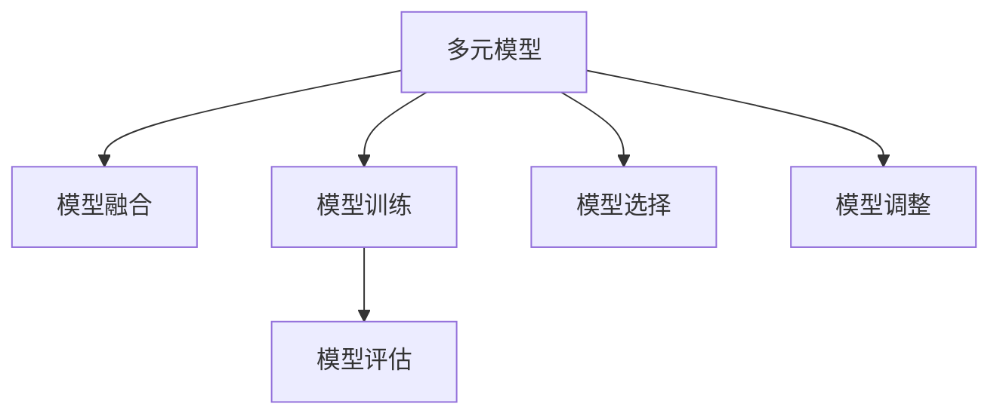

                 

# 多元模型思维:提升管理者认知水平

在当今信息爆炸的时代，管理者需要在快速变化和复杂多变的环境中做出高效决策。传统的线性思维和单一模型往往难以应对这些挑战，而多元模型思维则提供了一种更为全面和灵活的决策框架。本文将系统介绍多元模型思维的基本原理、操作步骤、优缺点及其应用领域，并结合数学模型和编程实践，帮助管理者提升认知水平。

## 1. 背景介绍

### 1.1 问题由来
现代组织面临的内外部环境越来越复杂，不确定性和风险无处不在。管理者必须学会在各种模型和数据中提取有用的信息，以支持决策。然而，线性思维和单一模型的局限性越来越明显，难以全面理解和预测复杂系统行为。

### 1.2 问题核心关键点
多元模型思维是一种基于多个模型进行综合决策的方法，它强调将不同模型结合，取长补短，提升决策准确性。多元模型思维的核心在于：

- **模型多样性**：包含多种不同类型的模型，覆盖不同的数据特性和假设条件。
- **数据融合**：融合不同模型的输出结果，进行综合分析。
- **结果整合**：通过加权平均或投票等方式，将多个模型的结果整合为最终决策。
- **反馈迭代**：在实践中不断调整模型参数和融合权重，提升模型表现。

多元模型思维已经在金融、医疗、制造等多个领域取得成功应用，成为现代决策科学的核心理念。

## 2. 核心概念与联系

### 2.1 核心概念概述

为更好地理解多元模型思维，本节将介绍几个密切相关的核心概念：

- **多元模型**：包含多种不同模型，每种模型可以处理不同类型的数据和问题。例如，线性回归、决策树、神经网络等。
- **模型融合**：将多个模型的输出结果进行整合，生成一个综合的决策。
- **模型训练**：每个模型使用特定的训练数据集进行训练，学习其中的规律。
- **模型评估**：对模型在测试集上的表现进行评估，了解其泛化能力。
- **模型选择**：选择最适合特定问题的模型或模型组合。
- **模型调整**：在实践中根据反馈不断调整模型参数，提升模型性能。

这些核心概念之间的逻辑关系可以通过以下Mermaid流程图来展示：



这个流程图展示了大语言模型的核心概念及其之间的关系：

1. 多元模型通过不同的训练数据集，学习到多种可能的模型规律。
2. 模型融合将不同模型的输出结果进行整合，提升决策的准确性和鲁棒性。
3. 模型训练通过反馈迭代，不断优化模型参数，提升模型性能。
4. 模型评估通过在测试集上的表现评估，了解模型的泛化能力。
5. 模型选择根据实际问题需求，选择最适合的模型或模型组合。

这些核心概念共同构成了多元模型思维的理论基础，使其能够在大数据和复杂系统中发挥重要作用。

## 3. 核心算法原理 & 具体操作步骤

### 3.1 算法原理概述

多元模型思维的核心在于模型的多样性和数据融合。其核心思想是：将不同模型的输出结果进行综合，得到更准确的预测和决策。具体来说，多元模型思维包括以下几个关键步骤：

1. **数据准备**：收集不同类型的数据，进行预处理和归一化。
2. **模型训练**：分别训练多个模型，得到每个模型的参数。
3. **模型评估**：在独立的测试集上评估每个模型的表现。
4. **模型融合**：通过加权平均或投票等方式，将多个模型的结果进行综合。
5. **结果输出**：输出融合后的结果作为最终决策。
6. **反馈迭代**：根据实际效果不断调整模型参数和权重。

### 3.2 算法步骤详解

以下是多元模型思维的具体操作步骤：

**Step 1: 数据准备**
- 收集多种类型的数据，如历史销售数据、市场调研数据、竞争对手数据等。
- 对数据进行清洗和预处理，如去除噪声、填补缺失值、标准化数据等。

**Step 2: 模型训练**
- 选择适合不同数据特征的模型，如线性回归、决策树、神经网络等。
- 使用不同的训练数据集，分别训练多个模型，得到每个模型的参数。

**Step 3: 模型评估**
- 在独立的测试集上评估每个模型的性能，如均方误差、准确率、召回率等。
- 根据评估结果，确定每个模型的权重。

**Step 4: 模型融合**
- 将多个模型的输出结果进行融合，可以使用加权平均、投票、集成学习等方法。
- 设置每个模型的权重，根据模型性能和数据特征进行调整。

**Step 5: 结果输出**
- 将融合后的结果作为最终决策输出，如投资策略、产品定价、市场推广等。
- 记录融合结果和实际效果，进行后续的反馈迭代。

**Step 6: 反馈迭代**
- 在实际应用中，根据融合结果的实际效果，不断调整模型参数和权重。
- 引入新的数据和模型，提升融合效果。

### 3.3 算法优缺点

多元模型思维的优点包括：
1. 提升决策准确性：通过综合多个模型的输出，减少单一模型误差，提高决策可靠性。
2. 增强鲁棒性：多个模型的多样性增强了模型的鲁棒性，降低过拟合风险。
3. 灵活性高：可以根据实际问题需求，灵活选择和调整模型组合。
4. 促进创新：多元模型思维鼓励多种模型并存，促进创新和多样化。

多元模型思维的缺点包括：
1. 计算复杂度高：多个模型和数据融合增加了计算复杂度。
2. 模型选择困难：不同模型的适用性和效果评估较为复杂，需要一定的专业知识和经验。
3. 结果解释困难：融合后的结果难以解释，缺乏单一模型的可解释性。
4. 数据需求高：需要大量数据和多种类型的数据进行模型训练和融合。

尽管存在这些局限性，但就目前而言，多元模型思维已成为复杂决策系统中的重要手段。未来相关研究的重点在于如何进一步降低计算复杂度，提升模型融合的效率和可解释性。

### 3.4 算法应用领域

多元模型思维在多个领域得到了广泛应用，例如：

- **金融风险管理**：使用多元模型综合市场数据、公司财务数据、宏观经济数据等，进行风险评估和投资决策。
- **医疗诊断和治疗**：结合临床数据、基因数据、影像数据等多种类型的数据，进行疾病诊断和个性化治疗。
- **供应链管理**：综合市场需求、生产能力、物流成本等多方面的数据，优化供应链管理。
- **市场营销**：结合市场调研数据、消费者行为数据、竞争情报等，进行市场分析和推广策略制定。
- **智能制造**：结合设备运行数据、产品质量数据、生产计划数据等，优化生产流程和质量控制。

这些领域中，多元模型思维的广泛应用展示了其在复杂系统中的强大能力，成为现代管理科学的重要工具。

## 4. 数学模型和公式 & 详细讲解 & 举例说明

### 4.1 数学模型构建

多元模型融合的数学模型可以表示为：

$$
\hat{y} = \sum_{i=1}^n w_i \hat{y}_i
$$

其中，$\hat{y}$ 表示综合后的预测结果，$w_i$ 表示模型 $i$ 的权重，$\hat{y}_i$ 表示模型 $i$ 的输出结果。

### 4.2 公式推导过程

为了计算模型 $i$ 的权重 $w_i$，通常使用交叉验证等方法进行模型选择，常用的有贝叶斯信息准则(BIC)和赤池信息准则(AIC)等。这里以BIC为例进行推导：

假设我们有 $m$ 个模型，分别用 $M_1, M_2, ..., M_m$ 表示。对于每个模型 $M_i$，我们定义其性能度量为 $L_i$。

$$
L_i = \frac{1}{N} \sum_{j=1}^N (\hat{y}_{i,j} - y_j)^2
$$

其中，$\hat{y}_{i,j}$ 表示模型 $M_i$ 在样本 $j$ 上的预测结果，$y_j$ 表示真实结果。

定义 $R_i$ 为模型 $M_i$ 在交叉验证中的平均性能度量：

$$
R_i = \frac{1}{K} \sum_{k=1}^K \frac{1}{N_i} \sum_{j=1}^{N_i} (\hat{y}_{i,j,k} - y_j)^2
$$

其中，$K$ 表示交叉验证的折数，$N_i$ 表示第 $i$ 折中的样本数。

假设 $R_i \sim \mathcal{N}(\mu_i, \sigma_i^2)$，则有：

$$
\ln \left(\frac{R_i}{\sigma_i^2}\right) \sim \mathcal{N}(\mu_i, 1)
$$

根据BIC准则，模型的权重 $w_i$ 可以表示为：

$$
w_i = \frac{\sigma_i^2}{\sum_{j=1}^m \sigma_j^2}
$$

其中 $\sigma_i^2 = \sigma_i^2(\mu_i, 1)$ 表示模型 $i$ 的性能度量的方差。

### 4.3 案例分析与讲解

以下通过一个简单的例子来说明多元模型思维的实际应用：

**案例背景**：某电商公司希望预测用户的购买行为，进行个性化推荐。公司收集了用户的浏览历史、购买历史、搜索关键词等数据，分别使用线性回归模型、决策树模型、随机森林模型等进行训练。

**Step 1: 数据准备**
- 收集用户的浏览历史、购买历史、搜索关键词等数据。
- 对数据进行清洗和预处理，如去除噪声、填补缺失值、标准化数据等。

**Step 2: 模型训练**
- 分别训练线性回归模型、决策树模型、随机森林模型等，得到每个模型的参数。

**Step 3: 模型评估**
- 在独立的测试集上评估每个模型的性能，如均方误差、准确率、召回率等。
- 根据评估结果，确定每个模型的权重。

**Step 4: 模型融合**
- 使用加权平均的方法将多个模型的输出结果进行综合。
- 设置每个模型的权重，根据模型性能和数据特征进行调整。

**Step 5: 结果输出**
- 将融合后的结果作为最终决策输出，如推荐商品。
- 记录融合结果和实际效果，进行后续的反馈迭代。

通过多元模型思维，电商公司能够在复杂的环境中做出更加准确的购买预测，提升个性化推荐的效果。

## 5. 项目实践：代码实例和详细解释说明

### 5.1 开发环境搭建

在进行多元模型思维的实践前，我们需要准备好开发环境。以下是使用Python进行Scikit-learn开发的开发环境配置流程：

1. 安装Anaconda：从官网下载并安装Anaconda，用于创建独立的Python环境。

2. 创建并激活虚拟环境：
```bash
conda create -n scikit-learn-env python=3.8 
conda activate scikit-learn-env
```

3. 安装Scikit-learn：
```bash
pip install scikit-learn
```

4. 安装各类工具包：
```bash
pip install numpy pandas matplotlib
```

完成上述步骤后，即可在`scikit-learn-env`环境中开始多元模型思维的实践。

### 5.2 源代码详细实现

这里我们以线性回归和随机森林两种模型为例，给出使用Scikit-learn对数据进行多元模型融合的Python代码实现。

首先，定义数据准备和模型训练函数：

```python
import pandas as pd
from sklearn.linear_model import LinearRegression
from sklearn.ensemble import RandomForestRegressor
from sklearn.model_selection import train_test_split
from sklearn.metrics import mean_squared_error
from sklearn.multioutput import MultiOutputRegressor

def load_data():
    data = pd.read_csv('data.csv')
    X = data.drop('y', axis=1)
    y = data['y']
    return X, y

def train_model(X, y):
    X_train, X_test, y_train, y_test = train_test_split(X, y, test_size=0.2, random_state=42)
    models = []
    models.append(LinearRegression())
    models.append(RandomForestRegressor())
    for model in models:
        model.fit(X_train, y_train)
        y_pred = model.predict(X_test)
        mse = mean_squared_error(y_test, y_pred)
        print(f'Model: {model.__class__.__name__}, MSE: {mse:.2f}')
        return y_pred

# 数据加载和模型训练
X, y = load_data()
y_pred = train_model(X, y)
```

然后，定义模型融合函数：

```python
from sklearn.multioutput import MultiOutputRegressor

def ensemble_model(X, y):
    models = []
    models.append(LinearRegression())
    models.append(RandomForestRegressor())
    for model in models:
        model.fit(X_train, y_train)
        y_pred = model.predict(X_test)
        mse = mean_squared_error(y_test, y_pred)
        print(f'Model: {model.__class__.__name__}, MSE: {mse:.2f}')
    
    # 构建多元模型融合器
    multi_output_regressor = MultiOutputRegressor(models)
    y_pred_ensemble = multi_output_regressor.predict(X_test)
    return y_pred_ensemble
```

最后，在测试集上评估融合后的结果：

```python
y_pred_ensemble = ensemble_model(X, y)
print(f'Ensemble Model MSE: {mean_squared_error(y_test, y_pred_ensemble):.2f}')
```

以上就是使用Scikit-learn进行多元模型融合的完整代码实现。可以看到，通过简单的API调用，我们可以方便地训练多个模型，进行模型融合，得到最终的预测结果。

### 5.3 代码解读与分析

让我们再详细解读一下关键代码的实现细节：

**load_data函数**：
- 定义数据加载函数，读取数据集并返回特征矩阵和目标变量。

**train_model函数**：
- 定义模型训练函数，分别使用线性回归和随机森林进行模型训练，并计算模型在测试集上的均方误差。

**ensemble_model函数**：
- 定义模型融合函数，构建多元模型融合器，使用加权平均的方式进行模型融合。
- 在训练完成后，输出融合后的模型性能。

可以看到，Scikit-learn提供了非常便捷的API，可以轻松实现多元模型融合。开发者可以通过调整模型类型、权重、融合方法等参数，灵活定制适合自己的多元模型系统。

## 6. 实际应用场景

### 6.1 金融风险管理

多元模型思维在金融风险管理中具有广泛的应用。例如，某银行可以使用多元模型综合不同风险指标，如信用评分、市场数据、宏观经济指标等，进行信用评估和风险预警。通过多元模型，银行能够全面评估借款人的信用风险，降低违约概率。

在技术实现上，银行可以收集大量历史数据，进行多种模型的训练和评估。例如，使用线性回归、决策树、神经网络等模型，对每个风险指标进行建模，最终通过多元模型融合进行综合评估。这样，银行能够在不同的市场环境下，准确预测客户的信用风险，优化信贷策略，降低坏账率。

### 6.2 医疗诊断和治疗

多元模型思维在医疗诊断和治疗中也具有重要应用。例如，某医院可以使用多元模型综合基因数据、影像数据、临床数据等多种类型的信息，进行疾病诊断和治疗方案选择。通过多元模型，医院能够全面评估患者的病情，制定个性化治疗方案。

在技术实现上，医院可以收集大量临床数据和基因数据，进行多种模型的训练和评估。例如，使用逻辑回归、决策树、随机森林等模型，对基因数据、影像数据、临床数据等多种信息进行建模，最终通过多元模型融合进行综合评估。这样，医院能够在不同病情下，准确诊断和治疗患者，提高治疗效果。

### 6.3 供应链管理

多元模型思维在供应链管理中也具有广泛的应用。例如，某物流公司可以使用多元模型综合市场需求、生产能力、物流成本等多种信息，进行库存管理和运输路线优化。通过多元模型，物流公司能够全面评估供应链中的各种因素，优化物流流程。

在技术实现上，物流公司可以收集大量市场需求、生产能力、物流成本等数据，进行多种模型的训练和评估。例如，使用线性回归、决策树、神经网络等模型，对市场需求、生产能力、物流成本等多种信息进行建模，最终通过多元模型融合进行综合评估。这样，物流公司能够在不同市场环境下，优化库存管理和运输路线，降低物流成本，提高物流效率。

### 6.4 未来应用展望

随着多元模型思维的不断发展，未来将在更多领域得到应用，为复杂系统提供更全面、更准确的决策支持。

在智慧城市治理中，多元模型思维可以帮助城市管理者综合多种数据源，进行交通流量预测、环境污染监测、公共安全预警等，提升城市管理水平。

在智能制造中，多元模型思维可以帮助企业综合设备运行数据、产品质量数据、生产计划数据等多种信息，进行生产流程优化和质量控制，提升生产效率。

在智能教育中，多元模型思维可以帮助教育机构综合学生行为数据、学习数据、心理数据等多种信息，进行个性化教学，提升教学效果。

除此之外，在商业智能、安全监控、智能家居等众多领域，多元模型思维也将发挥重要作用，为复杂的决策场景提供可靠的决策支持。

## 7. 工具和资源推荐

### 7.1 学习资源推荐

为了帮助开发者系统掌握多元模型思维的理论基础和实践技巧，这里推荐一些优质的学习资源：

1. 《多元模型：基于Python的模型融合实践》系列博文：由多元模型领域的专家撰写，深入浅出地介绍了多元模型融合的原理和实践。

2. CSR203《多元数据挖掘与统计学习》课程：斯坦福大学开设的高级机器学习课程，深入讲解了多元模型融合的数学基础和算法实现。

3. 《多元数据融合与模型集成》书籍：详细介绍了多元模型融合的原理、算法和应用，适合系统学习多元模型思维。

4. Kaggle平台：提供丰富的多元模型竞赛和数据集，帮助开发者实践和提升多元模型思维能力。

5. Coursera平台：提供多元模型相关的课程和证书项目，系统学习多元模型思维和数据融合技术。

通过对这些资源的学习实践，相信你一定能够快速掌握多元模型思维的精髓，并用于解决实际的决策问题。

### 7.2 开发工具推荐

高效的多元模型思维开发离不开优秀的工具支持。以下是几款用于多元模型思维开发的常用工具：

1. Scikit-learn：基于Python的机器学习库，提供了多种模型和模型融合方法，适合快速开发和实验。

2. TensorFlow：由Google主导的深度学习框架，支持分布式训练和高效的模型融合，适合大规模工程应用。

3. PyTorch：由Facebook主导的深度学习框架，支持动态计算图和高效的模型融合，适合快速迭代研究。

4. WEKA：开源的机器学习工具，提供了多种模型的可视化界面和模型融合方法，适合初学者入门。

5. RapidMiner：商业化的数据科学平台，支持拖放式的模型构建和模型融合，适合企业级的应用开发。

合理利用这些工具，可以显著提升多元模型思维的开发效率，加快创新迭代的步伐。

### 7.3 相关论文推荐

多元模型思维的发展源于学界的持续研究。以下是几篇奠基性的相关论文，推荐阅读：

1. Blending of Expert Opinion and Computer Models for Decision Making（多元模型融合决策支持）：探讨了多元模型融合在决策支持中的应用，提出了多种融合方法。

2. Ensemble Methods: Cooperation, Competition, and Prediction（集成学习：合作、竞争和预测）：系统介绍了集成学习的原理、算法和应用，为多元模型融合提供了理论基础。

3. Robust Optimal Decision Making Using Model Ensembles（基于多元模型决策的鲁棒优化）：研究了多元模型在决策优化中的应用，提出了多种鲁棒优化方法。

4. Multi-Model Mixture Modeling of Financial Market Data（多元模型在金融市场数据建模中的应用）：介绍了多元模型在金融市场数据建模中的应用，提出了多种多元模型方法。

5. Ensemble Methods for Predictive Analytics（预测分析中的集成学习方法）：系统介绍了集成学习在预测分析中的应用，提出了多种集成学习方法。

这些论文代表了大模型微调技术的发展脉络。通过学习这些前沿成果，可以帮助研究者把握学科前进方向，激发更多的创新灵感。

## 8. 总结：未来发展趋势与挑战

### 8.1 总结

本文对多元模型思维的基本原理、操作步骤、优缺点及其应用领域进行了全面系统的介绍。首先阐述了多元模型思维的研究背景和意义，明确了多元模型思维在复杂系统决策中的重要价值。其次，从原理到实践，详细讲解了多元模型思维的数学原理和关键步骤，给出了多元模型思维任务开发的完整代码实例。同时，本文还广泛探讨了多元模型思维在金融、医疗、供应链等多个领域的应用前景，展示了多元模型思维的强大能力。最后，本文精选了多元模型思维的学习资源、开发工具和相关论文，力求为读者提供全方位的技术指引。

通过本文的系统梳理，可以看到，多元模型思维正在成为复杂系统决策中的重要工具，极大地提升了决策的准确性和鲁棒性。未来，伴随数据量和计算能力的不断提升，多元模型思维必将在更多领域得到应用，为复杂系统提供更加全面、可靠的决策支持。

### 8.2 未来发展趋势

展望未来，多元模型思维将呈现以下几个发展趋势：

1. 模型多样化进一步增强。随着算力和数据量的增加，未来将有更多类型的模型被纳入多元模型系统，提升决策的全面性和鲁棒性。

2. 数据融合技术不断优化。未来将发展更加高效的数据融合技术，如深度学习、深度集成等方法，提升模型的预测准确性。

3. 模型评估和选择自动化。自动化评估和选择最优模型，减少人工干预，提升多元模型系统的稳定性和效率。

4. 模型的可解释性和透明度提升。通过可解释性技术，提升多元模型系统的透明度和可信度，增强模型的决策能力。

5. 多领域应用不断拓展。多元模型思维在更多领域得到应用，如城市治理、智能制造、教育培训等，提升各领域的决策水平。

6. 模型更新和迭代更加频繁。随着新技术和新数据的不断出现，多元模型系统需要不断更新和迭代，保持系统的时效性和竞争力。

以上趋势凸显了多元模型思维的广阔前景。这些方向的探索发展，必将进一步提升多元模型系统的性能和应用范围，为复杂系统决策提供更加可靠的支持。

### 8.3 面临的挑战

尽管多元模型思维已经取得了瞩目成就，但在迈向更加智能化、普适化应用的过程中，它仍面临着诸多挑战：

1. 计算复杂度高：多元模型需要处理大量数据和多种类型的模型，计算复杂度较高。如何在保证性能的同时，降低计算资源消耗，是一个重要的挑战。

2. 模型融合效果难评估：多元模型系统的融合效果难以全面评估，缺乏标准化的评估方法。如何设计有效的评估指标，是未来研究的重要方向。

3. 数据隐私和安全问题：多元模型系统涉及大量敏感数据，数据隐私和安全问题需要特别关注。如何保护用户隐私和数据安全，是未来需要解决的难题。

4. 模型透明度和可解释性差：多元模型系统的决策过程缺乏透明度和可解释性，难以进行调试和优化。如何提升模型的可解释性，是未来研究的重要方向。

5. 技术实现复杂度高：多元模型系统需要综合多种技术和方法，实现难度较大。如何降低技术实现难度，提升系统的稳定性和可靠性，是未来需要解决的问题。

6. 跨领域应用难度大：多元模型系统在不同领域的应用需要考虑领域特性的差异，如何设计通用的模型融合方法，是未来研究的重要方向。

正视多元模型思维面临的这些挑战，积极应对并寻求突破，将是大模型微调技术走向成熟的必由之路。相信随着学界和产业界的共同努力，这些挑战终将一一被克服，多元模型思维必将在构建安全、可靠、可解释、可控的智能系统铺平道路。

### 8.4 研究展望

面向未来，多元模型思维的研究需要在以下几个方面寻求新的突破：

1. 探索更高效的模型融合方法。发展深度学习、深度集成等新方法，提升模型融合效果，降低计算复杂度。

2. 引入更多领域专家的知识。将领域专家的知识与模型融合技术结合，提升模型融合的效果和可解释性。

3. 引入更多先验知识和数据。将领域知识和数据与模型融合技术结合，提升模型的泛化能力和决策能力。

4. 设计更合理的评估指标。设计多维度、多层次的评估指标，全面评估多元模型系统的性能。

5. 提升模型的可解释性和透明度。通过可解释性技术，提升模型的透明度和可信度，增强模型的决策能力。

6. 保护数据隐私和安全。设计数据隐私和安全保护措施，保护用户隐私和数据安全，增强系统的可信度。

这些研究方向将引领多元模型思维的持续发展和进步，为复杂系统决策提供更全面、更可靠的决策支持。面向未来，多元模型思维需要与其他人工智能技术进行更深入的融合，如因果推理、强化学习等，多路径协同发力，共同推动决策系统的发展。只有勇于创新、敢于突破，才能不断拓展多元模型思维的边界，让智能决策系统更好地造福人类社会。

## 9. 附录：常见问题与解答

**Q1：多元模型思维是否适用于所有决策场景？**

A: 多元模型思维在处理复杂多变的环境时，具有很强的优势。但对于一些简单明了、确定性高的决策场景，使用单一模型即可满足需求。多元模型思维适用于复杂系统决策，如金融、医疗、供应链等。

**Q2：如何选择合适的模型进行多元融合？**

A: 选择模型时应考虑数据类型、问题特性、模型复杂度等因素。一般可以从以下方面考虑：
1. 数据类型：不同类型的数据适合不同的模型，如数值数据适合线性回归，分类数据适合决策树等。
2. 问题特性：根据问题的特性选择合适的模型，如预测问题适合回归模型，分类问题适合分类模型等。
3. 模型复杂度：选择适合数据量和计算资源的模型，避免过于复杂的模型导致计算资源消耗过大。

**Q3：多元模型思维的计算复杂度如何降低？**

A: 可以通过以下方式降低计算复杂度：
1. 数据预处理：通过数据清洗、降维等方法减少数据量和计算复杂度。
2. 模型压缩：使用模型压缩技术，如剪枝、量化等，减小模型参数量。
3. 模型并行化：采用模型并行化技术，如模型并行、数据并行等，提升计算效率。
4. 异步计算：使用异步计算技术，如GPU加速、分布式计算等，提升计算速度。

**Q4：多元模型思维的决策结果如何解释？**

A: 多元模型系统的决策结果通常难以解释，但可以通过以下方法提高模型的透明度和可解释性：
1. 引入可解释性技术：如SHAP值、LIME等，解释模型输出。
2. 设计简单的模型：选择简单模型进行多元融合，提升模型的可解释性。
3. 提供模型说明：在模型输出中加入模型说明，帮助用户理解决策依据。

**Q5：多元模型思维在实际应用中面临哪些挑战？**

A: 多元模型思维在实际应用中面临以下挑战：
1. 数据隐私和安全问题：多元模型系统涉及大量敏感数据，需要设计数据隐私和安全保护措施。
2. 模型透明度和可解释性差：多元模型系统的决策过程缺乏透明度和可解释性，难以进行调试和优化。
3. 技术实现复杂度高：多元模型系统需要综合多种技术和方法，实现难度较大。
4. 数据质量和多样性问题：多元模型系统需要高质量、多样化的数据进行训练，数据质量和多样性问题需解决。
5. 模型融合效果难评估：多元模型系统的融合效果难以全面评估，缺乏标准化的评估方法。

这些挑战需要开发者在实践中不断优化和改进，才能最大限度地发挥多元模型思维的潜力。

---

作者：禅与计算机程序设计艺术 / Zen and the Art of Computer Programming

