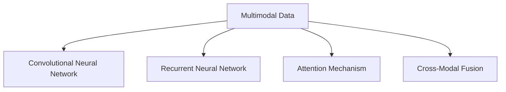

                 

# 多模态AI 图像、音频、视频处理

> 关键词：多模态(AI), 图像处理, 音频处理, 视频处理, 深度学习, 卷积神经网络(CNN), 循环神经网络(RNN), 自注意力机制(Attention), 模型融合(Model Fusion), 实时处理(Real-time Processing)

## 1. 背景介绍

### 1.1 问题由来
现代AI技术正在经历从单一模态（例如只处理图像或文本）向多模态（同时处理图像、音频、视频等多种数据类型）的演进。多模态AI（Multimodal AI）不仅能够融合不同类型的数据，还能够在理解不同模态的语义信息后，更好地适应复杂现实世界的任务。在医疗诊断、智能家居、娱乐与教育等领域，多模态AI正显示出巨大的应用潜力。

### 1.2 问题核心关键点
多模态AI的核心在于如何处理不同模态数据之间的关系，使得AI系统能够理解和生成融合多种模态的信息。常见的多模态数据处理技术包括卷积神经网络（CNN）、循环神经网络（RNN）、自注意力机制（Attention）和跨模态融合方法等。这些技术可以有效地提取和组合多模态数据，提升系统的理解和生成能力。

### 1.3 问题研究意义
多模态AI的研究和应用，能够显著提升AI系统的智能水平和适应性，更好地服务于人类社会的各个方面。具体而言，多模态AI在以下几个方面具有重要意义：

1. **增强理解能力**：多模态AI通过融合视觉、听觉和文本等多种信息源，能够更全面地理解现实世界，提升系统的语义理解和生成能力。
2. **解决复杂问题**：现实世界的许多问题，如医疗诊断、智能交通管理等，需要跨模态的信息融合才能有效解决。多模态AI在这类问题上显示出其独特的优势。
3. **推动AI产业化**：多模态AI技术的应用，能够显著降低对单一模态数据的依赖，拓宽AI技术的落地场景，促进AI技术的产业化和商业化。
4. **促进跨领域创新**：多模态AI技术可以跨领域应用，如将医疗影像分析与自然语言处理相结合，推动AI技术在医疗、教育、娱乐等多个领域的创新发展。

## 2. 核心概念与联系

### 2.1 核心概念概述

为更好地理解多模态AI技术，本节将介绍几个关键的多模态AI核心概念：

- **多模态数据（Multimodal Data）**：包括图像、音频、视频、文本等不同类型的数据。多模态AI系统需要处理这些不同类型的数据，并从中提取有用的信息。
- **卷积神经网络（Convolutional Neural Network, CNN）**：一种经典的神经网络结构，擅长处理图像数据。CNN通过卷积操作提取图像特征，再通过池化、全连接等操作实现分类或回归任务。
- **循环神经网络（Recurrent Neural Network, RNN）**：一种序列建模神经网络，擅长处理时间序列数据，如音频和视频。RNN通过隐藏状态捕捉序列数据的时序信息。
- **自注意力机制（Attention Mechanism）**：一种通过注意力机制对输入序列进行加权组合的技术，广泛应用于多模态融合和跨模态表示学习中。
- **跨模态融合（Cross-Modal Fusion）**：将不同模态的数据通过某种方式进行融合，形成更为全面的表示，用于提升系统的理解和生成能力。

这些核心概念之间的逻辑关系可以通过以下Mermaid流程图来展示：



这个流程图展示了多模态AI系统处理不同模态数据的基本流程：

1. 将多模态数据分别输入不同的网络模型进行处理，如CNN处理图像数据，RNN处理序列数据。
2. 通过注意力机制对不同模态的特征进行加权融合。
3. 将融合后的特征进行跨模态融合，形成更为全面的表示。

## 3. 核心算法原理 & 具体操作步骤
### 3.1 算法原理概述

多模态AI处理的核心在于如何跨模态融合不同类型的数据，使得系统能够综合利用这些数据进行更全面和精准的理解和生成。一般而言，多模态AI系统包括以下几个步骤：

1. **数据预处理**：对不同模态的数据进行预处理，如归一化、降噪、分帧等。
2. **特征提取**：分别使用CNN、RNN、Attention等技术提取不同模态的特征。
3. **跨模态融合**：通过某种方式将不同模态的特征进行融合，如加权平均、深度融合、注意力机制等。
4. **后处理**：对融合后的特征进行后处理，如降维、归一化等，形成最终的表示。

### 3.2 算法步骤详解

**Step 1: 数据预处理**

数据预处理是任何AI系统的重要组成部分，包括图像、音频、视频等不同模态的数据都需要进行相应的预处理。以下是一些常见的预处理方法：

1. **图像预处理**：包括裁剪、缩放、归一化、降噪等操作。
2. **音频预处理**：包括分帧、归一化、降噪等操作。
3. **视频预处理**：包括帧提取、归一化、降噪等操作。

以图像预处理为例，常见的图像预处理方法包括：

```python
from PIL import Image
import numpy as np

# 加载图像
img = Image.open('image.jpg')

# 调整图像大小
img = img.resize((224, 224))

# 转换为数组
img_array = np.array(img)

# 归一化
img_array = img_array / 255.0

# 转换为模型需要的格式
img_array = img_array.transpose((2, 0, 1)) # CHW格式转NCHW格式
img_array = np.expand_dims(img_array, axis=0)
```

**Step 2: 特征提取**

特征提取是不同模态数据处理的第一步。对于图像数据，可以使用CNN进行特征提取；对于音频数据，可以使用RNN进行处理；对于视频数据，可以结合CNN和RNN进行特征提取。

以图像特征提取为例，使用预训练的CNN模型（如ResNet）进行特征提取：

```python
from tensorflow.keras.applications.resnet50 import ResNet50
from tensorflow.keras.layers import Input
from tensorflow.keras.models import Model

# 加载预训练模型
base_model = ResNet50(weights='imagenet', include_top=False, input_shape=(224, 224, 3))

# 添加全连接层
x = base_model.output
x = Flatten()(x)
x = Dense(256, activation='relu')(x)
predictions = Dense(10, activation='softmax')(x)

# 构建模型
model = Model(inputs=base_model.input, outputs=predictions)

# 冻结预训练模型权重
for layer in base_model.layers:
    layer.trainable = False
```

**Step 3: 跨模态融合**

跨模态融合是将不同模态的特征进行融合，形成更为全面的表示。常见的跨模态融合方法包括加权平均、深度融合、注意力机制等。

以注意力机制为例，使用Transformer模型进行跨模态融合：

```python
from transformers import TFAutoModelForMultimodalSequenceClassification, TFAutoModelForMaskedLM

# 加载预训练模型
model = TFAutoModelForMultimodalSequenceClassification.from_pretrained('distilbert-base-multimodal-mrpc')

# 处理输入
input_ids = input_ids.to('cuda')
attention_mask = attention_mask.to('cuda')
token_type_ids = token_type_ids.to('cuda')
inputs = tokenizer(input_ids, attention_mask=attention_mask, return_tensors='tf')
model.inputs = inputs

# 输出
logits = model(input_ids=input_ids, attention_mask=attention_mask, token_type_ids=token_type_ids).logits
```

**Step 4: 后处理**

后处理是对融合后的特征进行必要的处理，如降维、归一化等，以便后续使用或输出。常见的后处理方法包括：

1. **降维**：使用PCA等方法将高维特征降维至低维。
2. **归一化**：对特征进行归一化处理，使其值域一致。
3. **拼接**：将不同模态的特征进行拼接，形成最终的表示。

以降维为例，使用PCA方法对特征进行降维：

```python
from sklearn.decomposition import PCA
import matplotlib.pyplot as plt

# 加载数据
data = ...

# 降维
pca = PCA(n_components=2)
data_pca = pca.fit_transform(data)

# 可视化
plt.scatter(data_pca[:, 0], data_pca[:, 1])
plt.show()
```

### 3.3 算法优缺点

多模态AI处理技术具有以下优点：

1. **增强理解能力**：通过融合不同模态的数据，多模态AI系统能够更全面地理解现实世界，提升系统的语义理解和生成能力。
2. **提升模型性能**：多模态数据通常比单一模态数据更加丰富和多样，能够提升模型的泛化能力和鲁棒性。
3. **拓展应用场景**：多模态AI技术能够应用于医疗诊断、智能家居、娱乐与教育等多个领域，拓宽了AI技术的落地场景。

但多模态AI处理技术也存在一些局限性：

1. **数据量大**：不同模态的数据需要大量标注和训练样本，数据准备成本较高。
2. **模型复杂**：多模态AI系统通常包含多个网络模块，模型复杂度高，训练和推理效率较低。
3. **资源消耗大**：多模态数据处理需要更多的计算资源，尤其是GPU和TPU等高性能设备。
4. **跨模态融合困难**：不同模态的数据往往存在不同的特征空间，跨模态融合难度较大，需要设计合适的融合方法。

### 3.4 算法应用领域

多模态AI技术在多个领域具有广泛的应用前景：

1. **医疗影像诊断**：结合医学影像和病历信息，提升影像诊断的准确性和效率。
2. **智能家居控制**：通过语音和视觉传感器，实现智能家居的语音控制和场景感知。
3. **娱乐与教育**：结合视频和音频数据，提升游戏和教育的沉浸感和互动性。
4. **社交媒体分析**：结合文本和视频数据，进行情感分析和内容推荐。
5. **自动驾驶**：结合图像、雷达和传感器数据，提升自动驾驶系统的安全性和可靠性。

## 4. 数学模型和公式 & 详细讲解 & 举例说明

### 4.1 数学模型构建

多模态AI处理的数学模型通常包括以下几个部分：

1. **图像数据模型**：使用卷积神经网络对图像数据进行特征提取。
2. **音频数据模型**：使用循环神经网络对音频数据进行特征提取。
3. **视频数据模型**：结合CNN和RNN对视频数据进行特征提取。
4. **跨模态融合模型**：使用注意力机制对不同模态的特征进行融合。

以图像和音频数据为例，数学模型可以表示为：

$$
X = \mathcal{C}(\mathbf{I}) + \mathcal{R}(\mathbf{A})
$$

其中，$X$为融合后的特征向量，$\mathcal{C}$和$\mathcal{R}$分别为卷积和循环神经网络的特征提取操作，$\mathbf{I}$和$\mathbf{A}$分别为图像和音频数据。

### 4.2 公式推导过程

以注意力机制为例，推导其计算公式。注意力机制通过计算不同特征的权重，对输入特征进行加权融合。假设输入特征向量为$\mathbf{h}_i$，注意力权重为$\alpha_i$，则注意力机制的输出为：

$$
\mathbf{z} = \sum_i \alpha_i \mathbf{h}_i
$$

其中，注意力权重$\alpha_i$计算公式为：

$$
\alpha_i = \frac{\exp(e_i)}{\sum_j \exp(e_j)}
$$

其中，$e_i$为计算注意力权重的注意力函数，通常使用点积或双线性形式。

### 4.3 案例分析与讲解

以视频分类为例，结合CNN和RNN进行多模态特征提取和跨模态融合。

**Step 1: 数据预处理**

1. **视频帧提取**：从视频中提取每一帧图像。
2. **图像归一化**：对每一帧图像进行归一化处理。
3. **音频预处理**：对音频数据进行分帧和归一化处理。

**Step 2: 特征提取**

1. **图像特征提取**：使用预训练的CNN模型对图像数据进行特征提取。
2. **音频特征提取**：使用预训练的RNN模型对音频数据进行特征提取。

**Step 3: 跨模态融合**

1. **特征拼接**：将图像和音频特征进行拼接。
2. **注意力机制**：使用注意力机制对拼接后的特征进行融合，得到融合后的特征向量。

**Step 4: 后处理**

1. **降维**：使用PCA对融合后的特征进行降维。
2. **分类器**：使用全连接层对降维后的特征进行分类。

## 5. 项目实践：代码实例和详细解释说明

### 5.1 开发环境搭建

在多模态AI项目实践中，开发环境搭建非常重要。以下是使用Python进行TensorFlow开发的环境配置流程：

1. 安装Anaconda：从官网下载并安装Anaconda，用于创建独立的Python环境。

2. 创建并激活虚拟环境：
```bash
conda create -n tf-env python=3.8 
conda activate tf-env
```

3. 安装TensorFlow：根据CUDA版本，从官网获取对应的安装命令。例如：
```bash
conda install tensorflow=2.6
```

4. 安装各类工具包：
```bash
pip install numpy pandas scikit-learn matplotlib tqdm jupyter notebook ipython
```

完成上述步骤后，即可在`tf-env`环境中开始多模态AI项目的开发。

### 5.2 源代码详细实现

这里我们以视频分类为例，给出使用TensorFlow进行多模态特征提取和跨模态融合的代码实现。

首先，定义特征提取函数：

```python
import tensorflow as tf
from tensorflow.keras.layers import Conv2D, MaxPooling2D, LSTM, Dense

def extract_features(x):
    # 图像特征提取
    x = Conv2D(32, 3, activation='relu')(x)
    x = MaxPooling2D()(x)
    x = Conv2D(64, 3, activation='relu')(x)
    x = MaxPooling2D()(x)
    x = Flatten()(x)

    # 音频特征提取
    x = LSTM(128)(x)
    
    # 拼接特征
    x = tf.concat([x, x], axis=1)
    
    return x
```

然后，定义多模态融合函数：

```python
def multimodal_fusion(x):
    # 注意力机制
    attention_weights = tf.keras.layers.Attention()([x, x])
    fused_features = tf.keras.layers.Multiply()([x, attention_weights])

    # 拼接特征
    fused_features = tf.concat([fused_features, fused_features], axis=1)
    
    return fused_features
```

最后，定义模型和训练函数：

```python
from tensorflow.keras.models import Model
from tensorflow.keras.optimizers import Adam
from tensorflow.keras.losses import categorical_crossentropy

# 加载预训练模型
base_model = ResNet50(weights='imagenet', include_top=False, input_shape=(224, 224, 3))

# 添加全连接层
x = base_model.output
x = Flatten()(x)
x = Dense(256, activation='relu')(x)
predictions = Dense(10, activation='softmax')(x)

# 构建模型
model = Model(inputs=base_model.input, outputs=predictions)

# 冻结预训练模型权重
for layer in base_model.layers:
    layer.trainable = False

# 多模态特征提取和跨模态融合
x = extract_features(x)
x = multimodal_fusion(x)

# 定义优化器
optimizer = Adam(lr=0.001)

# 定义损失函数
loss_fn = categorical_crossentropy

# 定义模型训练函数
def train_model(model, dataset):
    for epoch in range(10):
        for batch in dataset:
            inputs, labels = batch
            with tf.GradientTape() as tape:
                predictions = model(inputs)
                loss = loss_fn(labels, predictions)
            gradients = tape.gradient(loss, model.trainable_variables)
            optimizer.apply_gradients(zip(gradients, model.trainable_variables))

# 训练模型
train_model(model, train_dataset)
```

以上就是使用TensorFlow进行多模态特征提取和跨模态融合的完整代码实现。可以看到，TensorFlow提供了强大的模型构建和训练框架，可以方便地实现多模态特征提取和跨模态融合。

### 5.3 代码解读与分析

让我们再详细解读一下关键代码的实现细节：

**特征提取函数**：
- `extract_features`方法：定义了图像和音频数据的特征提取过程。
- 图像特征提取：使用卷积和池化操作提取特征。
- 音频特征提取：使用LSTM模型提取特征。
- 特征拼接：将图像和音频特征进行拼接。

**多模态融合函数**：
- `multimodal_fusion`方法：定义了多模态特征的跨模态融合过程。
- 注意力机制：使用注意力机制对不同模态的特征进行加权融合。
- 特征拼接：将融合后的特征进行拼接。

**训练函数**：
- `train_model`方法：定义了模型的训练过程。
- 模型定义：使用预训练的ResNet50模型作为初始化参数，添加全连接层和分类器。
- 冻结预训练模型权重：确保只训练新添加的权重。
- 多模态特征提取和跨模态融合：对输入数据进行预处理和特征提取。
- 训练过程：定义优化器和损失函数，通过梯度下降优化模型参数。

可以看到，TensorFlow提供了丰富的工具和函数，方便开发者实现多模态特征提取和跨模态融合。同时，TensorFlow的动态图机制也使得模型的构建和训练更加灵活和高效。

## 6. 实际应用场景

### 6.1 智能家居控制

多模态AI技术在智能家居控制中有着广泛的应用前景。通过结合语音、视觉和传感器数据，智能家居系统可以实现更为智能和便捷的控制方式。

以智能音箱为例，用户可以通过语音指令控制智能家居设备，如开关灯光、调节温度、播放音乐等。多模态AI技术可以结合语音识别和图像处理，提升智能音箱的识别准确率和交互体验。例如，当用户通过语音指令开启灯光时，智能音箱可以通过摄像头识别房间环境，自动调整灯光亮度和色温。

### 6.2 医疗影像诊断

在医疗影像诊断中，多模态AI技术可以结合医学影像和病历信息，提升影像诊断的准确性和效率。

以影像分类为例，多模态AI系统可以通过结合CT、MRI和病历数据，实现更准确的影像分类。例如，在肺结节检测中，系统可以通过结合CT影像和病历信息，提升结节检测的准确率和召回率。

### 6.3 娱乐与教育

多模态AI技术在娱乐和教育领域也有着广泛的应用前景。通过结合视频和音频数据，娱乐和教育系统可以提升用户沉浸感和互动性。

以视频游戏为例，多模态AI技术可以结合玩家的动作、语音和表情数据，实现更智能和个性化的游戏体验。例如，通过分析玩家的语音和表情，游戏可以动态调整难度和任务，提升玩家的游戏体验。

### 6.4 社交媒体分析

在社交媒体分析中，多模态AI技术可以结合文本和视频数据，进行情感分析和内容推荐。

以社交媒体情感分析为例，多模态AI系统可以通过结合用户发布的文本和视频数据，进行情感分析和内容推荐。例如，系统可以通过分析用户的语音和表情，判断其情绪状态，并提供相应的内容推荐。

## 7. 工具和资源推荐
### 7.1 学习资源推荐

为了帮助开发者系统掌握多模态AI技术的理论基础和实践技巧，这里推荐一些优质的学习资源：

1. 《Deep Learning with Python》书籍：由Francois Chollet所著，深入浅出地介绍了深度学习的基本概念和TensorFlow的应用。
2. CS231n《Convolutional Neural Networks for Visual Recognition》课程：斯坦福大学开设的计算机视觉课程，涵盖图像处理和深度学习的基本知识。
3. CS224n《Natural Language Processing with Deep Learning》课程：斯坦福大学开设的自然语言处理课程，涵盖文本处理和深度学习的基本知识。
4. CS224p《Multimodal Image-Text Matching with Attention》课程：斯坦福大学开设的多模态学习课程，涵盖多模态特征提取和跨模态融合的基本知识。
5. TensorFlow官方文档：提供了TensorFlow的详细文档和教程，是学习和使用TensorFlow的重要资源。

通过对这些资源的学习实践，相信你一定能够快速掌握多模态AI技术的精髓，并用于解决实际的NLP问题。

### 7.2 开发工具推荐

高效的多模态AI开发离不开优秀的工具支持。以下是几款常用的多模态AI开发工具：

1. TensorFlow：基于Python的开源深度学习框架，提供了丰富的工具和函数，方便实现多模态特征提取和跨模态融合。
2. PyTorch：基于Python的开源深度学习框架，提供了动态图机制和强大的模型构建工具，适合多模态AI系统的开发。
3. OpenCV：开源计算机视觉库，提供了图像处理和视频分析的工具，适合多模态数据预处理。
4. Librosa：开源音频处理库，提供了音频特征提取和分析的工具，适合音频数据的处理。
5. OpenPose：开源人体姿态估计库，提供了多模态数据融合和跨模态表示学习的工具，适合图像和音频数据的融合。

合理利用这些工具，可以显著提升多模态AI系统的开发效率，加快创新迭代的步伐。

### 7.3 相关论文推荐

多模态AI的研究和应用源于学界的持续研究。以下是几篇奠基性的相关论文，推荐阅读：

1. "A Survey on Multimodal Deep Learning: Multimodal Feature Learning, Multimodal Representation Learning and Evaluation"：回顾了多模态深度学习的最新进展，涵盖特征学习和表示学习等重要内容。
2. "Multimodal Deep Learning for Document Image Retrieval"：提出了一种基于多模态深度学习的方法，用于文档图像检索任务，展示了多模态深度学习的实际应用。
3. "Audio-Visual Scene Understanding from Room Layout"：提出了一种基于音频-视觉数据融合的方法，用于场景理解任务，展示了多模态深度学习的潜力。
4. "Multimodal Fusion via Recurrent Neural Network: A Literature Survey"：回顾了多模态深度学习的文献，涵盖跨模态融合等重要内容。
5. "Attention Is All You Need"：提出了Transformer模型，开创了自注意力机制在多模态深度学习中的使用，展示了其优异的性能。

这些论文代表了大模态AI研究的发展脉络，通过学习这些前沿成果，可以帮助研究者把握学科前进方向，激发更多的创新灵感。

## 8. 总结：未来发展趋势与挑战

### 8.1 总结

本文对多模态AI技术进行了全面系统的介绍。首先阐述了多模态AI技术的背景和研究意义，明确了多模态AI在多个领域的重要应用。其次，从原理到实践，详细讲解了多模态AI的处理流程，包括特征提取、跨模态融合等关键步骤，并给出了具体的代码实现。最后，本文还探讨了多模态AI技术在实际应用中的场景和未来发展趋势，给出了相关资源推荐。

通过本文的系统梳理，可以看到，多模态AI技术正在成为AI领域的重要研究范式，极大地提升了AI系统的理解和生成能力。未来，随着深度学习技术和硬件设备的不断进步，多模态AI技术必将在更多领域得到广泛应用，为人类社会带来深远的影响。

### 8.2 未来发展趋势

展望未来，多模态AI技术将呈现以下几个发展趋势：

1. **模型规模持续增大**：随着算力成本的下降和数据规模的扩张，多模态AI模型的参数量还将持续增长。超大规模模型蕴含的丰富信息，有望支撑更加复杂的多模态任务。
2. **跨模态融合方法多样化**：未来的跨模态融合方法将更加多样化，如深度融合、注意力机制等，能够更好地处理不同模态的信息，提升系统的理解和生成能力。
3. **多模态数据预处理技术提升**：随着多模态数据获取和处理技术的进步，多模态AI系统将能够更高效地处理和融合不同类型的数据。
4. **实时处理技术成熟**：随着计算资源和算法的进步，多模态AI系统的实时处理技术将逐渐成熟，能够满足实时应用的实际需求。
5. **融合先验知识和规则**：未来的多模态AI系统将更好地融合符号化的先验知识和规则，形成更为全面和准确的表示。

以上趋势凸显了多模态AI技术的广阔前景。这些方向的探索发展，必将进一步提升多模态AI系统的性能和应用范围，为AI技术在更广泛的领域带来变革性影响。

### 8.3 面临的挑战

尽管多模态AI技术已经取得了瞩目成就，但在迈向更加智能化、普适化应用的过程中，它仍面临着诸多挑战：

1. **数据获取成本高**：不同模态的数据需要大量标注和训练样本，数据准备成本较高。如何高效获取和标注多模态数据，是未来的一大挑战。
2. **模型复杂度高**：多模态AI系统通常包含多个网络模块，模型复杂度高，训练和推理效率较低。如何优化模型结构和算法，提升系统效率，是未来的一大挑战。
3. **跨模态融合难度大**：不同模态的数据往往存在不同的特征空间，跨模态融合难度较大。如何设计合适的融合方法，提升系统性能，是未来的一大挑战。
4. **实时处理资源需求高**：多模态AI系统通常需要高性能计算资源，如GPU和TPU等。如何在资源有限的情况下，实现实时处理，是未来的一大挑战。
5. **系统鲁棒性不足**：多模态AI系统面对域外数据时，泛化性能往往大打折扣。如何提高系统的鲁棒性，避免灾难性遗忘，是未来的一大挑战。

### 8.4 研究展望

面对多模态AI技术面临的挑战，未来的研究需要在以下几个方面寻求新的突破：

1. **探索无监督和半监督多模态学习方法**：摆脱对大规模标注数据的依赖，利用自监督学习、主动学习等无监督和半监督范式，最大限度利用非结构化数据，实现更加灵活高效的多模态学习。
2. **研究参数高效和计算高效的多模态方法**：开发更加参数高效的模型，如LoRA、AdaLoRA等，在固定大部分预训练参数的同时，只更新极少量的任务相关参数。同时优化模型计算图，减少前向传播和反向传播的资源消耗，实现更加轻量级、实时性的部署。
3. **融合因果推断和对比学习**：通过引入因果推断和对比学习思想，增强多模态AI系统建立稳定因果关系的能力，学习更加普适、鲁棒的多模态表示。
4. **引入更多先验知识和规则**：将符号化的先验知识，如知识图谱、逻辑规则等，与多模态AI模型进行巧妙融合，引导多模态AI系统学习更准确、合理的表示。
5. **结合因果分析和博弈论工具**：将因果分析方法引入多模态AI系统，识别出系统决策的关键特征，增强输出解释的因果性和逻辑性。借助博弈论工具刻画人机交互过程，主动探索并规避系统的脆弱点，提高系统稳定性。
6. **纳入伦理道德约束**：在多模态AI系统的训练目标中引入伦理导向的评估指标，过滤和惩罚有偏见、有害的输出倾向。加强人工干预和审核，建立系统的监管机制，确保输出符合人类价值观和伦理道德。

这些研究方向的探索，必将引领多模态AI技术迈向更高的台阶，为构建安全、可靠、可解释、可控的智能系统铺平道路。面向未来，多模态AI技术还需要与其他人工智能技术进行更深入的融合，如知识表示、因果推理、强化学习等，多路径协同发力，共同推动自然语言理解和智能交互系统的进步。只有勇于创新、敢于突破，才能不断拓展多模态AI技术的边界，让智能技术更好地造福人类社会。

## 9. 附录：常见问题与解答

**Q1：多模态AI技术适用于所有应用场景吗？**

A: 多模态AI技术在处理具有多种数据源的任务时具有优势，但并不适用于所有应用场景。例如，对于纯文本任务，如文档分类、情感分析等，多模态AI技术并不比单模态技术更有效。

**Q2：多模态AI处理技术的核心是什么？**

A: 多模态AI处理技术的核心在于跨模态融合，将不同模态的数据通过某种方式进行融合，形成更为全面的表示。常见的跨模态融合方法包括加权平均、深度融合、注意力机制等。

**Q3：如何处理不同模态的数据之间的关系？**

A: 处理不同模态的数据之间的关系，常用的方法包括特征提取、注意力机制和跨模态融合。特征提取分别对不同模态的数据进行处理，注意力机制对不同模态的特征进行加权融合，跨模态融合将融合后的特征进行进一步的处理。

**Q4：多模态AI系统在训练过程中需要注意哪些问题？**

A: 多模态AI系统在训练过程中需要注意以下几个问题：
1. 数据预处理：对不同模态的数据进行预处理，如归一化、降噪等。
2. 模型复杂度：多模态AI系统通常包含多个网络模块，模型复杂度高，训练和推理效率较低，需要优化模型结构和算法。
3. 跨模态融合：不同模态的数据往往存在不同的特征空间，跨模态融合难度较大，需要设计合适的融合方法。
4. 实时处理：多模态AI系统通常需要高性能计算资源，如何在资源有限的情况下，实现实时处理，是未来的一大挑战。

**Q5：多模态AI技术在实际应用中需要注意哪些问题？**

A: 多模态AI技术在实际应用中需要注意以下几个问题：
1. 数据获取成本高：不同模态的数据需要大量标注和训练样本，数据准备成本较高，需要高效获取和标注多模态数据。
2. 模型鲁棒性不足：多模态AI系统面对域外数据时，泛化性能往往大打折扣，需要提高系统的鲁棒性。
3. 实时处理资源需求高：多模态AI系统通常需要高性能计算资源，如GPU和TPU等，如何在资源有限的情况下，实现实时处理，是未来的一大挑战。
4. 系统可解释性不足：多模态AI系统通常像"黑盒"系统，难以解释其内部工作机制和决策逻辑，需要提高系统的可解释性。
5. 安全性问题：预训练语言模型难免会学习到有偏见、有害的信息，需要通过数据和算法层面消除模型偏见，避免恶意用途，确保输出的安全性。

通过本文的系统梳理，可以看到，多模态AI技术正在成为AI领域的重要研究范式，极大地提升了AI系统的理解和生成能力。未来，随着深度学习技术和硬件设备的不断进步，多模态AI技术必将在更多领域得到广泛应用，为人类社会带来深远的影响。

