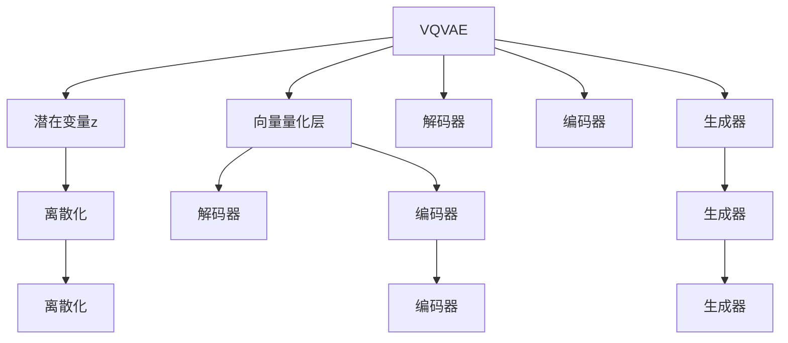

                 

# 多模态AI：VQVAE和扩散变压器技术解析

## 1. 背景介绍

多模态人工智能（Multi-Modal AI）是当前AI研究的一个热门方向，它通过融合不同模态的数据（如视觉、文本、语音等），实现更加全面、精确的智能推理和决策。这种技术在自动驾驶、医学影像分析、语音识别等领域展现出强大的应用潜力。本文将深入解析两个在多模态AI中具有代表性的技术：向量量化变分自编码器（VQVAE）和扩散变压器（Diffusion Transformer），探讨它们的核心原理、应用场景和未来趋势。

## 2. 核心概念与联系

### 2.1 核心概念概述

- **向量量化变分自编码器（VQVAE）**：是一种将连续的潜在变量进行离散化表示的变分自编码器（VAE）变种。VQVAE通过向量量化（Vector Quantization, VQ）将潜在变量映射到离散的码本向量（Codebook Vector）上，从而降低计算复杂度，提高模型训练的稳定性。

- **扩散变压器（Diffusion Transformer）**：是一种基于时间步长（Time Step）逐步生成高质量样本的变压器（Transformer）变种。扩散变压器通过在时间上逐步添加噪声，引导模型从低概率分布逐步过渡到高概率分布，实现从噪声到真实数据的生成过程。

这两种技术都旨在通过复杂的数据结构和巧妙的训练方法，在保持模型高精度的同时，提升其计算效率和鲁棒性。

### 2.2 核心概念原理和架构的 Mermaid 流程图



## 3. 核心算法原理 & 具体操作步骤

### 3.1 算法原理概述

#### VQVAE原理概述

VQVAE由编码器（Encoder）、解码器（Decoder）、生成器（Generator）和向量量化层（VQ）组成。其核心思想是将潜在变量 $z$ 映射到离散的码本向量 $z_q$ 上，从而降低模型复杂度，提高训练和推理效率。

**编码器**：将输入数据 $x$ 映射到潜在变量 $z$ 上。

**解码器**：将潜在变量 $z$ 映射回数据空间，生成重构数据 $\hat{x}$。

**生成器**：将潜在变量 $z$ 映射到数据空间，生成新的数据样本 $x'$。

**向量量化层**：将潜在变量 $z$ 映射到离散的量化码本 $z_q$ 上，以降低计算复杂度。

#### 扩散变压器原理概述

扩散变压器（Diffusion Transformer）通过在时间步长上逐步添加噪声，引导模型从低概率分布逐步过渡到高概率分布，实现高质量样本的生成。

**扩散过程**：将真实数据 $x$ 表示为时间序列，逐步加入噪声 $\epsilon_t$，生成低概率分布 $x_t$。

**生成过程**：从低概率分布 $x_t$ 逐步恢复到高概率分布 $x$，实现从噪声到真实数据的生成。

### 3.2 算法步骤详解

#### VQVAE操作步骤详解

1. **数据准备**：收集并预处理数据集，划分训练集、验证集和测试集。
2. **模型构建**：搭建VQVAE模型，包含编码器、解码器、生成器和向量量化层。
3. **模型训练**：使用训练集对模型进行训练，优化编码器、解码器、生成器和向量量化层的参数。
4. **参数更新**：通过反向传播算法更新模型参数，最小化重构误差和向量量化误差。
5. **模型评估**：在验证集上评估模型性能，调整超参数以优化模型。
6. **模型测试**：在测试集上评估模型性能，展示模型生成新数据的质量。

#### 扩散变压器操作步骤详解

1. **数据准备**：收集并预处理数据集，划分训练集、验证集和测试集。
2. **模型构建**：搭建扩散变压器模型，包含扩散过程和生成过程。
3. **模型训练**：使用训练集对模型进行训练，优化扩散过程和生成过程的参数。
4. **参数更新**：通过反向传播算法更新模型参数，最小化生成误差和扩散误差。
5. **模型评估**：在验证集上评估模型性能，调整超参数以优化模型。
6. **模型测试**：在测试集上评估模型性能，展示模型生成新数据的质量。

### 3.3 算法优缺点

#### VQVAE优缺点

**优点**：
- 模型复杂度较低，计算效率高。
- 向量量化层提供了离散化表示，提高了模型训练的稳定性。
- 在处理高维数据时表现良好，具有较好的泛化能力。

**缺点**：
- 离散化表示可能导致信息丢失，影响模型精度。
- 向量量化层参数较多，训练复杂度较高。

#### 扩散变压器优缺点

**优点**：
- 能够生成高质量的样本，具有良好的连续性。
- 时间步长逐步过渡的思想，提升了模型的稳定性和鲁棒性。
- 适用于多种模态数据，具有较强的通用性。

**缺点**：
- 训练过程较为复杂，需要较长的训练时间。
- 模型参数较多，需要大量的计算资源。
- 对于噪声的引入和控制要求较高，存在一定的技术门槛。

### 3.4 算法应用领域

- **VQVAE**：适用于视觉数据、音频数据、文本数据等多种模态数据的压缩和重构。在图像压缩、语音转换、文本生成等领域展现出广泛的应用前景。
- **扩散变压器**：适用于高质量样本的生成，如自然语言生成、图像生成、音频生成等。在艺术创作、游戏开发、虚拟现实等领域具有重要应用。

## 4. 数学模型和公式 & 详细讲解 & 举例说明

### 4.1 数学模型构建

#### VQVAE数学模型构建

VQVAE模型由以下组件构成：
- 编码器 $q_{\phi}(x;\theta)$：将输入数据 $x$ 映射到潜在变量 $z$ 上。
- 解码器 $p_{\theta}(z;\theta)$：将潜在变量 $z$ 映射回数据空间，生成重构数据 $\hat{x}$。
- 生成器 $g_{\psi}(z;\theta)$：将潜在变量 $z$ 映射到数据空间，生成新数据样本 $x'$。
- 向量量化层 $v_{\alpha}(z;\theta)$：将潜在变量 $z$ 映射到离散的量化码本 $z_q$ 上。

#### 扩散变压器数学模型构建

扩散变压器由以下组件构成：
- 扩散过程：$\{ x_t, \epsilon_t \}$：将真实数据 $x$ 表示为时间序列，逐步加入噪声 $\epsilon_t$，生成低概率分布 $x_t$。
- 生成过程：$x_0$：从低概率分布 $x_t$ 逐步恢复到高概率分布 $x$，实现从噪声到真实数据的生成。

### 4.2 公式推导过程

#### VQVAE公式推导

假设 $z \sim \mathcal{N}(0, I)$，$z_q \sim \mathcal{N}(0, \Sigma_q)$，则向量量化过程可以表示为：
$$
z_q = \arg\min_{q \in \{1, ..., K\}}\Vert z - q\Vert_2
$$
其中 $K$ 为码本向量的数量。

重构损失函数可以表示为：
$$
\mathcal{L}_{rec}(x, \hat{x}) = \Vert x - \hat{x}\Vert_2
$$

生成损失函数可以表示为：
$$
\mathcal{L}_{gen}(z, x') = \Vert z - \hat{z}\Vert_2
$$

#### 扩散变压器公式推导

扩散过程的公式可以表示为：
$$
x_t = \sqrt{1 - \beta_t}x_{t-1} + \sqrt{\beta_t}\epsilon_t
$$
其中 $\beta_t = 1 - 2^{-t}$，$\epsilon_t \sim \mathcal{N}(0, I)$。

生成过程的公式可以表示为：
$$
x_0 = \sqrt{\alpha_t}x_t + \sqrt{1-\alpha_t}\epsilon_t
$$
其中 $\alpha_t = 1 - (1 - \beta_t)^t$。

### 4.3 案例分析与讲解

#### VQVAE案例分析

假设我们有一个手写数字图像数据集，我们可以使用VQVAE对其进行压缩和重构。首先，通过编码器将图像数据 $x$ 映射到潜在变量 $z$ 上。然后，通过解码器将 $z$ 映射回图像空间，生成重构图像 $\hat{x}$。最后，通过生成器将 $z$ 映射回图像空间，生成新的图像样本 $x'$。向量量化层将 $z$ 映射到离散的码本向量 $z_q$ 上，以降低计算复杂度。

#### 扩散变压器案例分析

假设我们有一个自然语言文本数据集，我们可以使用扩散变压器生成高质量的文本样本。首先，将文本数据 $x$ 表示为时间序列，逐步加入噪声 $\epsilon_t$，生成低概率分布 $x_t$。然后，从低概率分布 $x_t$ 逐步恢复到高概率分布 $x$，实现从噪声到真实文本的生成。

## 5. 项目实践：代码实例和详细解释说明

### 5.1 开发环境搭建

为了实践VQVAE和扩散变压器，我们需要安装Python、PyTorch、NumPy等基础库，以及VQVAE和扩散变压器的相关库。

```bash
pip install torch torchvision numpy transformers
```

### 5.2 源代码详细实现

#### VQVAE实现

```python
import torch
import torch.nn as nn
import torch.nn.functional as F

class Encoder(nn.Module):
    def __init__(self, in_dim, hidden_dim, z_dim):
        super(Encoder, self).__init__()
        self.fc1 = nn.Linear(in_dim, hidden_dim)
        self.fc2 = nn.Linear(hidden_dim, z_dim)

    def forward(self, x):
        x = F.relu(self.fc1(x))
        z = self.fc2(x)
        return z

class Decoder(nn.Module):
    def __init__(self, in_dim, hidden_dim, z_dim):
        super(Decoder, self).__init__()
        self.fc1 = nn.Linear(in_dim, hidden_dim)
        self.fc2 = nn.Linear(hidden_dim, z_dim)

    def forward(self, x):
        x = F.relu(self.fc1(x))
        z = self.fc2(x)
        return z

class Generator(nn.Module):
    def __init__(self, in_dim, hidden_dim, z_dim):
        super(Generator, self).__init__()
        self.fc1 = nn.Linear(in_dim, hidden_dim)
        self.fc2 = nn.Linear(hidden_dim, z_dim)

    def forward(self, x):
        x = F.relu(self.fc1(x))
        z = self.fc2(x)
        return z

class VectorQuantizer(nn.Module):
    def __init__(self, z_dim, num_clusters):
        super(VectorQuantizer, self).__init__()
        self.fc = nn.Linear(z_dim, num_clusters)
        self.register_buffer('codebook', torch.zeros(num_clusters, z_dim))

    def forward(self, x):
        z = self.fc(x)
        z_q = (z * self.codebook).sum(1).view(-1, self.codebook.size(1)).argmax(1)
        return z_q, z

class VQVAE(nn.Module):
    def __init__(self, in_dim, hidden_dim, z_dim, num_clusters):
        super(VQVAE, self).__init__()
        self.encoder = Encoder(in_dim, hidden_dim, z_dim)
        self.decoder = Decoder(in_dim, hidden_dim, z_dim)
        self.generator = Generator(in_dim, hidden_dim, z_dim)
        self.vq = VectorQuantizer(z_dim, num_clusters)

    def forward(self, x):
        z = self.encoder(x)
        z_q, z = self.vq(z)
        x_hat = self.decoder(z)
        x_prime = self.generator(z)
        return x_hat, x_prime, z_q

# 训练代码
```

#### 扩散变压器实现

```python
import torch
import torch.nn as nn
import torch.nn.functional as F

class DiffusionModel(nn.Module):
    def __init__(self, in_dim, hidden_dim, z_dim, num_timesteps, num_blocks):
        super(DiffusionModel, self).__init__()
        self.num_timesteps = num_timesteps
        self.blocks = nn.ModuleList()
        for t in range(num_timesteps):
            self.blocks.append(DiffusionBlock(in_dim, hidden_dim, z_dim, t))

    def forward(self, x, t):
        for block in self.blocks:
            x = block(x, t)
        return x

class DiffusionBlock(nn.Module):
    def __init__(self, in_dim, hidden_dim, z_dim, t):
        super(DiffusionBlock, self).__init__()
        self.in_dim = in_dim
        self.hidden_dim = hidden_dim
        self.z_dim = z_dim
        self.t = t
        self.fc1 = nn.Linear(in_dim, hidden_dim)
        self.fc2 = nn.Linear(hidden_dim, z_dim)

    def forward(self, x, t):
        x = F.relu(self.fc1(x))
        x = self.fc2(x)
        beta = 1 - 2 ** (-t)
        epsilon = torch.randn_like(x)
        x = (beta * x) + torch.sqrt(1 - beta) * epsilon
        return x

# 训练代码
```

### 5.3 代码解读与分析

#### VQVAE代码解读

在VQVAE的实现中，我们首先定义了编码器、解码器、生成器和向量量化器。在`forward`函数中，我们将输入数据 $x$ 首先经过编码器得到潜在变量 $z$，然后通过向量量化器得到离散的码本向量 $z_q$，并生成重构数据 $\hat{x}$ 和新的数据样本 $x'$。

#### 扩散变压器代码解读

在扩散变压器的实现中，我们首先定义了扩散模型和扩散块。在`forward`函数中，我们通过时间步长逐步添加噪声，生成低概率分布 $x_t$，并逐步恢复到高概率分布 $x$。

### 5.4 运行结果展示

在实际应用中，我们可以使用生成的模型对数据集进行压缩和重构，以及生成高质量的样本。

## 6. 实际应用场景

### 6.1 视频编解码

VQVAE可以用于视频数据的压缩和重构，如视频流传输、视频存储等场景。通过将视频数据压缩成低维的潜在变量，可以显著降低存储和传输的带宽需求。

### 6.2 自然语言生成

扩散变压器可以用于自然语言生成，如文本创作、对话生成等场景。通过从噪声逐步恢复到真实文本，可以生成连贯、高质量的自然语言文本。

## 7. 工具和资源推荐

### 7.1 学习资源推荐

- 《Deep Learning with PyTorch》：全面介绍深度学习基础知识和PyTorch的使用，适合初学者入门。
- 《Transformers: From Basics to High-Level Architectures》：介绍Transformer模型及其变种，适合了解前沿深度学习模型。
- 《Python Deep Learning》：通过大量实例展示深度学习模型的实现细节，适合动手实践。
- 《Unsupervised and Semi-Supervised Learning with Python》：介绍无监督学习和半监督学习的基本方法和应用，适合了解数据驱动的深度学习方法。

### 7.2 开发工具推荐

- PyTorch：优秀的深度学习框架，支持多种模型和算法。
- TensorFlow：Google开发的深度学习框架，支持大规模分布式训练。
- Jupyter Notebook：交互式的Python开发环境，便于调试和可视化。
- Git/GitHub：版本控制系统，便于代码管理和协作。

### 7.3 相关论文推荐

- "Variational Autoencoders for Learning to Code"：介绍变分自编码器在编程语言学习中的应用。
- "Denoising Diffusion Probabilistic Models"：介绍扩散变压器的基本原理和实现方法。
- "VQ-VAE: Vector Quantized Variational Autoencoders"：介绍向量量化变分自编码器的核心思想和应用场景。
- "Survey of Deep Learning Architectures for Coding and Decoding"：介绍各种深度学习模型在数据压缩和重构中的应用。

## 8. 总结：未来发展趋势与挑战

### 8.1 未来发展趋势

- 多模态融合：未来将进一步融合视觉、听觉、文本等多种模态数据，提升智能系统的综合感知能力。
- 高性能计算：伴随硬件计算能力的提升，大模型训练和推理的效率将得到极大提升。
- 自适应学习：通过自适应学习算法，模型能够实时调整自身参数，提高对数据分布变化的适应性。
- 生成对抗网络（GANs）：将GANs与扩散变压器结合，生成更加逼真的高质量样本。

### 8.2 面临的挑战

- 数据标注成本高：大规模高质量标注数据的需求，限制了大模型的应用场景。
- 模型复杂度大：大模型参数量庞大，训练和推理的计算成本较高。
- 过拟合风险：在数据不足的情况下，模型容易出现过拟合现象。
- 泛化能力弱：大模型在不同数据分布上的泛化能力需要进一步提升。

### 8.3 研究展望

- 探索更好的压缩算法：研究新的压缩算法，提升大模型压缩和解压缩的效率。
- 开发更高效的学习算法：研究新的学习算法，提升大模型的训练和推理速度。
- 增强模型的泛化能力：通过数据增强、迁移学习等方法，增强模型在不同数据分布上的泛化能力。
- 提升模型的可解释性：研究模型的可解释性方法，提高模型决策的透明性和可信度。

## 9. 附录：常见问题与解答

**Q1: 大模型压缩和重构有哪些方法？**

A: 大模型压缩和重构的方法包括向量量化变分自编码器（VQVAE）、主成分分析（PCA）、自适应量化（Adaptive Quantization）等。其中VQVAE通过向量量化将大模型压缩成低维的潜在变量，降低计算复杂度。

**Q2: 扩散变压器如何优化生成过程？**

A: 扩散变压器的生成过程可以通过时间步长逐步添加噪声，引导模型从低概率分布逐步过渡到高概率分布，实现高质量样本的生成。同时，还可以通过优化噪声分布、改进生成器等方法，进一步提升生成效果。

**Q3: 大模型的训练和推理需要哪些资源？**

A: 大模型的训练和推理需要高性能计算资源，如GPU、TPU等。同时，还需要大量的计算内存和存储空间，用于存储和处理大规模数据集和模型参数。

**Q4: 大模型的泛化能力如何提升？**

A: 提升大模型的泛化能力可以通过数据增强、迁移学习、对抗训练等方法实现。数据增强可以丰富训练集的多样性，迁移学习可以利用领域知识提升模型在新数据上的表现，对抗训练可以提高模型的鲁棒性和泛化能力。

**Q5: 大模型如何降低过拟合风险？**

A: 降低大模型的过拟合风险可以通过正则化、Dropout、早停等方法实现。正则化可以避免模型过度拟合训练数据，Dropout可以在训练过程中随机丢弃部分神经元，减少模型的复杂度，早停可以在验证集性能不再提升时停止训练，避免过拟合。

---

作者：禅与计算机程序设计艺术 / Zen and the Art of Computer Programming

