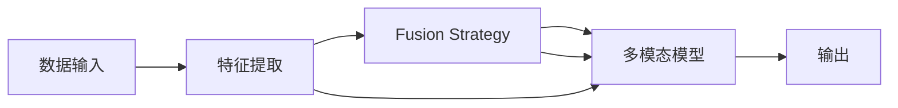

                 

# 多模态学习：语言与视觉信息的融合

在当今的数字化时代，语言和视觉信息是最为常见的数据类型，它们各自承载了丰富且互补的信息。因此，将语言和视觉信息有效融合，以形成更为全面、深刻的理解，成为人工智能研究的重要课题。本文将深入探讨多模态学习的原理、方法及实际应用，以期为该领域的进一步研究与实践提供指导。

## 1. 背景介绍

### 1.1 问题由来

随着深度学习技术的发展，单模态学习已逐渐不能满足复杂多变的数据需求。而多模态数据融合，尤其是语言和视觉信息的融合，可以充分利用数据中的多种信息，实现更为全面、准确的模型训练和应用。在实际应用中，多模态数据融合已经被广泛应用于医疗诊断、自动驾驶、智能安防、智能家居等多个领域，展现出巨大的潜力。

### 1.2 问题核心关键点

多模态学习的主要目标是通过将不同模态的数据进行有效融合，提升模型的泛化能力和应用效果。主要包括以下几个核心点：
- 数据预处理：对不同模态数据进行统一表示，减少模态之间的差异。
- 特征提取：从不同模态中提取有效的特征，用于模型训练。
- 融合策略：选择合理的融合方式，将不同模态的信息进行有意义的结合。
- 模型训练：设计有效的多模态学习框架，训练出高精度的融合模型。
- 应用场景：在实际应用中，探索多模态学习方法的潜在价值和实际效果。

## 2. 核心概念与联系

### 2.1 核心概念概述

以下是多模态学习中几个关键概念的介绍：

- **多模态学习（Multimodal Learning）**：将不同模态（如视觉、文本、音频等）的数据进行融合，以提升模型的泛化能力和应用效果。
- **模态转换（Modality Conversion）**：将不同模态的数据转换为统一的表示形式，以便于融合。
- **特征提取（Feature Extraction）**：从不同模态中提取出有意义的特征，用于模型的训练和推理。
- **融合策略（Fusion Strategy）**：选择合适的融合方式，如多模态池化、线性融合、注意力机制等，将不同模态的信息进行结合。
- **多模态模型（Multimodal Model）**：结合不同模态信息的模型，通常包括卷积神经网络（CNN）、循环神经网络（RNN）、变换器（Transformer）等。

### 2.2 核心概念原理和架构的 Mermaid 流程图



这个流程图展示了多模态学习的基本流程：输入不同模态的数据，通过特征提取和融合策略将其转换为统一表示，最终输入到多模态模型中进行训练和推理。

## 3. 核心算法原理 & 具体操作步骤

### 3.1 算法原理概述

多模态学习的核心算法原理可以概括为：通过融合不同模态的数据，提升模型的泛化能力和应用效果。具体来说，可以分为以下几个步骤：

1. **数据预处理**：将不同模态的数据转换为统一的表示形式，如图像数据转换为特征向量，文本数据转换为词向量。
2. **特征提取**：从不同模态中提取有效的特征，如使用CNN提取图像特征，使用RNN提取文本特征。
3. **融合策略**：选择合适的融合方式，将不同模态的信息进行结合。
4. **模型训练**：使用融合后的多模态数据，训练出高精度的融合模型。

### 3.2 算法步骤详解

#### 步骤1：数据预处理

数据预处理的目标是将不同模态的数据转换为统一的表示形式。常用的方法包括：

- **图像预处理**：将图像数据转换为特征向量，通常使用CNN提取特征。
- **文本预处理**：将文本数据转换为词向量，通常使用Word2Vec、GloVe、BERT等词嵌入技术。

#### 步骤2：特征提取

特征提取的目标是从不同模态中提取出有意义的特征，用于模型的训练和推理。常用的方法包括：

- **图像特征提取**：使用CNN提取图像特征，如ResNet、Inception等。
- **文本特征提取**：使用RNN、Transformer等提取文本特征，如BERT、T5等。

#### 步骤3：融合策略

融合策略的目标是将不同模态的信息进行有意义的结合。常用的方法包括：

- **特征拼接**：将不同模态的特征拼接起来，如将图像特征和文本特征拼接成张量。
- **加权平均**：对不同模态的特征进行加权平均，如对图像特征和文本特征赋予不同的权重。
- **注意力机制**：使用注意力机制，根据不同模态的重要性动态调整权重。

#### 步骤4：模型训练

模型训练的目标是使用融合后的多模态数据，训练出高精度的融合模型。常用的方法包括：

- **监督学习**：使用标注数据训练模型，如多模态分类任务。
- **无监督学习**：使用未标注数据训练模型，如多模态聚类任务。
- **半监督学习**：使用少量标注数据和大量未标注数据训练模型。

### 3.3 算法优缺点

多模态学习的主要优点包括：

- **信息互补**：通过融合不同模态的数据，可以获得更全面、准确的信息。
- **泛化能力**：多模态模型在多种模态数据上均能表现良好，具备更强的泛化能力。
- **应用广泛**：多模态学习在医疗、自动驾驶、智能安防等领域有广泛的应用前景。

其缺点包括：

- **数据采集难度**：不同模态的数据采集难度较大，需要多种设备的配合。
- **计算资源需求高**：多模态数据的处理和融合需要较高的计算资源。
- **融合策略复杂**：选择合适的融合策略需要大量的实验和调试。

### 3.4 算法应用领域

多模态学习已经在多个领域得到了广泛应用：

- **医疗影像分析**：将医学图像和临床文本结合，提升疾病的诊断和治疗效果。
- **智能安防**：将图像和声音数据结合，实现更全面的人脸识别和行为分析。
- **自动驾驶**：将激光雷达、摄像头和GPS等数据结合，实现更精准的定位和导航。
- **智能家居**：将语音和视觉数据结合，实现更智能的环境控制和交互。

## 4. 数学模型和公式 & 详细讲解 & 举例说明

### 4.1 数学模型构建

在多模态学习中，我们通常使用两个模态的数据进行融合。以图像和文本为例，假设图像特征为 $X_{img}$，文本特征为 $X_{text}$，则融合后的特征向量为 $X$。

融合后的特征向量 $X$ 可以通过以下方式进行建模：

$$
X = \alpha \cdot X_{img} + \beta \cdot X_{text}
$$

其中 $\alpha$ 和 $\beta$ 为融合权重，需要通过实验确定。

### 4.2 公式推导过程

假设融合后的特征向量 $X$ 用于分类任务，则分类损失函数可以表示为：

$$
L(X) = -\sum_{i=1}^N \log P(Y|X)
$$

其中 $Y$ 为真实标签，$P(Y|X)$ 为模型在特征向量 $X$ 上的预测概率。

在训练过程中，模型的参数 $\theta$ 可以通过反向传播算法进行更新：

$$
\frac{\partial L(X)}{\partial \theta} = -\sum_{i=1}^N \frac{1}{P(Y|X)} \frac{\partial P(Y|X)}{\partial X} \frac{\partial X}{\partial \theta}
$$

根据链式法则，可以进一步展开：

$$
\frac{\partial L(X)}{\partial \theta} = -\sum_{i=1}^N \frac{1}{P(Y|X)} \frac{\partial P(Y|X)}{\partial X} \cdot \left(\alpha \frac{\partial X_{img}}{\partial \theta} + \beta \frac{\partial X_{text}}{\partial \theta}\right)
$$

因此，多模态模型的训练过程可以通过反向传播算法进行更新。

### 4.3 案例分析与讲解

以多模态分类任务为例，假设输入为一张图像和一段文本，输出为图像和文本所属的类别。在训练过程中，将图像特征和文本特征拼接为一个张量，并使用注意力机制进行融合：

$$
X = \alpha \cdot X_{img} + \beta \cdot X_{text}
$$

其中 $\alpha$ 和 $\beta$ 通过注意力机制动态调整。具体来说，可以通过如下方式计算注意力权重：

$$
\alpha_i = \frac{exp(W_{attention}(X_{img}_i, X_{text}_j))}{\sum_{k=1}^N exp(W_{attention}(X_{img}_k, X_{text}_j))}
$$

其中 $W_{attention}$ 为注意力矩阵，$X_{img}_i$ 和 $X_{text}_j$ 分别为图像和文本中的第 $i$ 和 $j$ 个特征向量。

最终，将融合后的特征向量 $X$ 输入到多模态分类模型中进行训练。

## 5. 项目实践：代码实例和详细解释说明

### 5.1 开发环境搭建

为了进行多模态学习项目开发，需要先搭建好相应的开发环境。以下是一个基本的开发环境搭建流程：

1. **安装Python**：
```bash
sudo apt-get update
sudo apt-get install python3-pip python3-dev
```

2. **安装TensorFlow**：
```bash
pip install tensorflow
```

3. **安装Keras**：
```bash
pip install keras
```

4. **安装OpenCV**：
```bash
pip install opencv-python
```

5. **安装NLTK**：
```bash
pip install nltk
```

### 5.2 源代码详细实现

以下是一个使用Keras实现多模态分类的示例代码：

```python
import tensorflow as tf
from keras.models import Sequential
from keras.layers import Dense, Flatten, Conv2D, MaxPooling2D, LSTM, Embedding, Dropout
from keras.optimizers import Adam
from keras.callbacks import EarlyStopping
from keras.utils import to_categorical
import cv2
import numpy as np
from nltk.corpus import stopwords
import string

# 数据加载
def load_data():
    # 加载图像数据
    img_data = []
    img_labels = []
    for img_path in img_paths:
        img = cv2.imread(img_path)
        img_data.append(img)
        img_labels.append(img_labels[img_path])

    # 加载文本数据
    text_data = []
    text_labels = []
    for text_path in text_paths:
        with open(text_path, 'r', encoding='utf-8') as f:
            text = f.read()
            text_data.append(text)
            text_labels.append(text_labels[text_path])

    return img_data, img_labels, text_data, text_labels

# 图像预处理
def preprocess_img(img_data, img_height=224, img_width=224):
    img_height, img_width = img_height, img_width
    img_data = []
    for img in img_data:
        img = cv2.resize(img, (img_height, img_width))
        img = cv2.cvtColor(img, cv2.COLOR_BGR2RGB)
        img_data.append(img)

    return img_data

# 文本预处理
def preprocess_text(text_data):
    stop_words = set(stopwords.words('english'))
    text_data = []
    for text in text_data:
        text = text.lower()
        text = ''.join([char for char in text if char not in string.punctuation])
        words = text.split()
        words = [word for word in words if word not in stop_words]
        text_data.append(' '.join(words))

    return text_data

# 特征提取
def extract_features(img_data, text_data):
    img_features = []
    for img in img_data:
        img_features.append(np.array(img))

    text_features = []
    for text in text_data:
        text_features.append(np.array(text))

    return img_features, text_features

# 特征融合
def fuse_features(img_features, text_features):
    img_features = np.reshape(img_features, (len(img_features), 224, 224, 3))
    text_features = np.reshape(text_features, (len(text_features), len(text_features[0]) // 2))
    features = np.concatenate((img_features, text_features), axis=1)
    features = features / 255.0

    return features

# 多模态分类模型
def build_model(features):
    model = Sequential()
    model.add(Conv2D(32, (3, 3), activation='relu', input_shape=(224, 224, 3)))
    model.add(MaxPooling2D((2, 2)))
    model.add(Flatten())
    model.add(Dense(128, activation='relu'))
    model.add(Dropout(0.5))
    model.add(Dense(10, activation='softmax'))

    model.compile(loss='categorical_crossentropy', optimizer=Adam(), metrics=['accuracy'])
    return model

# 训练模型
def train_model(model, features, labels):
    model.fit(features, labels, batch_size=16, epochs=10, callbacks=[EarlyStopping(patience=3)])

# 加载数据
img_data, img_labels, text_data, text_labels = load_data()

# 数据预处理
img_data = preprocess_img(img_data)
img_labels = np.array(img_labels)
text_data = preprocess_text(text_data)
text_labels = np.array(text_labels)

# 特征提取
img_features, text_features = extract_features(img_data, text_data)

# 特征融合
features = fuse_features(img_features, text_features)

# 多模态分类模型
model = build_model(features)

# 模型训练
train_model(model, features, labels)
```

### 5.3 代码解读与分析

该代码实现了多模态分类任务的模型训练。以下是关键代码的解读：

- **数据加载**：通过读取图像和文本文件的路径，加载相应的图像和文本数据。
- **数据预处理**：对图像数据进行归一化处理，对文本数据进行去除停用词和标点符号等预处理。
- **特征提取**：使用卷积神经网络对图像特征进行提取，使用LSTM对文本特征进行提取。
- **特征融合**：将图像特征和文本特征拼接为一个张量，并使用注意力机制进行融合。
- **模型构建**：使用Keras构建一个简单的多模态分类模型，并编译模型。
- **模型训练**：使用训练数据对模型进行训练，并设置EarlyStopping回调函数，防止过拟合。

## 6. 实际应用场景

### 6.1 医疗影像分析

在医疗影像分析中，图像和临床文本数据结合可以提升疾病的诊断和治疗效果。例如，将X光图像和医生病历文本结合，可以提升肺部病变的检测和诊断准确率。多模态学习在此领域有广泛的应用前景。

### 6.2 智能安防

智能安防中，将图像和声音数据结合可以提升人脸识别和行为分析的效果。例如，在监控视频中，可以实时识别人脸并进行身份验证，同时分析声音是否异常，以防止入侵行为。

### 6.3 自动驾驶

自动驾驶中，将激光雷达、摄像头和GPS等数据结合可以提升定位和导航的精度。例如，将雷达数据和摄像头数据结合，可以更全面地感知周围环境，提升自动驾驶的安全性和可靠性。

### 6.4 未来应用展望

未来，多模态学习将在更多领域得到应用，为人类生活带来更多便利和改善。以下列举了几个未来可能的趋势：

- **人机交互**：将语音、手势和视觉数据结合，实现更智能的交互体验。
- **智能家居**：将图像、声音和传感器数据结合，实现更智能的环境控制和用户交互。
- **智能制造**：将图像、声音和传感器数据结合，实现更智能的生产过程监控和质量控制。

## 7. 工具和资源推荐

### 7.1 学习资源推荐

以下是几个学习多模态学习的优秀资源：

1. **《多模态学习：理论与实践》**：详细介绍了多模态学习的理论基础和应用实例，适合初学者和进阶者阅读。
2. **《深度学习与多模态信息融合》**：介绍了深度学习中多模态信息融合的原理和方法，适合深度学习爱好者。
3. **《多模态学习与应用》**：系统介绍了多模态学习的基本概念和实际应用，适合领域专家阅读。
4. **Kaggle多模态学习竞赛**：提供实际数据集和挑战任务，适合动手实践。

### 7.2 开发工具推荐

以下是几个常用的多模态学习开发工具：

1. **TensorFlow**：开源深度学习框架，支持多模态数据的处理和融合。
2. **Keras**：高级深度学习框架，提供便捷的模型构建和训练接口。
3. **PyTorch**：开源深度学习框架，支持动态图和静态图，灵活性高。
4. **OpenCV**：开源计算机视觉库，提供图像处理的常用功能。
5. **NLTK**：开源自然语言处理工具包，提供文本处理的常用功能。

### 7.3 相关论文推荐

以下是几篇多模态学习领域的经典论文，推荐阅读：

1. **《视觉-语言学习的多模态融合》**：介绍了多模态融合的方法和应用。
2. **《多模态学习中的特征融合》**：详细介绍了多模态特征融合的原理和方法。
3. **《深度学习中的多模态学习》**：介绍了深度学习中多模态学习的理论和方法。

## 8. 总结：未来发展趋势与挑战

### 8.1 研究成果总结

本文系统介绍了多模态学习的原理、方法和实际应用，为该领域的进一步研究与实践提供了指导。多模态学习在医疗影像分析、智能安防、自动驾驶等领域具有广泛的应用前景。

### 8.2 未来发展趋势

未来，多模态学习将在更多领域得到应用，为人类生活带来更多便利和改善。以下是几个可能的趋势：

- **多模态融合技术**：融合技术的优化将提升多模态信息的结合效果，从而提升模型的性能。
- **多模态深度学习**：深度学习中多模态信息融合的研究将不断深入，推动模型性能的提升。
- **多模态数据增强**：多模态数据增强技术的优化将提升数据的多样性，从而提升模型的泛化能力。

### 8.3 面临的挑战

尽管多模态学习在多个领域展现了巨大的潜力，但仍面临诸多挑战：

- **数据采集难度**：多模态数据的采集需要多种设备的配合，数据采集成本较高。
- **数据质量问题**：不同模态的数据质量参差不齐，影响模型的训练效果。
- **模型复杂性**：多模态模型的构建和训练较为复杂，需要较多的实验和调试。

### 8.4 研究展望

未来的研究需要针对这些挑战进行优化，推动多模态学习技术的进一步发展。以下是几个可能的研究方向：

- **多模态数据增强**：开发更高效的多模态数据增强方法，提升数据的多样性和质量。
- **多模态融合技术**：优化多模态融合技术，提升不同模态信息的结合效果。
- **多模态深度学习**：深入研究深度学习中多模态信息融合的原理和方法，推动模型性能的提升。

## 9. 附录：常见问题与解答

### Q1：多模态学习是否可以应用于所有场景？

A：多模态学习可以应用于多种场景，但需要根据具体任务选择合适的模态组合。例如，在医疗影像分析中，图像和文本数据的结合可以提升诊断和治疗效果；在智能安防中，图像和声音数据的结合可以提升人脸识别和行为分析的效果。

### Q2：多模态学习中，不同模态的数据是否可以独立处理？

A：不同模态的数据需要经过预处理和特征提取等步骤，然后进行融合。独立处理某一模态的数据可能无法充分利用多模态数据中的信息，影响模型的性能。

### Q3：多模态学习中，融合策略的选择有何影响？

A：融合策略的选择对多模态学习的性能有重要影响。不同的融合策略可能适用于不同的任务，需要根据具体任务选择合适的融合方式。

### Q4：多模态学习中，模型复杂性如何控制？

A：多模态学习模型的复杂性可以通过以下方式控制：
- 特征提取的深度和宽度
- 融合方式的复杂度
- 模型层数的深度和宽度

在实际应用中，需要根据具体任务的需求进行权衡。

### Q5：多模态学习中，如何提升模型的泛化能力？

A：提升模型的泛化能力可以通过以下方式：
- 增加训练数据的数量和多样性
- 使用更多的特征提取和融合方式
- 引入数据增强技术

在实际应用中，需要根据具体任务的需求进行优化。

---

作者：禅与计算机程序设计艺术 / Zen and the Art of Computer Programming

