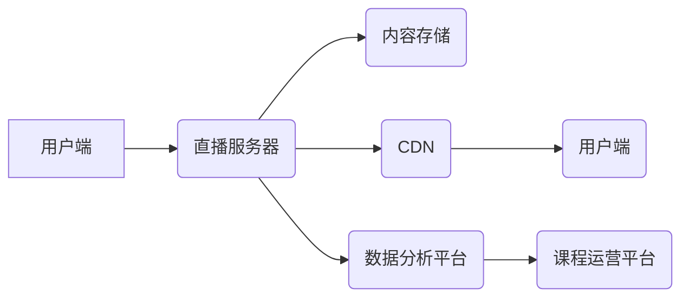

                 

## 如何利用直播平台增加课程复购率

> 关键词：直播平台、课程复购率、用户互动、数据分析、个性化推荐、内容运营、直播技术

## 1. 背景介绍

在线教育行业近年来发展迅速，直播课程作为一种新型的教学模式，凭借其互动性强、实时性高、体验感强的特点，逐渐成为教育领域的主流趋势。然而，课程复购率一直是困扰在线教育平台的一大难题。如何有效提升课程复购率，是平台持续发展和盈利的重要课题。

直播平台作为一种强大的工具，为提升课程复购率提供了新的可能性。通过巧妙地利用直播平台的特性，可以增强用户参与度，提升用户体验，最终促进课程复购。

## 2. 核心概念与联系

### 2.1 直播平台与课程复购率

直播平台提供了一个实时互动、双向传播的学习环境，可以打破传统课程的单向授课模式，增强用户参与度和学习兴趣。

**直播平台的特性与课程复购率的关系：**

* **实时互动:** 直播平台支持用户实时提问、评论、点赞等互动行为，可以增强用户参与感，提升学习体验。
* **内容丰富:** 直播平台可以结合多种内容形式，如视频、音频、文字、图片等，丰富课程内容，满足不同用户的学习需求。
* **数据分析:** 直播平台可以收集用户观看、互动、评价等数据，为课程运营提供数据支持，帮助平台了解用户需求，优化课程内容。

**直播平台与课程复购率的关联关系可概括为：**

* **提升用户参与度 -> 增强用户体验 -> 提高课程满意度 -> 促进课程复购**

### 2.2 直播平台架构

**直播平台架构示意图:**



**架构说明:**

* **用户端:** 用户通过手机、电脑等设备观看直播课程。
* **直播服务器:** 处理直播信号的接收、编码、转码、推流等功能。
* **内容存储:** 存储直播课程的视频、音频等内容。
* **CDN:** 分布式内容网络，加速直播内容的传输。
* **数据分析平台:** 收集用户观看、互动、评价等数据，进行分析和处理。
* **课程运营平台:** 基于数据分析结果，优化课程内容、推送推荐等。

## 3. 核心算法原理 & 具体操作步骤

### 3.1 算法原理概述

提升课程复购率的核心算法主要围绕用户行为分析、个性化推荐和内容运营三个方面。

* **用户行为分析:** 通过分析用户观看、互动、评价等行为数据，了解用户的学习习惯、兴趣偏好和需求。
* **个性化推荐:** 基于用户行为分析结果，推荐用户感兴趣、有学习价值的课程。
* **内容运营:** 根据用户反馈和数据分析结果，优化课程内容、更新课程素材、策划互动活动等，提升课程质量和用户体验。

### 3.2 算法步骤详解

**1. 数据采集:** 收集用户观看、互动、评价等行为数据，包括观看时长、点赞数、评论内容、课程评分等。

**2. 数据清洗:** 对采集到的数据进行清洗和处理，去除无效数据、重复数据等，保证数据质量。

**3. 数据分析:** 使用数据挖掘、机器学习等技术对数据进行分析，挖掘用户行为模式、兴趣偏好等信息。

**4. 模型构建:** 基于数据分析结果，构建用户画像、课程推荐模型等。

**5. 个性化推荐:** 根据用户画像和课程推荐模型，为用户推荐个性化的课程。

**6. 内容运营:** 根据用户反馈和数据分析结果，优化课程内容、更新课程素材、策划互动活动等。

**7. 评估与优化:** 定期评估算法效果，根据评估结果进行模型优化和算法调整。

### 3.3 算法优缺点

**优点:**

* **精准推荐:** 基于数据分析，可以精准推荐用户感兴趣的课程。
* **提升用户体验:** 个性化推荐和内容运营可以提升用户学习体验，增强用户粘性。
* **提高复购率:** 通过提升用户体验和学习效果，可以有效提高课程复购率。

**缺点:**

* **数据依赖:** 算法效果依赖于数据质量和数据量。
* **模型复杂:** 模型构建和维护需要专业技术人员。
* **隐私安全:** 用户数据安全需要得到保障。

### 3.4 算法应用领域

* 在线教育平台
* 电商平台
* 内容平台
* 社交平台

## 4. 数学模型和公式 & 详细讲解 & 举例说明

### 4.1 数学模型构建

**用户兴趣模型:**

用户对课程的兴趣可以表示为一个概率值，可以通过以下公式计算:

$$
P(u, c) = \frac{s(u, c) * w(u, c)}{\sum_{c'} s(u, c') * w(u, c')}
$$

其中:

* $P(u, c)$: 用户 $u$ 对课程 $c$ 的兴趣概率
* $s(u, c)$: 用户 $u$ 与课程 $c$ 的相似度
* $w(u, c)$: 用户 $u$ 对课程 $c$ 的权重

**课程推荐模型:**

课程推荐模型可以基于用户兴趣模型，推荐用户感兴趣的课程。

### 4.2 公式推导过程

**用户兴趣相似度计算:**

用户与课程的相似度可以基于用户观看历史、点赞记录、评论内容等数据进行计算。可以使用余弦相似度、皮尔逊相关系数等算法进行计算。

**用户权重计算:**

用户对课程的权重可以根据用户的学习时间、学习进度、学习效果等因素进行计算。

### 4.3 案例分析与讲解

**案例:**

假设用户 $A$ 观看过课程 $C1$ 和 $C2$，并对 $C1$ 点赞了 5 次，对 $C2$ 点赞了 2 次。

**计算用户 $A$ 对课程 $C3$ 的兴趣概率:**

需要根据用户 $A$ 的观看历史、点赞记录等数据，计算用户 $A$ 与课程 $C3$ 的相似度和权重，然后代入公式进行计算。

## 5. 项目实践：代码实例和详细解释说明

### 5.1 开发环境搭建

* 操作系统: Ubuntu 20.04
* 编程语言: Python 3.8
* 开发工具: Jupyter Notebook

### 5.2 源代码详细实现

```python
# 用户兴趣模型
def calculate_user_interest(user_id, course_id):
    # 计算用户与课程的相似度
    similarity = calculate_similarity(user_id, course_id)
    # 计算用户对课程的权重
    weight = calculate_weight(user_id, course_id)
    # 计算用户兴趣概率
    interest_probability = (similarity * weight) / sum([similarity * weight for course_id in courses])
    return interest_probability

# 课程推荐模型
def recommend_courses(user_id):
    # 获取用户观看历史
    user_history = get_user_history(user_id)
    # 计算用户对所有课程的兴趣概率
    course_interests = [calculate_user_interest(user_id, course_id) for course_id in courses]
    # 排序课程兴趣概率
    sorted_courses = sorted(zip(courses, course_interests), key=lambda x: x[1], reverse=True)
    # 返回推荐课程列表
    return sorted_courses[:5]

# ... 其他函数
```

### 5.3 代码解读与分析

* `calculate_user_interest()` 函数计算用户对特定课程的兴趣概率。
* `recommend_courses()` 函数根据用户观看历史，计算用户对所有课程的兴趣概率，并返回推荐课程列表。

### 5.4 运行结果展示

运行上述代码，可以得到用户 $A$ 的课程推荐列表。

## 6. 实际应用场景

### 6.1 直播课程复购场景

* **直播课程结束后，根据用户观看时长、互动情况等数据，推荐用户相关的课程或主题，提升用户复购率。**
* **在直播过程中，根据用户实时提问和评论内容，推荐用户感兴趣的课程或资源，增强用户参与度和学习体验。**

### 6.2 其他应用场景

* **在线教育平台:** 个性化推荐课程、学习资源、学习计划等。
* **电商平台:** 个性化推荐商品、优惠活动、促销信息等。
* **内容平台:** 个性化推荐文章、视频、音频等内容。

### 6.4 未来应用展望

随着人工智能技术的不断发展，直播平台将更加智能化、个性化。未来，直播平台可以更加精准地分析用户行为，提供更加个性化的课程推荐和学习体验，进一步提升课程复购率。

## 7. 工具和资源推荐

### 7.1 学习资源推荐

* **在线课程:** Coursera, edX, Udemy 等平台提供丰富的在线课程，涵盖人工智能、机器学习、数据分析等领域。
* **书籍:** 《Python机器学习实战》、《深度学习》等书籍可以帮助你深入了解人工智能和机器学习相关知识。
* **开源项目:** TensorFlow, PyTorch 等开源项目可以帮助你实践人工智能算法。

### 7.2 开发工具推荐

* **Python:** 作为一种流行的编程语言，Python 在人工智能领域应用广泛。
* **Jupyter Notebook:** Jupyter Notebook 是一个交互式编程环境，可以方便地进行代码编写、调试和运行。
* **Scikit-learn:** Scikit-learn 是一个机器学习库，提供各种机器学习算法的实现。

### 7.3 相关论文推荐

* **《Attention Is All You Need》:** 这篇论文介绍了 Transformer 模型，是一种强大的自然语言处理模型。
* **《Deep Learning》:** 这本书是深度学习领域的经典著作，介绍了深度学习的基本原理和应用。

## 8. 总结：未来发展趋势与挑战

### 8.1 研究成果总结

通过分析用户行为数据、构建个性化推荐模型和优化课程内容，可以有效提升直播课程的复购率。

### 8.2 未来发展趋势

* **更精准的个性化推荐:** 利用更先进的人工智能算法，更加精准地分析用户需求，提供更加个性化的课程推荐。
* **更丰富的互动体验:** 利用增强现实、虚拟现实等技术，打造更沉浸式的直播课程体验。
* **更智能化的课程运营:** 利用人工智能技术，自动生成课程内容、优化课程结构、分析用户反馈等，提升课程运营效率。

### 8.3 面临的挑战

* **数据质量:** 算法效果依赖于数据质量，需要不断完善数据采集、清洗和分析流程。
* **模型复杂度:** 构建更精准的推荐模型需要更复杂的算法和更强大的计算能力。
* **隐私安全:** 用户数据安全需要得到保障，需要制定相应的隐私保护政策和技术措施。

### 8.4 研究展望

未来，直播平台将更加智能化、个性化，为用户提供更加丰富的学习体验。人工智能技术将继续推动直播平台的发展，为在线教育行业带来新的机遇。

## 9. 附录：常见问题与解答

**问题:** 如何提高用户参与度？

**解答:**

* **互动环节:** 在直播过程中设置互动环节，例如问答、投票、抽奖等，鼓励用户参与。
* **直播礼物:** 提供直播礼物功能，让用户可以通过礼物表达对主播的支持和鼓励。
* **社群互动:** 建立直播课程相关的社群，让用户在直播结束后继续交流学习。

**问题:** 如何优化课程内容？

**解答:**

* **用户反馈:** 收集用户对课程的反馈，了解用户需求和学习效果。
* **数据分析:** 分析用户观看、互动、评价等数据，了解用户学习习惯和偏好。
* **内容更新:** 定期更新课程内容，添加新的案例、练习题等，保持课程的时效性和趣味性。


作者：禅与计算机程序设计艺术 / Zen and the Art of Computer Programming 
<end_of_turn>

