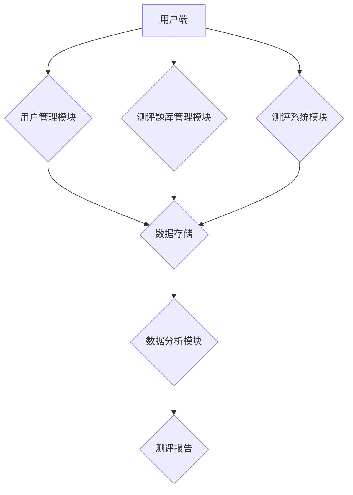

                 

## 如何打造知识付费的在线测评系统

> 关键词：知识付费、在线测评、系统架构、算法设计、数学模型、代码实现、实际应用

## 1. 背景介绍

知识付费已成为当今教育和培训领域的重要趋势，在线测评作为知识付费的重要组成部分，在评估学习成果、提供个性化学习建议、促进用户参与度等方面发挥着关键作用。 

传统的线下测评方式存在着时间、成本、地域等方面的限制，而在线测评系统则能够克服这些局限性，为用户提供更加便捷、高效、个性化的测评体验。

## 2. 核心概念与联系

### 2.1 在线测评系统概述

在线测评系统是指利用互联网技术，实现用户在线进行知识评估、技能测试、性格分析等测评的系统。它通常由以下几个核心模块组成：

* **用户管理模块:** 用于用户注册、登录、信息管理等功能。
* **测评题库管理模块:** 用于管理和维护测评题库，包括题型、难度、知识点等信息。
* **测评系统模块:** 用于用户进行在线测评，包括题目的展示、用户答题、自动评分等功能。
* **数据分析模块:** 用于对测评数据进行分析和处理，生成测评报告、学习建议等。

### 2.2 系统架构



**系统架构图说明:**

* 用户端：用户通过浏览器或移动端应用程序访问在线测评系统。
* 用户管理模块：负责用户注册、登录、信息管理等功能。
* 测评题库管理模块：负责管理和维护测评题库，包括题型、难度、知识点等信息。
* 测评系统模块：负责用户进行在线测评，包括题目的展示、用户答题、自动评分等功能。
* 数据存储：用于存储用户数据、测评数据等。
* 数据分析模块：对测评数据进行分析和处理，生成测评报告、学习建议等。
* 测评报告：展示用户测评结果、分析报告等。

## 3. 核心算法原理 & 具体操作步骤

### 3.1 算法原理概述

在线测评系统中，算法设计是核心环节，它决定了测评的准确性、公平性、效率等。常见的算法包括：

* **知识点匹配算法:** 用于根据用户的测评结果，匹配相应的知识点，提供个性化的学习建议。
* **评分算法:** 用于根据用户的答题情况，计算出测评得分。
* **题库推荐算法:** 用于根据用户的测评结果和学习进度，推荐合适的测评题库。

### 3.2 算法步骤详解

以知识点匹配算法为例，其具体步骤如下：

1. **知识点库构建:** 建立一个包含多个知识点的知识库，每个知识点都对应着一定的学习内容和难度等级。
2. **用户测评结果分析:** 对用户的测评结果进行分析，提取出用户掌握的知识点和薄弱环节。
3. **知识点匹配:** 根据用户的测评结果和知识库，匹配出与用户掌握情况相符的知识点。
4. **学习建议生成:** 根据匹配的知识点，生成个性化的学习建议，例如推荐相关的学习资源、练习题等。

### 3.3 算法优缺点

**优点:**

* **个性化学习:** 根据用户的测评结果，提供个性化的学习建议，提高学习效率。
* **知识点定位:** 准确定位用户的薄弱环节，帮助用户针对性地进行学习。
* **学习进度跟踪:** 通过测评结果，可以跟踪用户的学习进度，及时调整学习计划。

**缺点:**

* **算法复杂度:** 知识点匹配算法的复杂度较高，需要大量的计算资源和数据支持。
* **数据准确性:** 算法的准确性依赖于测评数据的质量，如果数据不准确，算法结果也会受到影响。
* **知识库维护:** 知识库需要不断更新和维护，以确保其内容的准确性和时效性。

### 3.4 算法应用领域

知识点匹配算法广泛应用于在线教育、职业培训、考试辅导等领域，例如：

* **在线教育平台:** 根据用户的学习情况，推荐合适的课程和学习资源。
* **职业培训机构:** 根据用户的职业目标，推荐相关的培训课程和学习计划。
* **考试辅导机构:** 根据用户的考试水平，推荐相应的练习题和学习资料。

## 4. 数学模型和公式 & 详细讲解 & 举例说明

### 4.1 数学模型构建

在线测评系统中，可以使用数学模型来描述用户知识水平、测评结果等信息。例如，可以使用贝叶斯网络来表示用户对不同知识点的掌握程度，以及不同知识点之间的关联关系。

### 4.2 公式推导过程

以知识点掌握程度为例，可以使用贝叶斯公式来计算用户对某个知识点的掌握程度：

$$P(A|B) = \frac{P(B|A)P(A)}{P(B)}$$

其中：

* $P(A|B)$: 用户掌握知识点 A 的概率，已知用户完成了测评 B。
* $P(B|A)$: 完成测评 B 的概率，已知用户掌握知识点 A。
* $P(A)$: 用户掌握知识点 A 的概率。
* $P(B)$: 完成测评 B 的概率。

### 4.3 案例分析与讲解

假设用户完成了关于编程语言 Python 的测评，测评包含了 10 道题，用户答对了 8 道题。

* $P(A)$: 用户掌握 Python 知识的概率，假设为 0.6。
* $P(B|A)$: 完成测评 B 的概率，已知用户掌握 Python 知识，假设为 0.8。
* $P(B)$: 完成测评 B 的概率，假设为 0.7。

根据贝叶斯公式，我们可以计算出用户掌握 Python 知识的概率：

$$P(A|B) = \frac{0.8 \times 0.6}{0.7} = 0.686$$

因此，根据用户答题情况，我们可以推断出用户掌握 Python 知识的概率为 68.6%。

## 5. 项目实践：代码实例和详细解释说明

### 5.1 开发环境搭建

* **操作系统:** Windows/macOS/Linux
* **编程语言:** Python
* **框架:** Flask/Django
* **数据库:** MySQL/PostgreSQL
* **工具:** Git、Docker

### 5.2 源代码详细实现

以下是一个简单的 Python 代码示例，演示了如何使用 Flask 框架构建一个在线测评系统：

```python
from flask import Flask, render_template, request

app = Flask(__name__)

# 简单的题库数据
questions = [
    {"question": "What is the capital of France?", "options": ["Berlin", "Paris", "Madrid", "Rome"], "answer": "Paris"},
    {"question": "What is the highest mountain in the world?", "options": ["K2", "Kangchenjunga", "Mount Everest", "Lhotse"], "answer": "Mount Everest"},
]

@app.route('/')
def index():
    return render_template('index.html')

@app.route('/submit', methods=['POST'])
def submit():
    user_answers = request.form.getlist('answer')
    score = 0
    for i, answer in enumerate(user_answers):
        if answer == questions[i]['answer']:
            score += 1
    return render_template('result.html', score=score)

if __name__ == '__main__':
    app.run(debug=True)
```

**代码解释:**

* 首先，我们使用 Flask 框架创建了一个 web 应用。
* 然后，我们定义了一个简单的题库数据，包含了问题、选项和答案。
* `/` 路由负责渲染首页，`/submit` 路由负责处理用户提交的答案。
* 当用户提交答案时，我们根据用户选择的答案和题库数据计算出得分。
* 最后，我们渲染结果页面，显示用户的得分。

### 5.3 代码解读与分析

* 代码示例展示了在线测评系统的基本功能，包括用户提交答案、计算得分、渲染结果等。
* 实际应用中，需要根据具体需求扩展功能，例如用户管理、题库管理、数据分析等。
* 代码示例使用了简单的题库数据，实际应用中需要使用更加丰富的题库数据，并考虑题型的多样性。

### 5.4 运行结果展示

运行上述代码后，用户可以访问 http://127.0.0.1:5000/，进行在线测评。

## 6. 实际应用场景

### 6.1 在线教育平台

在线教育平台可以利用在线测评系统来评估用户的学习成果，提供个性化的学习建议，提高学习效率。例如，Coursera、Udemy 等平台都采用了在线测评系统。

### 6.2 职业培训机构

职业培训机构可以利用在线测评系统来评估用户的职业技能水平，推荐相关的培训课程和学习计划，帮助用户提升职业竞争力。例如，Udacity、Codecademy 等平台都采用了在线测评系统。

### 6.3 考试辅导机构

考试辅导机构可以利用在线测评系统来模拟考试环境，帮助用户熟悉考试题型，提高考试成绩。例如，Khan Academy、TestPrep 等平台都采用了在线测评系统。

### 6.4 未来应用展望

在线测评系统在未来将更加智能化、个性化、多元化。例如：

* **人工智能驱动的测评:** 利用人工智能技术，自动生成测评题、分析测评结果、提供个性化学习建议。
* **虚拟现实/增强现实测评:** 利用虚拟现实/增强现实技术，打造更加沉浸式的测评体验。
* **跨平台测评:** 在线测评系统将能够跨平台使用，用户可以在任何设备上进行测评。

## 7. 工具和资源推荐

### 7.1 学习资源推荐

* **在线课程:** Coursera、Udemy、edX 等平台提供丰富的在线课程，涵盖人工智能、机器学习、数据科学等领域。
* **书籍:** 《Python机器学习实战》、《深度学习》等书籍可以帮助你深入了解机器学习和深度学习的原理和应用。
* **开源项目:** TensorFlow、PyTorch 等开源项目可以帮助你实践机器学习和深度学习的知识。

### 7.2 开发工具推荐

* **编程语言:** Python 是机器学习和深度学习领域最常用的编程语言。
* **框架:** Flask、Django 等框架可以帮助你快速构建 web 应用。
* **数据库:** MySQL、PostgreSQL 等数据库可以帮助你存储和管理数据。

### 7.3 相关论文推荐

* **《机器学习》:** Tom Mitchell 著
* **《深度学习》:** Ian Goodfellow、Yoshua Bengio、Aaron Courville 著

## 8. 总结：未来发展趋势与挑战

### 8.1 研究成果总结

在线测评系统已经取得了显著的成果，在教育、培训、考试辅导等领域发挥着越来越重要的作用。

### 8.2 未来发展趋势

在线测评系统将朝着更加智能化、个性化、多元化的方向发展，例如：

* **人工智能驱动的测评:** 利用人工智能技术，自动生成测评题、分析测评结果、提供个性化学习建议。
* **虚拟现实/增强现实测评:** 利用虚拟现实/增强现实技术，打造更加沉浸式的测评体验。
* **跨平台测评:** 在线测评系统将能够跨平台使用，用户可以在任何设备上进行测评。

### 8.3 面临的挑战

在线测评系统的发展也面临着一些挑战，例如：

* **数据质量:** 在线测评系统的准确性依赖于测评数据的质量，需要不断收集和完善数据。
* **算法复杂度:** 一些算法的复杂度较高，需要大量的计算资源和数据支持。
* **伦理问题:** 在线测评系统需要考虑伦理问题，例如数据隐私、算法公平性等。

### 8.4 研究展望

未来，我们需要继续研究在线测评系统的算法设计、数据分析、伦理问题等方面，推动在线测评系统的健康发展。

## 9. 附录：常见问题与解答

### 9.1 如何构建一个高质量的题库？

构建高质量的题库需要考虑以下几个方面：

* **题型多样性:** 题库应包含多种题型，例如选择题、填空题、判断题、问答题等，以满足不同用户的学习需求。
* **知识点覆盖:** 题库应涵盖所有重要的知识点，并按照一定的逻辑结构进行组织。
* **难度等级:** 题库应包含不同难度等级的题目，以满足不同用户的学习水平。
* **答案准确性:** 题库的答案应准确无误，并提供详细的解析。

### 9.2 如何保证在线测评系统的公平性？

在线测评系统的公平性可以通过以下措施来保证：

* **随机化题序:** 随机化题序可以避免用户记住特定题目的顺序，从而影响测评结果。
* **控制时间限制:** 设置合理的答题时间限制可以避免用户过度思考或猜测答案。
* **匿名测评:** 保持用户身份匿名可以避免主观因素影响测评结果。
* **定期更新题库:** 定期更新题库可以避免用户掌握题库中的所有题目，从而影响测评结果。

### 9.3 如何评估在线测评系统的效果？

在线测评系统的效果可以通过以下指标来评估：

* **用户满意度:** 通过用户反馈调查等方式，了解用户对测评系统的满意度。
* **测评准确性:** 通过与其他测评方法进行对比，评估测评结果的准确性。
* **学习效果:** 通过用户学习成果的提升情况，评估测评系统的学习效果。


作者：禅与计算机程序设计艺术 / Zen and the Art of Computer Programming 
<end_of_turn>

