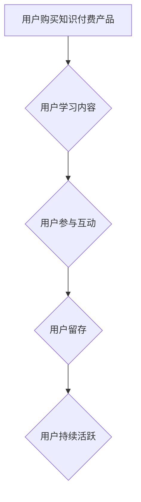

                 

## 如何提高知识付费产品的用户活跃度

> 关键词：知识付费、用户活跃度、用户留存、内容运营、社区建设、数据分析、个性化推荐

## 1. 背景介绍

知识付费行业近年来发展迅速，涌现出大量优质的知识产品。然而，如何提高知识付费产品的用户活跃度，是行业面临的共同挑战。用户付费后，往往会出现“买断式”消费模式，即只在购买初期进行学习，后续缺乏持续的参与和互动。这不仅影响了产品的商业可持续性，也阻碍了用户知识体系的构建和成长。

## 2. 核心概念与联系

**2.1 用户活跃度**

用户活跃度是指用户在特定时间段内与产品进行交互的频率和深度。对于知识付费产品而言，活跃度可以衡量用户对产品的持续关注和学习意愿。

**2.2 用户留存**

用户留存是指用户在一段时间内持续使用产品的比例。高留存率意味着用户对产品体验满意，并愿意长期参与。

**2.3 核心概念关系**

用户活跃度和用户留存是相互关联的。活跃度高的用户更有可能留存，而留存的用户也更有可能保持活跃。

**2.4  Mermaid 流程图**



## 3. 核心算法原理 & 具体操作步骤

**3.1 算法原理概述**

提高知识付费产品用户活跃度的核心算法原理在于用户行为分析和个性化推荐。通过分析用户的学习行为、兴趣偏好和学习进度，可以精准推荐相关内容，引导用户持续学习，提高用户参与度和留存率。

**3.2 算法步骤详解**

1. **数据收集:** 收集用户学习行为数据，包括学习时长、学习进度、学习内容、互动行为等。
2. **数据清洗:** 对收集到的数据进行清洗和处理，去除无效数据和噪声数据，保证数据质量。
3. **特征提取:** 从用户行为数据中提取特征，例如学习主题、学习风格、学习习惯等。
4. **模型训练:** 利用机器学习算法，训练用户行为预测模型，预测用户的学习兴趣和学习需求。
5. **个性化推荐:** 根据用户特征和模型预测结果，为用户推荐个性化的学习内容和学习路径。
6. **用户反馈:** 收集用户对推荐内容的反馈，并反馈到模型训练中，不断优化推荐算法。

**3.3 算法优缺点**

**优点:**

* 精准推荐，提高用户学习兴趣和参与度。
* 个性化学习路径，满足不同用户的学习需求。
* 数据驱动，不断优化推荐算法，提升推荐效果。

**缺点:**

* 数据依赖性强，需要大量高质量的用户行为数据。
* 模型训练复杂，需要专业的技术人员和资源。
* 算法可能会出现偏差，导致推荐结果不准确。

**3.4 算法应用领域**

* 在线教育平台
* 知识付费平台
* 内容推荐系统
* 个性化学习系统

## 4. 数学模型和公式 & 详细讲解 & 举例说明

**4.1 数学模型构建**

用户行为预测模型可以采用协同过滤算法，例如基于用户的协同过滤和基于物品的协同过滤。

**4.2 公式推导过程**

基于用户的协同过滤算法，可以利用用户对不同内容的评分数据，计算用户之间的相似度，并根据相似用户对目标内容的评分，预测目标用户对目标内容的评分。

**公式:**

$$
similarity(u_i, u_j) = \frac{\sum_{k \in I(u_i) \cap I(u_j)} (r_{ik} - \bar{r}_i)(r_{jk} - \bar{r}_j)}{\sqrt{\sum_{k \in I(u_i)} (r_{ik} - \bar{r}_i)^2} \sqrt{\sum_{k \in I(u_j)} (r_{jk} - \bar{r}_j)^2}}
$$

其中:

* $u_i$ 和 $u_j$ 表示两个用户
* $I(u_i)$ 和 $I(u_j)$ 表示用户 $u_i$ 和 $u_j$ 评分过的内容集合
* $r_{ik}$ 表示用户 $u_i$ 对内容 $k$ 的评分
* $\bar{r}_i$ 表示用户 $u_i$ 的平均评分

**4.3 案例分析与讲解**

假设有两个用户 $u_1$ 和 $u_2$，他们都对编程相关的课程进行了评分。根据用户的评分数据，可以计算出 $u_1$ 和 $u_2$ 之间的相似度。如果相似度较高，则表明 $u_1$ 和 $u_2$ 的学习兴趣和偏好相近。

当 $u_1$ 想要学习新的编程课程时，可以根据 $u_2$ 对其他编程课程的评分，预测 $u_1$ 对这些课程的兴趣，并推荐给 $u_1$。

## 5. 项目实践：代码实例和详细解释说明

**5.1 开发环境搭建**

* Python 3.x
* TensorFlow 或 PyTorch
* Jupyter Notebook

**5.2 源代码详细实现**

```python
# 导入必要的库
import pandas as pd
from sklearn.metrics.pairwise import cosine_similarity

# 加载用户评分数据
ratings_data = pd.read_csv('ratings.csv')

# 计算用户之间的相似度
user_similarity = cosine_similarity(ratings_data.T)

# 获取用户 u1 的相似用户
similar_users = user_similarity[0].argsort()[:-10:-1]

# 获取用户 u1 尚未评分过的课程
unrated_courses = ratings_data.columns[~ratings_data.iloc[0].isin(ratings_data.iloc[0].dropna().values)]

# 根据相似用户的评分，预测用户 u1 对未评分课程的兴趣
predicted_ratings = user_similarity[0][similar_users] * ratings_data.iloc[similar_users].values

# 推荐用户 u1 尚未评分过的课程
recommended_courses = unrated_courses[predicted_ratings.argsort()[-10:][::-1]]

# 打印推荐结果
print(f"推荐给用户 u1 的课程：{recommended_courses.tolist()}")
```

**5.3 代码解读与分析**

* 代码首先加载用户评分数据，并使用 cosine_similarity 函数计算用户之间的相似度。
* 然后，根据用户之间的相似度，获取用户 u1 的相似用户。
* 接着，获取用户 u1 尚未评分过的课程。
* 最后，根据相似用户的评分，预测用户 u1 对未评分课程的兴趣，并推荐给用户 u1。

**5.4 运行结果展示**

运行代码后，将输出用户 u1 尚未评分过的课程推荐列表。

## 6. 实际应用场景

**6.1 在线教育平台**

在线教育平台可以利用用户行为分析和个性化推荐算法，推荐用户相关的课程和学习资源，提高用户学习兴趣和参与度。

**6.2 知识付费平台**

知识付费平台可以根据用户的学习进度和兴趣偏好，推荐用户相关的付费课程和学习资料，提高用户付费意愿和留存率。

**6.3 内容推荐系统**

内容推荐系统可以根据用户的阅读历史和兴趣偏好，推荐用户相关的文章、视频和音频内容，提高用户粘性和活跃度。

**6.4 未来应用展望**

随着人工智能技术的不断发展，用户行为分析和个性化推荐算法将更加精准和智能，为用户提供更加个性化和定制化的学习体验。

## 7. 工具和资源推荐

**7.1 学习资源推荐**

* **书籍:**

    * 《推荐系统实践》
    * 《机器学习》
    * 《深度学习》

* **在线课程:**

    * Coursera: 机器学习
    * edX: 深度学习
    * Udemy: 推荐系统

**7.2 开发工具推荐**

* **Python:** 

    * TensorFlow
    * PyTorch
    * Scikit-learn

* **数据分析工具:**

    * Pandas
    * NumPy

**7.3 相关论文推荐**

* 《Collaborative Filtering for Implicit Feedback Datasets》
* 《Matrix Factorization Techniques for Recommender Systems》
* 《Deep Learning for Recommender Systems》

## 8. 总结：未来发展趋势与挑战

**8.1 研究成果总结**

用户行为分析和个性化推荐算法在提高知识付费产品用户活跃度方面取得了显著成果。通过数据驱动和算法优化，可以精准推荐用户感兴趣的内容，提高用户学习兴趣和参与度。

**8.2 未来发展趋势**

* **更精准的个性化推荐:** 利用更先进的机器学习算法和深度学习模型，实现更精准的个性化推荐，满足不同用户的个性化学习需求。
* **多模态数据融合:** 将文本、音频、视频等多模态数据融合到推荐系统中，提供更丰富的学习体验。
* **用户行为预测:** 利用用户行为数据预测用户的学习意愿和学习进度，提前提供个性化的学习建议和支持。

**8.3 面临的挑战**

* **数据隐私保护:** 用户行为数据涉及个人隐私，需要采取有效的措施保护用户数据安全。
* **算法公平性:** 算法可能会出现偏差，导致推荐结果不公平，需要不断优化算法，确保推荐结果公平公正。
* **用户体验优化:** 个性化推荐需要与用户体验相结合，避免过度推荐，影响用户学习体验。

**8.4 研究展望**

未来，用户行为分析和个性化推荐算法将继续发展，为用户提供更加智能、个性化和定制化的学习体验。


## 9. 附录：常见问题与解答

**9.1 如何提高用户数据质量？**

* 完善用户数据采集机制，确保数据完整性和准确性。
* 定期清理无效数据和噪声数据，提高数据质量。
* 对用户数据进行匿名化处理，保护用户隐私。

**9.2 如何避免算法偏差？**

* 使用多样化的训练数据，避免算法偏向特定用户群体。
* 定期评估算法的公平性，及时发现和解决偏差问题。
* 采用公平性约束条件，引导算法朝着公平的方向发展。

**9.3 如何优化用户体验？**

* 避免过度推荐，只推荐用户真正感兴趣的内容。
* 提供个性化的学习路径，引导用户循序渐进地学习。
* 收集用户反馈，不断优化推荐算法和用户体验。


作者：禅与计算机程序设计艺术 / Zen and the Art of Computer Programming 
<end_of_turn>

