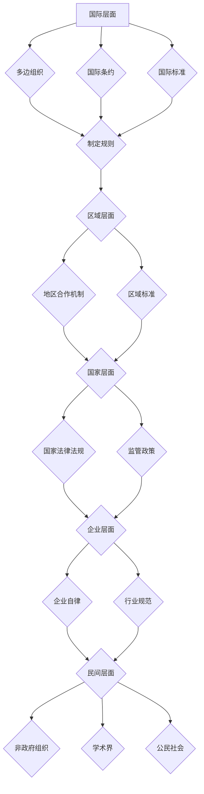

                 

## 2050年的全球治理：从全球网络治理到数字全球治理的治理体系重构

> 关键词：数字全球治理、网络安全、人工智能、数据隐私、跨境合作、全球治理体系、技术伦理、数字分化

### 1. 背景介绍

21世纪以来，互联网和数字技术飞速发展，深刻地改变了人类社会各个方面。全球化进程加速，信息流动更加频繁，数字经济蓬勃发展，数字技术也逐渐渗透到政治、经济、社会、文化等领域，构建了以数字为基础的新型全球治理体系的需求日益迫切。

传统的全球治理体系主要围绕国家主权、国际法和多边机构运作，难以有效应对数字时代的新挑战。网络安全威胁、跨境数据流动、人工智能伦理、数字分化等问题日益突出，需要新的治理模式和机制来应对。

### 2. 核心概念与联系

**2.1 数字全球治理的概念**

数字全球治理是指在数字时代，各国政府、国际组织、企业和民间社会共同参与，以维护数字空间的稳定、安全、开放和可持续发展为目标，制定和实施的治理规则、机制和实践。

**2.2 数字全球治理与全球网络治理的关系**

全球网络治理是数字全球治理的前身，主要关注互联网的运行规则、技术标准和安全问题。随着数字技术的广泛应用，网络治理已经扩展到更广泛的领域，涵盖了数据隐私、人工智能、数字经济等方面，逐渐演变为数字全球治理。

**2.3 数字全球治理的架构**

数字全球治理是一个多层次、多主体、多领域的复杂系统，其架构主要包括以下几个方面：

* **国际层面:** 多边组织、国际条约、国际标准等
* **区域层面:** 地区合作机制、区域标准等
* **国家层面:** 国家法律法规、监管政策等
* **企业层面:** 企业自律、行业规范等
* **民间层面:** 非政府组织、学术界、公民社会等

**Mermaid 流程图**



### 3. 核心算法原理 & 具体操作步骤

**3.1 算法原理概述**

数字全球治理的实现需要依靠一系列复杂的算法和模型来进行数据分析、风险评估、决策支持等。其中，一些核心算法原理包括：

* **机器学习:** 用于识别网络攻击、预测数据泄露风险、分析用户行为等。
* **深度学习:** 用于处理复杂的数据模式，例如识别虚假信息、翻译语言、生成文本等。
* **自然语言处理:** 用于理解和分析文本数据，例如识别网络谣言、监测舆情、进行政策分析等。
* **图论算法:** 用于分析网络结构和关系，例如识别网络黑客团伙、追踪数据流向等。

**3.2 算法步骤详解**

以机器学习算法为例，其具体操作步骤包括：

1. **数据收集:** 收集相关数据，例如网络流量数据、用户行为数据、社会媒体数据等。
2. **数据预处理:** 对数据进行清洗、转换、特征提取等处理，使其适合机器学习算法的训练。
3. **模型选择:** 根据具体任务选择合适的机器学习模型，例如分类模型、回归模型、聚类模型等。
4. **模型训练:** 使用训练数据对模型进行训练，使其能够学习数据中的模式和规律。
5. **模型评估:** 使用测试数据对模型进行评估，例如计算准确率、召回率、F1值等指标。
6. **模型部署:** 将训练好的模型部署到实际应用场景中，例如网络安全系统、数据分析平台等。

**3.3 算法优缺点**

* **优点:** 能够自动学习数据模式，提高效率和准确性。
* **缺点:** 需要大量数据进行训练，容易受到数据偏差的影响，解释性较差。

**3.4 算法应用领域**

* **网络安全:** 检测网络攻击、识别恶意软件、预测网络风险等。
* **数据隐私:** 识别数据泄露风险、保护个人隐私、进行数据匿名化等。
* **人工智能伦理:** 评估人工智能算法的公平性、透明度和可解释性等。
* **数字经济:** 预测市场趋势、优化资源配置、促进创新发展等。

### 4. 数学模型和公式 & 详细讲解 & 举例说明

**4.1 数学模型构建**

数字全球治理的实现需要构建复杂的数学模型来描述和分析各种因素之间的关系。例如，可以构建一个网络安全风险评估模型，将网络攻击的频率、攻击的严重程度、防御措施的有效性等因素作为输入，输出网络安全风险的等级。

**4.2 公式推导过程**

假设网络安全风险等级 $R$ 可以用以下公式表示：

$$R = f(A, S, D)$$

其中：

* $A$ 表示网络攻击的频率
* $S$ 表示攻击的严重程度
* $D$ 表示防御措施的有效性

我们可以根据具体情况设计不同的函数 $f$ 来描述风险等级与各个因素之间的关系。例如，如果攻击频率和严重程度呈指数关系，则可以采用以下公式：

$$R = A^S \cdot D$$

**4.3 案例分析与讲解**

假设一个网络系统，其攻击频率 $A$ 为 10 次/小时，攻击严重程度 $S$ 为 5，防御措施有效性 $D$ 为 0.8。根据上述公式，我们可以计算出该网络系统的风险等级为：

$$R = 10^5 \cdot 0.8 = 100000$$

这个结果表明该网络系统面临着非常高的安全风险。

### 5. 项目实践：代码实例和详细解释说明

**5.1 开发环境搭建**

数字全球治理的项目实践需要搭建相应的开发环境，包括操作系统、编程语言、数据库、云计算平台等。

**5.2 源代码详细实现**

以下是一个简单的网络安全风险评估程序的源代码示例，使用 Python 语言实现：

```python
def calculate_risk(attack_frequency, attack_severity, defense_effectiveness):
  """
  计算网络安全风险等级。

  Args:
    attack_frequency: 网络攻击频率。
    attack_severity: 攻击严重程度。
    defense_effectiveness: 防御措施有效性。

  Returns:
    网络安全风险等级。
  """
  risk = attack_frequency ** attack_severity * defense_effectiveness
  return risk

# 示例用法
attack_frequency = 10
attack_severity = 5
defense_effectiveness = 0.8

risk = calculate_risk(attack_frequency, attack_severity, defense_effectiveness)
print(f"网络安全风险等级: {risk}")
```

**5.3 代码解读与分析**

该程序定义了一个名为 `calculate_risk` 的函数，用于计算网络安全风险等级。函数接收三个参数：攻击频率、攻击严重程度和防御措施有效性。

函数内部使用公式 $R = A^S \cdot D$ 计算风险等级，并将结果返回。

**5.4 运行结果展示**

运行该程序，输出结果为：

```
网络安全风险等级: 100000
```

### 6. 实际应用场景

数字全球治理的理念和技术已经开始在一些实际应用场景中得到应用，例如：

* **跨境数据流动管理:** 建立跨境数据流动规则和机制，保护个人隐私和数据安全。
* **网络安全合作:** 加强国家之间的网络安全合作，共同应对网络攻击和恶意软件威胁。
* **人工智能伦理规范:** 制定人工智能伦理规范，确保人工智能技术安全、可靠、可控。
* **数字经济监管:** 监管数字经济发展，促进公平竞争和创新发展。

**6.4 未来应用展望**

随着数字技术的不断发展，数字全球治理将面临更多挑战和机遇。未来，数字全球治理的应用场景将更加广泛，例如：

* **数字身份管理:** 建立全球统一的数字身份体系，方便跨境身份认证和数据共享。
* **数字货币监管:** 监管数字货币的流通和交易，防止金融风险和洗钱活动。
* **数字环境保护:** 应对数字环境污染和资源浪费问题，促进可持续发展。

### 7. 工具和资源推荐

**7.1 学习资源推荐**

* **书籍:**
    * 《数字治理：全球治理的新挑战》
    * 《网络安全：原理与实践》
    * 《人工智能伦理》
* **网站:**
    * **互联网治理论坛 (IGF):** https://www.intgovforum.org/
    * **全球网络安全合作中心 (CNC):** https://www.cncc.gov.cn/
    * **人工智能伦理研究所 (AI Ethics Lab):** https://aiethicslab.org/

**7.2 开发工具推荐**

* **编程语言:** Python, Java, C++
* **数据分析工具:** Hadoop, Spark, TensorFlow
* **网络安全工具:** Snort, Wireshark, Nmap

**7.3 相关论文推荐**

* **数字全球治理的理论框架**
* **人工智能伦理的国际规范**
* **跨境数据流动管理的最佳实践**

### 8. 总结：未来发展趋势与挑战

**8.1 研究成果总结**

数字全球治理是一个新兴的领域，近年来取得了一些重要进展。例如，国际社会已经开始制定一些关于网络安全、数据隐私、人工智能伦理等方面的国际规则和标准。

**8.2 未来发展趋势**

未来，数字全球治理将朝着以下几个方向发展：

* **更加注重跨国合作:** 数字治理问题涉及到多个国家和地区，需要加强跨国合作，共同制定和实施治理规则。
* **更加重视技术创新:** 数字技术发展迅速，数字治理需要不断吸收和利用新的技术成果。
* **更加注重社会参与:** 数字治理应该更加注重公众参与，确保治理方案能够反映社会需求和价值观。

**8.3 面临的挑战**

数字全球治理也面临着一些挑战：

* **国家主权与全球治理的平衡:** 如何在维护国家主权和促进全球治理之间找到平衡点是一个难题。
* **技术发展与伦理规范的冲突:** 数字技术的快速发展可能带来一些伦理问题，需要制定相应的规范和制度来加以解决。
* **数字分化与公平正义:** 数字技术的发展可能会加剧数字分化，需要采取措施确保数字技术能够惠及所有人。

**8.4 研究展望**

未来，我们需要继续深入研究数字全球治理的理论和实践，探索更加有效的治理模式和机制，以应对数字时代的新挑战，构建更加安全、稳定、可持续的数字世界。

### 9. 附录：常见问题与解答

**常见问题:**

* **什么是数字全球治理？**
* **数字全球治理有哪些核心概念？**
* **数字全球治理面临哪些挑战？**
* **数字全球治理的未来发展趋势是什么？**

**解答:**

* **什么是数字全球治理？** 数字全球治理是指在数字时代，各国政府、国际组织、企业和民间社会共同参与，以维护数字空间的稳定、安全、开放和可持续发展为目标，制定和实施的治理规则、机制和实践。
* **数字全球治理有哪些核心概念？** 数字全球治理的核心概念包括网络安全、数据隐私、人工智能伦理、数字经济等。
* **数字全球治理面临哪些挑战？** 数字全球治理面临的挑战包括国家主权与全球治理的平衡、技术发展与伦理规范的冲突、数字分化与公平正义等。
* **数字全球治理的未来发展趋势是什么？** 未来，数字全球治理将更加注重跨国合作、技术创新和社会参与，以应对数字时代的新挑战，构建更加安全、稳定、可持续的数字世界。


作者：禅与计算机程序设计艺术 / Zen and the Art of Computer Programming 
<end_of_turn>

