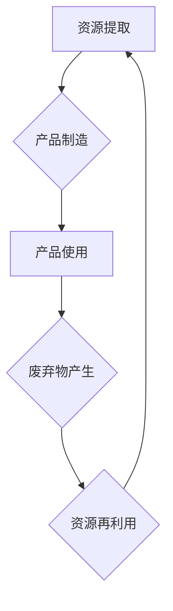

                 

## 2050年的可持续发展：循环经济与资源再利用

> 关键词：循环经济、资源再利用、人工智能、物联网、大数据、区块链、可持续发展、智能制造

### 1. 背景介绍

人类社会正处于资源枯竭和环境恶化的十字路口。传统线性经济模式，即“生产-消费-丢弃”，已经无法满足可持续发展的需求。面对全球气候变化、资源短缺和环境污染的严峻挑战，构建循环经济体系，实现资源的永续利用，成为当今世界面临的重大课题。

循环经济是一种以资源循环利用为核心的经济模式，旨在最大限度地延长资源的生命周期，减少资源浪费和环境污染。它强调产品和材料的再利用、再制造和回收，构建一个闭环的资源循环系统。

### 2. 核心概念与联系

循环经济的核心概念包括：

* **资源循环利用:** 将废弃物和副产品转化为新的资源，实现资源的永续利用。
* **产品生命周期延长:** 通过产品维修、升级和再制造等方式，延长产品的使用寿命，减少资源消耗。
* **零浪费生产:** 减少生产过程中的废弃物和污染，实现资源的有效利用。
* **共享经济:** 推广产品和服务的共享模式，减少资源浪费和重复投资。

**循环经济与资源再利用的联系:**

资源再利用是循环经济的重要组成部分，它通过回收、再加工和再制造废弃物和副产品，将它们转化为新的资源，从而实现资源的循环利用。

**Mermaid 流程图:**



### 3. 核心算法原理 & 具体操作步骤

#### 3.1  算法原理概述

循环经济中的资源再利用通常涉及以下核心算法：

* **废物分类与识别:** 利用人工智能、机器学习等技术，对废弃物进行分类和识别，以便进行精准的资源回收和再利用。
* **材料拆解与回收:** 利用物理、化学等方法，将废弃物拆解成可回收的材料，并进行净化和处理。
* **资源再制造与升级:** 将回收的材料进行再制造和升级，使其能够重新投入生产循环。

#### 3.2  算法步骤详解

**废物分类与识别算法步骤:**

1. **数据采集:** 收集废弃物图像、视频、传感器数据等信息。
2. **数据预处理:** 对数据进行清洗、增强、特征提取等处理。
3. **模型训练:** 利用深度学习、卷积神经网络等算法，训练废物分类识别模型。
4. **模型评估:** 对模型进行测试和评估，调整模型参数，提高识别精度。
5. **实际应用:** 将训练好的模型应用于实际的废物分类和识别场景。

**材料拆解与回收算法步骤:**

1. **废物预处理:** 对废弃物进行破碎、粉碎、分类等预处理。
2. **材料分离:** 利用物理、化学等方法，将废弃物中的不同材料进行分离。
3. **材料回收:** 对分离后的材料进行回收和净化，使其达到再利用的标准。

**资源再制造与升级算法步骤:**

1. **材料特性分析:** 对回收的材料进行分析，了解其物理、化学、结构等特性。
2. **工艺设计:** 根据材料特性和应用需求，设计合适的再制造和升级工艺。
3. **再制造与升级:** 利用先进的制造技术，对回收材料进行再制造和升级，使其具有新的功能和价值。

#### 3.3  算法优缺点

**优点:**

* 能够有效地减少资源浪费和环境污染。
* 能够促进资源的循环利用，实现可持续发展。
* 能够创造新的经济价值和就业机会。

**缺点:**

* 技术难度较高，需要投入大量的研发资金和人力。
* 现有的回收和再制造技术还存在一些局限性，需要不断改进和创新。
* 需要建立完善的政策法规和市场机制，支持循环经济的发展。

#### 3.4  算法应用领域

循环经济中的资源再利用算法广泛应用于以下领域:

* **电子产品回收与再制造:** 将废弃的电子产品中的贵金属、稀土等资源进行回收和再利用。
* **塑料回收与再利用:** 将废弃的塑料进行分类、回收和再制造，生产新的塑料制品。
* **建筑材料回收与再利用:** 将废弃的建筑材料进行回收和再利用，减少建筑垃圾的产生。
* **农业废弃物资源化:** 将农业废弃物进行处理和利用，生产生物肥料、生物能源等。

### 4. 数学模型和公式 & 详细讲解 & 举例说明

#### 4.1  数学模型构建

循环经济中的资源再利用可以建模为一个动态系统，其中资源的流动和转化遵循一定的数学规律。

**资源循环模型:**

$$
\frac{dR}{dt} = R_i - R_o - R_w
$$

其中:

* $R$ 表示资源的总量
* $R_i$ 表示资源的输入量
* $R_o$ 表示资源的输出量
* $R_w$ 表示资源的损失量

**目标函数:**

$$
\text{目标函数} = \text{最大化资源利用率} - \text{最小化环境影响}
$$

#### 4.2  公式推导过程

资源利用率可以定义为:

$$
\text{资源利用率} = \frac{R_o}{R_i}
$$

环境影响可以定义为:

$$
\text{环境影响} = \text{废弃物产生量} + \text{能源消耗量}
$$

#### 4.3  案例分析与讲解

**案例:**

假设一个城市每年产生100万吨的塑料废弃物，其中50%可以进行回收和再利用。

**计算:**

* $R_i = 100万吨$
* $R_o = 50\% \times 100万吨 = 50万吨$
* $R_w = 100万吨 - 50万吨 = 50万吨$

**分析:**

通过资源再利用，城市每年可以减少50万吨的塑料废弃物，减少环境污染。

### 5. 项目实践：代码实例和详细解释说明

#### 5.1  开发环境搭建

* 操作系统: Ubuntu 20.04
* 编程语言: Python 3.8
* 库依赖: TensorFlow, OpenCV, scikit-learn

#### 5.2  源代码详细实现

```python
# 废物分类识别模型训练代码示例

import tensorflow as tf
from tensorflow.keras.models import Sequential
from tensorflow.keras.layers import Conv2D, MaxPooling2D, Flatten, Dense

# 数据加载和预处理

# 模型构建

model = Sequential()
model.add(Conv2D(32, (3, 3), activation='relu', input_shape=(img_height, img_width, 3)))
model.add(MaxPooling2D((2, 2)))
model.add(Conv2D(64, (3, 3), activation='relu'))
model.add(MaxPooling2D((2, 2)))
model.add(Flatten())
model.add(Dense(10, activation='softmax'))

# 模型编译

model.compile(optimizer='adam',
              loss='categorical_crossentropy',
              metrics=['accuracy'])

# 模型训练

model.fit(train_data, train_labels, epochs=10, batch_size=32)

# 模型评估

loss, accuracy = model.evaluate(test_data, test_labels)
print('Test loss:', loss)
print('Test accuracy:', accuracy)

```

#### 5.3  代码解读与分析

* 代码首先加载必要的库依赖。
* 然后进行数据加载和预处理，将图像数据转换为模型可识别的格式。
* 接着构建一个卷积神经网络模型，用于分类识别废弃物类型。
* 模型使用Adam优化器，交叉熵损失函数，并使用准确率作为评估指标。
* 最后进行模型训练和评估，并打印测试结果。

#### 5.4  运行结果展示

运行结果将显示模型在测试数据集上的损失值和准确率。

### 6. 实际应用场景

#### 6.1  智能垃圾分类系统

利用人工智能和物联网技术，构建智能垃圾分类系统，自动识别不同类型的垃圾，并将其分类投放至相应的回收通道。

#### 6.2  循环制造平台

建立循环制造平台，连接企业、回收商、制造商等各方，实现废弃物资源的共享和再利用。

#### 6.3  可持续供应链管理

采用循环经济理念，优化供应链管理，减少资源浪费和环境污染。

#### 6.4  未来应用展望

随着人工智能、物联网、大数据等技术的不断发展，循环经济将得到更广泛的应用，例如:

* **个性化循环经济:** 根据用户的需求和习惯，提供个性化的资源循环服务。
* **城市循环经济:** 建立城市级循环经济体系，实现城市资源的循环利用。
* **全球循环经济:** 推广循环经济理念，构建全球资源循环网络。

### 7. 工具和资源推荐

#### 7.1  学习资源推荐

* **书籍:**

* 《循环经济：未来经济的模式》
* 《零浪费生活》

* **在线课程:**

* Coursera: 循环经济
* edX: 可持续发展

#### 7.2  开发工具推荐

* **物联网平台:** AWS IoT, Azure IoT, Google Cloud IoT
* **大数据平台:** Hadoop, Spark, Hive
* **人工智能平台:** TensorFlow, PyTorch, Keras

#### 7.3  相关论文推荐

* **循环经济的定义和特征:**

* Geyer, R., Jambeck, J. R., & Law, K. L. (2017). Production, use, and fate of all plastics ever made. Science advances, 3(7), e1700782.

* **循环经济的应用案例:**

* Ellen MacArthur Foundation. (2013). Towards the circular economy: Economic and business rationale for an accelerated transition.

### 8. 总结：未来发展趋势与挑战

#### 8.1  研究成果总结

循环经济已成为全球可持续发展的重要方向，取得了一定的研究成果，例如:

* 建立了循环经济的理论框架和概念体系。
* 开发了资源再利用和循环制造的技术。
* 推广了循环经济的实践案例。

#### 8.2  未来发展趋势

* **技术创新:** 持续推动人工智能、物联网、大数据等技术的创新，提高资源再利用效率和精度。
* **政策支持:** 加强政策引导和法规支持，营造有利于循环经济发展的环境。
* **社会参与:** 提高公众对循环经济的认识和参与度，形成全民共建循环经济的氛围。

#### 8.3  面临的挑战

* **技术瓶颈:** 一些资源的再利用技术还存在瓶颈，需要进一步突破。
* **成本问题:** 资源再利用的成本较高，需要降低成本，提高经济效益。
* **市场机制:** 循环经济需要建立完善的市场机制，促进资源的流通和交易。

#### 8.4  研究展望

未来，循环经济研究将更加注重以下方面:

* **资源循环的智能化:** 利用人工智能和物联网技术，实现资源循环的智能化管理和控制。
* **循环经济的数字化:** 利用区块链技术，构建循环经济的数字化平台，提高资源的透明度和可追溯性。
* **循环经济的全球化:** 推广循环经济理念，构建全球资源循环网络，实现资源的全球共享和利用。

### 9. 附录：常见问题与解答

**常见问题:**

* **循环经济和可持续发展有什么关系?**

**解答:** 循环经济是可持续发展的关键要素之一，它通过资源的循环利用，减少资源浪费和环境污染，从而实现可持续发展。

* **循环经济有哪些优势?**

**解答:** 循环经济具有以下优势:

* 减少资源浪费和环境污染
* 促进经济增长和就业机会
* 提高资源利用效率
* 增强社会韧性

* **如何参与循环经济?**

**解答:** 我们可以通过以下方式参与循环经济:

* 减少消费，选择可循环利用的产品
* 积极进行资源回收和再利用
* 支持循环经济相关的企业和项目
* 提高公众对循环经济的认识和参与度


作者：禅与计算机程序设计艺术 / Zen and the Art of Computer Programming 
<end_of_turn>

