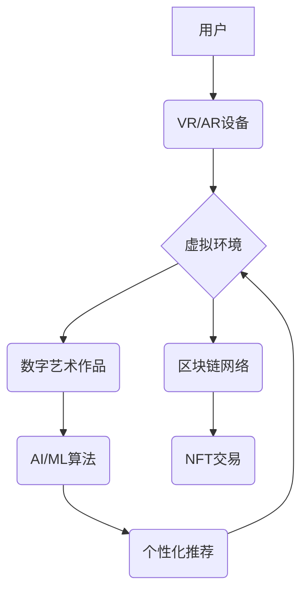

                 

## 2050年的数字艺术：从创作到鉴赏的虚拟美术馆

> 关键词：数字艺术、虚拟现实、人工智能、机器学习、区块链、NFT、艺术鉴赏、美学、未来科技

### 1. 背景介绍

2050年，数字艺术将不再是概念，而是融入我们生活的重要组成部分。虚拟现实 (VR) 和增强现实 (AR) 技术的飞速发展，将打破物理空间的限制，创造出沉浸式的数字艺术体验。人工智能 (AI) 和机器学习 (ML) 的进步，则赋予数字艺术创作新的可能性，让艺术不再仅仅是人类的独家产权。

随着区块链技术的普及，数字艺术作品的版权和所有权问题得到有效解决，NFT (不可替代代币) 的出现为数字艺术提供了全新的交易和流通模式。这一切都为2050年的数字艺术发展铺平了道路，一个全新的虚拟美术馆即将诞生。

### 2. 核心概念与联系

**2.1 虚拟美术馆的概念**

虚拟美术馆是一个完全基于数字技术的艺术展示平台，它可以模拟现实世界中的美术馆，甚至超越现实的边界，创造出更加奇幻、互动、沉浸式的艺术体验。

**2.2 核心技术联系**

虚拟美术馆的构建需要多种核心技术的协同作用：

* **虚拟现实 (VR)**：提供沉浸式的虚拟环境，让用户身临其境地感受艺术作品。
* **增强现实 (AR)**：将数字艺术作品叠加到现实世界中，创造出新的艺术体验。
* **人工智能 (AI)**：用于数字艺术创作、作品推荐、用户个性化体验等方面。
* **机器学习 (ML)**：帮助虚拟美术馆分析用户行为，优化作品展示和推荐。
* **区块链 (BC)**：保障数字艺术作品的版权和所有权，实现安全、透明的交易。
* **NFT (不可替代代币)**：为数字艺术作品提供唯一的标识和所有权证明。

**2.3 核心技术架构**



### 3. 核心算法原理 & 具体操作步骤

**3.1 算法原理概述**

虚拟美术馆的核心算法主要包括：

* **生成式对抗网络 (GAN)**：用于生成逼真的数字艺术作品。
* **推荐算法**：根据用户的喜好和行为，推荐个性化的艺术作品。
* **交互算法**：实现用户与数字艺术作品的互动，例如绘画、雕塑、音乐创作等。

**3.2 算法步骤详解**

* **GAN算法**：

    1. 训练一个生成器网络，生成新的艺术作品。
    2. 训练一个鉴别器网络，判断生成的艺术作品是否真实。
    3. 生成器和鉴别器网络在对抗训练中不断迭代，生成器生成越来越逼真的作品，鉴别器识别越来越准确。

* **推荐算法**：

    1. 收集用户的浏览历史、点赞记录、评论等行为数据。
    2. 利用机器学习算法，例如协同过滤、内容过滤等，分析用户的喜好和偏好。
    3. 根据分析结果，推荐用户可能感兴趣的艺术作品。

* **交互算法**：

    1. 设计交互式界面，允许用户与数字艺术作品进行互动。
    2. 利用传感器数据，例如手势、语音等，识别用户的意图。
    3. 根据用户的意图，动态调整艺术作品的展示方式或生成新的艺术内容。

**3.3 算法优缺点**

* **GAN算法**：

    优点：可以生成逼真的艺术作品，具有创造性。
    缺点：训练过程复杂，需要大量数据，生成的艺术作品可能缺乏独特性。

* **推荐算法**：

    优点：可以根据用户的喜好推荐个性化的艺术作品，提高用户体验。
    缺点：可能存在推荐偏差，导致用户接触到同类型作品过多。

* **交互算法**：

    优点：可以增强用户与艺术作品的互动，创造更加沉浸式的体验。
    缺点：需要复杂的交互设计和技术实现。

**3.4 算法应用领域**

* **数字艺术创作**：生成新的艺术作品，突破传统艺术创作的边界。
* **艺术鉴赏**：提供个性化的艺术推荐，帮助用户发现新的艺术作品。
* **艺术教育**：创造互动式的艺术学习环境，提高用户学习兴趣和效果。
* **数字收藏**：为数字艺术作品提供安全、透明的交易和流通平台。

### 4. 数学模型和公式 & 详细讲解 & 举例说明

**4.1 数学模型构建**

GAN算法的核心是生成器 (G) 和鉴别器 (D) 两个神经网络之间的对抗训练。

* **生成器 (G)**：输入随机噪声，生成新的艺术作品。
* **鉴别器 (D)**：输入艺术作品，判断其是否为真实作品。

**4.2 公式推导过程**

* **生成器损失函数**:

$$L_G(G, D) = E_{z \sim p_z(z)}[log(1 - D(G(z)))]$$

* **鉴别器损失函数**:

$$L_D(D, G) = E_{x \sim p_{data}(x)}[log(D(x))] + E_{z \sim p_z(z)}[log(1 - D(G(z)))]$$

其中：

* $z$ 是随机噪声
* $p_z(z)$ 是噪声的分布
* $x$ 是真实艺术作品
* $p_{data}(x)$ 是真实艺术作品的分布
* $D(x)$ 是鉴别器对艺术作品 $x$ 的判断概率

**4.3 案例分析与讲解**

在训练过程中，生成器试图生成逼真的艺术作品，欺骗鉴别器。鉴别器则试图准确识别真实作品和生成作品。两者在对抗训练中不断迭代，最终生成器能够生成逼真的艺术作品，鉴别器能够准确识别真实作品和生成作品。

### 5. 项目实践：代码实例和详细解释说明

**5.1 开发环境搭建**

* **操作系统**: Ubuntu 20.04 LTS
* **编程语言**: Python 3.8
* **深度学习框架**: TensorFlow 2.x
* **GPU**: NVIDIA GeForce RTX 3080

**5.2 源代码详细实现**

```python
# 生成器网络
class Generator(tf.keras.Model):
    def __init__(self):
        super(Generator, self).__init__()
        # 定义生成器网络结构
        # ...

    def call(self, z):
        # 生成艺术作品
        # ...

# 鉴别器网络
class Discriminator(tf.keras.Model):
    def __init__(self):
        super(Discriminator, self).__init__()
        # 定义鉴别器网络结构
        # ...

    def call(self, x):
        # 判断艺术作品是否真实
        # ...

# 训练GAN模型
def train_gan(generator, discriminator, epochs):
    # ...

# 生成新的艺术作品
def generate_art(generator, noise):
    # ...
```

**5.3 代码解读与分析**

* **生成器网络**: 负责生成新的艺术作品。
* **鉴别器网络**: 负责判断艺术作品是否为真实作品。
* **训练GAN模型**: 使用对抗训练方法训练生成器和鉴别器网络。
* **生成新的艺术作品**: 使用训练好的生成器网络生成新的艺术作品。

**5.4 运行结果展示**

训练好的GAN模型可以生成逼真的数字艺术作品，这些作品可以用于虚拟美术馆的展示。

### 6. 实际应用场景

**6.1 数字艺术创作**

艺术家可以使用GAN算法生成新的艺术作品，突破传统艺术创作的边界，探索新的艺术形式。

**6.2 艺术鉴赏**

虚拟美术馆可以根据用户的喜好和行为，推荐个性化的艺术作品，帮助用户发现新的艺术作品，提升艺术鉴赏体验。

**6.3 艺术教育**

虚拟美术馆可以提供互动式的艺术学习环境，让用户通过与艺术作品的互动，更好地理解艺术作品的创作理念和背后的文化背景。

**6.4 未来应用展望**

* **沉浸式艺术体验**: 利用VR/AR技术，创造更加沉浸式的艺术体验，让用户身临其境地感受艺术作品。
* **个性化艺术创作**: 利用AI技术，帮助用户根据自己的喜好和需求，创作个性化的艺术作品。
* **跨界艺术融合**: 将数字艺术与其他领域，例如音乐、舞蹈、游戏等融合，创造更加丰富的艺术体验。

### 7. 工具和资源推荐

**7.1 学习资源推荐**

* **书籍**:

    * 《深度学习》
    * 《生成对抗网络》

* **在线课程**:

    * Coursera: 深度学习
    * Udacity: 计算机视觉

**7.2 开发工具推荐**

* **深度学习框架**: TensorFlow, PyTorch
* **虚拟现实平台**: Unity, Unreal Engine
* **区块链平台**: Ethereum, Hyperledger

**7.3 相关论文推荐**

* **Generative Adversarial Networks**
* **Deep Convolutional Generative Adversarial Networks for Image Synthesis**

### 8. 总结：未来发展趋势与挑战

**8.1 研究成果总结**

2050年的数字艺术将更加丰富、多元、沉浸式。AI和区块链技术的进步将为数字艺术创作、鉴赏和交易提供新的可能性。

**8.2 未来发展趋势**

* **更加逼真的数字艺术作品**: GAN算法将不断发展，生成更加逼真的数字艺术作品。
* **更加个性化的艺术体验**: AI技术将帮助用户定制个性化的艺术体验。
* **更加安全的数字艺术交易**: 区块链技术将保障数字艺术作品的版权和所有权。

**8.3 面临的挑战**

* **伦理问题**: AI生成的艺术作品的版权归属问题、艺术创作的本质问题等需要进一步探讨。
* **技术难题**: 如何生成更加具有创造性的艺术作品、如何实现更加沉浸式的艺术体验等技术难题需要进一步攻克。
* **社会接受度**: 数字艺术需要获得更多人的认可和支持，才能真正融入我们的生活。

**8.4 研究展望**

未来，我们需要继续探索数字艺术的可能性，推动数字艺术的发展，让数字艺术成为更加重要的文化现象。

### 9. 附录：常见问题与解答

* **Q1: 数字艺术作品的版权如何保护？**

* **A1:** 区块链技术可以为数字艺术作品提供唯一的标识和所有权证明，保障数字艺术作品的版权。

* **Q2: 如何体验虚拟美术馆？**

* **A2:** 可以使用VR/AR设备，或者通过电脑浏览器访问虚拟美术馆的网站。

* **Q3: 数字艺术作品的价值如何体现？**

* **A3:** 数字艺术作品的价值可以体现为艺术价值、收藏价值、投资价值等。


作者：禅与计算机程序设计艺术 / Zen and the Art of Computer Programming 
<end_of_turn>

