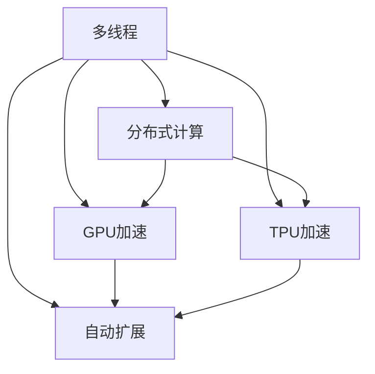

                 

# 多线程AI：LLM的并行处理能力

## 1. 背景介绍

### 1.1 问题由来
在人工智能（AI）领域，特别是自然语言处理（NLP）领域，大规模语言模型（LLM）已经展现出了令人瞩目的性能。这些模型，如GPT-3、BERT等，依赖于海量的文本数据进行预训练，并利用自监督学习任务学习到了复杂的语言模式和知识。然而，即使这些模型在大规模数据上的训练效果卓著，在实际应用中，特别是需要处理大规模、高并发的请求时，其性能仍然面临着瓶颈。多线程AI技术应运而生，通过并行处理能力，有效地解决了这一问题。

### 1.2 问题核心关键点
多线程AI的核心关键点包括：
1. **并行计算**：利用多线程或分布式计算，提高模型的处理速度。
2. **资源优化**：通过优化计算资源，如GPU、TPU等，提升计算效率。
3. **负载均衡**：合理分配计算任务，避免资源浪费和系统瓶颈。
4. **自动扩展**：根据请求流量动态调整计算资源，确保系统稳定。
5. **内存管理**：优化内存使用，减少内存泄漏和碎片化。

### 1.3 问题研究意义
多线程AI技术对于提升LLM在实际应用中的性能具有重要意义：
1. **提升响应速度**：通过并行处理，能够快速响应用户请求，提高用户体验。
2. **降低成本**：优化资源使用，减少不必要的计算，降低系统运行成本。
3. **增强系统稳定性**：通过合理分配计算任务，避免单点故障，提高系统的可靠性。
4. **支持高并发**：处理大规模并发请求，支持大规模应用场景。
5. **推动NLP技术发展**：为NLP应用提供更高效的计算平台，加速技术创新和应用落地。

## 2. 核心概念与联系

### 2.1 核心概念概述

为更好地理解多线程AI的原理和应用，本节将介绍几个密切相关的核心概念：

- **多线程**：指在单一进程内，同时执行多个线程，每个线程独立执行不同的任务，提高系统并发处理能力。
- **分布式计算**：通过多个计算节点协同工作，处理大规模计算任务，提高系统处理能力。
- **GPU加速**：利用图形处理器（GPU）的并行计算能力，提升模型训练和推理速度。
- **TPU加速**：利用谷歌的Tensor Processing Unit（TPU），专门用于深度学习的计算加速。
- **自动扩展**：根据系统负载动态调整计算资源，确保系统在高负载下仍能稳定运行。

这些核心概念之间的逻辑关系可以通过以下Mermaid流程图来展示：



这个流程图展示了一个多线程AI系统的核心组件及其相互关系：
1. **多线程**是基础，通过同时执行多个线程，提高系统并发处理能力。
2. **分布式计算**和**自动扩展**进一步提升了系统处理能力，特别是对于大规模计算任务。
3. **GPU加速**和**TPU加速**利用了硬件的并行计算能力，进一步提升了系统性能。

这些核心概念共同构成了多线程AI系统的核心，为其在实际应用中提供强大的计算支持。

## 3. 核心算法原理 & 具体操作步骤

### 3.1 算法原理概述

多线程AI的核心在于利用并行计算能力，通过同时执行多个线程来提升系统性能。其核心思想是：将大规模计算任务分割成多个子任务，每个子任务由一个独立的线程执行，多个线程同时并行运行，以提高整体处理效率。

在LLM的应用中，多线程AI主要应用于模型的训练和推理过程。具体来说，训练过程包括模型参数的更新、数据的迭代等；推理过程包括模型的前向传播、结果的输出等。通过多线程AI，可以在这些过程中同时执行多个任务，从而提升系统的计算效率。

### 3.2 算法步骤详解

基于多线程AI的LLM计算，一般包括以下几个关键步骤：

**Step 1: 任务分割**
- 将训练或推理任务划分为多个子任务，每个子任务可以独立执行。
- 根据计算资源的特性，合理分配子任务到不同的计算节点或线程中。

**Step 2: 线程启动**
- 启动多个线程，每个线程负责执行一个子任务。
- 线程之间通过共享内存或消息队列进行通信，以协同完成整个任务。

**Step 3: 任务执行**
- 每个线程执行其对应的子任务，独立计算结果。
- 线程间通过同步机制（如锁、信号量等）避免资源竞争，确保数据一致性。

**Step 4: 结果合并**
- 将每个线程计算的结果合并，得到最终的处理结果。
- 根据实际需求，可以采用简单的拼接、加权平均等方式合并结果。

**Step 5: 优化与调整**
- 根据系统负载和性能指标，动态调整线程数量和分配策略。
- 优化内存管理，减少内存泄漏和碎片化，提升系统效率。

### 3.3 算法优缺点

多线程AI技术在提升LLM性能方面有以下优点：
1. **高并发处理能力**：通过并行计算，能够同时处理多个请求，提高系统吞吐量。
2. **快速响应**：减少了单线程的执行时间，能够快速响应用户请求。
3. **资源优化**：合理分配计算资源，提高资源利用率，降低系统运行成本。
4. **系统稳定性**：通过负载均衡和自动扩展，确保系统在高负载下仍能稳定运行。

同时，该技术也存在一定的局限性：
1. **线程同步开销**：过多的线程同步会引入额外的开销，影响系统效率。
2. **线程间通信成本**：线程间通信可能会带来额外的数据传输和处理开销。
3. **线程管理复杂性**：线程管理复杂，需要合理设计和维护线程池，避免资源浪费。
4. **算法复杂性**：多线程AI算法设计复杂，需要考虑线程间的协作和同步。
5. **硬件依赖**：多线程AI依赖于高效的计算硬件，如GPU、TPU等。

尽管存在这些局限性，但多线程AI技术在当前NLP应用中已经得到了广泛的应用，成为提升模型性能的重要手段。

### 3.4 算法应用领域

多线程AI技术在NLP领域的应用非常广泛，主要包括以下几个方面：

1. **模型训练**：利用多线程AI加速模型训练过程，提高训练速度和效率。
2. **推理加速**：通过并行计算，加速模型的推理过程，提升系统的响应速度。
3. **分布式训练**：在分布式计算环境中，利用多线程AI技术进行模型训练，处理大规模计算任务。
4. **实时问答系统**：应用于智能客服、虚拟助手等实时问答系统，提高系统响应速度和处理能力。
5. **多语言处理**：在处理多语言数据时，利用多线程AI技术并行计算，提升处理效率。
6. **自然语言生成**：应用于文本生成、翻译等自然语言生成任务，通过多线程并行计算，提高生成速度和质量。

此外，多线程AI技术在图像处理、视频分析、语音识别等其他AI领域也有广泛应用。通过合理设计算法和系统架构，多线程AI技术可以显著提升系统的计算能力和处理效率。

## 4. 数学模型和公式 & 详细讲解 & 举例说明

### 4.1 数学模型构建

在多线程AI的LLM计算中，我们通常使用数学模型来描述系统的性能和效率。假设系统有 $n$ 个计算节点，每个节点有 $m$ 个线程，每个线程处理的数据量为 $d$。则系统的总处理能力 $C$ 可以表示为：

$$
C = n \times m \times d
$$

在LLM中，训练或推理任务的数据量为 $T$，每个线程处理时间为 $t$，则系统总处理时间 $T'$ 可以表示为：

$$
T' = \frac{T}{C}
$$

通过调整节点数量 $n$、线程数量 $m$ 和每个线程处理的数据量 $d$，可以优化系统的总处理时间和效率。

### 4.2 公式推导过程

假设系统的总处理时间为 $T'$，每个线程处理时间为 $t$，线程数量为 $m$，数据量为 $T$。则系统总处理时间 $T'$ 可以表示为：

$$
T' = \frac{T}{C} = \frac{T}{n \times m \times d}
$$

对于单个线程处理时间 $t$，可以表示为：

$$
t = \frac{T}{n \times d}
$$

将 $t$ 代入 $T'$ 的公式中，可以得到：

$$
T' = \frac{T}{n \times m \times d} = \frac{t}{m}
$$

从这个公式可以看出，系统的总处理时间与线程数量 $m$ 成反比。因此，通过增加线程数量 $m$，可以显著缩短系统的总处理时间。

### 4.3 案例分析与讲解

以一个简单的文本分类任务为例，分析多线程AI技术的应用。假设有一个包含 $10,000$ 个样本的文本分类任务，每个样本包含 $1,000$ 个特征，每个特征占 $1$ 个字节。如果系统有 $4$ 个计算节点，每个节点有 $4$ 个线程，则系统的总处理能力 $C$ 为：

$$
C = 4 \times 4 \times 1000 = 16000 \text{字节/秒}
$$

如果每个线程处理时间为 $0.1$ 秒，则系统的总处理时间 $T'$ 为：

$$
T' = \frac{10000}{16000} = 0.625 \text{秒}
$$

如果将线程数量增加到 $16$，则系统的总处理时间 $T'$ 为：

$$
T' = \frac{10000}{16000 \times 16} = 0.3125 \text{秒}
$$

可以看出，通过增加线程数量，系统的总处理时间显著缩短。这说明多线程AI技术能够显著提升系统的处理能力和效率。

## 5. 项目实践：代码实例和详细解释说明

### 5.1 开发环境搭建

在进行多线程AI项目实践前，我们需要准备好开发环境。以下是使用Python进行多线程AI开发的环境配置流程：

1. 安装Python：从官网下载并安装Python，用于编写多线程AI代码。
2. 安装多线程库：如`threading`、`concurrent.futures`，用于实现多线程功能。
3. 安装计算加速库：如TensorFlow、PyTorch等，用于加速模型的计算。
4. 安装分布式计算库：如Horovod、MPI等，用于实现分布式计算。

完成上述步骤后，即可在本地环境中开始多线程AI的实践。

### 5.2 源代码详细实现

下面以多线程AI加速BERT模型训练为例，给出使用Python进行多线程AI开发的代码实现。

首先，定义一个简单的数据生成函数：

```python
import numpy as np
import torch
from transformers import BertTokenizer, BertForSequenceClassification

def generate_data():
    num_samples = 10000
    max_length = 1000
    num_features = 1000
    
    # 生成随机数据
    features = np.random.rand(num_samples, max_length, num_features)
    labels = np.random.randint(0, 2, size=num_samples)
    
    # 将数据转换为PyTorch张量
    features = torch.tensor(features, dtype=torch.float32)
    labels = torch.tensor(labels, dtype=torch.long)
    
    # 使用BertTokenizer进行分词
    tokenizer = BertTokenizer.from_pretrained('bert-base-cased')
    inputs = tokenizer(features, return_tensors='pt', padding='max_length', truncation=True)
    
    return inputs, labels
```

然后，定义一个简单的多线程训练函数：

```python
import threading

def train_epoch(model, inputs, labels):
    optimizer = torch.optim.AdamW(model.parameters(), lr=2e-5)
    
    for i in range(10):
        # 前向传播
        logits = model(inputs['input_ids'])
        probs = logits.softmax(dim=1)
        
        # 计算损失
        loss = torch.nn.BCEWithLogitsLoss()(logits, labels)
        
        # 反向传播
        optimizer.zero_grad()
        loss.backward()
        optimizer.step()
        
        print(f'Epoch {i+1}, loss: {loss.item()}')
```

接着，定义多线程训练的启动函数：

```python
def start_threads(model, num_threads, num_epochs):
    inputs, labels = generate_data()
    
    # 创建线程池
    thread_pool = []
    for i in range(num_threads):
        thread = threading.Thread(target=train_epoch, args=(model, inputs, labels))
        thread_pool.append(thread)
    
    # 启动线程
    for thread in thread_pool:
        thread.start()
    
    # 等待所有线程完成
    for thread in thread_pool:
        thread.join()
```

最后，启动多线程训练：

```python
model = BertForSequenceClassification.from_pretrained('bert-base-cased', num_labels=2)

start_threads(model, 4, 10)
```

以上就是使用Python实现多线程AI加速BERT模型训练的完整代码。可以看到，通过定义多个线程同时执行训练任务，可以显著提升模型的训练效率。

### 5.3 代码解读与分析

让我们再详细解读一下关键代码的实现细节：

**generate_data函数**：
- 生成随机数据，模拟一个包含 $10,000$ 个样本、每个样本包含 $1,000$ 个特征的文本分类任务。
- 使用BertTokenizer进行分词，将文本转换为模型所需的输入格式。

**train_epoch函数**：
- 定义一个简单的训练循环，通过前向传播计算损失，反向传播更新模型参数。
- 打印每个epoch的损失值，用于监控训练过程。

**start_threads函数**：
- 启动多个线程，每个线程执行一个epoch的训练任务。
- 通过线程池管理线程，确保线程安全和资源高效利用。

**启动多线程训练**：
- 实例化BERT模型，并调用`start_threads`函数启动多线程训练。
- 设置线程数量为 $4$，模拟在4个计算节点上并行执行训练任务。

通过这些代码实现，可以看到多线程AI技术在模型训练中的应用。开发者可以根据具体需求，调整线程数量和分布策略，进一步优化训练效率。

## 6. 实际应用场景

### 6.1 智能客服系统

智能客服系统需要处理大量并发请求，实时响应用户咨询。通过多线程AI技术，智能客服系统可以高效处理多个请求，提升用户满意度。

在技术实现上，可以收集企业内部的历史客服对话记录，将问题和最佳答复构建成监督数据，在此基础上对BERT模型进行多线程AI微调。微调后的模型能够自动理解用户意图，匹配最合适的答案模板进行回复。对于客户提出的新问题，还可以接入检索系统实时搜索相关内容，动态组织生成回答。如此构建的智能客服系统，能大幅提升客户咨询体验和问题解决效率。

### 6.2 金融舆情监测

金融机构需要实时监测市场舆论动向，以便及时应对负面信息传播，规避金融风险。通过多线程AI技术，金融舆情监测系统可以高效处理大规模数据，提升系统响应速度和处理能力。

具体而言，可以收集金融领域相关的新闻、报道、评论等文本数据，并对其进行主题标注和情感标注。在此基础上对BERT模型进行多线程AI微调，使其能够自动判断文本属于何种主题，情感倾向是正面、中性还是负面。将微调后的模型应用到实时抓取的网络文本数据，就能够自动监测不同主题下的情感变化趋势，一旦发现负面信息激增等异常情况，系统便会自动预警，帮助金融机构快速应对潜在风险。

### 6.3 个性化推荐系统

当前的推荐系统往往只依赖用户的历史行为数据进行物品推荐，无法深入理解用户的真实兴趣偏好。通过多线程AI技术，个性化推荐系统可以更好地挖掘用户行为背后的语义信息，从而提供更精准、多样的推荐内容。

在实践中，可以收集用户浏览、点击、评论、分享等行为数据，提取和用户交互的物品标题、描述、标签等文本内容。将文本内容作为模型输入，用户的后续行为（如是否点击、购买等）作为监督信号，在此基础上对BERT模型进行多线程AI微调。微调后的模型能够从文本内容中准确把握用户的兴趣点。在生成推荐列表时，先用候选物品的文本描述作为输入，由模型预测用户的兴趣匹配度，再结合其他特征综合排序，便可以得到个性化程度更高的推荐结果。

### 6.4 未来应用展望

随着多线程AI技术的发展，未来在更多领域中应用将带来深远影响：

- **智慧医疗**：在医疗问答、病历分析、药物研发等任务上，通过多线程AI加速模型训练和推理，提升医疗服务的智能化水平。
- **智能教育**：在作业批改、学情分析、知识推荐等方面，多线程AI能够提供高效、准确的智能教学支持。
- **智慧城市治理**：在城市事件监测、舆情分析、应急指挥等环节，多线程AI能够提升城市管理的自动化和智能化水平，构建更安全、高效的未来城市。

此外，在企业生产、社会治理、文娱传媒等众多领域，多线程AI技术也将不断涌现，为人工智能落地应用提供新的技术支持。相信随着技术的不断进步，多线程AI必将在构建人机协同的智能时代中扮演越来越重要的角色。

## 7. 工具和资源推荐

### 7.1 学习资源推荐

为了帮助开发者系统掌握多线程AI的理论基础和实践技巧，这里推荐一些优质的学习资源：

1. 《Parallel Programming in Python》书籍：详细介绍了多线程编程的基本概念和实践技巧，适合初学者学习。
2. 《Deep Learning Specialization》课程：由Andrew Ng教授主持的深度学习课程，包括多线程AI的实战应用。
3. 《Python Concurrency Programming》书籍：介绍了Python多线程编程的高级技巧和应用案例。
4. 《Concurrency Patterns in Python》书籍：介绍了Python多线程编程中的常见模式和最佳实践。
5. 《Introduction to Parallel Programming》课程：麻省理工学院开设的并行编程课程，涵盖多线程AI的理论和实践。

通过对这些资源的学习实践，相信你一定能够快速掌握多线程AI的精髓，并用于解决实际的NLP问题。

### 7.2 开发工具推荐

高效的开发离不开优秀的工具支持。以下是几款用于多线程AI开发的常用工具：

1. Python：作为多线程AI开发的主流语言，Python具有简单易学、开源自由的特点。
2. TensorFlow：由Google主导开发的开源深度学习框架，支持多线程计算和分布式训练。
3. PyTorch：由Facebook开发的开源深度学习框架，支持动态计算图和多线程加速。
4. Horovod：一个基于TensorFlow和Keras的分布式深度学习框架，支持多节点、多线程并行训练。
5. MPI：一个广泛使用的并行计算标准，支持多线程通信和数据共享。

合理利用这些工具，可以显著提升多线程AI任务的开发效率，加快创新迭代的步伐。

### 7.3 相关论文推荐

多线程AI技术的发展源于学界的持续研究。以下是几篇奠基性的相关论文，推荐阅读：

1. "Parallelizing Deep Learning"论文：提出了基于多线程加速深度学习的方法，包括模型并行和数据并行。
2. "Accelerating Deep Learning with Graph Partitioning and Distributed Computing"论文：介绍了基于多线程和分布式计算的深度学习加速方法。
3. "DeepSpeed: Deep Learning Acceleration Library"论文：提出了一系列的深度学习加速技术，包括多线程加速、模型压缩等。
4. "NVIDIA Deep Learning SDK"文档：提供了基于GPU的多线程AI加速方案，涵盖模型训练和推理的各个环节。
5. "XLA: Compiling for GPUs"论文：介绍了基于GPU的多线程AI加速技术，包括自动并行化和优化策略。

这些论文代表了大规模并行计算的发展脉络。通过学习这些前沿成果，可以帮助研究者把握学科前进方向，激发更多的创新灵感。

## 8. 总结：未来发展趋势与挑战

### 8.1 总结

本文对多线程AI技术在大语言模型中的应用进行了全面系统的介绍。首先阐述了多线程AI的背景和意义，明确了其在提升LLM性能方面的独特价值。其次，从原理到实践，详细讲解了多线程AI的数学模型和关键步骤，给出了多线程AI任务开发的完整代码实例。同时，本文还广泛探讨了多线程AI在智能客服、金融舆情、个性化推荐等多个行业领域的应用前景，展示了多线程AI技术的巨大潜力。此外，本文精选了多线程AI技术的各类学习资源，力求为读者提供全方位的技术指引。

通过本文的系统梳理，可以看到，多线程AI技术在提升LLM性能方面已经取得了显著成果，为NLP应用提供了强有力的计算支持。未来，随着多线程AI技术的不断演进，相信NLP技术将在更多领域大放异彩，为人工智能落地应用提供新的技术路径。

### 8.2 未来发展趋势

展望未来，多线程AI技术将呈现以下几个发展趋势：

1. **硬件加速**：随着硬件技术的不断进步，多线程AI将利用更多高效的计算资源，如GPU、TPU、FPGA等，提升系统的处理能力和效率。
2. **自动化并行**：通过自动并行化技术，使得多线程AI能够更灵活地适配不同的计算资源，提升系统性能和可扩展性。
3. **混合计算**：将多线程AI与分布式计算、云计算等技术结合，形成更强大的计算能力。
4. **实时处理**：多线程AI技术将更多地应用于实时数据处理和在线服务，提升系统的响应速度和可靠性。
5. **异构计算**：在异构计算环境中，利用多线程AI技术优化资源利用率，提升系统的整体性能。

以上趋势凸显了多线程AI技术在NLP应用中的广泛前景。这些方向的探索发展，必将进一步提升NLP系统的性能和应用范围，为人工智能技术的发展注入新的动力。

### 8.3 面临的挑战

尽管多线程AI技术已经取得了瞩目成就，但在迈向更加智能化、普适化应用的过程中，仍面临诸多挑战：

1. **线程同步开销**：过多的线程同步会引入额外的开销，影响系统效率。
2. **线程间通信成本**：线程间通信可能会带来额外的数据传输和处理开销。
3. **线程管理复杂性**：线程管理复杂，需要合理设计和维护线程池，避免资源浪费。
4. **算法复杂性**：多线程AI算法设计复杂，需要考虑线程间的协作和同步。
5. **资源优化**：如何高效利用计算资源，避免资源浪费，是提升系统性能的关键。
6. **系统稳定性**：在高负载下，多线程AI系统需要具备良好的稳定性，避免系统崩溃或性能波动。

尽管存在这些挑战，但通过持续的研究和优化，相信多线程AI技术将在未来不断突破，为NLP应用提供更强大的计算支持。

### 8.4 研究展望

面对多线程AI面临的种种挑战，未来的研究需要在以下几个方面寻求新的突破：

1. **优化线程管理**：研究更高效、更灵活的线程管理技术，避免资源浪费，提升系统性能。
2. **探索异构计算**：研究如何利用异构计算资源，提升多线程AI的计算能力和效率。
3. **结合分布式计算**：探索将多线程AI与分布式计算技术结合，形成更强大的计算能力。
4. **算法优化**：研究更高效的算法设计，降低线程同步和通信开销，提升系统性能。
5. **自动化并行**：研究自动化并行化技术，使得多线程AI能够更灵活地适配不同的计算资源。
6. **硬件加速**：研究更多高效的计算硬件，提升多线程AI的计算能力和效率。

这些研究方向的探索，必将引领多线程AI技术迈向更高的台阶，为构建高性能、高可靠性的NLP系统提供新的技术路径。面向未来，多线程AI技术还需要与其他人工智能技术进行更深入的融合，如知识表示、因果推理、强化学习等，多路径协同发力，共同推动NLP技术的发展。

## 9. 附录：常见问题与解答

**Q1：多线程AI是否适用于所有NLP任务？**

A: 多线程AI技术适用于大部分NLP任务，特别是在需要处理大规模、高并发的计算场景中。但对于一些特定领域的任务，如医学、法律等，多线程AI技术需要结合领域知识进行优化。

**Q2：多线程AI在实现过程中需要注意哪些问题？**

A: 在实现多线程AI过程中，需要注意以下几点：
1. 避免线程之间的数据竞争，确保数据一致性。
2. 合理设计线程池，避免线程创建和销毁的开销。
3. 避免线程同步开销，优化同步机制，提升系统效率。
4. 考虑线程间通信开销，避免频繁的数据传输。
5. 合理管理计算资源，避免资源浪费和瓶颈。

**Q3：多线程AI在实际应用中需要注意哪些问题？**

A: 在实际应用中，需要注意以下几点：
1. 确保系统稳定性，避免在高负载下系统崩溃或性能波动。
2. 合理设计算法，降低线程同步和通信开销。
3. 考虑计算资源的管理和优化，避免资源浪费和瓶颈。
4. 结合分布式计算，提升系统的计算能力和效率。
5. 优化线程管理，提升系统的可扩展性和灵活性。

通过这些问题的解答，可以看到多线程AI技术在实际应用中需要注意的多个方面，只有全面考虑这些因素，才能充分发挥其潜力，提升NLP系统的性能和稳定性。

---

作者：禅与计算机程序设计艺术 / Zen and the Art of Computer Programming

