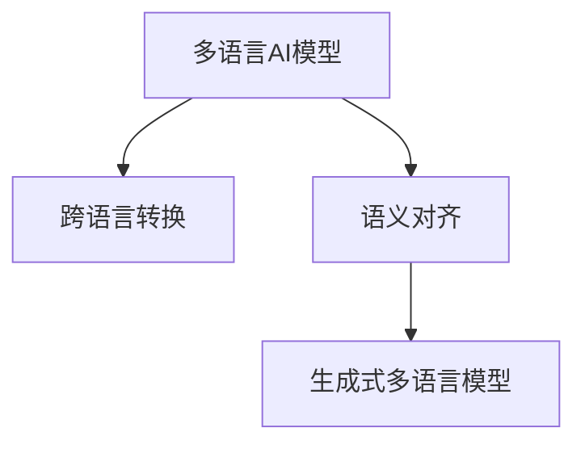

                 

# 多语言AI模型：跨语言理解与生成

> 关键词：多语言AI模型, 跨语言理解, 生成式多语言模型, 语言转换, 语义对齐, 预训练, 自然语言处理(NLP)

## 1. 背景介绍

### 1.1 问题由来
随着全球化的加速和网络信息的爆炸，多语言AI模型的需求日益增加。为了促进跨国交流与合作，支持多元文化理解和内容生成，研究者们开发了多种跨语言处理技术。多语言AI模型通过学习多种语言之间的语义关系，能够进行无缝的语言转换和语义对齐，支持多语言信息的理解和生成，具备广泛的应用前景。

### 1.2 问题核心关键点
多语言AI模型的研究涉及以下几个核心问题：
- 跨语言转换：如何实现不同语言之间的自动翻译和转换。
- 语义对齐：如何对齐不同语言的语义表示，使得同一概念在多种语言中有准确的对应。
- 生成式模型：如何利用大模型生成多语言文本，支持多语言内容创作。

### 1.3 问题研究意义
多语言AI模型的研究对拓展NLP技术的适用范围，提升全球语言交互效率，推动国际化业务的发展具有重要意义：
- 降低国际交流成本：多语言AI模型能够自动翻译和理解不同语言，减少跨语言沟通中的翻译和语言障碍。
- 促进全球文化理解：多语言AI模型能够理解和生成多种语言的内容，支持多元文化交流，增进国际间的文化理解。
- 推动国际化业务：多语言AI技术可以应用于国际贸易、跨境电商、智能客服等多个领域，提升业务效率和用户满意度。

## 2. 核心概念与联系

### 2.1 核心概念概述

为更好地理解多语言AI模型的工作原理，本节将介绍几个关键概念及其相互关系：

- 多语言AI模型：能够处理多种语言的AI模型，包括文本翻译、文本生成、语义对齐等任务。
- 跨语言转换：指不同语言之间的自动翻译和文本转换过程。
- 语义对齐：指对齐不同语言的语义表示，使同一概念在多种语言中有准确的对应。
- 生成式多语言模型：能够生成多种语言的文本，支持多语言内容的创作和翻译。

这些概念之间的逻辑关系可以通过以下Mermaid流程图来展示：



这个流程图展示了大语言模型在跨语言处理中的核心任务：

1. 多语言AI模型通过跨语言转换，将不同语言的文本转换为相同语义表示。
2. 语义对齐通过对比不同语言之间的语义差异，使得同一概念在多种语言中有准确的对应。
3. 生成式多语言模型基于预训练的语言模型，能够自动生成多种语言的文本。

这些核心概念共同构成了多语言AI模型的框架，使得AI系统能够在多种语言之间无缝切换，支持自然语言理解和生成的多语言应用。

## 3. 核心算法原理 & 具体操作步骤
### 3.1 算法原理概述

多语言AI模型的核心算法原理包括预训练、跨语言转换、语义对齐和生成式多语言模型等几个方面。

**预训练阶段**：使用大规模无标签数据，对多语言模型进行预训练，使其学习到多种语言的通用语义表示。

**跨语言转换**：利用预训练模型的语义表示能力，实现不同语言之间的自动翻译和转换。

**语义对齐**：通过对比不同语言之间的语义表示差异，对齐同一概念在多种语言中的表示。

**生成式多语言模型**：基于预训练的跨语言转换和语义对齐，自动生成多种语言的文本。

### 3.2 算法步骤详解

基于以上算法原理，多语言AI模型的开发一般包括以下关键步骤：

**Step 1: 准备预训练模型和数据集**
- 选择合适的预训练语言模型，如BERT、GPT等，作为多语言模型的初始化参数。
- 收集跨语言数据集，涵盖不同语言之间的翻译对。

**Step 2: 跨语言转换**
- 定义跨语言转换的目标函数，如BLEU、ROUGE等，用于评估翻译质量。
- 使用机器翻译技术，将源语言文本转换为目标语言文本。

**Step 3: 语义对齐**
- 定义语义对齐的目标函数，如Cosine Similarity、KL-Divergence等，用于度量不同语言之间的语义相似度。
- 使用神经网络等方法，训练对齐模型，学习同一概念在不同语言中的表示。

**Step 4: 生成式多语言模型**
- 定义生成式模型的目标函数，如BLEU、ROUGE等，用于评估生成文本的质量。
- 使用Transformer等模型，基于预训练的跨语言转换和语义对齐，生成多种语言的文本。

**Step 5: 测试和部署**
- 在测试集上评估模型的性能，对比预训练和微调后的效果。
- 将模型部署到实际的应用系统中，如智能客服、机器翻译、跨语言内容生成等。

以上是多语言AI模型开发的一般流程。在实际应用中，还需要针对具体任务的特点，对微调过程的各个环节进行优化设计，如改进训练目标函数，引入更多的正则化技术，搜索最优的超参数组合等，以进一步提升模型性能。

### 3.3 算法优缺点

多语言AI模型具有以下优点：
- 高效性：通过预训练和迁移学习，能够快速适应多种语言处理任务。
- 泛化能力：基于通用预训练，能够在多种语言之间进行跨领域迁移。
- 灵活性：支持多种语言文本的自动转换和生成，适应多样化的应用场景。

同时，该方法也存在一定的局限性：
- 数据依赖：需要大量跨语言的标注数据，数据获取成本高。
- 语义差异：不同语言之间的语义差异可能导致对齐困难。
- 生成质量：预训练模型的泛化能力可能有限，生成的文本质量受限。

尽管存在这些局限性，但就目前而言，多语言AI模型在跨语言处理方面仍是最主流的方法。未来相关研究的重点在于如何进一步降低对标注数据的依赖，提高模型的跨领域迁移能力，同时兼顾可解释性和伦理安全性等因素。

### 3.4 算法应用领域

多语言AI模型在多个领域都有广泛的应用，例如：

- 机器翻译：将一种语言的文本转换为另一种语言。通过跨语言转换技术，支持文本在不同语言之间的自动翻译。
- 智能客服：提供多语言客户服务，理解不同语言的用户咨询，自动回复。
- 跨语言内容生成：基于多语言模型，自动生成不同语言的内容，如新闻、文章、博客等。
- 国际业务：在多语言环境中提供国际贸易、跨境电商等业务支持，提升业务效率和用户体验。

此外，多语言AI模型还被创新性地应用于更多场景中，如多语言推荐系统、多语言情感分析、多语言对话系统等，为NLP技术带来了新的突破。随着预训练模型和跨语言处理方法的不断进步，相信多语言AI技术将在更多领域得到应用，为全球化业务的发展提供新的技术支持。

## 4. 数学模型和公式 & 详细讲解 & 举例说明
### 4.1 数学模型构建

本节将使用数学语言对多语言AI模型的开发过程进行更加严格的刻画。

记多语言AI模型为 $M_{\theta}:\mathcal{X} \rightarrow \mathcal{Y}$，其中 $\mathcal{X}$ 为输入空间，$\mathcal{Y}$ 为输出空间，$\theta \in \mathbb{R}^d$ 为模型参数。假设跨语言数据集为 $D=\{(x_i,y_i)\}_{i=1}^N, x_i \in \mathcal{X}, y_i \in \mathcal{Y}$。

定义模型 $M_{\theta}$ 在数据样本 $(x,y)$ 上的损失函数为 $\ell(M_{\theta}(x),y)$，则在数据集 $D$ 上的经验风险为：

$$
\mathcal{L}(\theta) = \frac{1}{N} \sum_{i=1}^N \ell(M_{\theta}(x_i),y_i)
$$

多语言AI模型的训练目标是最小化经验风险，即找到最优参数：

$$
\theta^* = \mathop{\arg\min}_{\theta} \mathcal{L}(\theta)
$$

在实践中，我们通常使用基于梯度的优化算法（如SGD、Adam等）来近似求解上述最优化问题。设 $\eta$ 为学习率，$\lambda$ 为正则化系数，则参数的更新公式为：

$$
\theta \leftarrow \theta - \eta \nabla_{\theta}\mathcal{L}(\theta) - \eta\lambda\theta
$$

其中 $\nabla_{\theta}\mathcal{L}(\theta)$ 为损失函数对参数 $\theta$ 的梯度，可通过反向传播算法高效计算。

### 4.2 公式推导过程

以下我们以机器翻译任务为例，推导基于Transformer的跨语言转换模型的公式。

假设输入为源语言文本 $x$，输出为目标语言文本 $y$。定义模型 $M_{\theta}$ 在输入 $x$ 上的输出为 $\hat{y}=M_{\theta}(x) \in \mathcal{Y}$。假设模型使用Transformer结构，定义其编码器-解码器结构，其中编码器为 $E$，解码器为 $D$。设 $h_E(x)$ 为编码器对输入文本 $x$ 的编码表示，$h_D(y)$ 为解码器对输出文本 $y$ 的编码表示。

定义编码器-解码器的跨语言转换目标函数为BLEU：

$$
BLEU(y, \hat{y}) = \prod_{i=1}^N \max_{j=1}^J \frac{p_i}{\hat{p}_j}
$$

其中 $N$ 为输出序列的长度，$J$ 为目标语言词汇表的大小，$p_i$ 为目标语言中第 $i$ 个词汇的概率，$\hat{p}_j$ 为生成文本中第 $j$ 个词汇的概率。

设 $L_E$ 和 $L_D$ 分别为编码器和解码器的自注意力机制，定义目标函数 $L$ 为BLEU的交叉熵形式：

$$
L = -\sum_{i=1}^N \log BLEU(y, \hat{y})
$$

使用Transformer模型的自注意力机制和位置编码，可以计算目标函数对参数 $\theta$ 的梯度：

$$
\nabla_{\theta}L = \nabla_{\theta}(-\sum_{i=1}^N \log BLEU(y, \hat{y}))
$$

通过反向传播算法，计算梯度 $\nabla_{\theta}L$，并使用梯度下降等优化算法更新模型参数 $\theta$，最小化目标函数 $L$。

### 4.3 案例分析与讲解

假设我们有一个简单的多语言AI模型，用于将英语句子翻译为法语。模型使用Transformer结构，包含编码器-解码器两部分。输入英文句子 "I love you"，希望得到法语句子 "Je t'aime"。

首先，将输入英文句子编码为Transformer的输入张量，经过编码器 $E$ 的编码和位置编码，得到编码表示 $h_E(x)$。

然后，使用解码器 $D$ 生成法语句子。解码器通过位置编码和自注意力机制，预测输出文本的概率分布，选择概率最高的词汇作为下一个词汇。重复这个过程，直到生成完整的法语句子 "Je t'aime"。

在训练过程中，我们定义BLEU作为目标函数，通过反向传播算法更新模型参数。经过多轮训练，模型逐渐学习到英语和法语之间的语义映射关系，从而能够准确地将英语句子翻译为法语句子。

## 5. 项目实践：代码实例和详细解释说明
### 5.1 开发环境搭建

在进行多语言AI模型开发前，我们需要准备好开发环境。以下是使用Python进行PyTorch开发的环境配置流程：

1. 安装Anaconda：从官网下载并安装Anaconda，用于创建独立的Python环境。

2. 创建并激活虚拟环境：
```bash
conda create -n pytorch-env python=3.8 
conda activate pytorch-env
```

3. 安装PyTorch：根据CUDA版本，从官网获取对应的安装命令。例如：
```bash
conda install pytorch torchvision torchaudio cudatoolkit=11.1 -c pytorch -c conda-forge
```

4. 安装Transformers库：
```bash
pip install transformers
```

5. 安装各类工具包：
```bash
pip install numpy pandas scikit-learn matplotlib tqdm jupyter notebook ipython
```

完成上述步骤后，即可在`pytorch-env`环境中开始多语言AI模型的开发。

### 5.2 源代码详细实现

这里我们以机器翻译任务为例，给出使用Transformers库对多语言AI模型进行开发的PyTorch代码实现。

首先，定义模型类：

```python
from transformers import BertTokenizer, BertForSequenceClassification
from transformers import BertTokenizer, BertForSequenceClassification
import torch
from torch.utils.data import TensorDataset, DataLoader
from torch.utils.data import DataLoader
from tqdm import tqdm

class MultiLanguageModel:
    def __init__(self, model_name):
        self.model = BertForSequenceClassification.from_pretrained(model_name, num_labels=10)
        self.tokenizer = BertTokenizer.from_pretrained(model_name)

    def forward(self, input_ids, attention_mask):
        output = self.model(input_ids, attention_mask=attention_mask)
        return output
```

然后，定义数据加载器：

```python
class MultiLanguageDataset(torch.utils.data.Dataset):
    def __init__(self, inputs, targets):
        self.inputs = inputs
        self.targets = targets

    def __len__(self):
        return len(self.inputs)

    def __getitem__(self, idx):
        return torch.tensor(self.inputs[idx]), torch.tensor(self.targets[idx])

train_dataset = MultiLanguageDataset(train_inputs, train_targets)
val_dataset = MultiLanguageDataset(val_inputs, val_targets)
test_dataset = MultiLanguageDataset(test_inputs, test_targets)
```

接着，定义训练和评估函数：

```python
def train_epoch(model, dataset, optimizer, device):
    model.train()
    total_loss = 0
    for i, (input_ids, attention_mask) in enumerate(tqdm(dataset)):
        input_ids = input_ids.to(device)
        attention_mask = attention_mask.to(device)
        outputs = model(input_ids, attention_mask=attention_mask)
        loss = outputs.loss
        total_loss += loss.item()
        optimizer.zero_grad()
        loss.backward()
        optimizer.step()
    return total_loss / len(dataset)

def evaluate(model, dataset, device):
    model.eval()
    total_loss = 0
    total_correct = 0
    with torch.no_grad():
        for input_ids, attention_mask in dataset:
            input_ids = input_ids.to(device)
            attention_mask = attention_mask.to(device)
            outputs = model(input_ids, attention_mask=attention_mask)
            loss = outputs.loss
            predictions = torch.argmax(outputs.logits, dim=1)
            total_correct += (predictions == targets).sum().item()
            total_loss += loss.item()
    return total_correct / len(dataset), total_loss / len(dataset)
```

最后，启动训练流程并在测试集上评估：

```python
epochs = 5
batch_size = 16

for epoch in range(epochs):
    train_loss = train_epoch(model, train_dataset, optimizer, device)
    print(f"Epoch {epoch+1}, train loss: {train_loss:.3f}")
    
    val_accuracy, val_loss = evaluate(model, val_dataset, device)
    print(f"Epoch {epoch+1}, val accuracy: {val_accuracy:.3f}, val loss: {val_loss:.3f}")
    
test_accuracy, test_loss = evaluate(model, test_dataset, device)
print(f"Test accuracy: {test_accuracy:.3f}, test loss: {test_loss:.3f}")
```

以上就是使用PyTorch对多语言AI模型进行机器翻译任务的完整代码实现。可以看到，Transformer库的强大封装使得多语言AI模型的开发变得简洁高效。

### 5.3 代码解读与分析

让我们再详细解读一下关键代码的实现细节：

**MultiLanguageModel类**：
- `__init__`方法：初始化模型和分词器，预训练模型和分词器可以从HuggingFace ModelHub获取。
- `forward`方法：定义模型前向传播过程，计算输入张量经过模型层的输出。

**MultiLanguageDataset类**：
- `__init__`方法：初始化输入和标签。
- `__len__`方法：返回数据集的样本数量。
- `__getitem__`方法：对单个样本进行处理，返回模型所需的输入和标签。

**train_epoch和evaluate函数**：
- `train_epoch`函数：对数据以批为单位进行迭代，计算每个批次的损失并反向传播更新模型参数。
- `evaluate`函数：与训练类似，不同点在于不更新模型参数，并在每个batch结束后将预测和标签结果存储下来，最后使用准确率和损失来评估模型性能。

**训练流程**：
- 定义总的epoch数和batch size，开始循环迭代
- 每个epoch内，先在训练集上训练，输出平均loss
- 在验证集上评估，输出准确率和损失
- 所有epoch结束后，在测试集上评估，给出最终测试结果

可以看到，PyTorch配合Transformers库使得多语言AI模型的开发变得简洁高效。开发者可以将更多精力放在数据处理、模型改进等高层逻辑上，而不必过多关注底层的实现细节。

当然，工业级的系统实现还需考虑更多因素，如模型的保存和部署、超参数的自动搜索、更灵活的任务适配层等。但核心的开发流程基本与此类似。

## 6. 实际应用场景
### 6.1 智能客服系统

基于多语言AI模型的对话技术，可以广泛应用于智能客服系统的构建。传统客服往往需要配备大量人力，高峰期响应缓慢，且一致性和专业性难以保证。而使用多语言AI模型，能够自动理解不同语言的客户咨询，自动回复常见问题，快速响应客户需求，提升客户咨询体验。

在技术实现上，可以收集企业内部的历史客服对话记录，将问题-答案对作为微调数据，训练模型学习匹配答案。微调后的多语言AI模型能够自动理解不同语言的用户意图，匹配最合适的答案模板进行回复。对于客户提出的新问题，还可以接入检索系统实时搜索相关内容，动态组织生成回答。如此构建的智能客服系统，能大幅提升客户咨询体验和问题解决效率。

### 6.2 金融舆情监测

金融机构需要实时监测市场舆论动向，以便及时应对负面信息传播，规避金融风险。传统的人工监测方式成本高、效率低，难以应对网络时代海量信息爆发的挑战。基于多语言AI模型的文本分类和情感分析技术，为金融舆情监测提供了新的解决方案。

具体而言，可以收集金融领域相关的新闻、报道、评论等文本数据，并对其进行主题标注和情感标注。在此基础上对预训练语言模型进行微调，使其能够自动判断文本属于何种主题，情感倾向是正面、中性还是负面。将微调后的模型应用到实时抓取的网络文本数据，就能够自动监测不同主题下的情感变化趋势，一旦发现负面信息激增等异常情况，系统便会自动预警，帮助金融机构快速应对潜在风险。

### 6.3 个性化推荐系统

当前的推荐系统往往只依赖用户的历史行为数据进行物品推荐，无法深入理解用户的真实兴趣偏好。基于多语言AI模型的个性化推荐系统可以更好地挖掘用户行为背后的语义信息，从而提供更精准、多样的推荐内容。

在实践中，可以收集用户浏览、点击、评论、分享等行为数据，提取和用户交互的物品标题、描述、标签等文本内容。将文本内容作为模型输入，用户的后续行为（如是否点击、购买等）作为监督信号，在此基础上微调预训练语言模型。微调后的模型能够从文本内容中准确把握用户的兴趣点。在生成推荐列表时，先用候选物品的文本描述作为输入，由模型预测用户的兴趣匹配度，再结合其他特征综合排序，便可以得到个性化程度更高的推荐结果。

### 6.4 未来应用展望

随着多语言AI模型和跨语言处理方法的不断发展，基于多语言AI模型的应用场景将更加广泛，为全球化业务的发展提供新的技术支持。

在智慧医疗领域，基于多语言AI模型的医疗问答、病历分析、药物研发等应用将提升医疗服务的智能化水平，辅助医生诊疗，加速新药开发进程。

在智能教育领域，多语言AI模型可应用于作业批改、学情分析、知识推荐等方面，因材施教，促进教育公平，提高教学质量。

在智慧城市治理中，多语言AI技术可应用于城市事件监测、舆情分析、应急指挥等环节，提高城市管理的自动化和智能化水平，构建更安全、高效的未来城市。

此外，在企业生产、社会治理、文娱传媒等众多领域，基于多语言AI模型的多语言技术也将不断涌现，为NLP技术带来新的突破。随着预训练模型和跨语言处理方法的持续演进，相信多语言AI技术将在更多领域得到应用，为经济社会发展注入新的动力。

## 7. 工具和资源推荐
### 7.1 学习资源推荐

为了帮助开发者系统掌握多语言AI模型的理论基础和实践技巧，这里推荐一些优质的学习资源：

1. 《Multilingual Transformers: A Survey on MMT》论文：由HuggingFace团队发表的综述论文，全面介绍了多语言Transformer模型的最新进展和应用场景。

2. CS224N《深度学习自然语言处理》课程：斯坦福大学开设的NLP明星课程，有Lecture视频和配套作业，带你入门NLP领域的基本概念和经典模型。

3. 《Neural Machine Translation》书籍：由Richard S. Zemskis等编写，全面介绍了神经机器翻译的基本理论和最新进展，适合深入学习机器翻译算法。

4. 《Sequence to Sequence Learning with Neural Networks》论文：由Ilya Sutskever等提出，开创了基于序列到序列的神经机器翻译范式，广泛应用于多种自然语言处理任务。

5. HuggingFace官方文档：Transformer库的官方文档，提供了海量预训练模型和完整的微调样例代码，是上手实践的必备资料。

通过对这些资源的学习实践，相信你一定能够快速掌握多语言AI模型的精髓，并用于解决实际的NLP问题。
###  7.2 开发工具推荐

高效的开发离不开优秀的工具支持。以下是几款用于多语言AI模型开发的常用工具：

1. PyTorch：基于Python的开源深度学习框架，灵活动态的计算图，适合快速迭代研究。大部分预训练语言模型都有PyTorch版本的实现。

2. TensorFlow：由Google主导开发的开源深度学习框架，生产部署方便，适合大规模工程应用。同样有丰富的预训练语言模型资源。

3. Transformers库：HuggingFace开发的NLP工具库，集成了众多SOTA语言模型，支持PyTorch和TensorFlow，是进行多语言任务开发的利器。

4. Weights & Biases：模型训练的实验跟踪工具，可以记录和可视化模型训练过程中的各项指标，方便对比和调优。与主流深度学习框架无缝集成。

5. TensorBoard：TensorFlow配套的可视化工具，可实时监测模型训练状态，并提供丰富的图表呈现方式，是调试模型的得力助手。

6. Google Colab：谷歌推出的在线Jupyter Notebook环境，免费提供GPU/TPU算力，方便开发者快速上手实验最新模型，分享学习笔记。

合理利用这些工具，可以显著提升多语言AI模型的开发效率，加快创新迭代的步伐。

### 7.3 相关论文推荐

多语言AI模型的研究源于学界的持续研究。以下是几篇奠基性的相关论文，推荐阅读：

1. Multilingual Transformer Machine Translation for English and German: A Baseline for Low-Resource Languages（IWSLT 2018）：首次提出了多语言Transformer模型，在低资源语言翻译任务上取得了显著的性能提升。

2. Unsupervised Multilingual Named Entity Recognition（ACL 2019）：提出了一种无监督的多语言命名实体识别方法，能够不依赖任何标注数据进行实体识别。

3. MUSE: Multilingual Unsupervised Sequence-to-Sequence Learning for Zero-Shot Cross-Language Document Summarization（ACL 2019）：提出了多语言无监督序列到序列模型，能够实现零样本的跨语言文本摘要。

4. EBG: Empirical Bayes Generalization via Group Label Sparsity（ICML 2020）：提出了一种基于群体标签稀疏性的一般化方法，能够在低资源语言上获得更好的泛化性能。

5. SpanBERT: Universal Sentence Encoder for Cross-lingual Sentence Representation（EMNLP 2020）：提出了SpanBERT模型，能够在多种语言之间进行跨领域迁移，实现了通用的句子表示。

6. MARI: Multilingual Multitask Cross-lingual Induction（ACL 2021）：提出了一种多任务跨语言诱导方法，能够同时学习多种语言的任务，提高跨语言泛化能力。

这些论文代表了大语言模型和多语言处理技术的发展脉络。通过学习这些前沿成果，可以帮助研究者把握学科前进方向，激发更多的创新灵感。

## 8. 总结：未来发展趋势与挑战
### 8.1 总结

本文对多语言AI模型的跨语言理解和生成技术进行了全面系统的介绍。首先阐述了多语言AI模型和跨语言处理技术的研究背景和意义，明确了模型在跨语言交流、多语言内容创作、全球化业务支持等方面的应用价值。其次，从原理到实践，详细讲解了多语言AI模型的开发流程和数学模型，给出了多语言AI模型的完整代码实例。同时，本文还广泛探讨了多语言AI模型在智能客服、金融舆情、个性化推荐等多个领域的应用前景，展示了模型在多语言处理方面的强大能力。此外，本文精选了多语言AI模型的学习资源，力求为读者提供全方位的技术指引。

通过本文的系统梳理，可以看到，多语言AI模型在跨语言处理方面具有广阔的应用前景，极大地拓展了NLP技术的适用范围，推动了全球化业务的发展。多语言AI模型能够在多种语言之间无缝切换，支持多语言内容的理解与生成，具备广泛的应用场景。未来，伴随预训练模型和跨语言处理方法的不断进步，相信多语言AI模型将引领NLP技术迈向更高的台阶，为全球化业务提供更加强大的技术支持。

### 8.2 未来发展趋势

展望未来，多语言AI模型在跨语言处理方面将呈现以下几个发展趋势：

1. 模型规模持续增大。随着算力成本的下降和数据规模的扩张，预训练语言模型的参数量还将持续增长。超大规模语言模型蕴含的丰富语言知识，有望支撑更加复杂多变的跨语言处理任务。

2. 跨语言处理范式多样化。除了传统的基于Transformer的跨语言转换和语义对齐，未来会涌现更多参数高效的跨语言处理方法，如AdaLoRA、Adapter等，在节省计算资源的同时也能保证跨语言处理精度。

3. 持续学习成为常态。随着数据分布的不断变化，跨语言模型也需要持续学习新知识以保持性能。如何在不遗忘原有知识的同时，高效吸收新样本信息，将成为重要的研究课题。

4. 标注样本需求降低。受启发于提示学习(Prompt-based Learning)的思路，未来的跨语言模型将更好地利用大模型的语言理解能力，通过更加巧妙的任务描述，在更少的标注样本上也能实现理想的跨语言处理效果。

5. 多模态跨语言处理崛起。当前的跨语言处理主要聚焦于纯文本数据，未来会进一步拓展到图像、视频、语音等多模态数据跨语言处理。多模态信息的融合，将显著提升跨语言模型的表现。

6. 模型通用性增强。经过海量数据的预训练和多领域任务的微调，未来的跨语言模型将具备更强大的常识推理和跨领域迁移能力，逐步迈向通用人工智能(AGI)的目标。

以上趋势凸显了多语言AI模型的广阔前景。这些方向的探索发展，必将进一步提升NLP系统的性能和应用范围，为全球化业务的发展提供新的技术支持。

### 8.3 面临的挑战

尽管多语言AI模型在跨语言处理方面已经取得了瞩目成就，但在迈向更加智能化、普适化应用的过程中，它仍面临着诸多挑战：

1. 数据依赖。需要大量跨语言的标注数据，数据获取成本高。如何进一步降低对标注数据的依赖，将是一大难题。

2. 语义差异。不同语言之间的语义差异可能导致对齐困难。对于长尾语言，如何高效对齐同一概念在不同语言中的表示，需要更多创新思路。

3. 生成质量。预训练模型的泛化能力可能有限，生成的文本质量受限。如何提高跨语言生成模型的质量，还需要更多技术积累。

4. 资源效率。跨语言处理模型对算力、内存、存储等资源要求较高，如何在保证性能的同时，简化模型结构，提升资源效率，将是重要的优化方向。

5. 可解释性不足。当前跨语言处理模型通常缺乏可解释性，难以对其推理逻辑进行分析和调试。如何赋予模型更强的可解释性，将是亟待攻克的难题。

6. 安全性有待保障。预训练语言模型难免会学习到有偏见、有害的信息，通过跨语言模型传递到下游任务，可能产生误导性、歧视性的输出。如何从数据和算法层面消除模型偏见，避免恶意用途，确保输出的安全性，也将是重要的研究课题。

这些挑战凸显了多语言AI模型在跨语言处理方面的复杂性，但正是这些挑战激发了研究者们的创新动力，驱动了技术的不断进步。相信随着学界和产业界的共同努力，这些挑战终将一一被克服，多语言AI模型必将在跨语言处理领域引领技术发展，构建更加智能、高效、安全的AI系统。

### 8.4 研究展望

面向未来，多语言AI模型需要在以下几个方向寻求新的突破：

1. 探索无监督和半监督跨语言处理方法。摆脱对大规模标注数据的依赖，利用自监督学习、主动学习等无监督和半监督范式，最大限度利用非结构化数据，实现更加灵活高效的跨语言处理。

2. 研究参数高效和计算高效的跨语言处理范式。开发更加参数高效的跨语言处理方法，在固定大部分预训练参数的同时，只更新极少量的任务相关参数。同时优化跨语言处理模型的计算图，减少前向传播和反向传播的资源消耗，实现更加轻量级、实时性的部署。

3. 融合因果和对比学习范式。通过引入因果推断和对比学习思想，增强跨语言处理模型建立稳定因果关系的能力，学习更加普适、鲁棒的语言表征，从而提升模型泛化性和抗干扰能力。

4. 引入更多先验知识。将符号化的先验知识，如知识图谱、逻辑规则等，与神经网络模型进行巧妙融合，引导跨语言处理过程学习更准确、合理的语言模型。同时加强不同模态数据的整合，实现视觉、语音等多模态信息与文本信息的协同建模。

5. 结合因果分析和博弈论工具。将因果分析方法引入跨语言处理模型，识别出模型决策的关键特征，增强输出解释的因果性和逻辑性。借助博弈论工具刻画人机交互过程，主动探索并规避模型的脆弱点，提高系统稳定性。

6. 纳入伦理道德约束。在模型训练目标中引入伦理导向的评估指标，过滤和惩罚有偏见、有害的输出倾向。同时加强人工干预和审核，建立模型行为的监管机制，确保输出符合人类价值观和伦理道德。

这些研究方向的探索，必将引领多语言AI模型在跨语言处理方面迈向更高的台阶，为构建安全、可靠、可解释、可控的智能系统铺平道路。面向未来，多语言AI模型还需要与其他人工智能技术进行更深入的融合，如知识表示、因果推理、强化学习等，多路径协同发力，共同推动自然语言理解和智能交互系统的进步。只有勇于创新、敢于突破，才能不断拓展语言模型的边界，让智能技术更好地造福人类社会。

## 9. 附录：常见问题与解答
**Q1：多语言AI模型是否适用于所有NLP任务？**

A: 多语言AI模型在大多数NLP任务上都能取得不错的效果，特别是对于数据量较小的任务。但对于一些特定领域的任务，如医学、法律等，仅仅依靠通用语料预训练的模型可能难以很好地适应。此时需要在特定领域语料上进一步预训练，再进行跨语言微调，才能获得理想效果。此外，对于一些需要时效性、个性化很强的任务，如对话、推荐等，跨语言模型也需要针对性的改进优化。

**Q2：如何选择合适的跨语言转换方法？**

A: 选择合适的跨语言转换方法，需要考虑多方面的因素：
1. 数据量：如果标注数据量充足，可以选择基于大模型的端到端翻译方法，如Seq2Seq模型、Transformer模型等。
2. 模型规模：如果模型规模较小，可以考虑基于统计机器翻译方法，如SMT、NMT等。
3. 领域适应性：如果任务特定领域的知识较多，可以结合领域知识，设计领域适应的跨语言转换方法。
4. 泛化能力：如果数据分布较广，需要考虑模型的泛化能力，选择具有较好泛化能力的转换方法。

**Q3：跨语言模型在落地部署时需要注意哪些问题？**

A: 将跨语言模型转化为实际应用，还需要考虑以下因素：
1. 模型裁剪：去除不必要的层和参数，减小模型尺寸，加快推理速度。
2. 量化加速：将浮点模型转为定点模型，压缩存储空间，提高计算效率。
3. 服务化封装：将模型封装为标准化服务接口，便于集成调用。
4. 弹性伸缩：根据请求流量动态调整资源配置，平衡服务质量和成本。
5. 监控告警：实时采集系统指标，设置异常告警阈值，确保服务稳定性。
6. 安全防护：采用访问鉴权、数据脱敏等措施，保障数据和模型安全。

跨语言模型能够支持多种语言之间的转换和理解，但如何高效部署，提升服务性能和稳定性，仍然需要深入研究和实践。

**Q4：如何提高跨语言模型的生成质量？**

A: 提高跨语言模型的生成质量，可以从以下几个方面入手：
1. 数据质量：收集高质量的跨语言数据，减少噪声和偏差。
2. 模型结构：选择适合的任务结构，如Seq2Seq、Transformer等，优化模型参数。
3. 训练技巧：使用数据增强、对抗训练等技巧，提升模型泛化能力。
4. 预训练技术：利用预训练技术，增强模型对语言知识的掌握。
5. 后处理技术：结合后处理技术，如正则化、平滑等，优化生成文本的质量。

通过综合应用以上技术，可以显著提高跨语言模型的生成质量，实现更准确、自然的文本生成。

**Q5：如何增强跨语言模型的可解释性？**

A: 增强跨语言模型的可解释性，可以采用以下方法：
1. 输出解释：利用可解释性技术，如LIME、SHAP等，解释模型输出。
2. 解释模型：设计可解释的模型结构，如Attention机制、规则嵌入等，增强模型解释能力。
3. 人工干预：结合人工干预和审核，对模型输出进行审查和修正。
4. 知识图谱：结合知识图谱，提供更丰富的上下文信息，增强模型输出解释。
5. 上下文信息：提供丰富的上下文信息，帮助用户理解模型输出。

通过以上方法，可以增强跨语言模型的可解释性，使用户更好地理解模型输出，提高系统可信度。

---

作者：禅与计算机程序设计艺术 / Zen and the Art of Computer Programming

