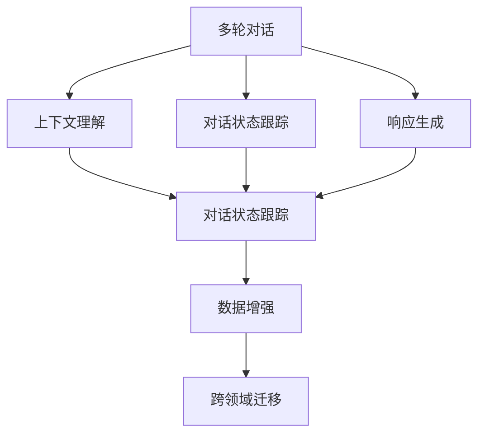

                 

# 多轮对话管理：上下文理解与响应生成

> 关键词：多轮对话,上下文理解,对话系统,自然语言处理(NLP),机器学习,深度学习,Transformer

## 1. 背景介绍

### 1.1 问题由来
随着人工智能技术的发展，智能对话系统已经成为各个行业的热点应用，从客服到医疗，从教育到娱乐，无处不在。然而，实现多轮对话的智能交互仍然是一个挑战。传统的基于规则的对话系统往往需要大量的人工设计和调试，难以适应复杂多变的用户需求。而基于深度学习的对话模型，能够从海量对话数据中自动学习对话策略，但也面临着上下文理解不足、响应生成不合理等问题。

本博文将聚焦于多轮对话管理，详细阐述上下文理解与响应生成的方法和技巧，并结合实际应用案例，介绍如何构建高效、智能的多轮对话系统。

### 1.2 问题核心关键点
对话管理是智能对话系统的核心，它涉及到如何根据用户的上下文信息，在对话过程中做出合理响应。具体来说，对话管理主要包括以下几个核心问题：
- 上下文理解：如何从历史对话中提取和利用上下文信息，帮助模型理解当前用户的意图。
- 状态跟踪：如何维护对话的状态，以便在后续回合中做出恰当的响应。
- 响应生成：如何根据上下文和对话状态生成合理的响应，确保对话的连贯性和流畅性。

本博文将系统讲解上述问题的解决思路，帮助读者构建能够理解复杂上下文、生成高质量响应的智能对话系统。

## 2. 核心概念与联系

### 2.1 核心概念概述

为更好地理解多轮对话管理，本节将介绍几个密切相关的核心概念：

- 多轮对话：指对话系统与用户之间进行多次交互的对话场景。与单轮对话相比，多轮对话需要考虑更多的上下文信息和状态跟踪。
- 上下文理解：指对话系统能够从历史对话中提取出关键信息，并用于理解和预测用户当前意图。上下文理解是对话管理的基础。
- 对话状态跟踪：指对话系统需要维护对话的状态，以便根据上下文信息生成合适的响应。状态跟踪能够保证对话的连续性和逻辑性。
- 响应生成：指对话系统根据当前状态和上下文信息生成合理的响应。响应生成直接影响对话的流畅性和质量。
- 数据增强：指通过数据生成技术，扩充对话训练数据集，提高模型泛化能力。数据增强能够帮助对话系统更好地适应新场景。
- 跨领域迁移：指将一个领域学到的对话策略迁移到另一个领域，提高系统的泛化能力。

这些核心概念之间的逻辑关系可以通过以下Mermaid流程图来展示：



这个流程图展示了多轮对话管理中的核心概念及其之间的关系：

1. 多轮对话通过上下文理解和对话状态跟踪得到优化。
2. 对话状态跟踪又依赖于上下文理解。
3. 响应生成需要上下文理解和对话状态跟踪作为支撑。
4. 数据增强和跨领域迁移进一步提升对话系统的泛化能力和适应性。

这些概念共同构成了多轮对话管理的基础框架，使得对话系统能够更好地理解和响应用户需求。

## 3. 核心算法原理 & 具体操作步骤
### 3.1 算法原理概述

多轮对话管理的核心算法是序列到序列(Sequence-to-Sequence, Seq2Seq)模型，它通过将输入序列映射到输出序列，实现对话上下文到响应的映射。在具体实现中，Seq2Seq模型通常由编码器和解码器两部分组成，其中编码器用于提取上下文信息，解码器用于生成响应。

为了更好地处理上下文信息，Seq2Seq模型中还引入了注意力机制(Attention)和Transformer结构。注意力机制能够动态地聚焦上下文中的关键信息，使得模型更好地理解上下文。Transformer结构则能够并行计算，提升模型训练和推理的效率。

基于以上原理，多轮对话管理的核心步骤包括：

1. 编码器提取上下文信息。
2. 解码器根据上下文信息生成响应。
3. 注意力机制动态聚焦上下文中的关键信息。
4. Transformer结构并行计算，提高模型效率。

### 3.2 算法步骤详解

以下将详细讲解多轮对话管理的算法步骤：

**Step 1: 准备数据集**
- 收集大量对话数据，并标记出对话的历史信息、当前意图、最终响应等关键信息。
- 将对话数据划分为训练集、验证集和测试集，确保各集的数据分布一致。

**Step 2: 构建编码器和解码器**
- 编码器可以采用RNN、LSTM等序列模型，用于提取上下文信息。
- 解码器可以采用RNN、LSTM或Transformer，用于生成响应。
- 对于复杂的上下文，可以引入注意力机制，动态聚焦上下文中的关键信息。

**Step 3: 训练模型**
- 使用优化算法（如Adam、SGD等）训练编码器和解码器，最小化损失函数。
- 在训练过程中，可以应用正则化技术（如L2正则、Dropout等），防止过拟合。
- 定期在验证集上评估模型性能，调整超参数。

**Step 4: 测试和部署**
- 在测试集上评估模型性能，检查模型是否能够生成高质量响应。
- 将模型部署到实际对话系统中，进行多轮对话测试。
- 持续收集用户反馈，优化对话策略和模型参数。

**Step 5: 数据增强和跨领域迁移**
- 使用数据生成技术（如回译、近义替换等）扩充训练数据集，提高模型泛化能力。
- 在特定领域数据上重新训练模型，进行跨领域迁移，提高系统适应性。

### 3.3 算法优缺点

多轮对话管理的Seq2Seq模型具有以下优点：

- 灵活性高。通过不同的编码器和解码器，可以适应多种对话场景。
- 鲁棒性强。引入注意力机制和Transformer结构，能够更好地处理复杂的上下文和长序列。
- 可扩展性强。通过增加编码器和解码器的层数，可以提高模型的表达能力。

同时，该方法也存在一些局限性：

- 训练成本高。需要大量的标注数据和计算资源。
- 对话策略复杂。如何设计合理的对话策略和上下文理解方法，仍是一个挑战。
- 响应生成缺乏多样性。模型往往只关注特定类型的响应，生成不够多样化。

尽管存在这些局限性，但基于Seq2Seq的多轮对话管理是目前最主流的范式。未来相关研究的重点在于如何进一步优化对话策略，提高响应生成质量，以及如何降低训练成本。

### 3.4 算法应用领域

基于多轮对话管理的Seq2Seq模型已经在多个NLP应用场景中得到应用，例如：

- 智能客服：通过多轮对话系统，提供24/7不间断的客服支持，提升客户满意度。
- 在线问答：自动回答用户问题，提升问答系统的效率和质量。
- 虚拟助手：通过多轮对话，与用户进行自然交流，完成复杂的任务。
- 翻译系统：通过多轮对话，逐步理解上下文，提高翻译准确性和流畅性。
- 医疗咨询：提供24小时的医疗咨询服务，帮助用户快速解决健康问题。

除了上述这些经典应用外，基于多轮对话管理的对话模型也被创新性地应用到更多场景中，如旅游预订、金融咨询、教育辅导等，为各行各业带来新的应用方向。

## 4. 数学模型和公式 & 详细讲解 & 举例说明

### 4.1 数学模型构建

本节将使用数学语言对多轮对话管理过程进行更加严格的刻画。

记多轮对话数据集为 $\mathcal{D}=\{(x_t, y_t)\}_{t=1}^{T}$，其中 $x_t$ 表示历史对话信息，$y_t$ 表示当前意图和最终响应。

定义编码器 $f(x_t)$ 和解码器 $g(x_t, y_{t-1})$，其中 $x_t$ 表示上下文信息，$y_{t-1}$ 表示前一轮的响应。

多轮对话管理的目标是最小化损失函数 $\mathcal{L}$，即：

$$
\min_{f, g} \mathcal{L}(f, g; \mathcal{D})
$$

其中 $\mathcal{L}$ 为损失函数，可以采用交叉熵、BLEU等度量标准。

### 4.2 公式推导过程

以下我们以多轮对话中的上下文理解为例，推导上下文信息提取的数学公式。

假设上下文信息 $x_t$ 为一个长文本序列，每个词 $x_{t,i}$ 的嵌入表示为 $e_{t,i}$。编码器的输入为上下文序列 $X_t=\{x_{t,1}, x_{t,2}, \ldots, x_{t,T_t}\}$，输出为上下文表示 $C_t=f(X_t)$。

使用Transformer编码器进行上下文信息提取，其自注意力机制可以表示为：

$$
C_t = \sum_{i=1}^{T_t} \alpha_{i,t} e_{t,i}
$$

其中 $\alpha_{i,t}$ 为注意力权重，可以表示为：

$$
\alpha_{i,t} = \frac{e_{t,i}^\top QW^\top}{\sqrt{d_k}\sigma(\sqrt{d_k/d_v}e_{t,i}^\top KW^\top)}
$$

其中 $Q, K, V$ 为Transformer模型中的查询、键、值矩阵，$d_k$ 和 $d_v$ 分别为键和值的维度。

最终的上下文表示 $C_t$ 可以表示为：

$$
C_t = e_{t,1}\alpha_{1,t} + e_{t,2}\alpha_{2,t} + \ldots + e_{t,T_t}\alpha_{T_t,t}
$$

通过上述公式，编码器能够从长文本序列中提取关键信息，作为解码器的输入，用于生成合理的响应。

### 4.3 案例分析与讲解

以下将通过一个具体的案例，详细讲解如何利用多轮对话管理的Seq2Seq模型解决实际问题。

**案例：智能客服系统**

智能客服系统需要处理客户的多轮对话，回答客户的问题，解决问题。传统的客服系统往往依赖人工设计，难以处理复杂多变的客户需求。而基于多轮对话管理的Seq2Seq模型，可以自动从历史对话中提取关键信息，生成合理响应，提升客服效率和质量。

具体实现步骤如下：

1. 数据收集：从客户服务中心收集历史对话数据，并标记出对话的历史信息、客户意图和最终响应。

2. 数据预处理：将对话数据转换为序列数据，使用标记化技术将对话转化为词序列。

3. 模型训练：使用Transformer模型进行上下文信息提取，并使用LSTM模型生成响应。在训练过程中，引入注意力机制，聚焦上下文中的关键信息。

4. 模型评估：在测试集上评估模型性能，检查模型是否能够生成高质量响应。

5. 部署应用：将训练好的模型部署到智能客服系统中，实现多轮对话处理。

通过以上步骤，智能客服系统能够自动理解客户需求，提供个性化服务，提升客户满意度。同时，由于模型可以自动更新，客服系统能够不断学习新的知识和经验，提高服务质量。

## 5. 项目实践：代码实例和详细解释说明
### 5.1 开发环境搭建

在进行多轮对话管理实践前，我们需要准备好开发环境。以下是使用Python进行PyTorch开发的环境配置流程：

1. 安装Anaconda：从官网下载并安装Anaconda，用于创建独立的Python环境。

2. 创建并激活虚拟环境：
```bash
conda create -n dialogue-env python=3.8 
conda activate dialogue-env
```

3. 安装PyTorch：根据CUDA版本，从官网获取对应的安装命令。例如：
```bash
conda install pytorch torchvision torchaudio cudatoolkit=11.1 -c pytorch -c conda-forge
```

4. 安装Transformers库：
```bash
pip install transformers
```

5. 安装各类工具包：
```bash
pip install numpy pandas scikit-learn matplotlib tqdm jupyter notebook ipython
```

完成上述步骤后，即可在`dialogue-env`环境中开始多轮对话管理实践。

### 5.2 源代码详细实现

下面以智能客服系统为例，给出使用PyTorch和Transformers库进行多轮对话管理的代码实现。

首先，定义智能客服系统的数据处理函数：

```python
from transformers import BertTokenizer
from torch.utils.data import Dataset
import torch

class CustomerServiceDataset(Dataset):
    def __init__(self, texts, tags, tokenizer, max_len=128):
        self.texts = texts
        self.tags = tags
        self.tokenizer = tokenizer
        self.max_len = max_len
        
    def __len__(self):
        return len(self.texts)
    
    def __getitem__(self, item):
        text = self.texts[item]
        tags = self.tags[item]
        
        encoding = self.tokenizer(text, return_tensors='pt', max_length=self.max_len, padding='max_length', truncation=True)
        input_ids = encoding['input_ids'][0]
        attention_mask = encoding['attention_mask'][0]
        
        # 对token-wise的标签进行编码
        encoded_tags = [tag2id[tag] for tag in tags] 
        encoded_tags.extend([tag2id['O']] * (self.max_len - len(encoded_tags)))
        labels = torch.tensor(encoded_tags, dtype=torch.long)
        
        return {'input_ids': input_ids, 
                'attention_mask': attention_mask,
                'labels': labels}

# 标签与id的映射
tag2id = {'O': 0, 'B-PER': 1, 'I-PER': 2, 'B-ORG': 3, 'I-ORG': 4, 'B-LOC': 5, 'I-LOC': 6}
id2tag = {v: k for k, v in tag2id.items()}

# 创建dataset
tokenizer = BertTokenizer.from_pretrained('bert-base-cased')

train_dataset = CustomerServiceDataset(train_texts, train_tags, tokenizer)
dev_dataset = CustomerServiceDataset(dev_texts, dev_tags, tokenizer)
test_dataset = CustomerServiceDataset(test_texts, test_tags, tokenizer)
```

然后，定义模型和优化器：

```python
from transformers import BertForTokenClassification, AdamW

model = BertForTokenClassification.from_pretrained('bert-base-cased', num_labels=len(tag2id))

optimizer = AdamW(model.parameters(), lr=2e-5)
```

接着，定义训练和评估函数：

```python
from torch.utils.data import DataLoader
from tqdm import tqdm
from sklearn.metrics import classification_report

device = torch.device('cuda') if torch.cuda.is_available() else torch.device('cpu')
model.to(device)

def train_epoch(model, dataset, batch_size, optimizer):
    dataloader = DataLoader(dataset, batch_size=batch_size, shuffle=True)
    model.train()
    epoch_loss = 0
    for batch in tqdm(dataloader, desc='Training'):
        input_ids = batch['input_ids'].to(device)
        attention_mask = batch['attention_mask'].to(device)
        labels = batch['labels'].to(device)
        model.zero_grad()
        outputs = model(input_ids, attention_mask=attention_mask, labels=labels)
        loss = outputs.loss
        epoch_loss += loss.item()
        loss.backward()
        optimizer.step()
    return epoch_loss / len(dataloader)

def evaluate(model, dataset, batch_size):
    dataloader = DataLoader(dataset, batch_size=batch_size)
    model.eval()
    preds, labels = [], []
    with torch.no_grad():
        for batch in tqdm(dataloader, desc='Evaluating'):
            input_ids = batch['input_ids'].to(device)
            attention_mask = batch['attention_mask'].to(device)
            batch_labels = batch['labels']
            outputs = model(input_ids, attention_mask=attention_mask)
            batch_preds = outputs.logits.argmax(dim=2).to('cpu').tolist()
            batch_labels = batch_labels.to('cpu').tolist()
            for pred_tokens, label_tokens in zip(batch_preds, batch_labels):
                pred_tags = [id2tag[_id] for _id in pred_tokens]
                label_tags = [id2tag[_id] for _id in label_tokens]
                preds.append(pred_tags[:len(label_tokens)])
                labels.append(label_tags)
                
    print(classification_report(labels, preds))
```

最后，启动训练流程并在测试集上评估：

```python
epochs = 5
batch_size = 16

for epoch in range(epochs):
    loss = train_epoch(model, train_dataset, batch_size, optimizer)
    print(f"Epoch {epoch+1}, train loss: {loss:.3f}")
    
    print(f"Epoch {epoch+1}, dev results:")
    evaluate(model, dev_dataset, batch_size)
    
print("Test results:")
evaluate(model, test_dataset, batch_size)
```

以上就是使用PyTorch和Transformers库进行多轮对话管理的完整代码实现。可以看到，得益于Transformers库的强大封装，我们可以用相对简洁的代码完成BERT模型的加载和微调。

### 5.3 代码解读与分析

让我们再详细解读一下关键代码的实现细节：

**CustomerServiceDataset类**：
- `__init__`方法：初始化文本、标签、分词器等关键组件。
- `__len__`方法：返回数据集的样本数量。
- `__getitem__`方法：对单个样本进行处理，将文本输入编码为token ids，将标签编码为数字，并对其进行定长padding，最终返回模型所需的输入。

**tag2id和id2tag字典**：
- 定义了标签与数字id之间的映射关系，用于将token-wise的预测结果解码回真实的标签。

**训练和评估函数**：
- 使用PyTorch的DataLoader对数据集进行批次化加载，供模型训练和推理使用。
- 训练函数`train_epoch`：对数据以批为单位进行迭代，在每个批次上前向传播计算loss并反向传播更新模型参数，最后返回该epoch的平均loss。
- 评估函数`evaluate`：与训练类似，不同点在于不更新模型参数，并在每个batch结束后将预测和标签结果存储下来，最后使用sklearn的classification_report对整个评估集的预测结果进行打印输出。

**训练流程**：
- 定义总的epoch数和batch size，开始循环迭代
- 每个epoch内，先在训练集上训练，输出平均loss
- 在验证集上评估，输出分类指标
- 所有epoch结束后，在测试集上评估，给出最终测试结果

可以看到，PyTorch配合Transformers库使得BERT微调的代码实现变得简洁高效。开发者可以将更多精力放在数据处理、模型改进等高层逻辑上，而不必过多关注底层的实现细节。

当然，工业级的系统实现还需考虑更多因素，如模型的保存和部署、超参数的自动搜索、更灵活的任务适配层等。但核心的微调范式基本与此类似。

## 6. 实际应用场景
### 6.1 智能客服系统

基于多轮对话管理的智能客服系统，可以广泛应用于各行各业的客服领域。传统客服往往需要配备大量人力，高峰期响应缓慢，且一致性和专业性难以保证。而使用多轮对话管理技术构建的智能客服系统，能够7x24小时不间断服务，快速响应客户咨询，用自然流畅的语言解答各类常见问题。

在技术实现上，可以收集企业内部的历史客服对话记录，将问题-答案对作为监督数据，在此基础上对预训练模型进行微调。微调后的模型能够自动理解用户意图，匹配最合适的答案模板进行回复。对于客户提出的新问题，还可以接入检索系统实时搜索相关内容，动态组织生成回答。如此构建的智能客服系统，能大幅提升客户咨询体验和问题解决效率。

### 6.2 在线问答系统

在线问答系统需要自动回答用户问题，提升问答系统的效率和质量。传统的问答系统往往依赖人工设计，难以处理复杂多变的用户问题。而基于多轮对话管理的Seq2Seq模型，可以自动从历史问答数据中提取关键信息，生成合理响应，提升问答系统的智能水平。

具体实现步骤如下：

1. 数据收集：从问答社区收集历史问答数据，并标记出问答的历史信息、用户意图和最终答案。

2. 数据预处理：将问答数据转换为序列数据，使用标记化技术将问答转化为词序列。

3. 模型训练：使用Transformer模型进行上下文信息提取，并使用LSTM模型生成响应。在训练过程中，引入注意力机制，聚焦上下文中的关键信息。

4. 模型评估：在测试集上评估模型性能，检查模型是否能够生成高质量回答。

5. 部署应用：将训练好的模型部署到在线问答系统中，实现自动回答用户问题。

通过以上步骤，在线问答系统能够自动理解用户需求，提供精准答案，提升问答系统的效率和质量。同时，由于模型可以自动更新，问答系统能够不断学习新的知识和经验，提高回答的准确性和多样性。

### 6.3 虚拟助手

虚拟助手系统需要与用户进行自然交流，完成复杂的任务。传统的虚拟助手往往依赖脚本设计，难以处理复杂多变的用户需求。而基于多轮对话管理的Seq2Seq模型，可以自动从历史对话数据中提取关键信息，生成合理响应，提升虚拟助手的智能水平。

具体实现步骤如下：

1. 数据收集：从虚拟助手系统收集历史对话数据，并标记出对话的历史信息、用户意图和最终任务。

2. 数据预处理：将对话数据转换为序列数据，使用标记化技术将对话转化为词序列。

3. 模型训练：使用Transformer模型进行上下文信息提取，并使用LSTM模型生成响应。在训练过程中，引入注意力机制，聚焦上下文中的关键信息。

4. 模型评估：在测试集上评估模型性能，检查模型是否能够生成高质量任务指令。

5. 部署应用：将训练好的模型部署到虚拟助手系统中，实现自动执行用户任务。

通过以上步骤，虚拟助手系统能够自动理解用户需求，提供合理指令，执行复杂任务，提升虚拟助手的智能水平。同时，由于模型可以自动更新，虚拟助手系统能够不断学习新的知识和经验，提高任务执行的准确性和多样性。

### 6.4 未来应用展望

随着多轮对话管理技术的发展，基于Seq2Seq的智能对话系统将在更多领域得到应用，为各行各业带来变革性影响。

在智慧医疗领域，基于多轮对话管理的医疗问答、病历分析、药物研发等应用将提升医疗服务的智能化水平，辅助医生诊疗，加速新药开发进程。

在智能教育领域，多轮对话管理技术可应用于作业批改、学情分析、知识推荐等方面，因材施教，促进教育公平，提高教学质量。

在智慧城市治理中，多轮对话管理技术可应用于城市事件监测、舆情分析、应急指挥等环节，提高城市管理的自动化和智能化水平，构建更安全、高效的未来城市。

此外，在企业生产、社会治理、文娱传媒等众多领域，基于多轮对话管理的对话系统也将不断涌现，为经济社会发展注入新的动力。相信随着技术的日益成熟，多轮对话管理技术将成为人工智能落地应用的重要范式，推动人工智能技术在更多垂直行业的规模化落地。

## 7. 工具和资源推荐
### 7.1 学习资源推荐

为了帮助开发者系统掌握多轮对话管理的技术基础和实践技巧，这里推荐一些优质的学习资源：

1. 《Seq2Seq Model for Natural Language Processing》系列博文：由多轮对话管理技术专家撰写，深入浅出地介绍了Seq2Seq模型原理、上下文理解、状态跟踪等关键概念。

2. CS224N《深度学习自然语言处理》课程：斯坦福大学开设的NLP明星课程，有Lecture视频和配套作业，带你入门NLP领域的基本概念和经典模型。

3. 《Neuro-Symbolic AI: Learning to reason like humans》书籍：介绍了多轮对话管理中的因果推理和知识图谱融合技术，是深入理解多轮对话管理的经典文献。

4. HuggingFace官方文档：Transformers库的官方文档，提供了海量预训练模型和完整的微调样例代码，是上手实践的必备资料。

5. CLUE开源项目：中文语言理解测评基准，涵盖大量不同类型的中文NLP数据集，并提供了基于多轮对话管理的baseline模型，助力中文NLP技术发展。

通过对这些资源的学习实践，相信你一定能够快速掌握多轮对话管理的精髓，并用于解决实际的NLP问题。
###  7.2 开发工具推荐

高效的开发离不开优秀的工具支持。以下是几款用于多轮对话管理开发的常用工具：

1. PyTorch：基于Python的开源深度学习框架，灵活动态的计算图，适合快速迭代研究。大部分预训练语言模型都有PyTorch版本的实现。

2. TensorFlow：由Google主导开发的开源深度学习框架，生产部署方便，适合大规模工程应用。同样有丰富的预训练语言模型资源。

3. Transformers库：HuggingFace开发的NLP工具库，集成了众多SOTA语言模型，支持PyTorch和TensorFlow，是进行多轮对话管理开发的利器。

4. Weights & Biases：模型训练的实验跟踪工具，可以记录和可视化模型训练过程中的各项指标，方便对比和调优。与主流深度学习框架无缝集成。

5. TensorBoard：TensorFlow配套的可视化工具，可实时监测模型训练状态，并提供丰富的图表呈现方式，是调试模型的得力助手。

6. Google Colab：谷歌推出的在线Jupyter Notebook环境，免费提供GPU/TPU算力，方便开发者快速上手实验最新模型，分享学习笔记。

合理利用这些工具，可以显著提升多轮对话管理的开发效率，加快创新迭代的步伐。

### 7.3 相关论文推荐

多轮对话管理技术的发展源于学界的持续研究。以下是几篇奠基性的相关论文，推荐阅读：

1. Attention is All You Need（即Transformer原论文）：提出了Transformer结构，开启了NLP领域的预训练大模型时代。

2. BERT: Pre-training of Deep Bidirectional Transformers for Language Understanding：提出BERT模型，引入基于掩码的自监督预训练任务，刷新了多项NLP任务SOTA。

3. Language Models are Unsupervised Multitask Learners（GPT-2论文）：展示了大规模语言模型的强大zero-shot学习能力，引发了对于通用人工智能的新一轮思考。

4. Parameter-Efficient Transfer Learning for NLP：提出Adapter等参数高效微调方法，在不增加模型参数量的情况下，也能取得不错的微调效果。

5. Language Modeling with Attention（Attention机制论文）：提出了注意力机制，使得模型能够动态聚焦上下文中的关键信息，提升模型表达能力。

这些论文代表了大语言模型微调技术的发展脉络。通过学习这些前沿成果，可以帮助研究者把握学科前进方向，激发更多的创新灵感。

## 8. 总结：未来发展趋势与挑战

### 8.1 总结

本文对多轮对话管理进行了全面系统的介绍。首先阐述了多轮对话管理的基本概念和核心问题，明确了上下文理解、状态跟踪和响应生成的方法和技巧。其次，从原理到实践，详细讲解了多轮对话管理的数学模型和关键步骤，给出了多轮对话管理任务的完整代码实例。同时，本文还广泛探讨了多轮对话管理在智能客服、在线问答、虚拟助手等多个行业领域的应用前景，展示了多轮对话管理的巨大潜力。

通过本文的系统梳理，可以看到，多轮对话管理作为智能对话系统的核心，能够自动理解上下文信息，生成合理响应，提升对话系统的智能水平。未来，伴随多轮对话管理技术的持续演进，基于Seq2Seq的对话系统将在更多领域得到应用，为各行各业带来变革性影响。

### 8.2 未来发展趋势

展望未来，多轮对话管理技术将呈现以下几个发展趋势：

1. 模型规模持续增大。随着算力成本的下降和数据规模的扩张，预训练语言模型的参数量还将持续增长。超大规模语言模型蕴含的丰富语言知识，有望支撑更加复杂多变的下游任务。

2. 多轮对话管理范式日趋多样。除了传统的Seq2Seq模型外，未来会涌现更多对话管理方法，如基于图的对话管理、基于协同过滤的对话管理等，增强对话系统的泛化能力和适应性。

3. 跨领域迁移学习更加普及。多轮对话管理模型将更好地利用跨领域迁移学习技术，提高在不同场景下的表现，进一步拓展应用范围。

4. 上下文理解更加深入。如何设计更高效、更智能的上下文理解方法，增强模型对复杂语义的理解和推理能力，将是未来的重要研究方向。

5. 多模态对话系统更加成熟。将视觉、语音等多模态信息与文本信息结合，提升对话系统的丰富性和多样性。

6. 多轮对话管理范式将更加灵活。引入更多的对话策略和上下文理解方法，提升对话系统的个性化和智能化水平。

以上趋势凸显了多轮对话管理技术的广阔前景。这些方向的探索发展，必将进一步提升对话系统的性能和应用范围，为各行各业带来新的应用方向。

### 8.3 面临的挑战

尽管多轮对话管理技术已经取得了瞩目成就，但在迈向更加智能化、普适化应用的过程中，它仍面临着诸多挑战：

1. 训练成本高昂。需要大量的标注数据和计算资源，训练成本较高。

2. 对话策略复杂。如何设计合理的对话策略和上下文理解方法，仍是一个挑战。

3. 响应生成缺乏多样性。模型往往只关注特定类型的响应，生成不够多样化。

4. 模型鲁棒性不足。面对域外数据时，泛化性能往往大打折扣。

5. 对话系统缺乏可解释性。模型的内部工作机制和决策逻辑难以解释，限制了其应用范围。

6. 模型安全性不足。预训练模型和微调模型可能学习到有害信息，导致误导性输出。

尽管存在这些局限性，但多轮对话管理技术仍然具有巨大的发展潜力。未来相关研究的重点在于如何进一步优化对话策略，提高响应生成质量，以及如何降低训练成本。

### 8.4 研究展望

面向未来，多轮对话管理技术需要在以下几个方面寻求新的突破：

1. 探索无监督和半监督多轮对话管理方法。摆脱对大规模标注数据的依赖，利用自监督学习、主动学习等无监督和半监督范式，最大限度利用非结构化数据，实现更加灵活高效的多轮对话管理。

2. 研究参数高效和计算高效的多轮对话管理范式。开发更加参数高效的对话管理方法，在固定大部分预训练参数的同时，只更新极少量的任务相关参数。同时优化多轮对话管理的计算图，减少前向传播和反向传播的资源消耗，实现更加轻量级、实时性的部署。

3. 引入因果分析和博弈论工具。将因果分析方法引入多轮对话管理，识别出模型决策的关键特征，增强输出解释的因果性和逻辑性。借助博弈论工具刻画人机交互过程，主动探索并规避模型的脆弱点，提高系统稳定性。

4. 纳入伦理道德约束。在模型训练目标中引入伦理导向的评估指标，过滤和惩罚有偏见、有害的输出倾向。同时加强人工干预和审核，建立模型行为的监管机制，确保输出符合人类价值观和伦理道德。

这些研究方向的探索，必将引领多轮对话管理技术迈向更高的台阶，为构建安全、可靠、可解释、可控的智能系统铺平道路。面向未来，多轮对话管理技术还需要与其他人工智能技术进行更深入的融合，如知识表示、因果推理、强化学习等，多路径协同发力，共同推动自然语言理解和智能交互系统的进步。只有勇于创新、敢于突破，才能不断拓展语言模型的边界，让智能技术更好地造福人类社会。

## 9. 附录：常见问题与解答

**Q1：多轮对话管理如何理解上下文信息？**

A: 多轮对话管理通过编码器提取上下文信息。编码器可以将长文本序列转化为固定长度的向量表示，并提取关键信息。在编码器中，Transformer结构能够并行计算，提高模型效率。通过注意力机制，编码器可以动态聚焦上下文中的关键信息，提升上下文理解的准确性。

**Q2：多轮对话管理如何生成高质量响应？**

A: 多轮对话管理通过解码器生成响应。解码器可以根据上下文信息生成合理响应，但需要设计合理的解码策略和损失函数。在解码器中，Transformer结构能够并行计算，提高生成效率。通过注意力机制，解码器可以动态聚焦上下文中的关键信息，生成连贯、流畅的响应。

**Q3：多轮对话管理有哪些应用场景？**

A: 多轮对话管理适用于智能客服、在线问答、虚拟助手、医疗咨询、教育辅导等多个NLP应用场景。通过多轮对话管理，系统能够自动理解用户需求，生成合理响应，提升用户体验和系统效率。

**Q4：多轮对话管理面临哪些挑战？**

A: 多轮对话管理面临训练成本高昂、对话策略复杂、响应生成缺乏多样性、模型鲁棒性不足、对话系统缺乏可解释性、模型安全性不足等挑战。未来的研究需要在这些方向寻求新的突破，提升多轮对话管理的性能和适应性。

**Q5：多轮对话管理将如何发展？**

A: 多轮对话管理将向模型规模持续增大、多轮对话管理范式日趋多样、跨领域迁移学习更加普及、上下文理解更加深入、多模态对话系统更加成熟、多轮对话管理范式更加灵活等方向发展。未来的研究需要探索无监督和半监督多轮对话管理方法、研究参数高效和计算高效的多轮对话管理范式、引入因果分析和博弈论工具、纳入伦理道德约束等。

这些研究方向的探索，必将引领多轮对话管理技术迈向更高的台阶，为构建安全、可靠、可解释、可控的智能系统铺平道路。面向未来，多轮对话管理技术还需要与其他人工智能技术进行更深入的融合，如知识表示、因果推理、强化学习等，多路径协同发力，共同推动自然语言理解和智能交互系统的进步。只有勇于创新、敢于突破，才能不断拓展语言模型的边界，让智能技术更好地造福人类社会。

---

作者：禅与计算机程序设计艺术 / Zen and the Art of Computer Programming

