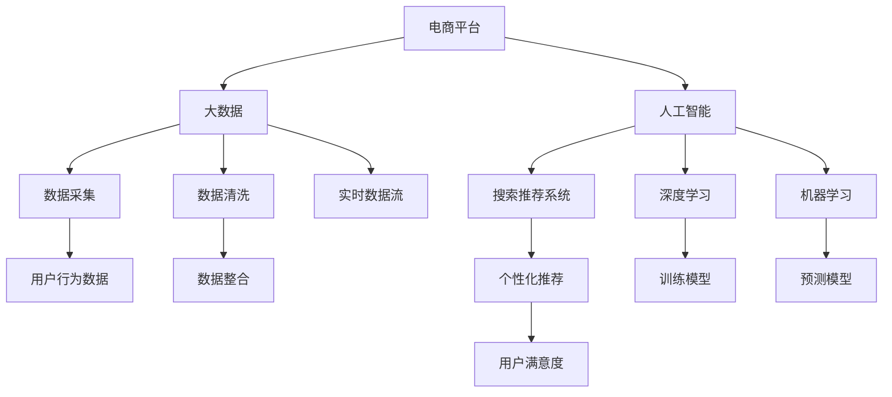

                 

# 大数据与AI 驱动的电商平台转型：搜索推荐系统是核心，数据质量是重点

> 关键词：电商平台,大数据,人工智能,搜索推荐系统,数据质量,转型

## 1. 背景介绍

### 1.1 问题由来
近年来，随着电子商务市场的快速扩张和消费者行为的日益复杂化，电商平台面临着巨大的挑战。如何提升用户体验，增加用户粘性，提升订单转化率，成为各大电商平台亟需解决的问题。传统的电商平台多采用基于规则的推荐系统，缺乏个性化和动态化的能力，难以满足用户多样化的需求。大数据与人工智能技术的兴起，为电商平台的转型提供了新的方向。

大数据技术可以实时捕捉用户行为数据，洞察用户需求，为推荐系统提供丰富的训练数据。人工智能技术，尤其是深度学习模型，可以从海量数据中提取出复杂的模式，构建更加精准的推荐模型。

### 1.2 问题核心关键点
在电商平台的转型过程中，搜索推荐系统成为核心，数据质量则成为重中之重。这是因为：
1. 搜索推荐系统直接影响用户体验。用户能否快速找到心仪的商品，是否能看到个性化的推荐，是平台能否留住用户的关键。
2. 搜索推荐系统依赖大量数据。无论是商品标签、用户行为、历史订单，还是外界环境数据，都需要高质量的数据作为支撑。
3. 数据质量直接决定了推荐效果。数据中的噪音、偏差、不完整性都会严重影响推荐模型输出的准确性和多样性。

## 2. 核心概念与联系

### 2.1 核心概念概述

为了更好地理解搜索推荐系统的原理和应用，本节将介绍几个关键概念：

- 电商平台(E-Commerce Platform)：借助互联网平台，提供在线商品销售、用户管理、物流配送等服务的商业模式。
- 搜索推荐系统(Search & Recommendation System)：利用用户行为数据、商品特征数据等构建模型，为用户提供个性化的搜索结果和推荐内容的系统。
- 大数据(Big Data)：规模巨大、复杂度高、价值密度低的数据集合，主要来源于互联网、社交媒体、物联网等。
- 人工智能(Artificial Intelligence)：利用算法、模型等技术，赋予计算机以智能，使其具备学习、推理、感知、决策等能力。
- 数据质量(Data Quality)：数据的一致性、完整性、准确性、及时性等指标，直接影响算法模型训练和推理的准确性。

这些概念之间的逻辑关系可以通过以下Mermaid流程图来展示：



这个流程图展示了电商平台的各个组件及其相互关系：

1. 电商平台通过大数据技术收集用户行为数据，为人工智能提供训练数据。
2. 人工智能技术训练出深度学习、机器学习等模型，构建搜索推荐系统。
3. 搜索推荐系统利用模型进行个性化推荐，提升用户满意度。
4. 数据质量贯穿于数据的采集、清洗、整合、流处理等环节，是提升推荐效果的基础。

## 3. 核心算法原理 & 具体操作步骤

### 3.1 算法原理概述

搜索推荐系统的主要目标是，根据用户的历史行为、浏览记录、兴趣偏好等数据，构建一个动态、个性化的推荐模型。该模型能够预测用户对商品的可能需求，并实时生成推荐结果。

算法原理上，搜索推荐系统可以抽象为以下几个步骤：

1. **数据采集**：从电商平台的用户行为、历史订单、商品属性等数据源中，采集用户交互数据。
2. **数据预处理**：清洗数据，去除噪声、填补缺失值、标准化数据格式等，提升数据质量。
3. **模型训练**：构建深度学习或机器学习模型，并使用清洗后的数据进行训练，得到推荐模型。
4. **实时推荐**：根据用户的实时行为数据，实时生成个性化推荐结果，并展示给用户。

### 3.2 算法步骤详解

以深度学习模型为例，搜索推荐系统的实现流程如下：

**Step 1: 数据采集**

电商平台的推荐系统需要大量的用户行为数据，主要包括以下几个方面：

- 用户点击行为：记录用户点击商品、广告、促销等交互行为。
- 用户浏览行为：记录用户浏览商品的时间、顺序、停留时间等。
- 用户购买行为：记录用户的购买记录、评分、评论等。
- 用户属性：记录用户的年龄、性别、地域等基本信息。
- 商品属性：记录商品的类别、价格、品牌、销量等详细信息。

通过这些数据，可以构建电商平台的搜索推荐模型，并不断优化推荐效果。

**Step 2: 数据预处理**

数据预处理是推荐系统的核心步骤，主要包括以下几个方面：

- **数据清洗**：去除无效数据、填补缺失值、处理重复数据等，确保数据的完整性和准确性。
- **特征工程**：设计有意义的特征，如用户兴趣、商品标签、时间戳等，提升模型的表现力。
- **数据标准化**：将数据转换为统一的格式和标准，方便模型训练和推理。

数据预处理的目的是提升数据质量，减少噪声，提升推荐模型的效果。

**Step 3: 模型训练**

推荐模型训练通常使用深度学习框架进行，如TensorFlow、PyTorch等。常用的推荐模型包括：

- 协同过滤模型(Collaborative Filtering, CF)：基于用户和商品的相似性，推荐用户可能感兴趣的商品。
- 基于内容的推荐模型(Content-Based Recommendation, CBR)：根据商品的属性特征，推荐与用户历史行为相似的商品。
- 深度学习推荐模型：如基于深度神经网络的RNN、CNN、Transformer等，能够从多维度数据中提取复杂的模式，提升推荐精度。

以深度学习推荐模型为例，常用的架构包括：

- **User-Item互动网络**：将用户和商品看作图中的节点，构建互动关系图，学习用户和商品的潜在特征表示。
- **多塔模型(Multi-Head Attention)**：使用Transformer结构，学习用户和商品的注意力权重，生成推荐结果。
- **自编码器(Autoencoder)**：将用户行为数据编码，并解码为推荐结果，提升推荐模型的泛化能力。

**Step 4: 实时推荐**

实时推荐系统需要快速响应用户的行为变化，生成个性化的推荐结果。常用的技术手段包括：

- **缓存技术**：使用Redis、Memcached等缓存系统，存储部分用户行为数据和推荐结果，减少计算延迟。
- **异步处理**：使用异步消息队列，如Kafka、RabbitMQ等，处理实时数据流，提升系统响应速度。
- **分布式计算**：使用Spark、Flink等分布式计算框架，提升模型训练和推理的并行度。

### 3.3 算法优缺点

搜索推荐系统的优点：

1. 个性化推荐：能够根据用户的历史行为、兴趣偏好等数据，生成个性化的推荐结果，提升用户体验。
2. 动态调整：能够实时响应用户的行为变化，动态调整推荐结果，提升推荐效果。
3. 数据驱动：能够利用大数据技术，捕捉用户需求，优化推荐模型，提升推荐的精准性。

搜索推荐系统的缺点：

1. 依赖数据：数据的质量直接影响推荐效果，数据缺失、偏差等问题会严重影响推荐结果。
2. 模型复杂：深度学习模型的训练和推理复杂度较高，需要高性能硬件支持。
3. 隐私问题：用户的隐私数据需要保护，推荐模型需要合理设计，防止数据滥用。

## 4. 数学模型和公式 & 详细讲解 & 举例说明

### 4.1 数学模型构建

推荐系统的数学模型可以抽象为如下形式：

$$
\hat{y}=f(x,\theta)
$$

其中，$x$ 表示用户的行为数据，$\theta$ 表示模型的参数，$f$ 表示模型函数。目标是最小化预测值 $\hat{y}$ 与真实标签 $y$ 之间的误差。

以协同过滤模型为例，假设用户 $u$ 对商品 $i$ 的评分 $r_{ui}$ 已知，推荐模型 $f$ 的目标是最小化预测评分 $\hat{r}_{ui}$ 与真实评分 $r_{ui}$ 之间的误差。

### 4.2 公式推导过程

以协同过滤模型为例，常用的协同过滤算法包括矩阵分解和基于用户的协同过滤等。

矩阵分解算法的核心思想是，将用户与商品的评分矩阵分解为两个低秩矩阵的乘积：

$$
R \approx U \times V
$$

其中 $R$ 表示用户与商品的评分矩阵，$U$ 和 $V$ 分别为用户和商品的低秩矩阵。通过对矩阵 $U$ 和 $V$ 进行训练，可以得到用户和商品的隐含特征表示。

基于用户的协同过滤算法，目标是最小化用户 $u$ 与商品 $i$ 的隐含特征的内积与真实评分 $r_{ui}$ 之间的误差：

$$
\min_{u_i} \sum_{u \in U} ||u_i \times V_i - r_{ui}||^2
$$

其中 $u_i$ 和 $V_i$ 分别为用户 $u$ 和商品 $i$ 的隐含特征向量，$|| \cdot ||$ 表示向量的欧几里得距离。

### 4.3 案例分析与讲解

以亚马逊的推荐系统为例，亚马逊的推荐算法采用了基于矩阵分解的协同过滤模型。具体而言，亚马逊首先从用户的浏览、购买等行为数据中，构建用户与商品的评分矩阵 $R$。然后，通过矩阵分解算法，将评分矩阵 $R$ 分解为两个低秩矩阵 $U$ 和 $V$。

通过对矩阵 $U$ 和 $V$ 进行训练，得到用户和商品的隐含特征表示，并计算用户 $u$ 对商品 $i$ 的预测评分 $\hat{r}_{ui}$。根据预测评分与真实评分之间的误差，不断调整模型的参数，优化推荐效果。

## 5. 项目实践：代码实例和详细解释说明

### 5.1 开发环境搭建

在进行推荐系统开发前，我们需要准备好开发环境。以下是使用Python进行TensorFlow开发的环境配置流程：

1. 安装Anaconda：从官网下载并安装Anaconda，用于创建独立的Python环境。

2. 创建并激活虚拟环境：
```bash
conda create -n tf-env python=3.8 
conda activate tf-env
```

3. 安装TensorFlow：根据CUDA版本，从官网获取对应的安装命令。例如：
```bash
conda install tensorflow -c tf -c conda-forge
```

4. 安装其他必要的库：
```bash
pip install pandas numpy tensorflow-io transformers
```

完成上述步骤后，即可在`tf-env`环境中开始推荐系统开发。

### 5.2 源代码详细实现

我们以协同过滤算法为例，使用TensorFlow实现推荐系统的数据预处理、模型训练和实时推荐。

首先，定义协同过滤算法的模型类：

```python
import tensorflow as tf
from tensorflow import keras

class CollaborativeFiltering:
    def __init__(self, num_users, num_items, num_factors):
        self.num_users = num_users
        self.num_items = num_items
        self.num_factors = num_factors
        self.user_factors = self.create_user_factors()
        self.item_factors = self.create_item_factors()

    def create_user_factors(self):
        user_factors = tf.random.normal([self.num_users, self.num_factors])
        return tf.Variable(user_factors)

    def create_item_factors(self):
        item_factors = tf.random.normal([self.num_items, self.num_factors])
        return tf.Variable(item_factors)
```

然后，定义协同过滤算法的训练函数：

```python
class CollaborativeFiltering:
    ...
    def train(self, data, num_epochs, batch_size, learning_rate):
        optimizer = tf.keras.optimizers.Adam(learning_rate=learning_rate)
        for epoch in range(num_epochs):
            for user, item, rating in data:
                with tf.GradientTape() as tape:
                    predicted_rating = tf.matmul(tf.expand_dims(self.user_factors[user], axis=-1), self.item_factors[item])
                    loss = tf.losses.mean_squared_error(rating, predicted_rating)
                gradients = tape.gradient(loss, [self.user_factors, self.item_factors])
                optimizer.apply_gradients(zip(gradients, [self.user_factors, self.item_factors]))
```

接着，定义协同过滤算法的预测函数：

```python
class CollaborativeFiltering:
    ...
    def predict(self, user, item):
        predicted_rating = tf.matmul(tf.expand_dims(self.user_factors[user], axis=-1), self.item_factors[item])
        return predicted_rating.numpy().flatten()
```

最后，启动训练流程并在实时数据上评估：

```python
# 假设数据已经准备就绪，train_data为训练集，test_data为测试集

# 创建模型实例
model = CollaborativeFiltering(num_users, num_items, num_factors)

# 训练模型
model.train(train_data, num_epochs, batch_size, learning_rate)

# 评估模型
model.evaluate(test_data)
```

以上就是使用TensorFlow实现协同过滤算法的推荐系统的完整代码实现。可以看到，TensorFlow提供了丰富的深度学习组件，使得模型训练和推理过程变得简单易用。

### 5.3 代码解读与分析

让我们再详细解读一下关键代码的实现细节：

**CollaborativeFiltering类**：
- `__init__`方法：初始化用户、商品和隐含特征的维度。
- `create_user_factors`方法：创建用户隐含特征矩阵。
- `create_item_factors`方法：创建商品隐含特征矩阵。

**train函数**：
- 使用Adam优化器，定义损失函数为均方误差。
- 在每个epoch内，对每个训练样本计算损失，反向传播更新模型参数。

**predict函数**：
- 使用矩阵乘法计算用户对商品的预测评分，并返回一维数组。

**模型评估**：
- 使用test_data对训练好的模型进行评估，输出预测评分与真实评分的误差。

## 6. 实际应用场景

### 6.1 个性化推荐

个性化推荐是推荐系统的核心应用。通过分析用户的历史行为数据，推荐系统可以实时生成个性化的推荐结果，提升用户体验和订单转化率。

以亚马逊为例，亚马逊通过协同过滤算法，分析用户的历史浏览和购买记录，推荐用户可能感兴趣的商品。具体而言，亚马逊首先对用户的浏览和购买记录进行预处理，构建用户与商品的评分矩阵 $R$。然后，使用矩阵分解算法，将评分矩阵 $R$ 分解为两个低秩矩阵 $U$ 和 $V$。

通过对矩阵 $U$ 和 $V$ 进行训练，得到用户和商品的隐含特征表示。最后，根据预测评分与真实评分之间的误差，不断调整模型的参数，优化推荐效果。通过这种方式，亚马逊可以实时响应用户的行为变化，生成个性化的推荐结果，提升用户体验和订单转化率。

### 6.2 实时库存管理

实时库存管理是电商平台的重要环节。通过推荐系统，电商平台可以预测商品的需求量，实时调整库存，避免缺货和积压。

以京东为例，京东通过协同过滤算法，预测用户对商品的需求量，实时调整库存。具体而言，京东首先对用户的浏览和购买记录进行预处理，构建用户与商品的评分矩阵 $R$。然后，使用矩阵分解算法，将评分矩阵 $R$ 分解为两个低秩矩阵 $U$ 和 $V$。

通过对矩阵 $U$ 和 $V$ 进行训练，得到用户和商品的隐含特征表示。最后，根据预测评分与真实评分之间的误差，不断调整模型的参数，优化推荐效果。通过这种方式，京东可以实时预测用户对商品的需求量，动态调整库存，提升供应链的效率和灵活性。

### 6.3 商品定价策略

商品定价策略是电商平台的另一大核心应用。通过推荐系统，电商平台可以预测用户对商品的价格敏感度，实时调整定价策略，提高销售额。

以携程为例，携程通过协同过滤算法，预测用户对商品的价格敏感度，实时调整定价策略。具体而言，携程首先对用户的浏览和购买记录进行预处理，构建用户与商品的评分矩阵 $R$。然后，使用矩阵分解算法，将评分矩阵 $R$ 分解为两个低秩矩阵 $U$ 和 $V$。

通过对矩阵 $U$ 和 $V$ 进行训练，得到用户和商品的隐含特征表示。最后，根据预测评分与真实评分之间的误差，不断调整模型的参数，优化推荐效果。通过这种方式，携程可以实时预测用户对商品的价格敏感度，动态调整定价策略，提高销售额。

### 6.4 未来应用展望

随着大数据和人工智能技术的不断进步，推荐系统将在更多领域得到应用，为电商平台带来更多的价值：

1. 跨平台推荐：通过跨平台的推荐系统，实现不同平台之间的数据共享和协同，提升推荐效果。
2. 多模态推荐：将商品的图片、视频、文本等多模态数据融合到推荐模型中，提升推荐效果。
3. 实时个性化推荐：通过实时响应用户行为变化，生成个性化的推荐结果，提升用户体验。
4. 多目标优化推荐：将不同的推荐目标（如订单转化率、用户满意度等）融合到推荐模型中，实现多目标优化。
5. 用户行为预测：通过推荐系统预测用户的未来行为，优化产品设计和运营策略。

未来，随着推荐技术的不断进步，电商平台将能够更好地理解和满足用户需求，提升用户粘性和满意度，推动业务增长。

## 7. 工具和资源推荐

### 7.1 学习资源推荐

为了帮助开发者系统掌握推荐系统的理论基础和实践技巧，这里推荐一些优质的学习资源：

1. 《推荐系统实战》：深度剖析推荐系统的原理和算法，涵盖协同过滤、深度学习等多种推荐方法。
2. 《机器学习实战》：通俗易懂地介绍机器学习的基本概念和算法，适合初学者入门。
3. Coursera《推荐系统》课程：斯坦福大学开设的推荐系统课程，涵盖协同过滤、矩阵分解等多种推荐方法。
4 《深度学习与推荐系统》：介绍深度学习在推荐系统中的应用，包括基于深度神经网络的推荐模型。
5 《Python推荐系统开发》：详细讲解使用Python实现推荐系统的具体步骤，包括数据预处理、模型训练等。

通过对这些资源的学习实践，相信你一定能够快速掌握推荐系统的精髓，并用于解决实际的业务问题。

### 7.2 开发工具推荐

高效的开发离不开优秀的工具支持。以下是几款用于推荐系统开发的常用工具：

1. TensorFlow：基于Python的开源深度学习框架，适合推荐系统等复杂模型的训练和推理。
2. PyTorch：同样基于Python的开源深度学习框架，提供了丰富的工具和组件，支持动态图。
3. TensorBoard：TensorFlow配套的可视化工具，可以实时监测模型训练状态，提供丰富的图表呈现方式。
4. Weights & Biases：模型训练的实验跟踪工具，可以记录和可视化模型训练过程中的各项指标，方便对比和调优。
5. Kubernetes：开源容器编排系统，支持分布式训练和推理，提升系统性能和可靠性。

合理利用这些工具，可以显著提升推荐系统的开发效率，加快创新迭代的步伐。

### 7.3 相关论文推荐

推荐系统的发展源于学界的持续研究。以下是几篇奠基性的相关论文，推荐阅读：

1. Matrix Factorization Techniques for Recommender Systems：介绍矩阵分解算法在推荐系统中的应用，推动了协同过滤算法的发展。
2. Deep Collaborative Filtering：介绍深度学习在推荐系统中的应用，提出基于神经网络的协同过滤模型。
3 《Natural Language Processing (NLP) with Deep Learning》：介绍深度学习在NLP领域的应用，包括推荐系统中的文本特征提取和建模。
4 《Personalized Recommendation Algorithms》：综述推荐系统中的多种算法，包括协同过滤、基于内容的推荐、深度学习等。
5 《Adversarial Machine Learning》：探讨对抗性学习在推荐系统中的应用，增强模型的鲁棒性和安全性。

这些论文代表了大数据和人工智能技术在推荐系统中的应用方向。通过学习这些前沿成果，可以帮助研究者把握学科前进方向，激发更多的创新灵感。

## 8. 总结：未来发展趋势与挑战

### 8.1 研究成果总结

本文对基于大数据和人工智能技术的电商平台推荐系统进行了全面系统的介绍。首先阐述了推荐系统的核心概念和背景，明确了推荐系统在电商平台转型中的关键地位和数据质量的重要性。其次，从原理到实践，详细讲解了协同过滤算法的实现流程，包括数据采集、预处理、模型训练和实时推荐等关键步骤，给出了推荐系统开发的完整代码实例。同时，本文还广泛探讨了推荐系统在个性化推荐、实时库存管理、商品定价策略等多个应用场景中的具体应用，展示了推荐技术的强大潜力。

通过本文的系统梳理，可以看到，推荐系统已经成为电商平台转型不可或缺的核心技术。大数据和人工智能技术的不断进步，使得推荐系统能够更好地理解和满足用户需求，提升用户粘性和满意度，推动业务增长。未来，随着推荐技术的不断进步，电商平台将能够更好地实现业务增长，提升用户体验，推动整个行业的智能化转型。

### 8.2 未来发展趋势

展望未来，推荐系统将呈现以下几个发展趋势：

1. 数据规模持续增大。随着大数据技术的不断进步，推荐系统将能够处理更大规模的数据，提升推荐效果。
2. 模型复杂度提升。深度学习、强化学习等复杂模型的应用，将推动推荐系统的复杂度不断提升，提升推荐模型的表现力。
3. 实时响应能力增强。基于实时数据流和异步处理技术，推荐系统将具备更强的实时响应能力，提升用户体验。
4. 多模态融合。将商品的图片、视频、文本等多模态数据融合到推荐模型中，提升推荐效果。
5. 多目标优化。将不同的推荐目标（如订单转化率、用户满意度等）融合到推荐模型中，实现多目标优化。
6. 跨平台协同。通过跨平台的推荐系统，实现不同平台之间的数据共享和协同，提升推荐效果。

以上趋势凸显了推荐技术的广阔前景。这些方向的探索发展，必将进一步提升推荐系统的效果和应用范围，为电商平台带来更多的价值。

### 8.3 面临的挑战

尽管推荐系统已经取得了瞩目成就，但在迈向更加智能化、普适化应用的过程中，它仍面临着诸多挑战：

1. 数据质量瓶颈。推荐系统依赖大量高质量的数据，数据缺失、偏差等问题会严重影响推荐结果。如何降低数据质量瓶颈，提升数据质量，将是推荐系统面临的重要问题。
2. 模型鲁棒性不足。推荐模型面对域外数据时，泛化性能往往大打折扣。如何提高推荐模型的鲁棒性，避免灾难性遗忘，还需要更多理论和实践的积累。
3. 计算资源瓶颈。推荐模型训练和推理复杂度较高，需要高性能硬件支持。如何降低计算资源消耗，提升系统效率，将是推荐系统面临的重要问题。
4. 隐私问题。用户的隐私数据需要保护，推荐模型需要合理设计，防止数据滥用。如何在保护隐私的同时，提升推荐效果，将是推荐系统面临的重要问题。

### 8.4 研究展望

面对推荐系统面临的种种挑战，未来的研究需要在以下几个方面寻求新的突破：

1. 探索无监督和半监督推荐方法。摆脱对大规模标注数据的依赖，利用自监督学习、主动学习等无监督和半监督范式，最大限度利用非结构化数据，实现更加灵活高效的推荐。
2. 研究参数高效和计算高效的推荐范式。开发更加参数高效的推荐方法，在固定大部分预训练参数的情况下，只更新极少量的任务相关参数。同时优化推荐模型的计算图，减少前向传播和反向传播的资源消耗，实现更加轻量级、实时性的部署。
3. 融合因果和对比学习范式。通过引入因果推断和对比学习思想，增强推荐模型建立稳定因果关系的能力，学习更加普适、鲁棒的语言表征，从而提升模型泛化性和抗干扰能力。
4. 引入更多先验知识。将符号化的先验知识，如知识图谱、逻辑规则等，与神经网络模型进行巧妙融合，引导推荐过程学习更准确、合理的语言模型。同时加强不同模态数据的整合，实现视觉、语音等多模态信息与文本信息的协同建模。
5. 结合因果分析和博弈论工具。将因果分析方法引入推荐模型，识别出模型决策的关键特征，增强输出解释的因果性和逻辑性。借助博弈论工具刻画人机交互过程，主动探索并规避模型的脆弱点，提高系统稳定性。
6. 纳入伦理道德约束。在推荐模型训练目标中引入伦理导向的评估指标，过滤和惩罚有偏见、有害的输出倾向。同时加强人工干预和审核，建立模型行为的监管机制，确保输出符合人类价值观和伦理道德。

这些研究方向的探索，必将引领推荐系统技术迈向更高的台阶，为电商平台带来更多的价值。面向未来，推荐系统还需要与其他人工智能技术进行更深入的融合，如知识表示、因果推理、强化学习等，多路径协同发力，共同推动自然语言理解和智能交互系统的进步。只有勇于创新、敢于突破，才能不断拓展推荐系统的边界，让推荐技术更好地造福人类社会。

## 9. 附录：常见问题与解答

**Q1：电商平台为什么要重视推荐系统？**

A: 推荐系统通过分析用户的历史行为数据，为用户推荐可能感兴趣的商品，提升用户体验和订单转化率。在电商平台的转型过程中，推荐系统已经成为不可或缺的核心技术，对业务增长和用户粘性有重大影响。

**Q2：如何降低推荐系统的数据质量瓶颈？**

A: 推荐系统依赖大量高质量的数据，数据缺失、偏差等问题会严重影响推荐结果。为了降低数据质量瓶颈，可以采取以下措施：
1. 数据采集：从多个渠道收集数据，提升数据覆盖面。
2. 数据清洗：使用数据清洗工具，去除无效数据、填补缺失值、处理重复数据等。
3. 数据增强：通过数据增强技术，如回译、近义替换等方式扩充训练集。

**Q3：推荐系统如何提升实时响应能力？**

A: 推荐系统需要实时响应用户的行为变化，生成个性化的推荐结果。为了提升实时响应能力，可以采取以下措施：
1. 缓存技术：使用Redis、Memcached等缓存系统，存储部分用户行为数据和推荐结果，减少计算延迟。
2. 异步处理：使用异步消息队列，如Kafka、RabbitMQ等，处理实时数据流，提升系统响应速度。
3. 分布式计算：使用Spark、Flink等分布式计算框架，提升模型训练和推理的并行度。

**Q4：推荐系统如何保护用户隐私？**

A: 用户的隐私数据需要保护，推荐模型需要合理设计，防止数据滥用。为了保护用户隐私，可以采取以下措施：
1. 数据匿名化：对用户数据进行匿名化处理，去除敏感信息。
2. 数据加密：使用数据加密技术，保护用户数据安全。
3. 用户授权：在使用用户数据时，获得用户明确授权，保护用户隐私权益。

这些措施能够帮助推荐系统在保护用户隐私的同时，提升推荐效果，实现业务价值最大化。

**Q5：推荐系统如何实现多目标优化？**

A: 推荐系统可以通过引入不同的优化目标，实现多目标优化。为了实现多目标优化，可以采取以下措施：
1. 多目标函数：定义多个优化目标，如订单转化率、用户满意度等。
2. 多目标优化算法：使用多目标优化算法，如权重分配、层次优化等，实现多个目标的平衡。
3. 多目标评估指标：定义多个评估指标，综合评估推荐效果。

通过多目标优化，推荐系统能够更好地满足用户需求，提升业务价值。

---

作者：禅与计算机程序设计艺术 / Zen and the Art of Computer Programming

