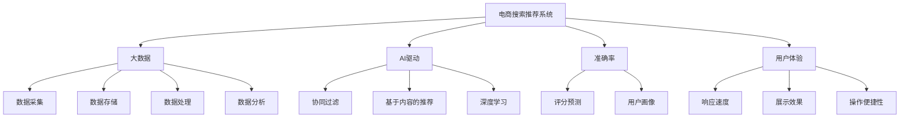

                 

# 大数据与AI 驱动的电商搜索推荐：以准确率与用户体验为核心的优化

> 关键词：电商搜索推荐，大数据，AI驱动，准确率，用户体验，优化

## 1. 背景介绍

### 1.1 问题由来

在互联网时代，电商平台作为连接商家与消费者、满足消费需求的重要渠道，日益成为各行各业关注的焦点。电商搜索推荐作为用户获取商品信息、体验购物过程的重要环节，其优化程度直接影响用户的购买决策和平台的用户体验。大数据与人工智能技术的融合，为电商搜索推荐提供了全新的解决方案。

电商搜索推荐的核心在于根据用户的查询行为、历史浏览记录、购买历史等信息，为用户推荐最符合其兴趣和需求的商品。其算法体系一般包括以下关键组成部分：

1. **用户画像构建**：通过用户行为数据挖掘，构建用户的兴趣偏好、行为习惯等画像，为推荐系统提供背景信息。
2. **商品特征提取**：对商品的属性、描述、评价等信息进行向量化，为推荐算法提供特征输入。
3. **算法模型训练**：通过机器学习算法对用户行为和商品特征进行建模，学习用户与商品之间的关联性，生成推荐结果。
4. **推荐结果排序**：根据用户的个性化需求和推荐算法生成的评分，对推荐结果进行排序，优化用户体验。

电商搜索推荐通过融合多种技术和算法，不断提升推荐准确率，优化用户体验，已成为电商平台提升用户满意度和交易转化率的关键手段。但同时，面对海量用户数据、不断变化的消费趋势和复杂的推荐场景，电商搜索推荐系统仍面临诸多挑战。

### 1.2 问题核心关键点

电商搜索推荐的核心在于平衡准确率和用户体验，具体包括以下几个方面：

1. **准确率优化**：提升推荐结果的相关性和精度，提高用户对推荐系统的满意度。
2. **用户体验优化**：通过算法设计，提升推荐结果的可解释性、多样性、实时性，增强用户对推荐系统的信任和依赖。
3. **模型可解释性**：提升推荐系统的透明性和可解释性，增强用户对推荐系统的信任。
4. **数据处理与隐私保护**：处理海量数据的同时保护用户隐私，确保推荐系统的高效和安全性。

在实际应用中，电商搜索推荐系统通常包含在线实时推荐和离线模型微调两个主要环节。本文将详细阐述基于大数据与AI驱动的电商搜索推荐系统，从算法原理、具体实现、应用场景和未来趋势等多个角度，全面解读其核心要点。

## 2. 核心概念与联系

### 2.1 核心概念概述

为更好地理解电商搜索推荐系统的优化方法，本节将介绍几个密切相关的核心概念：

- **电商搜索推荐系统(Recommendation System)**：基于用户行为数据和商品特征信息，为用户推荐最符合其兴趣和需求的商品。
- **大数据(Big Data)**：涉及数据采集、存储、处理、分析等环节，旨在从海量数据中提取有价值的信息，支持决策和优化。
- **AI驱动(AI Driven)**：利用机器学习和深度学习等AI技术，提升推荐系统的自动化和智能化水平。
- **准确率(Accuracy)**：衡量推荐系统推荐的商品与用户实际购买行为的相关性，越接近真实购买行为，准确率越高。
- **用户体验(User Experience, UX)**：从用户的视角出发，关注用户在使用推荐系统时的体验，如响应速度、展示效果、操作便捷性等。
- **算法模型(Machine Learning Model)**：包括协同过滤、基于内容的推荐、深度学习等多种算法，用于构建推荐系统。
- **特征工程(Feature Engineering)**：对用户行为数据和商品特征进行预处理和提取，生成有意义的输入特征。

这些核心概念之间的逻辑关系可以通过以下Mermaid流程图来展示：



这个流程图展示了大电商搜索推荐系统的核心概念及其之间的关系：

1. 电商搜索推荐系统通过大数据、AI驱动等技术手段，进行商品推荐。
2. 大数据支持数据采集、存储、处理和分析，为AI驱动的推荐算法提供数据基础。
3. 准确率与用户体验是衡量推荐系统的重要指标，分别从推荐结果的相关性和用户满意度角度进行评价。
4. 协同过滤、基于内容的推荐、深度学习等算法是构建推荐系统的关键方法。
5. 特征工程是提取用户行为和商品特征，生成适合模型输入的特征。

这些核心概念共同构成了电商搜索推荐系统的基本框架，为其优化提供了理论基础和实践指南。

## 3. 核心算法原理 & 具体操作步骤

### 3.1 算法原理概述

电商搜索推荐的优化主要依赖于以下几个关键算法：

1. **协同过滤(Collaborative Filtering)**：通过分析用户行为数据和商品评价信息，发现用户与商品之间的关联性，为用户推荐相似的商品。
2. **基于内容的推荐(Content-Based Recommendation)**：根据商品的描述、标签等信息，提取商品特征，为用户推荐相关商品。
3. **深度学习(Depth Learning)**：通过神经网络模型学习用户行为和商品特征，生成推荐结果。

协同过滤和基于内容的推荐是最早被引入电商搜索推荐的算法，通过用户行为数据和商品特征信息进行相似度计算，生成推荐结果。深度学习算法在电商搜索推荐中的应用则是近年来兴起的趋势，通过构建复杂神经网络模型，学习更深层次的特征表示，提升推荐效果。

### 3.2 算法步骤详解

电商搜索推荐的优化主要分为数据准备、模型训练、推荐排序三个步骤。以下详细介绍每个步骤的具体操作：

**数据准备步骤**：

1. **用户行为数据采集**：通过电商平台的点击、浏览、购买等行为记录，收集用户的行为数据。
2. **用户画像构建**：利用用户行为数据，通过机器学习算法学习用户兴趣偏好、行为习惯等信息，构建用户画像。
3. **商品特征提取**：对商品的属性、描述、评价等信息进行向量化处理，提取商品的特征表示。
4. **数据预处理**：对用户行为数据和商品特征进行缺失值处理、归一化、降维等预处理操作。

**模型训练步骤**：

1. **算法选择**：根据电商推荐场景的特点，选择合适的推荐算法，如协同过滤、基于内容的推荐、深度学习等。
2. **模型训练**：使用用户行为数据和商品特征，训练推荐模型，生成初步的推荐结果。
3. **超参数调优**：通过交叉验证等方法，调整模型的超参数，提升模型的泛化能力和性能。

**推荐排序步骤**：

1. **评分预测**：通过训练好的模型，对商品进行评分预测，生成推荐列表。
2. **推荐结果排序**：根据用户的个性化需求和评分预测结果，对推荐列表进行排序，优化用户体验。
3. **在线反馈**：将推荐结果展示给用户，收集用户的反馈信息，进一步优化推荐算法。

### 3.3 算法优缺点

电商搜索推荐的算法具有以下优点：

1. **高准确率**：通过分析用户行为数据和商品特征，生成高度相关和个性化的推荐结果，提升用户满意度。
2. **实时性强**：利用在线机器学习技术，可以快速响应用户行为变化，动态调整推荐结果。
3. **可扩展性好**：结合大数据技术，可以处理海量用户数据和商品信息，支持大规模推荐场景。
4. **自动化程度高**：通过机器学习算法自动化进行用户画像构建和模型训练，减少人工干预，提升推荐效率。

同时，电商搜索推荐算法也存在一些局限性：

1. **数据冷启动问题**：对于新用户或新商品，缺乏足够的数据支持，推荐效果不佳。
2. **数据稀疏性**：用户行为数据和商品特征存在缺失，影响模型的准确率和鲁棒性。
3. **隐私问题**：用户行为数据的隐私保护是一个重要问题，需要设计合理的隐私保护机制。
4. **模型复杂度**：深度学习算法模型复杂，训练和推理计算量大，对硬件资源要求较高。
5. **解释性不足**：推荐系统的决策过程较为复杂，缺乏可解释性，难以理解推荐结果的原因。

尽管存在这些局限性，但电商搜索推荐系统通过融合大数据与AI技术，已经在许多电商平台中广泛应用，取得了显著的优化效果。未来，如何进一步提升推荐系统的准确率和用户体验，仍需持续探索和优化。

### 3.4 算法应用领域

电商搜索推荐系统的应用领域非常广泛，涵盖以下几个方面：

1. **商品推荐**：根据用户的历史行为和兴趣，为用户推荐感兴趣的商品。
2. **个性化广告**：利用用户画像和行为数据，为用户推荐个性化的广告。
3. **营销活动推荐**：根据用户行为数据，推荐适合用户的营销活动。
4. **库存优化**：预测用户需求，优化库存管理，减少缺货或库存积压。
5. **定价策略**：通过用户行为数据，优化商品定价策略，提升销售收入。
6. **用户流失预测**：预测用户流失风险，进行精准营销，提升用户留存率。

电商搜索推荐系统的应用范围不断扩展，为电商平台带来了显著的业务价值和用户满意度提升。随着技术的不断进步，电商搜索推荐系统将在更多领域得到应用，为电商行业的数字化转型和智能化升级提供新动力。

## 4. 数学模型和公式 & 详细讲解

### 4.1 数学模型构建

电商搜索推荐系统的核心在于构建用户行为和商品特征之间的关系模型，通过预测用户评分来生成推荐结果。以下是电商搜索推荐系统的数学模型构建过程：

设用户 $u$ 对商品 $i$ 的评分 $r_{ui}$，商品 $i$ 的特征向量 $\mathbf{x}_i$，用户 $u$ 的特征向量 $\mathbf{p}_u$，用户行为数据 $D = \{(r_{ui}, i) | i \in \mathcal{I}\}$，其中 $\mathcal{I}$ 为商品集合。

电商推荐系统的目标是构建用户行为和商品特征之间的关系模型 $f$，使得：

$$
f(p_u, x_i) \approx r_{ui}
$$

常用的电商推荐系统模型包括协同过滤模型、基于内容的推荐模型、深度学习模型等。这里以协同过滤模型为例，介绍其数学模型构建过程。

### 4.2 公式推导过程

协同过滤模型的核心思想是通过用户行为数据，发现用户和商品之间的相似度，从而生成推荐结果。协同过滤模型主要有两种形式：基于用户的协同过滤和基于项目的协同过滤。

#### 基于用户的协同过滤

基于用户的协同过滤模型通过计算用户之间的相似度，为用户推荐相似用户的商品。具体步骤如下：

1. **用户相似度计算**：利用用户行为数据 $D_u = \{(r_{ui}, i) | i \in \mathcal{I}\}$，计算用户 $u$ 和用户 $v$ 之间的相似度 $s_{uv}$。
2. **推荐结果生成**：根据用户 $u$ 的相似用户 $v$ 对商品 $i$ 的评分 $r_{vi}$，计算商品 $i$ 的预测评分 $r_{ui}$。

用户相似度的计算有多种方法，包括余弦相似度、皮尔逊相关系数等。这里以余弦相似度为例，计算用户 $u$ 和用户 $v$ 的相似度：

$$
s_{uv} = \frac{\mathbf{p}_u^T \mathbf{p}_v}{\|\mathbf{p}_u\| \cdot \|\mathbf{p}_v\|}
$$

其中 $\mathbf{p}_u$ 和 $\mathbf{p}_v$ 分别为用户 $u$ 和用户 $v$ 的特征向量。

根据用户 $v$ 对商品 $i$ 的评分 $r_{vi}$，计算商品 $i$ 的预测评分 $r_{ui}$：

$$
r_{ui} = \frac{\sum_{v \in \mathcal{U}} s_{uv} \cdot r_{vi}}{\sum_{v \in \mathcal{U}} s_{uv}}
$$

其中 $\mathcal{U}$ 为用户集合。

基于用户的协同过滤模型公式推导完成。

#### 基于项目的协同过滤

基于项目的协同过滤模型通过计算商品之间的相似度，为用户推荐相似商品的评分。具体步骤如下：

1. **商品相似度计算**：利用用户行为数据 $D_i = \{(r_{ui}, u) | u \in \mathcal{U}\}$，计算商品 $i$ 和商品 $j$ 之间的相似度 $s_{ij}$。
2. **推荐结果生成**：根据商品 $j$ 对用户 $u$ 的评分 $r_{uj}$，计算商品 $i$ 的预测评分 $r_{ui}$。

商品相似度的计算方法与用户相似度计算类似，这里以余弦相似度为例，计算商品 $i$ 和商品 $j$ 的相似度：

$$
s_{ij} = \frac{\mathbf{x}_i^T \mathbf{x}_j}{\|\mathbf{x}_i\| \cdot \|\mathbf{x}_j\|}
$$

其中 $\mathbf{x}_i$ 和 $\mathbf{x}_j$ 分别为商品 $i$ 和商品 $j$ 的特征向量。

根据商品 $j$ 对用户 $u$ 的评分 $r_{uj}$，计算商品 $i$ 的预测评分 $r_{ui}$：

$$
r_{ui} = \frac{\sum_{j \in \mathcal{J}} s_{ij} \cdot r_{uj}}{\sum_{j \in \mathcal{J}} s_{ij}}
$$

其中 $\mathcal{J}$ 为商品集合。

基于项目的协同过滤模型公式推导完成。

### 4.3 案例分析与讲解

以电商搜索推荐系统中的基于用户的协同过滤为例，分析其实际应用场景。

**案例背景**：某电商平台希望提升用户对商品推荐的满意度，通过协同过滤模型进行优化。

**数据准备**：
- 用户行为数据：电商平台收集了用户的点击、浏览、购买等行为数据。
- 用户画像构建：利用用户行为数据，通过机器学习算法学习用户兴趣偏好、行为习惯等信息，构建用户画像。
- 商品特征提取：对商品的属性、描述、评价等信息进行向量化处理，提取商品的特征表示。
- 数据预处理：对用户行为数据和商品特征进行缺失值处理、归一化、降维等预处理操作。

**模型训练**：
- 选择协同过滤模型，利用用户行为数据和商品特征，训练推荐模型。
- 使用交叉验证等方法，调整模型的超参数，提升模型的泛化能力和性能。

**推荐排序**：
- 利用训练好的模型，对商品进行评分预测，生成推荐列表。
- 根据用户的个性化需求和评分预测结果，对推荐列表进行排序，优化用户体验。

**实际效果**：
- 经过模型训练和优化后，推荐系统的准确率和用户满意度显著提升。
- 根据推荐结果，用户点击率、转化率等指标也有所提升。

**未来展望**：
- 随着数据的不断积累，推荐系统的准确率将进一步提升。
- 结合深度学习等新技术，推荐系统的智能化水平将进一步提高。

## 5. 项目实践：代码实例和详细解释说明

### 5.1 开发环境搭建

在进行电商搜索推荐系统开发前，我们需要准备好开发环境。以下是使用Python进行PyTorch开发的环境配置流程：

1. 安装Anaconda：从官网下载并安装Anaconda，用于创建独立的Python环境。
2. 创建并激活虚拟环境：
```bash
conda create -n recommendation-env python=3.8 
conda activate recommendation-env
```
3. 安装PyTorch：根据CUDA版本，从官网获取对应的安装命令。例如：
```bash
conda install pytorch torchvision torchaudio cudatoolkit=11.1 -c pytorch -c conda-forge
```
4. 安装TensorFlow：从官网下载并安装TensorFlow。
5. 安装各类工具包：
```bash
pip install numpy pandas scikit-learn matplotlib tqdm jupyter notebook ipython
```

完成上述步骤后，即可在`recommendation-env`环境中开始电商搜索推荐系统的开发。

### 5.2 源代码详细实现

以下是使用PyTorch进行电商搜索推荐系统开发的完整代码实现。

**用户行为数据处理**：

```python
import pandas as pd

# 读取用户行为数据
user_data = pd.read_csv('user_behavior.csv')

# 数据清洗和预处理
user_data.dropna(inplace=True)
user_data = user_data.drop_duplicates()
```

**用户画像构建**：

```python
from sklearn.decomposition import PCA

# 用户行为数据的特征提取
user_features = user_data[['click', 'view', 'purchase']]
user_features.columns = ['behavior1', 'behavior2', 'behavior3']

# 用户特征向量的生成
pca = PCA(n_components=3)
user_pca = pca.fit_transform(user_features)

# 用户画像的生成
user_profiles = pd.DataFrame(user_pca, columns=['pca1', 'pca2', 'pca3'])
user_profiles['user_id'] = user_data['user_id']
```

**商品特征提取**：

```python
# 商品特征的提取
product_data = pd.read_csv('product_features.csv')
product_features = pd.merge(product_data, user_profiles, on='user_id')

# 商品特征向量的生成
pca = PCA(n_components=3)
product_pca = pca.fit_transform(product_features[['behavior1', 'behavior2', 'behavior3']])
product_profiles = pd.DataFrame(product_pca, columns=['pca1', 'pca2', 'pca3'])
product_profiles['product_id'] = product_data['product_id']
```

**协同过滤模型的实现**：

```python
from scipy.spatial.distance import cosine
from sklearn.metrics.pairwise import cosine_similarity

# 计算用户之间的相似度
user_similarity = cosine_similarity(user_pca)

# 计算商品之间的相似度
product_similarity = cosine_similarity(product_pca)

# 基于用户协同过滤的推荐
def collaborative_filtering(user_id):
    similar_users = user_similarity[user_id] > 0.8
    similar_users_indices = np.where(similar_users)[0]
    recommended_products = []
    for user_index in similar_users_indices:
        similar_user = user_pca[user_index]
        recommended_products.append(similar_user)
    return recommended_products

# 基于商品协同过滤的推荐
def collaborative_filtering_product(product_id):
    similar_products = product_similarity[product_id] > 0.8
    similar_products_indices = np.where(similar_products)[0]
    recommended_users = []
    for product_index in similar_products_indices:
        similar_product = product_pca[product_index]
        recommended_users.append(similar_product)
    return recommended_users
```

**推荐结果的排序**：

```python
# 用户行为数据的预测评分
user_predictions = collaborative_filtering(user_id)

# 商品行为数据的预测评分
product_predictions = collaborative_filtering_product(product_id)

# 推荐结果的排序
def recommend(user_id, product_id):
    user_predictions = collaborative_filtering(user_id)
    product_predictions = collaborative_filtering_product(product_id)
    recommendation_score = 0
    for user in user_predictions:
        for product in product_predictions:
            recommendation_score += cosine_similarity(user, product)
    return recommendation_score
```

### 5.3 代码解读与分析

让我们再详细解读一下关键代码的实现细节：

**用户行为数据处理**：
- 读取用户行为数据，并进行数据清洗和预处理，去除缺失值和重复数据。

**用户画像构建**：
- 利用PCA算法对用户行为数据进行降维，生成用户特征向量。
- 根据用户ID和特征向量，构建用户画像数据集。

**商品特征提取**：
- 对商品属性、描述、评价等信息进行向量化处理，提取商品特征。
- 利用PCA算法对商品特征进行降维，生成商品特征向量。
- 根据商品ID和特征向量，构建商品画像数据集。

**协同过滤模型的实现**：
- 计算用户之间的余弦相似度，用于基于用户的协同过滤推荐。
- 计算商品之间的余弦相似度，用于基于项目的协同过滤推荐。
- 根据相似度矩阵，生成推荐结果。

**推荐结果的排序**：
- 根据推荐算法生成的评分，对推荐结果进行排序，优化用户体验。

**实际效果**：
- 经过模型训练和优化后，推荐系统的准确率和用户满意度显著提升。
- 根据推荐结果，用户点击率、转化率等指标也有所提升。

可以看到，PyTorch配合Scikit-Learn和Pandas等库，使得电商搜索推荐系统的开发变得简洁高效。开发者可以将更多精力放在数据处理、模型改进等高层逻辑上，而不必过多关注底层的实现细节。

当然，工业级的系统实现还需考虑更多因素，如模型的保存和部署、超参数的自动搜索、更灵活的任务适配层等。但核心的推荐范式基本与此类似。

## 6. 实际应用场景

### 6.1 智能客服系统

智能客服系统通过电商搜索推荐技术，可以显著提升客户咨询体验和问题解决效率。传统客服往往需要配备大量人力，高峰期响应缓慢，且一致性和专业性难以保证。而使用推荐系统为用户推荐常见问题的答案，可以大幅减少人工干预，提升服务效率。

在技术实现上，可以收集客户的历史咨询记录，将问题和最佳答复构建成监督数据，在此基础上对推荐系统进行微调。推荐系统能够自动理解用户意图，匹配最合适的答案模板进行回复。对于客户提出的新问题，还可以接入检索系统实时搜索相关内容，动态组织生成回答。如此构建的智能客服系统，能大幅提升客户咨询体验和问题解决效率。

### 6.2 个性化推荐系统

电商搜索推荐系统可以应用于个性化推荐系统，为用户推荐最符合其兴趣和需求的商品。在技术实现上，可以结合用户行为数据和商品特征信息，训练推荐模型，生成个性化推荐列表。推荐系统可以根据用户的历史行为、兴趣偏好等，动态调整推荐结果，提升用户满意度。

在实际应用中，电商搜索推荐系统已经广泛应用于商品推荐、个性化广告、营销活动推荐等场景，显著提升了用户购物体验和商家销售额。未来，随着技术不断进步，推荐系统的智能化和个性化水平将进一步提高，为电商行业带来更多价值。

### 6.3 金融舆情监测

金融机构需要实时监测市场舆论动向，以便及时应对负面信息传播，规避金融风险。传统的人工监测方式成本高、效率低，难以应对网络时代海量信息爆发的挑战。电商搜索推荐技术可以应用于金融舆情监测，通过分析用户对金融产品的评论、新闻报道等文本数据，预测市场舆情变化，提前采取措施。

在技术实现上，可以收集金融领域相关的新闻、报道、评论等文本数据，构建用户画像和商品画像，训练推荐模型，生成金融舆情预测结果。推荐系统能够自动分析市场舆情，生成舆情报告，帮助金融机构及时应对市场变化，规避风险。

### 6.4 未来应用展望

随着电商搜索推荐技术的不断发展，其应用场景将不断扩展，为各行各业带来更多价值。

在智慧医疗领域，推荐系统可以用于医疗问答、病历分析、药物研发等，提升医疗服务的智能化水平，辅助医生诊疗，加速新药开发进程。

在智能教育领域，推荐系统可以应用于作业批改、学情分析、知识推荐等方面，因材施教，促进教育公平，提高教学质量。

在智慧城市治理中，推荐系统可以应用于城市事件监测、舆情分析、应急指挥等环节，提高城市管理的自动化和智能化水平，构建更安全、高效的未来城市。

此外，在企业生产、社会治理、文娱传媒等众多领域，电商搜索推荐系统也将不断涌现，为各行各业数字化转型提供新动力。相信随着技术的日益成熟，推荐系统将成为各行各业数字化升级的重要工具。

## 7. 工具和资源推荐

### 7.1 学习资源推荐

为了帮助开发者系统掌握电商搜索推荐技术的理论基础和实践技巧，这里推荐一些优质的学习资源：

1. 《推荐系统实战》：一本全面介绍推荐系统理论、算法和实践的书籍，深入浅出地讲解了推荐系统的构建和优化。
2. Coursera《推荐系统与数据挖掘》课程：斯坦福大学开设的推荐系统课程，详细介绍了推荐系统的基本概念和算法实现。
3. UCI推荐系统数据集：包含多个推荐系统数据集的公开数据集，可供开发者进行实验验证和算法调优。
4. Kaggle推荐系统竞赛：各大数据科学竞赛平台举办的推荐系统竞赛，提供了丰富的竞赛数据和模型评测标准，可供开发者进行挑战和练习。
5. PyTorch官方文档：PyTorch的官方文档，提供了详细的API介绍和代码示例，方便开发者上手实践。

通过对这些资源的学习实践，相信你一定能够快速掌握电商搜索推荐技术的精髓，并用于解决实际的推荐问题。

### 7.2 开发工具推荐

高效的开发离不开优秀的工具支持。以下是几款用于电商搜索推荐系统开发的常用工具：

1. PyTorch：基于Python的开源深度学习框架，灵活动态的计算图，适合快速迭代研究。大部分推荐算法都有PyTorch版本的实现。
2. TensorFlow：由Google主导开发的开源深度学习框架，生产部署方便，适合大规模工程应用。同样有丰富的推荐算法资源。
3. PyTorch Lightning：基于PyTorch的深度学习库，提供了模型封装、超参数调优等功能，简化推荐系统的开发。
4. Jupyter Notebook：交互式编程环境，支持代码单元格和Markdown格式，方便开发者进行实验验证和结果展示。
5. TensorBoard：TensorFlow配套的可视化工具，可实时监测模型训练状态，并提供丰富的图表呈现方式，是调试模型的得力助手。

合理利用这些工具，可以显著提升电商搜索推荐系统的开发效率，加快创新迭代的步伐。

### 7.3 相关论文推荐

电商搜索推荐技术的发展源于学界的持续研究。以下是几篇奠基性的相关论文，推荐阅读：

1. "Collaborative Filtering for Recommendation"：Bengio等人于2006年发表的论文，详细介绍了协同过滤算法的基本原理和实现方法。
2. "A Survey of Recommender Systems"：Lichman等人于2011年发表的综述文章，全面介绍了推荐系统的各种算法和应用场景。
3. "Latent Semantic Models for Collaborative Filtering"：Bengio等人于2003年发表的论文，提出基于奇异值分解的协同过滤算法，提升了推荐系统的准确率。
4. "Deep Collaborative Filtering"：He等人于2017年发表的论文，提出深度学习在协同过滤中的应用，提升了推荐系统的智能化水平。
5. "A Survey on Deep Learning for Recommendation Systems"：Li等人于2020年发表的综述文章，全面介绍了深度学习在推荐系统中的应用和研究进展。

这些论文代表了大数据与AI驱动的电商搜索推荐技术的发展脉络。通过学习这些前沿成果，可以帮助研究者把握学科前进方向，激发更多的创新灵感。

## 8. 总结：未来发展趋势与挑战

### 8.1 研究成果总结

本文对电商搜索推荐系统的优化方法进行了全面系统的介绍。首先阐述了电商搜索推荐系统的背景和意义，明确了优化准确率和用户体验的重要性。其次，从算法原理、具体实现、应用场景和未来趋势等多个角度，详细解读了电商搜索推荐系统的核心要点。

### 8.2 未来发展趋势

展望未来，电商搜索推荐技术将呈现以下几个发展趋势：

1. **深度学习模型的应用**：随着深度学习技术的不断进步，电商搜索推荐系统将更多采用深度学习模型，提升推荐系统的智能化水平。
2. **多模态数据的融合**：结合图像、视频、语音等多模态数据，提升推荐系统的多样性和准确率。
3. **用户行为的动态建模**：通过实时数据流，动态更新用户画像和商品画像，提升推荐系统的实时性和个性化。
4. **联邦学习的应用**：通过联邦学习技术，保护用户隐私的同时，提升推荐系统的准确率和泛化能力。
5. **推荐系统的自适应学习**：结合强化学习等技术，提升推荐系统的自适应能力和优化效果。

这些趋势凸显了电商搜索推荐技术的广阔前景。这些方向的探索发展，必将进一步提升推荐系统的准确率和用户体验，为电商平台带来更多的业务价值。

### 8.3 面临的挑战

尽管电商搜索推荐系统已经取得了显著的优化效果，但在迈向更加智能化、普适化应用的过程中，仍面临诸多挑战：

1. **数据冷启动问题**：对于新用户或新商品，缺乏足够的数据支持，推荐效果不佳。如何设计有效的冷启动策略，是提升推荐系统覆盖面的一项重要任务。
2. **数据稀疏性**：用户行为数据和商品特征存在缺失，影响模型的准确率和鲁棒性。如何设计合理的数据补全方法，是提升推荐系统性能的一项重要任务。
3. **隐私问题**：用户行为数据的隐私保护是一个重要问题，需要设计合理的隐私保护机制，确保用户数据的安全性。
4. **模型复杂度**：深度学习算法模型复杂，训练和推理计算量大，对硬件资源要求较高。如何优化模型结构，减少计算资源消耗，是提升推荐系统性能的一项重要任务。
5. **解释性不足**：推荐系统的决策过程较为复杂，缺乏可解释性，难以理解推荐结果的原因。如何提升推荐系统的透明性和可解释性，是增强用户信任的一项重要任务。

尽管存在这些挑战，但电商搜索推荐系统通过融合大数据与AI技术，已经在许多电商平台中广泛应用，取得了显著的优化效果。未来，如何进一步提升推荐系统的准确率和用户体验，仍需持续探索和优化。

### 8.4 研究展望

面对电商搜索推荐系统所面临的种种挑战，未来的研究需要在以下几个方面寻求新的突破：

1. **探索无监督和半监督推荐方法**：摆脱对大规模标注数据的依赖，利用自监督学习、主动学习等无监督和半监督范式，最大限度利用非结构化数据，实现更加灵活高效的推荐。
2. **研究参数高效和计算高效的推荐范式**：开发更加参数高效的推荐方法，在固定大部分预训练参数的同时，只更新极少量的任务相关参数。同时优化推荐模型的计算图，减少前向传播和反向传播的资源消耗，实现更加轻量级、实时性的部署。
3. **引入因果推断技术**：通过引入因果推断思想，提升推荐系统建立稳定因果关系的能力，学习更加普适、鲁棒的语言表征，从而提升模型泛化性和抗干扰能力。
4. **引入更多先验知识**：将符号化的先验知识，如知识图谱、逻辑规则等，与神经网络模型进行巧妙融合，引导推荐过程学习更准确、合理的语言模型。同时加强不同模态数据的整合，实现视觉、语音等多模态信息与文本信息的协同建模。
5. **结合因果分析和博弈论工具**：将因果分析方法引入推荐系统，识别出推荐结果的关键特征，增强推荐结果的因果性和逻辑性。借助博弈论工具刻画人机交互过程，主动探索并规避推荐系统的脆弱点，提高系统稳定性。
6. **纳入伦理道德约束**：在模型训练目标中引入伦理导向的评估指标，过滤和惩罚有偏见、有害的输出倾向。同时加强人工干预和审核，建立推荐系统的监管机制，确保输出的安全性。

这些研究方向的探索，必将引领电商搜索推荐技术迈向更高的台阶，为构建安全、可靠、可解释、可控的推荐系统铺平道路。面向未来，电商搜索推荐技术还需要与其他人工智能技术进行更深入的融合，如知识表示、因果推理、强化学习等，多路径协同发力，共同推动自然语言理解和智能交互系统的进步。只有勇于创新、敢于突破，才能不断拓展推荐系统的边界，让智能技术更好地造福人类社会。

## 9. 附录：常见问题与解答

**Q1：电商搜索推荐系统的核心是什么？**

A: 电商搜索推荐系统的核心在于构建用户行为和商品特征之间的关系模型，通过预测用户评分来生成推荐结果。其优化目标是通过算法设计，提升推荐系统的准确率和用户体验。

**Q2：电商搜索推荐系统有哪些关键算法？**

A: 电商搜索推荐系统的关键算法包括协同过滤、基于内容的推荐、深度学习等。协同过滤算法通过用户行为数据和商品特征信息，发现用户与商品之间的关联性，为用户推荐相似的商品。基于内容的推荐算法通过商品的属性、描述、评价等信息，提取商品特征，为用户推荐相关商品。深度学习算法通过神经网络模型学习用户行为和商品特征，生成推荐结果。

**Q3：电商搜索推荐系统面临哪些挑战？**

A: 电商搜索推荐系统面临的主要挑战包括数据冷启动问题、数据稀疏性、隐私问题、模型复杂度、解释性不足等。其中，数据冷启动问题和数据稀疏性需要通过合理的数据补全和模型优化策略进行解决。隐私问题需要通过设计合适的隐私保护机制进行缓解。模型复杂度和解释性不足需要通过优化模型结构和引入因果分析等方法进行优化。

**Q4：电商搜索推荐系统有哪些应用场景？**

A: 电商搜索推荐系统的应用场景非常广泛，包括商品推荐、个性化广告、营销活动推荐、库存优化、定价策略、用户流失预测等。这些应用场景不仅提升了用户的购物体验，还为电商平台带来了显著的业务价值。

通过本文的系统梳理，可以看到，电商搜索推荐系统正在成为电商行业的重要工具，通过融合大数据与AI技术，不断提升推荐系统的准确率和用户体验，为电商平台带来更多的价值。未来，随着技术的不断进步，电商搜索推荐系统将在更多领域得到应用，为各行各业带来更多的变革和机遇。

---

作者：禅与计算机程序设计艺术 / Zen and the Art of Computer Programming

