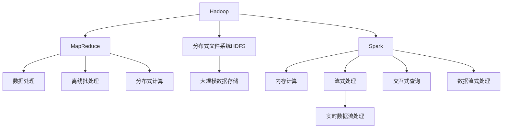

                 

# 大数据分析：Hadoop 和 Spark

> 关键词：大数据, 分布式计算, Hadoop, Spark, 数据处理, 数据仓库, 机器学习, 数据挖掘, 流式处理

## 1. 背景介绍

### 1.1 问题由来
随着互联网的快速发展，人类每天产生的数据量呈指数级增长。据统计，全球数据总量已经达到了40ZB（1ZB=10万TB）。面对如此巨大的数据规模，传统的集中式数据处理方式显得力不从心。因此，人们迫切需要一种能够高效、灵活地处理海量数据的新技术，这就是大数据分析。

大数据分析（Big Data Analytics）是利用先进的数据处理和分析技术，从海量数据中挖掘出有价值的信息和知识的过程。其中，Hadoop和Spark是大数据分析领域的两大技术框架，通过分布式计算、流式处理等技术，实现了高效、可靠的数据处理和分析。

### 1.2 问题核心关键点
Hadoop和Spark分别采用了不同的架构设计和实现技术，以适应不同的数据处理需求。Hadoop更侧重于大规模离线批处理任务，而Spark则通过内存计算和流式处理技术，实现了高效的数据流式处理和交互式查询。

两者之间的联系在于它们都是分布式计算框架，旨在处理大规模数据集，通过分布式存储和计算的方式，避免了单机的计算瓶颈，提升了数据处理的效率和可靠性。

## 2. 核心概念与联系

### 2.1 核心概念概述

为更好地理解Hadoop和Spark，本节将介绍几个密切相关的核心概念：

- Hadoop：一个分布式计算框架，支持大规模数据处理，包括分布式文件系统HDFS和分布式计算框架MapReduce。
- Spark：一个基于内存的分布式计算框架，支持批处理、流处理、交互式查询等多种计算模型，通过DAG调度引擎实现了高效的内存计算。
- MapReduce：一种编程模型，通过Map和Reduce两个阶段实现分布式数据处理，适合大规模批处理任务。
- 数据仓库：一个集成了大规模数据的存储和管理系统，支持数据查询、分析和决策支持。
- 机器学习和数据挖掘：利用大数据技术进行模型训练和知识发现，支持预测分析和模式识别等应用。
- 流式处理：实时数据处理技术，支持数据的实时采集、存储和分析，适用于数据流的在线分析。

这些核心概念之间的逻辑关系可以通过以下Mermaid流程图来展示：



这个流程图展示了大数据分析中的核心概念及其之间的关系：

1. Hadoop通过MapReduce支持大规模离线批处理任务，利用HDFS实现数据分布式存储。
2. Spark则支持多种计算模型，包括内存计算和流式处理，实现了高效的数据处理和交互式查询。
3. 数据仓库和机器学习、数据挖掘技术是大数据分析的主要应用场景。
4. 流式处理技术支持实时数据流分析，是Spark的重要应用方向之一。

## 3. 核心算法原理 & 具体操作步骤
### 3.1 算法原理概述

Hadoop和Spark的算法原理主要围绕分布式计算和内存计算展开，通过并行计算和多级调度实现高效的数据处理。

Hadoop的MapReduce模型是基于函数式编程的，将数据处理任务分解为Map和Reduce两个阶段。在Map阶段，对输入数据进行局部处理和映射；在Reduce阶段，对Map阶段输出的中间结果进行汇总和归约。这种分而治之的策略，使得Hadoop能够处理大规模的数据集，适合离线批处理任务。

Spark则通过内存计算和DAG调度引擎，实现了高效的计算性能。Spark将中间数据存放在内存中，减少了磁盘I/O操作，从而提高了数据处理的效率。此外，Spark还支持流式处理、交互式查询等多种计算模型，能够满足不同数据处理的需求。

### 3.2 算法步骤详解

Hadoop的MapReduce步骤详解：

1. **Map阶段**：
   - 输入数据被分块，每个块分配给一个Map任务处理。
   - 每个Map任务将输入数据中的键值对映射为若干新的键值对，并进行局部排序。
   - Map任务的输出结果被合并，形成中间结果。

2. **Shuffle阶段**：
   - 中间结果按照键进行分区，并将相同键的值分配给同一个Reduce任务处理。
   - 同一个键的不同值会通过网络传输，分配给对应的Reduce任务。

3. **Reduce阶段**：
   - 每个Reduce任务对相应键的值进行归约，生成最终的输出结果。

Spark的内存计算步骤详解：

1. **RDD（弹性分布式数据集）创建**：
   - 通过HDFS或本地文件系统加载数据，创建RDD对象。
   - 对RDD进行转换（如Map、Filter、Join等）和操作（如GroupByKey、ReduceByKey等）。

2. **内存计算**：
   - Spark将中间结果存放在内存中，通过快速读写操作提高数据处理效率。
   - 当内存不足时，Spark会将中间结果存储到磁盘上，继续计算。

3. **DAG调度引擎**：
   - Spark通过DAG调度引擎，将多个计算任务组织成有向无环图（DAG）。
   - 通过优化DAG图，将计算任务并行执行，提高计算效率。

### 3.3 算法优缺点

Hadoop和Spark各有优缺点，具体如下：

Hadoop的优点：
1. 适用于大规模离线批处理任务。
2. 数据存储在HDFS上，可靠性高，可扩展性强。
3. 开源社区活跃，生态系统成熟。

Hadoop的缺点：
1. 计算延迟高，不适合实时数据处理。
2. 数据加载和处理效率较低。
3. 节点资源利用率低。

Spark的优点：
1. 支持多种计算模型，包括内存计算和流式处理。
2. 数据处理速度快，延迟低。
3. 支持交互式查询和机器学习等高级应用。

Spark的缺点：
1. 内存计算需要大量内存，对硬件资源要求高。
2. 计算任务需要预加载到内存中，不适用于海量数据。
3. 开源社区相对较小，生态系统不够成熟。

### 3.4 算法应用领域

Hadoop和Spark在大数据分析领域有广泛的应用，具体如下：

1. **数据仓库**：
   - Hadoop用于大规模数据的ETL（Extract, Transform, Load）处理。
   - Spark用于实时数据仓库构建，支持交互式查询和OLAP（Online Analytical Processing）操作。

2. **流式处理**：
   - Hadoop的Storm、Flink等流式处理框架，支持实时数据流处理。
   - Spark的Streaming模块，支持实时数据流处理，适用于需要实时分析的业务场景。

3. **机器学习**：
   - Hadoop用于大规模数据预处理和特征工程。
   - Spark用于机器学习模型的训练和优化，支持分布式机器学习。

4. **大数据挖掘**：
   - Hadoop用于大规模数据集的分析挖掘。
   - Spark用于实时数据流挖掘，支持复杂的交互式查询和分析。

## 4. 数学模型和公式 & 详细讲解
### 4.1 数学模型构建

在本节中，我们将通过数学语言对Hadoop和Spark的数据处理过程进行严格的刻画。

假设有一个大规模数据集 $D=\{(x_i,y_i)\}_{i=1}^N$，其中 $x_i$ 为输入数据，$y_i$ 为输出标签。

在Hadoop的MapReduce模型中，将数据集 $D$ 进行划分，每个分块分配给一个Map任务处理。假设Map函数为 $f(x)$，则每个Map任务输出 $(f(x_1),f(x_2),...,f(x_m))$，其中 $m$ 为Map任务的输出数量。

在Shuffle阶段，将相同键的值分配给同一个Reduce任务处理。假设Reduce函数为 $g(f(x_1),f(x_2),...,f(x_m))$，则每个Reduce任务输出 $(g(f(x_1),f(x_2),...,f(x_m))$。

最终，所有Reduce任务的输出合并，形成最终的输出结果。

在Spark的内存计算中，假设数据集 $D$ 被划分为多个分区，每个分区分配给一个计算任务处理。假设计算任务为 $h(x)$，则每个计算任务输出 $(h(x_1),h(x_2),...,h(x_n))$，其中 $n$ 为计算任务的输出数量。

Spark通过DAG调度引擎，将多个计算任务组织成有向无环图（DAG），并优化DAG图以提高计算效率。

### 4.2 公式推导过程

假设Map函数为 $f(x)$，Reduce函数为 $g(f(x_1),f(x_2),...,f(x_m))$。

在MapReduce模型中，输入数据集 $D=\{(x_i,y_i)\}_{i=1}^N$ 经过Map函数处理，得到中间结果 $R_1=\{(f(x_i),y_i)\}_{i=1}^M$，其中 $M$ 为Map任务的输出数量。

在Shuffle阶段，将中间结果 $R_1$ 按照键进行分区，得到 $R_2=\{(f(x_{i_1}),y_{i_1}),(f(x_{i_2}),y_{i_2}),...,(f(x_{i_m}),y_{i_m})\}_{i=1}^N$。

在Reduce阶段，将相同键的值分配给同一个Reduce任务处理，得到最终输出结果 $R_3=\{(g(f(x_{i_1}),f(x_{i_2}),...,f(x_{i_m})),y_i\}_{i=1}^N$。

在Spark的内存计算中，假设数据集 $D=\{(x_i,y_i)\}_{i=1}^N$ 被划分为多个分区，每个分区分配给一个计算任务处理，得到中间结果 $R_1=\{(h(x_i),y_i)\}_{i=1}^N$。

Spark通过DAG调度引擎，将多个计算任务组织成有向无环图（DAG），并优化DAG图以提高计算效率。最终得到最终输出结果 $R_3=\{(h(x_i),y_i)\}_{i=1}^N$。

### 4.3 案例分析与讲解

下面以一个简单的数据处理为例，说明Hadoop和Spark的处理过程：

假设有一个文本数据集 $D=\{(x_i,y_i)\}_{i=1}^N$，其中 $x_i$ 为文本数据，$y_i$ 为标签。

在Hadoop的MapReduce模型中，Map函数为 $f(x)=(k,v)$，其中 $k$ 为键，$v$ 为值。假设Map函数将文本数据转换为键值对 $(word,1)$，则每个Map任务输出 $(f(x_1),f(x_2),...,f(x_m))$。

在Shuffle阶段，将相同键的值分配给同一个Reduce任务处理，得到最终输出结果。

在Spark的内存计算中，假设计算任务为 $h(x)=(k,v)$。假设计算任务将文本数据转换为键值对 $(word,1)$，则每个计算任务输出 $(h(x_1),h(x_2),...,h(x_n))$。

Spark通过DAG调度引擎，将多个计算任务组织成有向无环图（DAG），并优化DAG图以提高计算效率。最终得到最终输出结果。

## 5. 项目实践：代码实例和详细解释说明
### 5.1 开发环境搭建

在进行Hadoop和Spark开发前，我们需要准备好开发环境。以下是使用Linux搭建Hadoop和Spark环境的步骤：

1. 安装Java开发环境（JDK）：
```bash
sudo apt-get update
sudo apt-get install openjdk-8-jdk
```

2. 安装Hadoop：
```bash
wget http://archive.apache.org/dist/hadoop-2.7.2/hadoop-2.7.2.tar.gz
tar -xzf hadoop-2.7.2.tar.gz
cd hadoop-2.7.2
bin/hadoop-version
```

3. 安装Spark：
```bash
wget http://spark.apache.org/downloads/spark-3.0.0.tgz
tar -xzf spark-3.0.0.tgz
cd spark-3.0.0
bin/spark-version
```

4. 配置Hadoop和Spark环境：
```bash
vi hadoop-env.sh
vi hdfs-site.xml
vi yarn-site.xml
vi core-site.xml
vi mapred-site.xml
vi spark-env.sh
vi spark-defaults.conf
```

5. 启动Hadoop和Spark服务：
```bash
bin/start-hadoop.sh
bin/start-standalone.sh
```

完成上述步骤后，即可在Linux环境中开始Hadoop和Spark的开发实践。

### 5.2 源代码详细实现

下面我们以Hadoop的MapReduce框架和Spark的RDD计算框架为例，给出基于Python的代码实现。

Hadoop的MapReduce示例代码：

```python
from mrjob.job import MRJob

class MRWordCount(MRJob):
    def mapper(self, _, line):
        for word in line.split():
            yield (word, 1)

    def reducer(self, word, counts):
        yield (word, sum(counts))

    def steps(self):
        return [self.mr(mapper=self.mapper, reducer=self.reducer)]
```

Spark的RDD示例代码：

```python
from pyspark import SparkContext
from pyspark import SparkConf

conf = SparkConf().setAppName("WordCount")
sc = SparkContext(conf=conf)

rdd = sc.textFile("hdfs://localhost:9000/user/hadoop/input")
wordCounts = rdd.flatMap(lambda line: line.split()) \
                   .map(lambda word: (word, 1)) \
                   .reduceByKey(lambda a, b: a + b)

wordCounts.saveAsTextFile("hdfs://localhost:9000/user/hadoop/output")
```

以上代码实现了对文本数据的MapReduce处理和Spark的RDD处理，分别输出了单词频次统计结果。

### 5.3 代码解读与分析

让我们再详细解读一下关键代码的实现细节：

Hadoop的MapReduce示例代码：

```python
from mrjob.job import MRJob

class MRWordCount(MRJob):
    def mapper(self, _, line):
        for word in line.split():
            yield (word, 1)

    def reducer(self, word, counts):
        yield (word, sum(counts))

    def steps(self):
        return [self.mr(mapper=self.mapper, reducer=self.reducer)]
```

- `MRJob`：提供了MapReduce编程的框架，支持Python的map和reduce函数。
- `mapper`函数：将输入数据分割成键值对，每个键对应一个Map任务，每个值对应一个Reduce任务。
- `reducer`函数：对Map任务输出的中间结果进行归约，生成最终的输出结果。
- `steps`函数：返回MapReduce任务的执行步骤。

Spark的RDD示例代码：

```python
from pyspark import SparkContext
from pyspark import SparkConf

conf = SparkConf().setAppName("WordCount")
sc = SparkContext(conf=conf)

rdd = sc.textFile("hdfs://localhost:9000/user/hadoop/input")
wordCounts = rdd.flatMap(lambda line: line.split()) \
                   .map(lambda word: (word, 1)) \
                   .reduceByKey(lambda a, b: a + b)

wordCounts.saveAsTextFile("hdfs://localhost:9000/user/hadoop/output")
```

- `SparkConf`：用于配置Spark的运行环境。
- `SparkContext`：用于创建Spark的计算环境。
- `textFile`函数：从HDFS读取文本数据。
- `flatMap`函数：将输入数据分割成多个键值对，每个键对应一个Map任务，每个值对应一个Reduce任务。
- `map`函数：将Map任务输出的中间结果映射为新的键值对。
- `reduceByKey`函数：对Map任务输出的中间结果进行归约，生成最终的输出结果。
- `saveAsTextFile`函数：将输出结果保存到HDFS。

## 6. 实际应用场景
### 6.1 智能客服系统

智能客服系统是大数据分析的重要应用场景之一。通过Hadoop和Spark的数据处理和分析技术，可以将客服对话数据进行实时分析和处理，提升客服系统的智能化水平。

具体而言，可以将客服对话数据存储在HDFS上，利用Hadoop和Spark进行数据分析和挖掘，识别出常见的客服问题，生成智能回答模板，提升客服系统的自动回复能力。

### 6.2 金融舆情监测

金融舆情监测是大数据分析的重要应用场景之一。通过Hadoop和Spark的数据处理和分析技术，可以实时监测金融市场的舆情变化，及时发现异常情况，保障金融安全。

具体而言，可以将金融新闻、社交媒体等文本数据存储在HDFS上，利用Hadoop和Spark进行情感分析和文本挖掘，识别出金融市场的情感倾向，生成舆情报告，帮助金融分析师进行决策支持。

### 6.3 个性化推荐系统

个性化推荐系统是大数据分析的重要应用场景之一。通过Hadoop和Spark的数据处理和分析技术，可以实现对用户行为数据的实时分析和挖掘，提升推荐系统的个性化水平。

具体而言，可以将用户的行为数据存储在HDFS上，利用Hadoop和Spark进行数据分析和挖掘，识别出用户的兴趣偏好，生成个性化推荐结果，提升推荐系统的精准度。

### 6.4 未来应用展望

随着Hadoop和Spark技术的不断发展，大数据分析将在更多领域得到应用，为各行各业带来变革性影响。

在智慧医疗领域，通过Hadoop和Spark的数据处理和分析技术，可以实现对医疗数据的实时分析和挖掘，提升医疗系统的智能化水平，辅助医生进行疾病诊断和治疗。

在智能教育领域，通过Hadoop和Spark的数据处理和分析技术，可以实现对学生行为数据的实时分析和挖掘，提升教育系统的个性化水平，因材施教，促进教育公平。

在智慧城市治理中，通过Hadoop和Spark的数据处理和分析技术，可以实现对城市数据（如交通、环境、公共安全等）的实时分析和挖掘，提升城市管理的自动化和智能化水平，构建更安全、高效的未来城市。

此外，在企业生产、社会治理、文娱传媒等众多领域，基于Hadoop和Spark的大数据分析技术也将不断涌现，为传统行业数字化转型升级提供新的技术路径。

## 7. 工具和资源推荐
### 7.1 学习资源推荐

为了帮助开发者系统掌握Hadoop和Spark的理论基础和实践技巧，这里推荐一些优质的学习资源：

1. Hadoop官方文档：提供了详细的Hadoop开发和配置指南，是Hadoop开发的必备参考资料。
2. Spark官方文档：提供了详细的Spark开发和配置指南，是Spark开发的必备参考资料。
3. Hadoop权威指南（原书第3版）：系统介绍了Hadoop的原理和应用，适合深入学习和实践。
4. Spark快速上手：介绍了Spark的快速入门和高级应用，适合快速上手Spark开发。
5. Hadoop和Spark实战：介绍了Hadoop和Spark在实际项目中的应用案例，适合学习和借鉴。

通过对这些资源的学习实践，相信你一定能够快速掌握Hadoop和Spark的理论基础和实践技巧，并用于解决实际的NLP问题。

### 7.2 开发工具推荐

高效的开发离不开优秀的工具支持。以下是几款用于Hadoop和Spark开发的常用工具：

1. Hadoop：用于分布式文件系统HDFS和分布式计算框架MapReduce。
2. Spark：用于内存计算、流式处理、交互式查询等多种计算模型。
3. Hive：用于Hadoop的SQL接口，支持数据查询和处理。
4. HBase：用于Hadoop的NoSQL数据库，支持大规模数据的存储和查询。
5. Flume：用于Hadoop的数据采集和传输工具，支持实时数据的收集和处理。
6. Kafka：用于Hadoop的数据流处理和消息队列，支持大规模数据的实时处理。

合理利用这些工具，可以显著提升Hadoop和Spark的开发效率，加快创新迭代的步伐。

### 7.3 相关论文推荐

Hadoop和Spark的研究源于学界的持续研究。以下是几篇奠基性的相关论文，推荐阅读：

1. The Hadoop Distributed File System（HDFS论文）：提出了Hadoop的分布式文件系统HDFS，奠定了Hadoop在大数据处理中的应用基础。
2. MapReduce: Simplified Data Processing on Large Clusters：介绍了MapReduce编程模型，奠定了Hadoop和Spark的分布式计算基础。
3. Spark: Cluster Computing with Fault Tolerance（Spark论文）：提出了Spark的内存计算和DAG调度引擎，奠定了Spark在大数据处理中的应用基础。
4. Spark SQL: A Spark Lean Data Processing Library（Spark SQL论文）：介绍了Spark的SQL接口和数据处理能力，拓展了Spark的应用场景。
5. Spark Streaming: Micro-Batching with Fault Tolerance（Spark Streaming论文）：介绍了Spark的流式处理能力，拓展了Spark的应用场景。

这些论文代表了大数据分析技术的演进脉络。通过学习这些前沿成果，可以帮助研究者把握学科前进方向，激发更多的创新灵感。

## 8. 总结：未来发展趋势与挑战

### 8.1 总结

本文对Hadoop和Spark在大数据分析中的应用进行了全面系统的介绍。首先阐述了大数据分析的背景和意义，明确了Hadoop和Spark在大数据分析中的核心作用。其次，从原理到实践，详细讲解了Hadoop和Spark的算法原理和具体操作步骤，给出了Hadoop和Spark的代码实现。同时，本文还广泛探讨了Hadoop和Spark在大数据处理中的应用场景，展示了其巨大的应用潜力。此外，本文精选了Hadoop和Spark的学习资源和开发工具，力求为读者提供全方位的技术指引。

通过本文的系统梳理，可以看到，Hadoop和Spark作为大数据分析的重要技术框架，通过分布式计算和内存计算等技术，实现了高效、可靠的数据处理和分析，为大数据应用提供了强大的技术支持。未来，伴随Hadoop和Spark技术的持续演进，大数据分析必将在更多领域得到应用，为各行各业带来变革性影响。

### 8.2 未来发展趋势

展望未来，Hadoop和Spark在大数据分析领域将呈现以下几个发展趋势：

1. 计算性能持续提升。随着硬件技术的进步和算法优化，Hadoop和Spark的计算性能将持续提升，支持更大规模的数据处理。
2. 实时处理能力增强。随着流式处理技术的完善，Hadoop和Spark的实时处理能力将不断增强，支持更多实时数据的应用场景。
3. 生态系统不断丰富。随着Hadoop和Spark社区的壮大，生态系统将不断丰富，更多的新技术、新工具将被引入到大数据分析中。
4. 融合多模态数据。随着多模态数据融合技术的进展，Hadoop和Spark将支持更多类型的数据处理和分析，拓展其应用范围。
5. 引入AI技术。随着AI技术的发展，Hadoop和Spark将引入更多AI技术，提升其智能化水平，支持更复杂的分析和决策。

以上趋势凸显了Hadoop和Spark在大数据分析中的广阔前景。这些方向的探索发展，必将进一步提升大数据分析的效率和效果，为各行各业带来更大的价值。

### 8.3 面临的挑战

尽管Hadoop和Spark在大数据分析领域已经取得了显著成就，但在迈向更加智能化、普适化应用的过程中，它们仍面临着诸多挑战：

1. 数据规模和复杂性不断增长。随着数据规模的不断增长，Hadoop和Spark需要不断优化和改进，以支持更大规模和更复杂的数据处理。
2. 计算资源和成本问题。大规模数据处理需要大量计算资源，高昂的计算成本也是亟待解决的问题。
3. 数据安全和隐私保护。随着数据量的增大，数据安全和隐私保护问题变得更加严峻，需要引入更多技术手段进行保护。
4. 系统管理和运维难度。Hadoop和Spark的集群管理和运维难度较大，需要更高的技术和管理水平。
5. 系统兼容性和互操作性。不同系统之间的兼容性和互操作性问题需要进一步解决，以支持更复杂的应用场景。

正视Hadoop和Spark面临的这些挑战，积极应对并寻求突破，将是大数据分析技术走向成熟的必由之路。相信随着学界和产业界的共同努力，这些挑战终将一一被克服，Hadoop和Spark必将在构建智能数据分析系统方面发挥更大的作用。

### 8.4 研究展望

面对Hadoop和Spark在大数据分析技术面临的挑战，未来的研究需要在以下几个方面寻求新的突破：

1. 优化分布式计算架构。通过优化MapReduce和DAG调度引擎，提升Hadoop和Spark的计算性能和系统稳定性。
2. 引入内存计算和流式处理技术。通过引入内存计算和流式处理技术，提升Hadoop和Spark的实时处理能力。
3. 引入多模态数据融合技术。通过引入多模态数据融合技术，拓展Hadoop和Spark的数据处理范围和能力。
4. 引入AI技术。通过引入AI技术，提升Hadoop和Spark的智能化水平，支持更复杂的分析和决策。
5. 引入数据安全和隐私保护技术。通过引入数据安全和隐私保护技术，保障数据安全和隐私保护。

这些研究方向的探索，必将引领Hadoop和Spark在大数据分析技术迈向更高的台阶，为构建智能数据分析系统铺平道路。面向未来，Hadoop和Spark还需要与其他大数据技术进行更深入的融合，如NoSQL数据库、数据湖等，多路径协同发力，共同推动大数据分析技术的进步。只有勇于创新、敢于突破，才能不断拓展大数据分析的边界，让智能数据技术更好地造福人类社会。

## 9. 附录：常见问题与解答

**Q1：Hadoop和Spark在大数据分析中分别有什么优势？**

A: Hadoop的优势在于其强大的分布式文件系统和批处理能力，适合大规模离线批处理任务。Spark则通过内存计算和流式处理技术，实现了高效的数据处理和实时分析。

**Q2：Hadoop和Spark在开发环境搭建上有什么不同？**

A: Hadoop的开发环境搭建相对简单，主要依赖Linux系统，需要安装Hadoop和HDFS等组件。Spark的开发环境搭建相对复杂，需要安装Spark和Hadoop等组件，并进行环境配置。

**Q3：Hadoop和Spark在数据处理上有什么不同？**

A: Hadoop适合大规模离线批处理任务，利用MapReduce模型实现数据的并行处理。Spark则通过内存计算和DAG调度引擎，实现了高效的数据处理和实时分析。

**Q4：Hadoop和Spark在大数据应用中各有什么典型案例？**

A: Hadoop的典型应用场景包括数据仓库、企业数据湖、ETL处理等。Spark的典型应用场景包括流式处理、实时数据分析、交互式查询、机器学习等。

**Q5：Hadoop和Spark在实际应用中各有哪些挑战？**

A: Hadoop的挑战在于数据规模和复杂性不断增长，计算资源和成本问题以及系统兼容性和互操作性问题。Spark的挑战在于内存计算需要大量内存，实时处理能力有限，以及数据安全和隐私保护问题。

通过以上问题的解答，相信你对Hadoop和Spark的理论和实践有了更全面的理解，并能够在实际应用中更好地使用它们。

---

作者：禅与计算机程序设计艺术 / Zen and the Art of Computer Programming

