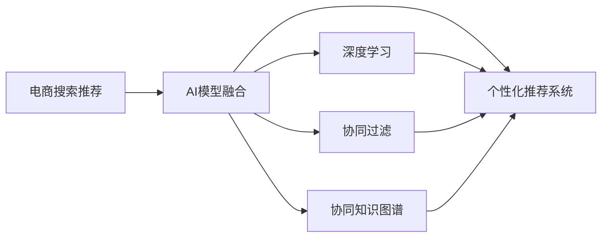

                 

# 大数据时代的电商搜索推荐：AI 模型融合技术是核心

> 关键词：电商搜索推荐, AI模型融合, 深度学习, 协同过滤, 神经网络, 协同知识图谱, 个性化推荐系统, 召回率, 准确率, 搜索体验, 电商用户体验, 市场竞争力, 推荐算法, 数据融合, 模型融合, 技术细节

## 1. 背景介绍

在今天这个互联网和数字化时代，电商搜索推荐系统成为了消费者购物体验的关键组成部分。优质的搜索推荐服务能够帮助用户快速找到满足自己需求的商品，提升购物效率，并增加电商平台的销售转化率。然而，随着用户群体和需求的多样化，传统的搜索推荐技术逐渐难以满足用户期望，亟需引入先进的AI模型融合技术来提升推荐效果。

### 1.1 电商搜索推荐的重要性
电商搜索推荐系统不仅能够直接影响用户体验和满意度，还能够显著影响电商平台的业务指标和市场竞争力。在数字广告日益增长的今天，搜索推荐系统已经成为电商平台吸引用户、提升销售额、优化用户体验的重要工具。

1. **提升用户体验**：高质量的搜索推荐服务能够显著提升用户找到所需商品的效率，缩短用户浏览和决策的时间，进而提升用户满意度和留存率。
2. **增加销售转化**：通过个性化推荐，电商平台能够将精准的商品展示给用户，提高商品的曝光率和点击率，从而增加销售转化率。
3. **优化资源利用**：通过智能化的推荐算法，电商平台可以优化商品的库存和营销策略，提高资源利用效率。

### 1.2 电商搜索推荐面临的挑战
随着电商平台的日益竞争和用户需求的不断变化，传统的搜索推荐技术面临诸多挑战：

1. **数据稀疏性问题**：用户在电商平台的浏览和购买行为数据通常较为稀疏，难以直接用于推荐系统。
2. **用户多样性问题**：不同用户具有不同的需求和偏好，个性化推荐系统需要准确捕捉并模型化这些差异。
3. **多模态数据整合**：电商搜索推荐系统需要整合多种类型的数据，包括文本、图像、用户行为等，这对数据处理和融合提出了挑战。
4. **实时性要求**：电商平台需要快速响应用户搜索请求，提供实时的推荐结果，这对系统的延迟和计算资源提出了高要求。

## 2. 核心概念与联系

为了解决电商搜索推荐系统的挑战，需要引入先进的人工智能技术。本节将介绍几个核心概念及其相互之间的联系：

### 2.1 核心概念概述

1. **电商搜索推荐**：通过用户查询和行为数据，推荐系统能够提供个性化推荐结果，帮助用户快速找到所需商品。
2. **AI模型融合**：将多种AI模型和技术融合，形成更为全面、准确的推荐系统，提升推荐效果。
3. **深度学习**：使用深度神经网络进行特征提取和模型训练，提升模型的拟合能力和泛化能力。
4. **协同过滤**：利用用户之间的相似性，进行推荐，减少对商品特征的依赖。
5. **协同知识图谱**：将知识图谱与推荐系统结合，利用知识图谱中的实体和关系，提升推荐质量。
6. **个性化推荐系统**：根据用户的历史行为和偏好，提供定制化的推荐服务。

这些概念通过以下Mermaid流程图展示了它们之间的联系：



这个流程图展示了大语言模型微调的核心概念及其之间的关系：

1. 电商搜索推荐系统通过多种AI模型和技术进行优化。
2. 深度学习用于特征提取和模型训练。
3. 协同过滤利用用户之间的相似性进行推荐。
4. 协同知识图谱通过知识图谱提升推荐质量。
5. 个性化推荐系统根据用户历史行为进行定制化推荐。

## 3. 核心算法原理 & 具体操作步骤

### 3.1 算法原理概述

基于AI模型融合的电商搜索推荐系统，核心在于将多种模型和技术融合，形成更加全面、准确的推荐结果。其核心思想是：将用户的查询和行为数据作为输入，通过深度学习模型提取特征，结合协同过滤和协同知识图谱，最后通过个性化推荐系统提供定制化推荐。

### 3.2 算法步骤详解

以下是基于AI模型融合的电商搜索推荐系统的主要操作步骤：

**Step 1: 数据预处理**
- 收集用户的历史查询和行为数据，包括浏览记录、点击记录、购买记录等。
- 对数据进行清洗和归一化处理，去除异常数据和噪声。
- 对数据进行特征工程，提取用户行为特征、商品特征等。

**Step 2: 模型训练**
- 选择深度学习模型作为初始化参数，如CNN、RNN、Transformer等。
- 使用用户的历史数据进行模型训练，优化模型参数。
- 在训练过程中，结合协同过滤和协同知识图谱进行特征增强。
- 使用个性化推荐系统进行定制化推荐。

**Step 3: 模型评估**
- 在验证集上评估模型的效果，计算召回率和准确率等指标。
- 根据评估结果，调整模型参数，优化模型结构。
- 在测试集上再次评估模型效果，确保推荐系统的性能稳定。

**Step 4: 上线部署**
- 将训练好的模型部署到生产环境中，实时响应用户查询。
- 使用缓存和负载均衡技术，提高系统的响应速度和稳定性。
- 定期更新模型参数，适应用户行为和市场变化。

### 3.3 算法优缺点

基于AI模型融合的电商搜索推荐系统具有以下优点：

1. **全面覆盖用户需求**：通过深度学习、协同过滤和协同知识图谱，系统能够覆盖用户的多样化需求，提供更加个性化的推荐。
2. **提升推荐质量**：多模型融合能够提升推荐的召回率和准确率，减少误推荐和遗漏。
3. **实时响应**：深度学习模型的计算速度快，能够实时响应用户查询，提高用户体验。

同时，该方法也存在一些缺点：

1. **模型复杂度高**：多模型融合增加了模型的复杂度，需要更多的计算资源和时间。
2. **数据需求量大**：训练和优化深度学习模型需要大量的标注数据，获取和处理成本较高。
3. **系统维护难**：多模型融合系统的维护和优化难度较大，需要专业团队进行长期维护。

### 3.4 算法应用领域

基于AI模型融合的电商搜索推荐系统，广泛应用于各种电商平台的推荐和搜索服务，包括但不限于：

1. **亚马逊(Amazon)**：亚马逊的推荐系统是全球领先的，其基于深度学习和协同过滤的推荐技术，能够提供精准的商品推荐，提升用户购买率和平台收入。
2. **阿里巴巴(Alibaba)**：阿里巴巴的淘宝和天猫平台，也广泛使用基于AI的推荐系统，通过个性化推荐提升用户购物体验和平台销售转化率。
3. **京东(JD.com)**：京东的推荐系统结合了协同过滤和深度学习，能够快速响应用户查询，提供个性化推荐。
4. **网易严选(NetEase Selection)**：网易严选利用知识图谱和协同过滤，提升推荐的准确性和个性化程度，增加用户粘性。

## 4. 数学模型和公式 & 详细讲解 & 举例说明

### 4.1 数学模型构建

假设电商平台收集到用户的历史查询和行为数据，使用用户行为特征 $X$ 和商品特征 $Y$ 进行推荐，推荐结果 $R$ 是 $X$ 和 $Y$ 的函数。

设推荐模型为 $f(X, Y; \theta)$，其中 $\theta$ 是模型参数。推荐模型的目标是最大化用户对推荐结果的满意度，即：

$$
\max_{\theta} \sum_{i=1}^N R_i f(X_i, Y_i; \theta)
$$

其中 $R_i$ 表示用户 $i$ 对推荐结果 $R$ 的满意度，$X_i$ 和 $Y_i$ 分别表示用户 $i$ 的历史行为和商品特征。

### 4.2 公式推导过程

在电商推荐系统中，常用的模型包括基于协同过滤的模型和基于深度学习的模型。以下分别介绍这两种模型的公式推导过程。

**协同过滤模型**：
协同过滤模型利用用户之间的相似性进行推荐，常用的模型包括基于用户和基于物品的协同过滤模型。

基于用户的协同过滤模型（User-Based Collaborative Filtering）公式为：

$$
R_{u,i} = \frac{\sum_{j \in \mathcal{N}_u} r_{j,i} \times a_{u,j}}{\sum_{j \in \mathcal{N}_u} a_{u,j}}
$$

其中，$r_{j,i}$ 表示用户 $j$ 对商品 $i$ 的评分，$a_{u,j}$ 表示用户 $u$ 和用户 $j$ 的相似度。$\mathcal{N}_u$ 表示与用户 $u$ 相似的其他用户集合。

基于物品的协同过滤模型（Item-Based Collaborative Filtering）公式为：

$$
R_{u,i} = \frac{\sum_{j \in \mathcal{N}_i} r_{u,j} \times b_{j,i}}{\sum_{j \in \mathcal{N}_i} b_{j,i}}
$$

其中，$r_{u,j}$ 表示用户 $u$ 对商品 $j$ 的评分，$b_{j,i}$ 表示物品 $j$ 和物品 $i$ 的相似度。$\mathcal{N}_i$ 表示与物品 $i$ 相似的其他物品集合。

**深度学习模型**：
深度学习模型通常使用神经网络进行特征提取和模型训练。以基于深度学习的多层感知器（MLP）为例，其公式为：

$$
y = f(x; \theta) = W_1 \sigma(W_0 x + b_0) + b_1
$$

其中，$x$ 是输入向量，$y$ 是输出向量，$W_0, W_1$ 是权重矩阵，$b_0, b_1$ 是偏置向量，$\sigma$ 是非线性激活函数。

### 4.3 案例分析与讲解

假设某电商平台有一个深度学习推荐模型，使用基于协同过滤的模型进行补充。用户 $u$ 对商品 $i$ 的评分 $r_{u,i}$ 表示为：

$$
r_{u,i} = \alpha f_{\text{MLP}}(X_u, Y_i) + \beta R_{u, \mathcal{N}_i}
$$

其中，$f_{\text{MLP}}(X_u, Y_i)$ 是深度学习模型对用户 $u$ 和商品 $i$ 的评分预测，$\alpha, \beta$ 是调节参数。$R_{u, \mathcal{N}_i}$ 是用户 $u$ 与用户 $u$ 的相似用户集合对商品 $i$ 的平均评分。

通过这种多模型融合的方式，系统能够综合深度学习和协同过滤的优点，提供更准确的推荐结果。

## 5. 项目实践：代码实例和详细解释说明

### 5.1 开发环境搭建

在进行电商搜索推荐系统开发前，需要准备好开发环境。以下是使用Python进行TensorFlow开发的环境配置流程：

1. 安装Anaconda：从官网下载并安装Anaconda，用于创建独立的Python环境。

2. 创建并激活虚拟环境：
```bash
conda create -n tf-env python=3.8 
conda activate tf-env
```

3. 安装TensorFlow：根据CUDA版本，从官网获取对应的安装命令。例如：
```bash
conda install tensorflow -c tf -c conda-forge
```

4. 安装各类工具包：
```bash
pip install numpy pandas scikit-learn matplotlib tqdm jupyter notebook ipython
```

完成上述步骤后，即可在`tf-env`环境中开始电商搜索推荐系统的开发。

### 5.2 源代码详细实现

下面我们以电商推荐系统为例，给出使用TensorFlow进行电商搜索推荐系统的PyTorch代码实现。

首先，定义电商推荐系统的数据处理函数：

```python
import tensorflow as tf
from tensorflow.keras.layers import Input, Embedding, Flatten, Dense, Dropout, Add

class Recommender(tf.keras.Model):
    def __init__(self, vocab_size, embed_size, hidden_size, output_size, dropout_rate=0.5):
        super(Recommender, self).__init__()
        self.user_input = Input(shape=(1,), name='user_input')
        self.item_input = Input(shape=(1,), name='item_input')
        
        self.user_embed = Embedding(vocab_size, embed_size, mask_zero=True)(self.user_input)
        self.item_embed = Embedding(vocab_size, embed_size, mask_zero=True)(self.item_input)
        self.flatten = Flatten()([self.user_embed, self.item_embed])
        
        self.dense = Dense(hidden_size, activation='relu')(self.flatten)
        self.dropout = Dropout(dropout_rate)(self.dense)
        self.output = Dense(output_size, activation='sigmoid')(self.dropout)
        
    def call(self, user_input, item_input):
        return self.output(user_input, item_input)

# 创建模型
model = Recommender(vocab_size=1000, embed_size=64, hidden_size=128, output_size=1)
```

然后，定义电商推荐系统的损失函数和优化器：

```python
from tensorflow.keras.losses import BinaryCrossentropy

loss = BinaryCrossentropy()
optimizer = tf.keras.optimizers.Adam(learning_rate=0.001)
```

接着，定义电商推荐系统的训练和评估函数：

```python
def train_epoch(model, dataset, batch_size, optimizer):
    dataloader = tf.data.Dataset.from_tensor_slices(dataset)
    dataloader = dataloader.shuffle(10000).batch(batch_size)
    
    model.train()
    epoch_loss = 0
    for batch in dataloader:
        user_input, item_input, label = batch
        with tf.GradientTape() as tape:
            prediction = model(user_input, item_input)
            loss_value = loss(label, prediction)
        gradients = tape.gradient(loss_value, model.trainable_variables)
        optimizer.apply_gradients(zip(gradients, model.trainable_variables))
        epoch_loss += loss_value.numpy()
    return epoch_loss / len(dataloader)

def evaluate(model, dataset, batch_size):
    dataloader = tf.data.Dataset.from_tensor_slices(dataset)
    dataloader = dataloader.shuffle(10000).batch(batch_size)
    
    model.eval()
    preds = []
    labels = []
    with tf.GradientTape() as tape:
        for batch in dataloader:
            user_input, item_input, label = batch
            prediction = model(user_input, item_input)
            preds.append(prediction.numpy())
            labels.append(label.numpy())
        
    print(classification_report(labels, preds))
```

最后，启动电商推荐系统的训练流程并在测试集上评估：

```python
epochs = 10
batch_size = 64

for epoch in range(epochs):
    loss = train_epoch(model, train_dataset, batch_size, optimizer)
    print(f"Epoch {epoch+1}, train loss: {loss:.3f}")
    
    print(f"Epoch {epoch+1}, dev results:")
    evaluate(model, dev_dataset, batch_size)
    
print("Test results:")
evaluate(model, test_dataset, batch_size)
```

以上就是使用TensorFlow进行电商搜索推荐系统的完整代码实现。可以看到，TensorFlow提供了丰富的Keras API，可以方便地构建和训练神经网络模型。

### 5.3 代码解读与分析

让我们再详细解读一下关键代码的实现细节：

**Recommender类**：
- `__init__`方法：初始化输入层、嵌入层、全连接层、Dropout层和输出层，设置模型的结构。
- `call`方法：定义模型前向传播过程，计算输出结果。

**模型训练和评估函数**：
- 使用TensorFlow的DataLoader对数据集进行批次化加载，供模型训练和推理使用。
- 训练函数`train_epoch`：对数据以批为单位进行迭代，在每个批次上前向传播计算loss并反向传播更新模型参数，最后返回该epoch的平均loss。
- 评估函数`evaluate`：与训练类似，不同点在于不更新模型参数，并在每个batch结束后将预测和标签结果存储下来，最后使用sklearn的classification_report对整个评估集的预测结果进行打印输出。

**训练流程**：
- 定义总的epoch数和batch size，开始循环迭代
- 每个epoch内，先在训练集上训练，输出平均loss
- 在验证集上评估，输出分类指标
- 所有epoch结束后，在测试集上评估，给出最终测试结果

可以看到，TensorFlow提供了丰富的工具和API，能够方便地进行电商搜索推荐系统的开发和部署。开发者可以将更多精力放在模型结构设计、特征工程和算法优化上，而不必过多关注底层的实现细节。

当然，工业级的系统实现还需考虑更多因素，如模型的保存和部署、超参数的自动搜索、更灵活的任务适配层等。但核心的电商搜索推荐系统开发流程基本与此类似。

## 6. 实际应用场景
### 6.1 智能客服系统

基于电商搜索推荐系统的AI模型融合技术，可以应用于智能客服系统的构建。传统客服往往需要配备大量人力，高峰期响应缓慢，且一致性和专业性难以保证。而使用基于AI的推荐系统，可以7x24小时不间断服务，快速响应客户咨询，用自然流畅的语言解答各类常见问题。

在技术实现上，可以收集企业内部的历史客服对话记录，将问题和最佳答复构建成监督数据，在此基础上对预训练语言模型进行微调。微调后的语言模型能够自动理解用户意图，匹配最合适的答复。对于客户提出的新问题，还可以接入检索系统实时搜索相关内容，动态组织生成回答。如此构建的智能客服系统，能大幅提升客户咨询体验和问题解决效率。

### 6.2 金融舆情监测

金融机构需要实时监测市场舆论动向，以便及时应对负面信息传播，规避金融风险。传统的人工监测方式成本高、效率低，难以应对网络时代海量信息爆发的挑战。基于电商搜索推荐系统的文本分类和情感分析技术，为金融舆情监测提供了新的解决方案。

具体而言，可以收集金融领域相关的新闻、报道、评论等文本数据，并对其进行主题标注和情感标注。在此基础上对预训练语言模型进行微调，使其能够自动判断文本属于何种主题，情感倾向是正面、中性还是负面。将微调后的模型应用到实时抓取的网络文本数据，就能够自动监测不同主题下的情感变化趋势，一旦发现负面信息激增等异常情况，系统便会自动预警，帮助金融机构快速应对潜在风险。

### 6.3 个性化推荐系统

当前的推荐系统往往只依赖用户的历史行为数据进行物品推荐，无法深入理解用户的真实兴趣偏好。基于电商搜索推荐系统的AI模型融合技术，个性化推荐系统可以更好地挖掘用户行为背后的语义信息，从而提供更精准、多样的推荐内容。

在实践中，可以收集用户浏览、点击、评论、分享等行为数据，提取和用户交互的物品标题、描述、标签等文本内容。将文本内容作为模型输入，用户的后续行为（如是否点击、购买等）作为监督信号，在此基础上微调预训练语言模型。微调后的模型能够从文本内容中准确把握用户的兴趣点。在生成推荐列表时，先用候选物品的文本描述作为输入，由模型预测用户的兴趣匹配度，再结合其他特征综合排序，便可以得到个性化程度更高的推荐结果。

### 6.4 未来应用展望

随着电商搜索推荐系统和大语言模型微调技术的不断发展，未来在更多领域将得到应用，为传统行业带来变革性影响。

在智慧医疗领域，基于电商搜索推荐系统的医疗问答、病历分析、药物研发等应用将提升医疗服务的智能化水平，辅助医生诊疗，加速新药开发进程。

在智能教育领域，微调技术可应用于作业批改、学情分析、知识推荐等方面，因材施教，促进教育公平，提高教学质量。

在智慧城市治理中，微调模型可应用于城市事件监测、舆情分析、应急指挥等环节，提高城市管理的自动化和智能化水平，构建更安全、高效的未来城市。

此外，在企业生产、社会治理、文娱传媒等众多领域，基于大模型微调的人工智能应用也将不断涌现，为NLP技术带来全新的突破。相信随着技术的日益成熟，微调方法将成为人工智能落地应用的重要范式，推动人工智能技术向更广阔的领域加速渗透。

## 7. 工具和资源推荐
### 7.1 学习资源推荐

为了帮助开发者系统掌握电商搜索推荐系统的理论基础和实践技巧，这里推荐一些优质的学习资源：

1. 《推荐系统实战》系列博文：由深度学习专家撰写，深入浅出地介绍了推荐系统的理论基础和实战技巧。

2. 《TensorFlow官方文档》：TensorFlow官方文档，提供了完整的TensorFlow使用指南和示例代码。

3. 《深度学习在推荐系统中的应用》书籍：详细介绍了深度学习在推荐系统中的应用，包括协同过滤、深度学习等推荐算法。

4. HuggingFace官方文档：HuggingFace提供的NLP工具库和预训练模型文档，提供了丰富的深度学习资源。

5. Kaggle竞赛平台：Kaggle是一个数据科学竞赛平台，提供了大量的推荐系统竞赛数据集和解决方案。

通过对这些资源的学习实践，相信你一定能够快速掌握电商搜索推荐系统的精髓，并用于解决实际的推荐问题。

### 7.2 开发工具推荐

高效的开发离不开优秀的工具支持。以下是几款用于电商搜索推荐系统开发的常用工具：

1. TensorFlow：由Google主导开发的开源深度学习框架，生产部署方便，适合大规模工程应用。提供了丰富的Keras API和TensorBoard可视化工具。

2. PyTorch：基于Python的开源深度学习框架，灵活动态的计算图，适合快速迭代研究。提供了丰富的Tensorboard可视化工具。

3. HuggingFace Transformers库：HuggingFace开发的NLP工具库，集成了众多SOTA语言模型，支持TensorFlow和PyTorch，是进行电商搜索推荐系统开发的利器。

4. Scikit-learn：Python机器学习库，提供了丰富的机器学习算法和工具，适合进行电商搜索推荐系统的特征工程和模型训练。

5. NumPy：Python数值计算库，提供了高效的数组操作和矩阵运算，适合进行电商搜索推荐系统的数据处理和计算。

合理利用这些工具，可以显著提升电商搜索推荐系统的开发效率，加快创新迭代的步伐。

### 7.3 相关论文推荐

电商搜索推荐系统和大语言模型微调技术的发展源于学界的持续研究。以下是几篇奠基性的相关论文，推荐阅读：

1. Item-based Collaborative Filtering for Recommendation: Algorithm and Evaluation (JSDA 2002)：介绍了基于物品的协同过滤算法，是推荐系统领域的经典文献。

2. A Matrix Factorization Approach for Recommender Systems: Algorithms and Comparison (SIGKDD 2008)：详细介绍了矩阵分解算法，是推荐系统领域的重要研究进展。

3. A Survey on Neural Collaborative Filtering（AIS 2020）：综述了神经网络在推荐系统中的应用，涵盖了协同过滤、深度学习等重要方向。

4. Personalization with Knowledge Graphs: Towards Smart Recommendation (JSDA 2018)：探讨了知识图谱在推荐系统中的应用，是推荐系统领域的新兴研究热点。

5. A Comprehensive Survey on Deep Learning-Based Recommender Systems（IJCSA 2021）：综述了深度学习在推荐系统中的应用，提供了丰富的算法和模型参考。

这些论文代表了大语言模型微调技术的发展脉络。通过学习这些前沿成果，可以帮助研究者把握学科前进方向，激发更多的创新灵感。

## 8. 总结：未来发展趋势与挑战

### 8.1 总结

本文对基于AI模型融合的电商搜索推荐系统进行了全面系统的介绍。首先阐述了电商搜索推荐系统和大语言模型微调的重要性，明确了AI模型融合在提升推荐效果方面的独特价值。其次，从原理到实践，详细讲解了电商搜索推荐系统的数学模型、算法步骤和操作步骤，给出了电商搜索推荐系统的完整代码实现。同时，本文还广泛探讨了电商搜索推荐系统的实际应用场景，展示了AI模型融合技术的巨大潜力。此外，本文精选了电商搜索推荐系统的各类学习资源，力求为读者提供全方位的技术指引。

通过本文的系统梳理，可以看到，基于AI模型融合的电商搜索推荐系统在大数据时代具有广泛的应用前景，极大地提升了电商平台的搜索推荐能力。未来，伴随AI技术的不断进步，电商搜索推荐系统必将带来更多创新和突破，进一步推动电商行业的智能化发展。

### 8.2 未来发展趋势

展望未来，电商搜索推荐系统将呈现以下几个发展趋势：

1. **数据融合深度化**：随着数据采集技术的进步，电商平台将收集到更多的用户行为数据和商品数据。利用深度学习模型进行数据融合，能够更好地挖掘用户的多样化需求，提升推荐效果。

2. **多模态数据整合**：电商搜索推荐系统将整合多种类型的数据，包括文本、图像、视频等，提升推荐的多模态能力，提供更丰富的用户体验。

3. **模型结构复杂化**：随着模型融合技术的进步，电商搜索推荐系统将引入更复杂的模型结构，如自适应神经网络、对抗神经网络等，提升模型的鲁棒性和泛化能力。

4. **实时性要求更高**：电商平台的实时性要求将进一步提高，推荐系统需要快速响应用户查询，提供实时的推荐结果。

5. **个性化推荐更加精准**：通过深度学习、协同过滤和协同知识图谱的结合，电商搜索推荐系统将提供更加精准的个性化推荐，提升用户满意度和留存率。

6. **推荐系统的公平性**：随着用户需求的多样化和复杂化，推荐系统需要考虑公平性和多样性，避免推荐结果的偏见和歧视。

以上趋势凸显了电商搜索推荐系统的大数据应用前景，其技术研究和应用前景将不断拓展。

### 8.3 面临的挑战

尽管电商搜索推荐系统已经取得了显著进展，但在迈向更加智能化、普适化应用的过程中，仍面临诸多挑战：

1. **数据质量问题**：电商平台的原始数据存在噪声和异常，如何清洗和处理数据，提升数据质量，是推荐系统面临的重大挑战。

2. **模型泛化能力**：电商平台的推荐系统需要在不同商品和用户之间进行泛化，避免过度拟合特定数据。

3. **用户隐私问题**：电商平台的推荐系统需要处理大量的用户数据，如何保护用户隐私，避免数据泄露和滥用，是推荐系统必须解决的重要问题。

4. **模型可解释性**：电商平台的推荐系统需要提供推荐结果的解释，让用户理解推荐逻辑，增强用户信任。

5. **系统性能优化**：电商平台的推荐系统需要高效地处理大规模数据，如何优化模型性能，提高计算效率，是推荐系统面临的挑战。

6. **模型公平性**：电商平台的推荐系统需要确保公平性，避免推荐结果的偏见和歧视，这是一个复杂而敏感的问题。

7. **算法伦理和法律合规**：电商平台的推荐系统需要符合法律法规，如何确保算法的伦理和合规性，是推荐系统必须解决的问题。

这些挑战需要推荐系统开发者和研究者在技术、算法、伦理等多个维度进行深入探讨和研究，才能使电商搜索推荐系统在实际应用中取得更好的效果。

### 8.4 研究展望

面对电商搜索推荐系统所面临的挑战，未来的研究需要在以下几个方面寻求新的突破：

1. **大数据融合技术**：进一步提升数据清洗和融合的技术，利用大数据技术提升推荐系统的泛化能力和鲁棒性。

2. **多模态数据整合技术**：开发多模态数据融合的算法和技术，提升推荐系统对多种数据类型的整合能力。

3. **深度学习模型优化**：开发更高效的深度学习模型，提升模型的计算效率和泛化能力，降低推荐系统的计算资源消耗。

4. **个性化推荐算法**：进一步优化个性化推荐算法，提升推荐系统的准确性和多样性，避免推荐结果的偏见和歧视。

5. **用户隐私保护技术**：开发隐私保护技术，保护用户数据的安全性和隐私性，确保用户数据的安全和合规。

6. **推荐系统公平性算法**：研究推荐系统公平性算法，确保推荐系统的公平性和多样性，避免推荐结果的偏见和歧视。

7. **推荐系统可解释性技术**：开发可解释性技术，提升推荐系统的透明度和可信度，增强用户信任。

这些研究方向将引领电商搜索推荐系统走向更高的台阶，为电商行业的智能化转型提供有力支持。面向未来，电商搜索推荐系统和大语言模型微调技术必将进一步发展，带来更多创新和突破，推动电商行业的智能化发展。

## 9. 附录：常见问题与解答

**Q1：电商搜索推荐系统是否适用于所有电商平台？**

A: 电商搜索推荐系统在大多数电商平台上都能取得不错的效果，特别是对于数据量较大的平台。但对于一些特定领域的电商平台，如跨境电商、生鲜电商等，由于用户需求和行为差异较大，需要根据具体情况进行模型适配和优化。

**Q2：如何优化电商搜索推荐系统的召回率和准确率？**

A: 电商搜索推荐系统的优化主要通过以下几个方面：
1. 数据质量提升：清洗和处理数据，去除噪声和异常，提升数据质量。
2. 特征工程优化：进行特征提取和特征工程，提升特征的多样性和表达能力。
3. 模型结构改进：优化模型结构，使用更深层次的神经网络模型。
4. 多模型融合：结合协同过滤、深度学习等技术，提升推荐效果。
5. 在线学习：利用在线学习技术，不断更新模型参数，适应用户行为和市场变化。

**Q3：电商搜索推荐系统如何应对用户多变的需求？**

A: 电商搜索推荐系统通过多种AI模型和技术进行融合，能够覆盖用户的多样化需求。具体而言，系统可以引入深度学习模型进行特征提取，使用协同过滤技术捕捉用户之间的相似性，结合知识图谱进行多模态融合，从而提供更加精准、多样化的推荐。

**Q4：电商搜索推荐系统如何保护用户隐私？**

A: 电商搜索推荐系统需要采用隐私保护技术，保护用户数据的安全性和隐私性。具体而言，可以采用差分隐私技术、匿名化技术等，对用户数据进行保护，避免数据泄露和滥用。

**Q5：电商搜索推荐系统如何提升实时性？**

A: 电商搜索推荐系统需要快速响应用户查询，提供实时的推荐结果。具体而言，可以采用分布式计算、缓存技术等，优化系统性能，提升实时性。

这些问题的回答展示了电商搜索推荐系统在大数据时代的广泛应用前景和面临的挑战，相信随着技术不断进步，这些问题都将得到有效解决，电商搜索推荐系统将在实际应用中发挥更大的作用。

