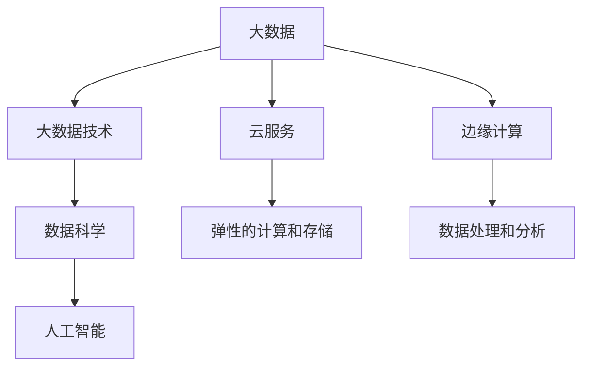

                 

# 大数据时代：人类计算的机遇与挑战

在信息化高度发展的今天，大数据作为新一代信息技术的基石，正在深刻改变着社会的方方面面。它不仅改变了人们的生产生活方式，还引发了社会治理、科技创新、商业决策等诸多领域的变革。大数据时代，人类计算的机遇与挑战并存，本文将对大数据的特征、应用及其对社会的影响进行深入剖析，探讨其在各个领域的机遇与挑战，旨在为人类社会的可持续发展提供有益参考。

## 1. 背景介绍

### 1.1 问题由来

大数据时代的来临，离不开互联网技术的飞速发展和数据量的爆炸式增长。21世纪以来，全球数据量呈现指数级增长，每年都在突破新的记录。这种数据的激增主要归因于以下几个方面：

- **信息技术的普及**：智能手机、物联网等设备的普及，使得数据采集和传输更加便捷。
- **互联网应用的深入**：社交媒体、电子商务、在线教育等互联网应用，产生了大量的交互数据。
- **数据存储技术的进步**：数据中心、云存储技术的不断进步，使得海量数据的存储和处理变得更加可行。
- **人工智能技术的推动**：机器学习、深度学习等AI技术的进步，极大地提升了数据的利用效率。

这些因素共同作用，催生了大数据时代的到来。大数据不仅带来了数据量的激增，更带来了数据类型的丰富化和数据获取方式的便捷化，为各行各业带来了前所未有的机遇。

### 1.2 问题核心关键点

面对大数据的机遇与挑战，核心问题可以归结为以下几点：

- **数据质量管理**：如何保证数据的质量、准确性和时效性，是数据管理的核心挑战。
- **数据存储与处理**：如何高效存储和管理大规模数据，并从中提取有价值的信息，是大数据应用的关键。
- **数据隐私与安全**：大数据的广泛应用，带来了数据隐私和安全的重大挑战。
- **数据伦理与法律**：数据的采集、存储和使用，需要符合伦理和法律要求，确保社会公正。
- **数据驱动的决策**：如何利用大数据技术进行科学的决策，是大数据应用的核心目标。

对这些问题的深入探讨，有助于我们更全面地理解大数据时代的机遇与挑战。

## 2. 核心概念与联系

### 2.1 核心概念概述

为更好地理解大数据时代的技术范式，本节将介绍几个密切相关的核心概念：

- **大数据**：指无法在传统数据处理技术（如数据库、数据挖掘工具等）有效处理的数据集合。通常具有数据量大、类型多样、价值密度低等特征。
- **大数据技术**：包括数据采集、存储、处理、分析、可视化等技术和工具，旨在高效管理和分析大规模数据。
- **数据科学**：以数据为驱动的科学研究范式，通过数据挖掘、机器学习等技术，从数据中提取知识和洞见。
- **人工智能**：以数据为基础，利用机器学习、深度学习等技术，模拟人类智能，实现智能决策和自动化任务。
- **云服务**：利用云计算技术，提供弹性的计算、存储和网络服务，支持大规模数据处理和分析。
- **边缘计算**：将数据处理和分析任务分布在数据源附近的网络边缘设备上，减少数据传输成本，提升数据处理效率。

这些核心概念之间的逻辑关系可以通过以下Mermaid流程图来展示：



这个流程图展示了大数据技术、数据科学、人工智能等概念之间的相互关系：

1. 大数据通过大数据技术，被高效管理和分析。
2. 数据科学和大数据技术共同驱动人工智能的发展。
3. 云服务和边缘计算为大规模数据处理提供了必要的技术支持。

这些概念共同构成了大数据时代的核心技术框架，为各行各业提供了全新的数据驱动决策范式。

## 3. 核心算法原理 & 具体操作步骤

### 3.1 算法原理概述

大数据时代，数据科学和人工智能技术的应用无处不在。本文将重点介绍数据科学中的核心算法原理，并探讨其在实践中的应用步骤。

数据科学的核心算法包括：
- **数据清洗与预处理**：去除噪声和缺失值，确保数据的完整性和准确性。
- **特征工程**：选择和构造最具代表性的特征，提升模型的预测能力。
- **模型训练与评估**：选择合适的模型，利用训练数据进行模型训练，并用测试数据评估模型性能。
- **模型优化**：调整模型参数，提升模型准确性和泛化能力。

这些算法的应用，使得数据科学家可以从大规模数据中提取有价值的洞见，为决策提供科学依据。

### 3.2 算法步骤详解

以下是数据科学中典型算法的基本步骤：

1. **数据清洗与预处理**：
    - **数据收集**：从不同的数据源收集数据。
    - **数据清洗**：去除重复、缺失、异常值，确保数据质量。
    - **数据转换**：将原始数据转换为模型可接受的格式。
    - **特征选择**：选择最具代表性和区分度的特征。
    - **特征构造**：通过计算、统计等方法构造新的特征。

2. **特征工程**：
    - **特征提取**：从原始数据中提取出有意义的特征。
    - **特征归一化**：将特征缩放到相同的范围内，提高模型的稳定性。
    - **特征选择**：选择最具代表性和区分度的特征。
    - **特征降维**：将高维特征转换为低维特征，减少模型复杂度。

3. **模型训练与评估**：
    - **模型选择**：选择合适的模型，如线性回归、决策树、随机森林等。
    - **模型训练**：利用训练数据训练模型，调整模型参数。
    - **模型评估**：利用测试数据评估模型性能，选择最优模型。

4. **模型优化**：
    - **超参数调优**：调整模型的超参数，提升模型性能。
    - **模型融合**：将多个模型进行融合，提升模型的泛化能力。
    - **模型选择**：选择最优模型，应用于实际问题。

### 3.3 算法优缺点

数据科学和人工智能技术在应用中具有以下优点：
- **自动化决策**：能够自动化处理和分析大量数据，提升决策效率。
- **数据驱动**：通过数据分析和建模，实现科学决策。
- **泛化能力强**：通过模型训练和优化，提升模型的泛化能力。

同时，也存在一些缺点：
- **数据质量要求高**：数据质量和处理精度直接影响模型性能。
- **模型复杂度高**：模型构建和调优过程复杂，需要大量时间和资源。
- **依赖于算法选择**：模型性能受算法选择影响较大，不同算法适用于不同场景。

### 3.4 算法应用领域

大数据和人工智能技术的应用领域非常广泛，以下列举几个典型应用场景：

1. **医疗健康**：通过大数据分析，提升疾病诊断、治疗方案制定等医疗决策的准确性和科学性。
2. **金融服务**：利用数据科学进行风险评估、欺诈检测、个性化推荐等金融应用。
3. **零售电商**：通过客户行为数据分析，优化商品推荐、库存管理、营销策略等。
4. **智能制造**：通过设备数据监测和分析，提升生产效率和质量控制。
5. **智慧城市**：通过城市交通、能源、环境等数据，提升城市治理和公共服务。
6. **科学研究**：利用大数据和人工智能技术进行科学研究，加速知识发现和创新。

## 4. 数学模型和公式 & 详细讲解 & 举例说明

### 4.1 数学模型构建

在数据科学中，常用的数学模型包括线性回归、决策树、支持向量机等。以下以线性回归模型为例，构建数据科学的基本数学模型。

线性回归模型假设数据服从线性关系，即：

$$ y = \theta_0 + \sum_{i=1}^n \theta_i x_i $$

其中，$y$ 为因变量，$x_i$ 为自变量，$\theta_i$ 为模型参数，$\theta_0$ 为截距项。

### 4.2 公式推导过程

线性回归模型的目标是最小化预测误差，即：

$$ \min_{\theta} \sum_{i=1}^N (y_i - \hat{y}_i)^2 $$

其中 $\hat{y}_i = \theta_0 + \sum_{i=1}^n \theta_i x_{i,i}$ 为模型的预测值。

通过最小二乘法，可以得到参数 $\theta_i$ 的最优解：

$$ \theta_i = \frac{\sum_{i=1}^N (x_i y_i)}{\sum_{i=1}^N x_i^2} $$

该公式展示了线性回归模型的参数求解过程，利用训练数据集中的自变量和因变量，计算出模型参数。

### 4.3 案例分析与讲解

假设有一个房价预测模型，需要预测某个区域的房价。使用线性回归模型进行建模，数据集包含历史房价和房屋面积、地理位置等特征。模型训练和评估步骤如下：

1. **数据预处理**：对数据进行清洗、归一化处理。
2. **特征选择**：选择最具代表性和区分度的特征，如房屋面积、地理位置等。
3. **模型训练**：利用历史房价和特征数据，进行线性回归模型训练。
4. **模型评估**：利用测试数据评估模型性能，计算均方误差等指标。
5. **模型优化**：通过调整模型参数，提升模型预测精度。

最终，得到的线性回归模型可以用于预测新区域的房价。

## 5. 项目实践：代码实例和详细解释说明

### 5.1 开发环境搭建

在进行数据科学项目实践前，我们需要准备好开发环境。以下是使用Python进行PyTorch开发的环境配置流程：

1. 安装Anaconda：从官网下载并安装Anaconda，用于创建独立的Python环境。
2. 创建并激活虚拟环境：
```bash
conda create -n pytorch-env python=3.8 
conda activate pytorch-env
```
3. 安装PyTorch：根据CUDA版本，从官网获取对应的安装命令。例如：
```bash
conda install pytorch torchvision torchaudio cudatoolkit=11.1 -c pytorch -c conda-forge
```
4. 安装Transformers库：
```bash
pip install transformers
```
5. 安装各类工具包：
```bash
pip install numpy pandas scikit-learn matplotlib tqdm jupyter notebook ipython
```

完成上述步骤后，即可在`pytorch-env`环境中开始项目实践。

### 5.2 源代码详细实现

下面我们以房价预测项目为例，给出使用PyTorch进行线性回归模型的PyTorch代码实现。

```python
import torch
import torch.nn as nn
import torch.optim as optim
from sklearn.datasets import load_boston
from sklearn.model_selection import train_test_split
from sklearn.preprocessing import StandardScaler
from sklearn.metrics import mean_squared_error

# 加载数据集
boston = load_boston()
X = boston.data
y = boston.target

# 数据集分割
X_train, X_test, y_train, y_test = train_test_split(X, y, test_size=0.2, random_state=42)

# 数据预处理
scaler = StandardScaler()
X_train = scaler.fit_transform(X_train)
X_test = scaler.transform(X_test)

# 构建模型
class LinearRegression(nn.Module):
    def __init__(self, input_dim):
        super(LinearRegression, self).__init__()
        self.linear = nn.Linear(input_dim, 1)
        
    def forward(self, x):
        return self.linear(x)
    
# 训练模型
model = LinearRegression(X_train.shape[1])
criterion = nn.MSELoss()
optimizer = optim.SGD(model.parameters(), lr=0.01)

num_epochs = 100
for epoch in range(num_epochs):
    optimizer.zero_grad()
    outputs = model(X_train)
    loss = criterion(outputs, y_train)
    loss.backward()
    optimizer.step()
    
    if (epoch+1) % 10 == 0:
        val_outputs = model(X_test)
        val_loss = criterion(val_outputs, y_test)
        print(f"Epoch: {epoch+1}, Loss: {loss.item():.4f}, Val Loss: {val_loss.item():.4f}")
        
# 模型评估
val_outputs = model(X_test)
mse = mean_squared_error(y_test, val_outputs)
print(f"Mean Squared Error: {mse:.4f}")
```

以上代码展示了从数据预处理、模型构建到训练和评估的完整流程。在代码中，我们使用了PyTorch和Scikit-learn等库，展示了数据科学项目开发的常用工具和技术。

### 5.3 代码解读与分析

让我们再详细解读一下关键代码的实现细节：

**数据预处理**：
- 加载波士顿房价数据集，使用sklearn的`load_boston`函数。
- 数据集分割，使用`train_test_split`函数，将数据集划分为训练集和测试集。
- 数据标准化，使用`StandardScaler`对特征数据进行标准化处理，确保数据在相同尺度上。

**模型构建**：
- 定义线性回归模型，继承`nn.Module`，定义线性层。
- 在`forward`方法中，前向传播计算模型输出。

**模型训练**：
- 初始化模型和优化器。
- 循环训练，计算损失并反向传播更新模型参数。
- 每隔10个epoch，在测试集上评估模型性能。

**模型评估**：
- 在测试集上评估模型性能，计算均方误差。

可以看出，数据科学项目开发的基本流程包括数据预处理、模型构建、训练和评估等步骤。通过合理选择算法和工具，可以高效地实现模型训练和评估。

## 6. 实际应用场景

### 6.1 医疗健康

大数据和人工智能技术在医疗健康领域的应用，可以帮助医生进行精准诊疗，提升医疗服务质量和效率。例如，通过分析大量电子病历数据，可以发现疾病的关联性，提升诊断准确性；通过分析患者行为数据，可以进行个性化治疗，提升治疗效果。

具体而言，可以通过以下步骤实现：
- **数据收集**：收集电子病历、实验室检查结果、基因数据等医疗数据。
- **数据清洗与预处理**：去除噪声、缺失值，标准化数据。
- **特征选择**：选择最具代表性和区分度的特征，如病历记录、基因特征等。
- **模型训练与评估**：利用训练数据训练模型，并利用测试数据评估模型性能。
- **模型优化**：通过调整模型参数，提升模型预测精度。

最终，得到的模型可以用于疾病诊断、治疗方案制定等医疗决策。

### 6.2 金融服务

金融行业对大数据和人工智能技术的需求尤为强烈。利用大数据分析，可以进行风险评估、欺诈检测、信用评分等金融应用。

具体而言，可以通过以下步骤实现：
- **数据收集**：收集交易记录、用户行为数据、市场行情等金融数据。
- **数据清洗与预处理**：去除噪声、缺失值，标准化数据。
- **特征选择**：选择最具代表性和区分度的特征，如交易金额、用户行为等。
- **模型训练与评估**：利用训练数据训练模型，并利用测试数据评估模型性能。
- **模型优化**：通过调整模型参数，提升模型预测精度。

最终，得到的模型可以用于风险评估、欺诈检测、信用评分等金融决策。

### 6.3 零售电商

大数据和人工智能技术在零售电商领域的应用，可以帮助企业进行精准营销、库存管理、个性化推荐等。通过分析客户行为数据，可以发现客户的偏好和购买行为，提升营销效果；通过分析销售数据，可以进行库存优化，降低库存成本。

具体而言，可以通过以下步骤实现：
- **数据收集**：收集用户行为数据、交易记录、产品评价等电商数据。
- **数据清洗与预处理**：去除噪声、缺失值，标准化数据。
- **特征选择**：选择最具代表性和区分度的特征，如用户行为、产品属性等。
- **模型训练与评估**：利用训练数据训练模型，并利用测试数据评估模型性能。
- **模型优化**：通过调整模型参数，提升模型预测精度。

最终，得到的模型可以用于客户行为分析、个性化推荐、库存优化等电商决策。

### 6.4 未来应用展望

随着大数据和人工智能技术的不断进步，其在各领域的應用前景广阔。未来，大数据和人工智能技术将在更多领域得到应用，为各行各业带来变革性影响。

在智慧医疗领域，大数据和人工智能技术将帮助医生进行精准诊疗，提升医疗服务质量和效率。例如，通过分析大量电子病历数据，可以发现疾病的关联性，提升诊断准确性；通过分析患者行为数据，可以进行个性化治疗，提升治疗效果。

在金融服务领域，利用大数据分析，可以进行风险评估、欺诈检测、信用评分等金融应用。大数据和人工智能技术可以帮助金融机构更好地理解市场变化和客户需求，提升决策效率和风险管理能力。

在零售电商领域，大数据和人工智能技术可以帮助企业进行精准营销、库存管理、个性化推荐等。通过分析客户行为数据，可以发现客户的偏好和购买行为，提升营销效果；通过分析销售数据，可以进行库存优化，降低库存成本。

此外，在智慧城市治理、科学研究、智能制造等诸多领域，大数据和人工智能技术也将不断拓展应用范围，推动各行业的信息化进程。

## 7. 工具和资源推荐

### 7.1 学习资源推荐

为了帮助开发者系统掌握大数据和人工智能技术的应用，这里推荐一些优质的学习资源：

1. **《机器学习实战》**：斯坦福大学提供的免费机器学习课程，涵盖了机器学习的基本概念和经典模型。
2. **《Python数据科学手册》**：全面介绍了Python在数据科学中的应用，包括数据清洗、特征工程、模型训练等。
3. **Kaggle**：全球最大的数据科学竞赛平台，提供大量真实数据集和模型竞赛，帮助开发者提升实战能力。
4. **DeepLearning.AI**：由深度学习专家Andrew Ng创办的在线学习平台，提供深度学习、机器学习等课程。
5. **Coursera**：全球知名的在线教育平台，提供多门数据科学和人工智能课程，涵盖从入门到高级的各类知识。

通过对这些资源的学习实践，相信你一定能够快速掌握大数据和人工智能技术的精髓，并用于解决实际的业务问题。

### 7.2 开发工具推荐

高效的开发离不开优秀的工具支持。以下是几款用于大数据和人工智能开发常用的工具：

1. **PyTorch**：基于Python的开源深度学习框架，灵活动态的计算图，适合快速迭代研究。大部分预训练语言模型都有PyTorch版本的实现。
2. **TensorFlow**：由Google主导开发的开源深度学习框架，生产部署方便，适合大规模工程应用。同样有丰富的预训练语言模型资源。
3. **Hadoop**：Apache基金会推出的分布式计算框架，支持大规模数据存储和处理。
4. **Spark**：由Apache基金会推出的大数据处理框架，支持分布式数据处理和分析。
5. **Jupyter Notebook**：用于数据科学和机器学习的交互式编程环境，支持Python、R等多种语言。
6. **Anaconda**：Python数据科学生态系统的集成开发环境，提供了丰富的科学计算库和工具。

合理利用这些工具，可以显著提升大数据和人工智能项目的开发效率，加快创新迭代的步伐。

### 7.3 相关论文推荐

大数据和人工智能技术的发展源于学界的持续研究。以下是几篇奠基性的相关论文，推荐阅读：

1. **《深度学习》**：Ian Goodfellow等著，全面介绍了深度学习的原理和应用。
2. **《大数据研究与应用》**：国内外知名学者联合撰写，介绍了大数据的原理和应用。
3. **《机器学习：实战指南》**：Peter Harrington著，详细介绍了机器学习的基本概念和实践方法。
4. **《数据科学：实战指南》**：Jeremy Howard等著，介绍了数据科学的基本概念和技术。
5. **《人工智能：现代方法》**：Stuart Russell和Peter Norvig著，全面介绍了人工智能的原理和应用。

这些论文代表了大数据和人工智能技术的发展脉络。通过学习这些前沿成果，可以帮助研究者把握学科前进方向，激发更多的创新灵感。

## 8. 总结：未来发展趋势与挑战

### 8.1 总结

本文对大数据和人工智能技术的特征、应用及其对社会的影响进行了深入剖析。首先介绍了大数据时代的技术范式和应用场景，探讨了大数据和人工智能技术在医疗健康、金融服务、零售电商等领域的机遇与挑战。接着，系统讲解了数据科学中的核心算法原理和操作步骤，展示了数据科学项目开发的常用工具和技术。最后，探讨了大数据和人工智能技术的未来发展趋势和面临的挑战，提出了一些有价值的建议。

通过本文的系统梳理，可以看到，大数据和人工智能技术正在深刻改变着社会各个领域，为各行各业带来了前所未有的机遇和挑战。这些技术的不断进步和应用，将为人类社会的可持续发展提供新的动力，也为未来的技术创新和产业升级奠定坚实的基础。

### 8.2 未来发展趋势

展望未来，大数据和人工智能技术将呈现以下几个发展趋势：

1. **数据融合与共享**：数据孤岛现象将逐步减少，大数据技术将实现跨平台、跨行业的融合共享，提升数据利用效率。
2. **模型可解释性**：越来越多的企业将关注模型的可解释性，提升决策透明度和可信度。
3. **边缘计算**：边缘计算将在大数据应用中发挥越来越重要的作用，提升数据处理效率和实时性。
4. **联邦学习**：联邦学习技术将实现多方数据共享，保护数据隐私，提升模型泛化能力。
5. **AI伦理**：随着AI技术的广泛应用，伦理和法律问题将越来越受到重视，推动AI技术健康发展。

以上趋势凸显了大数据和人工智能技术的广阔前景。这些方向的探索发展，必将进一步提升各行业的数据利用效率，促进技术的创新和产业的升级。

### 8.3 面临的挑战

尽管大数据和人工智能技术已经取得了瞩目成就，但在迈向更加智能化、普适化应用的过程中，它仍面临着诸多挑战：

1. **数据质量问题**：数据质量、数据清洗和预处理是数据科学和人工智能技术的核心挑战之一。如何保证数据的完整性和准确性，仍然是一个难题。
2. **算法复杂性**：大数据和人工智能技术涉及复杂的数学模型和算法，需要大量的计算资源和时间。
3. **隐私与安全**：数据隐私和安全问题在大数据应用中尤为突出，需要建立有效的数据保护机制。
4. **伦理与法律**：大数据和人工智能技术的应用，需要符合伦理和法律要求，确保社会公正。
5. **技术标准化**：大数据和人工智能技术涉及多种技术标准和接口，需要建立统一的标准化框架。

这些挑战需要各方共同努力，不断改进和完善技术，才能实现大数据和人工智能技术的健康发展。

### 8.4 研究展望

面对大数据和人工智能技术所面临的挑战，未来的研究需要在以下几个方面寻求新的突破：

1. **数据质量提升**：开发更加高效的数据清洗和预处理技术，提升数据质量。
2. **算法优化**：通过算法优化和模型压缩，降低计算复杂度，提升数据利用效率。
3. **隐私保护**：研究隐私保护技术，如差分隐私、联邦学习等，保护数据隐私。
4. **伦理法律**：研究AI伦理和法律问题，确保AI技术应用的社会公正。
5. **标准化**：推动大数据和人工智能技术标准化，建立统一的技术框架。

这些研究方向将为大数据和人工智能技术带来新的突破，促进技术的健康发展，推动社会的可持续发展。

## 9. 附录：常见问题与解答

**Q1：大数据和人工智能技术在实际应用中，如何确保数据质量？**

A: 确保数据质量是数据科学和人工智能技术的核心挑战之一。为确保数据质量，可以采取以下措施：
1. **数据清洗**：去除噪声、缺失值和异常值，确保数据的完整性和准确性。
2. **数据标准化**：将数据标准化到相同的尺度，提高数据的一致性。
3. **数据验证**：使用多种验证方法，确保数据的一致性和可靠性。
4. **数据监控**：实时监控数据质量，及时发现和解决数据问题。

通过以上措施，可以有效提升数据质量，确保数据科学和人工智能技术的可靠性和准确性。

**Q2：如何选择合适的算法和模型？**

A: 在选择算法和模型时，需要考虑以下几个方面：
1. **数据特点**：根据数据类型、数据量和数据分布，选择合适的算法和模型。
2. **问题类型**：根据问题类型（如分类、回归、聚类等），选择合适的算法和模型。
3. **性能要求**：根据性能要求（如准确性、实时性、泛化能力等），选择合适的算法和模型。
4. **可解释性**：根据可解释性的需求，选择合适的算法和模型。

通过综合考虑以上因素，可以合理选择算法和模型，提升数据科学和人工智能技术的实际应用效果。

**Q3：大数据和人工智能技术在应用中，如何保护数据隐私？**

A: 保护数据隐私是大数据和人工智能技术应用中的重要问题。为保护数据隐私，可以采取以下措施：
1. **差分隐私**：通过在数据中添加噪声，保护个体隐私。
2. **联邦学习**：多方数据共享，保护数据隐私。
3. **数据匿名化**：对数据进行匿名化处理，保护数据隐私。
4. **数据加密**：对数据进行加密处理，保护数据隐私。

通过以上措施，可以有效保护数据隐私，确保大数据和人工智能技术的健康应用。

**Q4：大数据和人工智能技术在实际应用中，如何确保模型的可解释性？**

A: 确保模型的可解释性是大数据和人工智能技术应用中的重要问题。为确保模型可解释性，可以采取以下措施：
1. **选择可解释性强的算法**：选择可解释性强的算法，如线性回归、决策树等。
2. **模型可视化**：使用可视化工具，展示模型的内部结构和工作原理。
3. **特征解释**：解释模型中的关键特征，帮助用户理解模型的决策过程。
4. **模型解释工具**：使用专门的模型解释工具，提升模型的可解释性。

通过以上措施，可以有效提升模型的可解释性，确保大数据和人工智能技术的透明性和可信度。

**Q5：大数据和人工智能技术在实际应用中，如何提升模型的泛化能力？**

A: 提升模型的泛化能力是大数据和人工智能技术应用中的重要问题。为提升模型泛化能力，可以采取以下措施：
1. **数据扩充**：使用数据扩充技术，增加数据多样性。
2. **模型优化**：通过模型优化和超参数调优，提升模型泛化能力。
3. **正则化**：使用正则化技术，避免过拟合。
4. **集成学习**：使用集成学习方法，提升模型泛化能力。

通过以上措施，可以有效提升模型的泛化能力，确保大数据和人工智能技术的可靠性和鲁棒性。

---

作者：禅与计算机程序设计艺术 / Zen and the Art of Computer Programming

