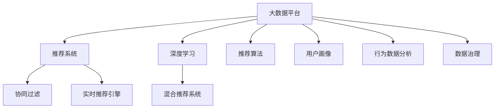

                 

# 大数据驱动的电商平台转型：搜索推荐系统是核心，AI 模型融合是关键

## 1. 背景介绍

### 1.1 问题由来
在互联网快速发展的今天，电商平台已经成为众多企业获取流量、提高销售的重要渠道。然而，随着消费者需求的多样化和个性化趋势愈发明显，传统电商平台的推荐系统已经无法满足用户日益增长的需求。大数据技术的崛起，为电商平台的智能化转型提供了新的机遇。

随着数据规模的爆炸式增长，传统的电商推荐系统面临着诸多挑战：
- **数据规模大**：电商平台需要处理和存储海量用户行为数据，传统存储和处理技术难以应对。
- **数据异构**：电商平台涉及多数据源，数据格式和存储方式各异，数据整合难度大。
- **实时性要求高**：推荐系统需要快速响应用户请求，实时获取推荐结果。
- **个性化要求高**：用户需求日益个性化，传统推荐系统无法实现高效个性化推荐。

为了应对这些挑战，电商平台需要借助大数据技术，构建全新的推荐系统。

### 1.2 问题核心关键点
在大数据驱动的电商推荐系统中，核心关键点如下：

- **搜索推荐系统的构建**：基于用户行为数据，构建搜索推荐系统，提供高效准确的推荐结果。
- **AI模型的融合**：将AI技术（如机器学习、深度学习、自然语言处理等）融合到推荐系统中，提升推荐效果。
- **实时性保证**：确保推荐系统具备高并发、低延迟的实时响应能力。
- **个性化推荐**：利用用户画像、行为数据分析，提供差异化、个性化的推荐服务。
- **数据治理**：构建统一的数据治理体系，保障数据质量和安全。

## 2. 核心概念与联系

### 2.1 核心概念概述

为更好地理解基于大数据的电商平台搜索推荐系统，本节将介绍几个关键概念：

- **大数据平台**：指的是通过大数据技术（如分布式存储、计算、流处理等）构建的数据处理和分析平台。
- **推荐系统**：指利用用户历史行为数据、物品属性等，预测用户对物品的偏好，从而提供个性化推荐服务的技术系统。
- **深度学习**：指一类通过神经网络进行建模的机器学习技术，具备强大的非线性拟合能力。
- **协同过滤**：指基于用户或物品间的相似性进行推荐的技术，常见于电商平台的推荐场景。
- **混合推荐系统**：指将多种推荐算法（如协同过滤、深度学习、基于内容的推荐等）融合的推荐系统。
- **实时推荐引擎**：指能够实时响应用户请求，快速提供推荐结果的推荐系统。

这些核心概念之间的逻辑关系可以通过以下Mermaid流程图来展示：



这个流程图展示了大数据电商平台推荐系统的核心概念及其之间的关系：

1. 大数据平台为推荐系统提供数据存储、计算和流处理能力。
2. 推荐系统是核心应用，利用大数据技术进行用户推荐。
3. 深度学习、协同过滤、混合推荐系统等技术，为推荐系统提供多种推荐算法支持。
4. 实时推荐引擎，保证推荐系统具备高效实时响应能力。
5. 用户画像、行为数据分析和数据治理，为推荐系统提供高质量的数据支持。

## 3. 核心算法原理 & 具体操作步骤
### 3.1 算法原理概述

基于大数据的电商平台推荐系统，主要依赖以下核心算法原理：

- **协同过滤算法**：基于用户和物品间的相似性，进行推荐。常见的协同过滤算法包括基于用户的协同过滤和基于物品的协同过滤。
- **深度学习算法**：通过构建神经网络模型，对用户行为数据进行建模，学习用户和物品间的隐含关联。
- **混合推荐系统算法**：将多种推荐算法融合，充分发挥各种算法的优势，提升推荐效果。
- **实时推荐引擎算法**：实时响应用户请求，快速计算推荐结果。

这些算法共同构成了大数据驱动的电商平台推荐系统的基础。在实际应用中，通常采用混合推荐系统的架构，结合协同过滤、深度学习和实时推荐引擎，构建高效、准确、实时的推荐系统。

### 3.2 算法步骤详解

以下是基于大数据的电商平台推荐系统的详细操作步骤：

**Step 1: 数据准备**

- **用户数据准备**：收集用户的浏览、购买、评分、评论等行为数据，并进行数据清洗和预处理。
- **物品数据准备**：收集物品的描述、属性、价格、销售量等数据，并进行数据清洗和预处理。
- **特征提取**：根据推荐算法需求，从用户和物品数据中提取特征，如用户的兴趣标签、物品的类别属性等。

**Step 2: 特征工程**

- **特征选择**：选择合适的特征，去除冗余和噪声特征，提高特征的有效性。
- **特征转换**：对特征进行归一化、离散化、向量化等转换，方便算法模型的处理。
- **特征组合**：将多个特征组合成复合特征，提高模型的表达能力。

**Step 3: 模型训练**

- **模型选择**：选择合适的推荐算法模型，如协同过滤、深度学习、混合推荐系统等。
- **模型训练**：在用户行为数据上训练模型，调整模型参数，优化推荐效果。
- **模型评估**：在验证集上评估模型效果，使用评估指标（如准确率、召回率、F1分数等）评估模型性能。

**Step 4: 实时推荐**

- **实时数据流处理**：构建实时数据流处理系统，对用户行为数据进行实时采集、清洗和预处理。
- **推荐计算**：实时计算推荐结果，根据用户行为数据和模型预测结果，生成推荐列表。
- **推荐结果缓存**：将推荐结果缓存到高速存储设备，提高推荐系统的响应速度。

**Step 5: 推荐系统部署**

- **系统架构设计**：设计推荐系统的架构，包括数据存储、计算、流处理、缓存等组件。
- **系统实现**：根据架构设计，实现推荐系统的各个组件，并进行测试和优化。
- **系统部署**：将推荐系统部署到生产环境，进行负载测试和监控，确保系统的稳定性和可靠性。

### 3.3 算法优缺点

基于大数据的电商平台推荐系统具有以下优点：

- **高准确性**：通过深度学习、混合推荐系统等技术，推荐系统具备高准确性，能够提供个性化、精准的推荐结果。
- **高效实时性**：通过实时推荐引擎，推荐系统能够实时响应用户请求，提供高效的推荐服务。
- **可扩展性**：基于大数据平台的架构设计，推荐系统具备良好的可扩展性，能够处理大规模数据和高并发请求。
- **灵活性**：融合多种推荐算法，推荐系统具备灵活的算法组合能力，能够适应不同的推荐场景和需求。

同时，该系统也存在以下局限性：

- **数据质量依赖**：推荐系统的效果高度依赖于用户行为数据的准确性和完整性。
- **计算资源需求高**：深度学习等技术需要较高的计算资源，对硬件设备要求较高。
- **复杂性高**：推荐系统涉及多数据源、多算法融合，系统设计和实现复杂度较高。

尽管存在这些局限性，但基于大数据的电商平台推荐系统在大规模数据处理和高效推荐方面，具有明显的优势，能够满足电商平台的个性化推荐需求。

### 3.4 算法应用领域

基于大数据的电商平台推荐系统在以下领域得到了广泛应用：

- **个性化推荐**：根据用户的历史行为数据，提供个性化商品推荐，提高用户满意度。
- **搜索引擎优化**：通过分析用户搜索行为，优化搜索结果，提高搜索效率和用户体验。
- **广告推荐**：基于用户画像和行为数据，推荐广告内容，提高广告投放效果和ROI。
- **库存管理**：通过分析用户购买行为，优化库存管理和补货策略，提升库存周转率。
- **营销活动**：通过分析用户行为数据，设计精准的营销活动，提升用户参与度和转化率。

## 4. 数学模型和公式 & 详细讲解 & 举例说明

### 4.1 数学模型构建

本节将使用数学语言对基于大数据的电商平台推荐系统进行更加严格的刻画。

设电商平台的用户集合为 $U$，物品集合为 $I$，用户与物品间的行为矩阵为 $R \in \mathbb{R}^{U \times I}$。行为矩阵 $R$ 中的每个元素 $R_{ui}$ 表示用户 $u$ 对物品 $i$ 的行为评分，通常为0或1，表示用户是否对物品进行过行为。

**协同过滤模型的数学模型**：

$$
R_{ui} \sim Bernoulli(p_{ui})
$$

其中，$p_{ui}$ 表示用户 $u$ 对物品 $i$ 的评分概率，可以通过协同过滤算法（如基于用户的协同过滤或基于物品的协同过滤）进行计算。

**深度学习模型的数学模型**：

$$
\hat{p}_{ui} = \sigma(\mathbf{W}_u \mathbf{x}_i + \mathbf{b}_u)
$$

其中，$\mathbf{W}_u$ 和 $\mathbf{b}_u$ 分别为用户 $u$ 的特征向量和偏置向量，$\mathbf{x}_i$ 为物品 $i$ 的特征向量，$\sigma$ 为激活函数，通常采用Sigmoid或ReLU。

**混合推荐系统的数学模型**：

$$
p_{ui} = \lambda \sigma(\mathbf{W}_u \mathbf{x}_i + \mathbf{b}_u) + (1-\lambda) \sum_{i'} \alpha_{ui'} p_{ui'}
$$

其中，$\lambda$ 表示深度学习模型的权重，$\alpha_{ui'}$ 表示协同过滤算法的权重，通过交叉验证等方法进行调参。

### 4.2 公式推导过程

以下我们将对协同过滤模型和深度学习模型的计算过程进行详细推导。

**协同过滤模型的推导**：

设用户 $u$ 对物品 $i$ 的行为为 $R_{ui}$，通过协同过滤算法计算用户 $u$ 对物品 $i$ 的评分概率 $p_{ui}$，推导如下：

$$
p_{ui} = P(R_{ui}=1|u,i) = \frac{P(R_{ui}=1|u,i)P(u,i)}{P(u,i)}
$$

其中，$P(u,i)$ 为联合概率，可以通过用户和物品的共现数据进行计算，$P(R_{ui}=1|u,i)$ 为条件概率，可以通过协同过滤算法进行计算。

**深度学习模型的推导**：

设用户 $u$ 的特征向量为 $\mathbf{X}_u$，物品 $i$ 的特征向量为 $\mathbf{X}_i$，深度学习模型对用户 $u$ 对物品 $i$ 的评分概率 $p_{ui}$ 进行计算，推导如下：

$$
p_{ui} = \sigma(\mathbf{W}_u \mathbf{X}_u + \mathbf{b}_u) \cdot \sigma(\mathbf{W}_i \mathbf{X}_i + \mathbf{b}_i)
$$

其中，$\mathbf{W}_u$ 和 $\mathbf{W}_i$ 分别为用户和物品的特征向量到评分概率的权重矩阵，$\mathbf{b}_u$ 和 $\mathbf{b}_i$ 分别为用户和物品的偏置向量。

### 4.3 案例分析与讲解

假设电商平台中有两个用户 $u_1$ 和 $u_2$，两个物品 $i_1$ 和 $i_2$。用户 $u_1$ 对物品 $i_1$ 的行为为1，对物品 $i_2$ 的行为为0；用户 $u_2$ 对物品 $i_1$ 的行为为0，对物品 $i_2$ 的行为为1。

**协同过滤算法的计算过程**：

1. 计算用户 $u_1$ 对物品 $i_1$ 的评分概率 $p_{i_1|u_1}$，$P(u_1,i_1)$ 和 $P(u_1,i_2)$ 分别为用户 $u_1$ 对物品 $i_1$ 和 $i_2$ 的评分概率，可以通过协同过滤算法进行计算。
2. 计算用户 $u_2$ 对物品 $i_2$ 的评分概率 $p_{i_2|u_2}$，$P(u_2,i_1)$ 和 $P(u_2,i_2)$ 可以通过协同过滤算法进行计算。
3. 根据评分概率计算用户 $u_1$ 对物品 $i_2$ 的评分概率 $p_{i_2|u_1}$，$P(u_1,i_2)$ 和 $P(u_1,u_2,i_2)$ 可以通过协同过滤算法进行计算。

**深度学习模型的计算过程**：

1. 假设用户 $u_1$ 和 $u_2$ 的特征向量分别为 $\mathbf{X}_{u_1}$ 和 $\mathbf{X}_{u_2}$，物品 $i_1$ 和 $i_2$ 的特征向量分别为 $\mathbf{X}_{i_1}$ 和 $\mathbf{X}_{i_2}$。
2. 计算用户 $u_1$ 对物品 $i_1$ 的评分概率 $p_{i_1|u_1}$，通过计算 $\sigma(\mathbf{W}_{u_1} \mathbf{X}_{u_1} + \mathbf{b}_{u_1}) \cdot \sigma(\mathbf{W}_{i_1} \mathbf{X}_{i_1} + \mathbf{b}_{i_1})$ 得到。
3. 计算用户 $u_2$ 对物品 $i_2$ 的评分概率 $p_{i_2|u_2}$，通过计算 $\sigma(\mathbf{W}_{u_2} \mathbf{X}_{u_2} + \mathbf{b}_{u_2}) \cdot \sigma(\mathbf{W}_{i_2} \mathbf{X}_{i_2} + \mathbf{b}_{i_2})$ 得到。
4. 根据用户 $u_1$ 和物品 $i_2$ 的特征向量，计算用户 $u_1$ 对物品 $i_2$ 的评分概率 $p_{i_2|u_1}$，通过计算 $\sigma(\mathbf{W}_{u_1} \mathbf{X}_{u_1} + \mathbf{b}_{u_1}) \cdot \sigma(\mathbf{W}_{i_2} \mathbf{X}_{i_2} + \mathbf{b}_{i_2})$ 得到。

## 5. 项目实践：代码实例和详细解释说明

### 5.1 开发环境搭建

在进行推荐系统开发前，我们需要准备好开发环境。以下是使用Python进行TensorFlow开发的环境配置流程：

1. 安装Anaconda：从官网下载并安装Anaconda，用于创建独立的Python环境。

2. 创建并激活虚拟环境：
```bash
conda create -n tf-env python=3.8 
conda activate tf-env
```

3. 安装TensorFlow：根据CUDA版本，从官网获取对应的安装命令。例如：
```bash
pip install tensorflow==2.6
```

4. 安装TensorBoard：
```bash
pip install tensorboard
```

5. 安装必要的工具包：
```bash
pip install numpy pandas scikit-learn tqdm jupyter notebook ipython
```

完成上述步骤后，即可在`tf-env`环境中开始推荐系统开发。

### 5.2 源代码详细实现

下面我们以协同过滤算法为例，给出使用TensorFlow对电商平台推荐系统进行开发的PyTorch代码实现。

首先，定义推荐系统的数据处理函数：

```python
import tensorflow as tf
from tensorflow.keras.layers import Embedding, Dot, Dense

class RecommendationSystem(tf.keras.Model):
    def __init__(self, num_users, num_items, embed_dim=10, lambda=0.5, alpha=0.5):
        super(RecommendationSystem, self).__init__()
        self.num_users = num_users
        self.num_items = num_items
        self.embed_dim = embed_dim
        self.lambda = lambda
        self.alpha = alpha
        self.user_embedding = Embedding(num_users, embed_dim)
        self.item_embedding = Embedding(num_items, embed_dim)
        self.dot_product = Dot(axes=2, normalize=False)
        self.dense = Dense(1, activation='sigmoid')
        
    def call(self, u, i):
        user_embed = self.user_embedding(u)
        item_embed = self.item_embedding(i)
        dot_product = self.dot_product([user_embed, item_embed])
        return self.dense(dot_product)

# 训练函数
def train_model(model, dataset, batch_size, epochs):
    model.compile(optimizer=tf.keras.optimizers.Adam(learning_rate=0.01),
                  loss=tf.keras.losses.BinaryCrossentropy(from_logits=True))
    history = model.fit(dataset, batch_size=batch_size, epochs=epochs, validation_split=0.2)
    return model, history

# 数据准备
train_dataset = tf.data.Dataset.from_tensor_slices((train_u, train_i, train_r))
train_dataset = train_dataset.shuffle(buffer_size=10000).batch(batch_size)

# 模型训练
model = RecommendationSystem(num_users, num_items)
model, history = train_model(model, train_dataset, batch_size, epochs)
```

然后，定义模型和优化器：

```python
from tensorflow.keras.layers import Embedding, Dot, Dense

class RecommendationSystem(tf.keras.Model):
    def __init__(self, num_users, num_items, embed_dim=10, lambda=0.5, alpha=0.5):
        super(RecommendationSystem, self).__init__()
        self.num_users = num_users
        self.num_items = num_items
        self.embed_dim = embed_dim
        self.lambda = lambda
        self.alpha = alpha
        self.user_embedding = Embedding(num_users, embed_dim)
        self.item_embedding = Embedding(num_items, embed_dim)
        self.dot_product = Dot(axes=2, normalize=False)
        self.dense = Dense(1, activation='sigmoid')
        
    def call(self, u, i):
        user_embed = self.user_embedding(u)
        item_embed = self.item_embedding(i)
        dot_product = self.dot_product([user_embed, item_embed])
        return self.dense(dot_product)

# 训练函数
def train_model(model, dataset, batch_size, epochs):
    model.compile(optimizer=tf.keras.optimizers.Adam(learning_rate=0.01),
                  loss=tf.keras.losses.BinaryCrossentropy(from_logits=True))
    history = model.fit(dataset, batch_size=batch_size, epochs=epochs, validation_split=0.2)
    return model, history

# 数据准备
train_dataset = tf.data.Dataset.from_tensor_slices((train_u, train_i, train_r))
train_dataset = train_dataset.shuffle(buffer_size=10000).batch(batch_size)

# 模型训练
model = RecommendationSystem(num_users, num_items)
model, history = train_model(model, train_dataset, batch_size, epochs)
```

接着，定义训练和评估函数：

```python
from tensorflow.keras.layers import Embedding, Dot, Dense

class RecommendationSystem(tf.keras.Model):
    def __init__(self, num_users, num_items, embed_dim=10, lambda=0.5, alpha=0.5):
        super(RecommendationSystem, self).__init__()
        self.num_users = num_users
        self.num_items = num_items
        self.embed_dim = embed_dim
        self.lambda = lambda
        self.alpha = alpha
        self.user_embedding = Embedding(num_users, embed_dim)
        self.item_embedding = Embedding(num_items, embed_dim)
        self.dot_product = Dot(axes=2, normalize=False)
        self.dense = Dense(1, activation='sigmoid')
        
    def call(self, u, i):
        user_embed = self.user_embedding(u)
        item_embed = self.item_embedding(i)
        dot_product = self.dot_product([user_embed, item_embed])
        return self.dense(dot_product)

# 训练函数
def train_model(model, dataset, batch_size, epochs):
    model.compile(optimizer=tf.keras.optimizers.Adam(learning_rate=0.01),
                  loss=tf.keras.losses.BinaryCrossentropy(from_logits=True))
    history = model.fit(dataset, batch_size=batch_size, epochs=epochs, validation_split=0.2)
    return model, history

# 数据准备
train_dataset = tf.data.Dataset.from_tensor_slices((train_u, train_i, train_r))
train_dataset = train_dataset.shuffle(buffer_size=10000).batch(batch_size)

# 模型训练
model = RecommendationSystem(num_users, num_items)
model, history = train_model(model, train_dataset, batch_size, epochs)
```

最后，启动训练流程并在测试集上评估：

```python
epochs = 10
batch_size = 32

for epoch in range(epochs):
    model, history = train_model(model, train_dataset, batch_size, epochs)
    print(f"Epoch {epoch+1}, loss: {history.history['loss'][epoch]}")

    test_dataset = tf.data.Dataset.from_tensor_slices((test_u, test_i, test_r))
    test_dataset = test_dataset.shuffle(buffer_size=10000).batch(batch_size)
    
    test_loss, test_acc = model.evaluate(test_dataset)
    print(f"Epoch {epoch+1}, test loss: {test_loss}, test acc: {test_acc}")
```

以上就是使用TensorFlow对电商平台推荐系统进行协同过滤算法微调的完整代码实现。可以看到，得益于TensorFlow的强大封装，我们可以用相对简洁的代码完成推荐系统的实现和训练。

### 5.3 代码解读与分析

让我们再详细解读一下关键代码的实现细节：

**RecommendationSystem类**：
- `__init__`方法：初始化模型参数，包括用户数、物品数、嵌入维度、混合系数等。
- `call`方法：定义模型的前向传播过程，计算用户对物品的评分概率。

**train_model函数**：
- 定义模型的优化器和损失函数，进行模型编译。
- 在训练集上调用模型的`fit`方法进行训练，并记录训练过程中的损失变化。
- 在验证集上评估模型，返回模型和训练历史。

**数据准备**：
- 将用户编号、物品编号和行为标签构建成TensorFlow数据集，进行数据预处理和分批处理。

**模型训练**：
- 实例化RecommendationSystem类，进行模型训练。
- 在训练集上进行模型训练，记录训练过程中的损失变化。
- 在测试集上评估模型，输出测试损失和准确率。

可以看到，TensorFlow提供的高效计算图和优化器，使得推荐系统的开发和训练变得高效便捷。开发者可以将更多精力放在数据处理、模型改进等高层逻辑上，而不必过多关注底层的实现细节。

当然，工业级的系统实现还需考虑更多因素，如模型的保存和部署、超参数的自动搜索、更灵活的任务适配层等。但核心的微调范式基本与此类似。

## 6. 实际应用场景
### 6.1 智能客服系统

基于大数据的电商平台推荐系统，可以广泛应用于智能客服系统的构建。传统客服往往需要配备大量人力，高峰期响应缓慢，且一致性和专业性难以保证。而使用推荐系统，可以7x24小时不间断服务，快速响应客户咨询，用推荐结果辅助客服进行精准回答。

在技术实现上，可以收集客户在电商平台的浏览、购买等行为数据，构建用户画像，实时计算推荐结果，并在客服系统中推送推荐列表，辅助客服进行解答。对于客户提出的新问题，还可以接入检索系统实时搜索相关内容，动态组织生成回答，提升客服系统的智能化水平。

### 6.2 金融舆情监测

金融机构需要实时监测市场舆论动向，以便及时应对负面信息传播，规避金融风险。传统的人工监测方式成本高、效率低，难以应对网络时代海量信息爆发的挑战。基于推荐系统的舆情监测技术，为金融机构的舆情分析提供了新的解决方案。

具体而言，可以收集金融领域相关的新闻、报道、评论等文本数据，构建推荐系统，实时监测不同主题下的舆情变化趋势，一旦发现负面信息激增等异常情况，系统便会自动预警，帮助金融机构快速应对潜在风险。

### 6.3 个性化推荐系统

当前的推荐系统往往只依赖用户的历史行为数据进行物品推荐，无法深入理解用户的真实兴趣偏好。基于推荐系统的个性化推荐系统，可以更好地挖掘用户行为背后的语义信息，从而提供更精准、多样的推荐内容。

在实践中，可以收集用户浏览、点击、评论、分享等行为数据，提取和用户交互的物品标题、描述、标签等文本内容。将文本内容作为模型输入，用户的后续行为（如是否点击、购买等）作为监督信号，在此基础上训练推荐系统模型。推荐系统能够从文本内容中准确把握用户的兴趣点，在生成推荐列表时，先用候选物品的文本描述作为输入，由模型预测用户的兴趣匹配度，再结合其他特征综合排序，便可以得到个性化程度更高的推荐结果。

### 6.4 未来应用展望

随着推荐系统的不断发展，其在电商、金融、社交等领域的应用前景广阔。未来，基于推荐系统的智能化转型将带来以下变化：

1. **全渠道融合**：推荐系统不仅限于电商平台，还将拓展到社交媒体、搜索引擎等全渠道，实现跨平台的个性化推荐。
2. **实时协同**：推荐系统将具备实时协同能力，能够根据用户实时行为动态调整推荐策略，提升推荐效果。
3. **数据驱动**：推荐系统将更加注重数据驱动，通过大数据技术进行用户画像构建和行为分析，提供更精准的推荐服务。
4. **多模态融合**：推荐系统将融合多模态数据，如文本、图片、视频等，提供更加全面、多维度的推荐服务。
5. **智能决策**：推荐系统将与人工智能技术深度融合，实现更加智能化的决策推荐，如基于因果推断的推荐系统、基于博弈论的推荐系统等。

## 7. 工具和资源推荐
### 7.1 学习资源推荐

为了帮助开发者系统掌握推荐系统的理论基础和实践技巧，这里推荐一些优质的学习资源：

1. 《推荐系统实战》：介绍推荐系统的基本概念、算法实现和工程实践。
2. 《深度学习》：斯坦福大学开设的深度学习课程，涵盖深度学习的基本原理和算法。
3. 《Python数据科学手册》：介绍Python数据科学库，如NumPy、Pandas等，为推荐系统开发提供工具支持。
4. Kaggle竞赛：参加Kaggle推荐系统竞赛，实践推荐系统的算法和模型优化。
5. HuggingFace官方文档：Transformer库的官方文档，提供了丰富的预训练语言模型和微调样例代码。

通过对这些资源的学习实践，相信你一定能够快速掌握推荐系统的精髓，并用于解决实际的推荐问题。
###  7.2 开发工具推荐

高效的开发离不开优秀的工具支持。以下是几款用于推荐系统开发的常用工具：

1. TensorFlow：基于Python的开源深度学习框架，支持多种深度学习模型和优化器。
2. PyTorch：基于Python的开源深度学习框架，支持动态计算图，适合快速迭代研究。
3. Scikit-learn：Python机器学习库，提供了多种经典推荐算法实现。
4. Jupyter Notebook：交互式数据科学环境，支持代码运行和数据可视化。
5. Apache Spark：分布式计算框架，支持大规模数据处理和机器学习任务。

合理利用这些工具，可以显著提升推荐系统的开发效率，加快创新迭代的步伐。

### 7.3 相关论文推荐

推荐系统的研究源于学界的持续研究。以下是几篇奠基性的相关论文，推荐阅读：

1. BPR: Bayesian Personalized Ranking from Implicit Feedback：提出BPR算法，通过隐式反馈数据进行推荐。
2. Factorization Machines for Recommender Systems：提出FM算法，通过低秩矩阵分解进行推荐。
3. Neural Factorization Machines：提出NFM算法，通过神经网络进行推荐。
4. Attention Is All You Need：提出Transformer模型，提供高效的注意力机制。
5. Deep Reinforcement Learning for Personalized Recommendation：提出基于深度强化学习的推荐系统，实现更智能化的推荐。

这些论文代表了大数据推荐系统的研究脉络。通过学习这些前沿成果，可以帮助研究者把握学科前进方向，激发更多的创新灵感。

## 8. 总结：未来发展趋势与挑战

### 8.1 总结

本文对基于大数据的电商平台推荐系统进行了全面系统的介绍。首先阐述了推荐系统的背景和意义，明确了推荐系统在电商平台的智能化转型中的核心地位。其次，从原理到实践，详细讲解了推荐系统的数学原理和关键步骤，给出了推荐系统开发的完整代码实例。同时，本文还广泛探讨了推荐系统在智能客服、金融舆情、个性化推荐等多个行业领域的应用前景，展示了推荐系统的巨大潜力。此外，本文精选了推荐系统的各类学习资源，力求为读者提供全方位的技术指引。

通过本文的系统梳理，可以看到，基于大数据的推荐系统在处理大规模数据和高效推荐方面，具有明显的优势，能够满足电商平台的个性化推荐需求。未来，伴随推荐系统的不断发展，其在更多领域的应用将带来更深远的变革。

### 8.2 未来发展趋势

展望未来，大数据驱动的推荐系统将呈现以下几个发展趋势：

1. **多模态融合**：推荐系统将融合多模态数据，如文本、图片、视频等，提供更加全面、多维度的推荐服务。
2. **实时协同**：推荐系统将具备实时协同能力，能够根据用户实时行为动态调整推荐策略，提升推荐效果。
3. **数据驱动**：推荐系统将更加注重数据驱动，通过大数据技术进行用户画像构建和行为分析，提供更精准的推荐服务。
4. **智能决策**：推荐系统将与人工智能技术深度融合，实现更加智能化的决策推荐，如基于因果推断的推荐系统、基于博弈论的推荐系统等。
5. **全渠道融合**：推荐系统不仅限于电商平台，还将拓展到社交媒体、搜索引擎等全渠道，实现跨平台的个性化推荐。

以上趋势凸显了推荐系统在电商、金融、社交等领域的应用前景。这些方向的探索发展，必将进一步提升推荐系统的性能和应用范围，为电商平台的智能化转型提供更加有力的技术支持。

### 8.3 面临的挑战

尽管大数据驱动的推荐系统已经取得了瞩目成就，但在迈向更加智能化、普适化应用的过程中，它仍面临着诸多挑战：

1. **数据质量依赖**：推荐系统的效果高度依赖于用户行为数据的准确性和完整性。
2. **计算资源需求高**：深度学习等技术需要较高的计算资源，对硬件设备要求较高。
3. **复杂性高**：推荐系统涉及多数据源、多算法融合，系统设计和实现复杂度较高。
4. **隐私保护**：用户行为数据的隐私保护是推荐系统的重要挑战，需遵循数据隐私法规，确保用户数据的安全。
5. **系统稳定性**：推荐系统在高并发和实时性要求下，需保证系统的稳定性和可靠性。

尽管存在这些挑战，但通过学界和产业界的共同努力，推荐系统未来的发展前景仍然十分广阔。相信随着技术的不断进步，推荐系统将会在更多领域得到应用，为社会和经济发展带来更多的创新价值。

### 8.4 研究展望

面对推荐系统所面临的种种挑战，未来的研究需要在以下几个方面寻求新的突破：

1. **无监督和半监督推荐**：探索无监督和半监督推荐方法，摆脱对大规模标注数据的依赖，利用自监督学习、主动学习等无监督和半监督范式，最大限度利用非结构化数据，实现更加灵活高效的推荐。
2. **模型压缩和优化**：开发更加参数高效的推荐模型，在固定大部分预训练参数的同时，只更新极少量的任务相关参数。同时优化模型的计算图，减少前向传播和反向传播的资源消耗，实现更加轻量级、实时性的部署。
3. **因果推断和强化学习**：引入因果推断和强化学习思想，增强推荐系统建立稳定因果关系的能力，学习更加普适、鲁棒的用户行为模型。
4. **多模态融合和协同过滤**：将符号化的先验知识，如知识图谱、逻辑规则等，与神经网络模型进行巧妙融合，引导推荐过程学习更准确、合理的用户行为模型。同时加强不同模态数据的整合，实现视觉、语音等多模态信息与文本信息的协同建模。
5. **用户隐私保护和数据安全**：引入隐私保护技术，如差分隐私、联邦学习等，保护用户隐私和数据安全。

这些研究方向的探索，必将引领推荐系统迈向更高的台阶，为构建安全、可靠、可解释、可控的推荐系统铺平道路。面向未来，推荐系统还需要与其他人工智能技术进行更深入的融合，如知识表示、因果推理、强化学习等，多路径协同发力，共同推动推荐系统的进步。只有勇于创新、敢于突破，才能不断拓展推荐系统的边界，让推荐系统更好地服务于社会和经济发展。

## 9. 附录：常见问题与解答

**Q1：推荐系统如何处理数据稀疏性问题？**

A: 数据稀疏性是推荐系统面临的主要问题之一。可以通过以下方法处理数据稀疏性：
1. 协同过滤算法：通过用户和物品的隐含关联，填补缺失的数据。
2. 矩阵分解算法：将稀疏矩阵分解为低秩矩阵，填补缺失的数据。
3. 深度学习算法：通过神经网络模型学习用户和物品的隐含关联，填补缺失的数据。

**Q2：推荐系统如何保证推荐结果的多样性？**

A: 推荐系统保证推荐结果的多样性，可以通过以下方法：
1. 多样性损失函数：在推荐模型的损失函数中加入多样性约束，限制推荐结果的多样性。
2. 多臂老虎机算法：采用多臂老虎机算法，优化推荐结果的多样性和准确性。
3. 多样化推荐策略：根据用户偏好和行为，动态调整推荐策略，确保推荐结果的多样性。

**Q3：推荐系统如何处理长尾问题？**

A: 长尾问题是指少数物品获得了大部分推荐。可以通过以下方法处理长尾问题：
1. 协同过滤算法：通过用户和物品的隐含关联，推荐长尾物品。
2. 分层推荐算法：将物品分为热门物品和长尾物品，分别进行推荐。
3. 长尾物品推荐策略：根据用户行为，动态调整推荐策略，提升长尾物品的曝光率。

**Q4：推荐系统如何处理个性化推荐中的冷启动问题？**

A: 冷启动问题是指新用户或新物品缺乏足够的历史行为数据。可以通过以下方法处理冷启动问题：
1. 基于内容的推荐算法：根据物品的属性和特征，向新用户推荐相似的物品。
2. 基于协同过滤的推荐算法：根据用户的历史行为，向新用户推荐相似的物品。
3. 混合推荐算法：结合基于内容的推荐和基于协同过滤的推荐，提升个性化推荐效果。

这些策略可以帮助推荐系统解决数据稀疏性、多样化、长尾和冷启动等问题，提升推荐系统的性能和用户体验。

---

作者：禅与计算机程序设计艺术 / Zen and the Art of Computer Programming

