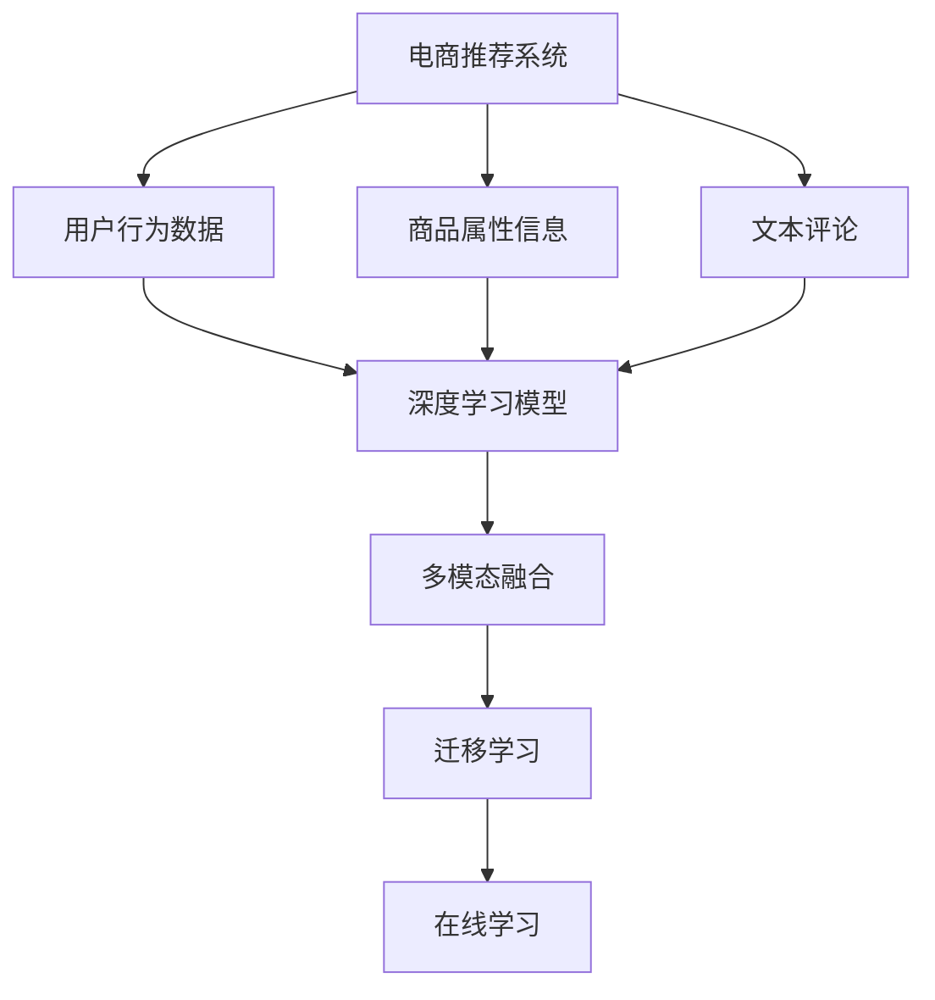

                 

# 大数据驱动的电商推荐系统：AI 模型融合是核心，用户体验优化与转化率

## 1. 背景介绍

### 1.1 问题由来

随着电子商务的迅猛发展，电商推荐系统已经成为各大电商平台的核心功能之一，其目标是通过算法向用户推荐最合适的商品，提升用户体验和销售转化率。传统的推荐系统依赖于特征工程，通过手工设计并提取用户和商品的特征，然后应用分类、回归等机器学习算法进行训练。这种方法不仅耗时耗力，而且容易受到特征选择偏差的影响，导致推荐效果不佳。

在大数据时代，深度学习技术的崛起为推荐系统带来了新的解决思路。大数据驱动的推荐系统，通过机器学习、自然语言处理、图像处理等AI技术，从海量数据中自动提取用户和商品的特征，利用深度神经网络进行建模，实现个性化推荐，极大地提升了推荐系统的精度和效率。

### 1.2 问题核心关键点

大数据驱动的电商推荐系统，其核心在于通过AI模型融合技术，将用户行为数据、商品属性信息、文本评论等多模态数据有机结合，构建高质量的推荐模型。同时，通过多轮优化，不断提升模型精度，增强用户体验，提高销售转化率。

这一过程的关键点包括：
1. 数据采集和预处理。收集用户行为数据、商品属性信息、文本评论等数据，并进行数据清洗、去重、归一化等预处理操作。
2. 特征提取和拼接。自动提取和拼接用户和商品的特征，形成向量表示，供深度学习模型使用。
3. 模型训练与优化。选择合适的深度学习模型，利用标注数据进行训练，并通过交叉验证、正则化、参数调优等技术手段，提升模型性能。
4. 在线预测与更新。将训练好的模型应用于实时预测，并根据用户反馈和新数据，不断更新模型，优化推荐效果。

## 2. 核心概念与联系

### 2.1 核心概念概述

为更好地理解大数据驱动的电商推荐系统，本节将介绍几个密切相关的核心概念：

- 电商推荐系统(E-commerce Recommendation System)：通过分析用户历史行为、商品属性等数据，为用户推荐合适商品的电子商务平台功能。
- 用户行为数据(User Behavior Data)：记录用户在平台上的浏览、点击、购买等行为数据，用于建模用户偏好。
- 商品属性信息(Product Attributes)：商品的名称、价格、分类、描述等数据，用于构建商品特征向量。
- 文本评论(Text Reviews)：用户对商品的评价、评论文本，用于提取商品的语言特征。
- 深度学习模型(Deep Learning Model)：基于神经网络的推荐模型，能够自动从数据中学习用户和商品的潜在关系。
- 多模态融合(Multi-modal Fusion)：将用户行为数据、商品属性信息、文本评论等不同模态的数据融合到一起，提升推荐模型的泛化能力。
- 迁移学习(Transfer Learning)：将在大规模数据上训练好的模型知识迁移到电商推荐场景中，提升模型效果。
- 在线学习(Online Learning)：推荐模型实时更新，不断学习新的用户和商品数据，提升预测准确性。

这些核心概念之间的逻辑关系可以通过以下Mermaid流程图来展示：



这个流程图展示了大数据驱动的电商推荐系统的核心概念及其之间的关系：

1. 电商推荐系统通过用户行为数据、商品属性信息和文本评论等数据，构建推荐模型。
2. 深度学习模型是推荐系统的核心，能够自动从多模态数据中提取用户和商品的特征。
3. 多模态融合技术将不同模态的数据结合，提升推荐模型的泛化能力。
4. 迁移学习可以将大模型的知识迁移到推荐场景中，提升模型效果。
5. 在线学习技术使推荐模型能够实时更新，不断学习新的数据，提升预测准确性。

## 3. 核心算法原理 & 具体操作步骤
### 3.1 算法原理概述

大数据驱动的电商推荐系统，主要利用深度学习模型从多模态数据中自动提取用户和商品的特征，构建高质量的推荐模型。其核心原理如下：

1. 数据采集与预处理：收集用户行为数据、商品属性信息、文本评论等数据，并进行清洗、归一化等预处理操作。

2. 特征提取与拼接：自动提取和拼接用户和商品的特征，形成向量表示。

3. 模型训练与优化：选择合适的深度学习模型，利用标注数据进行训练，并通过交叉验证、正则化、参数调优等技术手段，提升模型性能。

4. 在线预测与更新：将训练好的模型应用于实时预测，并根据用户反馈和新数据，不断更新模型，优化推荐效果。

### 3.2 算法步骤详解

#### 3.2.1 数据采集与预处理

1. **用户行为数据**：记录用户历史行为数据，包括浏览、点击、购买等行为。通常使用数据仓库技术进行存储和处理，如Apache Hadoop、Apache Spark等。

2. **商品属性信息**：记录商品的名称、价格、分类、描述等属性信息。可以使用关系型数据库（如MySQL、Oracle）或文档型数据库（如MongoDB）进行存储。

3. **文本评论**：记录用户对商品的评价、评论文本。可以使用文本存储数据库（如Elasticsearch、Redis）进行存储和处理。

4. **数据清洗**：对用户行为数据、商品属性信息和文本评论等数据进行清洗和去重，去除噪声和重复数据。

5. **数据归一化**：对用户行为数据、商品属性信息和文本评论等数据进行归一化操作，使其在相同的尺度下进行处理。

#### 3.2.2 特征提取与拼接

1. **用户行为特征提取**：对用户历史行为数据进行特征提取，如用户最近浏览的商品、浏览时间、点击次数等。可以使用词袋模型、TF-IDF等技术对行为数据进行表示。

2. **商品属性特征提取**：对商品的属性信息进行特征提取，如商品价格、分类、描述等。可以使用词向量、One-Hot编码等技术对属性信息进行表示。

3. **文本评论特征提取**：对商品的文本评论进行特征提取，如情感分析、主题建模等。可以使用自然语言处理技术进行提取和表示。

4. **特征拼接**：将用户行为特征、商品属性特征和文本评论特征拼接起来，形成完整的向量表示，供深度学习模型使用。

#### 3.2.3 模型训练与优化

1. **选择合适的深度学习模型**：根据数据特点和任务需求，选择合适的深度学习模型，如基于协同过滤的模型、基于内容的推荐模型、基于深度学习的推荐模型等。

2. **利用标注数据进行训练**：利用标注数据对模型进行训练，优化模型参数。可以使用监督学习算法（如随机森林、逻辑回归等）进行训练，也可以使用无监督学习算法（如矩阵分解、神经网络等）进行训练。

3. **交叉验证与参数调优**：通过交叉验证技术对模型进行评估，选择最优模型。同时进行参数调优，选择最优的超参数（如学习率、正则化系数等），提升模型性能。

4. **正则化技术**：采用L2正则化、Dropout等技术避免过拟合，提高模型泛化能力。

#### 3.2.4 在线预测与更新

1. **实时预测**：将训练好的模型应用于实时预测，根据用户行为和商品属性，生成推荐列表。

2. **用户反馈处理**：根据用户对推荐的反馈（如点击、购买等），对模型进行更新，优化推荐效果。

3. **新数据更新**：实时收集用户行为和商品属性数据，不断更新模型，提升预测准确性。

### 3.3 算法优缺点

大数据驱动的电商推荐系统的优点包括：
1. 自动化特征提取：自动从数据中提取用户和商品的特征，无需人工设计特征。
2. 模型效果显著：深度学习模型能够从多模态数据中学习用户和商品的潜在关系，提升推荐效果。
3. 实时性高：在线预测和更新技术使推荐系统能够实时响应用户行为，提升用户体验。

其缺点包括：
1. 数据隐私问题：推荐系统需要大量用户行为数据，可能涉及用户隐私，需要采取隐私保护措施。
2. 模型复杂度高：深度学习模型参数量大，训练复杂度高。
3. 资源消耗大：训练和预测需要高性能计算资源，可能带来高成本。

### 3.4 算法应用领域

大数据驱动的电商推荐系统已经在多个电商平台上得到了广泛应用，具体包括：

- 淘宝、京东等综合电商平台的商品推荐：根据用户历史行为和商品属性，为用户推荐合适商品，提升用户满意度。
- 亚马逊、eBay等跨境电商平台的商品推荐：根据用户浏览行为和商品属性，推荐国际商品，扩大用户选择范围。
- 唯品会、苏宁易购等社交电商平台的商品推荐：根据用户社交关系和商品属性，推荐热门商品，提升社交互动性。
- 美团、饿了么等生活服务平台的商品推荐：根据用户行为和商品属性，推荐生活服务类商品，提升用户体验。
- 携程、去哪儿等旅游电商平台的商品推荐：根据用户历史行为和商品属性，推荐旅游产品，提升用户旅行体验。

## 4. 数学模型和公式 & 详细讲解  
### 4.1 数学模型构建

假设电商平台收集了用户行为数据 $\mathbf{X} \in \mathbb{R}^{n \times d_1}$，商品属性信息 $\mathbf{Y} \in \mathbb{R}^{m \times d_2}$，文本评论 $\mathbf{Z} \in \mathbb{R}^{n \times d_3}$。定义用户和商品的相关度为 $\mathbf{W} \in \mathbb{R}^{d_1 \times d_2}$，商品的潜在价值为 $\mathbf{B} \in \mathbb{R}^{d_3 \times d_2}$。

目标是最小化用户和商品的误差平方和，即：

$$
\min_{\mathbf{W}, \mathbf{B}} \frac{1}{2} \sum_{i=1}^n \left\|\mathbf{X}_i \mathbf{W} - \mathbf{Y}_j \mathbf{B} \right\|^2
$$

其中 $\mathbf{X}_i$ 和 $\mathbf{Y}_j$ 分别表示用户和商品的相关度和潜在价值。

### 4.2 公式推导过程

使用矩阵分解技术，将用户行为数据、商品属性信息和文本评论等数据进行分解：

$$
\mathbf{X}_i = \mathbf{U}_i \mathbf{W} + \mathbf{E}_i
$$
$$
\mathbf{Y}_j = \mathbf{V}_j \mathbf{B} + \mathbf{F}_j
$$
$$
\mathbf{Z}_i = \mathbf{U}_i \mathbf{B} + \mathbf{E}_i
$$

其中 $\mathbf{U}_i$ 和 $\mathbf{V}_j$ 分别表示用户和商品的特征矩阵，$\mathbf{E}_i$ 和 $\mathbf{F}_j$ 表示噪声矩阵。

将上述分解带入误差平方和公式，得：

$$
\min_{\mathbf{W}, \mathbf{B}} \frac{1}{2} \sum_{i=1}^n \left\|\mathbf{U}_i \mathbf{W} - \mathbf{V}_j \mathbf{B} \right\|^2
$$

简化得：

$$
\min_{\mathbf{W}, \mathbf{B}} \frac{1}{2} \sum_{i=1}^n \text{tr} (\mathbf{W}^T \mathbf{U}_i \mathbf{U}_i^T \mathbf{W} - 2 \mathbf{W}^T \mathbf{U}_i \mathbf{V}_j \mathbf{B} + \mathbf{V}_j^T \mathbf{V}_j \mathbf{B}^T \mathbf{B})
$$

进一步化简得：

$$
\min_{\mathbf{W}, \mathbf{B}} \frac{1}{2} \text{tr} (\mathbf{W}^T \mathbf{U} \mathbf{U}^T \mathbf{W} - 2 \mathbf{W}^T \mathbf{U} \mathbf{V} \mathbf{B} + \mathbf{V}^T \mathbf{V} \mathbf{B}^T \mathbf{B})
$$

其中 $\mathbf{U} = [\mathbf{U}_1, \mathbf{U}_2, ..., \mathbf{U}_n]$，$\mathbf{V} = [\mathbf{V}_1, \mathbf{V}_2, ..., \mathbf{V}_m]$。

### 4.3 案例分析与讲解

以电商平台商品推荐为例，假设平台收集了用户的浏览历史数据、商品的属性信息、商品的评论数据等。使用深度学习模型对数据进行建模，首先对数据进行预处理，提取用户行为特征、商品属性特征和文本评论特征，然后进行特征拼接，形成完整的向量表示。接着，利用矩阵分解技术将用户行为数据、商品属性信息和文本评论等数据进行分解，得到用户和商品的特征矩阵。最后，将特征矩阵代入误差平方和公式，最小化误差，得到最终的推荐模型。

## 5. 项目实践：代码实例和详细解释说明
### 5.1 开发环境搭建

在进行推荐系统开发前，需要先准备好开发环境。以下是使用Python进行TensorFlow开发的开发环境配置流程：

1. 安装Anaconda：从官网下载并安装Anaconda，用于创建独立的Python环境。

2. 创建并激活虚拟环境：
```bash
conda create -n tensorflow-env python=3.8 
conda activate tensorflow-env
```

3. 安装TensorFlow：根据CUDA版本，从官网获取对应的安装命令。例如：
```bash
pip install tensorflow
```

4. 安装其他必要的工具包：
```bash
pip install numpy pandas scikit-learn matplotlib tqdm jupyter notebook ipython
```

完成上述步骤后，即可在`tensorflow-env`环境中开始推荐系统开发。

### 5.2 源代码详细实现

以下是一个使用TensorFlow实现电商推荐系统的PyTorch代码实现。

```python
import tensorflow as tf
from tensorflow.keras.layers import Input, Dense, Embedding, Concatenate, Dropout
from tensorflow.keras.models import Model
from tensorflow.keras.optimizers import Adam
from tensorflow.keras.callbacks import EarlyStopping
from sklearn.model_selection import train_test_split
from sklearn.metrics import mean_squared_error, mean_absolute_error

# 定义输入层
user_input = Input(shape=(d1,), name='user_input')
item_input = Input(shape=(d2,), name='item_input')
text_input = Input(shape=(d3,), name='text_input')

# 定义特征嵌入层
user_embedding = Embedding(d1, d1, input_length=d1)(user_input)
item_embedding = Embedding(d2, d2, input_length=d2)(item_input)
text_embedding = Embedding(d3, d3, input_length=d3)(text_input)

# 定义特征拼接层
feature拼接层 = Concatenate()([user_embedding, item_embedding, text_embedding])

# 定义全连接层
dense层 = Dense(100, activation='relu')(feature拼接层)
dropout层 = Dropout(0.5)(dense层)

# 定义输出层
output = Dense(1, activation='sigmoid')(dropout层)

# 定义模型
model = Model(inputs=[user_input, item_input, text_input], outputs=output)

# 定义优化器
optimizer = Adam(learning_rate=0.001)

# 定义损失函数
loss_function = tf.keras.losses.BinaryCrossentropy(from_logits=True)

# 定义评估指标
evaluation_metrics = [mean_squared_error, mean_absolute_error]

# 编译模型
model.compile(optimizer=optimizer, loss=loss_function, metrics=evaluation_metrics)

# 加载数据
X_train, X_test, y_train, y_test = train_test_split(user_data, user_labels, test_size=0.2, random_state=42)

# 训练模型
model.fit([X_train, X_train, X_train], y_train, epochs=10, validation_data=([X_test, X_test, X_test], y_test), callbacks=[EarlyStopping(patience=3)])
```

以上代码实现了一个使用TensorFlow进行电商推荐系统的完整流程。具体步骤如下：

1. 定义输入层，输入用户行为数据、商品属性信息和文本评论等数据。
2. 定义特征嵌入层，对输入数据进行特征嵌入，得到用户、商品和文本的向量表示。
3. 定义特征拼接层，将用户、商品和文本的向量表示拼接起来，形成完整的特征向量。
4. 定义全连接层，对拼接后的特征向量进行全连接操作，提取更深层次的特征。
5. 定义输出层，输出用户和商品的相关度。
6. 定义优化器和损失函数，选择合适的优化器和损失函数，编译模型。
7. 加载数据，将数据划分为训练集和测试集。
8. 训练模型，使用训练集对模型进行训练，并在测试集上进行评估。

### 5.3 代码解读与分析

让我们再详细解读一下关键代码的实现细节：

**用户行为数据**：
- 使用`tensorflow.keras.layers.Embedding`定义特征嵌入层，将用户行为数据转换为向量表示。

**商品属性信息**：
- 使用`tensorflow.keras.layers.Embedding`定义特征嵌入层，将商品属性信息转换为向量表示。

**文本评论**：
- 使用`tensorflow.keras.layers.Embedding`定义特征嵌入层，将文本评论转换为向量表示。

**特征拼接**：
- 使用`tensorflow.keras.layers.Concatenate`将用户、商品和文本的向量表示拼接起来，形成完整的特征向量。

**全连接层**：
- 使用`tensorflow.keras.layers.Dense`定义全连接层，对特征向量进行全连接操作，提取更深层次的特征。

**输出层**：
- 使用`tensorflow.keras.layers.Dense`定义输出层，输出用户和商品的相关度。

**模型编译**：
- 使用`tensorflow.keras.models.Model`定义模型，编译模型时选择合适的优化器和损失函数。

**数据加载**：
- 使用`sklearn.model_selection.train_test_split`将数据划分为训练集和测试集。

**模型训练**：
- 使用`tensorflow.keras.models.Model.fit`对模型进行训练，并在测试集上进行评估。

可以看到，TensorFlow提供了一整套完整的模型构建和训练工具，使得电商推荐系统的开发变得简便高效。开发者可以根据具体需求，灵活使用不同的深度学习模型和超参数组合，提升推荐效果。

当然，工业级的系统实现还需考虑更多因素，如模型的保存和部署、超参数的自动搜索、更灵活的任务适配层等。但核心的推荐范式基本与此类似。

## 6. 实际应用场景
### 6.1 智能客服系统

大数据驱动的电商推荐系统，不仅仅局限于商品推荐。利用大数据技术，电商平台可以进一步拓展推荐系统的应用范围，构建更加智能的电商平台。

以智能客服系统为例，平台通过分析用户的历史行为数据和商品评论数据，能够自动回答用户的问题，解决用户的咨询需求。同时，平台还可以根据用户的购买行为，推荐相关的商品和服务，提升用户满意度。

### 6.2 个性化推荐系统

个性化推荐系统是电商推荐系统的基础功能，通过分析用户的历史行为数据，为用户推荐合适商品。大数据驱动的电商推荐系统，能够自动从数据中提取用户和商品的特征，构建高质量的推荐模型，提升推荐效果。

### 6.3 智能搜索系统

智能搜索系统是电商平台的另一项重要功能。通过分析用户的历史搜索数据和浏览数据，平台能够自动为用户推荐相关的商品，提升搜索效率。大数据驱动的电商推荐系统，能够自动从数据中提取用户和商品的特征，构建高质量的推荐模型，提升搜索效果。

### 6.4 未来应用展望

随着大数据技术的发展，电商推荐系统将不断拓展其应用场景，涵盖更多电商平台的垂直业务。

1. 智能推荐引擎：通过分析用户的历史行为数据和商品评论数据，为用户推荐合适商品，提升用户满意度。
2. 个性化推荐系统：通过分析用户的历史搜索数据和浏览数据，为用户推荐相关的商品，提升搜索效率。
3. 智能搜索系统：通过分析用户的历史搜索数据和浏览数据，为用户推荐相关的商品，提升搜索效果。
4. 智能客服系统：通过分析用户的历史行为数据和商品评论数据，自动回答用户的问题，解决用户的咨询需求。
5. 智能广告系统：通过分析用户的历史行为数据和商品评论数据，自动为用户推荐合适的广告，提升广告效果。

未来，电商平台将利用大数据驱动的推荐系统，构建更加智能、高效、个性化的电商生态，为用户提供更加优质的购物体验。

## 7. 工具和资源推荐
### 7.1 学习资源推荐

为了帮助开发者系统掌握电商推荐系统的理论基础和实践技巧，这里推荐一些优质的学习资源：

1. 《推荐系统实践》：一本经典的推荐系统入门书籍，涵盖了推荐系统的基本概念和实践技巧，适合初学者入门。

2. 《深度学习》：深度学习领域的经典教材，介绍了深度学习的基本原理和应用案例，适合深入学习。

3. 《TensorFlow官方文档》：TensorFlow的官方文档，提供了详细的API介绍和示例代码，适合开发者学习。

4. 《自然语言处理》：斯坦福大学开设的NLP明星课程，有Lecture视频和配套作业，带你入门NLP领域的基本概念和经典模型。

5. 《Transformers》：Transformer的官方文档，提供了详细的API介绍和示例代码，适合开发者学习。

通过对这些资源的学习实践，相信你一定能够快速掌握电商推荐系统的精髓，并用于解决实际的推荐问题。

### 7.2 开发工具推荐

高效的开发离不开优秀的工具支持。以下是几款用于电商推荐系统开发的常用工具：

1. TensorFlow：基于Python的开源深度学习框架，灵活动态的计算图，适合快速迭代研究。
2. PyTorch：基于Python的开源深度学习框架，灵活高效的计算图，适合大规模工程应用。
3. Scikit-learn：Python的机器学习库，提供丰富的机器学习算法和工具，适合特征工程和模型评估。
4. Pandas：Python的数据分析库，提供高效的数据处理和分析功能，适合数据预处理和特征提取。
5. Numpy：Python的数值计算库，提供高效的数值计算和矩阵运算功能，适合模型训练和优化。

合理利用这些工具，可以显著提升电商推荐系统的开发效率，加快创新迭代的步伐。

### 7.3 相关论文推荐

电商推荐系统的研究离不开学界的持续支持。以下是几篇奠基性的相关论文，推荐阅读：

1. "物品协同过滤：算法及用户适应性"（Item-Based Collaborative Filtering: Algorithm and User Adaptation）：引入了协同过滤推荐算法，成为推荐系统的经典方法。

2. "基于内容的推荐系统"（Content-based Recommendation System）：提出了基于内容的推荐系统，能够根据用户和商品的特征进行推荐。

3. "矩阵分解推荐算法"（Matrix Factorization Techniques for Recommender Systems）：提出了矩阵分解技术，将用户和商品的特征矩阵进行分解，提升推荐效果。

4. "深度学习在推荐系统中的应用"（Deep Learning for Recommender Systems）：介绍了深度学习在推荐系统中的应用，提升了推荐系统的精度和效果。

5. "迁移学习在推荐系统中的应用"（Transfer Learning for Recommendation Systems）：提出了迁移学习技术，将在大规模数据上训练好的模型知识迁移到推荐场景中，提升模型效果。

这些论文代表了大数据驱动的电商推荐系统的发展脉络。通过学习这些前沿成果，可以帮助研究者把握学科前进方向，激发更多的创新灵感。

## 8. 总结：未来发展趋势与挑战

### 8.1 总结

本文对大数据驱动的电商推荐系统进行了全面系统的介绍。首先阐述了电商推荐系统在大数据时代的背景和意义，明确了推荐系统通过自动从数据中提取用户和商品的特征，构建高质量的推荐模型，提升推荐效果的原理。其次，从原理到实践，详细讲解了电商推荐系统的数学模型和算法步骤，给出了电商推荐系统开发的完整代码实例。同时，本文还广泛探讨了电商推荐系统在智能客服、个性化推荐、智能搜索等领域的实际应用前景，展示了电商推荐系统的广泛应用价值。最后，本文精选了电商推荐系统的各类学习资源，力求为读者提供全方位的技术指引。

通过本文的系统梳理，可以看到，大数据驱动的电商推荐系统通过深度学习技术，自动从多模态数据中提取用户和商品的特征，构建高质量的推荐模型，提升了推荐系统的精度和效率。在未来，推荐系统将进一步拓展其应用范围，涵盖更多的电商平台的垂直业务，为电商平台提供更加智能、高效、个性化的服务，为用户带来更加优质的购物体验。

### 8.2 未来发展趋势

大数据驱动的电商推荐系统将呈现以下几个发展趋势：

1. 深度学习模型的不断发展：随着深度学习技术的不断进步，推荐系统将逐步淘汰传统的协同过滤、基于内容的推荐等方法，采用更加高效的深度学习模型，提升推荐精度。

2. 多模态数据的融合：推荐系统将进一步拓展数据来源，融合多模态数据（如文本、图像、视频等），提升推荐模型的泛化能力。

3. 用户个性化需求的提升：随着用户对个性化推荐的需求日益增长，推荐系统将更加注重用户行为数据的分析和利用，提升推荐系统的定制化程度。

4. 推荐系统的实时性提升：推荐系统将利用在线学习技术，实时更新推荐模型，提升推荐效果。

5. 推荐系统的安全性提升：推荐系统将更加注重用户隐私保护，采用隐私保护技术，保障用户数据安全。

6. 推荐系统的可解释性提升：推荐系统将引入可解释性技术，提升推荐过程的透明度，增强用户信任。

7. 推荐系统的自动化程度提升：推荐系统将利用自动化技术，自动进行模型训练、参数调优等操作，提升推荐系统的开发效率。

以上趋势凸显了大数据驱动的电商推荐系统的广阔前景。这些方向的探索发展，必将进一步提升推荐系统的性能和应用范围，为电商平台带来更大的价值。

### 8.3 面临的挑战

尽管电商推荐系统在大数据驱动下取得了显著进展，但在迈向更加智能化、普适化应用的过程中，仍面临诸多挑战：

1. 数据隐私问题：推荐系统需要大量用户行为数据，可能涉及用户隐私，需要采取隐私保护措施。

2. 数据质量问题：电商推荐系统依赖于数据质量，数据采集和预处理中可能存在噪声和偏差，影响推荐效果。

3. 模型复杂度高：深度学习模型参数量大，训练复杂度高，需要高性能计算资源。

4. 模型鲁棒性不足：推荐系统面对域外数据时，泛化性能往往大打折扣。

5. 模型可解释性不足：推荐系统作为"黑盒"模型，难以解释其内部工作机制和决策逻辑，用户难以理解和信任。

6. 推荐系统的安全性问题：推荐系统可能学习到有害信息，通过推荐传递到用户，带来安全隐患。

7. 推荐系统的实时性问题：推荐系统需要实时更新，需要高并发的计算资源，带来高成本。

8. 推荐系统的公平性问题：推荐系统可能存在偏见，对某些用户或商品不公平。

以上挑战凸显了电商推荐系统在实际应用中的复杂性和复杂性。只有在数据、模型、工程、业务等多个维度协同发力，才能真正实现推荐系统的规模化落地。

### 8.4 研究展望

面对电商推荐系统所面临的诸多挑战，未来的研究需要在以下几个方面寻求新的突破：

1. 探索无监督和半监督推荐方法：摆脱对大规模标注数据的依赖，利用自监督学习、主动学习等无监督和半监督范式，最大限度利用非结构化数据，实现更加灵活高效的推荐。

2. 研究参数高效和计算高效的推荐方法：开发更加参数高效的推荐方法，在固定大部分模型参数的情况下，只更新极少量的任务相关参数。同时优化推荐模型的计算图，减少前向传播和反向传播的资源消耗，实现更加轻量级、实时性的部署。

3. 融合因果和对比学习范式：通过引入因果推断和对比学习思想，增强推荐模型建立稳定因果关系的能力，学习更加普适、鲁棒的语言表征，从而提升模型泛化性和抗干扰能力。

4. 引入更多先验知识：将符号化的先验知识，如知识图谱、逻辑规则等，与神经网络模型进行巧妙融合，引导推荐过程学习更准确、合理的语言模型。同时加强不同模态数据的整合，实现视觉、语音等多模态信息与文本信息的协同建模。

5. 结合因果分析和博弈论工具：将因果分析方法引入推荐模型，识别出模型决策的关键特征，增强推荐过程的因果性和逻辑性。借助博弈论工具刻画人机交互过程，主动探索并规避模型的脆弱点，提高系统稳定性。

6. 纳入伦理道德约束：在推荐系统训练目标中引入伦理导向的评估指标，过滤和惩罚有害的推荐输出，确保输出符合人类价值观和伦理道德。

这些研究方向的探索，必将引领电商推荐系统迈向更高的台阶，为电商平台带来更大的价值。面向未来，电商推荐系统还需要与其他人工智能技术进行更深入的融合，如知识表示、因果推理、强化学习等，多路径协同发力，共同推动人工智能技术在垂直行业的规模化落地。总之，电商推荐系统通过大数据驱动，利用深度学习技术，自动从多模态数据中提取用户和商品的特征，构建高质量的推荐模型，提升了推荐系统的精度和效率。在未来，推荐系统将进一步拓展其应用范围，涵盖更多的电商平台的垂直业务，为电商平台提供更加智能、高效、个性化的服务，为用户带来更加优质的购物体验。

---

作者：禅与计算机程序设计艺术 / Zen and the Art of Computer Programming

