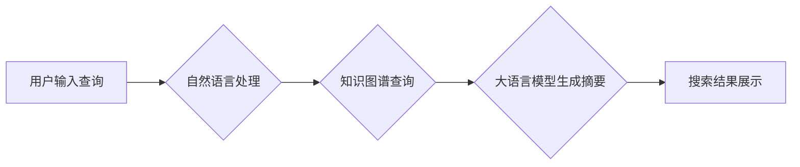

                 

## 微软AI战略：Bing升级

> 关键词：人工智能、大语言模型、搜索引擎、Bing、OpenAI、ChatGPT、自然语言处理、知识图谱

## 1. 背景介绍

在科技发展日新月异的今天，人工智能（AI）已成为引领未来发展的核心力量。作为科技巨头，微软深谙此道，积极布局AI战略，将其融入各个产品和服务中。其中，Bing搜索引擎的升级是微软AI战略的重要组成部分。

传统的搜索引擎主要依靠关键词匹配和网页排名算法来提供搜索结果。然而，随着用户搜索行为的复杂化和信息量的爆炸式增长，传统的搜索方式已难以满足用户日益增长的需求。

微软意识到，要打造更智能、更人性化的搜索体验，必须借助人工智能的力量。因此，微软与OpenAI达成战略合作，将OpenAI的先进AI技术，特别是其旗舰产品ChatGPT，整合到Bing搜索引擎中。

## 2. 核心概念与联系

Bing的升级的核心概念是将大语言模型（LLM）技术融入搜索引擎，从而实现更智能、更精准、更富有交互性的搜索体验。

**2.1 核心概念原理**

* **大语言模型（LLM）：** 是一种能够理解和生成人类语言的深度学习模型。通过训练海量文本数据，LLM可以学习语言的语法、语义和上下文关系，从而实现文本生成、翻译、摘要、问答等多种任务。
* **搜索引擎：** 是一种信息检索系统，通过索引和排名网页来帮助用户查找所需信息。传统的搜索引擎主要依靠关键词匹配和网页排名算法来提供搜索结果。
* **自然语言处理（NLP）：** 是一门研究计算机如何理解和处理人类语言的技术。NLP技术在Bing的升级中扮演着至关重要的角色，它使Bing能够理解用户的自然语言查询，并提供更精准、更相关的搜索结果。

**2.2 架构流程图**



## 3. 核心算法原理 & 具体操作步骤

**3.1 算法原理概述**

Bing的升级的核心算法是基于Transformer架构的LLM，它能够理解和生成人类语言，并根据用户的查询进行信息检索和生成。

**3.2 算法步骤详解**

1. **用户输入查询：** 用户输入自然语言查询，例如“今天的天气怎么样”。
2. **自然语言处理：** Bing使用NLP技术对用户的查询进行分析，识别关键词和语义，并将其转换为机器可理解的格式。
3. **知识图谱查询：** Bing的知识图谱包含了大量结构化的知识，例如城市、天气、日期等。NLP处理后的查询会与知识图谱进行匹配，获取相关信息。
4. **大语言模型生成摘要：** Bing使用LLM对知识图谱中的信息进行分析和总结，生成一个简洁、准确的摘要，例如“今天北京的天气是晴朗”。
5. **搜索结果展示：** Bing将生成的摘要以及相关网页链接展示给用户，提供更全面、更智能的搜索结果。

**3.3 算法优缺点**

* **优点：**
    * 能够理解用户的自然语言查询，提供更精准、更相关的搜索结果。
    * 可以生成简洁、准确的摘要，帮助用户快速获取信息。
    * 能够提供更丰富的搜索体验，例如对话式搜索、个性化推荐等。
* **缺点：**
    * 需要大量的训练数据和计算资源。
    * 可能会出现生成错误信息或偏见性的结果。
    * 对于一些特定领域的查询，可能无法提供准确的结果。

**3.4 算法应用领域**

* 搜索引擎
* 聊天机器人
* 文本生成
* 翻译
* 问答系统
* 个性化推荐

## 4. 数学模型和公式 & 详细讲解 & 举例说明

**4.1 数学模型构建**

LLM的训练过程本质上是一个优化问题，目标是找到一个模型参数，使得模型在训练数据上表现最佳。常用的数学模型包括：

* **交叉熵损失函数：** 用于衡量模型预测结果与真实结果之间的差异。

$$
Loss = - \sum_{i=1}^{N} y_i \log(p_i)
$$

其中：

* $N$ 是样本数量
* $y_i$ 是真实标签
* $p_i$ 是模型预测概率

* **梯度下降算法：** 用于更新模型参数，使得损失函数最小化。

**4.2 公式推导过程**

梯度下降算法的基本原理是沿着损失函数的负梯度方向更新模型参数。

$$
\theta = \theta - \alpha \nabla Loss(\theta)
$$

其中：

* $\theta$ 是模型参数
* $\alpha$ 是学习率
* $\nabla Loss(\theta)$ 是损失函数对模型参数的梯度

**4.3 案例分析与讲解**

假设我们训练一个LLM模型，目标是预测下一个单词。训练数据是一个句子：“The cat sat on the”。模型需要学习到“the”后面通常是“mat”或“chair”等单词。

通过训练，模型会学习到“the”和“mat”或“chair”之间的概率关系。当输入“The cat sat on the”时，模型会根据学习到的概率关系预测下一个单词是“mat”或“chair”。

## 5. 项目实践：代码实例和详细解释说明

**5.1 开发环境搭建**

* Python 3.7+
* TensorFlow 或 PyTorch
* CUDA 和 cuDNN (可选，用于GPU加速)

**5.2 源代码详细实现**

由于篇幅限制，这里只提供一个简单的LLM模型训练代码示例，完整的代码可以参考开源项目或相关文献。

```python
import tensorflow as tf

# 定义模型结构
model = tf.keras.Sequential([
    tf.keras.layers.Embedding(input_dim=vocab_size, output_dim=embedding_dim),
    tf.keras.layers.LSTM(units=hidden_size),
    tf.keras.layers.Dense(units=vocab_size, activation='softmax')
])

# 编译模型
model.compile(loss='sparse_categorical_crossentropy', optimizer='adam')

# 训练模型
model.fit(x_train, y_train, epochs=10)

# 保存模型
model.save('my_llm_model.h5')
```

**5.3 代码解读与分析**

* `Embedding` 层将单词转换为稠密的向量表示。
* `LSTM` 层是一个循环神经网络层，能够捕捉文本序列中的上下文关系。
* `Dense` 层是一个全连接层，用于预测下一个单词的概率分布。
* `sparse_categorical_crossentropy` 是用于分类任务的损失函数。
* `adam` 是一个常用的优化算法。

**5.4 运行结果展示**

训练完成后，可以将模型用于预测下一个单词，例如：

```python
text = "The cat sat on the"
prediction = model.predict(text)
next_word = tf.math.argmax(prediction).numpy()
print(next_word)
```

## 6. 实际应用场景

Bing的升级将带来一系列新的应用场景：

* **更智能的搜索体验：** 用户可以利用自然语言进行搜索，获得更精准、更相关的搜索结果。
* **对话式搜索：** 用户可以与Bing进行对话式交互，更深入地了解信息。
* **个性化推荐：** Bing可以根据用户的搜索历史和偏好，提供个性化的搜索结果和推荐。
* **内容创作辅助：** Bing可以帮助用户生成文本、翻译语言、撰写邮件等。

**6.4 未来应用展望**

Bing的升级将推动搜索引擎向更智能、更人性化的方向发展，未来可能出现以下应用场景：

* **多模态搜索：** 用户可以利用图像、音频等多种形式的数据进行搜索。
* **实时信息查询：** Bing可以提供实时更新的信息，例如天气预报、股票行情等。
* **虚拟助手：** Bing可以成为一个更智能的虚拟助手，帮助用户完成各种任务。

## 7. 工具和资源推荐

**7.1 学习资源推荐**

* **Stanford CS224N: Natural Language Processing with Deep Learning:** https://web.stanford.edu/class/cs224n/
* **Deep Learning Specialization by Andrew Ng:** https://www.deeplearning.ai/
* **Hugging Face Transformers:** https://huggingface.co/docs/transformers/index

**7.2 开发工具推荐**

* **TensorFlow:** https://www.tensorflow.org/
* **PyTorch:** https://pytorch.org/
* **Jupyter Notebook:** https://jupyter.org/

**7.3 相关论文推荐**

* **Attention Is All You Need:** https://arxiv.org/abs/1706.03762
* **BERT: Pre-training of Deep Bidirectional Transformers for Language Understanding:** https://arxiv.org/abs/1810.04805

## 8. 总结：未来发展趋势与挑战

**8.1 研究成果总结**

Bing的升级标志着人工智能技术在搜索引擎领域的重大突破。LLM技术使得搜索引擎能够更智能地理解用户需求，提供更精准、更丰富的搜索体验。

**8.2 未来发展趋势**

* **多模态搜索：** 将图像、音频等多种数据类型整合到搜索引擎中。
* **个性化搜索：** 根据用户的兴趣、偏好和行为提供个性化的搜索结果。
* **实时信息查询：** 提供实时更新的信息，例如新闻、天气预报等。
* **对话式搜索：** 用户可以与搜索引擎进行自然语言对话，更深入地了解信息。

**8.3 面临的挑战**

* **数据安全和隐私保护：** 训练LLM模型需要大量数据，如何保证数据的安全和隐私是重要的挑战。
* **算法偏见和公平性：** LLM模型可能会学习到数据中的偏见，导致搜索结果不公平。
* **可解释性和透明度：** LLM模型的决策过程往往难以理解，如何提高模型的可解释性和透明度是重要的研究方向。

**8.4 研究展望**

未来，LLM技术将继续发展，推动搜索引擎向更智能、更人性化的方向发展。研究者将致力于解决数据安全、算法偏见、可解释性等挑战，使搜索引擎成为更强大、更可靠的工具。

## 9. 附录：常见问题与解答

**Q1：Bing的升级会对现有搜索引擎造成什么影响？**

A1：Bing的升级将推动整个搜索引擎行业向更智能、更人性化的方向发展。其他搜索引擎也需要积极拥抱人工智能技术，才能保持竞争力。

**Q2：Bing的升级对用户有什么好处？**

A2：Bing的升级将为用户带来更智能、更精准、更丰富的搜索体验。用户可以利用自然语言进行搜索，获得更相关的信息，并享受更便捷的搜索服务。

**Q3：Bing的升级会取代传统的搜索引擎吗？**

A3：不太可能。传统的搜索引擎仍然有其价值，例如处理结构化数据、提供快速结果等。LLM技术将补充传统的搜索引擎，为用户提供更全面的搜索体验。


作者：禅与计算机程序设计艺术 / Zen and the Art of Computer Programming 
<end_of_turn>

